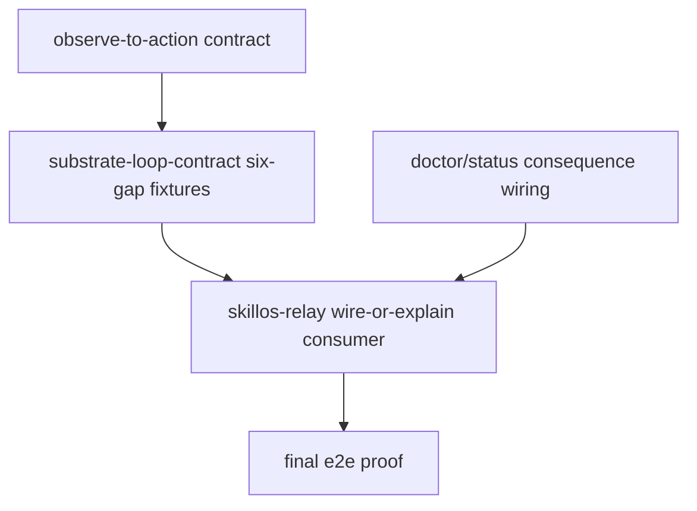

# PARADIGM - Substrate Self-Organization Across Five Same-Day Gaps
Generated: 2026-05-04
Mode: plan-space read-only synthesis
Task: `paradigm-donella-substrate-self-org-37c420`
Output: `.flywheel/PARADIGM-substrate-self-organization-2026-05-04.md`

## 0. Verdict
Five surfaced gaps on 2026-05-04 are one systems pattern, not five unrelated misses.
The substrate observes.
The substrate logs.
The substrate broadcasts.
The substrate sometimes exposes doctor/status fields.
The substrate does not reliably self-organize repair.
The common structural mistake is treating an observation surface as if it were a feedback loop.
In Meadows terms, flywheel added #6 information flows without binding those flows to #5 rules and #4 self-organization.
The recommended meta-intervention is `L110 - SUBSTRATE-PRIMITIVES-DECLARE-SELF-REPAIR-LOOP`.
The recommended implementation carrier is orch-monitor Phase 4, as one meta bead plus acceptance amendments.
The Jeff alignment is `extend`: compose with Jeff's row/ledger/routing primitives, but add Joshua's self-repair contract layer.

## 1. Required Survey
Socraticode preflight:
```text
socraticode_queries=4
indexed_chunks_observed=443
projectPath=/Users/josh/Developer/flywheel
```
Skills applied:
```text
primary=donella-meadows-systems-thinking
support=gate-truth-separation,lean-formal-feedback-loop
```
Gate separation used:
1. Wire-or-explain is an artifact-consumption flow gate.
2. Orch-monitor is an observation-to-action flow gate.
3. Beads maintenance is a safe-mutation gate.
4. Agent Mail registration is an identity-readiness gate.
5. Worker branch/DCG is a substrate-loss prevention gate.
6. None of the five is a code-correctness gate.
7. None of the five is a mission-value gate.
8. None of the five alone authorizes destructive shared-state repair.

## 2. Pattern Statement
Flywheel repeatedly has primitives that see a recurring condition but do not own the outflow that drains it.
Wire-or-explain sees shipped artifacts but cannot yet require downstream consumption.
Beads DB diagnostics see SQLite maintenance symptoms but do not run a safe maintenance window.
Watcher runtime daemons exist but repo-local installation invariants do not propagate them.
Agent Mail broadcasts ask live panes to register but do not close rows into active, deferred, or blocked states.
The worker-commit orphan class saw output vanish because dispatch, DCG, and memory were not arranged as one self-protecting merge loop.
The paradigm gap is therefore: "observable" has been treated as "operational."
The corrected paradigm is: "operational" means the stock has a declared drain, owner, action ledger, and proof witness.

## 3. Boundary
For this synthesis, "substrate" means the operational layer that lets the agent fleet observe, coordinate, protect, and repair its own work.
Included components:
1. `ntm`
2. `beads_rust` / `br`
3. `dcg`
4. `cass`
5. Agent Mail
6. JSONL state files
7. launchd jobs
8. tick handlers
9. doctor fields
10. status commands
11. dispatch templates
12. callback validators
13. identity registry rows
14. maintenance ledgers
15. fuckup-log and promotion ladders
Boundary rule:
```text
If a primitive can cause the fleet to stop, dispatch, recover, defer, mutate state,
block a command, or notify Joshua, it is substrate.
```
Excluded:
1. Product feature behavior.
2. Manual dashboard interpretation.
3. One-off pane scrollback.
4. Human memory as the only drain.

## 4. Source Ledger
1. Wire-or-explain r2 says shipped artifacts close as if existence equals consumption and proposes a close gate: `.flywheel/plans/wire-or-explain-tick-gate-2026-05-04/02-REFINE-r2.md:7-18`.
2. Wire-or-explain r2 defines resolution states: `.flywheel/plans/wire-or-explain-tick-gate-2026-05-04/02-REFINE-r2.md:33-44`.
3. Wire-or-explain r2 absorbs Finding 9: `.flywheel/plans/wire-or-explain-tick-gate-2026-05-04/02-REFINE-r2.md:166-192`.
4. Wire-or-explain r2 names B13-B15 acceptance gates: `.flywheel/plans/wire-or-explain-tick-gate-2026-05-04/02-REFINE-r2.md:397-425`.
5. Wire-or-explain intent names the unwired-output stock and missing loop: `.flywheel/plans/wire-or-explain-tick-gate-2026-05-04/00-INTENT.md:11-17`.
6. Wire-or-explain intent lists six concrete unwired artifacts: `.flywheel/plans/wire-or-explain-tick-gate-2026-05-04/00-INTENT.md:21-32`.
7. Wire-or-explain intent states Finding 9: `.flywheel/plans/wire-or-explain-tick-gate-2026-05-04/00-INTENT.md:166-177`.
8. Orch-monitor r1 says observability is not action authority: `.flywheel/plans/orch-monitor-recovery-auto-act-2026-05-04/02-REFINE-r1.md:10-21`.
9. Orch-monitor r1 names unacted fleet supervision debt: `.flywheel/plans/orch-monitor-recovery-auto-act-2026-05-04/02-REFINE-r1.md:72-83`.
10. Orch-monitor r1 defines tick-first supervision rhythm: `.flywheel/plans/orch-monitor-recovery-auto-act-2026-05-04/02-REFINE-r1.md:103-128`.
11. Orch-monitor r1 absorbs watcher, Beads DB, and Agent Mail beads: `.flywheel/plans/orch-monitor-recovery-auto-act-2026-05-04/02-REFINE-r1.md:265-337`.
12. Orch-monitor r1 says B1 separates "probe says" from "fleet acted": `.flywheel/plans/orch-monitor-recovery-auto-act-2026-05-04/02-REFINE-r1.md:441-445`.
13. Worker watcher audit says runtime watchers exist but repo-local substrate is absent or partial: `/tmp/worker-watcher-propagation-output.md:8-16`.
14. Worker watcher audit inventories installed and missing watcher surfaces: `/tmp/worker-watcher-propagation-output.md:96-149`.
15. Worker watcher audit recommends Option C: `/tmp/worker-watcher-propagation-output.md:165-211`.
16. Beads DB audit says doctor observes narrow health fields and no maintenance action: `/tmp/beadsdb-vacuum-gap-output.md:23-54`.
17. Beads DB audit lists missing maintenance fields: `/tmp/beadsdb-vacuum-gap-output.md:238-269`.
18. Beads DB audit defines `safe_to_vacuum`: `/tmp/beadsdb-vacuum-gap-output.md:555-658`.
19. Beads DB audit recommends Option A and specific fields: `/tmp/beadsdb-vacuum-gap-output.md:753-777`.
20. Beads DB audit proposes four Phase 4 beads: `/tmp/beadsdb-vacuum-gap-output.md:937-1018`.
21. Agent Mail audit says three live panes remain `needs_registration` after broadcasts: `/tmp/agentmail-registration-substrate-fix-output.md:11-29`.
22. Agent Mail audit names affected rows and missing token proof: `/tmp/agentmail-registration-substrate-fix-output.md:52-79`.
23. Agent Mail audit proves historical sends fired but did not close rows: `/tmp/agentmail-registration-substrate-fix-output.md:132-153`.
24. Agent Mail audit recommends a structural maintenance loop: `/tmp/agentmail-registration-substrate-fix-output.md:218-250`.
25. Agent Mail audit proposes three structural beads: `/tmp/agentmail-registration-substrate-fix-output.md:267-336`.
26. Jeff archaeology says no exact wire-or-explain primitive exists: `/tmp/jeff-corpus-archaeology-wire-or-explain-output.md:19-23`.
27. Jeff archaeology says row shape should be adopted and multi-writer routing extended: `/tmp/jeff-corpus-archaeology-wire-or-explain-output.md:38-50`.
28. Jeff archaeology lists Joshua-original greenfield primitives: `/tmp/jeff-corpus-archaeology-wire-or-explain-output.md:114-124`.
29. Jeff archaeology warns to reuse row shape, not per-session cache keying: `/tmp/jeff-corpus-archaeology-wire-or-explain-output.md:129-151`.
30. Donella leverage references name the canonical 12-point ladder: `/Users/josh/.claude/skills/donella-meadows-systems-thinking/references/LEVERAGE-POINTS.md:18-41`.
31. Donella stock/flow references define stock, inflow, outflow, buffer, and bottleneck: `/Users/josh/.claude/skills/donella-meadows-systems-thinking/references/STOCKS-AND-FLOWS.md:13-25`.

## 5. The Five Stocks
### S1 - Unwired Artifacts
Definition: artifacts shipped but not consumed by an independent downstream actor.
Evidence:
1. Intent names the stock directly as unwired-output backlog at `00-INTENT.md:11-17`.
2. Intent lists six concrete unwired artifacts at `00-INTENT.md:21-32`.
3. REFINE r2 says each artifact must resolve to `wired`, `deferred`, `unwired`, `questionably_wired`, `not_required`, or `bypassed` at `02-REFINE-r2.md:33-44`.
Inflow:
1. New scripts.
2. New doctor fields.
3. New status lines.
4. New L-rules.
5. New slash commands.
Current outflow:
1. Manual follow-up.
2. Occasional plan beads.
3. Human irritation.
Missing self-drain: tick-close consumer proof or bounded deferral.
Measurement: `unwired_artifact_count_24h`, top oldest, top downstream cost.

### S2 - Beads DB Maintenance Debt
Definition: SQLite/Beads health symptoms accumulating without a safe maintenance loop.
Evidence:
1. Beads audit says doctor reports integrity, leakage, null notes, and WAL size but not maintenance state at `/tmp/beadsdb-vacuum-gap-output.md:23-31`.
2. The audit says the symptom family recurred after a Workaround D rebuild and across repos at `/tmp/beadsdb-vacuum-gap-output.md:32-40`.
3. Missing fields are listed at `/tmp/beadsdb-vacuum-gap-output.md:238-253`.
Inflow:
1. `br` writes.
2. Rebuilds.
3. Freelist growth.
4. WAL churn.
5. Multi-pane pressure.
Current outflow:
1. Manual VACUUM.
2. Manual Workaround D.
3. Generic doctor repair label.
Missing self-drain: supervision-first maintenance predicate plus lease plus ledgered action.
Measurement: page count, freelist count, auto-vacuum, last vacuum, safe predicate clauses.

### S3 - Non-Propagated Watcher Coverage
Definition: repos and sessions expected to have watcher/frozen detection coverage but missing repo-local manifests, launchd expectations, or alias mapping.
Evidence:
1. Watcher audit says watchers are present for 3/6 and repo-local substrate is full for 1/6, partial for 1/6 at `/tmp/worker-watcher-propagation-output.md:8-16`.
2. Inventory shows runtime plists but absent local substrate in several repos at `/tmp/worker-watcher-propagation-output.md:98-119`.
3. Install templates are missing watcher/frozen/stall/plist/status templates at `/tmp/worker-watcher-propagation-output.md:137-149`.
Inflow:
1. New repos.
2. Renamed sessions.
3. Disabled plists.
4. Template drift.
5. Alias mismatch.
Current outflow:
1. Ad hoc central watcher setup.
2. Occasional audit.
Missing self-drain: installer/onboard propagation plus doctor comparison of expected vs actual.
Measurement: watchers expected, loaded, recent evidence, alias mismatch count.

### S4 - Agent Mail Needs-Registration Rows
Definition: live session:pane identity registry rows that remain not Agent-Mail-ready.
Evidence:
1. Agent Mail audit says three live panes remain `needs_registration` with `agent_mail_ready=false` at `/tmp/agentmail-registration-substrate-fix-output.md:11-13`.
2. Three rows and missing token proof are shown at `/tmp/agentmail-registration-substrate-fix-output.md:52-79`.
3. Broadcasts fired and did not close rows at `/tmp/agentmail-registration-substrate-fix-output.md:132-153`.
Inflow:
1. New panes.
2. Identity rotations.
3. MCP disconnects.
4. Missing token proof.
5. Dead-session rows.
Current outflow:
1. Broadcast prompts.
2. Manual resolver invocation.
Missing self-drain: resolver-mediated registration maintenance loop with no-raw-token receipts.
Measurement: live blockers, dead deferrals, action receipts, token-path proof count.

### S5 - Orphan Commit / Substrate-Loss Risk
Definition: worker-produced commits not protected by branch, remote ref, or reset-time blocker.
Evidence:
1. Finding 9 says two same-session ALPS instances had local-main worker writes followed by squash/reset orphaning at `00-INTENT.md:166-177`.
2. REFINE r2 maps it to side branches, DCG, and memory at `02-REFINE-r2.md:166-192`.
3. B13-B15 acceptance gates require branch proof, reset block, and memory/learn promotion at `02-REFINE-r2.md:397-425`.
Inflow:
1. Worker local-main commits.
2. Squash merges.
3. Reset cleanup.
4. Missing branch discipline.
Current outflow:
1. Manual cherry-pick.
2. Manual checkout-ref.
3. Recovery after damage.
Missing self-drain: side-branch dispatch contract plus reset-time DCG information flow.
Measurement: branch proof rate, reset block rows, local-main worker commit rejects.

## 6. Flow Matrix
| Stock | Inflow | Current outflow | Missing self-drain | Measurement |
|---|---|---|---|---|
| S1 unwired artifacts | scripts, L-rules, status, probes, corpora | manual follow-up | tick-close ledger requires final state | unresolved count and ranked lists |
| S2 Beads maintenance debt | writes, rebuilds, freelist, WAL | manual repair | safe predicate plus lease plus one action | page/freelist/last-vacuum fields |
| S3 watcher gaps | repo growth, session drift, template omissions | ad hoc watcher setup | manifest plus installer upgrade | expected vs loaded vs evidence |
| S4 registration rows | panes, rotations, missing proof | prompt broadcast | resolver repair into active/deferred/blocked | live blockers and receipts |
| S5 orphan risk | local-main commits and resets | manual recovery | branch rule plus reset-time block | branch proof and DCG blocks |
Flow conclusion:
1. All five stocks have visible inflows.
2. All five have weak or manual outflows.
3. All five need a declared drain.
4. The drain must be owned by a substrate actor, not by Joshua noticing the stock.

## 7. Feedback Loops
### L1 - Artifact Consumption Loop
Should close:
```text
artifact_shipped -> ledger row -> consumer proof -> tick-close decision -> final state
```
Current state: partial.
Evidence:
1. REFINE r2 specifies ledger and close-hook at `02-REFINE-r2.md:11-31`.
2. REFINE r2 has plan-space beads at `02-REFINE-r2.md:85-117`.
3. Runtime tick-close enforcement is not yet installed.
Diagnosis:
1. Observation exists.
2. Planned rule exists.
3. Runtime self-drain is missing.
Highest missing component: close-hook authority.

### L2 - Beads DB Maintenance Loop
Should close:
```text
doctor sees maintenance class -> safe_to_vacuum -> lease -> dry-run/apply -> verify -> ledger
```
Current state: missing.
Evidence:
1. Existing doctor fields omit maintenance-specific state at `/tmp/beadsdb-vacuum-gap-output.md:238-253`.
2. Safe predicate is proposed at `/tmp/beadsdb-vacuum-gap-output.md:555-658`.
3. Option A recommends tick sub-step at `/tmp/beadsdb-vacuum-gap-output.md:753-777`.
Diagnosis:
1. Symptom fields exist.
2. Action class is underspecified.
3. Safe mutation predicate is not wired into tick.
Highest missing component: safe predicate with action lease.

### L3 - Watcher Propagation Loop
Should close:
```text
repo onboarded -> manifest expected -> launchd expected -> watcher runs -> pane evidence -> doctor compares -> repair
```
Current state: partial.
Evidence:
1. Central logic exists at `/tmp/worker-watcher-propagation-output.md:127-135`.
2. Template gap is explicit at `/tmp/worker-watcher-propagation-output.md:137-149`.
3. Option C is recommended at `/tmp/worker-watcher-propagation-output.md:165-211`.
Diagnosis:
1. Runtime watcher exists in some places.
2. Repo-local invariant does not exist.
3. Installer/onboard does not self-propagate watcher substrate.
Highest missing component: repo-local manifest plus installer upgrade path.

### L4 - Agent Mail Registration Loop
Should close:
```text
identity doctor sees live needs_registration -> resolver repair -> active/deferred/blocked -> readiness updated
```
Current state: partial.
Evidence:
1. Broadcast script identifies and sends no-token prompts at `/tmp/agentmail-registration-substrate-fix-output.md:103-117`.
2. Historical sends did not close rows at `/tmp/agentmail-registration-substrate-fix-output.md:132-153`.
3. Option C/D proposes maintenance loop at `/tmp/agentmail-registration-substrate-fix-output.md:218-250`.
Diagnosis:
1. Reminder loop exists.
2. Repair loop does not.
3. Token proof must remain path/hash proof, not pane-text secret.
Highest missing component: resolver repair CLI with no-raw-token receipt contract.

### L5 - Worker Commit Substrate-Loss Loop
Should close:
```text
dispatch -> worker branch -> callback branch proof -> orchestrator merge -> DCG reset block -> memory/learn
```
Current state: missing.
Evidence:
1. Finding 9 records the event class at `00-INTENT.md:166-177`.
2. REFINE r2 defines three layers at `02-REFINE-r2.md:170-190`.
3. Acceptance gates B13-B15 require branch proof, reset block, and memory/learn at `02-REFINE-r2.md:397-425`.
Diagnosis:
1. Loss is detected after damage.
2. Branch rule would prevent wrong topology.
3. DCG rule exposes danger at the reset moment.
4. Memory/learn converts recurrence to doctrine.
Highest missing component: dispatch branch contract plus reset-time DCG information flow.

## 8. Iceberg Analysis
### G1 - Wire-Or-Explain
Surface: artifacts ship and tick closes.
Pattern: ship-then-orphan.
Structure: producer surfaces are rewarded, consumer proof is optional.
Mental model: shipping a file is treated as shipping behavior.
Paradigm correction: an artifact is not shipped until it enters a loop or has bounded deferral.

### G2 - Beads DB Maintenance
Surface: unused pages, WAL, or corruption-adjacent symptoms recur.
Pattern: maintenance appears as incident response.
Structure: doctor fields are narrow and action classes are collapsed.
Mental model: database maintenance is operator work.
Paradigm correction: safe substrate maintenance is normal operation when a predicate proves the window.

### G3 - Watcher Propagation
Surface: some watchers run but repo-local substrate is absent.
Pattern: coverage drifts as repos and sessions change.
Structure: templates omit watcher manifest/plist/status expectations.
Mental model: a central daemon equals fleet coverage.
Paradigm correction: watcher coverage is an installed repo invariant backed by central logic.

### G4 - Agent Mail Registration
Surface: live panes stay `needs_registration` after broadcasts.
Pattern: reminders repeat but rows remain unresolved.
Structure: broadcast owns prompt delivery, not identity closure.
Mental model: recipient action is the repair.
Paradigm correction: identity substrate owns row closure into active, deferred, or blocked.

### G5 - Worker Commit Orphan
Surface: worker commits become unreachable after orch merge/reset.
Pattern: recovery happens after substrate loss.
Structure: dispatch lacks branch topology and DCG lacks reset-time loss block.
Mental model: local main cleanup is harmless housekeeping.
Paradigm correction: worker output is substrate and must be protected before history repair.

## 9. Meadows 12-Point Ladder
Canonical order, increasing effectiveness:
1. #12 Constants, parameters, numbers.
2. #11 Buffers and stabilizing stocks relative to flows.
3. #10 Material stock-and-flow structure.
4. #9 Delays relative to system change rate.
5. #8 Negative feedback loop strength.
6. #7 Positive feedback loop gain.
7. #6 Information flows.
8. #5 Rules of the system.
9. #4 Self-organization.
10. #3 Goals.
11. #2 Paradigms.
12. #1 Transcending paradigms.
Source: `LEVERAGE-POINTS.md:18-41`.
Dispatch shorthand note:
1. This document uses canonical 1999 numbering.
2. #6 is information flows.
3. #5 is rules.
4. #4 is self-organization.

## 10. Per-Gap Leverage Ranking
### G1 - Wire-Or-Explain
Candidate ladder:
1. #12 tune unresolved thresholds.
2. #11 add backlog buffers.
3. #10 add ledger topology and consumer registry.
4. #9 shorten detection delay at tick close.
5. #8 strengthen close-hook correction.
6. #7 damp ship-then-orphan gain.
7. #6 expose unresolved lists and top-5 priority slices.
8. #5 change rule: no green close with unresolved shipped artifacts.
9. #4 let substrate evolve artifact classes and consumers.
10. #3 optimize for artifact utilization.
11. #2 shift from "ship file" to "enter loop."
12. #1 choose shipping or wiring paradigm by context.
Highest practical leverage: #5 Rules.
Reason: information exists; the missing force is a tick-close contract.
Intervention: every ship event must resolve before tick close.
Measurement: unresolved count, close-hook rows, shadow-would-block rows.

### G2 - Beads DB Maintenance
Candidate ladder:
1. #12 tune freelist thresholds.
2. #11 add backups.
3. #10 separate live DB, safe copy, JSONL authority, and maintenance ledger.
4. #9 require last writer age and quiescence delay.
5. #8 strengthen doctor-to-maintenance correction.
6. #7 damp corruption/repair recurrence.
7. #6 expose page count, freelist count, auto-vacuum, and predicate clauses.
8. #5 rule: VACUUM only under safe predicate; hard corruption routes elsewhere.
9. #4 add new maintenance classes without Joshua routing each recurrence.
10. #3 optimize for durable Beads throughput.
11. #2 shift from repair incident to maintenance lifecycle.
12. #1 avoid assuming auto-maintenance or manual caution is always right.
Highest practical leverage: #5 Rules.
Reason: mutation-risky substrate needs an explicit safe-action rule.
Intervention: tick-first maintenance action with `safe_to_vacuum`, L94 lease, hard-corruption exclusion, and one-action-per-tick.
Measurement: predicate clauses, maintenance ledger rows, last vacuum, freelist count.

### G3 - Watcher Propagation
Candidate ladder:
1. #12 tune frozen/idle thresholds.
2. #11 add spare watcher processes.
3. #10 change topology to central logic plus repo-local manifests.
4. #9 reduce drift detection delay.
5. #8 strengthen coverage correction.
6. #7 damp silent-drift amplification.
7. #6 expose expected vs actual coverage.
8. #5 rule: installed repos must declare watcher expectation.
9. #4 installer/onboard evolves coverage as repos and sessions change.
10. #3 optimize for continuous recovery.
11. #2 shift from daemon-exists to coverage-invariant.
12. #1 keep global and repo-local frames both available.
Highest practical leverage: #10 Material stock-and-flow structure.
Reason: central logic is disconnected from repo-local expected state.
Intervention: central daemon owns logic; each repo owns watcher manifest, launchd expectation, alias map, and coverage receipt.
Measurement: watchers expected, loaded, recent evidence, alias mismatches.

### G4 - Agent Mail Registration
Candidate ladder:
1. #12 shorten broadcast de-dupe.
2. #11 add token fallback paths.
3. #10 separate registry rows, token vault, resolver, and receipts.
4. #9 reduce live-row stale time.
5. #8 strengthen registration correction loop.
6. #7 damp repeated reminder gain.
7. #6 expose live blockers separately from dead deferrals.
8. #5 rule: live needs-registration rows must close to active/deferred/blocked.
9. #4 identity substrate repairs rows through resolver-mediated paths.
10. #3 optimize for readiness, not prompt delivery.
11. #2 shift from recipient-acts to substrate-closes.
12. #1 avoid treating no-raw-token as no-action or unsafe-action by default.
Highest practical leverage: #5 Rules.
Reason: broadcast information already exists; the missing rule is row closure.
Intervention: live rows without action receipts halt readiness; resolver repair writes active, deferral, or blocked receipt without raw token text.
Measurement: live blockers, dead deferrals, action receipts, token-path proof.

### G5 - Worker Commit Orphan
Candidate ladder:
1. #12 add reset warnings.
2. #11 rely on reflog buffer.
3. #10 change git topology to worker branches.
4. #9 expose reset danger before rewrite.
5. #8 strengthen reset correction loop.
6. #7 damp loss/recovery recurrence.
7. #6 surface orphan risk at reset time.
8. #5 rule: workers never commit directly to local main for dispatches.
9. #4 dispatch/DCG/memory update together when new loss classes appear.
10. #3 optimize for substrate preservation.
11. #2 shift from git cleanup to artifact reachability.
12. #1 hold branch hygiene and local velocity in tension.
Highest practical leverage: #5 Rules.
Reason: loss prevention needs upfront topology, with reset-time information as backup.
Intervention: dispatch requires worker side branches; DCG blocks reset that would orphan a worker commit; callbacks report branch/ref proof.
Measurement: local-main rejects, branch proof rate, reset block rows, `substrate_loss_guard=PASS`.

## 11. Cross-Gap Convergence
Root structural mistake:
```text
Flywheel treats substrate observations as terminal outputs instead of requiring
each observation to declare and execute a repair loop or explicit no-auto-repair contract.
```
What repeats:
1. Producer is wired.
2. Observer is wired.
3. Action owner is missing or optional.
4. Ledger records state but not closure.
5. Tick can still close.
6. Human notices the accumulating stock.
Why one fix can help all five:
1. S1 needs consumer proof or owned deferral.
2. S2 needs safe maintenance action or hard-corruption routing.
3. S3 needs expected-vs-actual watcher coverage repair.
4. S4 needs live row closure.
5. S5 needs branch/reachability proof before reset.
Correct leverage blend:
```text
#6 information flows -> #5 rules -> #4 self-organization
```
Why not just #6:
1. Information already exists in all five gaps.
2. More fields alone create more dashboards.
3. The missing layer is action binding.
Why not just #4:
1. Self-organization without rules becomes daemon sprawl.
2. Mutation-risky substrates need predicates.
3. Identity substrates need secret boundaries.
4. Git substrates need refusal points.

## 12. Recommended Meta-Interventions
### M1 - L110 Canonical Rule
Draft:
```text
Every new or extended flywheel substrate primitive that observes a recurring
condition must declare its stock, inflow, outflow, repair owner, action class,
action ledger, verification probe, and tick/status consequence. If automatic
repair is unsafe or intentionally absent, it must declare
explicit_no_auto_repair_reason, repair_owner, and escalation threshold. A probe
without this contract is an observation surface, not operational substrate.
```
Leverage point: #5 Rules.
Why:
1. It changes the substrate work contract.
2. It prevents observation-only probes from claiming operational completeness.
3. It applies to all five current gaps and future ones.
Metrics:
1. `substrate_primitives_without_repair_contract_count`
2. `observation_only_probe_count`
3. `self_repair_contract_valid_count`

### M2 - `substrate-loop-contract/v1`
Required fields:
1. `schema_version`
2. `primitive_id`
3. `owner_repo`
4. `substrate_component`
5. `stock_name`
6. `stock_measure`
7. `inflow_events`
8. `outflow_events`
9. `repair_owner`
10. `repair_action`
11. `repair_command`
12. `explicit_no_auto_repair_reason`
13. `action_ledger`
14. `verification_probe`
15. `safe_mutation_predicate`
16. `secret_boundary`
17. `tick_consequence`
18. `status_consequence`
19. `wire_or_explain_row_class`
20. `last_verified_ts`
Leverage point: #4 Self-organization.
Why:
1. New substrate components can add loops using one shape.
2. Doctor can validate contracts mechanically.
3. Dispatch templates can require the schema before accepting new probes.
Metrics:
1. `contract_schema_pass_rate`
2. `contract_verification_age_seconds`
3. `repair_loop_witness_count`

### M3 - Phase 4 + Skill Exemplar Gate
Audit question:
```text
What stock does this substrate primitive drain, and what loop drains it?
```
Leverage point: #2 Paradigms, implemented through #4 and #5.
Why:
1. It changes how agents interpret substrate work.
2. It prevents "probe exists" from feeling equivalent to "system acts."
3. It gives future plan-space audits a reusable exemplar.
Metrics:
1. `phase4_substrate_loop_answer_rate`
2. `donella_exemplar_reuse_count`
3. `plans_flagging_observation_without_action_count`

## 13. Phase 4 Absorption Recommendation
Recommendation:
```text
Layer into `orch-monitor-recovery-auto-act-2026-05-04`, not a standalone plan.
```
Reason:
1. Orch-monitor r1 already owns observation-to-action supervision truth.
2. It absorbed watcher, Beads DB, and Agent Mail into the 27-bead DAG at `02-REFINE-r1.md:265-337`.
3. It says B1 separates "probe says" from "fleet acted" at `02-REFINE-r1.md:441-445`.
4. A separate plan would create a sixth observation artifact unless wire-or-explain consumed it immediately.
Proposed meta bead:
```text
B28 - substrate-loop-contract-l110
```
Suggested dependencies:
1. Depends on orch-monitor B1 because the tick-first handler must consume contract validation.
2. Depends on B11 because doctor fields must surface contract failures.
3. Feeds B13 because doctrine lands after mechanics prove shape.
4. Feeds B14 because operator surface should show last action, not only score.
5. Feeds B21-B27 because Beads DB and Agent Mail are immediate proving grounds.
Acceptance gates:
1. `substrate-loop-contract/v1` schema exists.
2. Validator accepts fixtures for all five gaps.
3. Validator rejects observation-only probe with no action or no-auto-repair reason.
4. Doctor emits `substrate_loop_contract_missing_count`.
5. Status shows compact substrate-loop contract line.
6. Dispatch template for substrate work requires contract fields.
7. L110 draft cites this five-gap convergence artifact.
8. Dogfood import classifies at least these five gaps.
Fallback if bead cap cannot absorb B28:
1. Amend B1, B11, B13, B14, B21, B23, B25, and B27 with L110 acceptance gates.
2. Do not start a separate plan unless orch-monitor Phase 4 is frozen or another repo family shows the same shape after implementation begins.

## 14. Greenfield-vs-Jeff Alignment
Verdict:
```text
jeff_prior_art_alignment=extend
```
Adopt from Jeff:
1. Append-only JSONL row shape with stable IDs and hash chain.
2. Schema-version naming convention from `beads_rust`.
3. Sequence-number monotonic guard.
4. Chain verification.
5. Merkle witness for drift checks.
6. Result/exit-code shape where useful.
Extend from Jeff:
1. Agent Mail multi-writer project/registration model.
2. Bootstrap recursion patterns from AuditLogger first-write and Beads fixtures.
3. DCG hook generation for reset-time refusal.
Greenfield in Joshua's layer:
1. Permit-gate hook framework.
2. Shadow/warn/enforce rollout state machine.
3. `wired_into` / `deferred_until` artifact states.
4. Worker side-branch convention.
5. Cross-repo ship event ownership scope.
6. List-and-sort permit-gate output.
7. Cross-substrate self-repair contract.
Conclusion:
```text
This is Jeff-compatible composition with one Joshua-original paradigm layer:
observation primitives must declare self-repair.
```

## 15. Skill Update Recommendation
Recommendation:
```text
exemplar_update_proposed=yes
```
Target:
```text
/Users/josh/.claude/skills/donella-meadows-systems-thinking/data/zeststream-exemplars.json
```
Do not edit the skill in this read-only worker tick.
Proposed exemplar ID:
```text
substrate-self-organization-five-gap-2026-05-04
```
Proposed summary:
```text
Five same-day flywheel substrate gaps showed the same Meadows structure:
information flows existed but did not bind to rules or self-organization.
Stocks accumulated as unwired artifacts, Beads DB maintenance debt,
non-propagated watcher coverage, needs-registration rows, and orphan-commit risk.
The recommended intervention was L110 plus substrate-loop-contract/v1.
```
Why it belongs:
1. It is a clear stock/flow/loop teaching case.
2. It separates #6 information flow from #5 rules and #4 self-organization.
3. It prevents future agents from calling observability "self-organization."
4. It includes proof that dashboards and probes are lower-leverage unless tied to action ownership.
Validation before actual skill edit:
1. Verify this artifact path exists.
2. Add source line references.
3. Run the Donella skill validator.
4. Record provenance in the skill evidence log if required by the skill.

## 16. Anti-Patterns Found
Observation-as-closure:
1. Probe emits JSON.
2. Doctor reads JSON.
3. Status prints JSON.
4. Tick closes.
5. Stock continues rising.
Reminder-as-repair:
1. Broadcast sent.
2. Recipient did not or could not act.
3. De-dupe expires.
4. Same broadcast repeats.
5. Row remains unresolved.
Dashboard-as-owner:
1. Fleet observatory aggregates score.
2. Operator can inspect manually.
3. No action ledger records what the fleet did.
4. Another tick reads and sleeps.
Doctrine-as-runtime:
1. L-rule exists.
2. Template does not enforce it.
3. Doctor does not measure it.
4. Dispatch does not require it.
5. Worker repeats old behavior.
Repair-class-collapse:
1. "Beads DB unhealthy" collapses leakage, WAL, unused pages, hard corruption, and source_repo drift.
2. Safe action differs by class.
3. Generic repair labels block autonomy.
Topology-after-damage:
1. Worker commits are protected only after loss is observed.
2. Correct branch topology should be the starting rule.

## 17. Positive Patterns To Reuse
Pattern 1 - Action ledger over prose:
```text
Every observation that causes or skips action writes a row with action_id, owner, reason, and verification.
```
Pattern 2 - Safe predicate before mutation:
```text
Maintenance actions declare the predicate that makes them safe and log every failed clause.
```
Pattern 3 - Resolver paths over raw secret paths:
```text
Identity repair outputs token_path and token hash proof, never token material.
```
Pattern 4 - Repo-local expected state plus central logic:
```text
Central daemons stay single-implementation; repos carry manifests describing expected coverage.
```
Pattern 5 - Permit gate as first-class substrate:
```text
Refuse-gates stop bad action. Permit-gates ensure required good action entered a loop before closure.
```

## 18. L110 Draft
```text
## L110 - SUBSTRATE-PRIMITIVES-DECLARE-SELF-REPAIR-LOOP

Every flywheel substrate primitive that observes a recurring operational condition
MUST declare a self-repair loop or an explicit no-auto-repair contract before it
can be called shipped substrate.

Required fields:
- stock_name
- stock_measure
- inflow_events
- outflow_events
- repair_owner
- repair_action or explicit_no_auto_repair_reason
- action_ledger
- verification_probe
- tick_consequence
- status_consequence
- safe_mutation_predicate when the action mutates shared state
- secret_boundary when identity or credential material is involved

Forbidden claims:
- "doctor field exists" as closure
- "broadcast sent" as repair
- "dashboard line present" as action
- "L-rule written" as runtime enforcement
- "script exists" as propagation

Cost citation:
2026-05-04 five-gap convergence: wire-or-explain unwired artifacts, Beads DB
maintenance debt, watcher propagation drift, Agent Mail live registration rows,
and worker commit orphan risk all accumulated because information existed without
a declared repair loop.
```

## 19. Implementation Readiness Questions
A Phase 4 bead that touches substrate should answer:
1. What stock is rising, falling, or stuck?
2. What inflow feeds it?
3. What outflow drains it?
4. Which actor owns the drain?
5. What action is safe?
6. What action is unsafe?
7. What predicate separates them?
8. What row records action or deliberate non-action?
9. What proof witness verifies the action?
10. What happens if the actor is down?
11. What happens if the row repeats?
12. What status line shows the result without reading raw ledgers?
Failure rule:
```text
If the bead cannot answer these, it is observation-only and must not claim self-organization.
```

## 20. Metrics
```text
gaps_synthesized=5
stocks_named=5
loops_diagnosed=5
leverage_points_named=12
meta_intervention_count=3
recommended_l_rule=L110
jeff_prior_art_alignment=extend
exemplar_update_proposed=yes
commits_total=0
```

## 21. Self Grade
Self grade:
```text
Y
```
Why not W:
1. The synthesis names the common structure across all five gaps.
2. It cites source-line references for each gap.
3. It names all twelve Meadows leverage points.
4. It gives a concrete L-rule, schema, and Phase 4 absorption route.
Why not Z:
1. The artifact is plan-space only.
2. L110 is not implemented.
3. The Donella skill exemplar is recommended but not edited.
4. The Phase 4 bead is recommended but not written to Beads DB.

## 22. Callback Line
```text
DONE paradigm-donella-substrate-self-org output=.flywheel/PARADIGM-substrate-self-organization-2026-05-04.md self_grade=Y gaps_synthesized=5 leverage_points_applied=12 stocks_named=5 loops_diagnosed=5 meta_intervention_count=3 recommended_l_rule=L110 jeff_prior_art_alignment=extend exemplar_update_proposed=yes commits_total=0 callback_delivery_verified=true
```

## ROUND 2 AMENDMENT - Finding 10 + Isomorphism Verification

### R2.0 Why this amendment exists

Round 1 synthesized five stocks of substrate observation without a declared
consumer or repair loop, then drafted L110 as the canonical rule for "observed
means owned, drained, and verified" (`.flywheel/PARADIGM-substrate-self-organization-2026-05-04.md:42`,
`.flywheel/PARADIGM-substrate-self-organization-2026-05-04.md:489`,
`.flywheel/PARADIGM-substrate-self-organization-2026-05-04.md:707`).

Finding 10 in the wire-or-explain intent adds a sixth stock: skill-enhancing
findings are discovered, but they do not reliably become skillos work unless a
human forces the handoff (`.flywheel/plans/wire-or-explain-tick-gate-2026-05-04/00-INTENT.md:179`).
The intent explicitly warns that skillos relay should be a consumer of the
wire-or-explain ledger filtered by `artifact_class=skill-candidate`, not a
parallel substrate (`.flywheel/plans/wire-or-explain-tick-gate-2026-05-04/00-INTENT.md:206`).

The isomorphism test is therefore load-bearing: if Finding 10 requires a new
primitive, L110 is too narrow. If it fits the same stock-flow-contract shape,
L110 closes all six gaps.

### R2.1 Source ledger additions

Additional sources for this amendment:

| Source | Lines | Claim used |
|---|---:|---|
| Wire-or-explain intent | `.flywheel/plans/wire-or-explain-tick-gate-2026-05-04/00-INTENT.md:179` | Finding 10 is a skill-promotion handoff gap. |
| Wire-or-explain intent | `.flywheel/plans/wire-or-explain-tick-gate-2026-05-04/00-INTENT.md:185` | Existing relay substrate already includes binary, ledger, doctor fields, probes, and live skillos. |
| Wire-or-explain intent | `.flywheel/plans/wire-or-explain-tick-gate-2026-05-04/00-INTENT.md:192` | The gap is auto-fire: violations are measured but not acted upon. |
| Wire-or-explain intent | `.flywheel/plans/wire-or-explain-tick-gate-2026-05-04/00-INTENT.md:206` | Skillos relay should compose with wire-or-explain as an `artifact_class=skill-candidate` consumer. |
| `flywheel-loop` doctor | `~/.claude/skills/.flywheel/bin/flywheel-loop:6341` | Doctor already includes `skillos_relay` in the JSON packet. |
| `flywheel-loop` doctor | `~/.claude/skills/.flywheel/bin/flywheel-loop:6469` | `skillos_relay_doctor_json` shells out to `flywheel-skillos-relay --doctor-json`. |
| `flywheel-skillos-relay` | `~/.claude/skills/.flywheel/bin/flywheel-skillos-relay:9` | Relay has a canonical ledger path and local state files. |
| `flywheel-skillos-relay` | `~/.claude/skills/.flywheel/bin/flywheel-skillos-relay:26` | Relay already exposes canonical CLI surfaces: doctor, health, repair, validate, audit, why, schema, examples, completion. |
| `flywheel-skillos-relay` | `~/.claude/skills/.flywheel/bin/flywheel-skillos-relay:523` | Doctor JSON currently computes L-rule relay drift and identity readiness. |
| `flywheel-skillos-relay` | `~/.claude/skills/.flywheel/bin/flywheel-skillos-relay:571` | Current selection logic chooses missing L-rules, not skill-candidate findings. |
| `flywheel-skillos-relay` | `~/.claude/skills/.flywheel/bin/flywheel-skillos-relay:590` | Current action path can send a rule to skillos and append a relay receipt. |
| Relay ledger | `~/.local/state/flywheel/skillos-relay-ledger.jsonl:16` | Ledger already has `skill_handoff_sent` rows, but they are not the typed wire-or-explain source of truth. |
| Relay ledger | `~/.local/state/flywheel/skillos-relay-ledger.jsonl:24` | Ledger also carries `relay_sent` rows for L-rule propagation. |
| Orch-monitor r1 | `.flywheel/plans/orch-monitor-recovery-auto-act-2026-05-04/02-REFINE-r1.md:267` | Existing Phase 4 shape has 27 beads grouped by core, watcher, beads-db, and agent-mail surfaces. |
| Orch-monitor r1 | `.flywheel/plans/orch-monitor-recovery-auto-act-2026-05-04/02-REFINE-r1.md:387` | Existing DAG can absorb an additional consumer/contract bead without changing the whole plan. |

### R2.2 Six-gap inventory after Finding 10

Round 1 named five stocks (`.flywheel/PARADIGM-substrate-self-organization-2026-05-04.md:114`).
Finding 10 adds the sixth:

1. **G1 - Unwired output artifacts:** artifacts are emitted but not consumed by
   tick/status/doctor/dispatch, creating "observable but not operational"
   backlog (`.flywheel/PARADIGM-substrate-self-organization-2026-05-04.md:115`,
   `.flywheel/plans/wire-or-explain-tick-gate-2026-05-04/00-INTENT.md:11`).
2. **G2 - Beads DB maintenance debt:** br integrity and repair signals exist,
   but safe maintenance is not scheduled with an owner, lock, and repair ledger
   (`.flywheel/PARADIGM-substrate-self-organization-2026-05-04.md:134`).
3. **G3 - Non-propagated watcher coverage:** watcher substrate exists in one
   place, but coverage does not self-propagate across repos or expose missing
   installations as drained work (`.flywheel/PARADIGM-substrate-self-organization-2026-05-04.md:153`).
4. **G4 - Agent Mail needs-registration rows:** identity drift is detected, but
   rows can remain in needs-registration without deterministic local ownership
   and resolver action (`.flywheel/PARADIGM-substrate-self-organization-2026-05-04.md:171`).
5. **G5 - Worker commit orphan risk:** useful worker commits can land in a side
   branch or detached context without an adoption/refusal ledger in the owning
   repo (`.flywheel/PARADIGM-substrate-self-organization-2026-05-04.md:189`,
   `.flywheel/plans/wire-or-explain-tick-gate-2026-05-04/00-INTENT.md:166`).
6. **G6 - Skill-promotion handoff stock:** skill-enhancing findings accumulate
   in fuckup-log, memory, audit, or human corrections, but the relay does not
   auto-fire a skillos handoff unless explicitly forced
   (`.flywheel/plans/wire-or-explain-tick-gate-2026-05-04/00-INTENT.md:181`,
   `.flywheel/plans/wire-or-explain-tick-gate-2026-05-04/00-INTENT.md:192`).

### R2.3 Isomorphism matrix

| Gap | Stock that accumulates | Existing observation surface | Existing drain attempt | Drain failure mode | L110 closes it? |
|---|---|---|---|---|---|
| G1 unwired artifacts | Artifact rows whose producer exists but consumer proof is absent | Wire-or-explain intent and planned tick/status inventory (`.flywheel/plans/wire-or-explain-tick-gate-2026-05-04/00-INTENT.md:21`) | Manual follow-up and Phase 4 wiring beads | Binary "any gap" checks refill one gap but not all; list-and-sort is required (`.flywheel/plans/wire-or-explain-tick-gate-2026-05-04/00-INTENT.md:76`) | Yes, if every artifact row declares consumer, owner, ledger, and verification. |
| G2 beads DB maintenance | Integrity warnings, root-page corruption risk, stale backups, maintenance debt | Beads doctor and repair substrate summarized in Round 1 (`.flywheel/PARADIGM-substrate-self-organization-2026-05-04.md:134`) | Manual Workaround D and backup-first repair | Observation fires after corruption; no declared autonomous maintenance window and ledger | Yes, with safe-lock, repair owner, and action ledger fields. |
| G3 watcher coverage | Repos without watcher propagation or missing watcher receipts | Watcher coverage section from Round 1 (`.flywheel/PARADIGM-substrate-self-organization-2026-05-04.md:153`) | Ad hoc watcher installs | Coverage proof is local and can drift silently across fleet | Yes, if watcher primitive declares fleet consumer and propagation ledger. |
| G4 Agent Mail registration | `needs_registration` or drift rows that outlive the local tick | Identity stock in Round 1 (`.flywheel/PARADIGM-substrate-self-organization-2026-05-04.md:171`) | Broadcast prompts and manual resolver requests | Recipients can ignore broadcast; local tick may halt on rows owned elsewhere | Yes, with owner scope, resolver action, and local-vs-cross-session gate separation. |
| G5 orphan commit risk | Unadopted worker commits and branch-state drift | Worker commit substrate-loss finding (`.flywheel/PARADIGM-substrate-self-organization-2026-05-04.md:189`) | Human cherry-pick or later archaeology | No mandatory adoption/refusal receipt before closeout | Yes, if commit-producing primitive must declare adoption consumer or explicit refusal. |
| G6 skill-promotion handoff | Skill-candidate findings in fuckup-log, memory, audit, or human corrections | Relay doctor JSON, relay ledger, skillos probes, and wire-or-explain Finding 10 (`~/.claude/skills/.flywheel/bin/flywheel-loop:6341`, `.flywheel/plans/wire-or-explain-tick-gate-2026-05-04/00-INTENT.md:185`) | Manual `skill_handoff_sent` rows and L-rule relay (`~/.local/state/flywheel/skillos-relay-ledger.jsonl:16`, `~/.claude/skills/.flywheel/bin/flywheel-skillos-relay:590`) | Current selection logic is L-rule drift oriented; it does not consume typed skill-candidate findings (`~/.claude/skills/.flywheel/bin/flywheel-skillos-relay:571`) | Yes, if L110 covers every primitive that emits findings, not only recurring operational conditions. |

### R2.4 Single-primitive proof

The six gaps are isomorphic at the stock-flow level:

```text
producer emits observation/finding/artifact
  -> row enters a durable stock
  -> stock has an artifact_class and owner
  -> consumer is declared or explicitly deferred
  -> action ledger records drain attempt
  -> verification probe proves the drain
  -> tick/status/doctor consequence prevents silent accumulation
```

This means Finding 10 does not justify a second skill-promotion substrate.
It proves Round 1's L110 wording is too narrow if it only says "recurring
operational condition." The same primitive must cover findings and artifacts,
because the leak is not semantic; it is structural. A `skill-candidate` row is
the same shape as an `unwired-artifact` row or an `identity-needs-registration`
row: a stock exists, an observation surface exists, and the missing piece is a
declared consumer plus a proof-bearing drain.

The current `flywheel-skillos-relay` already has enough CLI shape to become the
consumer side of that primitive: it exposes doctor/health/repair/validate/audit
surfaces (`~/.claude/skills/.flywheel/bin/flywheel-skillos-relay:26`), writes a
ledger (`~/.claude/skills/.flywheel/bin/flywheel-skillos-relay:9`), and has a
send path that appends receipts (`~/.claude/skills/.flywheel/bin/flywheel-skillos-relay:590`).
What is missing is not a new relay; it is an input contract that says
`artifact_class=skill-candidate` rows are selected from the shared
wire-or-explain ledger.

### R2.5 Recommended L110 wording refinement

Round 1 draft:

> Every flywheel substrate primitive that observes a recurring operational
> condition MUST declare a self-repair loop or explicit no-auto-repair contract
> in the same artifact that defines the observation
> (`.flywheel/PARADIGM-substrate-self-organization-2026-05-04.md:707`).

Refined L110 wording:

> Every flywheel substrate primitive that observes a recurring operational
> condition, emits a finding, or produces a durable work artifact MUST declare
> a consumer or explicit deferral contract in the same artifact that defines
> the observation. The contract MUST name the stock, inflow, artifact_class,
> consumer, outflow, repair or promotion owner, action ledger, verification
> probe, tick/status consequence, and either an auto-drain command or an
> `explicit_no_auto_repair_reason` with owner and escalation threshold.

Required schema additions to the Round 1 `substrate-loop-contract/v1` sketch
(`.flywheel/PARADIGM-substrate-self-organization-2026-05-04.md:510`):

- `artifact_class`: `unwired-artifact | maintenance-debt | watcher-coverage | identity-registration | worker-commit | skill-candidate | other`
- `consumer`: command, script, skillos inbox route, bead owner, or `NONE`
- `deferral_owner`: required when `consumer=NONE`
- `deferral_until`: timestamp, bead ID, or condition required when `consumer=NONE`
- `auto_fire_trigger`: measurable predicate that changes a row from observed to queued
- `drain_receipt_shape`: machine-verifiable receipt emitted by the consumer

This wording preserves Round 1's repair-loop discipline while broadening it to
the exact Finding 10 class: findings that should become skillos work.

### R2.6 Skillos-relay as a wire-or-explain consumer

Concrete compose-not-replace design:

1. The shared wire-or-explain ledger is the source of truth for producer rows.
   It stores `artifact_class`, producer path, evidence path, owner, consumer,
   deferral fields, and verification probe.
2. `flywheel-skillos-relay` registers as a consumer for rows where
   `artifact_class=skill-candidate`.
3. `~/.local/state/flywheel/skillos-relay-ledger.jsonl` becomes an action
   receipt or typed view of consumed rows, not a competing source of truth.
4. Relay `--doctor-json` reports:
   - `skill_candidate_backlog_count`
   - `skill_candidate_unrelayed_count`
   - `skill_candidate_relay_failures_count`
   - `last_skill_candidate_relay_ts`
   - existing L-rule relay drift fields unchanged
5. Auto-fire triggers match the intent:
   - relay violation count greater than zero
     (`.flywheel/plans/wire-or-explain-tick-gate-2026-05-04/00-INTENT.md:199`)
   - fuckup-log row with `should_become=skill` and no matching relay row
     (`.flywheel/plans/wire-or-explain-tick-gate-2026-05-04/00-INTENT.md:201`)
   - memory feedback pattern with no matching relay row
     (`.flywheel/plans/wire-or-explain-tick-gate-2026-05-04/00-INTENT.md:203`)
6. Relay output remains one packet to skillos plus one ledger receipt, matching
   the current `send_rule` and `batch_wake_signal` shape rather than adding a
   second notification stack (`~/.claude/skills/.flywheel/bin/flywheel-skillos-relay:590`,
   `~/.claude/skills/.flywheel/bin/flywheel-skillos-relay:642`).

Result: skillos relay becomes the drain for one artifact class in the universal
wire-or-explain ledger. It does not fork the primitive.

### R2.7 Phase 4 bead implications

Recommended Phase 4 delta: `+2` beads or equivalent amendments.

1. **Amend existing B28 / substrate-loop-contract bead** from Round 1 so its
   fixtures cover all six gaps, not five. The validator must include one
   fixture for `artifact_class=skill-candidate`, assert required `consumer`
   or deferral fields, and reject a skill-candidate row without relay or
   explicit deferral. This is a direct extension of the Phase 4 fallback bead
   already recommended in Round 1
   (`.flywheel/PARADIGM-substrate-self-organization-2026-05-04.md:557`).
2. **Add B29 - skillos-relay wire-or-explain consumer.** Scope:
   `~/.claude/skills/.flywheel/bin/flywheel-skillos-relay`,
   `~/.claude/skills/.flywheel/bin/flywheel-loop`, relay tests, and any
   wire-or-explain ledger schema fixture. Acceptance gates:
   - fixture row with `artifact_class=skill-candidate` is selected by relay
     dry-run;
   - relay apply writes one `skill_handoff_sent` receipt and does not duplicate
     on rerun;
   - `--doctor-json` reports backlog and failure counts without echoing
     finding body secrets;
   - tick/status show warning when backlog is nonzero and failure when local
     auto-fire repeatedly fails;
   - existing L-rule relay behavior remains green.

Dependency placement:



This stacks onto the existing orch-monitor Phase 4 structure rather than
rebuilding it (`.flywheel/plans/orch-monitor-recovery-auto-act-2026-05-04/02-REFINE-r1.md:267`,
`.flywheel/plans/orch-monitor-recovery-auto-act-2026-05-04/02-REFINE-r1.md:387`).

### R2.8 Closing statement

The isomorphism holds. One primitive closes all six gaps if L110 is refined
from "observes a recurring operational condition" to "observes a recurring
operational condition, emits a finding, or produces a durable work artifact."

The primitive is:

```text
Every durable observation/finding/artifact must declare its stock, class,
consumer or explicit deferral, owner, action ledger, verification probe, and
tick/status consequence.
```

Finding 10 is not a special skillos exception. It is the same unconsumed-stock
failure wearing a skill-promotion label.

### R2.9 Amended metrics

```text
gaps_synthesized=6
isomorphism_holds=yes
single_primitive_closes_all_six=yes
L110_wording_refined=yes
skillos_relay_as_wire_or_explain_consumer=yes
phase4_bead_delta=+2
commits_total=0
```
