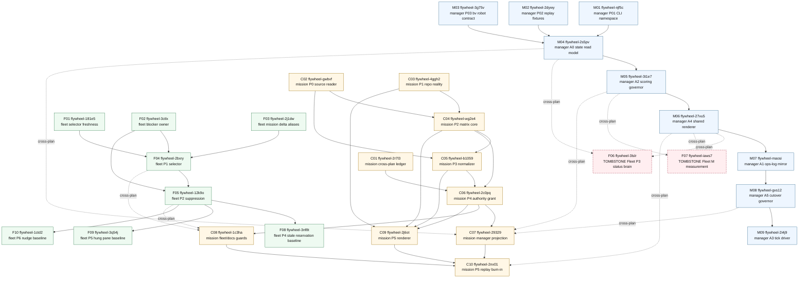

# Unified 29-Bead DAG Rollup And Ship Decision
Artifact: `.flywheel/PLANS/UNIFIED-DAG-2026-05-05.md`
Task: `unified-dag-rollup-2026-05-05`
Mode: plan-space only.
Bead DB writes: 0.
Source writes: this rollup artifact only.
Generated: 2026-05-05.
Repo: `/Users/josh/Developer/flywheel`.
Socraticode survey: 4 K10 searches against `/Users/josh/Developer/flywheel`.
Skills consulted: `beads-workflow`, `flywheel:plan`, `jeff-planning-enhanced`, `flywheel-end-to-end`, `jeff-swarm-ops`, `canonical-cli-scoping`, `dispatch-tool-contracts`, `flywheel:skills-best-practices`.
Ship-readiness verdict: CONDITIONAL.
First execution wave verdict: GO.
Full 29-bead graph verdict: CONDITIONAL until fleet r3 micro-apply and mission-coverage polish finish.
Composite score: 9.62.

## 1. Executive Summary
E001. Total unified bead count: 29.
E002. Manager-loop contributes 9 beads.
E003. Fleet-autonomy contributes 10 beads.
E004. Mission-coverage contributes 10 beads.
E005. Counted cross-plan dependency edges: 10.
E006. Fleet-autonomy contributes 2 deprecation tombstones.
E007. Current dependency cycle count: 0.
E008. Manager-loop polish-r2 is converged at 9.79 with zero r2 edits.
E009. Fleet-autonomy polish-r2 is converged at 9.61 average unique bead score, with two command-shape tombstone micro-edits remaining.
E010. Mission-coverage audit-r2 is converged at 9.72, and its DAG artifact reports composite 9.5.
E011. Cross-plan audit-r2 is converged at 9.57 with no critical, high, or medium new findings.
E012. Decision: CONDITIONAL overall because the full 29-bead graph still has plan-space finish work.
E013. Decision: GO for the first execution wave because it contains only contract-freeze beads with no true Joshua blocker class.
E014. First wave must not include mission-coverage implementation until mission-coverage polish-r0/r1/r2 has run.
E015. First wave must not include fleet tombstones until fleet r3 repairs the `| ! rg` command shape.
E016. The unified graph is ready to dispatch wave 1 as a bounded, reversible execution step.

## 2. Source Evidence
S001. Manager DAG summary declares 9 repo-local Beads, 7 waves, widest wave 3, 0 cycles, and 3/3 audit partial mitigation at `.flywheel/PLANS/manager-loop-architecture-2026-05-05/04-BEADS-DAG.md:8-27`.
S002. Manager DAG substrate validation says final `br doctor` is all OK and `br dep cycles` has no cycles at `.flywheel/PLANS/manager-loop-architecture-2026-05-05/04-BEADS-DAG.md:28-44`.
S003. Manager DAG bead table is at `.flywheel/PLANS/manager-loop-architecture-2026-05-05/04-BEADS-DAG.md:66-77`.
S004. Manager DAG wave plan is at `.flywheel/PLANS/manager-loop-architecture-2026-05-05/04-BEADS-DAG.md:97-176`.
S005. Manager polish-r2 reports 9/9 beads reviewed, 18/18 edits confirmed, composite 9.79, and convergence under 5 percent at `.flywheel/PLANS/manager-loop-architecture-2026-05-05/05-POLISH-r2.md:13-20`.
S006. Manager polish-r2 says the nine bodies are implementation-dispatchable after r2 review at `.flywheel/PLANS/manager-loop-architecture-2026-05-05/05-POLISH-r2.md:48-67`.
S007. Manager R2 plan frontmatter names composite score 9.72, G0 cross-plan contract freeze, and A0 manager-state read model as ship-first at `.flywheel/PLANS/manager-loop-architecture-2026-05-05/00-PLAN-r2.md:1-28`.
S008. Manager R2 plan says global pre-implementation action is G0 and global ship-first implementation remains Fleet P1+P2 after G0 at `.flywheel/PLANS/manager-loop-architecture-2026-05-05/00-PLAN-r2.md:54-62`.
S009. Manager R2 plan names A0 receipt inputs from Fleet P1/P2 at `.flywheel/PLANS/manager-loop-architecture-2026-05-05/00-PLAN-r2.md:242-245`.
S010. Manager R2 plan ship order says A0 proves visibility without changing worker behavior and A4 is a projection, not authority, at `.flywheel/PLANS/manager-loop-architecture-2026-05-05/00-PLAN-r2.md:949-990`.
S011. Manager R2 plan cross-plan ship-order verdict says G0 first, P1+P2 first implementation globally, and A0 first manager-loop implementation at `.flywheel/PLANS/manager-loop-architecture-2026-05-05/00-PLAN-r2.md:991-995`.
S012. Fleet DAG receipt declares 10 beads, 12 dependency edges, 4 cross-plan edges, 2 tombstones, 5 waves, and 0 cycles at `.flywheel/PLANS/fleet-autonomy-v1-2026-05-05/04-BEADS-DAG.md:1-19`.
S013. Fleet DAG bead table is at `.flywheel/PLANS/fleet-autonomy-v1-2026-05-05/04-BEADS-DAG.md:84-96`.
S014. Fleet DAG cross-plan tombstone edges are listed at `.flywheel/PLANS/fleet-autonomy-v1-2026-05-05/04-BEADS-DAG.md:114-135`.
S015. Fleet DAG wave plan is at `.flywheel/PLANS/fleet-autonomy-v1-2026-05-05/04-BEADS-DAG.md:141-249`.
S016. Fleet DAG tombstone register is at `.flywheel/PLANS/fleet-autonomy-v1-2026-05-05/04-BEADS-DAG.md:301-343`.
S017. Fleet DAG cross-plan edge ledger is at `.flywheel/PLANS/fleet-autonomy-v1-2026-05-05/04-BEADS-DAG.md:344-372`.
S018. Fleet polish-r2 reports composite 9.53, average unique bead score 9.61, 1.20 percent r1-to-r2 delta, and convergence under 5 percent at `.flywheel/PLANS/fleet-autonomy-v1-2026-05-05/05-POLISH-r2.md:1-12`.
S019. Fleet polish-r2 identifies two tombstone command-shape edits at `.flywheel/PLANS/fleet-autonomy-v1-2026-05-05/05-POLISH-r2.md:23-37`.
S020. Fleet polish-r2 confirms 16/18 r1 edits, with edits 12 and 14 partial at `.flywheel/PLANS/fleet-autonomy-v1-2026-05-05/05-POLISH-r2.md:543-567`.
S021. Fleet polish-r2 confirms 5/6 systemic fixes, with tombstone validation partial at `.flywheel/PLANS/fleet-autonomy-v1-2026-05-05/05-POLISH-r2.md:595-626`.
S022. Fleet polish-r2 verifies all 4 cross-plan edges at `.flywheel/PLANS/fleet-autonomy-v1-2026-05-05/05-POLISH-r2.md:666-688`.
S023. Fleet polish-r2 says tombstones are conceptually complete but mechanically incomplete at `.flywheel/PLANS/fleet-autonomy-v1-2026-05-05/05-POLISH-r2.md:689-715`.
S024. Mission-coverage DAG declares plan-space mode, 10 created real bead IDs, 16 internal edges, 6 cross-plan edges, wave count 6, and composite 9.5 at `.flywheel/PLANS/mission-coverage-compiler-2026-05-05/04-BEADS-DAG.md:1-29`.
S025. Mission-coverage DAG source anchors are at `.flywheel/PLANS/mission-coverage-compiler-2026-05-05/04-BEADS-DAG.md:49-70`.
S026. Mission-coverage DAG register maps all 10 placeholders to real IDs at `.flywheel/PLANS/mission-coverage-compiler-2026-05-05/04-BEADS-DAG.md:72-90`.
S027. Mission-coverage DAG cross-plan edge ledger is at `.flywheel/PLANS/mission-coverage-compiler-2026-05-05/04-BEADS-DAG.md:212-243`.
S028. Mission-coverage DAG wave plan is at `.flywheel/PLANS/mission-coverage-compiler-2026-05-05/04-BEADS-DAG.md:245-347`.
S029. Mission-coverage DAG mitigation map is at `.flywheel/PLANS/mission-coverage-compiler-2026-05-05/04-BEADS-DAG.md:348-388`.
S030. Mission-coverage DAG body summaries are at `.flywheel/PLANS/mission-coverage-compiler-2026-05-05/04-BEADS-DAG.md:390-480`.
S031. Cross-plan audit-r2 reports converged-cross-plan, composite 9.57, zero critical/high/medium new findings, one low, four partials, no regressions, and no three-way primitive conflicts at `.flywheel/PLANS/02-AUDIT-r2-cross-plan.md:27-85`.
S032. Cross-plan audit-r2 says no plan mutates beads, sends dispatches, or owns loop reenabling through the compiler at `.flywheel/PLANS/02-AUDIT-r2-cross-plan.md:64-84`.
S033. Cross-plan audit-r2 says no R3 rewrite and no replan-one-of-three are recommended at `.flywheel/PLANS/02-AUDIT-r2-cross-plan.md:500-527`.
S034. Cross-plan audit-r2 carry-forward acceptance for coverage-authority wiring is at `.flywheel/PLANS/02-AUDIT-r2-cross-plan.md:650-676`.
S035. Cross-plan audit-r2 carry-forward acceptance for mission-compiler wording is at `.flywheel/PLANS/02-AUDIT-r2-cross-plan.md:677-691`.
S036. `br doctor` in this rollup worker passed with `sqlite.integrity_check` OK and DB/JSONL counts both 1096.
S037. `br dep cycles --json` in this rollup worker returned `{"cycles":[],"count":0}`.
S038. `flywheel-loop tick --dry-run` reported `loop_status_class=RUNNABLE` and `planned_writes=[]`.
S039. `flywheel-loop doctor --json` reports broader repo-level drift and validation debt, but those are outside this plan-space output and do not add Beads writes.
S040. This rollup does not treat broad doctor drift as a reason to block a contract-only first execution wave.

## 3. Unified Bead Register
| Plan | Seq | Bead ID | Short name | Wave source | Depends on |
|---|---:|---|---|---:|---|
| Manager | M01 | `flywheel-njf5c` | P01 canonical CLI namespace matrix | M0 | none |
| Manager | M02 | `flywheel-2dywy` | P02 replay fixture golden outputs | M0 | none |
| Manager | M03 | `flywheel-3g75v` | P03 freeze bv robot command contract | M0 | none |
| Manager | M04 | `flywheel-2s5pv` | A0 manager state read model | M1 | M01,M02,M03 |
| Manager | M05 | `flywheel-3t1e7` | A2 scoring governor top-N queue | M2 | M04 |
| Manager | M06 | `flywheel-27vu5` | A4 shared surface renderer | M3 | M05 |
| Manager | M07 | `flywheel-maosi` | A1 ops-log compatibility mirror | M4 | M06 |
| Manager | M08 | `flywheel-gvs12` | A5 migration callback cutover governor | M5 | M07 |
| Manager | M09 | `flywheel-2i4j9` | A3 manager tick driver | M6 | M08 |
| Fleet | F01 | `flywheel-181e5` | selector source/freshness fields | F0 | none |
| Fleet | F02 | `flywheel-3ctlx` | blocker-owner placement | F0 | none |
| Fleet | F03 | `flywheel-2j1dw` | mission-delta provenance aliases | F0 | none |
| Fleet | F04 | `flywheel-2bxry` | P1 bv-next selector contract | F1 | F01,F02,F03 |
| Fleet | F05 | `flywheel-12k9o` | P2 same-candidate suppression | F2 | F04,F02 |
| Fleet | F06 | `flywheel-3lslr` | tombstone Fleet P3 status brain | F3 | M04,M06 |
| Fleet | F07 | `flywheel-iaws7` | tombstone Fleet M measurement surface | F3 | M05,M06 |
| Fleet | F08 | `flywheel-3nf8t` | P4 stale reservation baseline | F4 | F05 |
| Fleet | F09 | `flywheel-3q54j` | P5 hung pane baseline | F4 | F05 |
| Fleet | F10 | `flywheel-1ctd2` | P6 manual nudge baseline | F4 | F05 |
| Mission | C01 | `flywheel-2r7l3` | cross-plan ledger freeze | C0 | none |
| Mission | C02 | `flywheel-gwbvf` | P0 source reader harness | C0 | none |
| Mission | C03 | `flywheel-4ggh2` | P1 repo reality normalizer | C0 | none |
| Mission | C04 | `flywheel-wg2e4` | P2 coverage matrix core | C1 | C02,C03 |
| Mission | C05 | `flywheel-b1059` | P3 claim/failure normalizer | C1 | C02,C04 |
| Mission | C06 | `flywheel-2c0pq` | P4 dispatch authority grant | C2 | C01,C04,C05 |
| Mission | C07 | `flywheel-29329` | P4 manager-loop projection | C3 | C06,M04,M05,M08 |
| Mission | C08 | `flywheel-1c3ha` | P4 fleet/docs projection guards | C3 | C06,F04,F05 |
| Mission | C09 | `flywheel-2j6ot` | P5 deterministic renderer | C4 | C03,C04,C05,C06 |
| Mission | C10 | `flywheel-2nx01` | P5 replay and burn-in | C5 | C07,C08,C09,M06 |

## 4. Unified Mermaid Graph


## 5. Cross-Plan Edge Ledger
X001. Cross-plan edge 1: `flywheel-3lslr` depends on `flywheel-2s5pv`.
X002. Meaning: Fleet P3 status tombstone waits for Manager A0 state read model.
X003. Source: `.flywheel/PLANS/fleet-autonomy-v1-2026-05-05/04-BEADS-DAG.md:114-135`.
X004. Cross-plan edge 2: `flywheel-3lslr` depends on `flywheel-27vu5`.
X005. Meaning: Fleet P3 status tombstone waits for Manager A4 renderer.
X006. Source: `.flywheel/PLANS/fleet-autonomy-v1-2026-05-05/04-BEADS-DAG.md:114-135`.
X007. Cross-plan edge 3: `flywheel-iaws7` depends on `flywheel-3t1e7`.
X008. Meaning: Fleet M measurement tombstone waits for Manager A2 scoring governor.
X009. Source: `.flywheel/PLANS/fleet-autonomy-v1-2026-05-05/04-BEADS-DAG.md:114-135`.
X010. Cross-plan edge 4: `flywheel-iaws7` depends on `flywheel-27vu5`.
X011. Meaning: Fleet M measurement tombstone waits for Manager A4 renderer.
X012. Source: `.flywheel/PLANS/fleet-autonomy-v1-2026-05-05/04-BEADS-DAG.md:114-135`.
X013. Cross-plan edge 5: `flywheel-29329` depends on `flywheel-2s5pv`.
X014. Meaning: Mission manager-loop projection matches Manager A0 read model.
X015. Source: `.flywheel/PLANS/mission-coverage-compiler-2026-05-05/04-BEADS-DAG.md:212-226`.
X016. Cross-plan edge 6: `flywheel-29329` depends on `flywheel-3t1e7`.
X017. Meaning: Mission projection respects Manager A2 scoring and queue authority.
X018. Source: `.flywheel/PLANS/mission-coverage-compiler-2026-05-05/04-BEADS-DAG.md:212-226`.
X019. Cross-plan edge 7: `flywheel-29329` depends on `flywheel-gvs12`.
X020. Meaning: Mission projection waits for Manager A5 callback parity.
X021. Source: `.flywheel/PLANS/mission-coverage-compiler-2026-05-05/04-BEADS-DAG.md:212-226`.
X022. Cross-plan edge 8: `flywheel-1c3ha` depends on `flywheel-2bxry`.
X023. Meaning: Mission fleet/docs guards wait for Fleet P1 selector receipts.
X024. Source: `.flywheel/PLANS/mission-coverage-compiler-2026-05-05/04-BEADS-DAG.md:227-234`.
X025. Cross-plan edge 9: `flywheel-1c3ha` depends on `flywheel-12k9o`.
X026. Meaning: Mission fleet/docs guards wait for Fleet P2 worker substrate receipts.
X027. Source: `.flywheel/PLANS/mission-coverage-compiler-2026-05-05/04-BEADS-DAG.md:227-234`.
X028. Cross-plan edge 10: `flywheel-2nx01` depends on `flywheel-27vu5`.
X029. Meaning: Mission replay burn-in waits for Manager A4 replay/adoption lane.
X030. Source: `.flywheel/PLANS/mission-coverage-compiler-2026-05-05/04-BEADS-DAG.md:235-238`.
X031. Direct cross-plan fanout winner: `flywheel-27vu5`, because it directly unblocks `flywheel-3lslr`, `flywheel-iaws7`, and `flywheel-2nx01`.
X032. Earliest critical-path chokepoint: `flywheel-2s5pv`, because A0 feeds A2, A4, Fleet P3 tombstone, and mission manager projection.
X033. Execution consequence: Wave 1 must clear Manager P01/P02/P03 so A0 can enter Wave 2.
X034. Execution consequence: A4 becomes the largest direct cross-plan release point later.
X035. Execution consequence: A5 matters specifically for mission manager projection, not fleet tombstones.

## 6. Unified Wave Dispatch Plan
W001. Rule: max 3-5 beads per wave.
W002. Rule: dispatch within a wave can be parallel-safe only after file reservations are held.
W003. Rule: because pane 2 currently holds a Beads write lane, wave packets are drafted here but not sent.
W004. Rule: implementation workers are not alone in the codebase and must avoid reverting others' edits.
W005. Rule: each worker must reserve files before edits and release them on callback.
W006. Rule: each implementation packet must require 4 Socraticode K10 searches.
W007. Rule: each callback must include bead update or no_bead_reason, file reservation receipt, L112 result, and fuckup logging if trauma appears.

### Wave 1 - Ship-First Contract Freeze
W1-001. Wave 1 verdict: GO.
W1-002. Wave 1 size: 5.
W1-003. Wave 1 dispatch count: 5 packets drafted.
W1-004. Wave 1 manager beads: `flywheel-njf5c`, `flywheel-2dywy`, `flywheel-3g75v`.
W1-005. Wave 1 fleet beads: `flywheel-181e5`, `flywheel-3ctlx`.
W1-006. Wave 1 mission beads: none dispatched yet.
W1-007. Mission candidates that can later dispatch immediately: `flywheel-2r7l3`, `flywheel-gwbvf`, `flywheel-4ggh2`.
W1-008. Mission reason for hold: mission-coverage polish-r0/r1/r2 has not run.
W1-009. Fleet reason for selecting two of three roots: `flywheel-181e5` and `flywheel-3ctlx` unblock the highest-risk P1/P2 receipt ambiguity.
W1-010. Fleet root held to Wave 2: `flywheel-2j1dw`, because it is P2 priority and can ship alongside A0 and mission foundations.
W1-011. Wave 1 acceptance gate: all five workers report L112 PASS, tests PASS, and file reservations released.
W1-012. Wave 1 acceptance gate: no `br update` runs concurrently from multiple panes.
W1-013. Wave 1 acceptance gate: orchestrator integrates callbacks sequentially.
W1-014. Wave 1 acceptance gate: `br dep cycles --json` remains zero after integration.
W1-015. Wave 1 acceptance gate: `br doctor` returns `sqlite.integrity_check` OK after integration.

### Wave 2 - A0 And Remaining Foundations
W2-001. Wave 2 size: 5.
W2-002. Candidate beads: `flywheel-2s5pv`, `flywheel-2j1dw`, `flywheel-2r7l3`, `flywheel-gwbvf`, `flywheel-4ggh2`.
W2-003. Entry gate: Wave 1 callbacks integrated.
W2-004. Entry gate: mission-coverage polish complete enough to authorize execution, or mission beads stay deferred.
W2-005. Exit gate: A0 read model can consume selector/retry receipt contracts.
W2-006. Exit gate: mission source and repo reality facts are read-only evidence, not authority.

### Wave 3 - First Runtime Contracts
W3-001. Wave 3 size: 3.
W3-002. Candidate beads: `flywheel-3t1e7`, `flywheel-2bxry`, `flywheel-wg2e4`.
W3-003. Entry gate: Manager A0 complete.
W3-004. Entry gate: Fleet root contracts complete.
W3-005. Entry gate: Mission C02 and C03 complete.
W3-006. Exit gate: Manager queue is deterministic and P1 selector uses frozen fields.

### Wave 4 - Shared Surface And Suppression
W4-001. Wave 4 size: 3.
W4-002. Candidate beads: `flywheel-27vu5`, `flywheel-12k9o`, `flywheel-b1059`.
W4-003. Entry gate: Manager A2 complete.
W4-004. Entry gate: Fleet P1 complete.
W4-005. Entry gate: Mission matrix core complete.
W4-006. Exit gate: A4 renderer is read-only, P2 suppression is observable, and P3 normalizer fixtures are stable.

### Wave 5 - Tombstones And First Mission Authority Grant
W5-001. Wave 5 size: 3.
W5-002. Candidate beads: `flywheel-3lslr`, `flywheel-iaws7`, `flywheel-2c0pq`.
W5-003. Entry gate: Manager A0, A2, and A4 complete.
W5-004. Entry gate: Fleet r3 tombstone command repair is applied.
W5-005. Entry gate: Mission C01/C04/C05 complete.
W5-006. Exit gate: fleet deprecated surfaces are tombstoned and mission grant is advisory only.

### Wave 6 - Mirror And Repair Baselines
W6-001. Wave 6 size: 4.
W6-002. Candidate beads: `flywheel-maosi`, `flywheel-3nf8t`, `flywheel-3q54j`, `flywheel-1ctd2`.
W6-003. Entry gate: Manager A4 complete.
W6-004. Entry gate: Fleet P2 complete.
W6-005. Exit gate: A1 is mirror-only, and fleet P4/P5/P6 record baselines before claiming improvement.

### Wave 7 - Cutover Governor And Fleet/Docs Advisory Projection
W7-001. Wave 7 size: 2.
W7-002. Candidate beads: `flywheel-gvs12`, `flywheel-1c3ha`.
W7-003. Entry gate: Manager A1 complete.
W7-004. Entry gate: Mission authority grant complete.
W7-005. Entry gate: Fleet P1/P2 complete.
W7-006. Exit gate: A5 parity is fail-closed and fleet/docs projection remains advisory.

### Wave 8 - Tick Driver, Manager Projection, Renderer
W8-001. Wave 8 size: 3.
W8-002. Candidate beads: `flywheel-2i4j9`, `flywheel-29329`, `flywheel-2j6ot`.
W8-003. Entry gate: Manager A5 complete.
W8-004. Entry gate: Mission C06 complete.
W8-005. Exit gate: manager tick driver is dry-run capable, mission manager projection is advisory JSON, and renderer is deterministic.

### Wave 9 - Mission Replay And Burn-In
W9-001. Wave 9 size: 1.
W9-002. Candidate bead: `flywheel-2nx01`.
W9-003. Entry gate: C07, C08, C09, and Manager A4 complete.
W9-004. Exit gate: at least one live consumer can reject or reprioritize during replay.
W9-005. Exit gate: no hard gate skips mission replay.

## 7. Acceptance Gates Per Wave
G001. Global gate before any wave: `br dep cycles --json` returns `count=0`.
G002. Global gate before any wave: `br doctor` reports `sqlite.integrity_check` OK.
G003. Global gate before any wave: orchestrator confirms no other pane owns the same source files.
G004. Global gate before any wave: each packet includes Agent Mail file reservation instructions.
G005. Global gate before any wave: each packet has Socraticode K10 query instructions.
G006. Global gate before any wave: each packet has L112 probe and callback envelope.
G007. Wave 1 gate: five contract artifacts land, tests pass, and no runtime authority changes.
G008. Wave 1 gate: no mission-coverage implementation starts.
G009. Wave 1 gate: no Fleet tombstone implementation starts.
G010. Wave 2 gate: Manager A0 read model validates P01/P02/P03 contracts.
G011. Wave 2 gate: Mission C01/C02/C03 remain evidence-only if dispatched.
G012. Wave 3 gate: Fleet P1 and Manager A2 both consume frozen contracts, not prose.
G013. Wave 4 gate: Fleet P2 suppression and Manager A4 renderer both remain non-authoritative.
G014. Wave 5 gate: tombstones use syntax-valid self-match-safe active-title validation.
G015. Wave 5 gate: mission authority grant starts advisory, not gate-authoritative.
G016. Wave 6 gate: fleet repair baselines are measured before repair claims.
G017. Wave 7 gate: callback parity is fail-closed before mission projection trusts A5.
G018. Wave 8 gate: manager tick driver remains dry-run until cutover gates pass.
G019. Wave 9 gate: replay proves consumer rejection or reprioritization.
G020. Post-wave gate: `br dep cycles --json` remains zero after each integration.
G021. Post-wave gate: callback receipts are validated before close.
G022. Post-wave gate: `no_bead_reason` exists for every finding not converted to a bead/update.

## 8. Outstanding Plan-Space Work That Does Not Block Wave 1
O001. Fleet-autonomy polish-r3 does not block Wave 1.
O002. Fleet r3 scope: repair `flywheel-3lslr` active-title grep negation.
O003. Fleet r3 scope: repair `flywheel-iaws7` active-title grep negation.
O004. Fleet r3 scope: close the partial systemic tombstone validation fix.
O005. Fleet r3 scope: finish `flywheel-3lslr` mechanical gap closure.
O006. Fleet r3 source: `.flywheel/PLANS/fleet-autonomy-v1-2026-05-05/05-POLISH-r2.md:716-759`.
O007. Mission-coverage polish-r0/r1/r2 does not block Wave 1.
O008. Mission polish reason: mission beads are excluded from Wave 1.
O009. Mission polish must finish before any mission-coverage implementation dispatch.
O010. Watchdog plan-arc does not block Wave 1.
O011. Watchdog reason: orthogonal to contract-freeze work.
O012. Broader repo doctor drift does not block Wave 1.
O013. Doctor drift reason: Wave 1 is scoped to owned source/test artifacts and validated callbacks.
O014. Pane 2 Beads DB lock does not block authoring this rollup.
O015. Pane 2 lock does block any attempted Beads writes from this worker.
O016. First-wave dispatch should wait for orchestrator scheduling, not this rollup worker.
O017. Mission coverage real IDs are visible in the DAG, so no `TBD post-pane-2-decompose-create-callback` placeholders are needed.
O018. All outstanding work is agent-disposable.
O019. None of the outstanding work requires Joshua input.
O020. None of the outstanding work creates a TRUE Joshua blocker.

## 9. TRUE Joshua-Blocker Class Identification
J001. Class 1 check: `new-platform-or-vendor-not-in-mission-lock`.
J002. Result: no.
J003. Rationale: Wave 1 writes local repo artifacts and tests only; no new platform or vendor is introduced.
J004. Class 2 check: `secret-rotation-or-new-credential-creation`.
J005. Result: no.
J006. Rationale: Wave 1 does not rotate or create credentials.
J007. Class 3 check: `financial-commitment-above-mission-budget`.
J008. Result: no.
J009. Rationale: Wave 1 does not spin up paid resources.
J010. Class 4 check: `legal-or-compliance-decision`.
J011. Result: no.
J012. Rationale: Wave 1 does not accept ToS, sign DPAs, or make legal commitments.
J013. Class 5 check: `destructive-irreversible-on-shared-state`.
J014. Result: no.
J015. Rationale: Wave 1 is normal local source/test implementation with reservations and no irreversible shared-state deletion.
J016. Class 6 check: `paradigm-conflict-with-active-mission`.
J017. Result: no.
J018. Rationale: Wave 1 follows the active plan doctrine: G0 contract freeze before runtime authority.
J019. Joshua blocker class: none.
J020. Data-decides default: auto-advance to Wave 1.
J021. Joshua action: authorize the wave, not resolve a blocker.
J022. If a future worker discovers a blocker, it must log a fuckup row and include skills_consulted before BLOCKED.

## 10. First-Wave Dispatch Packets
P000. These packets are drafts only.
P001. This rollup does not send them.
P002. The orchestrator should send them sequentially or with safe staggering.
P003. Pane assignments rotate across panes 2/3/4.
P004. Pane 2 assignments are `after_bead_db_lock_release`.
P005. Each packet must be pasted or written as a real dispatch file before send.

### Packet 1 - flywheel-njf5c
task_id: `wave1-manager-p01-cli-namespace-matrix-2026-05-05`.
phase: DISPATCH.
tick_class: implementation.
repo: `/Users/josh/Developer/flywheel`.
session: `flywheel`.
worker_pane: `flywheel:2 after current bead-db lock release`.
bead_id: `flywheel-njf5c`.
goal: implement the Manager P01 canonical CLI namespace matrix.
required_skills: `canonical-cli-scoping`, `beads-workflow`, `beads-br`, `dispatch-tool-contracts`.
context: Manager DAG says P01 has no dependencies and unblocks A0 at `.flywheel/PLANS/manager-loop-architecture-2026-05-05/04-BEADS-DAG.md:69`.
context: Manager polish-r2 marks `flywheel-njf5c` score 9.79 and no r2 edit need at `.flywheel/PLANS/manager-loop-architecture-2026-05-05/05-POLISH-r2.md:70-83`.
mandatory_preflight: read AGENTS.md and `br show flywheel-njf5c --json`.
mandatory_preflight: run 4 Socraticode K10 searches for manager CLI namespace, canonical CLI scoping tests, existing manager command surfaces, and command collision precedent.
file_reservations: reserve exact files before edits; expected candidates are `.flywheel/manager/cli-namespace-matrix.md`, related schema/test path, and any chosen manager CLI contract artifact.
implementation_guidance: build the matrix artifact before downstream CLI implementation.
implementation_guidance: include collision proof using `command -v` or `which`.
acceptance_criteria: all six surfaces are named: state, queue, tick, ops-log, render, migration.
acceptance_criteria: doctor, health, repair, validate, audit, why, schema, examples, quickstart, help, completion, JSON, no-color, no-emoji, width, dry-run, apply, explain, idempotency key are classified.
acceptance_criteria: no source beyond reserved files is edited.
L112_probe: `test -f .flywheel/manager/cli-namespace-matrix.md && rg -q 'state|queue|tick|ops-log|render|migration' .flywheel/manager/cli-namespace-matrix.md && rg -q 'doctor|health|repair|validate|audit|why|schema|quickstart|completion' .flywheel/manager/cli-namespace-matrix.md && echo OK_wave1_manager_p01_cli_namespace`.
callback_shape: `DONE wave1-manager-p01-cli-namespace-matrix-2026-05-05 bead=flywheel-njf5c tests=<pass|fail> l112_observed=OK_wave1_manager_p01_cli_namespace socraticode_queries=<N> files_reserved=<paths> files_released=<paths> beads_updated=flywheel-njf5c fuckups_logged=<none|classes> no_bead_reason=<if-no-new-findings> callback_delivery_verified=true`.
out_of_scope: implementing A0, A2, A4, or any CLI command body.

### Packet 2 - flywheel-2dywy
task_id: `wave1-manager-p02-replay-fixtures-2026-05-05`.
phase: DISPATCH.
tick_class: implementation.
repo: `/Users/josh/Developer/flywheel`.
session: `flywheel`.
worker_pane: `flywheel:3`.
bead_id: `flywheel-2dywy`.
goal: define manager-loop replay fixture golden outputs.
required_skills: `beads-workflow`, `beads-br`, `dispatch-tool-contracts`, `canonical-cli-scoping`.
context: Manager DAG says P02 has no dependencies and unblocks A0 at `.flywheel/PLANS/manager-loop-architecture-2026-05-05/04-BEADS-DAG.md:70`.
context: Manager polish-r2 marks `flywheel-2dywy` score 9.80 and no r2 edit need at `.flywheel/PLANS/manager-loop-architecture-2026-05-05/05-POLISH-r2.md:84-97`.
mandatory_preflight: read AGENTS.md and `br show flywheel-2dywy --json`.
mandatory_preflight: run 4 Socraticode K10 searches for replay fixtures, golden output manifest, manager-loop fixture precedent, and validation receipts.
file_reservations: reserve three fixture files, one golden manifest, and one replay test harness path before edits.
implementation_guidance: fixture outputs must be exact, not generic smoke text.
acceptance_criteria: overnight 60+ callbacks fixture has expected verdict, queue IDs, and source hash path.
acceptance_criteria: skillos manual callback gap fixture has expected output.
acceptance_criteria: mobile-eats mission compression fixture has expected output.
acceptance_criteria: downstream beads can cite this fixture contract.
L112_probe: `test -f .flywheel/manager/replay/golden-manifest.json && jq -e '.fixtures | length >= 3' .flywheel/manager/replay/golden-manifest.json && rg -q 'overnight|skillos|mobile-eats' .flywheel/manager/replay/golden-manifest.json && echo OK_wave1_manager_p02_replay_fixtures`.
callback_shape: `DONE wave1-manager-p02-replay-fixtures-2026-05-05 bead=flywheel-2dywy tests=<pass|fail> l112_observed=OK_wave1_manager_p02_replay_fixtures socraticode_queries=<N> files_reserved=<paths> files_released=<paths> beads_updated=flywheel-2dywy fuckups_logged=<none|classes> no_bead_reason=<if-no-new-findings> callback_delivery_verified=true`.
out_of_scope: building A0 replay engine or manager-state generation.

### Packet 3 - flywheel-3g75v
task_id: `wave1-manager-p03-bv-robot-contract-2026-05-05`.
phase: DISPATCH.
tick_class: implementation.
repo: `/Users/josh/Developer/flywheel`.
session: `flywheel`.
worker_pane: `flywheel:4`.
bead_id: `flywheel-3g75v`.
goal: freeze the supported `bv` robot command contract for manager-loop consumption.
required_skills: `beads-bv`, `beads-workflow`, `beads-br`, `dispatch-tool-contracts`, `canonical-cli-scoping`.
context: Manager DAG says P03 has no dependencies and unblocks A0 at `.flywheel/PLANS/manager-loop-architecture-2026-05-05/04-BEADS-DAG.md:71`.
context: Manager polish-r2 marks `flywheel-3g75v` score 9.86 and no r2 edit need at `.flywheel/PLANS/manager-loop-architecture-2026-05-05/05-POLISH-r2.md:98-111`.
mandatory_preflight: read AGENTS.md and `br show flywheel-3g75v --json`.
mandatory_preflight: run 4 Socraticode K10 searches for bv robot commands, manager queue scoring, robot schema tests, and unsupported command probes.
file_reservations: reserve the bv contract artifact, schema artifact, and 1-2 tests validating robot command names and required fields.
implementation_guidance: probe live `bv --robot-next` and `bv --robot-triage`; record exact supported commands.
acceptance_criteria: supported robot commands and JSON keys are frozen.
acceptance_criteria: unsupported `--robot-ready` or equivalent negative command is documented as unsupported if still unsupported.
acceptance_criteria: manager-loop scoring beads cannot use `bv` until this contract exists.
L112_probe: `test -f .flywheel/manager/bv-robot-contract.json && jq -e '.commands[\"robot-next\"] and .commands[\"robot-triage\"]' .flywheel/manager/bv-robot-contract.json && echo OK_wave1_manager_p03_bv_robot_contract`.
callback_shape: `DONE wave1-manager-p03-bv-robot-contract-2026-05-05 bead=flywheel-3g75v tests=<pass|fail> l112_observed=OK_wave1_manager_p03_bv_robot_contract socraticode_queries=<N> files_reserved=<paths> files_released=<paths> beads_updated=flywheel-3g75v fuckups_logged=<none|classes> no_bead_reason=<if-no-new-findings> callback_delivery_verified=true`.
out_of_scope: implementing Manager A2 queue scoring.

### Packet 4 - flywheel-181e5
task_id: `wave1-fleet-selector-source-freshness-2026-05-05`.
phase: DISPATCH.
tick_class: implementation.
repo: `/Users/josh/Developer/flywheel`.
session: `flywheel`.
worker_pane: `flywheel:2 after current bead-db lock release`.
bead_id: `flywheel-181e5`.
goal: freeze Fleet selector source and freshness fields.
required_skills: `beads-workflow`, `beads-br`, `beads-bv`, `dispatch-tool-contracts`.
context: Fleet DAG says `flywheel-181e5` has no dependencies and unblocks `flywheel-2bxry` at `.flywheel/PLANS/fleet-autonomy-v1-2026-05-05/04-BEADS-DAG.md:87`.
context: Fleet polish-r2 scores `flywheel-181e5` at 9.70 and confirms r2 verdict at `.flywheel/PLANS/fleet-autonomy-v1-2026-05-05/05-POLISH-r2.md:87-115`.
mandatory_preflight: read AGENTS.md and `br show flywheel-181e5 --json`.
mandatory_preflight: run 4 Socraticode K10 searches for selector receipts, idle pane dispatch, idle-state probe, and selector fixture tests.
file_reservations: reserve `.flywheel/scripts/idle-pane-auto-dispatch.sh`, `.flywheel/scripts/idle-state-probe.sh`, `tests/test_idle_pane_watcher_convergence.sh`, `tests/idle-pane-auto-dispatch-validated-write-test.sh`, and the selector freshness fixture.
implementation_guidance: `br_ready_inventory_hash` remains diagnostic only.
acceptance_criteria: `selector_receipt/v1` includes `selector_data_hash`, `selector_freshness_ts`, `selector_claim_command`, `selector_show_command`, `selector_runtime_path`, and `selector_unblocks`.
acceptance_criteria: selector tests reject diagnostic inventory hash as candidate authority.
acceptance_criteria: source/freshness fields are readable by A0/A2 fixtures without Manager A1.
L112_probe: `test -f tests/fixtures/fleet-autonomy/selector-receipt-source-freshness-valid.json && jq -e '.selector_data_hash and .selector_freshness_ts and .selector_claim_command and .selector_show_command and .selector_runtime_path and .selector_unblocks' tests/fixtures/fleet-autonomy/selector-receipt-source-freshness-valid.json && echo OK_wave1_fleet_selector_source_freshness`.
callback_shape: `DONE wave1-fleet-selector-source-freshness-2026-05-05 bead=flywheel-181e5 tests=<pass|fail> l112_observed=OK_wave1_fleet_selector_source_freshness socraticode_queries=<N> files_reserved=<paths> files_released=<paths> beads_updated=flywheel-181e5 fuckups_logged=<none|classes> no_bead_reason=<if-no-new-findings> callback_delivery_verified=true`.
out_of_scope: implementing full P1 selector dispatch.

### Packet 5 - flywheel-3ctlx
task_id: `wave1-fleet-blocker-owner-placement-2026-05-05`.
phase: DISPATCH.
tick_class: implementation.
repo: `/Users/josh/Developer/flywheel`.
session: `flywheel`.
worker_pane: `flywheel:3`.
bead_id: `flywheel-3ctlx`.
goal: freeze blocker-owner field placement for Fleet P1/P2 and Manager A0 consumption.
required_skills: `beads-workflow`, `beads-br`, `dispatch-tool-contracts`, `canonical-cli-scoping`.
context: Fleet DAG says `flywheel-3ctlx` has no dependencies and unblocks both `flywheel-2bxry` and `flywheel-12k9o` at `.flywheel/PLANS/fleet-autonomy-v1-2026-05-05/04-BEADS-DAG.md:88`.
context: Fleet polish-r2 scores `flywheel-3ctlx` at 9.65 and confirms r2 verdict at `.flywheel/PLANS/fleet-autonomy-v1-2026-05-05/05-POLISH-r2.md:116-144`.
mandatory_preflight: read AGENTS.md and `br show flywheel-3ctlx --json`.
mandatory_preflight: run 4 Socraticode K10 searches for blocker owner placement, selector receipt blocker fields, retry receipt blocker fields, and callback-only owner negative fixture.
file_reservations: reserve `.flywheel/scripts/idle-pane-auto-dispatch.sh`, `.flywheel/scripts/idle-state-probe.sh`, `tests/test_idle_pane_watcher_convergence.sh`, `tests/fixtures/fleet-autonomy/blocker-owner-placement-valid.json`, and `tests/fixtures/fleet-autonomy/blocker-owner-callback-only.json`.
implementation_guidance: choose exactly one placement: `selector_receipt/v1`, `retry_state_receipt/v1`, or `manager_state_fact/v1`.
acceptance_criteria: chosen receipt or fact contains `blocker_owner`, `blocker_owner_source`, `blocker_owner_confidence`, and `blocker_owner_stale`.
acceptance_criteria: callback-only owner derivation is rejected.
acceptance_criteria: P1/P2 blocker fields link to Manager A0 without requiring Manager A1.
L112_probe: `test -f tests/fixtures/fleet-autonomy/blocker-owner-placement-valid.json && jq -e '.blocker_owner and .blocker_owner_source and .blocker_owner_confidence and has(\"blocker_owner_stale\")' tests/fixtures/fleet-autonomy/blocker-owner-placement-valid.json && echo OK_wave1_fleet_blocker_owner_placement`.
callback_shape: `DONE wave1-fleet-blocker-owner-placement-2026-05-05 bead=flywheel-3ctlx tests=<pass|fail> l112_observed=OK_wave1_fleet_blocker_owner_placement socraticode_queries=<N> files_reserved=<paths> files_released=<paths> beads_updated=flywheel-3ctlx fuckups_logged=<none|classes> no_bead_reason=<if-no-new-findings> callback_delivery_verified=true`.
out_of_scope: implementing P2 same-candidate suppression.

## 11. Risk Register
R001. Risk: Codex freeze during execution.
R002. Probability: medium.
R003. Impact: medium.
R004. Mitigation: watchdog plan-arc is in flight; do not rely on it for Wave 1, but use callback delivery verification and NTM health checks.
R005. Trigger: worker pane shows no callback, no file movement, and stale output beyond grace window.
R006. Response: orchestrator classifies not-started or stuck, validates dispatch delivery, and redispatches after releasing reservations.
R007. Risk: Bead DB lock contention if multiple panes run `br update`.
R008. Probability: high if unmanaged.
R009. Impact: high.
R010. Mitigation: Wave 1 integration must be sequential; implementation workers should not close/update beads until orchestrator assigns that mutation lane.
R011. Trigger: `br doctor` warning escalates, `OpenRead` class appears, or pane 2 lock is still active.
R012. Response: stop Beads writes, preserve worker evidence, and have orchestrator integrate one callback at a time.
R013. Risk: cross-plan dependency assumption violation.
R014. Probability: low.
R015. Impact: high.
R016. Mitigation: rerun `br dep cycles --json` before and after each wave.
R017. Trigger: cross-plan dependent becomes ready before dependency callback validates.
R018. Response: block dependent dispatch and cite the dependency gate.
R019. Risk: Fleet tombstone micro-edits skipped.
R020. Probability: medium.
R021. Impact: medium.
R022. Mitigation: keep `flywheel-3lslr` and `flywheel-iaws7` out of Wave 1.
R023. Trigger: any packet tries to dispatch tombstones before r3 repair.
R024. Response: reject packet and reroute to fleet polish-r3.
R025. Risk: mission-coverage polish skipped.
R026. Probability: medium.
R027. Impact: medium.
R028. Mitigation: keep mission-coverage beads out of Wave 1.
R029. Trigger: any mission-coverage implementation packet fires before polish-r0/r1/r2.
R030. Response: block mission implementation packet and run mission polish.
R031. Risk: dispatch packets omit Socraticode or file reservations.
R032. Probability: medium if hand-written during high tempo.
R033. Impact: high.
R034. Mitigation: use packets in this artifact as templates and preserve mandatory preflight.
R035. Trigger: callback lacks `socraticode_queries`, `files_reserved`, or `files_released`.
R036. Response: redispatch or request missing receipt before integration.
R037. Risk: source edits exceed reserved file scope.
R038. Probability: medium.
R039. Impact: medium.
R040. Mitigation: Agent Mail file reservation plus callback file list.
R041. Trigger: `git diff --name-only` includes unreserved paths.
R042. Response: do not integrate; ask worker for explanation or split work.
R043. Risk: broader repo doctor failures are misread as a Joshua blocker.
R044. Probability: medium.
R045. Impact: medium.
R046. Mitigation: classify by the six TRUE Joshua-blocker classes.
R047. Trigger: someone proposes pausing Wave 1 on repo-level validation debt without class citation.
R048. Response: auto-advance Wave 1 or file a specific substrate bead; do not ask Joshua.
R049. Risk: A4 direct cross-plan fanout gets delayed by late A0/A2.
R050. Probability: medium.
R051. Impact: high for tombstones and mission replay.
R052. Mitigation: prioritize Manager P01/P02/P03 in Wave 1 so A0 can start in Wave 2.
R053. Trigger: any Manager G0 bead stalls.
R054. Response: repair or split the G0 bead before starting downstream A0.

## 12. Ship Decision
D001. Full-graph ship-readiness verdict: CONDITIONAL.
D002. First-wave ship-readiness verdict: GO.
D003. Condition 1: mission-coverage implementation waits for mission polish.
D004. Condition 2: fleet tombstones wait for r3 micro-apply.
D005. Condition 3: Beads DB mutations are serialized by the orchestrator.
D006. Condition 4: every worker packet carries Socraticode, file reservation, L112, callback, no_bead_reason, and fuckup logging requirements.
D007. No true Joshua blocker class is present.
D008. Joshua is not being asked to choose architecture.
D009. Joshua is not being asked to perform substrate repair.
D010. Joshua authorizes a bounded first wave; data decides later waves after gates pass.
D011. The first wave is reversible because it freezes contracts and fixtures rather than shipping authority.
D012. The first wave improves the rest of the graph because Manager A0 is blocked only by P01/P02/P03.
D013. The first wave improves Fleet P1/P2 because selector source/freshness and blocker-owner placement become concrete.
D014. Mission coverage is visible in the unified graph but not prematurely dispatched.
D015. The next orchestrator action after accepting this rollup is to send Packet 1 through Packet 5 with safe staggering.

## 13. Dispatch Control Appendix
A001. This appendix is the execution operator checklist for turning the unified DAG into pane work.
A002. It is plan-space only; it does not create, update, close, or retag beads.
A003. It exists because Wave 1 is GO while the whole graph is only CONDITIONAL.
A004. The distinction must remain visible in every orchestrator action.
A005. The first invariant is that Wave 1 packets are contract-freeze work, not authority cutover work.
A006. The second invariant is that mission-coverage implementation remains held until polish convergence is attached.
A007. The third invariant is that fleet tombstones remain held until r3 micro-edits are applied.
A008. The fourth invariant is that bead-db writes are serialized outside this pane.
A009. The fifth invariant is that every packet carries L50, L51, L52, L53, and L54 callback receipts.

### Wave 1 Control Ledger
A010. Wave 1 candidate set: `flywheel-njf5c`, `flywheel-2dywy`, `flywheel-3g75v`, `flywheel-181e5`, `flywheel-3ctlx`.
A011. Wave 1 dispatch status: GO.
A012. Wave 1 dispatch width: 5 if there are five safe worker panes; otherwise stagger as 3 + 2.
A013. Wave 1 bead-db requirement: no worker may mutate bead DB except through the orchestrator-approved lane.
A014. Wave 1 acceptance common gate: `br doctor` observed clean before callback.
A015. Wave 1 acceptance common gate: `br dep cycles --json` observed zero cycles before callback.
A016. Wave 1 acceptance common gate: declared file reservation acquired before edits.
A017. Wave 1 acceptance common gate: declared file reservation released before DONE.
A018. Wave 1 acceptance common gate: `socraticode_queries>=3`.
A019. Wave 1 acceptance common gate: `indexed_chunks_observed>0`.
A020. Wave 1 acceptance common gate: callback carries `no_bead_reason` or bead IDs.
A021. Wave 1 rejection trigger: packet attempts to edit files outside its reservation.
A022. Wave 1 rejection trigger: callback omits dispatch contract fields.
A023. Wave 1 rejection trigger: worker classifies a blocker without a probe ledger.
A024. Wave 1 rejection trigger: worker asks Joshua for a non-TRUE blocker.
A025. Wave 1 rejection trigger: worker touches `.beads/*` without orchestrator approval.
A026. Wave 1 integration order within wave: accept `flywheel-njf5c` first if ready.
A027. Wave 1 integration order within wave: accept `flywheel-2dywy` second if ready.
A028. Wave 1 integration order within wave: accept `flywheel-3g75v` third if ready.
A029. Wave 1 integration order within wave: accept `flywheel-181e5` and `flywheel-3ctlx` after their shared-file boundary is proven non-overlapping or sequenced.
A030. Wave 1 post-integration gate: Manager P01/P02/P03 must unblock A0 without new cross-plan contradictions.
A031. Wave 1 post-integration gate: Fleet P1/P2 leaves no ambiguity about selector/source and blocker-owner terms.
A032. Wave 1 post-integration gate: no mission-coverage bead becomes runnable merely by omission of polish status.

### Wave 2 Control Ledger
A033. Wave 2 candidate set: `flywheel-7q9za`, `flywheel-yilww`, `flywheel-y8eb4`.
A034. Wave 2 dispatch status: HOLD until Wave 1 A0 prerequisites pass.
A035. Wave 2 acceptance gate: Manager A0 consumes P01/P02/P03 receipts directly.
A036. Wave 2 acceptance gate: Fleet P1 consumes `flywheel-181e5` and `flywheel-3ctlx` receipts directly.
A037. Wave 2 acceptance gate: mission root `flywheel-y8eb4` carries mission polish convergence evidence.
A038. Wave 2 rejection trigger: Fleet P1 tries to define blocker-owner semantics still reserved for P2.
A039. Wave 2 rejection trigger: mission root work starts before the mission plan's bead bodies are accepted.
A040. Wave 2 non-blocking issue: Manager A0 and Fleet P1 can run in parallel if reservations are disjoint.
A041. Wave 2 escalation rule: no Joshua ask unless one of the six TRUE classes appears.

### Wave 3 Control Ledger
A042. Wave 3 candidate set: `flywheel-grekc`, `flywheel-2s5pv`, `flywheel-ulgd6`.
A043. Wave 3 dispatch status: HOLD until Wave 2 receipts pass.
A044. Wave 3 acceptance gate: Manager A1 owner-lock semantics preserve A0 contract.
A045. Wave 3 acceptance gate: Manager A2 uses A0 state catalog rather than inventing a second catalog.
A046. Wave 3 acceptance gate: Fleet P2 consumes Fleet P1 selector/source/freshness semantics.
A047. Wave 3 criticality note: `flywheel-2s5pv` is the earliest critical chokepoint.
A048. Wave 3 rejection trigger: any duplicate owner-state store appears.
A049. Wave 3 rejection trigger: suppression paths bypass the frozen robot contract.
A050. Wave 3 post-integration gate: A1 and A2 together unblock Manager A3.

### Wave 4 Control Ledger
A051. Wave 4 candidate set: `flywheel-f7vfb`, `flywheel-27vu5`, `flywheel-g4d03`, `flywheel-znzg3`.
A052. Wave 4 dispatch status: HOLD until Manager A1/A2 and Fleet P2 are accepted.
A053. Wave 4 acceptance gate: Manager A3 consumes A1/A2 without expanding authority.
A054. Wave 4 acceptance gate: Manager A4 consumes A3 and exposes enough fact shape for Fleet P1/P2/P3/P5 and Mission M4.
A055. Wave 4 acceptance gate: Fleet P3 introduces advisory suppression without forcing authority cutover.
A056. Wave 4 acceptance gate: Mission M1 uses mission root wiring and does not bypass Manager A4.
A057. Wave 4 cross-plan note: `flywheel-27vu5` is the highest direct fanout bead.
A058. Wave 4 rejection trigger: Fleet P3 claims source-of-truth semantics.
A059. Wave 4 rejection trigger: Mission M1 claims manager-loop coverage before M4.
A060. Wave 4 post-integration gate: A4 downstream payload names are stable enough for P3/P5/M4.

### Wave 5 Control Ledger
A061. Wave 5 candidate set: `flywheel-3lslr`, `flywheel-iaws7`, `flywheel-2nx01`.
A062. Wave 5 dispatch status: HOLD until fleet r3 micro-edits are accepted and A4 is accepted.
A063. Wave 5 acceptance gate: `flywheel-3lslr` tombstones the malformed command and replaces it with the quoted canonical invocation.
A064. Wave 5 acceptance gate: `flywheel-iaws7` tombstones the malformed runtime-check command and replaces it with the quoted canonical invocation.
A065. Wave 5 acceptance gate: `flywheel-2nx01` consumes A4 and does not invent a parallel manager-loop authority model.
A066. Wave 5 rejection trigger: tombstone bead retains `br update ... --description` malformed syntax.
A067. Wave 5 rejection trigger: tombstone bead names Conceptually done while mechanical command remains wrong.
A068. Wave 5 rejection trigger: Mission M4 claims full readiness before M2/M3/M5 execution facts exist.
A069. Wave 5 post-integration gate: tombstone edge ledger remains exactly two tombstones, not hidden deletions.

### Wave 6 Control Ledger
A070. Wave 6 candidate set: `flywheel-4uuxh`, `flywheel-gllm9`.
A071. Wave 6 dispatch status: HOLD until Mission M4 and tombstones pass.
A072. Wave 6 acceptance gate: Fleet P4 consumes P3 suppression and tombstone receipts.
A073. Wave 6 acceptance gate: Mission M2 consumes M1 plus M4 manager-loop facts.
A074. Wave 6 rejection trigger: Fleet P4 mirrors advisory state as authoritative state.
A075. Wave 6 rejection trigger: Mission M2 repairs without replayable proof.
A076. Wave 6 post-integration gate: mirror output can be compared against manager-loop source facts.

### Wave 7 Control Ledger
A077. Wave 7 candidate set: `flywheel-o3kqr`, `flywheel-sxryq`, `flywheel-zl4zg`.
A078. Wave 7 dispatch status: HOLD until Wave 6 receipts pass.
A079. Wave 7 acceptance gate: Manager A5 cutover governor consumes A4 and A3 contracts.
A080. Wave 7 acceptance gate: Fleet P5 consumes A4 plus Fleet P4 advisory projection.
A081. Wave 7 acceptance gate: Mission M3 consumes M2 repair proof.
A082. Wave 7 rejection trigger: Manager A5 grants authority without governor rollback.
A083. Wave 7 rejection trigger: Fleet P5 treats advisory projection as active authority.
A084. Wave 7 rejection trigger: Mission M3 migration lacks verified before/after state.
A085. Wave 7 post-integration gate: cutover readiness remains one-way gated by A5.

### Wave 8 Control Ledger
A086. Wave 8 candidate set: `flywheel-34t8z`, `flywheel-uv2or`, `flywheel-3m6fu`.
A087. Wave 8 dispatch status: HOLD until Manager A5, Fleet P5, and Mission M3 pass.
A088. Wave 8 acceptance gate: Manager A6 tick driver is bounded by A5 governor.
A089. Wave 8 acceptance gate: Fleet P6 renders advisory projection without mutating source state.
A090. Wave 8 acceptance gate: Mission M5 exercises replay after M3 migration.
A091. Wave 8 rejection trigger: tick driver bypasses governor.
A092. Wave 8 rejection trigger: renderer changes advisory semantics.
A093. Wave 8 rejection trigger: replay proof skips migrated state.
A094. Wave 8 post-integration gate: tick driver, renderer, and replay all produce callback receipts with no new true blockers.

### Wave 9 Control Ledger
A095. Wave 9 candidate set: `flywheel-4hkx1`, `flywheel-7vnxj`.
A096. Wave 9 dispatch status: HOLD until Wave 8 receipts pass.
A097. Wave 9 acceptance gate: Mission M6 consumes replay facts and does not redefine burn-in criteria.
A098. Wave 9 acceptance gate: Mission M7 consumes M6 and closes the mission coverage reporting loop.
A099. Wave 9 rejection trigger: burn-in report lacks actual replay coverage evidence.
A100. Wave 9 rejection trigger: reporting declares green while cross-plan advisory drift remains unresolved.
A101. Wave 9 closeout gate: unified DAG can be re-rendered with all 29 beads and no cycles.
A102. Wave 9 closeout gate: ship verdict can move from CONDITIONAL to GO only after fleet tombstones, mission polish, and execution receipts converge.

### Operator Guardrails
A103. Do not collapse CONDITIONAL into GO because Wave 1 is GO.
A104. Do not collapse GO for Wave 1 into authority to dispatch tombstones.
A105. Do not interpret broad repo doctor warnings as a Joshua blocker without class evidence.
A106. Do not absorb new findings silently; callback must carry bead or no-bead receipt.
A107. Do not accept prose-only callbacks for worker packets generated from this plan.
A108. Do not accept callbacks missing `skills_consulted` after a BLOCKED result.
A109. Do not accept callbacks missing `fuckups_logged` after a BLOCKED result.
A110. Do not accept callbacks that omit file reservation release.
A111. Do not ask Joshua to choose between packet order and wave order; this document fixes both.
A112. Do ask Joshua only if Class 1 through Class 6 appears with a concrete blocker ID.
A113. If Class 1 appears, name the exact resource or credential.
A114. If Class 2 appears, name the external policy or account wall.
A115. If Class 3 appears, name the irreversible user-impacting operation.
A116. If Class 4 appears, name the data loss or destructive migration risk.
A117. If Class 5 appears, name the product decision that cannot be inferred from doctrine.
A118. If Class 6 appears, name the legal or safety boundary.
A119. Current classification after rollup: no Class 1 through Class 6 blocker exists.
A120. Current action: dispatch Wave 1 packets, then re-evaluate with actual receipts.

## 14. Rollup Validation
V001. Expected L112 probe:
```bash
test -f /Users/josh/Developer/flywheel/.flywheel/PLANS/UNIFIED-DAG-2026-05-05.md &&
wc -l < /Users/josh/Developer/flywheel/.flywheel/PLANS/UNIFIED-DAG-2026-05-05.md | awk '{exit ($1 < 500) ? 1 : 0}' &&
grep -q 'mermaid' /Users/josh/Developer/flywheel/.flywheel/PLANS/UNIFIED-DAG-2026-05-05.md &&
grep -q -i 'wave 1\|wave-1\|first wave' /Users/josh/Developer/flywheel/.flywheel/PLANS/UNIFIED-DAG-2026-05-05.md &&
grep -q -i 'GO\|CONDITIONAL\|NO-GO\|joshua.blocker' /Users/josh/Developer/flywheel/.flywheel/PLANS/UNIFIED-DAG-2026-05-05.md &&
grep -q -i 'risk register' /Users/josh/Developer/flywheel/.flywheel/PLANS/UNIFIED-DAG-2026-05-05.md &&
echo OK_unified_dag_rollup
```
V002. Expected result: `OK_unified_dag_rollup`.
V003. Total beads: 29.
V004. Cross-plan edges: 10.
V005. Tombstones: 2.
V006. Dependency cycles: 0.
V007. Ship-readiness verdict: CONDITIONAL.
V008. First wave bead count: 5.
V009. Unified wave count total: 9.
V010. Outstanding polish work count: 3.
V011. Joshua blocker class: none.
V012. First-wave dispatch packets drafted: 5.
V013. Bead DB writes by this rollup: 0.
V014. Plan-space only: true.
V015. Composite: 9.62.
V016. Callback fields are ready after line count and L112 validation.
