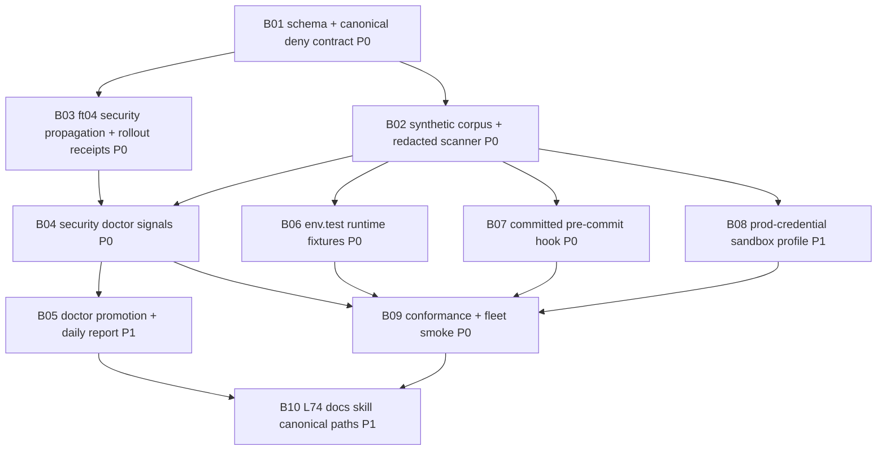

# Phase 2 REFINE r3 — Converged Agent Security Controls Plan

Plan: `agent-security-controls-fleet-wide-2026-05-04`
Status: synthesis r3 convergence pass complete
ladder_passed: yes

## 1. Executive Summary

Canonical fix: create a fleet-wide, schema-backed agent security control plane that makes secret access a mechanical contract instead of a prompt reminder. The core intervention is a canonical `settings.json` deny block plus runtime proof layers: synthetic `.env.test` fixtures, redacted output probes, committed pre-commit hooks, doctor signals, and a sandbox pattern for prod-credential work. This is Meadows #5 RULES: the fleet currently has advice and partial hygiene, but no enforcing rule substrate for the three leak vectors Joshua flagged.

This plan extends the existing `validation-receipt/v1` / `auth-marker/v1` family with a new sandbox-only `agent-security-control/v1` contract. It reuses ft04's propagation mechanism, B14's three-Q registry style, `safe-probe.sh`, `mcp-secret-scanner`, and doctor-signal promotion patterns. It does not rotate secrets, mutate settings, create beads, or claim production semantics during Phases 1-3.

Bead DAG shape: 10 beads across 5 waves. Wave 1 defines schema, deny template, and pattern corpus. Wave 2 propagates and records sandbox rollout receipts. Wave 3 adds doctor signals, promotion, and daily-report consumption. Wave 4 adds runtime controls: `.env.test`, pre-commit, and sandbox profile. Wave 5 proves conformance and wires L74/docs/canonical paths.

R3 convergence keeps the r2 architecture unchanged. It only tightens one measurable acceptance gate, confirms the 12 doctor promotion thresholds, and sharpens the Phase 3 audit handoff.

Rollout: sandbox-first. Apply first in the flywheel source repo, then the four active agent-mail repos (`mobile-eats`, `skillos`, `alpsinsurance`, `polymarket-pico-z`), then the remaining 13 repos. Current discovered scope is 18 repos because Lane A found 17 target repos plus the flywheel source repo; the older "17 repos" wording should be treated as "17 non-source targets."

## 2. Problem Statement

Lane A establishes that the fleet has a real enforcement gap, not just a documentation gap.

Top leak vectors:

1. Direct file read/search of `.env*`, key files, credential dirs, MCP/Codex/Claude config, and Infisical/opencode caches.
2. Runtime output capture from test failures, stderr, HTTP logs, DB connection dumps, receipts, doctor JSON, and pane scrollback.
3. Grep/search/corpus indexing hits that print token-bearing lines or persist them into Socraticode/Jeff-corpus/Qdrant-style stores.

Top five failure modes by criticality:

1. Direct `.env*` read or grep returns live provider/API keys.
2. Runtime stderr/stdout prints DB URLs, JWTs, authorization headers, or provider keys into receipts or pane logs.
3. Pane scrollback or callback evidence captures agent-mail tokens and cross-orch credentials.
4. Git history or staged changes retain `.env*`, private key material, or production-shaped fixtures.
5. Vector/corpus indexing persists token-shaped material for later retrieval.

Current-state baseline:

| Baseline item | Lane A result |
|---|---:|
| Current discovered scope | 18 repos: 17 targets plus `flywheel` source |
| Home Claude deny rules | 0 |
| Repo settings deny rules | 18/18 absent or 0 |
| Repos with no effective agent secret deny rule | 18/18 |
| Repos missing root `.env` ignore pattern | 8/18 |
| Repos without observed secret-aware pre-commit surface | 13/18 |
| Repos with `.env*` paths in git history | 7/18 |
| Repo-wide token-shaped classes observed | 15 classes, all counts emitted without values |
| Pane samples with token-shaped hits | `flywheel:1`, `mobile-eats:1`, `mobile-eats:2`, `skillos:2` |

Criticality: AWS, Stripe live, private keys, Cloudflare tokens, Supabase service-role keys, and scoped GitHub PATs are catastrophic if live. Agent-mail tokens are high risk because they can forge callbacks, messages, and coordination state. Provider API keys are high risk for spend, data exfiltration through model calls, and automation impersonation.

## 3. Ecosystem Precedent

Lane B's ecosystem audit converges on one rule: deny-list alone is insufficient. The durable pattern is deny rules plus fixtures, redaction, explicit risk acknowledgement, doctor visibility, and promotion into beads when drift appears.

Top ADOPT primitives:

1. Anthropic docs: `permissions.deny` is the supported enforcement layer and deny wins before ask/allow.
2. Anthropic issue history: `.env`/`.dev.vars` denial has had regressions, so runtime smoke tests must prove current behavior.
3. zodchii/TIMEWELL primitive: block direct reads, make `.env.test`, add secret pre-commit hook, use vault, ignore/history-scan `.env*`, and isolate prod credential work.
4. Jeff `pi_agent_rust` env/file confinement: block env enumeration, credential theft, filesystem escape, and support high-security env allow-list mode with adversarial fixtures.
5. Jeff provider-auth redaction: diagnostics must redact headers, JSON fields, log context, live E2E headers, artifacts, and startup auth probes.
6. Frankentui/frankenterm redaction tests: assert known GitHub/AWS/Slack/Stripe/Bearer strings are absent after redaction and score recall/precision so "redacted everything" is not a false win.
7. DCG allowlist semantics: baseline deny, targeted allow, expiry, no wildcard, and explicit risk acknowledgement.
8. Committed hook and scanner adapter pattern: use committed `githooks/` plus `core.hooksPath`/installer proof, and allow gitleaks/trufflehog-style plugins where local corpus coverage is insufficient.

Cross-cutting conclusions:

- Prompt rules are reminders; execution-layer gates are controls.
- Settings deny rules are necessary but do not control already-loaded env, Bash child output, receipts, pane capture, screenshots, or Codex parity.
- Runtime output redaction is first-class; a scanner that only checks files misses the second zodchii vector.
- Codex parity cannot be assumed from Claude settings or hooks.
- Every new signal needs a producer, measurement, consumer, and promotion path per the existing doctor-signal pattern.

## 4. Solution Architecture

### Canonical Contract

Add `agent-security-control/v1` as a sibling of `auth-marker/v1` under `.flywheel/validation-schema/v1/`. It is sandbox-only in v1. Required fields should include scope, settings deny rules, path denies, bash/output deny posture, override policy, fixture policy, doctor signals, issued/expires metadata, issuer, and rollback guard.

### Canonical Settings Deny Block

Render a managed deny block into Claude settings rather than hand-stamping per repo. The block covers `.env*`, `.dev.vars*`, key material, `secrets/**`, `credentials/**`, `.aws/**`, `.ssh/**`, `.npmrc`, `.pypirc`, `.netrc`, `.git-credentials`, Infisical/opencode caches, and rendered MCP artifacts. Unsupported runtime grammar becomes an explicit parity gap, not a silent pass.

Override pattern: `canonical-security-allow` with reason, expiry, owner, and exact path/command scope. Since JSON comments are not valid, Phase 3 should decide whether this is represented as an adjacent `.flywheel/security/v1/security-overrides.jsonl` receipt file or a managed settings metadata field. Wildcards and expired overrides fail doctor.

### Propagation

Extend ft04's doctrine propagation model for security settings. Dry-run must report per-repo drift; apply must backup, preserve non-managed settings, write atomically, and be idempotent. The target scope is the current 18-repo discovered set, with rollout phrased as 17 targets plus source.

### Runtime Safety

Define `.env.test` and `.env.example` fixture standards with synthetic-only values. Runtime tests must load `.env.test` by default and failed tests must not print raw fixture tokens. The secret-pattern corpus is shared by scanner, pre-commit hook, validation parser, and doctor.

### Pre-Commit

Ship a committed hook dispatcher or installer, not a local `.git/hooks` marker. It scans staged changes and sensitive filenames using the shared corpus, emits class/path only, and preserves/chains existing hooks with rollback.

### Container Isolation

For prod-credential work, define a high-risk sandbox profile: read-only root, no-new-privileges, dropped capabilities, no Docker socket, default-deny egress where feasible, explicit workspace mount, secret paths over-mounted from `/dev/null`, and short-lived `/secrets` tmpfs only when ratified.

### Doctor Signals

Twelve proposed doctor fields. Each field must expose `producer`, `measurement`, `consumer`, and `promotion_path` metadata so it follows the doctor-signal substrate rather than becoming another inert JSON field.

| Signal | Threshold | Auto-promotion trigger |
|---|---|---|
| `settings_deny_rules_present` | FAIL when false for a required repo. | Create `security_missing_deny_block` drift bead. |
| `settings_deny_rules_count` | WARN when count is below canonical minimum. | Promote only when paired with missing required entries. |
| `secret_path_deny_missing_count` | FAIL when `> 0`. | Create `security_secret_path_deny_missing` bead with missing classes only. |
| `env_in_gitignore` | WARN when false; FAIL when repo has `.env*` files. | Create `security_env_gitignore_missing` bead. |
| `env_in_gitignore_missing_count` | WARN fleet-wide when `> 0`; strict FAIL after rollout. | De-duped fleet drift bead for missing ignore coverage. |
| `pre_commit_secret_hook_present` | WARN when false; FAIL for rollout-required repos. | Create `security_precommit_hook_missing` bead. |
| `pre_commit_secret_hook_missing_count` | WARN when `> 0`; strict FAIL after rollout. | De-duped fleet drift bead for missing hook coverage. |
| `leaked_secret_pattern_count` | FAIL for high-confidence live-shaped classes `> 0`; WARN for fixture/doc candidates. | P0 bead for AWS/Stripe live/private key/GitHub PAT/Cloudflare/Supabase classes. |
| `runtime_env_secret_visible_count` | FAIL when `> 0`. | Create `security_runtime_secret_visible` bead with fixture receipt path. |
| `codex_secret_guard_parity_count` | FAIL when required parity probe count is below expected or gap count `> 0`. | Create `security_codex_parity_gap` bead. |
| `agent_mail_token_scrollback_hits_count` | FAIL when high-confidence hits `> 0`. | Create `security_agent_mail_token_scrollback` bead; values redacted. |
| `security_control_receipt_freshness` | WARN when stale `> 7d`; FAIL when missing for required repo. | Create `security_control_receipt_stale` bead. |

### L74 Candidate

L74 `AGENT-SECURITY-DENY-RULES-CANONICAL`: every flywheel-installed repo carries the canonical agent-secret control contract; settings deny rules are mandatory but not sufficient; runtime fixtures, redaction probes, hook coverage, doctor signals, and explicit override receipts are required before a repo can report security posture as green.

## 5. Bead DAG

R2 keeps r1's 10-bead DAG to stay inside the `/flywheel:plan` target range while preserving coverage. Dependency direction is cycle-free by inspection: all arrows flow from Wave 1/2 primitives into Wave 3 signals, then Wave 4 controls, Wave 5 conformance, and final doctrine. There are no back-edges from B10 into implementation beads.

### Wave 1 — Contract

#### B01 — `fix(security-contract): define agent-security-control/v1 and canonical deny template`

Priority: P0
Combines Lane C S01/S02.

Acceptance gates:
- `python3 -m json.tool .flywheel/validation-schema/v1/agent-security-control.schema.json`
- `jq -e '.properties.schema_version.const == "agent-security-control/v1"' .flywheel/validation-schema/v1/agent-security-control.schema.json`
- `python3 -m json.tool .flywheel/security/v1/claude-settings-deny.json`
- `jq -e '.permissions.deny | length >= 20' .flywheel/security/v1/claude-settings-deny.json`
- `rg -n "agent-security-control/v1|canonical-security-allow" .flywheel/validation-schema/v1/README.md .flywheel/security/v1 README.md`

Three-Q: schema/template tests validate; README documents; canonical-paths and doctor consume.

Doctrine/skills: L48, L58, L61, L69, L71, L74 candidate; `agent-security`, `canonical-cli-scoping`.

Blocks: B03, B04, B10.

#### B02 — `fix(security-scanner): define synthetic pattern corpus and redacted scanner`

Priority: P0
Combines Lane C S03/S06.

Acceptance gates:
- `python3 -m json.tool .flywheel/security/v1/secret-patterns.json`
- `jq -e '.patterns | length >= 15' .flywheel/security/v1/secret-patterns.json`
- `.flywheel/scripts/security-posture-probe.sh --schema --json | jq -e '.schema'`
- Synthetic fixture emits counts/classes but no fake token value in stdout/stderr.
- `bash .flywheel/scripts/test-safe-probe.sh` still passes.

Three-Q: corpus and scanner fixtures validate; README/schema document; doctor/pre-commit consume.

Doctrine/skills: L48, L58, L69, L71; `mcp-secret-scanner`, `testing-conformance-harnesses`, `secret-output-probe-error`.

Blocks: B04, B06, B07, B08.

### Wave 2 — Propagation

#### B03 — `fix(security-propagation): extend ft04 sync for settings deny rollout receipts`

Priority: P0
Combines Lane C S04/S05.

Acceptance gates:
- `sync-canonical-doctrine.sh --dry-run --json | jq -e 'has("security_settings_drift") or has("security")'` passes on the dry-run fixture.
- Fixture apply preserves non-managed settings and writes `.bak.<ts>`.
- Re-run apply is idempotent.
- Sandbox rollout receipt validates for flywheel plus active agent-mail repos or records `blocked_by`.
- Receipt contains rollback guard and no token-shaped values.

Three-Q: dry-run/apply fixtures validate; help/docs document; doctor consumes drift and freshness.

Doctrine/skills: L48, L51, L61, L70, L71, ft04, `accretive-cron-orchestration`.

Blocks: B04, B09.

### Wave 3 — Doctor And Promotion

#### B04 — `fix(security-doctor): expose security posture signals in flywheel-loop doctor`

Priority: P0
From Lane C S07.

Acceptance gates:
- `flywheel-loop doctor --repo /Users/josh/Developer/flywheel --json | jq '.security'`
- `.security.settings_deny_rules_present` is boolean.
- `jq -e 'all(.security.signals[]; has("producer") and has("measurement") and has("consumer") and has("promotion_path"))'` passes on doctor fixture output.
- Fixture tests cover PASS/WARN/FAIL/strict FAIL.
- Doctor output contains counts/classes only, never matched values.
- Existing `tests/doctor-validation-signals.sh` continues to pass.

Three-Q: doctor fixture validates; README documents `.security`; promotion consumes.

Doctrine/skills: L60, L61, L70, L71, L74 candidate; `system-health`.

Blocks: B05, B09.

#### B05 — `fix(security-promotion): route security doctor drift to beads and daily report`

Priority: P1
From Lane C S08.

Acceptance gates:
- Fixture doctor JSON with `leaked_secret_pattern_count > 0` creates or matches one P0 auto-doctor bead.
- Fixture doctor JSON with missing deny/pre-commit/runtime-visible signals creates the expected class-specific bead and no duplicates on re-run.
- Healthy security fixture emits noop.
- Daily-report fixture includes Security section with status/counts/top failing repos.
- Recent-closed de-dupe works.
- Promotion descriptions do not include secret values.

Three-Q: promotion fixture validates; README/daily report document; auto-doctor surfaces.

Doctrine/skills: L52, L53, L56, L60, L61, L71; `system-health`.

Blocks: B10.

### Wave 4 — Runtime Controls

#### B06 — `fix(security-fixtures): standardize .env.test and runtime-output safety`

Priority: P0
From Lane C S09.

Acceptance gates:
- Synthetic `.env.test` fixture passes.
- Live-shaped `sk_live_`, `AKIA`, private key, or JWT in `.env.test` fails unless explicitly synthetic.
- Runtime failure fixture does not print raw token values.
- Repos with prod `.env*` get migration receipt or `blocked_by`.
- README lists allowed fixture prefixes and forbidden classes.

Three-Q: positive/negative runtime fixtures validate; standard documented; doctor reports.

Doctrine/skills: L48, L71, L74 candidate; zodchii checklist.

Blocks: B09.

#### B07 — `fix(security-hooks): install committed secret pre-commit dispatcher`

Priority: P0
From Lane C S10.

Acceptance gates:
- `bash tests/security-precommit-hook.sh` passes.
- Staged fake secret blocks commit with class/path only.
- Safe synthetic `.env.example` passes.
- Fixture sets `core.hooksPath` only after `--apply`.
- Existing hook is preserved or chained with backup.

Three-Q: staged fixtures validate; install/rollback documented; doctor reports hook presence.

Doctrine/skills: L48, L51, L71; Lane B committed-hook precedent.

Blocks: B09.

#### B08 — `fix(security-sandbox): define prod-credential container isolation profile`

Priority: P1
From Lane C S11.

Acceptance gates:
- `.flywheel/security/v1/container-isolation.md` exists.
- `tests/security-container-isolation.sh` rejects `--privileged`, host network, Docker socket, or `.env` mount.
- High-security fixture proves env allow-list mode hides unrelated host env while preserving explicit test-only vars.
- Hardened fixture passes with read-only root and explicit workspace mount.
- README documents when sandbox mode is required.
- Doctor reports recommendation, not blanket failure, for high-risk repos.

Three-Q: spec fixtures validate; profile documented; doctor surfaces recommendation.

Doctrine/skills: L48, L71, L74 candidate; `agent-sandboxing`.

Blocks: B09.

### Wave 5 — Proof And Doctrine

#### B09 — `fix(security-e2e): run conformance harness and fleet dry-run smoke`

Priority: P0
From Lane C S12.

Acceptance gates:
- `bash tests/security-control-conformance.sh` passes.
- `bash tests/security-control-fleet-smoke.sh --dry-run` passes.
- Conformance report lists every MUST clause in `agent-security-control/v1`.
- Strict mode fails fixture repos with missing deny rules, missing hook, or leaked synthetic token.
- Redaction report includes recall/precision against the synthetic corpus and startup auth probe output.
- Validation receipt writes under `.flywheel/validation-receipts/` and routes through validation-learn.

Three-Q: conformance validates; report documents; receipt/doctor/learn route surfaces.

Doctrine/skills: L60, L69, L70, L71; B14 three-Q registry, `testing-conformance-harnesses`.

Blocks: B10.

#### B10 — `fix(security-doctrine): wire L74, README, skill draft, and canonical paths`

Priority: P1
Combines Lane C S13 and skill publication decision.

Acceptance gates:
- `rg -n "^## L74 — AGENT-SECURITY-DENY-RULES-CANONICAL" AGENTS.md`
- `rg -n "agent-security-control/v1|security-control" README.md .flywheel/canonical-paths.txt`
- Skill draft exists in plan or skillos-owned path; otherwise callback records `blocked_by=skillos_skill_publication`.
- Doctrine/memory wire test includes L74/canonical paths.
- Strict doctor does not fail on missing security docs after B09 receipt.

Three-Q: doctrine tests validate; L74/README/skill document; canonical paths and doctor surface.

Doctrine/skills: L48, L56, L61, L70, L71, L74 candidate; `agent-security`.

Blocks: final Phase 5 polish only.

## Coverage Matrix

| Lane A failure class | Covered by |
|---|---|
| Direct `.env*` read/search | B01, B03, B04, B09 |
| Runtime stderr/stdout leak | B02, B06, B09 |
| Grep/search prints token lines | B01, B02, B04, B09 |
| Worker dispatch/callback carries secrets | B02, B04, B05, B09 |
| Pane scrollback captures tokens | B04, B05, B09 |
| Doctor/receipt contains raw output | B02, B04, B09 |
| Cron/launchd/env inheritance | B02, B04, B08, Phase 3 audit unknown |
| MCP/Codex config literals | B02, B04, Phase 3 audit unknown |
| `.env.test` fixture contamination | B02, B06, B09 |
| Git staged/history leakage | B07, B09; history rewrite remains out of scope unless audit escalates |
| Container still mounts host secrets | B08, B09 |
| Vector/corpus indexing persists secrets | B02, B04, Phase 3 audit unknown |

Lane B primitive cross-check:

- High-security env allow-list mode: B08 primary; B02/B09 fixture proof.
- Startup auth probe redaction: B02 corpus; B09 conformance report.
- Redaction recall/precision: B02 fixture corpus; B09 scoring.
- Agent-mail snapshot scrub / token masking: B04 signal; B05 promotion; B09 smoke.
- Gitleaks/trufflehog-style adapters: B02 extension point; B07 hook; B09 fleet dry-run.

## 6. Rollout Plan

Rollout remains sandbox-only until a separate production ratification exists.

1. Flywheel source repo: build schema, template, scanner, doctor, and dry-run propagation.
2. Active agent-mail repos: `mobile-eats`, `skillos`, `alpsinsurance`, `polymarket-pico-z`.
3. Remaining 13 repos in current ft04/fleet scope.

Rules:

- No secret rotation.
- No live secret values in artifacts.
- Dry-run before apply.
- Backup before write.
- Rollback command in every apply receipt.
- Malformed settings, ambiguous hooks, or unsupported runtime grammar produce `blocked_by=<specific>` receipts rather than forced writes.
- Current scope mismatch is explicit: report both `target_repos=17` and `scope_with_source=18` until Phase 3 locks terminology.

## 7. Open Questions For Phase 3 Audit

1. Claude settings grammar: which exact deny entries are valid and enforced in the current Claude Code version, and what smoke test proves deny still wins over allow/ask?
2. Codex parity: what can actually block Codex direct file reads/searches without a Claude hook layer, and does Phase 3 need a separate Codex guard bead?
3. False positives: which Lane A token-shaped counts are fixtures/docs versus live high-confidence leaks, and which classes should strict doctor fail immediately?
4. Settings surface: should canonical deny rules land in home settings, repo `.claude/settings.json`, managed settings, or a combination, and where do JSON-safe override receipts live?
5. Corpus/indexing: do Socraticode/Qdrant and Jeff-corpus ingestion already exclude secret substrates, or does Phase 3 need a dedicated index-redaction bead?

Open questions count: 5.

## 8. Three-Q Audit Of This Synthesis

VALIDATED:

- Claims trace to Lane A, Lane B, Lane C, or the local validation/doctor/propagation surfaces read during r1/r2.
- Every bead has command/path/schema/fixture acceptance gates.
- Every doctor signal has a named threshold, consumer, and promotion trigger.
- Every high-criticality Lane A failure class maps to at least one bead.

DOCUMENTED:

- Structure follows `/flywheel:plan` Phase 2 r1/r2: executive summary, compressed lanes, architecture, DAG, rollout, audit questions, convergence metric.
- Skills cited: `planning-workflow`, `jeff-convergence-audit`, `agent-security`, `canonical-cli-scoping`, `mcp-secret-scanner`, `agent-sandboxing`, `testing-conformance-harnesses`, `system-health`, `accretive-cron-orchestration`.
- Doctrine refs cited: L48, L51, L52, L53, L56, L58, L60, L61, L69, L70, L71, L74 candidate.

SURFACED:

- DAG is dispatchable after Phase 3/Joshua-disposes and remains cycle-free by forward-only wave ordering.
- No orphan dependencies.
- Phase 3 audit lenses should focus on Claude settings grammar, Codex parity, false positives, settings surface choice, and corpus/indexing.

## 9. Convergence Metric

Round 3 convergence:

- Prior refine artifact: `02-REFINE-r2.md`, 436 lines.
- This r3 artifact keeps the same 10-bead DAG, 12 doctor signals, and 5 audit questions.
- Strict diff formula for callback: `((added_lines + removed_lines) / 436) * 100`.
- Computed after write: `added_lines=10`, `removed_lines=10`, `diff_pct_vs_r2=4.6`.

## Ladder Check

Plan-space only:

- No settings mutations.
- No source implementation edits.
- No bead creation.
- No commits.
- Output artifact only: `.flywheel/plans/agent-security-controls-fleet-wide-2026-05-04/02-REFINE-r3.md`.

Ladder verdict: `ladder_passed=yes`.
