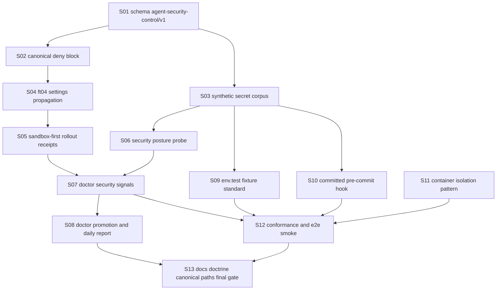

# Lane C — Implementation Design: agent-security-controls-fleet-wide

Plan: `agent-security-controls-fleet-wide-2026-05-04`
Phase: `1.RESEARCH`
Lane: `C — implementation design`
Worker: `flywheel:2 codex`
Generated: `2026-05-04`

Lane C scope: design the solution. No settings mutations, no hooks installed, no source implementation edits, no bead creation, no commits.

## Evidence Ledger

- Lane A problem inventory: `.flywheel/plans/agent-security-controls-fleet-wide-2026-05-04/01-RESEARCH-A.md`
- Lane B ecosystem audit: `.flywheel/plans/agent-security-controls-fleet-wide-2026-05-04/01-RESEARCH-B.md`
- Intent: `.flywheel/plans/agent-security-controls-fleet-wide-2026-05-04/00-INTENT.md`
- Validation family: `.flywheel/validation-schema/v1/schema.json`, `.flywheel/validation-schema/v1/auth-marker.schema.json`, `.flywheel/validation-schema/v1/parse.sh`
- Propagation target: `.flywheel/scripts/sync-canonical-doctrine.sh`
- Existing secret-safe primitive: `.flywheel/scripts/safe-probe.sh`, `.flywheel/scripts/test-safe-probe.sh`
- Doctor/promotion targets: `~/.claude/skills/.flywheel/bin/flywheel-loop doctor`, `.flywheel/scripts/doctor-signal-bead-promotion.sh`
- Three-Q sibling pattern: `.flywheel/scripts/three-q-surface-audit.py`, `tests/three-q-surface-audit.sh`
- Secrets reference: `~/.claude/references/claude-md-secrets.md`

## Skills Best-Practices Matches

Requested query: `/flywheel:skills-best-practices "agent security implementation deny rules canonical contract" --top=10`.
In this worker context I used the equivalent skill-search MCP query and direct skill reads.

| Skill / source | Decision | Implementation impact |
|---|---:|---|
| `agent-security` | ADOPT | Primary doctrine: output filtering, scoped credential access, audit logger, no security-by-prompt-only. |
| `canonical-cli-scoping` | ADOPT | Every new probe/audit/repair surface needs doctor/health/repair, validate/audit/why, `--json`, schemas, dry-run/apply split, and stable exit codes. |
| `mcp-secret-scanner` | ADOPT/EXTEND | Reuse detection rules and Claude/Codex parity shape; extend beyond MCP configs into repo/fleet posture. |
| `agent-sandboxing` | ADOPT | High-risk/prod credential work gets sandbox/container posture with filesystem and egress constraints. |
| `testing-conformance-harnesses` | ADOPT | Security controls need MUST-clause fixtures, negative tests, and compliance matrix, not prose claims. |
| `system-health` | ADOPT | Doctor fields should be tiered, exit-coded, trendable, and paired with non-destructive recovery ladders. |
| `accretive-cron-orchestration` | ADOPT | Propagation and drift repair should be tick-visible, not one-time manual cleanup. |
| `cryptography-and-auth` | ADOPT | Blast-radius taxonomy and credential lifecycle language for L74 and policy docs. |
| `infisical-secrets` | EVALUATE | Secrets should resolve through live-first helper surfaces, not project `.env` files; cache paths must be guarded. |
| `agent-mail` | ADOPT | Agent-mail registration tokens are a live credential class; callback/file-reservation surfaces require scrub checks. |

Socraticode survey ran 3 searches against `/Users/josh/Developer/flywheel` for deny-rule contracts, auth-marker fail-closed schema, and ft04 propagation. Lane B added 8 Jeff-corpus searches; this design imports its findings where applicable.

## Design Stance

Settings deny rules are necessary but insufficient. They address direct Claude `Read`/search behavior only if the current runtime honors them. They do not cover Bash child output, process env visibility, pane scrollback, Codex parity, generated receipts, git history, or corpus indexing. Therefore the implementation needs five layers:

1. Canonical contract: machine-readable schema and canonical deny block.
2. Propagation: ft04-style fleet sync with backup, dry-run, and drift reporting.
3. Detection: doctor signals for policy, `.env` hygiene, hooks, and token-shaped leakage.
4. Runtime controls: `.env.test` fixtures, output redaction, safe probes, committed pre-commit hooks, and high-risk sandbox posture.
5. Validation: conformance harness plus three-Q registry rows so every surface is validated, documented, and surfaced.

## C.1 SKILL.md Draft For Canonical Security Control

Decision: draft a new skill `flywheel-agent-security-controls` rather than editing `agent-security` directly in this phase. The existing `agent-security` skill remains the parent conceptual skill. This local skill should be authored by skillos or as a follow-up doctrine bead after Joshua-disposes, because many skills are JSM-managed.

Draft `SKILL.md`:

```markdown
---
name: flywheel-agent-security-controls
description: >-
  Use when implementing or auditing flywheel-wide agent secret controls:
  canonical settings deny rules, secret-read overrides, .env.test fixtures,
  pre-commit secret hooks, doctor security posture, and sandbox-first credential work.
---

# Flywheel Agent Security Controls

Core principle: secret safety is an execution-layer contract, not a prompt reminder.
Every flywheel-installed repo must be able to prove its agents cannot read,
search, echo, commit, or persist token material by accident.

## Canonical Contract

Security posture is represented by `agent-security-control/v1`, a sibling of
`auth-marker/v1` in `.flywheel/validation-schema/v1/`. The v1 contract is
sandbox/local-only. Production semantics require a separate ratification marker.

Required posture:
- Claude home and repo settings carry a canonical deny block.
- Secret paths are denied for `Read`/search-equivalent tools.
- Shell probes use secret-safe wrappers and output scanners.
- Legitimate reads require a scoped override receipt.
- Tests use synthetic token fixtures only.
- Every mutation has dry-run/apply, backup, and rollback.

## Canonical Settings Deny Block

The deny block is rendered from `agent-security-control/v1`, not hand-authored
per repo. It blocks secret substrates, including:
- `.env`, `.env.*`, `.dev.vars`, `.dev.vars.*`
- `*.pem`, `*.p12`, `*.key`, `id_rsa`, `id_ed25519`
- `secrets/**`, `credentials/**`, `.aws/**`, `.ssh/**`
- `.npmrc`, `.pypirc`, `.netrc`, `.git-credentials`, package auth configs
- Infisical/opencode cache files and rendered MCP config artifacts

## Override Pattern

Legitimate reads use a line-local receipt comment:

`# canonical-security-allow: <reason> expires=<ISO8601> owner=<agent-or-human> scope=<path-or-command>`

Rules:
- No wildcard path broader than one repo or one named file group.
- No production secret value may be printed as override evidence.
- Expired overrides fail doctor.
- Overrides for memory reads are allowed only for documented memory paths such
  as `~/.claude/projects/.../memory`, and must not include token-like values.

## Path Conventions

The v1 marker is sandbox-only:
- Schema: `.flywheel/validation-schema/v1/agent-security-control.schema.json`
- Canonical pattern corpus: `.flywheel/security/v1/secret-patterns.json`
- Canonical settings template: `.flywheel/security/v1/claude-settings-deny.json`
- Fixture repo roots: `tests/fixtures/security-control/*`
- Receipts: `.flywheel/validation-receipts/security-control-*.json`

Production credential work must use a separate production ratification marker.

## Required Commands

All command surfaces must follow `canonical-cli-scoping`:
- `security-control doctor --json`
- `security-control health --json`
- `security-control repair --dry-run|--apply --idempotency-key`
- `security-control validate <repo|settings|fixtures|hook>`
- `security-control audit --json`
- `security-control why <finding-id> --json`
- `security-control schema <command>`

## Tests

Use only synthetic tokens. A fixture that contains a real-looking live secret is
a failing fixture unless it is synthetic and named as such. Conformance reports
must list every MUST clause, tested status, and failure class.
```

## C.2 Phase Decomposition And Preliminary Bead DAG

Bead IDs below are placeholders for Phase 4. Phase 4 should create real `flywheel-*` IDs with these titles and dependencies.



### Wave 1 — Contract And Canonical Inputs

#### S01 — `fix(security-schema): define agent-security-control/v1 schema [S01]`

Priority: P0

Spec:
- Add `.flywheel/validation-schema/v1/agent-security-control.schema.json`.
- Extend `.flywheel/validation-schema/v1/README.md` with the new sibling contract.
- Schema is sandbox/local-only, mirroring `auth-marker/v1`; prod ratification is explicitly out of scope.
- Include fields for `schema_version`, `scope`, `settings_deny_rules`, `path_denies`, `bash_denies`, `override_policy`, `fixture_policy`, `doctor_signals`, `issued_at`, `expires_at`, `issuer`, and `rollback_guard`.

Acceptance gates:
- `jq -e '.properties.schema_version.const == "agent-security-control/v1"' .flywheel/validation-schema/v1/agent-security-control.schema.json`
- `jq -e '.properties.scope.properties.env.enum | index("sandbox")' .flywheel/validation-schema/v1/agent-security-control.schema.json`
- `rg -n "agent-security-control/v1" .flywheel/validation-schema/v1/README.md .flywheel/canonical-paths.txt`
- `python3 -m json.tool .flywheel/validation-schema/v1/agent-security-control.schema.json >/dev/null`
- `bash .flywheel/validation-schema/v1/parse.sh .flywheel/validation-schema/v1/fixtures/pass/*.json`

Three-Q audit:
- VALIDATED: schema JSON parse and fixture validation.
- DOCUMENTED: README explains required fields and sandbox-only boundary.
- SURFACED: canonical-paths entry added.

Doctrine refs: L48, L56, L60, L61, L71, candidate L74; `auth-marker/v1`.

Blocked by: none.

#### S02 — `fix(security-settings): render canonical Claude settings deny block [S02]`

Priority: P0

Spec:
- Add canonical deny template under `.flywheel/security/v1/claude-settings-deny.json`.
- Template covers direct file-read/search paths from Lane A and Lane B: `.env*`, `.dev.vars*`, key material, secret dirs, auth config files, Infisical/opencode caches, MCP rendered artifacts.
- Include `# canonical-security-allow: ...` override receipt grammar in docs and parser fixtures; if JSON comments are impossible, use adjacent `.flywheel/security/v1/security-overrides.jsonl`.
- Include command-level deny patterns for shell read/exfil attempts where the runtime supports Bash permission rules; otherwise mark as `runtime_parity_gap`.

Acceptance gates:
- `python3 -m json.tool .flywheel/security/v1/claude-settings-deny.json >/dev/null`
- `jq -e '.permissions.deny | length >= 20' .flywheel/security/v1/claude-settings-deny.json`
- `rg -n "canonical-security-allow" .flywheel/security/v1 README.md AGENTS.md`
- Synthetic fixture proves `.env`, `.env.local`, `.dev.vars`, `.aws/credentials`, `.ssh/id_ed25519`, `*.pem`, `.npmrc` are denied by pattern.
- Explicit `runtime_parity_gap` is present for any deny grammar not supported by Codex.

Three-Q audit:
- VALIDATED: template parses and synthetic path deny matrix passes.
- DOCUMENTED: override grammar and unsupported runtime gaps documented.
- SURFACED: doctor signal S07 consumes this template.

Doctrine refs: L58, L61, L69, L71, candidate L74; Lane B Anthropic docs/issues.

Blocked by: S01.

#### S03 — `fix(security-corpus): define synthetic secret pattern corpus [S03]`

Priority: P0

Spec:
- Add `.flywheel/security/v1/secret-patterns.json` with classes from Lane A and Lane B.
- Include synthetic fixtures only; no live tokens.
- Include precision/recall notes from Lane B Jeff corpus redactor methodology.
- Parser must reject raw fixture values that look live unless marked `synthetic=true` and generated from known fake prefixes.

Acceptance gates:
- `python3 -m json.tool .flywheel/security/v1/secret-patterns.json >/dev/null`
- `jq -e '.patterns | length >= 15' .flywheel/security/v1/secret-patterns.json`
- `rg -n "FAKE_|SYNTHETIC_" .flywheel/security/v1/fixtures`
- `! rg -n "sk_live_|sk-ant-|ghp_|AKIA[0-9A-Z]{16}" .flywheel/security/v1/fixtures --glob '!README*'`
- `bash tests/security-pattern-corpus.sh` passes.

Three-Q audit:
- VALIDATED: corpus regression test.
- DOCUMENTED: classes map to Lane A blast-radius table.
- SURFACED: probe S06 and pre-commit hook S10 import this corpus.

Doctrine refs: L58, L71; `mcp-secret-scanner`, `testing-conformance-harnesses`.

Blocked by: none.

### Wave 2 — Propagation And Sandbox Rollout

#### S04 — `fix(security-propagation): extend ft04 sync to settings deny rules [S04]`

Priority: P0

Spec:
- Extend `.flywheel/scripts/sync-canonical-doctrine.sh` or add a sibling `sync-canonical-security.sh` only if separation is required by Lane B/Phase 3.
- Dry-run reports per repo: settings file path, deny block present, deny count, missing rules, backup path that would be written.
- Apply writes repo-local `.claude/settings.json` with backup-before-write and atomic replace.
- Must preserve existing repo settings outside canonical managed block.
- Must support explicit roots for tests and current 18-repo fleet scope.

Acceptance gates:
- `bash -n .flywheel/scripts/sync-canonical-doctrine.sh`
- `sync-canonical-doctrine.sh --dry-run --json | jq '.security_settings_drift'` or sibling equivalent exists.
- Fixture repo with existing settings preserves non-canonical keys after `--apply`.
- Re-running `--apply` is idempotent and produces no extra diff.
- Backup file `.bak.<ts>` exists for changed settings.

Three-Q audit:
- VALIDATED: fixture dry-run/apply/idempotency tests.
- DOCUMENTED: help text describes security sync mode.
- SURFACED: doctor S07 consumes drift output.

Doctrine refs: L48, L51, L61, L71, ft04, candidate L74.

Blocked by: S02.

#### S05 — `fix(security-rollout): create sandbox-first rollout receipts [S05]`

Priority: P0

Spec:
- Rollout order is explicit: flywheel source repo, then active agent-mail repos `mobile-eats`, `skillos`, `alpsinsurance`, `polymarket-pico-z`, then remaining 13 repos.
- First wave is dry-run and sandbox-only. No production semantics; no credential rotation.
- Each repo gets a validation receipt under `.flywheel/validation-receipts/security-control-<repo>.json`.
- Receipts record pre/post deny count, backup path, apply mode, and rollback command.

Acceptance gates:
- Receipt schema validates against `agent-security-control/v1`.
- `jq -e '.scope.env == "sandbox"'` passes for every rollout receipt.
- `jq -e '.rollback_guard | length > 0'` passes for every apply receipt.
- Active four repos have explicit receipt rows or `blocked_by=<reason>`.
- No receipt contains token-shaped values per `.flywheel/validation-schema/v1/parse.sh`.

Three-Q audit:
- VALIDATED: receipts and rollback command fields.
- DOCUMENTED: rollout order in plan artifact and README.
- SURFACED: doctor S07 reports rollout coverage.

Doctrine refs: L48, L58, L69, L70, L71, `auth-marker/v1`.

Blocked by: S04.

### Wave 3 — Doctor Signals And Promotion

#### S06 — `fix(security-probe): implement secret posture scanner with redaction [S06]`

Priority: P0

Spec:
- Extend `.flywheel/scripts/safe-probe.sh` or add `.flywheel/scripts/security-posture-probe.sh`.
- Must never print matched secret values; emits counts/classes/file counts only.
- Imports `secret-patterns.json`.
- Supports `--repo`, `--fleet`, `--json`, `--schema`, `--dry-run`, `--explain`.
- Uses `mcp-secret-scanner` for MCP/Codex config checks where possible.

Acceptance gates:
- `bash -n .flywheel/scripts/security-posture-probe.sh`
- `.flywheel/scripts/security-posture-probe.sh --schema --json | jq -e '.schema'`
- Synthetic fixture with fake tokens emits counts but no fake token value in stdout/stderr.
- Probe blocks or redacts `infisical-load --export`, `cf-secret <NAME>`, and raw `.env` reads.
- Existing `bash .flywheel/scripts/test-safe-probe.sh` still passes.

Three-Q audit:
- VALIDATED: synthetic redaction and blocked-output tests.
- DOCUMENTED: README command block and schema.
- SURFACED: doctor S07 and pre-commit S10 consume probe output.

Doctrine refs: L48, L58, L69, L71; `mcp-secret-scanner`, `secret-output-probe-error`.

Blocked by: S03.

#### S07 — `fix(security-doctor): expose fleet security posture doctor signals [S07]`

Priority: P0

Spec:
- Wire `flywheel-loop doctor --json` with security posture fields.
- Proposed fields:
  - `settings_deny_rules_present`
  - `settings_deny_rules_count`
  - `secret_path_deny_missing_count`
  - `env_in_gitignore`
  - `env_in_gitignore_missing_count`
  - `pre_commit_secret_hook_present`
  - `pre_commit_secret_hook_missing_count`
  - `leaked_secret_pattern_count`
  - `runtime_env_secret_visible_count`
  - `codex_secret_guard_parity_count`
  - `agent_mail_token_scrollback_hits_count`
  - `security_control_receipt_freshness`
- Strict doctor fails on missing deny rules or leaked high-confidence secret patterns in required surfaces.

Acceptance gates:
- `flywheel-loop doctor --repo /Users/josh/Developer/flywheel --json | jq '.security'` exists.
- `jq -e '.security.settings_deny_rules_present | type == "boolean"'` passes.
- Fixture doctor test covers PASS, WARN, FAIL, and strict fail.
- Doctor output contains counts/classes only, no matched values.
- Existing `tests/doctor-validation-signals.sh` continues to pass.

Three-Q audit:
- VALIDATED: doctor fixture tests and strict mode.
- DOCUMENTED: README describes `.security`.
- SURFACED: promotion S08 consumes these fields.

Doctrine refs: L60, L61, L70, L71, candidate L74; `system-health`.

Blocked by: S04, S06.

#### S08 — `fix(security-promotion): promote doctor security drift and daily report section [S08]`

Priority: P1

Spec:
- Extend `.flywheel/scripts/doctor-signal-bead-promotion.sh` for security symptoms.
- Symptoms: missing canonical deny block, missing pre-commit hook, leaked high-confidence pattern, runtime env secret visible, stale security receipt.
- Wire daily-report consumer `flywheel-o7dq` security section without blocking storage discipline.
- Create only one open auto-doctor bead per symptom class within 24h.

Acceptance gates:
- Fixture doctor JSON with `leaked_secret_pattern_count > 0` creates or matches a P0 bead in dry-run/apply test.
- Fixture doctor JSON with only healthy security emits noop.
- Daily-report fixture includes Security section with status, counts, and top failing repos.
- Recent-closed de-dupe path is tested.
- Promotion description never includes secret values.

Three-Q audit:
- VALIDATED: promotion fixture and daily-report fixture.
- DOCUMENTED: README and doctor signal docs.
- SURFACED: auto-doctor creates bead or de-dupes to root cause.

Doctrine refs: L52, L53, L56, L60, L61, L71, candidate L74; `flywheel-o7dq`.

Blocked by: S07.

### Wave 4 — Runtime Hygiene Controls

#### S09 — `fix(security-fixtures): standardize .env.test and runtime-safe fixtures [S09]`

Priority: P0

Spec:
- Define `.env.test` / `.env.example` fixture standard with synthetic-only values.
- Add checker that rejects production-shaped values in test fixtures unless corpus marks them synthetic.
- Repos with runtime tests must default to `.env.test`, not `.env`.
- Document migration path: keep prod `.env` outside agent-visible workspace where feasible.

Acceptance gates:
- Fixture repo with `.env.test` synthetic values passes.
- Fixture repo with live-shaped `sk_live_`, `AKIA`, private key, or JWT in `.env.test` fails.
- Runtime command fixture proves failed tests do not print raw token values.
- Lane A repos with prod `.env*` get explicit `blocked_by` or migration receipt.
- README lists allowed fixture prefixes and forbidden classes.

Three-Q audit:
- VALIDATED: positive and negative fixture tests.
- DOCUMENTED: fixture standard.
- SURFACED: doctor S07 reports fixture status.

Doctrine refs: L48, L71, candidate L74; Lane B zodchii checklist.

Blocked by: S03.

#### S10 — `fix(security-hooks): install committed secret pre-commit dispatcher [S10]`

Priority: P0

Spec:
- Prefer committed `githooks/` plus `core.hooksPath` or repo-local installer over untracked `.git/hooks`.
- Hook imports `secret-patterns.json` and scans staged changes plus sensitive filenames.
- Provides `--install`, `--check`, `--json`, `--dry-run`, `--apply`, and rollback.
- Does not auto-rotate or print values.

Acceptance gates:
- `bash tests/security-precommit-hook.sh` passes.
- Fixture staged fake secret blocks commit with class and path only.
- Fixture staged safe `.env.example` with allowed synthetic placeholders passes.
- `git config core.hooksPath` is set in fixture only after `--apply`.
- Existing repo hook is preserved or chained, with backup.

Three-Q audit:
- VALIDATED: staged fixture tests.
- DOCUMENTED: install/rollback docs and help.
- SURFACED: doctor S07 reports hook presence and missing count.

Doctrine refs: L48, L51, L71, candidate L74; Lane B committed-hook finding.

Blocked by: S03.

#### S11 — `fix(security-sandbox): define container isolation pattern for prod-credential work [S11]`

Priority: P1

Spec:
- Define a high-risk execution profile for prod credential work.
- Pattern includes read-only root, no-new-privileges, dropped capabilities, no Docker socket, default-deny egress where feasible, `/workspace` mount, secret paths over-mounted from `/dev/null`, and explicit `/secrets` tmpfs only for scoped short-lived credentials.
- This is a design and test profile, not mandatory for every local edit.

Acceptance gates:
- `.flywheel/security/v1/container-isolation.md` exists.
- `tests/security-container-isolation.sh` validates generated command/spec contains no Docker socket, no privileged mode, and secret path over-mounts.
- Fixture fails if `--privileged`, host network, or `.env` mount is present.
- Fixture passes for read-only root and explicit workspace mount.
- README documents when sandbox mode is required.

Three-Q audit:
- VALIDATED: command/spec fixture tests.
- DOCUMENTED: isolation pattern and use threshold.
- SURFACED: doctor S07 reports sandbox recommendation for high-risk repos, not blanket fail.

Doctrine refs: L48, L71, candidate L74; `agent-sandboxing`.

Blocked by: S03.

### Wave 5 — Conformance, Docs, Final Rollout Gate

#### S12 — `fix(security-e2e): run conformance harness and fleet smoke [S12]`

Priority: P0

Spec:
- Build a conformance harness modeled after B14 three-Q registry tests.
- Must exercise schema, settings deny template, propagation dry-run, doctor fields, hook fixtures, `.env.test` fixtures, safe-probe redaction, and sample fleet scan.
- Fleet smoke includes flywheel source repo and the four active agent-mail repos first.
- No real secret values in fixtures or output.

Acceptance gates:
- `bash tests/security-control-conformance.sh` passes.
- `bash tests/security-control-fleet-smoke.sh --dry-run` passes.
- Conformance report lists every MUST clause from `agent-security-control/v1` and score.
- Strict mode fails fixture repos with missing deny rules, missing hook, or leaked synthetic token.
- Validation receipt emitted under `.flywheel/validation-receipts/` and routes through validation-learn.

Three-Q audit:
- VALIDATED: full conformance and fleet smoke.
- DOCUMENTED: report and README.
- SURFACED: receipt, doctor, and learn route.

Doctrine refs: L60, L69, L70, L71, B14 three-Q registry.

Blocked by: S07, S09, S10, S11.

#### S13 — `fix(security-doctrine): wire L74, skill draft, canonical paths, README [S13]`

Priority: P1

Spec:
- Add L74 `AGENT-SECURITY-DENY-RULES-CANONICAL` to canonical `AGENTS.md`.
- Add README security posture section.
- Add canonical-paths entries for schema, corpus, deny template, probe, tests, and receipts.
- Add or queue skillos-owned skill `flywheel-agent-security-controls`.
- Final gate confirms no source implementation was called shipped without S12 receipt.

Acceptance gates:
- `rg -n "^## L74 — AGENT-SECURITY-DENY-RULES-CANONICAL" AGENTS.md`
- `rg -n "agent-security-control/v1|security-control" README.md .flywheel/canonical-paths.txt`
- Skill draft exists in plan or skillos-owned path; if not installed, callback includes `blocked_by=skillos_skill_publication`.
- `tests/doctrine-memory-wire.sh` or successor includes L74/canonical paths.
- `flywheel-loop doctor --strict --repo /Users/josh/Developer/flywheel --json` does not fail on missing security surface docs.

Three-Q audit:
- VALIDATED: doctrine wire tests and strict doctor.
- DOCUMENTED: L74, README, skill.
- SURFACED: canonical-paths and doctor fields.

Doctrine refs: L48, L56, L61, L70, L71, candidate L74.

Blocked by: S08, S12.

## Wave Summary

| Wave | Beads | Count | Rationale |
|---|---|---:|---|
| 1 | S01-S03 | 3 | Define schema, canonical deny template, and synthetic secret corpus before any propagation. |
| 2 | S04-S05 | 2 | Extend ft04-style propagation and produce sandbox-first rollout receipts. |
| 3 | S06-S08 | 3 | Wire scanner, doctor fields, promotion, and daily-report consumer. |
| 4 | S09-S11 | 3 | Add runtime fixture hygiene, committed hook, and high-risk sandbox pattern. |
| 5 | S12-S13 | 2 | Prove conformance, then land doctrine/docs/canonical paths. |

Total bead specs drafted: `13`.

## C.3 Test Plan

### Wave 1 Tests

Fixture inputs:
- Valid `agent-security-control/v1` receipt with sandbox scope, deny rules, override policy, fixture policy, and rollback guard.
- Invalid receipt with production scope, missing rollback, wildcard override, and token-shaped fixture value.
- Synthetic secret corpus with all Lane A classes.

Expected outputs:
- Valid fixture passes JSON schema and parser.
- Invalid fixture fails with deterministic failure classes: `prod_scope_unratified`, `rollback_guard_missing`, `override_wildcard_forbidden`, `secret_like_fixture_value`.
- Corpus test reports class coverage by secret type and blast radius.

Failure modes covered:
- Schema drift from `auth-marker/v1`.
- Prose-only security doctrine.
- Real token values accidentally embedded in fixtures.

### Wave 2 Tests

Fixture inputs:
- Repo with no `.claude/settings.json`.
- Repo with existing settings and non-security permissions.
- Repo with stale managed security block.
- Repo with malformed settings file.

Expected outputs:
- Dry-run emits planned writes only.
- Apply writes atomic file with backup and preserves non-managed settings.
- Re-run is idempotent.
- Malformed settings returns blocked result and does not overwrite.

Failure modes covered:
- ft04 propagation rewriting unrelated repo settings.
- No backup before mutation.
- Drift hidden by current 17-vs-18 fleet count mismatch.

### Wave 3 Tests

Fixture inputs:
- Doctor fixture repo healthy.
- Missing deny block.
- Missing `.env` ignore.
- Missing secret hook.
- Synthetic leaked token in scan surface.
- Token visible in runtime output fixture.

Expected outputs:
- `flywheel-loop doctor --json` exposes `.security`.
- Strict doctor fails on P0 security gaps.
- Promotion script creates/de-dupes auto-doctor bead without secret values.
- Daily report shows Security section with counts and top failing repos.

Failure modes covered:
- Doctor signal exists but has no promotion path.
- Doctor output leaks matched token values.
- Security drift remains invisible to ticks.

### Wave 4 Tests

Fixture inputs:
- `.env.test` with synthetic values.
- `.env.test` with live-shaped forbidden value.
- Staged git diff with fake token.
- Existing repo hook to preserve/chain.
- Container spec with forbidden `--privileged`, host network, Docker socket, or `.env` mount.

Expected outputs:
- Runtime tests use `.env.test` and never print raw fixture token values.
- Pre-commit blocks staged fake secret by class/path only.
- Hook install is dry-run/apply with rollback.
- Container isolation checker rejects unsafe specs and accepts hardened spec.

Failure modes covered:
- `.env.example`/`.env.test` contaminated with realistic tokens.
- Local `.git/hooks` marker mistaken for fleet enforcement.
- Container isolation that still mounts host secrets.

### Wave 5 Tests

Fixture inputs:
- Full conformance fixture registry modeled after B14.
- Fleet dry-run for flywheel + active agent-mail repos.
- Missing docs/canonical-paths fixture.

Expected outputs:
- Conformance matrix lists every MUST clause and PASS/FAIL.
- Validation receipt writes to `.flywheel/validation-receipts/` and routes through validation-learn.
- Strict doctor sees security docs, paths, and signals wired.
- No orphan dependency or final rollout gate bypass.

Failure modes covered:
- Calling settings present "validated" without runtime proof.
- Forgetting README/AGENTS/canonical-paths after implementation.
- B12-style final smoke absent.

## C.4 Migration And Rollout

Rollout is sandbox-first and receipt-first:

1. Flywheel source repo only: validate schema, template, scanner, doctor, and dry-run propagation.
2. Four active agent-mail repos: `mobile-eats`, `skillos`, `alpsinsurance`, `polymarket-pico-z`.
3. Remaining 13 repos from current 18-repo ft04 scope.

Rollout rules:

- No production ratification in v1.
- No secret rotation unless Joshua explicitly asks.
- No live secret values in receipts, logs, callbacks, reports, or fixtures.
- `--dry-run` before every `--apply`.
- Backup-before-write for settings, hooks, docs, and generated config.
- Rollback command stored in every apply receipt.
- Repos with malformed settings or ambiguous existing hooks get `blocked_by=<specific>` receipts instead of forced writes.

Rollback:

- Restore `.claude/settings.json.bak.<ts>` for settings.
- Restore previous `core.hooksPath` and hook backups for pre-commit.
- Remove only managed canonical blocks, never unrelated local rules.
- Security doctor must return to pre-apply state or report exact remaining drift.

## C.5 Companion Bead Candidates

1. `L74 AGENT-SECURITY-DENY-RULES-CANONICAL`: canonical L-rule for settings deny rules, override receipts, and runtime proof.
2. Doctor signal additions: `.security` object with policy, hook, fixture, leak-count, runtime-env, Codex parity, and scrollback counters.
3. `flywheel-o7dq` daily-report Security section: same sibling pattern as storage discipline.
4. Companion to `flywheel-2zsj` storage discipline: storage tracks disk growth/Qdrant; security tracks secret-leak posture and indexing risk.
5. Skillos-owned skill publication: `flywheel-agent-security-controls` or extension to `agent-security`.
6. Jeff-corpus learning extraction: adopt redaction recall/precision fixtures and container hardening checks from Lane B.
7. Codex parity follow-up: if Claude settings cannot govern Codex file access, create a separate Codex guard bead instead of marking parity PASS.

## C.6 Open Questions For Phase 3 Audit

1. Claude permission grammar: which exact `permissions.deny` entries are valid for current Claude Code, especially `Read`, `Bash`, `Grep`, and search-equivalent tools?
2. Codex parity: what enforcement surface can block Codex direct file reads/searches, given Codex lacks Claude's hook layer?
3. False positive tolerance: what token-shaped classes from Lane A are fixtures/docs versus likely live secrets, and which should fail strict doctor?
4. Managed settings versus repo settings: should fleet-wide deny rules land in home settings, per-repo `.claude/settings.json`, both, or a generated managed settings surface?
5. Corpus/index risk: do Socraticode/Qdrant and Jeff-corpus ingestion already exclude secret substrates, or does this plan need an index-redaction bead?
6. Rollout registry: should the plan use current ft04 18-repo scope or the Intent's original 17-target wording for Phase 4 acceptance?

Open questions count: `6`.

## C.7 Three-Q Audit

VALIDATED:

- Every primitive above has acceptance gates tied to a command, schema check, fixture, receipt, or doctor field.
- New command surfaces are scoped under canonical-cli-scoping requirements.
- Conformance harness S12 is the final proof gate before doctrine/docs S13.

DOCUMENTED:

- Structure mirrors the validate-and-redispatch B01-B14 family: schema first, propagation, doctor/promotion, runtime controls, final smoke, doctrine wire-in.
- Each bead lists title, priority, acceptance gates, three-Q audit, doctrine refs, and blockers.
- The design imports Lane A problem inventory and Lane B ecosystem findings explicitly.

SURFACED:

- The DAG has no orphan dependencies.
- Doctor fields and promotion paths are named.
- Companion beads and Phase 3 unknowns are enumerated.

## C.8 Ladder Check

Plan-space only:

- No settings files mutated.
- No hooks installed.
- No source implementation edits.
- No beads created.
- No beads closed.
- No commits made.
- Output artifact written: `.flywheel/plans/agent-security-controls-fleet-wide-2026-05-04/01-RESEARCH-C.md`.

Ladder verdict: `ladder_passed=yes`.

Callback fields:

- `bead_specs_drafted=13`
- `doctor_signals_proposed=12`
- `open_questions=6`
