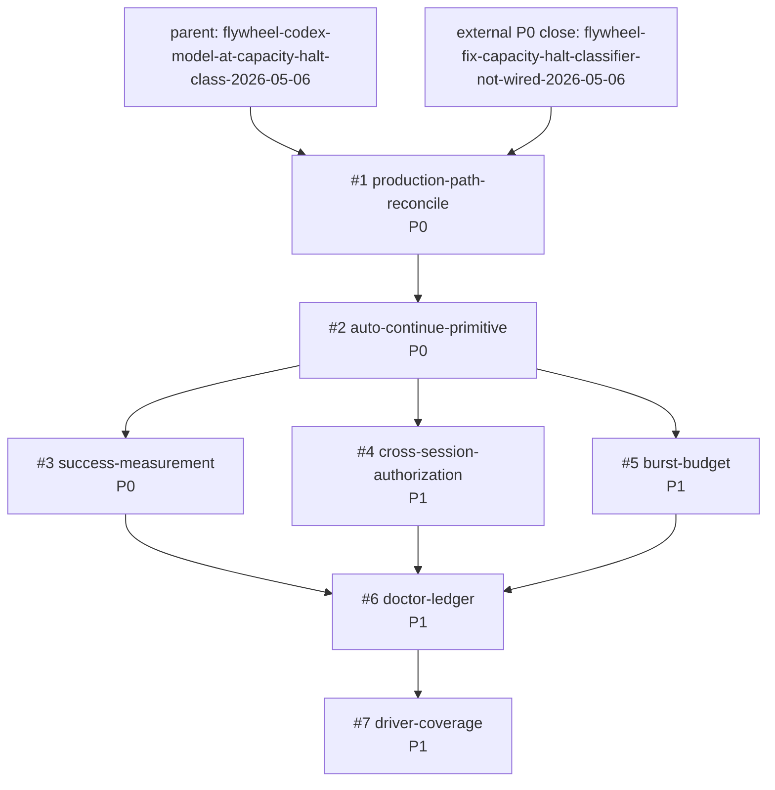

# Phase 4 Beads DAG: capacity-halt detector and auto-continue

Task: `plan-capacity-halt-phase4-decompose-2026-05-06`
Parent: `flywheel-codex-model-at-capacity-halt-class-2026-05-06`
Scope: plan-space bead graph only; no code-space mutation.

## Summary

Phase 4 decomposes the audited plan into seven implementation beads. The graph keeps the production-path reconciliation first, then routes the auto-continue primitive through measurable success, authorization, burst-budget, doctor-ledger, and driver-coverage gates.

The reconciliation node is explicit because pane 4 closed `flywheel-fix-capacity-halt-classifier-not-wired-2026-05-06` while this plan arc was in flight. The first implementation bead must verify that closeout against the plan findings and either close itself as satisfied or file residual deltas before downstream work begins.

## Mermaid DAG

No cycles. Topological order: #1, #2, (#3, #4, #5 in parallel), #6, #7.

Critical path after the external pane-4 close is verified: 190 minutes.

## Bead Table

| # | Bead ID | Priority | Depends On | Wave | Est Wall | Audit Findings | Donella Lever |
|---|---|---:|---|---|---:|---|---|
| 1 | `flywheel-capacity-halt-production-path-reconcile-2026-05-06` | P0 | `flywheel-fix-capacity-halt-classifier-not-wired-2026-05-06` | A | 45m | M5, L3, production-path regression | #5 Rules, #6 Info Flows |
| 2 | `flywheel-capacity-halt-auto-continue-primitive-2026-05-06` | P0 | #1 | A | 45m | M1, M2, L1 | #5 Rules |
| 3 | `flywheel-capacity-halt-success-measurement-2026-05-06` | P0 | #2 | B | 35m | M5, L3 | #6 Info Flows |
| 4 | `flywheel-capacity-halt-cross-session-authorization-2026-05-06` | P1 | #2 | C | 30m | M3, M4, L2 | #5 Rules |
| 5 | `flywheel-capacity-halt-burst-budget-2026-05-06` | P1 | #2 | C | 25m | M1, M6 | #4 Self-Organization |
| 6 | `flywheel-capacity-halt-doctor-ledger-2026-05-06` | P1 | #3, #4, #5 | C | 35m | L2, L3, M5, M6 | #6 Info Flows |
| 7 | `flywheel-capacity-halt-driver-coverage-2026-05-06` | P1 | #6 | D | 30m | M5, M6, L57 | #5 Rules, #6 Info Flows |

Wave C includes #6 as the consolidation gate after the parallel #3/#4/#5 branch. That reconciles the dispatch wave label with the actual acyclic dependency graph.

## Acceptance Gates

1. `production-path-reconcile`: live capacity-halt scrollback classifies as `model_at_capacity_halt`; launchd/watchdog closeout from pane 4 is verified against the Phase 3 audit; residual gaps are filed before downstream work starts.
2. `auto-continue-primitive`: recovery sends bounded `continue` through the canonical pane transport; duplicate tick suppression and confirmation timeout are covered by tests.
3. `success-measurement`: success is defined by post-recovery pane state, not transport send ack; doctor separates attempted, sent, and recovered counts.
4. `cross-session-authorization`: peer-session auto-continue requires explicit ownership and protected-pane checks; worker-policy auto-continue never mutates protected panes.
5. `burst-budget`: repeated capacity halts stop after a bounded per-pane/per-window budget and emit a durable fallback signal instead of indefinite loops.
6. `doctor-ledger`: recovery attempts write a rich ledger with signal text, decision reason, budget state, transport result, post-check state, and failure class.
7. `driver-coverage`: watcher/driver installation is proved by plist loaded state, recent dispatch evidence, and pane-level delivery evidence per L57.

## Sibling Shape References

- `flywheel-wire-watchdog-auto-respawn-not-notify-o-a1d67342`: recovery primitive shape, budget exhaustion fallback, launchd GUI install and dry-run smoke.
- `flywheel-fix-capacity-halt-classifier-not-wired-2026-05-06`: production classifier regression and launchd watcher closeout that #1 must reconcile.
- `flywheel-wire-use-ntm-not-raw-tmux-8d2252c2`: canonical transport gate shape for pane operations.
- L57 loop-driver doctrine: driver proof must be live driver evidence, not state-marker evidence.

## File Status

This DAG is plan-space. The seven bead rows, incident entry, and JSONL closure must be appended only after the active reservations on `INCIDENTS.md` and `.beads/issues.jsonl` clear.
