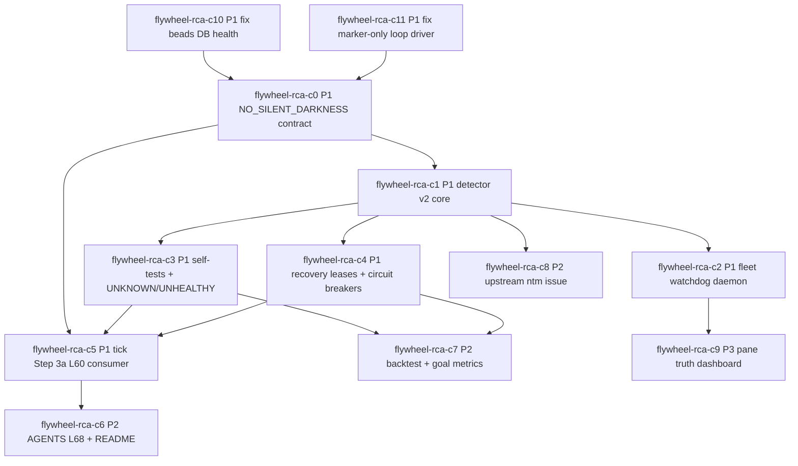

# Codex Fleet Stuck THINKING RCA - Phase 4 Rev 2 DAG

Status: review-ready markdown DAG only. No `br create` executed.

## Goal Reframe

Primary goal: `NO_SILENT_DARKNESS` via AGENTS L60 5-signal contract.

Frozen-pane detection is one symptom class. The system is healthy only when every active loop interval proves all five L60 signals: ledger writes, pane state changes, receipt freshness, callback recency, and fuckup-log decisions. The Rev 1 DAG mostly operated at Meadows #6 Information flows. Rev 2 shifts the top-level intervention to Meadows #3 Goals, then uses #6 Information flows, #5 Rules, #8 Negative feedback, and #4 Self-organization to make that goal executable.

Skills cited first/source-(a): `donella-meadows-systems-thinking`, `loop-enforcement`, `beads-workflow`, `claude-md-beads`, `canonical-cli-scoping`, `flywheel-doctor-author`.

Success metrics:

- `silent_dark_minutes=0`
- `blackout_detection_latency_p95<=2m`
- `false_recovery_count=0`
- `unknown_autorecovery_count=0`
- `L60_signals_present=5/5 per active loop interval`

## Graph

Critical path: `C10 + C11` in parallel -> `C0` -> `C1` -> `C3 + C4` in parallel -> `C5` -> `C6`.

## Bead ID Table

| ID | Title | Priority | Type | Leverage | Depends on | Est h |
|---|---|---|---|---|---|---:|
| flywheel-rca-c10 | [fix] beads_db_health_failed blocks RCA execution | P1 | fix | #5 Rules | none | 3 |
| flywheel-rca-c11 | [fix] loop_driver_marker_only blocks daemon truth | P1 | fix | #4 Self-organization | none | 3 |
| flywheel-rca-c0 | [implement] NO_SILENT_DARKNESS L60 watchdog contract | P1 | implement | #3 Goals | C10,C11 | 3 |
| flywheel-rca-c1 | [implement] detector v2 live truth core | P1 | implement | #6 Information flows | C0 | 6 |
| flywheel-rca-c2 | [implement] fleet watchdog daemon with circuit budgets | P1 | implement | #4 Self-organization | C1 | 3 |
| flywheel-rca-c3 | [implement] self-tests, UNKNOWN health, compatibility | P1 | implement | #5 Rules | C1 | 5 |
| flywheel-rca-c4 | [implement] recovery leases, idempotency, suppression | P1 | implement | #8 Negative feedback | C1 | 5 |
| flywheel-rca-c5 | [implement] /flywheel:tick Step 3a consumes L60+v2 | P1 | implement | #6 Information flows | C0,C3,C4 | 4 |
| flywheel-rca-c6 | [doctrine] promote L68 no-silent-darkness contract | P2 | doctrine | #5 Rules | C5 | 2 |
| flywheel-rca-c7 | [implement] replay harness with goal-quality metrics | P2 | implement | #5 Rules | C3,C4 | 4 |
| flywheel-rca-c8 | [upstream-issue] ntm robot freshness provenance | P2 | upstream | #6 Information flows | C1 | 2 |
| flywheel-rca-c9 | [implement] cross-session pane truth dashboard | P3 | implement | #6 Information flows | C2 | 6 |

## Upstream Tracking

| Issue | Bead | Status | Dedup |
|---|---|---|---|
| https://github.com/Dicklesworthstone/ntm/issues/117 | flywheel-eala | filed 2026-05-03 | dedup=new-with-backref-#114 |

## Parallelism Map

| Phase 5 lane | First dispatch | Then | Notes |
|---|---|---|---|
| Pane A | C10 | C0 once C10/C11 complete | C10 restores bead substrate before any real bead creation. |
| Pane B | C11 | C2 after C1 | C11 repairs live driver proof needed by watchdog daemon. |
| Pane C | C8 draft-only | C3 after C1 | C8 can prepare upstream ledger while local blockers clear. |
| Pane D/review | review C10/C11/C0 | C4 after C1, then C7 | C3/C4 stay parallel; C7 follows both for goal metrics. |
| Orchestrator | graph review | C5, C6, C9 scheduling | C5/C6 are integration/doctrine; C9 follows daemon. |

## Per-Finding Integration

| Finding | Integrated into | Change |
|---|---|---|
| F1 CRITICAL | C0, C1, C5 | New top-level `NO_SILENT_DARKNESS` contract and L60 5-signal success metrics. |
| F2 HIGH | C2, C4 | Per-pane/global recovery budgets, cooldowns, STOP file, FATAL after N strikes, no recovery on degraded truth. |
| F3 HIGH | C3, C5 | `UNKNOWN/UNHEALTHY` first-class output, durable receipt, L60 signal decrement, no auto-recovery. |
| F4 HIGH | C4 | Per-`session:pane` leases, TTLs, atomic 2-sample writes, recovery idempotency keys. |
| F5 MEDIUM | C3, C5 | `schema_version`, old-field preservation for one release, consumer contract tests. |
| F6 MEDIUM | C7 | Goal metrics: latency p95, false recovery count, unknown auto-recovery count, 5/5 L60 signals. |
| F7 LOW | C8 | Auth/secrets boundary, draft-only issue path, no token echo, no auto-file. |

## Bead Bodies

### flywheel-rca-c10

- id: flywheel-rca-c10
- title: [fix] beads_db_health_failed blocks RCA execution
- priority: P1
- type: fix
- description: Repair the pre-existing `beads_db_health_failed` wedge before creating or dispatching RCA beads. Meadows #5 Rules: the task graph is a rule substrate and must be healthy before it governs work. Source-(a): `beads-workflow`, `claude-md-beads`, `flywheel-doctor-author`.
- acceptance_criteria:
  - `flywheel-loop doctor --repo /Users/josh/Developer/flywheel --json` no longer reports `beads_db_health_failed`.
  - Repo-local `.beads` DB and JSONL paths are proven, not global/tombstone state.
  - Repair receipt names producer, measurement, consumer, and promotion decision.
- depends_on: none

### flywheel-rca-c11

- id: flywheel-rca-c11
- title: [fix] loop_driver_marker_only blocks daemon truth
- priority: P1
- type: fix
- description: Repair marker-only autoloop state before installing another watchdog. Meadows #4 Self-organization: a loop must prove it can drive itself through live output, not marker files. Source-(a): `loop-enforcement`, `flywheel-doctor-author`, `canonical-cli-scoping`.
- acceptance_criteria:
  - Doctor reports driver proof beyond marker-only.
  - Launchd/tick script includes real live prompt driver evidence, such as `ntm send`.
  - Recent log proves driver activity within two cadence windows.
- depends_on: none

### flywheel-rca-c0

- id: flywheel-rca-c0
- title: [implement] NO_SILENT_DARKNESS L60 watchdog contract
- priority: P1
- type: implement
- description: Define the primary watchdog contract around L60 five-signal loop health. Frozen panes, stale tails, missing callbacks, stale receipts, absent ledger writes, and unprocessed fuckup decisions are all symptoms of silent darkness. Meadows #3 Goals: change the optimization target from "detect frozen panes" to "no active loop silently goes dark." Source-(a): `donella-meadows-systems-thinking`, `loop-enforcement`, `flywheel-doctor-author`, `beads-workflow`.
- acceptance_criteria:
  - Machine-readable contract defines `silent_dark_minutes`, `blackout_detection_latency_p95`, `false_recovery_count`, `unknown_autorecovery_count`, and `L60_signals_present`.
  - Contract computes HEALTHY/LIMPING/DEAD using all five L60 signals plus per-pane byte-delta.
  - Contract treats frozen-pane as a symptom classification under broader L60 health, not the root goal.
  - Contract has producer, measurement command, consumer, and promotion path.
- depends_on: flywheel-rca-c10, flywheel-rca-c11

### flywheel-rca-c1

- id: flywheel-rca-c1
- title: [implement] detector v2 live truth core
- priority: P1
- type: implement
- description: Rewrite detector core so sequential live samples and source health feed the C0 L60 contract. NTM robot state becomes candidate selector/tie-breaker, not sole truth. Meadows #6 Information flows: expose timely truth to the actor making dispatch/recovery decisions. Source-(a): `canonical-cli-scoping`, `flywheel-doctor-author`, `donella-meadows-systems-thinking`.
- acceptance_criteria:
  - `--session=<all|name> --json` emits `schema_version`, sample timestamps, delta bytes, verdict, source health, pane identity, and L60 signal contribution.
  - `state_since=query_time` cannot create a false young verdict; unknown age is explicit.
  - Frozen verdicts are correlated with C0 health signals and do not override missing receipt/callback/ledger evidence.
  - UNKNOWN sources never authorize auto-recovery.
- depends_on: flywheel-rca-c0

### flywheel-rca-c2

- id: flywheel-rca-c2
- title: [implement] fleet watchdog daemon with circuit budgets
- priority: P1
- type: implement
- description: Install/design a bounded fleet watchdog daemon that runs the C0/C1 contract on cadence. Meadows #4 Self-organization with #8 safeguards: the fleet observes itself, but recovery has strict limits. Source-(a): `loop-enforcement`, `canonical-cli-scoping`, `flywheel-doctor-author`.
- acceptance_criteria:
  - Daemon has per-pane and global recovery budgets, cooldowns, STOP file, and `FATAL` state after repeated strikes.
  - Daemon refuses auto-recovery when truth source health is degraded or UNKNOWN.
  - `--doctor --json` reports installed/loaded/log freshness/budget state without crashing when absent.
  - Default mode is detect/report; recovery requires explicit config.
- depends_on: flywheel-rca-c1

### flywheel-rca-c3

- id: flywheel-rca-c3
- title: [implement] self-tests, UNKNOWN health, compatibility
- priority: P1
- type: implement
- description: Add fixture-driven self-tests and first-class `UNKNOWN/UNHEALTHY` outputs. Meadows #5 Rules: L60/L67 become executable contracts, not operator memory. Source-(a): `flywheel-doctor-author`, `canonical-cli-scoping`, `beads-workflow`.
- acceptance_criteria:
  - Fixtures cover age-only miss, stale tail, post-respawn residue, stale template prompt, and missing L60 signal cases.
  - `UNKNOWN/UNHEALTHY` writes durable receipt, degraded reason, and L60 signal decrement.
  - `schema_version` is emitted, old fields/flags are preserved for one release, and contract tests cover current tick/doctor consumers.
  - UNKNOWN never triggers auto-recovery.
- depends_on: flywheel-rca-c1

### flywheel-rca-c4

- id: flywheel-rca-c4
- title: [implement] recovery leases, idempotency, suppression
- priority: P1
- type: implement
- description: Add recovery ledger, per-`session:pane` leases, atomic sample writes, idempotency keys, respawn suppression, and restart storm dampening. Meadows #8 Negative feedback: monitor, compare to goal, correct, verify, and stop when correction becomes unsafe. Source-(a): `canonical-cli-scoping`, `flywheel-doctor-author`, `loop-enforcement`.
- acceptance_criteria:
  - Per-pane lease files have TTL and skip/observe behavior when recovery already active.
  - Two-sample cache writes are atomic and never expose partial samples.
  - Recovery idempotency key prevents duplicate relaunches for same incident.
  - Recent restart evidence produces `RESPAWN_SUPPRESSED`; repeated strikes enter `FATAL` and require operator action.
- depends_on: flywheel-rca-c1

### flywheel-rca-c5

- id: flywheel-rca-c5
- title: [implement] /flywheel:tick Step 3a consumes L60+v2
- priority: P1
- type: implement
- description: Refactor `/flywheel:tick` Step 3a to consume the C0 L60 contract and C1 detector verdicts together. Meadows #6 Information flows: the orchestrator sees `NO_SILENT_DARKNESS` health at the decision point. Source-(a): `flywheel-doctor-author`, `loop-enforcement`, `canonical-cli-scoping`.
- acceptance_criteria:
  - Tick receipt reports all five L60 signals, detector v2 verdicts, unknown/unhealthy counts, and recovery-suppressed counts.
  - Tick treats missing L60 signals as LIMPING/DEAD even if panes are not classified frozen.
  - Tick preserves old consumer fields for one release and validates `schema_version`.
  - Tick does not dispatch into FROZEN, UNKNOWN, LIMPING, or DEAD contexts without explicit override.
- depends_on: flywheel-rca-c0, flywheel-rca-c3, flywheel-rca-c4

### flywheel-rca-c6

- id: flywheel-rca-c6
- title: [doctrine] promote L68 no-silent-darkness contract
- priority: P2
- type: doctrine
- description: Promote the RCA into AGENTS.md L68 and README tick narrative after C5 proves consumption. Meadows #5 Rules: encode the goal and forbidden outputs as canonical operating law. Source-(a): `donella-meadows-systems-thinking`, `beads-workflow`, `flywheel-doctor-author`.
- acceptance_criteria:
  - AGENTS.md adds L68 with why/how/forbidden/evidence/companion rules centered on `NO_SILENT_DARKNESS`.
  - README tick section names L60/C0/C5 as the pane/fleet truth consumer path.
  - Doctrine cites Phase 3 audit, Rev 2 DAG, and shipped contract evidence.
- depends_on: flywheel-rca-c5

### flywheel-rca-c7

- id: flywheel-rca-c7
- title: [implement] replay harness with goal-quality metrics
- priority: P2
- type: implement
- description: Expand replay/backtest beyond classification accuracy to prove goal quality. Meadows #5 Rules + #6 Information flows: measurement gates must track the goal, not only a symptom. Source-(a): `canonical-cli-scoping`, `flywheel-doctor-author`, `beads-workflow`.
- acceptance_criteria:
  - Harness catches 5/5 true freezes and suppresses known false ERROR/tail-cache cases.
  - Reports `detection_latency_p95`, `false_recovery_count`, `unknown_autorecovery_count`, and `L60_signals_present`.
  - Synthetic healthy loop proves all five L60 write paths fire.
  - Tests use temp state dirs and never mutate production logs.
- depends_on: flywheel-rca-c3, flywheel-rca-c4

### flywheel-rca-c8

- id: flywheel-rca-c8
- title: [upstream-issue] ntm robot freshness provenance
- priority: P2
- type: upstream
- description: Prepare a draft-only upstream ntm issue/ledger requesting live source freshness, pane PID/dead metadata, collected_at, stale windows, and reset-on-PID-change annotations. Meadows #6 Information flows: fix truth at source. Source-(a): `canonical-cli-scoping`, `donella-meadows-systems-thinking`, `beads-workflow`.
- acceptance_criteria:
  - Draft issue includes repro, local evidence, requested fields, and why local watchdog remains policy-only.
  - Auth/secrets boundary is explicit: no token echo, no bearer output, no automatic external filing.
  - Dedup/source probe runs before any filing proposal.
  - External filing requires orchestrator/Joshua approval under phased Jeff collaboration gate.
- depends_on: flywheel-rca-c1

### flywheel-rca-c9

- id: flywheel-rca-c9
- title: [implement] cross-session pane truth dashboard
- priority: P3
- type: implement
- description: Add a dashboard/VC surface summarizing C0 L60 health, detector v2 verdicts, NTM state, driver proof, callback recency, and unknown/stale sources across sessions. Meadows #6 Information flows: expose fleet truth before dispatch. Source-(a): `canonical-cli-scoping`, `flywheel-doctor-author`, `donella-meadows-systems-thinking`.
- acceptance_criteria:
  - Dashboard shows each active loop with 5/5 signal status, verdict, source health, last callback, and driver proof age.
  - JSON output supports robot consumers and degrades cleanly when NTM or detector output is unavailable.
  - Dashboard includes explicit LIMPING/DEAD/UNKNOWN rows and does not hide inactive sources.
- depends_on: flywheel-rca-c2

## Changelog From Rev 1

| Bead | Change | Audit finding |
|---|---|---|
| C0 | New goal-level L60 `NO_SILENT_DARKNESS` contract bead | F1 |
| C1 | Reframed detector as input to L60 health, added `schema_version` and L60 contribution | F1,F5 |
| C2 | Added recovery budgets, STOP file, degraded-truth no-recovery, FATAL state | F2 |
| C3 | Added UNKNOWN/UNHEALTHY durable receipts, L60 decrement, compatibility tests | F3,F5 |
| C4 | Added leases, TTLs, atomic writes, idempotency keys, FATAL after repeated strikes | F2,F4 |
| C5 | Consumes C0 plus v2 detector; preserves old fields one release | F1,F3,F5 |
| C7 | Expanded metrics beyond replay accuracy | F6 |
| C8 | Added auth/secrets boundary and no-auto-file rule | F7 |

## DAG Validation

- Beads in revised DAG: 12.
- Findings integrated: 7/7.
- Success metrics count: 5.
- Manual topological order: C10, C11, C0, C1, C2, C3, C4, C8, C5, C7, C6, C9.
- Cycle check by inspection: PASS; all edges flow from substrate repair -> goal contract -> detector/recovery/test -> tick consumer -> doctrine/dashboard.
- Audit coverage: F1 -> C0/C1/C5; F2 -> C2/C4; F3 -> C3/C5; F4 -> C4; F5 -> C3/C5; F6 -> C7; F7 -> C8.
