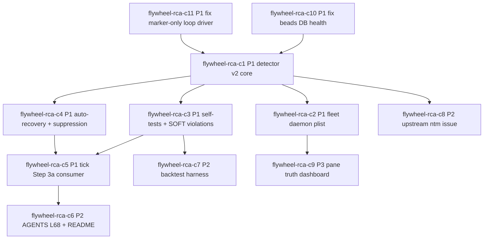

# Codex Fleet Stuck THINKING RCA - Phase 4 Bead DAG

Status: review-ready markdown DAG only. No `br create` executed.

Meadows source: `donella-meadows-systems-thinking` canonical 12-point ladder. Dominant leverage points are #6 Information flows, #5 Rules, #4 Self-organization, and #8 Negative feedback loop strength. Skill source-(a) baseline for all beads: `donella-meadows-systems-thinking`, `beads-workflow`, `claude-md-beads`, `canonical-cli-scoping`, `flywheel-doctor-author`.

## Graph

Critical path: `C10 + C11` in parallel -> `C1` -> `C3 + C4` in parallel -> `C5` -> `C6`.

## Bead ID Table

| ID | Title | Priority | Type | Leverage | Depends on | Est h |
|---|---|---|---|---|---|---:|
| flywheel-rca-c10 | [fix] beads_db_health_failed blocks RCA execution | P1 | fix | #5 Rules | none | 3 |
| flywheel-rca-c11 | [fix] loop_driver_marker_only blocks daemon truth | P1 | fix | #4 Self-organization | none | 3 |
| flywheel-rca-c1 | [implement] frozen-pane-detector v2 live truth core | P1 | implement | #6 Information flows | C10,C11 | 6 |
| flywheel-rca-c2 | [implement] fleet frozen-pane launchd daemon | P1 | implement | #4 Self-organization | C1 | 2 |
| flywheel-rca-c3 | [implement] detector self-tests and SOFT violations | P1 | implement | #5 Rules | C1 | 4 |
| flywheel-rca-c4 | [implement] recovery ledger and respawn suppression | P1 | implement | #8 Negative feedback | C1 | 4 |
| flywheel-rca-c5 | [implement] /flywheel:tick Step 3a consumes v2 | P1 | implement | #6 Information flows | C3,C4 | 3 |
| flywheel-rca-c6 | [doctrine] promote L68 pane-state truth contract | P2 | doctrine | #5 Rules | C5 | 2 |
| flywheel-rca-c7 | [implement] frozen-pane replay backtest harness | P2 | implement | #5 Rules | C3 | 3 |
| flywheel-rca-c8 | [upstream-issue] ntm robot freshness provenance | P2 | upstream | #6 Information flows | C1 | 2 |
| flywheel-rca-c9 | [implement] cross-session pane truth dashboard | P3 | implement | #6 Information flows | C2 | 6 |

## Parallelism Map

| Phase 5 lane | First dispatch | Then | Notes |
|---|---|---|---|
| Pane A | C10 | C1 after C10/C11 both done | C10 unblocks real bead execution and local doctor state. |
| Pane B | C11 | C2 after C1 | C11 repairs loop driver proof before daemon work. |
| Pane C | C8 | C3 after C1 | C8 can draft upstream ledger from Lane B while local blockers clear. |
| Spare/review | review C10/C11 | C4 after C1, then C7 | Keep C3/C4 parallel; C7 follows C3 fixtures. |
| Orchestrator | graph review | C5, C6, C9 scheduling | C5/C6 are integration/doctrine and should land after implementation proof. |

## Bead Bodies

### flywheel-rca-c10

- id: flywheel-rca-c10
- title: [fix] beads_db_health_failed blocks RCA execution
- priority: P1
- type: fix
- description: Repair the pre-existing `beads_db_health_failed` wedge reported by Lane C doctor preflight before any RCA implementation beads are created. Meadows #5 Rules: the task graph must be an enforceable substrate, not a broken marker. Source-(a): `beads-workflow` requires no cycles/healthy graph before dispatch; `claude-md-beads` requires explicit dependencies and testable bead packets; `flywheel-doctor-author` requires producer/measurement/consumer/promotion for doctor failures.
- acceptance_criteria:
  - `flywheel-loop doctor --repo /Users/josh/Developer/flywheel --json` no longer reports `beads_db_health_failed`.
  - Beads DB and JSONL state resolve to the repo-local `.beads` path, not a global/tombstone path.
  - A repair receipt names the exact producer, measurement command, and consumer that now sees green.
- depends_on: none

### flywheel-rca-c11

- id: flywheel-rca-c11
- title: [fix] loop_driver_marker_only blocks daemon truth
- priority: P1
- type: fix
- description: Repair the marker-only autoloop driver state Lane C found before adding a new frozen-pane daemon. Meadows #4 Self-organization: the loop must prove it can drive itself, not merely store active markers. Source-(a): `donella-meadows-systems-thinking` self-organization; `flywheel-doctor-author` producer/measurement/consumer; `canonical-cli-scoping` doctor/health/repair; `beads-workflow` dispatch readiness.
- acceptance_criteria:
  - `flywheel-loop doctor --repo /Users/josh/Developer/flywheel --json` reports driver proof other than marker-only.
  - The launchd/tick script path includes a real `ntm send` or equivalent live prompt driver.
  - Recent loop log includes a dispatch or tick evidence row within two cadence windows.
- depends_on: none

### flywheel-rca-c1

- id: flywheel-rca-c1
- title: [implement] frozen-pane-detector v2 live truth core
- priority: P1
- type: implement
- description: Rewrite detector core so live sequential scrollback byte-delta is the primary liveness signal and NTM robot state is only a candidate selector/tie-breaker. Covers Lane A Classes A/C/D/E and Lane B ADOPT guidance. Meadows #6 Information flows: expose live pane truth where stale regex state hid it. Source-(a): `canonical-cli-scoping`, `flywheel-doctor-author`, `donella-meadows-systems-thinking`, `beads-workflow`, `claude-md-beads`.
- acceptance_criteria:
  - `--session=<all|name> --json` emits stable schema with sample timestamps, delta bytes, verdict, source health, and pane identity.
  - `state_since=query_time` cannot create a false young verdict; unknown age is explicit.
  - UNKNOWN sources do not trigger auto-recovery.
- depends_on: flywheel-rca-c10, flywheel-rca-c11

### flywheel-rca-c2

- id: flywheel-rca-c2
- title: [implement] fleet frozen-pane launchd daemon
- priority: P1
- type: implement
- description: Add the plan and installer surface for `ai.zeststream.frozen-pane-detector-fleet`, running v2 detection on a bounded cadence with logs and no source mutation by default. Meadows #4 Self-organization: the fleet catches its own freezes. Source-(a): `canonical-cli-scoping` health/watch/json, `loop-enforcement` compiled loop rules via Lane C, `flywheel-doctor-author`, `donella-meadows-systems-thinking`.
- acceptance_criteria:
  - Plist/script design names cadence, stdout/stderr paths, disabled-by-default install posture, and validation command.
  - `--doctor --json` reports daemon installed/loaded/log freshness without crashing when absent.
  - Daemon does not auto-recover unless configured; default is detect/report.
- depends_on: flywheel-rca-c1

### flywheel-rca-c3

- id: flywheel-rca-c3
- title: [implement] detector self-tests and SOFT violations
- priority: P1
- type: implement
- description: Add fixture-driven self-tests for age-only miss, stale tail, post-respawn error residue, and template-prompt false productivity. Emit SOFT violations that `/flywheel:tick` can consume. Meadows #5 Rules: L67 becomes a mechanical contract. Source-(a): `flywheel-doctor-author`, `canonical-cli-scoping`, `beads-workflow`, `claude-md-beads`, `donella-meadows-systems-thinking`.
- acceptance_criteria:
  - Self-tests run with temp state and fixture logs only.
  - At least four fixtures cover Lane A Classes A-E except C4 recovery path.
  - SOFT violation payload includes producer, measurement, consumer, and promotion field.
- depends_on: flywheel-rca-c1

### flywheel-rca-c4

- id: flywheel-rca-c4
- title: [implement] recovery ledger and respawn suppression
- priority: P1
- type: implement
- description: Add recovery ledger, reset-on-respawn suppression, relaunch re-probe, and restart-loop suppression so post-pkill residue does not masquerade as current ERROR. Meadows #8 Negative feedback loop strength: detect, recover, verify, and damp repeat restarts. Source-(a): `canonical-cli-scoping` audit/provenance/dry-run, `flywheel-doctor-author`, `donella-meadows-systems-thinking`, `beads-workflow`.
- acceptance_criteria:
  - Recent SIGKILL/SIGTERM/restart evidence produces `RESPAWN_SUPPRESSED`, not `ERROR`, during the suppression window.
  - Auto-recovery writes snapshot, ledger row, re-probe result, and no duplicate storm within configured backoff.
  - `--dry-run --explain --json` distinguishes planned from actual effects.
- depends_on: flywheel-rca-c1

### flywheel-rca-c5

- id: flywheel-rca-c5
- title: [implement] /flywheel:tick Step 3a consumes v2
- priority: P1
- type: implement
- description: Refactor `/flywheel:tick` Step 3a so it consumes detector v2 verdicts and stops using age-only robot state for frozen-pane decisions. Meadows #6 Information flows: the orchestrator sees the right state at the decision point. Source-(a): `flywheel-doctor-author`, `canonical-cli-scoping`, `beads-workflow`, `donella-meadows-systems-thinking`.
- acceptance_criteria:
  - Tick receipt includes detector v2 summary, stale/unknown counts, and recovery-suppressed counts.
  - Tick does not dispatch into FROZEN or UNKNOWN panes without explicit override.
  - Existing L60/L67 evidence is referenced in the receipt path or doctrine note.
- depends_on: flywheel-rca-c3, flywheel-rca-c4

### flywheel-rca-c6

- id: flywheel-rca-c6
- title: [doctrine] promote L68 pane-state truth contract
- priority: P2
- type: doctrine
- description: Promote the RCA result into AGENTS.md L68 and README tick narrative after the detector is consumed by `/flywheel:tick`. Meadows #5 Rules: encode live pane truth as canonical operating law. Source-(a): `donella-meadows-systems-thinking`, `beads-workflow`, `claude-md-beads`, `flywheel-doctor-author`.
- acceptance_criteria:
  - AGENTS.md adds L68 with why/how/forbidden/evidence/companion rules.
  - README tick section names detector v2 as the pane-state truth consumer.
  - Doctrine cites Lane A/B/C receipts plus shipped detector evidence.
- depends_on: flywheel-rca-c5

### flywheel-rca-c7

- id: flywheel-rca-c7
- title: [implement] frozen-pane replay backtest harness
- priority: P2
- type: implement
- description: Build a replay/backtest harness for the five historical frozen and fake-frozen events so future classifier changes cannot regress silently. Meadows #5 Rules: measurement becomes a gate. Source-(a): `canonical-cli-scoping` schemas/validate, `flywheel-doctor-author`, `beads-workflow`, `claude-md-beads`.
- acceptance_criteria:
  - Fixtures cover Classes A-E with expected verdicts.
  - Backtest catches true frozen cases and suppresses known false ERROR/tail-cache cases.
  - Harness is isolated from production fuckup-log and state dirs.
- depends_on: flywheel-rca-c3

### flywheel-rca-c8

- id: flywheel-rca-c8
- title: [upstream-issue] ntm robot freshness provenance
- priority: P2
- type: upstream
- description: Prepare the upstream ntm issue/ledger from Lane B: robot-tail/activity should expose live source freshness, pane PID/dead metadata, collected_at, stale_after_sec, and reset-on-PID-change annotations. Meadows #6 Information flows: fix source truth, not only local workaround. Source-(a): `canonical-cli-scoping` upstream-report pattern, `donella-meadows-systems-thinking`, `beads-workflow`, `claude-md-beads`.
- acceptance_criteria:
  - Issue draft includes repro, local evidence, requested fields, and why local watchdog remains policy-only.
  - Dedup/source probe confirms target repo/issue state before any filing.
  - No issue is filed without orchestrator/Joshua approval.
- depends_on: flywheel-rca-c1

### flywheel-rca-c9

- id: flywheel-rca-c9
- title: [implement] cross-session pane truth dashboard
- priority: P3
- type: implement
- description: Add a cross-session dashboard/VC surface summarizing detector v2 verdicts, NTM state, driver proof, callback recency, and unknown/stale sources. Meadows #6 Information flows: make fleet truth visible before dispatch decisions. Source-(a): `canonical-cli-scoping`, `flywheel-doctor-author`, `donella-meadows-systems-thinking`, `beads-workflow`.
- acceptance_criteria:
  - Dashboard shows all sessions with verdict, source health, last callback, and driver proof age.
  - JSON output supports robot consumption and no-color/no-emoji capture.
  - Dashboard degrades cleanly when NTM or detector output is unavailable.
- depends_on: flywheel-rca-c2

## DAG Validation

- Manual topological order: C10, C11, C1, C2, C3, C4, C8, C5, C7, C6, C9.
- Cycle check by inspection: every edge points from lower prerequisite layer to later consumer; no back-edge to C10/C11/C1.
- Audit coverage: A stuck THINKING -> C1/C3/C4/C5; B post-pkill ERROR -> C4/C7/C8; C stale tail -> C1/C3/C8; D state_since query time -> C1/C3/C7; E template prompt -> C1/C3/C9; Lane B upstream provenance -> C8; Lane C DB/driver blockers -> C10/C11.
