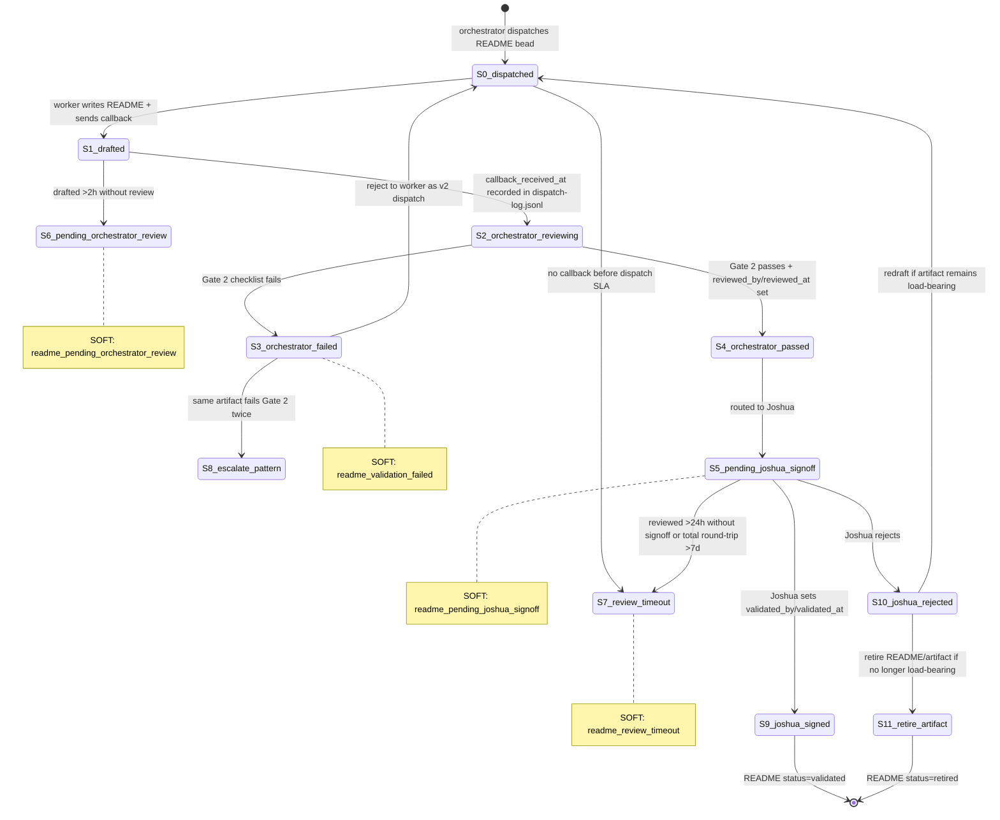

# Cross-Pane Protocol Lane 1 - Docs Doctrine and State Machine

status: plan-space
created_at: 2026-05-01
lane: 1
scope: doctrine-and-state-machine-only
non_goals: CLI surface, backfill engine, implementation edits

## Source Grounding

Read and used:

- `~/Developer/flywheel/AGENTS.md` L66-L68 for current L-rule prose shape.
- `~/Developer/flywheel/INCIDENTS.md` sections `meat-puppet-orchestrator-decision-on-partial-state` and `bypass-canonical-substrate-cluster` for provenance.
- `~/Developer/flywheel/.flywheel/plans/documentation-substrate-2026-05-01/04-SYNTHESIS.md` for the documentation substrate parent context, including 0/732 A-grade inventory and doctor signal vocabulary.
- `~/.claude/skills/beads-workflow/SKILL.md` section "Reject-and-revert is healthy flywheel state" for reject/revert mechanics.

## Historical ID Reconciliation

This lane originally proposed `L69` for docs-as-load-bearing. That ID is not
available for this doctrine: canonical `AGENTS.md` later allocated L69 to
`ORCH-PROBE-AGENT-CONTEXT` and L70 to `ORCH-NO-PUNT`. The docs doctrine landed
as L81 `DOCS-ARE-LOAD-BEARING-CROSS-PANE-VALIDATED`; canonical CLI scoping
landed as L82.

## Landed L81 Canonical Wording

This is the historical proposed block reconciled to the canonical landed ID.

## L81 — DOCS-ARE-LOAD-BEARING-CROSS-PANE-VALIDATED

---
id: L81
title: Docs are load-bearing and require cross-pane validation
status: long_term
effective: 2026-05-01
shipped: 2026-05-01
review_due: 2026-08-01
trauma_class: documentation-substrate
provenance: ~/Developer/flywheel/INCIDENTS.md (Lane 1 inventory 0/732 A-grades + meat-puppet cluster)
---

**Rule:** Durable operational artifacts need README-grade documentation before
they are considered ready substrate. For load-bearing artifacts, docs are not
commentary; they are part of the artifact contract. A worker may draft the
README, but the worker may not be the final validator. Gate 2 validation MUST
be performed by a different pane, and Joshua signoff is required before a
README can move from `status: foundation` or `status: reviewed` to
`status: validated`.

Load-bearing artifacts include flywheel binaries, launchd plists, hooks,
slash-command contracts, substrate-registry rows, canonical doctrine, and any
script or state machine that another pane relies on for execution decisions.

**Why:** The documentation substrate synthesis found 732 tracked artifacts and
0 A-grade docs. That is not cosmetic drift; it means workers must infer purpose,
side effects, validation commands, rollback paths, and state ownership from code
or memory. The same session showed a meat-puppet cluster where Joshua was asked
to choose even though substrate data was sufficient, and a bypass cluster where
agents worked around canonical surfaces. Thin docs convert every operator into
the missing protocol layer. Load-bearing docs make the protocol inspectable
before execution.

**How to apply:**
- Worker pane drafts the README at the exact artifact-owned path with
  frontmatter, Mermaid when required, command/reference coverage, side effects,
  error modes, and a real `validation_command`.
- Worker callback identifies the README path and leaves
  `reviewed_by`, `reviewed_at`, `validated_by`, and `validated_at` unset unless
  the dispatch explicitly assigned a separate review role.
- Orchestrator pane performs Gate 2 from a cold read: run the validation
  command, check target path existence, inspect Mermaid and command reference
  coverage, verify See Also paths, and confirm no self-validation.
- If Gate 2 fails, the orchestrator rejects the artifact back to the worker
  with checklist failures. The worker rewrites the README. Do not patch-forward
  a failed README to "look better" while preserving the failed shape.
- If Gate 2 passes, the orchestrator fills `reviewed_by` and `reviewed_at`,
  then routes the artifact to Joshua for final signoff.
- Joshua final signoff sets `validated_by` and `validated_at`. Only then may the
  README be treated as `status: validated`.
- If the target artifact is retired or removed, the README must move to retired
  state or be removed by an explicit docs-retirement bead; orphaned docs are
  substrate drift.

**SOFT violations:**
- `readme_below_floor`: artifact lacks a README or the inventory grade is F.
- `readme_validated_by_self`: `validated_by` equals `reviewed_by`, or the worker that drafted the README also marks it validated.
- `readme_orphaned`: README `target_artifact` path no longer exists.
- `readme_validation_failed`: README `validation_command` exits non-zero.
- `readme_pending_orchestrator_review`: drafted README has waited more than 2 hours without Gate 2 review.
- `readme_pending_joshua_signoff`: `reviewed_by` is set but `validated_by` is null for more than 24 hours.
- `readme_review_timeout`: draft-to-validation round trip exceeds 7 days.

**Provenance:** Promoted per L56 from documentation-substrate evidence:
`04-SYNTHESIS.md` reports 732 rows, 0 A grades, 154 F grades, and only 1
Mermaid diagram across the ecosystem. `INCIDENTS.md` records the meat-puppet
cluster where single-source or partial state turned into Joshua-facing
questions, and the bypass-canonical-substrate cluster where agents worked
around the canonical dispatch/NTM surfaces. L81 converts those failures into a
cross-pane validation rule: the author cannot be the validator, and readiness
requires executable documentation.

**See Also:**
- `~/Developer/flywheel/.flywheel/plans/documentation-substrate-2026-05-01/04-SYNTHESIS.md`
- `~/Developer/flywheel/INCIDENTS.md#meat-puppet-orchestrator-decision-on-partial-state`
- `~/Developer/flywheel/INCIDENTS.md#bypass-canonical-substrate-cluster`
- `~/.claude/skills/beads-workflow/SKILL.md#reject-and-revert-is-healthy-flywheel-state`
- L56 (promotion ladder), L61/L65 (dual-channel/fleet-mail routing), L66 (use data, not meat puppet), L68 (cortex to engine handoff)

## Review State Machine

Actors:

- Worker: panes 2, 3, or 4. Owns drafting and rewrite after rejection.
- Orchestrator: pane 1. Owns Gate 2 review, rejection, and routing to Joshua.
- Joshua: pane 0. Owns final validation or rejection.

Stage map:

| Stage | Owner | Entry condition | Exit condition |
|---|---|---|---|
| `0_dispatched` | orchestrator | README bead assigned to worker | worker callback or dispatch timeout |
| `1_drafted` | worker | README written and callback sent | dispatch-log row records `callback_received_at` |
| `2_orchestrator_reviewing` | orchestrator | Gate 2 review begins | pass or fail checklist |
| `3_orchestrator_failed` | orchestrator | one or more Gate 2 checks fail | reject to worker, or escalate after repeated failure |
| `3_orchestrator_passed` | orchestrator | Gate 2 passes | `reviewed_by` and `reviewed_at` set, then Joshua routed |
| `4_joshua_signed` | Joshua | final signoff complete | `validated_by` and `validated_at` set |
| `5_joshua_rejected` | Joshua | final signoff rejected | redraft or retire artifact |

Timeout edges:

- Drafted for more than 2 hours without Gate 2 review ->
  `readme_pending_orchestrator_review`.
- Gate 2 passed but no Joshua signoff for more than 24 hours ->
  `readme_pending_joshua_signoff`.
- End-to-end round trip more than 7 days ->
  `readme_review_timeout`.

## Gate 2 Checklist

The orchestrator checks from a cold read:

1. `target_artifact` exists.
2. README has required frontmatter and appropriate status.
3. `validation_command` runs successfully and is not a stub.
4. Mermaid block exists when the artifact kind has multi-step flow, feedback
   loop, registry relationships, or doctrine state transitions.
5. Command/reference coverage is complete for executable artifacts.
6. Side effects and error modes are explicit.
7. See Also paths exist.
8. `reviewed_by` and `validated_by` are not self-filled by the drafting worker.
9. No file outside the assigned README path changed.

Gate 2 is intentionally separate from Joshua signoff. The orchestrator verifies
mechanical truth; Joshua validates that the documentation is worth making
canonical.

## Reject-and-Revert Mechanics

Carry over from `beads-workflow`: when a freshly shipped artifact has green
process gates but red truth gates, "REVERT. Do not patch forward." For README
work, apply the same principle at two layers:

1. **Pre-merge / uncommitted README:** reject, do not patch-forward. The
   orchestrator sends a checklist failure packet back to the same worker pane.
   The follow-up task is a rewrite, not a tiny cosmetic patch over the failed
   artifact shape.
2. **Post-merge README later invalidated:** revert the commit that marked or
   shipped the README as validated, reopen the docs bead, and file or update the
   missing primitive/checklist bead that would have caught the failure.

README-specific lifecycle:

1. **Detect:** Gate 2 or post-signoff doctor catches false PASS:
   validation command fails, target path missing, command reference incomplete,
   self-validation detected, or review timeout exceeded.
2. **Reject/Revert:** if unmerged, reject to worker via new v2 dispatch. If
   merged, use history-preserving revert and reopen the bead.
3. **Reopen:** set the docs bead back to open with reason:
   `INVALIDATED - README Gate 2 failed; violation=<class>`.
4. **File missing primitive:** if the failure is repeated because the checklist
   is ambiguous, file a new bead for the missing validation primitive.
5. **Codify:** if the pattern occurs three times, log a fuckup row and promote
   via L56.

Escalation thresholds:

- Same artifact fails Gate 2 twice -> orchestrator escalates to Joshua with the
  two checklist receipts and asks whether the artifact should be retired or the
  checklist is underspecified.
- Three different artifacts fail the same checklist item -> log
  `validation_command_pattern_unclear` in fuckup-log and file a bead to clarify
  the checklist or template.

Anti-pattern:

- Patching a failed README forward until the checklist passes while keeping the
  same incorrect premise. That hides the missing primitive and recreates the
  Round 5 failure mode in documentation form.

## SOFT Violations

| Violation | Trigger | Doctor field | Severity |
|---|---|---|---|
| `readme_below_floor` | inventory grade=F or no README | `.docs_substrate.below_floor[]` | medium |
| `readme_validated_by_self` | `validated_by` = `reviewed_by`, or author marked own draft validated | `.docs_substrate.self_validation[]` | high |
| `readme_orphaned` | `target_artifact` path missing | `.docs_substrate.orphaned[]` | medium |
| `readme_validation_failed` | `validation_command` exit != 0 | `.docs_substrate.validation_failed[]` | medium |
| `readme_pending_orchestrator_review` | drafted >2h, not reviewed | `.docs_substrate.review_overdue[]` | low |
| `readme_pending_joshua_signoff` | `reviewed_by` set, `validated_by` null >24h | `.docs_substrate.signoff_overdue[]` | low |
| `readme_review_timeout` | draft-to-validation round trip >7d | `.docs_substrate.review_timeout[]` | high |

Notes:

- `readme_below_floor` is the inventory/backlog signal.
- `readme_validated_by_self` is always high because it breaks Path A's no
  self-validation guarantee.
- `readme_validation_failed` is medium unless the artifact is an active
  dispatch/doctor/recovery primitive, where implementation may escalate it.

## Cross-Pane Communication Contract

This lane defines message duties, not CLI commands.

### Worker -> Orchestrator

- Worker writes the README.
- Worker sends `ntm send flywheel --pane=<callback_pane>` with task id, status,
  README path, and ladder result.
- Orchestrator appends or updates a dispatch-log row with
  `callback_received_at`, `readme_path`, `drafted_by_session`,
  `drafted_by_pane`, and `gate2_state="pending"`.

### Orchestrator -> Worker (Reject)

- Orchestrator sends `ntm send <session> --pane=<worker_pane>` with the failed
  Gate 2 checklist items.
- Orchestrator creates a new dispatch-log row for the rewrite, using a new task
  id such as `docs_readme_<artifact>_v2`.
- The worker rewrites and callbacks again. The previous failed receipt stays in
  dispatch-log as evidence, not as the live artifact.

### Orchestrator -> Joshua

- Orchestrator sends one real-time `ntm send flywheel --pane=0` summary with
  README path, Gate 2 receipt, and requested signoff.
- Orchestrator also sends an agent-mail message in the durable project with the
  same path and receipt. This preserves the L61 dual-channel rule: immediate
  wake signal plus durable record.

### Joshua -> Orchestrator

- Joshua may reply in agent-mail or directly edit the README frontmatter fields
  `validated_by` and `validated_at`.
- Orchestrator reaps either signal and updates dispatch-log with
  `joshua_signoff_at` or `joshua_rejected_at`.

Required dispatch-log fields for this protocol:

| Field | Meaning |
|---|---|
| `task_id` | docs task id, versioned on rejection |
| `artifact_path` | README path |
| `target_artifact` | documented artifact path |
| `drafted_by_session` / `drafted_by_pane` | worker identity |
| `callback_received_at` | worker callback time |
| `gate2_started_at` / `gate2_completed_at` | orchestrator review span |
| `gate2_state` | `pending`, `failed`, `passed` |
| `gate2_failures[]` | checklist failures, if any |
| `reviewed_by` / `reviewed_at` | orchestrator reviewer |
| `joshua_signoff_at` | final validation time |
| `joshua_rejected_at` | final rejection time |

## Validation Receipt

- L81 prose follows nearby L-rule shape: Rule, Why, How to apply, SOFT
  violations, Provenance, See Also.
- State machine includes the required dispatch, draft, orchestrator review,
  reject, orchestrator pass, Joshua sign, and Joshua reject states plus timeout
  edges.
- Mermaid block uses `stateDiagram-v2`.
- SOFT violations table has 7 rows.
- Reject-and-revert mechanics preserve the beads-workflow core rule: reject or
  revert false PASS artifacts instead of patch-forwarding.
- Cross-pane contract names dispatch-log, `ntm`, and agent-mail explicitly.
- Lane 2 CLI surface and Lane 3 backfill engine are intentionally out of scope.
