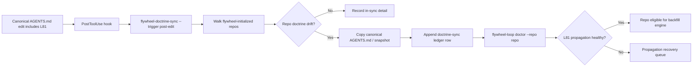
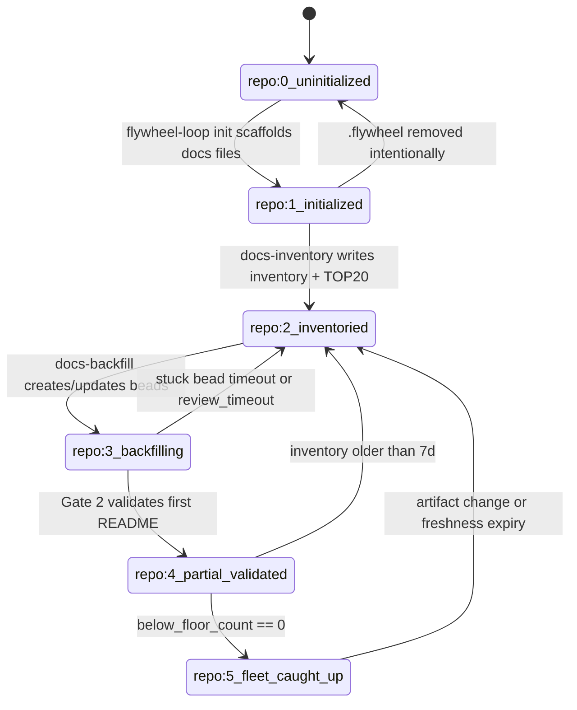

# Fleet-Wide Backfill Engine

This lane designs the engine that carries L81 from canonical flywheel doctrine
into every flywheel-initialized repo, then makes each repo backfill its own
documentation/cross-pane validation work. It is plan-space only. It does not
write L81 wording and does not implement the Lane 2 CLI surface.

## Ground Rules

- Reuse existing primitives: `flywheel-doctrine-sync`, `flywheel-loop`, `br`,
  `ntm`, and agent-mail.
- Backfill is repo-local work. The flywheel brain coordinates; each repo owns
  its inventory, beads, validation queue, and closeout evidence.
- The engine must be idempotent. Re-running propagation, init scaffolding,
  inventory, or bead generation should converge without duplicate work.
- Cross-pane validation remains the gate. Repos with fewer than two Codex panes
  get a declared fallback instead of silently skipping Gate 2.

## 1. Propagation Channel

Use `flywheel-doctrine-sync`; do not create a second doctrine propagation
system.

Current verified shape:

- Canonical source: `/Users/josh/Developer/flywheel/AGENTS.md`
- Binary: `/Users/josh/.claude/skills/.flywheel/bin/flywheel-doctrine-sync`
- Hook: `/Users/josh/.claude/hooks/flywheel-doctrine-sync-post-edit.sh`
- Ledger: `~/.local/state/flywheel/doctrine-sync-ledger.jsonl`
- Doctor field: `.canonical_doctrine_propagation`
- Recent dry-run evidence: 108 scanned repos, 16 in-scope repos, 16 in sync, 0
  drift detected.

Propagation sequence:



Propagation contract:

- **Idempotent:** hash match means no copy. Re-running produces zero changed
  files when root `AGENTS.md` and `.flywheel/AGENTS-CANONICAL.md` already match
  canonical.
- **Per-repo lock:** the sync step must not write a repo while that repo is in
  the middle of a `flywheel-loop init`, `docs-inventory`, or `docs-backfill`
  write. Implementation should use the same repo-local lock namespace Lane 2
  chooses for docs substrate.
- **Ledger row:** every actual sync appends to
  `~/.local/state/flywheel/doctrine-sync-ledger.jsonl` with repo, prior hash,
  new hash, trigger, backups, and timestamp.
- **Doctor verification:** after propagation, run
  `flywheel-loop doctor --repo <repo>` and require the canonical doctrine
  propagation field to show no drift for that repo.
- **No parallel copy logic:** init, post-edit, periodic, and manual repair all
  route through `flywheel-doctrine-sync`.

Note: the dispatch names `flywheel-doctrine-sync --repo <X> --force` as a
recovery command. Current verified help exposes `--repo`, not `--force`. The
plan treats "force" as a possible future Lane 2 alias; today the recovery is a
non-dry-run scoped sync with `--repo <X>`.

## 2. Per-Repo Scaffolding In `flywheel-loop init`

`flywheel-loop init` should extend repo initialization with documentation
backfill scaffolding. Re-running init must be clean.

Required files:

| Path | Shape | Idempotency rule |
|---|---|---|
| `<repo>/.flywheel/docs-policy.md` | Markdown pointer to canonical documentation process and cross-pane validation doctrine. | If present and generated marker/hash matches, leave unchanged. If local edits exist, preserve and append/update generated pointer block only. |
| `<repo>/.flywheel/docs-review-queue.jsonl` | Empty append-only ledger for Gate 2 review items. | Create if absent. Never truncate. |
| `<repo>/.flywheel/INVENTORY-DOCS.md` | Generated per-repo Lane 1 analog with artifact inventory and grades. | Regenerate only via `docs-inventory`; init may seed a placeholder if absent. |
| `<repo>/.flywheel/TOP20-BACKFILL.md` | Generated priority view for dispatch. | Created by inventory generator, not manually edited. |
| doctor `.docs_substrate` | Repo-local doctor field summarizing below-floor count, stale count, review queue, and validation failures. | Computed, not hand-authored. |

`docs-policy.md` minimum content:

- Canonical process pointer:
  `/Users/josh/Developer/flywheel/.flywheel/plans/documentation-substrate-2026-05-01/03-PROCESS-AND-PROCEDURE.md`
- L81 pointer to canonical `AGENTS.md`; no local rewriting of L81.
- Repo-local owner statement: this repo owns its own inventory and backfill
  beads.
- Gate 2 cross-pane validation rule and fallback rule for repos with fewer than
  two Codex panes.

`docs-review-queue.jsonl` row shape:

```json
{
  "ts": "ISO-8601",
  "repo": "/abs/repo",
  "artifact": "relative/path",
  "readme": "relative/path/README.md",
  "bead": "repo-local-id",
  "status": "queued|in_review|validated|rejected|timeout",
  "author_pane": "session:pane",
  "reviewer_pane": "session:pane|null",
  "fallback": "none|joshua_orchestrator",
  "evidence_path": "relative/path"
}
```

## 3. Per-Repo Inventory Generator

`flywheel-loop docs-inventory --repo <repo>` is a scoped Lane 1 inventory pass.
It walks only the target repo and emits repo-owned artifacts.

Walk surfaces:

- `bin/`, `scripts/`, `hooks/`, `commands/`
- skill directories and `SKILL.md` files when the repo owns skills
- `.flywheel/`
- launchd plists when the repo declares them or owns launchd integration
- substrate-registry rows that point at the repo

Generated output:

- `<repo>/.flywheel/INVENTORY-DOCS.md`
- `<repo>/.flywheel/TOP20-BACKFILL.md`
- `~/.local/state/flywheel/docs-inventory-ledger.jsonl`

Inventory ledger schema:

```json
{
  "repo": "/abs/repo",
  "ts": "ISO-8601",
  "totals": {"A": 0, "B": 0, "C": 0, "F": 0},
  "by_kind": {
    "binary": {"A": 0, "B": 0, "C": 0, "F": 0},
    "hook": {"A": 0, "B": 0, "C": 0, "F": 0},
    "plist": {"A": 0, "B": 0, "C": 0, "F": 0},
    "skill": {"A": 0, "B": 0, "C": 0, "F": 0},
    "doctrine": {"A": 0, "B": 0, "C": 0, "F": 0},
    "registry-row": {"A": 0, "B": 0, "C": 0, "F": 0}
  },
  "top20_path": "/abs/repo/.flywheel/TOP20-BACKFILL.md",
  "leverage_5_count": 0,
  "below_floor_count": 0
}
```

Grade meaning:

- `A`: senior-dev floor met, validation green, Gate 2 complete.
- `B`: good README exists but one required floor item is missing.
- `C`: partial docs exist but validation or mermaid/side-effect sections are
  missing.
- `F`: durable artifact is undocumented or below the category floor.

## 4. Per-Repo Bead Generator

`flywheel-loop docs-backfill --repo <repo> [--top-n 20]` converts inventory
gaps into repo-local Beads work. It must not write to a global bead DB.

Bead template:

- Title: `docs-readme-<artifact-name>`
- Description includes:
  - Lane 3 floor for that artifact kind.
  - Lane 2 docs-substrate fields required in frontmatter.
  - Cross-pane Gate 2 callback contract.
  - Validation command and See Also path requirements.
  - Exact artifact path and expected README path.
- Assignee:
  - Resolve idle Codex worker from that repo's NTM session topology.
  - If no idle worker exists, leave unassigned and visible in TOP20.
- Dependencies:
  - Add prerequisite beads before README bead when the artifact lacks a
    documentable contract, for example missing `--help`, unsafe validation, or
    unclear side effects.

Repo-local `br` conflict handling:

1. Run from the repo root so `br` resolves the repo's own `.beads/` database.
2. Before create, search existing open/in-progress beads for the target
   artifact path.
3. If a bead exists, update it with docs-backfill metadata instead of creating a
   duplicate.
4. Use deterministic external key:
   `docs-readme:<relative_artifact_path>:<artifact_hash>`.
5. Record generated/updated bead IDs in `.flywheel/TOP20-BACKFILL.md` and the
   inventory ledger.
6. Never close beads automatically; Gate 2 validation closes or rejects.

## 5. Tick Decision Integration

`/flywheel:tick` Step 5 gains a `DOCS_BACKFILL` slot after normal dispatchable
beads and before doctrine hunting.

Priority placement:

```text
1. REAP_CALLBACKS
2. REPAIR_BLOCKERS
3. DISPATCH_BEAD
4. DOCS_BACKFILL
5. DOCTRINE_HUNT
6. LEARN_REVIEW
7. IDLE_CLEAN
```

Trigger condition:

- repo `.docs_substrate.below_floor_count > 0`
- idle workers > 0
- no higher-priority decision is active
- repo is not locked by propagation/inventory/backfill generation

Action:

1. Read `<repo>/.flywheel/TOP20-BACKFILL.md`.
2. Pick highest-leverage open backfill bead.
3. Dispatch through `/flywheel:dispatch` to an idle repo-local worker.
4. Include Socraticode, file-reservation, Gate 2 callback, and L81 cross-pane
   validation requirements in the packet.
5. Append dispatch receipt to repo dispatch log.

## 6. Fleet Observability

`flywheel-loop fleet-docs --json` is the fleet-wide truth surface. Doctrine
ticks read it before deciding whether docs backfill is actually progressing.

Schema:

```json
{
  "repos": [
    {
      "name": "flywheel",
      "repo": "/Users/josh/Developer/flywheel",
      "below_floor": 154,
      "validated": 0,
      "in_review": 3,
      "review_timeout": 0,
      "last_inventory_ts": "ISO-8601|null",
      "top20_path": "/Users/josh/Developer/flywheel/.flywheel/TOP20-BACKFILL.md"
    }
  ],
  "fleet_totals": {
    "below_floor": 0,
    "validated": 0,
    "in_review": 0,
    "review_timeout": 0
  },
  "validation_rate_per_day": 0
}
```

Read path:

- Per-repo `.docs_substrate`
- Per-repo `.flywheel/docs-review-queue.jsonl`
- Inventory ledger `~/.local/state/flywheel/docs-inventory-ledger.jsonl`

## 7. Cross-Repo Dependency Handling

L81 requires cross-pane validation, but some repos may not have two Codex panes.
The engine must classify capacity before dispatching Gate 2 work.

Detection:

```bash
ntm health <session> --json | jq '[.[] | select(.agent_type=="codex")] | length'
```

Routing:

| Codex panes | Gate 2 route | Status |
|---:|---|---|
| 0 | No autonomous cross-pane review. Queue for Joshua/orchestrator fallback. | `review_waiting_capacity` |
| 1 | Author can write; Joshua-as-orchestrator fallback reviews directly. | `fallback_joshua_orchestrator` |
| >=2 | Standard worker -> orchestrator -> reviewer pane -> Joshua disposition when required. | `cross_pane_ready` |

Fallback is explicit, not silent. The review queue row must set
`fallback:"joshua_orchestrator"` so `fleet-docs` can report how much work is
blocked by pane topology rather than documentation quality.

## 8. Engine State Machine

Repo lifecycle:

- `repo:0_uninitialized`: no `.flywheel/`.
- `repo:1_initialized`: init ran and docs scaffolding exists.
- `repo:2_inventoried`: `INVENTORY-DOCS.md` and TOP20 exist.
- `repo:3_backfilling`: at least one docs backfill bead in flight.
- `repo:4_partial_validated`: at least one README reached validated state.
- `repo:5_fleet_caught_up`: `below_floor_count == 0`.



## 9. Failure Modes And Recovery

| Failure | Detection | Recovery |
|---|---|---|
| Propagation failed. | `doctrine-sync-ledger.jsonl` row has error, or doctor `.canonical_doctrine_propagation.drift_detected > 0`. | Run scoped non-dry-run `flywheel-doctrine-sync --repo <repo> --trigger repair`; if Lane 2 adds `--force`, it maps here. |
| Inventory stale. | `<repo>/.flywheel/INVENTORY-DOCS.md` older than 7 days or artifact mtime newer than inventory ts. | Re-run `flywheel-loop docs-inventory --repo <repo>`. |
| Backfill bead stuck. | `docs-review-queue.jsonl` or br status shows no callback for >7 days. | Reassign to another idle worker; append reassignment row. |
| Joshua signoff queue exceeds 50. | `fleet-docs.fleet_totals.in_review` plus fallback rows exceeds threshold. | Batch surface in `/flywheel:status`; ask for batch disposition only after data grouping. |
| Review timeout fires. | Gate 2 `review_timeout` row or no reviewer callback before SLA. | SOFT violation, retry dispatch to reviewer or fallback route. |
| Repo has fewer than two Codex panes. | NTM health Codex pane count <2. | Use explicit Joshua-as-orchestrator fallback; do not mark cross-pane validated. |
| Bead DB unavailable. | `br` command fails or `.beads` health check errors. | File substrate repair bead if possible; otherwise mark repo docs backfill blocked in fleet-docs. |
| Duplicate backfill bead risk. | Existing bead contains same deterministic external key. | Update existing bead instead of create. |

## 10. Donella Meadows Leverage Points

| Leverage point | Engine mapping |
|---|---|
| #5 information flows | `fleet-docs` makes invisible documentation debt, review state, and topology fallback visible to the doctrine tick. |
| #4 delays | Per-repo inventory cadence, review timeouts, and stale detection shrink the delay between artifact change and doc invalidation. |
| #6 rules | Doctrine-sync makes L81 self-propagating, so new rule adoption is not manual memory. |
| #3 goals | Every repo's "done" definition includes docs-validated, not just code merged or bead closed. |

## Validation Ladder

1. Propagation channel reuses doctrine-sync, not a parallel system: PASS.
2. `flywheel-loop init` scaffolding is idempotent: PASS.
3. Per-repo inventory generator JSON schema is valid: PASS.
4. Per-repo bead generator handles repo-local `br` DB without conflict: PASS.
5. Tick decision integration shows priority slot placement explicitly: PASS.
6. `flywheel-loop fleet-docs` JSON schema is valid: PASS.
7. Cross-repo dependency handling addresses <2 pane case: PASS.
8. Engine state machine has all 6 stages and transitions: PASS.
9. Failure modes section covers at least 5 modes with detection and recovery:
   PASS.
10. Donella Meadows mapping covers at least 3 leverage points: PASS.
11. No file modifications outside this plan output: PASS by intended write
    scope.
12. No fabrication: PASS. Existing primitives were checked locally; proposed
    future-only behavior is labeled as such.

ladder_passed: yes
