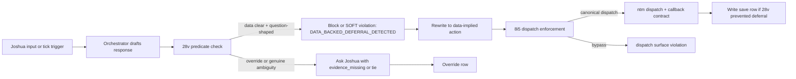

# Data-Backed Deferral Guard - flywheel-28v

status: plan-space
created_at: 2026-05-01
bead: flywheel-28v
scope: design only, no implementation
socraticode: skipped per dispatch for FD-leak diagnostic
agent_mail_reservation: skipped per dispatch for FD-leak diagnostic

## 1. Trauma Class Evidence

The guard targets `meat-puppet-orchestrator-decision-on-partial-state`, promoted in `~/Developer/flywheel/INCIDENTS.md` lines 252-284.

Relevant INCIDENTS.md facts:

- Class: `meat-puppet-orchestrator-decision-on-partial-state`
- Event count: 5 events across 5 sub-classes.
- Root cause: orchestrator reads first available state surface and acts without cross-checking.
- Forever-Rule: before dispatch, refill, ledger append, or callback reap, cross-check at least two truth sources.
- L66 reinforcement: if telemetry already selects the action, dispatch and report the action instead of asking Joshua.

Exact fuckup-log citations:

| Row | Timestamp | Class | Severity | Evidence |
|---:|---|---|---|---|
| `~/.local/state/flywheel/fuckup-log.jsonl#L94` | `2026-05-01T22:00Z` | `use-data-not-meat-puppet` | high | Asked Joshua whether to dispatch Wave 10 despite Wave 9 trajectory data, locked decisions, skill catalog, and Wave 8 precedent all pointing to dispatch. |
| `~/.local/state/flywheel/fuckup-log.jsonl#L95` | `2026-05-01T22:30Z` | `use-data-not-meat-puppet` | critical | Left pane 3 idle after Wave 11 Lens 2 returned 0 gaps; data implied firing Wave 12 adversarial on Lane B/C in parallel with Lane A v6 amendment. |
| `~/.local/state/flywheel/fuckup-log.jsonl#L115` | `2026-05-01T19:26:07Z` | `meat-puppet-pane-state-misread` | medium | `ntm health` said codex panes idle while pane scrollback showed active work; second source caught it before a bad dispatch. |
| `~/.local/state/flywheel/fuckup-log.jsonl#L121` | `2026-05-01T20:00:34Z` | `stdout-truncation-misread-led-to-false-completion` | medium | Truncated stdout made the orchestrator think only one relay sent; ledger had 13 `relay_sent` rows. |
| `~/.local/state/flywheel/fuckup-log.jsonl#L122` | `2026-05-01T20:00:35Z` | `ledger-write-without-reading-current-state` | medium | Added 16 handshake rows without reading current ledger; created duplicates and false positives. |

L66 already states the high-level rule: when idle capacity, ready work, prior wave data, and doctrine-safe risk are all present, asking Joshua to choose is a violation unless a named datum is missing or two actions are tied.

## 2. Detection Signals

The guard reads these signals before allowing question-shaped orchestrator output:

| Order | Signal | Command / source | Parsed fields | Purpose |
|---:|---|---|---|---|
| 1 | Pane liveness and idle capacity | `/Users/josh/.local/bin/ntm health <session> --json` | `.agents[] | select(.status=="ok" and .activity=="idle")` | Count idle healthy workers. |
| 2 | Ready bead count | `cd <repo> && /Users/josh/.cargo/bin/br ready --json` | `length`, top priority/id/title/status | Prove there is dispatchable work. |
| 3 | Recent decision history | `~/.local/state/flywheel/last_tick_*.json` and `~/.local/state/flywheel-loop/last_tick_*.json` | `decision`, `refill_deferred_reason`, `dispatches_sent`, `deferred_beads`, `violations` | Detect repeated deferral or an already-selected lane. |
| 4 | Repo doctor signals | `/Users/josh/.claude/skills/.flywheel/bin/flywheel-loop doctor --repo "$REPO" --json` | `.status`, `.decision`, `.action`, `.beads_db_health.status`, `.fuckup_triage.status`, specific outstanding sections | Distinguish safe dispatch from repo repair or true blocker. |
| 5 | PageRank next action | `cd <repo> && /opt/homebrew/bin/bv --robot-next` | `id`, `title`, `score`, `reasons[]`, `claim_command` | Check whether PageRank selects a concrete next bead. |
| 6 | Pane scrollback second source | `/Users/josh/.local/bin/ntm copy <session>:<pane> -l 30` | `Working`, prompt, callback, output path, command lines | Required cross-check for idle claims after row L115. |
| 7 | Dispatch-log current state | `<repo>/.flywheel/dispatch-log.jsonl` when present | open task ids, callback status, worker pane, output path | Avoid dispatching onto an active or recently completed lane from one signal only. |

The dispatch packet names the first five as required. Signals 6 and 7 are added because INCIDENTS.md explicitly requires two truth sources for pane state and dispatch decisions.

### Predicate: Data Already Implies Action

The guard computes a `data_alignment_score` before output leaves the orchestrator.

Required base condition:

```text
question_shape=true
AND no explicit override
AND idle_worker_count >= 1
AND ready_bead_count >= 1
```

Alignment points:

| Point | Condition |
|---|---|
| `idle_worker` | `ntm health` reports at least one `status=ok`, `activity=idle` worker AND `ntm copy` does not show active work. |
| `ready_work` | `br ready --json` returns at least one open ready bead. |
| `pagerank_pick` | `bv --robot-next` returns an id/title with score and reasons. |
| `doctor_safe_or_repair_selected` | `flywheel-loop doctor` either reports safe/runnable state or names a concrete repair action. |
| `history_points_same_way` | last tick history has deferred work, no dispatches sent, or prior wave result selecting the same lane. |
| `dispatch_log_clear` | no active dispatch already owns the same pane/lane. |

Fire threshold:

```text
fire if base condition true AND data_alignment_score >= 3
```

If the guard fires, it must suggest the action selected by the highest-confidence source:

1. `bv --robot-next` bead id when present and not blocked by doctor.
2. Doctor repair action when doctor status is fail but action is specific and bounded.
3. Highest-priority `br ready --json` bead.
4. Recent tick deferred bead/lane if it names a concrete dispatchable lane.

## 3. Guard Implementation Options

### Option A - Pre-output Hook

Design:

- Intercept orchestrator draft text before render.
- Run the predicate above against current repo/session.
- If predicate fires and draft text matches question-shape patterns, block with:
  `DATA_BACKED_DEFERRAL_DETECTED`.
- Emit a replacement suggestion:
  `Action taken: dispatch <bead> to pane <n>; rationale: <signals>`.

Signal cost:

- High. It must run `ntm health`, `ntm copy`, `br ready`, `flywheel-loop doctor`, optional `bv --robot-next`, and read tick/dispatch logs before text output.
- It also needs an actual hook point for assistant final text. Claude PreToolUse does not naturally intercept ordinary assistant prose; Codex has no equivalent output hook in the current worker model.

False-positive risk:

- Medium-high if last 5 lines include a rhetorical question in a report.
- High if `ntm health` says idle but pane scrollback is active, unless the two-source check is mandatory.
- Medium if ready beads exist but are outside the current mission or require Joshua decision.

Override:

- `JOSHUA_OVERRIDE='<reason>'` or explicit metadata `--require-confirm`.
- Draft must include `evidence_missing=<named datum>` or `tie_between=<option_a,option_b>`.
- Override writes a row to `~/.local/state/flywheel/data-backed-deferral-overrides.jsonl`.

Verdict:

- Strongest block, but too substrate-dependent until a real output interception hook exists.
- Keep as future hard-block after Option B proves the predicate on real receipts.

### Option B - Tick-Time SOFT Violation

Design:

- Add a `/flywheel:tick` check after callback reap and before dispatch decisions.
- Read the last orchestrator output or tick receipt summary.
- If the last 3 orchestrator turns ended with question-shaped output while the predicate was true, emit:
  `orch_question_when_data_clear`.
- If the current tick is about to ask Joshua and predicate is true, the tick rewrites the decision to dispatch/repair and logs a save event.

Signal cost:

- Medium. Tick already reads receipts, fuckup-log, Beads, pane status, and doctor output.
- Incremental cost is `bv --robot-next`, recent `last_tick_*.json`, and question-shape lint on the pending response.

False-positive risk:

- Low-medium. Tick has more context than a text hook and can inspect dispatch logs before firing.
- It may miss one-off interactive questions if they happen outside tick.

Override:

- Same metadata: `JOSHUA_OVERRIDE`, `--require-confirm`, `evidence_missing`, or `tie_between`.
- If override is present, tick logs `orch_question_allowed_with_evidence` instead of a violation.

Verdict:

- Recommended first implementation. It is auditable, low-risk, uses existing tick receipts, and can ship as a SOFT violation before becoming a hard block.

### Option C - Dispatch Skill Question Lint

Design:

- Add a checklist to `/flywheel:dispatch` and dispatch authoring templates:
  if idle worker plus ready work plus PageRank/doctor alignment exists, dispatch instead of asking Joshua.
- The lint can be a shell helper invoked by the skill or a required manual checklist item.

Signal cost:

- Low-medium. It can use a reduced predicate: `ntm health`, `br ready`, and `bv --robot-next`.
- It does not need to scan all orchestrator prose, only dispatch decisions.

False-positive risk:

- Low for dispatch packets.
- High blind spot: it does not catch non-dispatch status updates that end with "Want me to..." even when dispatch is clearly implied.

Override:

- Explicit `evidence_missing` or `requires_joshua_decision=true` in the dispatch receipt.
- Dispatch skill rejects empty override reasons.

Verdict:

- Useful companion to Option B and likely part of flywheel-8i5. Not sufficient alone because the trauma is often a status question before a dispatch packet exists.

### Recommendation

Implement Option B first as `flywheel-28v` because it is observable and safe. Add Option C language in dispatch skills as a companion. Promote Option A only after a real output-interception substrate exists and after at least one saved event proves the predicate.

## 4. Override / Safety Valve

The orchestrator should still ask Joshua when the action is genuinely outside autonomous scope:

1. **Source edits outside the current authorized repo.** If the implied action mutates source in another repo and no dispatch packet granted that scope, ask or file a decision bead.
2. **Spend or cost exposure above a threshold.** If an action would spend money, start paid compute, purchase API credits, or trigger canonical-cli-scoping work with unknown cost, ask. The implementation bead should define `FLYWHEEL_DEFERRAL_COST_LIMIT_USD`, default `0` until Joshua sets it.
3. **Reject-and-revert escalation.** If more than two artifacts fail the same Gate 2 checklist or a revert would touch already-consumed downstream work, ask with the receipts.
4. **Explicit confirmation flag.** Joshua or the dispatch may set `--require-confirm`, `requires_joshua_decision=true`, or equivalent receipt metadata.
5. **Named missing datum.** If one required truth source is unavailable or contradictory, ask only after naming it: `evidence_missing=ntm_copy_unavailable` or `tie_between=flywheel-abc,flywheel-def`.
6. **Safety, secrets, or live prod mutation.** Any step involving secret rotation, live customer data, destructive command, production deploy, or irreversible external side effect remains confirm-first unless a specific doctrine permits it.

Override receipt shape:

```json
{
  "ts": "<utc>",
  "event": "data_backed_deferral_override",
  "session": "flywheel",
  "reason": "evidence_missing|cost|source_scope|reject_revert|require_confirm|live_prod",
  "details": "<one sentence>",
  "signals": {
    "idle_worker_count": 1,
    "ready_bead_count": 3,
    "pagerank_pick": "flywheel-ntf"
  }
}
```

## 5. Question-Shape Detection Patterns

Apply patterns to the last five non-empty lines of the draft output. Normalize leading/trailing whitespace and collapse repeated spaces.

Minimum regex set:

```regex
^Want me to .*\?$
^Should I .*\?$
^(Approve|approve)\b.*\?*$
^Proceed( with .*)?\??$
^Do you want me to .*\?$
^Would you like me to .*\?$
^Can I .*\?$
^May I .*\?$
^Which (one|option|path|bead|lane).*\?$
^What should I .*\?$
.*\?$      # any question mark in the final non-empty line
```

Safe non-question exceptions:

- Markdown headings ending in `?` inside a plan or FAQ section.
- A quoted user question, if followed by an agent action line.
- A callback string that contains a question field but status is already `blocked` with `human_question`.

Implementation note: the broad `.*\?$` rule should only fire inside the last five lines, not the entire response, to avoid false positives in documentation bodies.

## 6. Lock / Release Semantics and Save Log

When the guard fires and the orchestrator self-corrects from question to action, write a positive learning row:

Path:

```text
~/.local/state/flywheel/data-backed-deferral-saves.jsonl
```

Row shape:

```json
{
  "ts": "<utc>",
  "event": "data_backed_deferral_prevented",
  "session": "flywheel",
  "pane": 1,
  "draft_question": "Want me to dispatch ...?",
  "suggested_action": "dispatch flywheel-ntf to flywheel:3",
  "action_taken": "dispatch",
  "signals_aligned": ["idle_worker", "ready_work", "pagerank_pick"],
  "idle_worker_count": 1,
  "ready_bead_count": 17,
  "pagerank_pick": "flywheel-ntf",
  "override": false
}
```

Lock semantics:

- If the guard rewrites to dispatch, dispatch still uses normal file reservations or documented FD-leak exceptions from that dispatch.
- The save log is append-only.
- If multiple orchestrator ticks race, guard reads the last row first and suppresses duplicate save rows with the same `draft_question` and `suggested_action` inside a 10-minute window.

Release semantics:

- No long-lived lock is held by the guard.
- If dispatch fails after self-correction, write a normal dispatch failure receipt. Do not delete the save row; it still proves a meat-puppet question was prevented.

## 7. Integration with flywheel-8i5

`flywheel-28v` lives before dispatch enforcement. It decides whether asking Joshua is allowed. `flywheel-8i5` then decides whether the selected action used the canonical dispatch surface.



Placement in tick:

1. Read autoloop receipts and recent tick state.
2. Reap callbacks and update dispatch logs.
3. Compute idle workers and ready work.
4. Compute PageRank/doctor next action.
5. Run 28v predicate against planned output.
6. If action is implied, dispatch/report.
7. Run 8i5 canonical dispatch enforcement on the dispatch path.

## 8. Per-Bead Acceptance Criteria

`flywheel-28v` can close when the implementation bead proves:

1. A hook or tick check ships and emits `orch_question_when_data_clear` or hard-blocks with `DATA_BACKED_DEFERRAL_DETECTED`.
2. Fixture with Wave 11 pane 3 idle plus ready Lane B/C returns a violation and suggested action.
3. Fixture with genuine ambiguity and `evidence_missing` returns no violation.
4. At least one row exists in `~/.local/state/flywheel/data-backed-deferral-saves.jsonl`.
5. Override mechanism is documented and tested.
6. Question-shape pattern tests cover at least the regex list above.
7. Integration with flywheel-8i5 is tested: 28v selects action, 8i5 enforces canonical dispatch.
8. Doctor or tick receipt includes a count of saves and violations.

## Implementation Sketch for Future Bead

No implementation is performed in this plan. The future implementation can be split into:

1. `scripts/data-backed-deferral-guard.sh` or a `flywheel-loop data-backed-deferral-check` subcommand.
2. Fixture directory with JSON samples:
   - idle workers plus ready beads plus PageRank pick plus question draft.
   - active worker contradiction between `ntm health` and `ntm copy`.
   - real override with `evidence_missing`.
3. Tick integration that records SOFT violations and save rows.
4. Dispatch-skill wording update for Option C.

## Validation Receipt

- Trauma rows cited: 5 rows, covering all 4 requested trauma classes.
- Detection signals enumerated: 7.
- Guard options designed: 3.
- Override legitimate-question scenarios: 6.
- Question-shape regex patterns: 11.
- Save-log path: `~/.local/state/flywheel/data-backed-deferral-saves.jsonl`.
- Integration mermaid includes 28v and 8i5.
- Source modifications: none intended; this is plan-space only.
