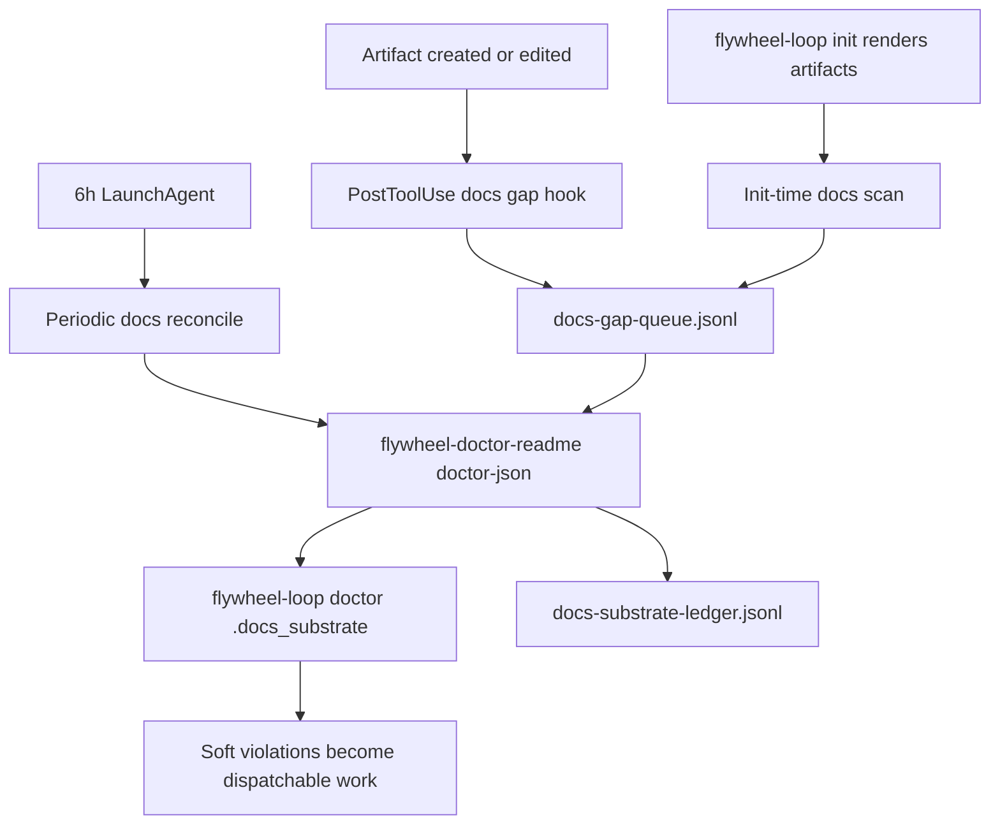

# Documentation Substrate Design - Lane 2

Date: 2026-05-01
Lane: 2 of 3
Scope: substrate design only

## Intent

Design a README enforcement substrate with the same shape as the existing doctrine propagation substrate: explicit doctor invariant, change-time detection, periodic reconcile, append-only ledgers, and recovery evidence. This lane does not choose the first artifacts to document and does not define human procedure; those are sibling lanes.

## Verified Existing Primitives

All existing paths below were checked with `test -e` or direct reads during this lane.

| Path | Role used in design |
|---|---|
| `/Users/josh/.claude/skills/.flywheel/bin/flywheel-doctrine-sync` | Canonical three-trigger model: `--trigger`, `--repo`, `--dry-run`, JSON summary, ledger rows, LaunchAgent health |
| `/Users/josh/.claude/skills/.flywheel/data/substrate-registry.json` | Existing substrate registration shape; `mission-anchor-bundle` is the schema exemplar |
| `/Users/josh/.claude/skills/.flywheel/bin/flywheel-skillos-relay` | Relay pattern: doctor JSON, soft violations, ledger, batch wake signal |
| `/Users/josh/Developer/flywheel/AGENTS.md` | L65-L68 doctrine context |
| `/Users/josh/.claude/skills/readme-writing/SKILL.md` | README authoring primitive |
| `/Users/josh/.claude/skills/living-documentation/SKILL.md` | README update/freshness primitive |
| `/Users/josh/.claude/skills/codebase-archaeology/SKILL.md` | Source-of-truth survey primitive |
| `/Users/josh/.claude/skills/api-documentation-generation/SKILL.md` | API/contract documentation primitive |
| `/Users/josh/.claude/skills/technical-writing/SKILL.md` | Clarity/polish primitive |
| `/Users/josh/.claude/skills/dispatch-tool-contracts/SKILL.md` | Dispatch/callback documentation primitive |

Registry note: `mission-anchor-bundle` includes `validation_command`, `evidence_required`, `recovery_proof`, `critical_auto_fail`, `cadence_days`, `where`, `components`, and `consumers`. No existing entry currently exposes a top-level `freshness_check`; this design includes it as a proposed field for the docs bundle because freshness is the core invariant.

## Substrate Topology



The common substrate binary is planned as:

`/Users/josh/.claude/skills/.flywheel/bin/flywheel-doctor-readme`

It should own scanning, queueing, validation-command execution, mermaid checks, senior-dev checks, and doctor JSON emission. `flywheel-loop doctor --json` should embed its output under `.docs_substrate` instead of re-implementing scanner logic.

Planned command surface:

```bash
flywheel-doctor-readme scan --json [--root PATH]
flywheel-doctor-readme queue --path PATH --event hook|init|periodic --json
flywheel-doctor-readme validate --readme PATH --json
flywheel-doctor-readme reconcile --trigger init|post-edit|periodic --repo PATH --json
flywheel-doctor-readme doctor-json
```

## Component 1: README Pointer Enforcement

Purpose: every load-bearing artifact can point an agent to its owning README without out-of-band memory.

Mechanism:
- Scan eligible artifacts:
  - `/Users/josh/.claude/skills/.flywheel/bin/*`
  - `/Users/josh/.claude/hooks/*`
  - `/Users/josh/Library/LaunchAgents/*.plist`
  - `/Users/josh/.claude/skills/*/SKILL.md`
  - `/Users/josh/Developer/flywheel/.flywheel/**`
- Determine artifact kind by extension/path.
- Parse the first five logical lines for a README pointer. For plist XML, allow an XML comment before the first `<plist>` element.
- Resolve relative README paths from the artifact's directory; absolute paths stay absolute.
- Missing pointer emits a queue row but does not block the write.

Pointer formats:

```bash
# README: docs/flywheel-doctrine-sync.md
```

```json
{ "_readme": "/absolute/path/to/README.md" }
```

```yaml
_readme: docs/hook.md
```

```markdown
---
readme: docs/my-skill.md
---
```

```xml
<!-- README: /Users/josh/Developer/flywheel/.flywheel/docs/launchd.md -->
```

File paths:
- Planned binary: `/Users/josh/.claude/skills/.flywheel/bin/flywheel-doctor-readme`
- Planned policy file: `/Users/josh/.claude/skills/.flywheel/data/docs-readme-policy.json`
- Planned ledger: `/Users/josh/.local/state/flywheel/docs-substrate-ledger.jsonl`
- Planned queue: `/Users/josh/.local/state/flywheel/docs-gap-queue.jsonl`

Command spec:

```bash
flywheel-doctor-readme scan --json
flywheel-doctor-readme scan --root /Users/josh/.claude/hooks --json
```

Doctor field:

```json
{
  "docs_substrate": {
    "pointer_compliance": {
      "scanned": 0,
      "compliant": 0,
      "missing": []
    }
  }
}
```

Soft violations:
- `readme_pointer_missing`: eligible artifact has no README pointer.
- `readme_pointer_broken`: pointer exists but target path does not exist.
- `readme_pointer_unparseable`: pointer syntax exists but cannot be resolved.

## Component 2: README Freshness Tracker

Purpose: a README's claims expire unless the referenced artifact is still within its declared freshness window and its validation command passes.

Mechanism:
- Parse README frontmatter.
- Resolve `target_artifact`.
- Compare target artifact mtime to `last_validated_ts` plus `freshness_window_days`.
- Execute `validation_command` when present.
- Emit a ledger row for every validation run, including stdout/stderr tail and elapsed time.

Required README frontmatter:

```yaml
---
schema_version: 1
target_artifact: /absolute/path/to/script-or-skill
last_validated_ts: 2026-05-01T20:35:00Z
validated_by: <agent-name>
validation_command: "the actual command run to verify the README's claims still hold"
freshness_status: green|yellow|red
freshness_window_days: 30
mermaid_present: true|false
---
```

Staleness rules:
- `green`: target artifact mtime is less than or equal to `last_validated_ts + freshness_window_days`.
- `yellow`: target artifact mtime is greater than `last_validated_ts + freshness_window_days`.
- `red`: target artifact mtime is greater than `last_validated_ts + 2 * freshness_window_days`, or `validation_command` fails.

File paths:
- Planned binary: `/Users/josh/.claude/skills/.flywheel/bin/flywheel-doctor-readme`
- Planned ledger: `/Users/josh/.local/state/flywheel/docs-substrate-ledger.jsonl`
- Planned backups: `/Users/josh/.local/state/flywheel/docs-backups/<sha>.bak` for future README mutation flows.

Command spec:

```bash
flywheel-doctor-readme validate --readme /absolute/path/README.md --json
flywheel-doctor-readme doctor-json
```

Doctor field:

```json
{
  "docs_substrate": {
    "freshness": {
      "green": 0,
      "yellow": [],
      "red": []
    },
    "validation_command_failures": []
  }
}
```

Soft violations:
- `readme_stale_yellow`: README exceeded one freshness window.
- `readme_stale_red`: README exceeded two freshness windows.
- `readme_validation_command_failed`: declared validation command failed.
- `readme_frontmatter_missing`: README lacks required frontmatter.
- `readme_target_artifact_missing`: `target_artifact` does not exist.

## Component 3: Auto-Detection Hook

Purpose: catch new or changed artifacts at write time and queue documentation gaps immediately, without blocking file creation.

Mechanism:
- Add a PostToolUse hook for `Write|Edit|MultiEdit`.
- Inspect the event path and trigger only for:
  - `/Users/josh/.claude/skills/.flywheel/bin/`
  - `/Users/josh/.claude/hooks/`
  - `/Users/josh/Library/LaunchAgents/`
  - `/Users/josh/.claude/skills/<skill>/`
  - `/Users/josh/Developer/flywheel/.flywheel/`
- Classify artifact kind.
- Run a pointer-only scan against the changed path.
- Append a queue row when missing or broken.
- Always exit 0; the hook is observability, not a write gate.

Planned hook path:

`/Users/josh/.claude/hooks/flywheel-docs-gap-post-edit.sh`

Planned hook installation target:

`/Users/josh/.claude/settings.json`

Planned queue row:

```json
{
  "ts": "2026-05-01T20:35:00Z",
  "event": "docs_gap_detected",
  "trigger": "post-edit",
  "path": "/absolute/path/to/artifact",
  "kind": "binary|hook|plist|skill|doctrine-artifact",
  "gap_class": "readme_pointer_missing",
  "suggested_readme_path": "/absolute/path/to/README.md",
  "suggested_skill_to_invoke": "readme-writing"
}
```

Command spec:

```bash
echo '{"tool_name":"Write","tool_input":{"file_path":"/path/to/artifact"}}' \
  | /Users/josh/.claude/hooks/flywheel-docs-gap-post-edit.sh

flywheel-doctor-readme queue --path /path/to/artifact --event post-edit --json
```

Doctor field:

```json
{
  "docs_substrate": {
    "queued_gaps": 0,
    "last_run_ts": "2026-05-01T20:35:00Z"
  }
}
```

Soft violations:
- `docs_gap_queued`: gap detected and queued for dispatch decision.
- `docs_gap_hook_unloaded`: hook command absent from settings.
- `docs_gap_hook_error`: hook failed internally; should be logged but not block writes.

Trigger mapping:
- Init-time: `flywheel-loop init` calls `flywheel-doctor-readme reconcile --trigger init --repo "$repo" --json` after rendering `.flywheel` artifacts.
- Change-time: PostToolUse hook calls `queue --event post-edit`.
- Periodic: LaunchAgent calls `reconcile --trigger periodic`.

## Component 4: Validation Command Engine

Purpose: README truth is tested by declared commands, not trusted because the prose exists.

Mechanism:
- Read `validation_command` from README frontmatter.
- Execute under `bash -lc` with timeout, captured stdout/stderr, and cwd set to the README directory unless the command declares an absolute cwd.
- Store one ledger row per command run.
- Only execute commands from README files already discovered by pointer scan or registry components, avoiding arbitrary filesystem execution.

Examples:

```yaml
validation_command: "/Users/josh/.claude/skills/.flywheel/bin/flywheel-doctrine-sync --help | grep -q -- '--dry-run' && /Users/josh/.claude/skills/.flywheel/bin/flywheel-doctrine-sync --dry-run --json | jq -e '.scanned_repos > 0'"
```

```yaml
validation_command: "printf '%s\n' '{\"tool_name\":\"Write\",\"tool_input\":{\"file_path\":\"/tmp/example\"}}' | /Users/josh/.claude/hooks/example-hook.sh"
```

```yaml
validation_command: "jsm validate /Users/josh/.claude/skills/example-skill"
```

File paths:
- Planned binary: `/Users/josh/.claude/skills/.flywheel/bin/flywheel-doctor-readme`
- Planned ledger: `/Users/josh/.local/state/flywheel/docs-substrate-ledger.jsonl`

Command spec:

```bash
flywheel-doctor-readme validate --readme /path/README.md --json
flywheel-doctor-readme validate --all --timeout-seconds 20 --json
```

Doctor field:

```json
{
  "docs_substrate": {
    "validation_command_failures": [
      {
        "readme": "/path/README.md",
        "target_artifact": "/path/artifact",
        "exit_code": 1,
        "error_tail": "..."
      }
    ]
  }
}
```

Soft violations:
- `readme_validation_failed`: validation command exits non-zero.
- `readme_validation_timeout`: validation command exceeds timeout.
- `readme_validation_unsafe_command`: command uses a denied destructive shape; the engine records and skips it.
- `readme_validation_missing_for_critical`: critical artifact README lacks a validation command.

## Component 5: Mermaid Requirement Matrix

Purpose: visual structure is required for systems and loops where prose-only docs routinely hide missing edges.

Mechanism:
- Classify artifact kind from path, registry entry, and README frontmatter.
- Apply the matrix below.
- If mermaid is required, check README body for a fenced `mermaid` block.
- Record requirement source in doctor output so remediation knows why it was required.

Matrix:

| Artifact kind | Mermaid required | Reason |
|---|---:|---|
| Multi-step flows, including dispatch -> callback -> reap loop | yes | Flow edges and actors matter |
| Feedback loops, including L-rules with information flow | yes | Prevent missing balancing/reinforcing loops |
| Substrate registry entries with components | yes | Components and probes need dependency visibility |
| Standalone CLI utilities | no | Command reference is usually enough |
| Hooks with a single matcher | no | One input path, one output path |
| Skills with a linear procedure | no | Ordered checklist is the core shape |
| Doctrine documents: `AGENTS.md`, `MISSION.md`, `GOAL.md`, `STATE.md` | yes | System map belongs at the top |

File paths:
- Planned policy file: `/Users/josh/.claude/skills/.flywheel/data/docs-readme-policy.json`
- Planned binary: `/Users/josh/.claude/skills/.flywheel/bin/flywheel-doctor-readme`

Command spec:

```bash
flywheel-doctor-readme scan --json | jq '.docs_substrate.mermaid_required_missing'
```

Doctor field:

```json
{
  "docs_substrate": {
    "mermaid_required_missing": []
  }
}
```

Soft violations:
- `readme_mermaid_required_missing`: README lacks a required mermaid block.
- `readme_mermaid_unparseable`: mermaid block exists but is syntactically malformed.

## Component 6: Senior-Dev Validation Gate

Purpose: load-bearing artifacts need a README that a senior engineer can use to operate, debug, and validate the substrate without asking the author.

Mechanism:
- Identify load-bearing artifacts by either:
  - `critical_auto_fail: true` in `/Users/josh/.claude/skills/.flywheel/data/substrate-registry.json`
  - planned registry/frontmatter marker `kind: tentacle`
  - LaunchAgent or hook that mutates state
- Check required README sections.
- Compare command reference against detected flags for shell scripts with `usage()` output when available.
- Emit only soft violations; missing docs creates dispatchable work, not a write block.

Required sections for load-bearing artifacts:
- `## Architecture` with mermaid
- `## Command Reference` listing all flags
- `## Error Modes` documenting non-zero exit codes
- `## Troubleshooting` with at least three known issues and fixes
- `## Validation` showing how to verify the README against reality
- `## See Also` linking dependent and dependency artifacts

File paths:
- Planned binary: `/Users/josh/.claude/skills/.flywheel/bin/flywheel-doctor-readme`
- Existing registry used for classification: `/Users/josh/.claude/skills/.flywheel/data/substrate-registry.json`

Command spec:

```bash
flywheel-doctor-readme validate --readme /path/README.md --senior-dev-gate --json
flywheel-doctor-readme doctor-json
```

Doctor field:

```json
{
  "docs_substrate": {
    "senior_dev_gate": {
      "passing": 0,
      "failing": []
    }
  }
}
```

Soft violations:
- `readme_below_senior_dev_bar`: one or more required sections missing.
- `readme_command_reference_incomplete`: script flags exceed documented flags.
- `readme_troubleshooting_too_thin`: fewer than three known issues/fixes for load-bearing artifact.
- `readme_dependency_links_missing`: `See Also` does not name dependencies/consumers.

## Doctor JSON Contract

`flywheel-loop doctor --json` should add the following optional, backward-compatible top-level field:

```json
{
  "docs_substrate": {
    "pointer_compliance": {
      "scanned": 0,
      "compliant": 0,
      "missing": []
    },
    "freshness": {
      "green": 0,
      "yellow": [],
      "red": []
    },
    "mermaid_required_missing": [],
    "senior_dev_gate": {
      "passing": 0,
      "failing": []
    },
    "validation_command_failures": [],
    "queued_gaps": 0,
    "last_run_ts": "2026-05-01T20:35:00Z"
  }
}
```

Violation classes emitted from this field:
- `readme_pointer_missing`
- `readme_pointer_broken`
- `readme_pointer_unparseable`
- `readme_stale_yellow`
- `readme_stale_red`
- `readme_validation_command_failed`
- `readme_validation_failed`
- `readme_validation_timeout`
- `readme_validation_unsafe_command`
- `readme_validation_missing_for_critical`
- `readme_frontmatter_missing`
- `readme_target_artifact_missing`
- `readme_mermaid_required_missing`
- `readme_mermaid_unparseable`
- `readme_below_senior_dev_bar`
- `readme_command_reference_incomplete`
- `readme_troubleshooting_too_thin`
- `readme_dependency_links_missing`
- `docs_gap_queued`
- `docs_gap_hook_unloaded`
- `docs_gap_hook_error`

## Storage Paths

All storage is under the existing flywheel state root and does not conflict with current ledgers:

| Store | Absolute path | Purpose |
|---|---|---|
| Ledger | `/Users/josh/.local/state/flywheel/docs-substrate-ledger.jsonl` | Append-only validation, scan, queue, and remediation events |
| Gap queue | `/Users/josh/.local/state/flywheel/docs-gap-queue.jsonl` | Pending documentation gaps for dispatch decision |
| Backups | `/Users/josh/.local/state/flywheel/docs-backups/<sha>.bak` | Future README mutation backups |
| Policy | `/Users/josh/.claude/skills/.flywheel/data/docs-readme-policy.json` | Artifact-kind matrix and scan globs |

Ledger row shape:

```json
{
  "ts": "2026-05-01T20:35:00Z",
  "event": "scan|queue|validate|doctor",
  "trigger": "init|post-edit|periodic|manual|doctor",
  "path": "/absolute/path",
  "readme": "/absolute/path/README.md",
  "status": "ok|warn|fail",
  "violations": [],
  "evidence": {
    "command": "validation command",
    "exit_code": 0,
    "elapsed_ms": 0
  }
}
```

## Substrate Registry Entry

Planned entry for `/Users/josh/.claude/skills/.flywheel/data/substrate-registry.json`:

```json
{
  "name": "docs-substrate-bundle",
  "kind": "bundle",
  "scope": "global",
  "version": "0.1.0",
  "source": "zeststream",
  "sourceUrl": "reference:documentation-substrate-2026-05-01/02-SUBSTRATE-DESIGN.md",
  "installedAt": "2026-05-01T20:35:00Z",
  "session_added": "2026-05-01T20:35:00Z",
  "added_by": "docs_plan_substrate",
  "valid_from": "2026-05-01T20:35:00Z",
  "valid_to": null,
  "effect": "warn",
  "lifecycle_state": "planned",
  "lifecycle_stage": "candidate",
  "where": [
    "/Users/josh/.claude/skills/.flywheel/bin/flywheel-doctor-readme",
    "/Users/josh/.claude/hooks/flywheel-docs-gap-post-edit.sh",
    "/Users/josh/Library/LaunchAgents/ai.zeststream.flywheel-docs-substrate.plist",
    "/Users/josh/.claude/skills/.flywheel/data/docs-readme-policy.json",
    "/Users/josh/.local/state/flywheel/docs-substrate-ledger.jsonl",
    "/Users/josh/.local/state/flywheel/docs-gap-queue.jsonl"
  ],
  "owner": "readme-writing",
  "intake_skill": "living-documentation",
  "validator": "flywheel-doctor-readme",
  "validation_command": "/Users/josh/.claude/skills/.flywheel/bin/flywheel-doctor-readme doctor-json | jq -e '.docs_substrate.pointer_compliance.scanned >= 0 and (.docs_substrate.validation_command_failures | type == \"array\")'",
  "health_probe_command": "/Users/josh/.claude/skills/.flywheel/bin/flywheel-doctor-readme doctor-json",
  "consumers": [
    "flywheel-loop doctor",
    "readme-writing",
    "living-documentation",
    "dispatch-tool-contracts",
    "skillos relay",
    "worker dispatch callbacks"
  ],
  "state_path": "/Users/josh/.local/state/flywheel/docs-substrate-ledger.jsonl",
  "retirement_path": "Remove PostToolUse hook and LaunchAgent only after replacing doctor invariant with an equivalent docs substrate.",
  "rollback_path": {
    "previous_version": "docs-substrate-bundle@0.0.0",
    "trigger": "Hook false positives or validation-command instability",
    "command": "launchctl bootout gui/$UID/ai.zeststream.flywheel-docs-substrate; remove hook entry from /Users/josh/.claude/settings.json",
    "tested": false,
    "evidence_path": null
  },
  "doctor_invariant_ref": "flywheel-loop doctor:docs_substrate",
  "cadence_days": 1,
  "critical_auto_fail": false,
  "evidence_required": [
    "behavioral_smoke",
    "doctor_json_contract",
    "hook_synthetic_event",
    "launchagent_periodic_probe",
    "registry_validation"
  ],
  "freshness_check": {
    "command": "/Users/josh/.claude/skills/.flywheel/bin/flywheel-doctor-readme doctor-json",
    "max_last_run_age_seconds": 32400,
    "stale_violation": "docs_substrate_syncer_stale"
  },
  "components": [
    {
      "name": "flywheel-doctor-readme",
      "kind": "doctor-block",
      "where": "/Users/josh/.claude/skills/.flywheel/bin/flywheel-doctor-readme"
    },
    {
      "name": "flywheel-docs-gap-post-edit",
      "kind": "lifecycle-hook",
      "where": "/Users/josh/.claude/hooks/flywheel-docs-gap-post-edit.sh"
    },
    {
      "name": "flywheel-docs-substrate-launchagent",
      "kind": "periodic-reconcile",
      "where": "/Users/josh/Library/LaunchAgents/ai.zeststream.flywheel-docs-substrate.plist"
    },
    {
      "name": "docs-readme-policy",
      "kind": "policy",
      "where": "/Users/josh/.claude/skills/.flywheel/data/docs-readme-policy.json"
    }
  ],
  "last_validated_ts": null,
  "mutates_live_state": true,
  "recovery_proof": {
    "mode": "non_blocking_warn_only",
    "tested": false,
    "mutation": false,
    "last_test_ts": null,
    "evidence_path": null,
    "assertions_passed": 0,
    "assertions_failed": 0,
    "scope": "planned; validate in temp HOME before installing live hook"
  }
}
```

## Skill Integration Map

| Lifecycle stage | Existing skill | Verified path |
|---|---|---|
| Source-of-truth survey before writing docs | `codebase-archaeology` | `/Users/josh/.claude/skills/codebase-archaeology/SKILL.md` |
| README authoring | `readme-writing` | `/Users/josh/.claude/skills/readme-writing/SKILL.md` |
| README updates after artifact changes | `living-documentation` | `/Users/josh/.claude/skills/living-documentation/SKILL.md` |
| API/contract docs | `api-documentation-generation` | `/Users/josh/.claude/skills/api-documentation-generation/SKILL.md` |
| Technical writing polish | `technical-writing` | `/Users/josh/.claude/skills/technical-writing/SKILL.md` |
| Dispatch/callback flow docs | `dispatch-tool-contracts` | `/Users/josh/.claude/skills/dispatch-tool-contracts/SKILL.md` |

Skill invocation hints for queue rows:
- Missing pointer on script/hook/plist: `readme-writing`
- Existing README stale after artifact edit: `living-documentation`
- Unclear source behavior: `codebase-archaeology`
- API or command contract drift: `api-documentation-generation`
- Prose below senior-dev bar: `technical-writing`
- Dispatch, callback, or worker protocol artifact: `dispatch-tool-contracts`

## Anti-Patterns Explicitly Avoided

- No auto-writing READMEs: the substrate queues gaps and validates existing claims; it does not generate taste-bearing documentation without review.
- No git-hook dependency: detection uses Claude PostToolUse plus LaunchAgent reconcile because artifacts live across home directories, LaunchAgents, skills, and repos.
- No write blocking: missing README pointers produce doctor warnings and queue rows, not pre-write denials.
- No doctrine-sync fork: the design reuses the same trigger/ledger/doctor pattern but keeps scanner logic in one docs-specific binary that `flywheel-loop doctor` calls.

## Validation Ladder

1. Six components are specified: pointer enforcement, freshness tracker, auto-detection hook, validation command engine, mermaid matrix, senior-dev gate.
2. Each component includes purpose, mechanism, file paths, command spec, doctor field, and soft violations.
3. Doctor JSON contract is syntactically valid JSON and backwards-compatible as an optional top-level field.
4. Storage paths are absolute and under existing flywheel state or skills roots; no current ledgers use these filenames.
5. Substrate registry entry follows the `mission-anchor-bundle` shape for `where`, `validation_command`, `consumers`, `evidence_required`, `cadence_days`, `components`, and `recovery_proof`; `freshness_check` is a proposed docs-specific extension.
6. Skill mapping covers survey, authoring, updates, API/contract documentation, prose polish, and dispatch-flow docs.
7. Anti-patterns section addresses all four constraints from the dispatch.
8. Existing paths referenced were verified; planned paths are explicitly labeled planned.
9. No implementation files were changed by this lane; only this design output and callback output are written.
