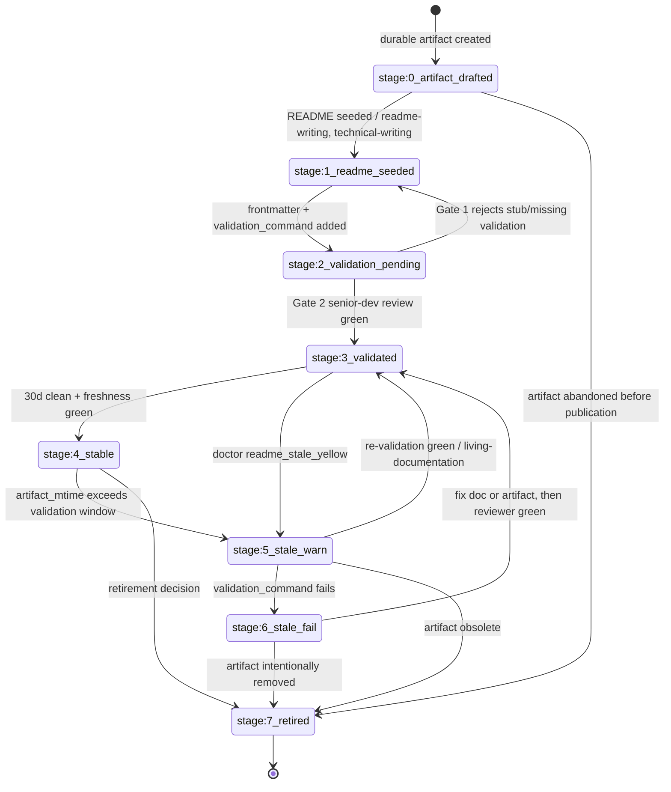
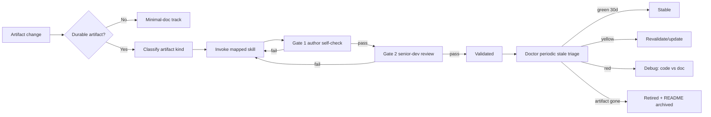
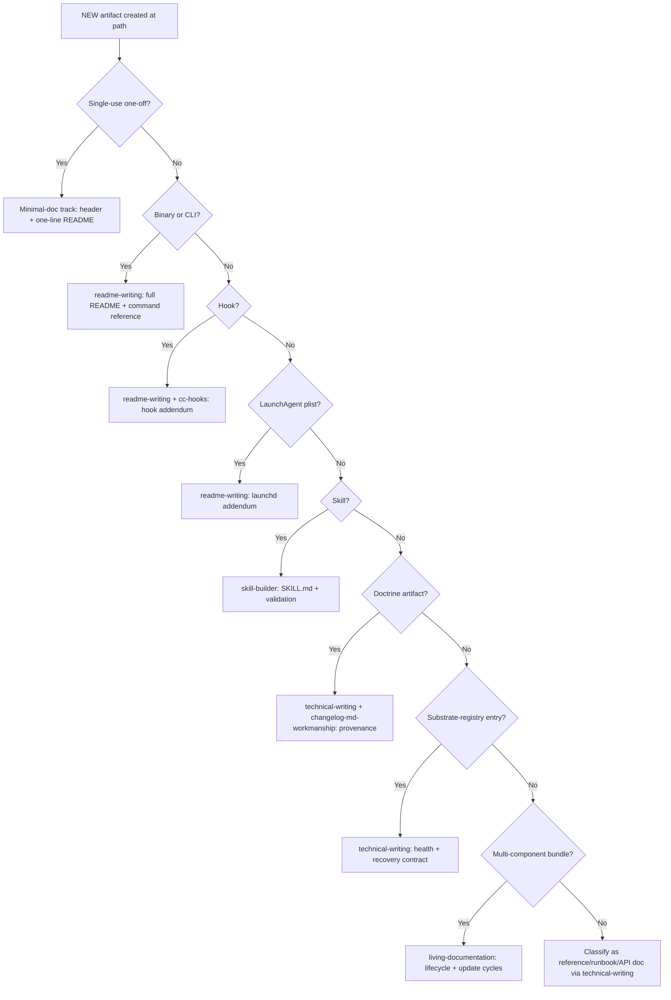
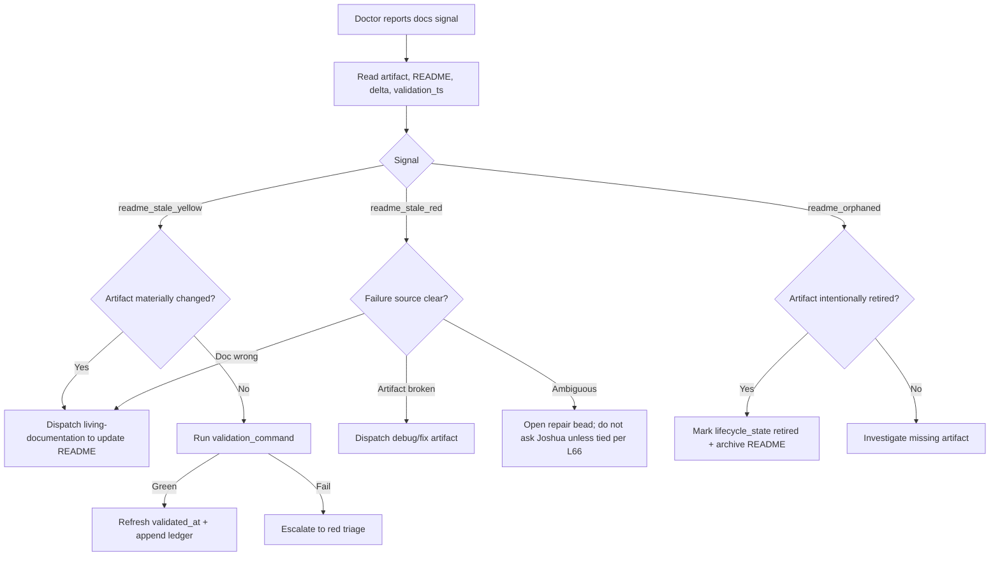

# Documentation Substrate: Process And Procedure

This lane defines the senior-dev process for documentation lifecycle,
validation, staleness triage, and retirement. It does not choose the first
implementation target and does not design the registry/storage substrate.

## Source Constraints

- `readme-writing`: `/Users/josh/.claude/skills/readme-writing`
- `skill-builder`: `/Users/josh/.claude/skills/skill-builder`
- `living-documentation`: `/Users/josh/.claude/skills/living-documentation`
- `changelog-md-workmanship`: `/Users/josh/.claude/skills/changelog-md-workmanship`
- `technical-writing`: `/Users/josh/.claude/skills/technical-writing`
- `cc-hooks`: `/Users/josh/.claude/skills/cc-hooks`
- Flywheel doctrine read: L56, L65, L66, L67, L68.

The governing principle is from `living-documentation`: documentation is part of
the feature. For flywheel artifacts, that becomes: an artifact is not senior-dev
complete until its documentation can be validated by a cold reviewer and kept
fresh by doctor.

## Lifecycle State Machine

States are stored by Lane 2's substrate design, but the process contract is:

| Stage | Meaning | Entry trigger | Required skill/process | Doctor signal |
|---|---|---|---|---|
| `stage:0_artifact_drafted` | File exists, but no README contract exists yet. | Artifact created or changed materially. | Author classifies artifact kind. | `readme_missing` if artifact is durable. |
| `stage:1_readme_seeded` | README exists with `status: foundation`. | Author writes initial README. | `readme-writing` or artifact-specific skill. | `readme_foundation`. |
| `stage:2_validation_pending` | README names validation commands, but they are unverified. | Author adds frontmatter and validation section. | Author self-check. | `readme_validation_pending`. |
| `stage:3_validated` | Validation command runs green; senior-dev floor passes. | Reviewer signs `validated_by`. | Senior-dev review. | `readme_validated`. |
| `stage:4_stable` | 30 days clean, freshness green, no validation failures. | Periodic doctor sees clean window. | Stale triage loop. | `readme_stable`. |
| `stage:5_stale_warn` | `artifact_mtime > validation_ts + freshness_window`. | Doctor freshness check. | `living-documentation` triage. | `readme_stale_yellow`. |
| `stage:6_stale_fail` | Validation command fails. | Doctor executes validation command. | Debug path, then doc/code choice. | `readme_stale_red`; SOFT violation. |
| `stage:7_retired` | Artifact deleted or intentionally unused; README archived. | Retirement decision. | Archive procedure. | `readme_retired` or `orphan_readme_archived`. |





## Senior-Dev Procedural Floor

Every category has a minimum documentation floor. Extra docs are allowed; the
floor is not optional.

### Binaries (`flywheel-*`)

1. Header comment with purpose, owner surface, and safety boundary.
2. Sibling `README.md` or skill `references/<binary>.md` with:
   - One-line value proposition.
   - Architecture mermaid: data flow IN -> process -> flow OUT.
   - Command reference: every flag with an example.
   - Env vars table: name, default, purpose.
   - Exit codes table.
   - Side effects: writes, reads, network calls, subprocesses.
   - Error modes with reproduction commands.
   - See Also: related binaries, hooks, plists, and doctrine.
3. Validation:
   - `<binary> --help` lists every documented flag.
   - Smoke command from README runs green.
   - Side-effect paths exist or are explicitly marked optional.
4. Frontmatter:
   - `target_artifact`, `artifact_kind: binary`, `version`, `commit_ref`.
   - `validation_command`, `validated_at`, `validated_by`.

### Hooks (`*.sh`)

1. Header comment states hook event, matcher, block/log behavior, and input
   schema.
2. README covers:
   - When it fires: `PreToolUse`, `PostToolUse`, `UserPromptSubmit`,
     `SessionStart`, `Stop`, `Notification`, or `PermissionRequest`.
   - Matcher pattern as literal regex/glob.
   - Side effects and log paths.
   - Temporary disable procedure.
   - Failure mode: blocks tool, logs only, or fail-open/fail-closed.
3. Validation:
   - Synthetic payload smoke test.
   - Exit-code behavior verified, especially code `2` for blocking hooks.
   - `cc-hooks` reference checked for event/matcher semantics.

### LaunchAgent Plists

1. README covers:
   - Label and schedule decoded into human time.
   - `ProgramArguments` path and env assumptions.
   - `RunAtLoad`, `StartInterval`, `StartCalendarInterval`.
   - stdout/stderr log paths.
   - Unload/reload commands.
2. Validation:
   - `plutil -lint <plist>` passes.
   - `launchctl list | grep <label>` confirms loaded when expected.
   - Program path exists and is executable.

### Skills

1. `SKILL.md` follows `skill-builder` template and house style.
2. If `SKILL.md` exceeds 200 lines, detail moves into `references/`.
3. Trigger phrases match real usage and are not filler.
4. Validation:
   - `jsm validate <skill>` passes.
   - Skill-specific self-test/probe exists for operational skills.
   - `status` truthfully reflects lifecycle: foundation, candidate, stable,
     stale_yellow, stale_red, retired.

### Doctrine Docs (`AGENTS.md`, `MISSION.md`, `GOAL.md`, `STATE.md`)

1. Top-of-file system diagram when the document governs a process or routing
   surface.
2. Each L-rule or doctrine rule has:
   - Why.
   - How to apply.
   - SOFT violations.
   - Provenance.
3. Validation:
   - Lock-log integrity passes where lock hashes apply.
   - Provenance citations exist per L56.
   - Rule is routed correctly: event -> INCIDENTS -> canonical L-rule, not
     skipped straight to universal doctrine without evidence.

### Substrate-Registry Entries

1. Entry names the target artifact and owner.
2. `validation_command` and `health_probe_command` succeed at registration.
3. `evidence_required` is explicit.
4. Recovery proof is tested before `lifecycle_state=active`.
5. Validation:
   - Probe returns machine-readable status.
   - Failure mode names map to recovery instructions.
   - Cross-session handoff follows L65/L68 when skillos owns hardening.

## Authoring Decision Tree



Exhaustiveness rule: every durable artifact must land in one terminal path
above. If it does not, the authoring packet is incomplete and must add a new
artifact kind before shipping.

## Validation Gates

### Gate 1 - Author Self-Check (Immediate, Blocking)

Pass criteria:

- README exists at the expected path.
- Frontmatter includes `target_artifact`, `artifact_kind`, `status`,
  `version`, `created_at`, `updated_at`, `validation_command`,
  `freshness_window_days`, and `owner`.
- Mermaid exists when required by the category matrix.
- `validation_command` executes and references the real artifact.
- See Also paths are syntactically local paths or URLs.
- No placeholder text remains.

Fail criteria:

- Missing README for durable artifact.
- `validation_command` is a stub such as `echo ok`.
- Mermaid required but absent.
- Frontmatter `status` is higher than evidence supports.

### Gate 2 - Senior-Dev Review (Asynchronous, Gate To `stage:3_validated`)

Pass criteria:

- Reviewer runs `validation_command`; exit code is green.
- Reviewer can reproduce usage from README alone.
- `--help`, examples, env vars, side effects, and failure modes match artifact
  behavior.
- See Also links resolve.
- Reviewer fills `validated_by: <agent-name>` and `validated_at`.
- Reviewer records commit ref or content hash.

Fail criteria:

- Cold reviewer needs hidden context.
- Examples fail or mutate unexpected state.
- README copies another artifact's paths.
- Diagram contradicts actual data/control flow.

### Gate 3 - Stale Triage (Periodic, Doctor-Driven)

Pass criteria:

- Green: `artifact_mtime <= validation_ts + freshness_window`.
- Yellow: freshness window breached, but validation still green; ledger row
  appended and 7-day grace starts.
- Red: validation fails; doctor emits SOFT violation and dispatch decision is
  required.

Required doctor output:

- `readme_stale_yellow`: artifact, README, delta, validation_ts, grace_until.
- `readme_stale_red`: artifact, README, failing command, exit code, stderr
  summary.
- `readme_orphaned`: README target missing.

## Staleness Triage Protocol

Ledger path: `~/.local/state/flywheel/docs-staleness-log.jsonl`

Each row:

```json
{
  "ts": "ISO-8601",
  "artifact": "path",
  "readme": "path",
  "signal": "readme_stale_yellow|readme_stale_red|readme_orphaned",
  "artifact_mtime": "ISO-8601",
  "validation_ts": "ISO-8601|null",
  "decision": "revalidate|update_docs|debug_artifact|retire|ask_human",
  "reason": "short text",
  "owner": "agent-or-human"
}
```



Data-driven rule: per L66, if the signal selects an action, dispatch the action
and report it. Ask Joshua only when the available evidence creates a genuine
tie or the decision changes product/domain intent.

## Authoring Template Reference Map

| Artifact kind | Primary skill | Verified path | Template/process section |
|---|---|---|---|
| binary | readme-writing | `/Users/josh/.claude/skills/readme-writing` | Golden Structure; command/reference sections |
| hook | readme-writing + cc-hooks | `/Users/josh/.claude/skills/readme-writing`; `/Users/josh/.claude/skills/cc-hooks` | README structure plus hook events/matchers/exit codes |
| plist | readme-writing | `/Users/josh/.claude/skills/readme-writing` | Architecture, commands, troubleshooting adapted to launchd |
| skill | skill-builder | `/Users/josh/.claude/skills/skill-builder` | SKILL.md template, validate/grade/register process |
| doctrine | technical-writing + changelog-md-workmanship | `/Users/josh/.claude/skills/technical-writing`; `/Users/josh/.claude/skills/changelog-md-workmanship` | Provenance, evidence hierarchy, L-rule shape |
| substrate-bundle | living-documentation | `/Users/josh/.claude/skills/living-documentation` | Documentation gate and update-cycle rules |

## Failure Modes And Recovery

| Failure | Detection | Recovery |
|---|---|---|
| README written but never validated. | Frontmatter has `validated_by: null` or missing `validated_at`. | Dispatch validator; keep at `stage:2_validation_pending`. |
| `validation_command` is a stub. | Command does not reference artifact path or only echoes success. | Gate 1 rejects; author writes real smoke command. |
| README copied from another artifact. | Doctor verifies `target_artifact`, examples, and See Also paths; mismatches found. | Re-run `readme-writing` on actual artifact; reset to `foundation`. |
| Artifact deleted but README orphaned. | Doctor checks `target_artifact` path; path missing. | If intentional, archive README under `_archived/`; otherwise investigate artifact restore. |
| Mermaid diagram drifted from reality. | Senior-dev review or future `diagram_sha`/artifact topology check finds mismatch. | Re-author diagram and bump `updated_at`; reviewer revalidates. |
| Frontmatter status inflated. | `status: stable` without 30d clean/freshness proof. | Downgrade to `foundation` or `candidate`; append lock-log row. |
| See Also links rot. | Doctor path/link resolver fails. | Repair links or remove non-load-bearing references; revalidate. |
| Side effects undocumented. | Reviewer sees writes/network/subprocesses in artifact not listed in README. | Add side-effect table; rerun smoke in safe mode. |

## Cross-Cutting Policies

- Locale: all operational docs in English.
- Trademark: preserve exact conventions from source skills, including
  `Peel. Press. Pour.™` on first use where skillos doctrine needs it.
- Versioning: README `version` matches artifact version when artifact has one;
  otherwise README version starts at `0.1.0` and bumps when contract changes.
- Status enum: `foundation | candidate | stable | stale_yellow | stale_red | retired`.
- Lock-log: every README write/edit appends to
  `~/.local/state/flywheel/docs-lock-log.jsonl`.
- Idempotency: `validation_command` run three times in a row produces identical
  pass/fail and materially identical output, modulo timestamps.
- Mermaid conventions: always set direction (`LR`, `TD`, or `TB`); name nodes
  by artifact purpose rather than filename; keep process diagrams to one
  decision per node; split diagrams above roughly 20 nodes.
- Human review: Joshua is not the default validator. Senior-dev review can be
  an agent reviewer unless the artifact changes business intent, credentials,
  production deployment posture, or public-facing commitments.
- L68 handoff: skill seeds, doctrine relays, and artifacts requiring hardening
  route to skillos as structured packets, not as ad hoc notes.
- No silent retirement: retired docs are archived, not deleted, unless Joshua
  explicitly requests deletion.

## Plan-Space Boundaries

This lane intentionally does not define:

- The inventory of current gaps.
- The storage schema or doctor implementation.
- The first build bead.
- The priority order across artifact kinds.

Those belong to Lane 1 and Lane 2 synthesis.
