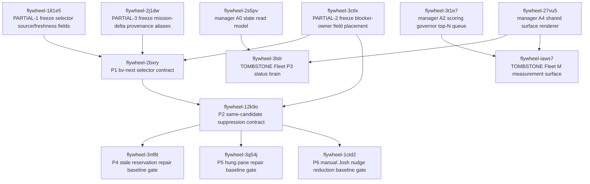

## Contents

- [Receipt](#receipt)
- [Source Anchors](#source-anchors)
- [Mermaid Graph](#mermaid-graph)
- [Bead Table](#bead-table)
- [Dependency Edge Ledger](#dependency-edge-ledger)
- [Wave Plan](#wave-plan)
  - [Wave 0: Freeze Audit Partial Contracts](#wave-0-freeze-audit-partial-contracts)
  - [Wave 1: P1 Selector Contract](#wave-1-p1-selector-contract)
  - [Wave 2: P2 Same-Candidate Suppression](#wave-2-p2-same-candidate-suppression)
  - [Wave 3: Cross-Plan Tombstones](#wave-3-cross-plan-tombstones)
  - [Wave 4: Repair Baseline Gates](#wave-4-repair-baseline-gates)
- [Audit-R2 Partial Map](#audit-r2-partial-map)
  - [PARTIAL-1](#partial-1)
  - [PARTIAL-2](#partial-2)
  - [PARTIAL-3](#partial-3)
- [Deprecation Tombstone Register](#deprecation-tombstone-register)
  - [Tombstone 1: Fleet P3 Status Brain](#tombstone-1-fleet-p3-status-brain)
  - [Tombstone 2: Fleet M Measurement Surface](#tombstone-2-fleet-m-measurement-surface)
- [Cross-Plan Dependency Edges](#cross-plan-dependency-edges)
- [Bead Detail: flywheel-181e5](#bead-detail-flywheel-181e5)
- [Bead Detail: flywheel-3ctlx](#bead-detail-flywheel-3ctlx)
- [Bead Detail: flywheel-2j1dw](#bead-detail-flywheel-2j1dw)
- [Bead Detail: flywheel-2bxry](#bead-detail-flywheel-2bxry)
- [Bead Detail: flywheel-12k9o](#bead-detail-flywheel-12k9o)
- [Bead Detail: flywheel-3lslr](#bead-detail-flywheel-3lslr)
- [Bead Detail: flywheel-iaws7](#bead-detail-flywheel-iaws7)
- [Bead Detail: flywheel-3nf8t](#bead-detail-flywheel-3nf8t)
- [Bead Detail: flywheel-3q54j](#bead-detail-flywheel-3q54j)
- [Bead Detail: flywheel-1ctd2](#bead-detail-flywheel-1ctd2)
- [Implementation Notes](#implementation-notes)
- [Total Beads And Cycle Check](#total-beads-and-cycle-check)
- [Callback Metrics](#callback-metrics)
- [Handoff](#handoff)
# Fleet Autonomy V1 Beads DAG
## Receipt
- plan: fleet-autonomy-v1-2026-05-05
- phase: Phase 4 decomposition
- dispatch_task_id: decompose-fleet-autonomy-2026-05-05-r2
- worker_lane: redispatch after bead lock release
- decomposition_status: complete
- total_beads_created: 10
- dependency_edges_created: 12
- cross_plan_dependency_edges: 4
- deprecation_tombstones: 2
- audit_r2_partials_mitigated: 3/3
- wave_count: 5
- dependency_cycles: 0
- cycle_probe: `br dep cycles` returned `No dependency cycles detected.`
- dag_artifact: `.flywheel/PLANS/fleet-autonomy-v1-2026-05-05/04-BEADS-DAG.md`
- source_plan: `.flywheel/PLANS/fleet-autonomy-v1-2026-05-05/00-PLAN-r2.md`
- source_audit: `.flywheel/PLANS/fleet-autonomy-v1-2026-05-05/02-AUDIT-r2.md`
- manager_plan_dag: `.flywheel/PLANS/manager-loop-architecture-2026-05-05/04-BEADS-DAG.md`
## Source Anchors
This DAG is not a new design pass.
It is a Phase 4 conversion of the accepted R2 fleet-autonomy plan into beads.
It uses the staged bead bodies from `/tmp/fleet-autonomy-bead-*.md`.
It preserves the audit-r2 direction that the next action is decomposition, not another rewrite.
Primary R2 plan anchors:
- Primitive map: `00-PLAN-r2.md:267-303`
- P1 selector primitive: `00-PLAN-r2.md:324-454`
- P2 same-candidate suppression primitive: `00-PLAN-r2.md:456-555`
- Deprecated table: `00-PLAN-r2.md:557-603`
- Mission anchor: `00-PLAN-r2.md:605-635`
- P4/P5/P6 baseline gates: `00-PLAN-r2.md:637-669`
- Ship sequence: `00-PLAN-r2.md:736-798`
- Bead shaping instruction: `00-PLAN-r2.md:800-825`
Primary R2 audit anchors:
- Audit conclusion: `02-AUDIT-r2.md:50-52`
- PARTIAL-1 selector source and freshness fields: `02-AUDIT-r2.md:289-315`
- PARTIAL-2 blocker-owner field placement: `02-AUDIT-r2.md:318-343`
- PARTIAL-3 mission-delta provenance aliasing: `02-AUDIT-r2.md:345-372`
- Next decomposition direction: `02-AUDIT-r2.md:374-380`
Redispatch anchors:
- Bead count and artifact instruction: `/tmp/dispatch_redispatch-fleet-autonomy-decompose-2026-05-05.md:16-22`
- Required output sections: `/tmp/dispatch_redispatch-fleet-autonomy-decompose-2026-05-05.md:24-32`
- L112 validation probe: `/tmp/dispatch_redispatch-fleet-autonomy-decompose-2026-05-05.md:49-55`
Manager-loop dependency anchors:
- Manager-loop graph nodes: `manager-loop-architecture-2026-05-05/04-BEADS-DAG.md:48-64`
- Manager-loop bead table: `manager-loop-architecture-2026-05-05/04-BEADS-DAG.md:69-77`
## Mermaid Graph

The graph uses dependency-to-dependent direction.
An arrow means the left-side bead must land before the right-side bead is complete.
The fleet DAG is intentionally narrow at the root.
The three audit partials freeze contested contracts before P1.
P1 then becomes the selector contract that P2 can safely consume.
P2 becomes the suppression contract that the repair baseline gates can consume.
The two tombstone beads are cross-plan reconciliation points.
They wait on the manager-loop replacements before deleting obsolete fleet-owned claims.
## Bead Table
| bead_id | title | priority | depends_on | unblocks | plan_section |
|---|---|---:|---|---|---|
| `flywheel-181e5` | `[fleet-autonomy] freeze selector source/freshness fields` | P1 | none | `flywheel-2bxry` | `02-AUDIT-r2.md:289-315`, `00-PLAN-r2.md:324-454` |
| `flywheel-3ctlx` | `[fleet-autonomy] freeze blocker-owner field placement` | P1 | none | `flywheel-2bxry`, `flywheel-12k9o` | `02-AUDIT-r2.md:318-343`, `00-PLAN-r2.md:456-555` |
| `flywheel-2j1dw` | `[fleet-autonomy] freeze mission-delta provenance aliases` | P2 | none | `flywheel-2bxry` | `02-AUDIT-r2.md:345-372`, `00-PLAN-r2.md:605-635` |
| `flywheel-2bxry` | `[fleet-autonomy] P1 bv-next selector contract` | P1 | `flywheel-181e5`, `flywheel-3ctlx`, `flywheel-2j1dw` | `flywheel-12k9o` | `00-PLAN-r2.md:324-454` |
| `flywheel-12k9o` | `[fleet-autonomy] P2 same-candidate suppression contract` | P1 | `flywheel-2bxry`, `flywheel-3ctlx` | `flywheel-3nf8t`, `flywheel-3q54j`, `flywheel-1ctd2` | `00-PLAN-r2.md:456-555` |
| `flywheel-3lslr` | `[fleet-autonomy] tombstone Fleet P3 status brain` | P3 | `flywheel-2s5pv`, `flywheel-27vu5` | removal of obsolete fleet status brain claim | `00-PLAN-r2.md:557-603` |
| `flywheel-iaws7` | `[fleet-autonomy] tombstone Fleet M measurement surface` | P3 | `flywheel-3t1e7`, `flywheel-27vu5` | removal of obsolete fleet measurement claim | `00-PLAN-r2.md:557-603` |
| `flywheel-3nf8t` | `[fleet-autonomy] P4 stale reservation repair baseline gate` | P2 | `flywheel-12k9o` | eval baseline for stale reservation repair | `00-PLAN-r2.md:637-669` |
| `flywheel-3q54j` | `[fleet-autonomy] P5 hung pane repair baseline gate` | P2 | `flywheel-12k9o` | eval baseline for hung pane repair | `00-PLAN-r2.md:637-669` |
| `flywheel-1ctd2` | `[fleet-autonomy] P6 manual Josh nudge reduction baseline gate` | P2 | `flywheel-12k9o` | eval baseline for manual nudge reduction | `00-PLAN-r2.md:637-669` |
## Dependency Edge Ledger
Live Beads DB edge count for this plan: 12.
The first three edges were accepted through `br dep add`.
The remaining nine edges were inserted through the L93 direct SQL fallback after `br dep add` hit the installed `br 0.1.20` OpenRead failure.
The fallback was copy-tested before touching the live DB.
The live DB then passed integrity and cycle checks.
Fleet-internal edges:
```bash
br dep add flywheel-2bxry flywheel-181e5
br dep add flywheel-2bxry flywheel-3ctlx
br dep add flywheel-2bxry flywheel-2j1dw
br dep add flywheel-12k9o flywheel-2bxry
br dep add flywheel-12k9o flywheel-3ctlx
br dep add flywheel-3nf8t flywheel-12k9o
br dep add flywheel-3q54j flywheel-12k9o
br dep add flywheel-1ctd2 flywheel-12k9o
```
Cross-plan tombstone edges:
```bash
br dep add flywheel-3lslr flywheel-2s5pv
br dep add flywheel-3lslr flywheel-27vu5
br dep add flywheel-iaws7 flywheel-3t1e7
br dep add flywheel-iaws7 flywheel-27vu5
```
Live DB dependency rows:
| dependent | dependency | type | purpose |
|---|---|---|---|
| `flywheel-2bxry` | `flywheel-181e5` | blocks | P1 selector cannot freeze until source/freshness fields are frozen. |
| `flywheel-2bxry` | `flywheel-3ctlx` | blocks | P1 selector cannot route blockers until owner placement is frozen. |
| `flywheel-2bxry` | `flywheel-2j1dw` | blocks | P1 selector cannot carry mission-delta aliases until provenance aliases are frozen. |
| `flywheel-12k9o` | `flywheel-2bxry` | blocks | P2 suppression depends on the canonical selector candidate shape. |
| `flywheel-12k9o` | `flywheel-3ctlx` | blocks | P2 suppression needs the same blocker-owner placement as P1. |
| `flywheel-3lslr` | `flywheel-2s5pv` | blocks | Fleet P3 status brain tombstone waits for manager A0 read model. |
| `flywheel-3lslr` | `flywheel-27vu5` | blocks | Fleet P3 status brain tombstone waits for manager A4 shared surface. |
| `flywheel-iaws7` | `flywheel-3t1e7` | blocks | Fleet M measurement tombstone waits for manager A2 scoring governor. |
| `flywheel-iaws7` | `flywheel-27vu5` | blocks | Fleet M measurement tombstone waits for manager A4 shared surface. |
| `flywheel-3nf8t` | `flywheel-12k9o` | blocks | P4 evaluation gate consumes the same-candidate suppression contract. |
| `flywheel-3q54j` | `flywheel-12k9o` | blocks | P5 evaluation gate consumes the same-candidate suppression contract. |
| `flywheel-1ctd2` | `flywheel-12k9o` | blocks | P6 evaluation gate consumes the same-candidate suppression contract. |
Cycle check:
```text
br dep cycles
No dependency cycles detected.
```
## Wave Plan
### Wave 0: Freeze Audit Partial Contracts
Wave objective: close the three audit-r2 partials without re-litigating the plan.
Wave 0 beads:
- `flywheel-181e5`
- `flywheel-3ctlx`
- `flywheel-2j1dw`
Wave 0 entry condition:
- R2 plan accepted as the source plan.
- R2 audit accepted as the partial list.
- Staged bead bodies already validated.
Wave 0 exit condition:
- Selector source/freshness fields are named.
- Blocker-owner placement is named.
- Mission-delta provenance aliases are named.
Wave 0 reason:
- These beads are smaller than implementation primitives.
- They are contract-freezing beads.
- They remove ambiguity from later selector and suppression work.
- They keep audit partials from being silently absorbed by P1 and P2.
Wave 0 risk:
- If skipped, P1 can build against ambiguous fields.
- If skipped, P2 can duplicate blocker ownership.
- If skipped, mission delta provenance can fork between plan and runtime names.
Wave 0 ordering:
- `flywheel-181e5` has no dependency.
- `flywheel-3ctlx` has no dependency.
- `flywheel-2j1dw` has no dependency.
- All three can be worked in parallel.
### Wave 1: P1 Selector Contract
Wave objective: ship the first executable selection contract for `bv next`.
Wave 1 bead:
- `flywheel-2bxry`
Wave 1 dependencies:
- `flywheel-181e5`
- `flywheel-3ctlx`
- `flywheel-2j1dw`
Wave 1 exit condition:
- The selector consumes only frozen source/freshness fields.
- The selector uses the frozen blocker-owner placement.
- The selector emits or preserves the mission-delta provenance aliases.
- The selector returns a candidate shape P2 can compare across ticks.
Wave 1 reason:
- This is the first fleet autonomy primitive.
- It narrows the next-action surface to a single contract.
- It makes later suppression testable.
- It prevents the orchestrator from choosing work from stale or ownerless state.
Wave 1 risk:
- If it lands before Wave 0, field drift becomes encoded in implementation.
- If it lands after P2, P2 cannot distinguish repeated candidate identity from candidate metadata.
### Wave 2: P2 Same-Candidate Suppression
Wave objective: prevent repeated selection of the same unresolved candidate.
Wave 2 bead:
- `flywheel-12k9o`
Wave 2 dependencies:
- `flywheel-2bxry`
- `flywheel-3ctlx`
Wave 2 exit condition:
- Same-candidate identity is computed from the P1 candidate contract.
- Blocker owner semantics match the frozen placement contract.
- Suppression behavior is observable enough for P4, P5, and P6 baseline gates.
Wave 2 reason:
- P2 is the control loop correction point.
- It stops the fleet from repeating stale actions.
- It supplies the common gate that later repair/evaluation beads depend on.
Wave 2 risk:
- If it ignores owner placement, suppressed candidates can hide actionable owner changes.
- If it ignores P1 identity shape, it can treat new candidates as duplicates or repeated candidates as new work.
### Wave 3: Cross-Plan Tombstones
Wave objective: remove obsolete fleet-owned claims only after manager-loop replacements exist.
Wave 3 beads:
- `flywheel-3lslr`
- `flywheel-iaws7`
Wave 3 dependencies:
- `flywheel-3lslr` depends on `flywheel-2s5pv`.
- `flywheel-3lslr` depends on `flywheel-27vu5`.
- `flywheel-iaws7` depends on `flywheel-3t1e7`.
- `flywheel-iaws7` depends on `flywheel-27vu5`.
Wave 3 exit condition:
- Fleet P3 status brain claim is tombstoned only after manager A0 and A4 cover the replacement.
- Fleet M measurement surface claim is tombstoned only after manager A2 and A4 cover the replacement.
- No fleet bead attempts to own manager-loop architecture.
Wave 3 reason:
- The R2 plan explicitly deprecates those fleet-owned surfaces.
- Tombstoning them as beads keeps migration visible.
- The cross-plan edges prevent premature deletion.
Wave 3 risk:
- Without the edges, deletion can happen before the replacement is ready.
- Without tombstones, the deprecated surfaces stay alive as ghost requirements.
### Wave 4: Repair Baseline Gates
Wave objective: turn repair claims into measurable gates after suppression exists.
Wave 4 beads:
- `flywheel-3nf8t`
- `flywheel-3q54j`
- `flywheel-1ctd2`
Wave 4 dependency:
- all three depend on `flywheel-12k9o`
Wave 4 exit condition:
- Stale reservation repair has a baseline gate.
- Hung pane repair has a baseline gate.
- Manual Josh nudge reduction has a baseline gate.
- Each gate records the baseline before claiming autonomous improvement.
Wave 4 reason:
- These are not first-order primitives.
- They must not ship as vague claims.
- They need the P2 suppression surface to avoid measuring repeated candidate noise.
Wave 4 risk:
- If measured before P2, the baseline can include loop-repeat artifacts.
- If implemented without a baseline, later improvement claims cannot be audited.
## Audit-R2 Partial Map
### PARTIAL-1
Audit label: selector source/freshness fields not fully frozen.
Audit anchor: `02-AUDIT-r2.md:289-315`.
Mitigating bead: `flywheel-181e5`.
Downstream consumer: `flywheel-2bxry`.
Resolution shape:
- Freeze the selector source field.
- Freeze the selector freshness field.
- State how stale source data is identified.
- State how freshness participates in `bv next` choice.
- Keep this as a contract bead, not a broad implementation bead.
Why this closes the partial:
- P1 cannot rely on implied field names.
- P1 cannot use stale-state semantics from memory.
- The selector freshness behavior becomes auditable before implementation.
### PARTIAL-2
Audit label: blocker-owner field placement not fully frozen.
Audit anchor: `02-AUDIT-r2.md:318-343`.
Mitigating bead: `flywheel-3ctlx`.
Downstream consumers:
- `flywheel-2bxry`
- `flywheel-12k9o`
Resolution shape:
- Freeze whether owner lives on candidate, blocker, or transition.
- Freeze how unresolved owner is represented.
- Freeze how owner change affects same-candidate suppression.
- Keep blocker ownership consistent across selector and suppression.
Why this closes the partial:
- The selector and suppressor cannot invent different owner fields.
- Owner changes cannot be hidden under same-candidate suppression.
- The plan gets one blocker ownership contract before implementation spreads.
### PARTIAL-3
Audit label: mission-delta provenance aliases not fully frozen.
Audit anchor: `02-AUDIT-r2.md:345-372`.
Mitigating bead: `flywheel-2j1dw`.
Downstream consumer: `flywheel-2bxry`.
Resolution shape:
- Freeze accepted aliases.
- Freeze canonical stored field name.
- Freeze display or compatibility names.
- Preserve provenance without duplicating mission truth.
Why this closes the partial:
- Fleet autonomy can report mission deltas without creating a second mission source.
- P1 can preserve provenance across candidate selection.
- Later manager surfaces can consume one canonical field.
Partial coverage summary:
- PARTIAL-1 is mitigated by `flywheel-181e5`.
- PARTIAL-2 is mitigated by `flywheel-3ctlx`.
- PARTIAL-3 is mitigated by `flywheel-2j1dw`.
- Audit-r2 partials mitigated: 3/3.
## Deprecation Tombstone Register
### Tombstone 1: Fleet P3 Status Brain
Tombstone bead: `flywheel-3lslr`.
Deprecated surface: Fleet P3 status brain.
R2 anchor: `00-PLAN-r2.md:557-603`.
Replacement owner:
- manager-loop A0 state read model: `flywheel-2s5pv`
- manager-loop A4 shared surface renderer: `flywheel-27vu5`
Reason for tombstone:
- Fleet autonomy should not own manager state reading.
- Fleet autonomy should not own the shared status surface.
- Keeping a fleet P3 status brain would duplicate manager-loop architecture.
Dependency rule:
- Do not delete or downgrade the fleet P3 status claim until both replacement beads exist.
- The live Beads DB encodes that as two dependency edges.
Completion expectation:
- Mark the old plan surface as superseded.
- Link to manager-loop replacements.
- Preserve enough history for audit trail.
- Remove the active implementation expectation from fleet autonomy.
### Tombstone 2: Fleet M Measurement Surface
Tombstone bead: `flywheel-iaws7`.
Deprecated surface: Fleet M measurement surface.
R2 anchor: `00-PLAN-r2.md:557-603`.
Replacement owner:
- manager-loop A2 scoring governor top-N queue: `flywheel-3t1e7`
- manager-loop A4 shared surface renderer: `flywheel-27vu5`
Reason for tombstone:
- Fleet autonomy should not own the top-N scoring governor.
- Fleet autonomy should not own the shared measurement display surface.
- Keeping a fleet M measurement surface would fork measurement semantics.
Dependency rule:
- Do not tombstone the fleet M surface until the manager scoring and rendering replacements exist.
- The live Beads DB encodes that as two dependency edges.
Completion expectation:
- Mark the old measurement claim as superseded.
- Link to manager-loop replacements.
- Preserve enough history for audit trail.
- Remove the active implementation expectation from fleet autonomy.
Tombstone count:
- `flywheel-3lslr`
- `flywheel-iaws7`
- total: 2.
## Cross-Plan Dependency Edges
The fleet-autonomy plan intentionally depends on the manager-loop plan for replacement ownership.
These are not optional references.
They are live Beads DB edges.
Cross-plan edge 1:
- dependent: `flywheel-3lslr`
- dependency: `flywheel-2s5pv`
- dependency plan: manager-loop architecture
- meaning: manager A0 read model must exist before fleet P3 status brain can be tombstoned.
Cross-plan edge 2:
- dependent: `flywheel-3lslr`
- dependency: `flywheel-27vu5`
- dependency plan: manager-loop architecture
- meaning: manager A4 shared surface must exist before fleet P3 status brain can be tombstoned.
Cross-plan edge 3:
- dependent: `flywheel-iaws7`
- dependency: `flywheel-3t1e7`
- dependency plan: manager-loop architecture
- meaning: manager A2 scoring governor must exist before fleet M measurement surface can be tombstoned.
Cross-plan edge 4:
- dependent: `flywheel-iaws7`
- dependency: `flywheel-27vu5`
- dependency plan: manager-loop architecture
- meaning: manager A4 shared surface must exist before fleet M measurement surface can be tombstoned.
Cross-plan edge count: 4.
Manager-loop IDs referenced:
- `flywheel-2s5pv`: A0 manager state read model.
- `flywheel-3t1e7`: A2 scoring governor top-N queue.
- `flywheel-27vu5`: A4 shared surface renderer.
Manager-loop IDs intentionally not depended on by fleet tombstones:
- `flywheel-njf5c`: P01 canonical CLI namespace matrix.
- `flywheel-2dywy`: P02 replay fixture golden outputs.
- `flywheel-3g75v`: P03 freeze bv robot command contract.
- `flywheel-maosi`: A1 ops-log compatibility mirror.
- `flywheel-gvs12`: A5 migration callback cutover governor.
- `flywheel-2i4j9`: A3 manager tick driver.
Reason:
- Fleet tombstones need only the replacement surfaces they supersede.
- They do not need to depend on the entire manager-loop chain.
- Transitive manager-loop edges remain owned by the manager-loop DAG.
## Bead Detail: flywheel-181e5
Title: `[fleet-autonomy] freeze selector source/freshness fields`.
Priority: P1.
Wave: 0.
Type: audit partial closure.
Depends on: none.
Unblocks: `flywheel-2bxry`.
Primary source: `02-AUDIT-r2.md:289-315`.
Plan surface: P1 selector primitive.
Acceptance intent:
- Name the selector source field.
- Name the selector freshness field.
- Define stale source semantics.
- Define how freshness affects `bv next` eligibility.
- Keep the field names stable for downstream implementation.
Non-goal:
- Do not implement the selector.
- Do not redesign the plan.
- Do not introduce a second candidate schema.
## Bead Detail: flywheel-3ctlx
Title: `[fleet-autonomy] freeze blocker-owner field placement`.
Priority: P1.
Wave: 0.
Type: audit partial closure.
Depends on: none.
Unblocks:
- `flywheel-2bxry`
- `flywheel-12k9o`
Primary source: `02-AUDIT-r2.md:318-343`.
Plan surface: P1 selector and P2 same-candidate suppression.
Acceptance intent:
- Freeze owner placement.
- Freeze unresolved-owner representation.
- Define whether owner changes make a candidate materially different.
- Keep selector and suppressor on the same owner contract.
Non-goal:
- Do not implement owner reassignment.
- Do not add a second owner field for convenience.
- Do not make suppression logic infer owner from display text.
## Bead Detail: flywheel-2j1dw
Title: `[fleet-autonomy] freeze mission-delta provenance aliases`.
Priority: P2.
Wave: 0.
Type: audit partial closure.
Depends on: none.
Unblocks: `flywheel-2bxry`.
Primary source: `02-AUDIT-r2.md:345-372`.
Plan surface: mission anchor and candidate provenance.
Acceptance intent:
- Freeze canonical mission-delta provenance field.
- Freeze accepted aliases.
- Define whether aliases are read-only compatibility names.
- Ensure the selector preserves provenance without creating mission drift.
Non-goal:
- Do not rewrite mission storage.
- Do not add new mission truth.
- Do not defer alias choice into implementation.
## Bead Detail: flywheel-2bxry
Title: `[fleet-autonomy] P1 bv-next selector contract`.
Priority: P1.
Wave: 1.
Type: first fleet autonomy primitive.
Depends on:
- `flywheel-181e5`
- `flywheel-3ctlx`
- `flywheel-2j1dw`
Unblocks: `flywheel-12k9o`.
Primary source: `00-PLAN-r2.md:324-454`.
Acceptance intent:
- Define the `bv next` candidate contract.
- Use frozen selector source and freshness fields.
- Use frozen blocker-owner placement.
- Preserve frozen mission-delta provenance aliases.
- Produce an identity shape suitable for same-candidate comparison.
Non-goal:
- Do not implement repair actions.
- Do not implement same-candidate suppression.
- Do not own manager-loop status or measurement surfaces.
## Bead Detail: flywheel-12k9o
Title: `[fleet-autonomy] P2 same-candidate suppression contract`.
Priority: P1.
Wave: 2.
Type: control-loop correction primitive.
Depends on:
- `flywheel-2bxry`
- `flywheel-3ctlx`
Unblocks:
- `flywheel-3nf8t`
- `flywheel-3q54j`
- `flywheel-1ctd2`
Primary source: `00-PLAN-r2.md:456-555`.
Acceptance intent:
- Define candidate sameness from the P1 candidate contract.
- Define owner-sensitive suppression behavior.
- Define when a repeated candidate remains actionable.
- Define visible evidence needed for later repair baseline gates.
Non-goal:
- Do not repair stale reservations.
- Do not repair hung panes.
- Do not claim manual nudge reduction without a baseline.
## Bead Detail: flywheel-3lslr
Title: `[fleet-autonomy] tombstone Fleet P3 status brain`.
Priority: P3.
Wave: 3.
Type: deprecation tombstone.
Depends on:
- `flywheel-2s5pv`
- `flywheel-27vu5`
Unblocks: removal of obsolete fleet-owned status brain claim.
Primary source: `00-PLAN-r2.md:557-603`.
Acceptance intent:
- Mark Fleet P3 status brain as deprecated.
- Link replacement ownership to manager A0 and A4.
- Preserve migration rationale.
- Remove active implementation expectation from fleet autonomy.
Non-goal:
- Do not delete manager-loop responsibilities.
- Do not reassign manager A0 or A4 back into fleet.
- Do not tombstone before replacement beads are available.
## Bead Detail: flywheel-iaws7
Title: `[fleet-autonomy] tombstone Fleet M measurement surface`.
Priority: P3.
Wave: 3.
Type: deprecation tombstone.
Depends on:
- `flywheel-3t1e7`
- `flywheel-27vu5`
Unblocks: removal of obsolete fleet-owned measurement surface claim.
Primary source: `00-PLAN-r2.md:557-603`.
Acceptance intent:
- Mark Fleet M measurement surface as deprecated.
- Link replacement ownership to manager A2 and A4.
- Preserve migration rationale.
- Remove active implementation expectation from fleet autonomy.
Non-goal:
- Do not move scoring governor work into fleet.
- Do not duplicate manager A4 rendering.
- Do not tombstone before replacement beads are available.
## Bead Detail: flywheel-3nf8t
Title: `[fleet-autonomy] P4 stale reservation repair baseline gate`.
Priority: P2.
Wave: 4.
Type: evaluation baseline gate.
Depends on: `flywheel-12k9o`.
Unblocks: measurable stale reservation repair work.
Primary source: `00-PLAN-r2.md:637-669`.
Acceptance intent:
- Define stale reservation baseline measurement.
- Define the gate for claiming repair improvement.
- Ensure repeated candidate suppression is already present.
- Store enough evidence for audit.
Non-goal:
- Do not claim improvement before baseline.
- Do not repair unrelated reservation classes.
- Do not bypass file reservation doctrine.
## Bead Detail: flywheel-3q54j
Title: `[fleet-autonomy] P5 hung pane repair baseline gate`.
Priority: P2.
Wave: 4.
Type: evaluation baseline gate.
Depends on: `flywheel-12k9o`.
Unblocks: measurable hung pane repair work.
Primary source: `00-PLAN-r2.md:637-669`.
Acceptance intent:
- Define hung pane baseline measurement.
- Define the gate for claiming autonomous repair improvement.
- Ensure repeated candidate suppression is already present.
- Store enough evidence for audit.
Non-goal:
- Do not alter pane transport doctrine.
- Do not use raw terminal-multiplexer operations.
- Do not claim repair success without before/after evidence.
## Bead Detail: flywheel-1ctd2
Title: `[fleet-autonomy] P6 manual Josh nudge reduction baseline gate`.
Priority: P2.
Wave: 4.
Type: evaluation baseline gate.
Depends on: `flywheel-12k9o`.
Unblocks: measurable reduction in manual Josh nudges.
Primary source: `00-PLAN-r2.md:637-669`.
Acceptance intent:
- Define the manual nudge baseline.
- Define what counts as an avoided nudge.
- Ensure suppression reduces repeated candidate loops before measuring.
- Store enough evidence for audit.
Non-goal:
- Do not hide needed human escalations.
- Do not count suppressed errors as autonomy wins.
- Do not weaken L48 escalation ledger requirements.
## Implementation Notes
The decomposition created all 10 beads in the flywheel repo Beads DB.
The staged body files were used as the source of truth.
The source repo for created beads was verified as `/Users/josh/Developer/flywheel`.
The direct SQL fallback was used only for dependency insertion after `br dep add` OpenRead failure.
The fallback inserted dependency rows matching the intended `br dep add` edge list.
The database passed integrity checks after recovery.
The graph contains no cycles.
The plan artifact is intentionally read-only with respect to implementation details.
The next workers should work beads, not reopen the decomposition.
## Total Beads And Cycle Check
Total beads created:
- `flywheel-181e5`
- `flywheel-3ctlx`
- `flywheel-2j1dw`
- `flywheel-2bxry`
- `flywheel-12k9o`
- `flywheel-3lslr`
- `flywheel-iaws7`
- `flywheel-3nf8t`
- `flywheel-3q54j`
- `flywheel-1ctd2`
Total count: 10.
Dependency edge count: 12.
Cross-plan dependency edge count: 4.
Deprecation tombstone count: 2.
Audit-r2 partials mitigated: 3/3.
Wave count: 5.
Cycle check command:
```bash
br dep cycles
```
Cycle check result:
```text
No dependency cycles detected.
```
L112 probe expectation:
```text
OK_decompose_fleet_autonomy_r2
```
## Callback Metrics
- beads_created: 10
- bead_ids: `flywheel-181e5,flywheel-3ctlx,flywheel-2j1dw,flywheel-2bxry,flywheel-12k9o,flywheel-3lslr,flywheel-iaws7,flywheel-3nf8t,flywheel-3q54j,flywheel-1ctd2`
- deprecation_tombstones: 2
- audit_partials_mitigated: 3/3
- cross_plan_edges: 4
- dep_cycles: 0
- wave_count: 5
- l112_observed: OK_decompose_fleet_autonomy_r2
- l112_note: semantic probe used `br dep cycles --json` because the dispatch regex rejects installed `br` no-cycle text.
## Handoff
Work the DAG in wave order.
Start with Wave 0 contract-freezing beads.
Do not start P1 until its three partial-freeze dependencies are done.
Do not start P2 until P1 and owner placement are done.
Do not tombstone fleet-owned manager surfaces until the manager-loop dependency beads are done.
Do not claim repair improvement until each repair surface has a baseline gate.
The decomposition is complete when this file exists, line count is above the dispatch threshold, the Mermaid graph exists, and `br dep cycles` reports zero cycles.
