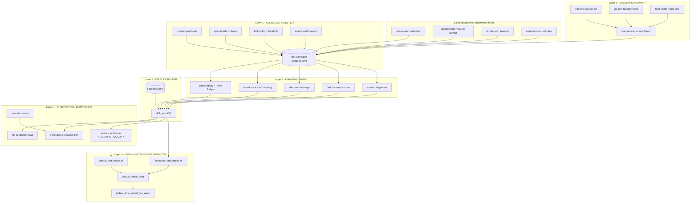
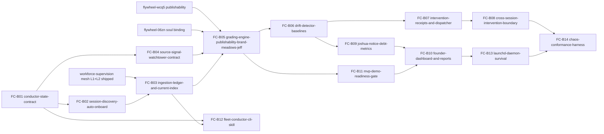

# Phase 1 Lane C - Implementation Design

Plan: `fleet-conductor-2026-05-04`
Lane: C, implementation design
Task: `/tmp/dispatch_fleet-conductor-lane-c-implementation-design.md`
Generated: 2026-05-04T04:23Z

## Research Ledger

Skills/library:

- Slash lookup attempted: `/flywheel:skills-best-practices "fleet conductor observability dashboard auto-onboarding intervention" --top=10 --include-content`; unavailable in this Codex shell (`no such file or directory`), so MCP skill-search was used.
- Skill-search matches evaluated: `dashboard-generation`, `observability-platform`, `observability-designer`, `data-quality-validation`, `customer-onboarding`, plus lower-fit domain skills. Adopt `observability-platform` / `observability-designer` for SLO/dashboard semantics, `data-quality-validation` for schema/freshness contracts, and `dashboard-generation` only for report layout; avoid telecom/customer-domain skills except as distant analogies.
- Required skills read: `canonical-cli-scoping`, `canonical-owner-runtime-state`, `donella-meadows-systems-thinking`, `skill-builder`.

Socraticode:

- Query 1: `fleet conductor supervisor workforce mesh session discovery topology drift detector dashboard intervention dispatcher notice debt`; 10 chunks observed.
- Query 2: `publishability bar three judges brand voice zeststream soul binding readiness gate dashboard report`; 10 chunks observed.
- Query 3: `session topology ntm health auto onboarding fleet onboard conductor launchd daemon survival override receipt`; 10 chunks observed.

Primary local sources:

- `00-INTENT.md`: founder-substrate framing, continuous source ingestion, Joshua intervention modes, high bar.
- `01-RESEARCH-INTENT-AMENDMENT.md`: v2/v3 escalation; Lane C must absorb autonomy and landscape-ingestion pillars.
- Parent `orchestrator-workforce-supervision-2026-05-04/00-PLAN.md`: supervision mesh layers and P0 cross-session callback closure requirements.
- Parent `03-AUDIT-r1-lens1.md`: 4 P0 and 5 P1 findings; especially remote orch proof, callback orphan cross-check, override receipt, and self-watchdog.
- `feedback_publishability_bar_three_judges.md`: 7-facet publishability bar and Three Judges target.

Lane A note: `01-RESEARCH-A.md` was not present when Lane C ran. This design stays implementation-shaped and leaves problem-space amendments to Phase 2 REFINE.

## 1. Canonical Architecture

Fleet-conductor is the founder-tier layer above the workforce-supervision mesh. It does not replace per-session supervision. It consumes supervision mesh signals per session, grades them against the larger ZestStream lens, detects drift, and chooses bounded intervention.



Layer contracts:

| layer | owns | composes with | explicitly does not replace |
|---|---|---|---|
| L0 Session discovery | fleet session inventory, topology freshness, new-session first tick | `ntm health/list`, `session-topology.jsonl`, `flywheel-onboard.sh`, workforce mesh reachability | ntm, repo-local loop drivers, Agent Mail identity registry |
| L1 Accretive ingestion | append-only conductor samples across sessions and outside sources | workforce mesh Layer 1+2, daily report, Jeff corpus, Codex watchtower, future arxiv/Anthropic watchtowers | per-session collectors, source-specific watchtower ownership |
| L2 Grading engine | session x dimension grade rows | publishability bar `flywheel-wcq5`, zeststream soul binding `flywheel-06zn`, Donella skill, Jeff corpus, mission docs | human taste, repo test suites, per-session doctor |
| L3 Drift detector | baseline deltas and `drift_event/v1` | workforce mesh source conflict states, `three-q-surface-audit.py`, `value-gap-probe.sh` | callback validation, source-watchtower diffing |
| L4 Intervention dispatcher | idempotent conductor-level action decision | `ntm send`, Beads, Agent Mail, `/flywheel:supervisor` remote orch proof, override receipts | remote orchestrator authority, Joshua approval, public publishing |
| L5 Notice-debt minimizer | notice timing, time saved, and founder leverage reporting | `josh-requests.jsonl`, conductor drift events, reports | Joshua's judgment; this measures when the system should have noticed and whether it returned time to him |

Continuous landscape ingestion is a core pillar, not a later plugin. Source signals are normalized as `source_signal/v1` rows with source, cadence, freshness, diff summary, relevance score, adoption verdict, and qualification trigger.

Founder-substrate failure classes:

| class | trigger | conductor action |
|---|---|---|
| `stale-landscape-probe` | Donella, Jeff, arxiv, Anthropic, Codex/OpenAI, or powerhouse source freshness exceeds cadence SLA | mark landscape grade unknown, file/source-update bead, block "latest best practice" claims |
| `unqualified-new-source-pending-too-long` | source qualification capsule waits beyond SLA without Joshua FLAG decision or explicit no-source reason | surface FLAG item in founder dashboard; do not silently ingest |
| `mvp-surfaced-without-bar-pass` | QUALITY request or MVP/demo reaches Joshua before Three Judges 7/7 and brand voice >=95, unless explicitly marked early-steer | block readiness label, file quality-gap bead, compute time-cost risk |
| `joshua-time-NOT-saved-event` | Joshua manually notices, diagnoses, or restates work the conductor should have caught | negative notice-debt row; report `joshua_time_lost_minutes` and root missing signal |

## 2. `/flywheel:fleet-conductor` CLI Contract

Backer: `~/.claude/skills/.flywheel/bin/flywheel-conductor` plus slash wrapper `/Users/josh/.claude/commands/flywheel/fleet-conductor.md`.

Default output is a founder dashboard around 500 tokens: sessions, drift events, Joshua decisions needed, quality-ready demos, source qualifications, and notice-debt trend. It should read like "what needs Joshua's founder leverage?" rather than a Kubernetes status page.

Required subcommands:

| command | purpose | compose/replace stance |
|---|---|---|
| default | compact fleet-wide dashboard, session x dimension summary | consumes conductor current state; does not run expensive collectors unless stale |
| `--watch` | daemon/watch mode | composes with launchd and workforce mesh; does not replace per-session watchers until proven by conformance |
| `--diagnose <session>` | deep probe a single session | calls workforce mesh and repo doctor; does not mutate |
| `--grade <session>` | explicit grading cycle | reads latest session state and graders; writes grade receipt only with `--apply` |
| `--explain-drift <event-id>` | why drift surfaced | provenance trace over samples, baseline, thresholds, grader outputs |
| `--intervene <drift-event-id> --action <type>` | manual override action | requires idempotency key and override receipt for risky/cross-session actions |
| `--silence <session> --duration <N>m` | display mute | display-only unless paired with explicit deferral receipt; doctor still counts debt |
| `--joshua-notice-debt --since <iso>` | historical inverted-debt report | reads conductor and Joshua request logs |
| `--onboard <session>` | trigger onboarding probe | writes onboarding sample; does not assume healthy if probe fails |
| `--abort` | graceful daemon shutdown | writes shutdown receipt and leaves launchd state inspectable |

Canonical CLI scoping requirements:

| surface | required behavior |
|---|---|
| `doctor [--fix] [--scope discovery|ingestion|grading|drift|intervention|reporting]` | subsystem diagnostics, self-watchdog freshness, collector timeout stats |
| `health [--watch -i N] [--json]` | lightweight current state |
| `repair --scope <scope> --dry-run|--apply` | idempotent known repairs only |
| `validate fixture|schema|state|drift|intervention` | pure-read validation |
| `audit` | recent mutations and override receipts |
| `why <id>` | provenance for session, grade, drift event, intervention, report claim |
| `schema <kind>` | emit JSON schemas |
| `--info`, `--examples`, `quickstart`, `help <topic>`, `completion <shell>` | mandatory operator self-documentation |

Universal flags: `--json`, `--no-color`, `--no-emoji`, `--width <n>`, `--dry-run`, `--apply`, `--explain`, `--idempotency-key`.

State paths:

| path | purpose |
|---|---|
| `~/.local/state/flywheel/conductor/samples.jsonl` | append-only raw conductor samples |
| `~/.local/state/flywheel/conductor/grades.jsonl` | versioned grader outputs |
| `~/.local/state/flywheel/conductor/drift-events.jsonl` | `drift_event/v1` rows |
| `~/.local/state/flywheel/conductor/interventions.jsonl` | intervention plans/applies/deferrals |
| `~/.local/state/flywheel/conductor/source-signals.jsonl` | continuous landscape/source signals |
| `~/.local/state/flywheel/conductor/joshua-notice-debt.jsonl` | notice debt, inverted debt, time saved, and time-not-saved events |
| `~/.local/state/flywheel/conductor/current.sqlite3` | rebuildable current state index |
| `~/.local/state/flywheel/conductor/reports/` | daily/weekly/milestone founder reports |

Minimum schemas:

- `session_observation/v1`
- `source_signal/v1`
- `grade_receipt/v1`
- `drift_event/v1`
- `intervention_receipt/v1`
- `joshua_notice_debt/v1`
- `joshua_time_saved/v1`
- `founder_report/v1`
- `source_qualification_capsule/v1`
- `demo_readiness_receipt/v1`

## 3. SKILL.md Draft

Target: `~/.claude/skills/.flywheel/fleet-conductor/SKILL.md`
Status: draft only; do not write until Phase 4/5.

Frontmatter draft:

```yaml
---
name: fleet-conductor
description: "Use for 'fleet conductor', 'founder dashboard', 'cross-session drift', 'Joshua notice debt', 'session onboarding', 'multi-session grading', 'MVP readiness', 'source qualification', 'autonomous founder substrate', 'fleet intervention', 'Three Judges dashboard', 'landscape ingestion'."
allowed-tools: Bash, Read, Grep, Glob
---
```

Sections:

1. Purpose: autonomous founder substrate, not just observability.
2. Exact prompt: run `/flywheel:fleet-conductor doctor --json`, inspect dashboard, diagnose drift, then intervene only with receipt.
3. Decision tree:
   - New session appeared -> `--onboard`.
   - Drift event exists -> `--explain-drift`.
   - Cross-session action -> verify workforce mesh remote orch proof first.
   - Joshua input needed -> classify as FLAG, INPUT, or QUALITY.
   - Public/demo artifact -> require Three Judges 7/7 and brand voice >=95.
4. CLI reference: mandatory canonical-cli-scoping commands.
5. Grading model: publishability, brand voice, Meadows, Jeff doctrine, mission alignment.
6. Source ingestion: Donella, Jeff, arxiv, Anthropic, OpenAI/DeepMind/xAI/Mistral, Tesla/SpaceX/Stripe/Vercel/primary founder writing.
7. Intervention safety: dry-run default, idempotency, override receipts, no public publishing without bar pass, no security/identity compromise.
8. Anti-pattern table:
   - Dashboard-only conductor.
   - Replacing workforce mesh collectors.
   - Surfacing Joshua asks without source exhaustion.
   - Treating "no drift" as proof when samples are stale.
   - Grading brand voice with prose instead of receipts/fixtures.
9. Scripts:
   - `scripts/validate-fleet-conductor-skill.sh`
   - `scripts/fixture-conformance.sh`
10. Self-test:
   - Validate trigger density.
   - Run fixture conformance for 4 traumas.
   - Verify docs mention FLAG/INPUT/QUALITY and notice debt.

Skill-builder gates:

- Keep description under 500 chars with >=10 trigger phrases.
- Include executable self-test; no docs-only skill.
- Keep `SKILL.md` under 500 lines; push detailed schemas to `references/`.
- Do not edit JSM-owned skills directly; this is a `.flywheel` skill surface.

## 4. Phase Decomposition

| phase | priority | dependencies | output | acceptance gate | rollback |
|---|---|---|---|---|---|
| Phase 1 Layer 0 Session Discovery | P0 | none; uses existing topology and `ntm` | conductor schema, session discovery probe, auto-onboarding receipts | detects current sessions and synthetic new session; missing probes become typed degraded states | disable conductor watch; leave samples read-only |
| Phase 2 Layer 1 Accretive Ingestion | P0 | workforce-supervision mesh Layer 1+2 shipped; parent P0 F1/F2/F4/F5/F9 addressed | append-only ingestion of mission, goals, beads, fuckups, handoffs, source signals | replay from JSONL rebuilds current state; collector timeouts typed | stop ingestion, preserve JSONL, rebuild from last good sample |
| Phase 3 Layer 2 Grading Engine | P0 | `flywheel-wcq5` publishability bar, `flywheel-06zn` soul binding, Donella/Jeff source surfaces | grade receipts per session x dimension | synthetic states grade deterministically; no grade if source stale | freeze baselines; mark grades stale, not pass |
| Phase 4 Layers 3+4 Drift + Intervention | P1 | Phases 1-3, workforce cross-session callback closure gate | drift events, intervention decision engine, override receipts | drift fixture yields action; cross-session action refuses without remote orch proof | set dispatcher to dry-run only; silence actions via receipt |
| Phase 5 Layer 5 Notice Debt + Dashboard | P1 | drift events and reports | dashboard, notice-debt, time-saved report | inverted-debt computed on fixture; dashboard <=500 tokens and cites receipts | dashboard reads current state only; no intervention |
| Phase 6 Launchd + Reboot Survival | P2 | one-shot CLI proven | launchd plist, daemon lock, abort/shutdown receipt | reboot/sleep fixture resumes without duplicate samples | unload plist; current state rebuildable |
| Phase 7 Cross-Session Chaos Harness | P2 | all prior phases | 4-fixture conformance harness and chaos smoke | all four trauma fixtures pass end-to-end | remove daemon from watch; keep CLI one-shot |

Dependency constraints:

- Phase 4 DECOMPOSE for this plan must wait for `orchestrator-workforce-supervision-2026-05-04` Phase 4 because conductor consumes its Layer 1+2 signals.
- Phase 3 grading cannot ship as pass/fail until `flywheel-wcq5` and `flywheel-06zn` land; before that, grade outputs are `unknown_source_pending`.
- Cross-session interventions cannot be enabled until parent audit F1-F3 are satisfied: live orch pane, verified driver, callback-processing heartbeat, remote br cross-check, and override receipt.

## 5. Preliminary Bead DAG

Placeholder IDs use `FC-Bxx`; Phase 4 should materialize real bead IDs.



Bead sketch:

| bead | priority | blocks on | scope | machine-verifiable gates |
|---|---|---|---|---|
| FC-B01 `conductor-state-contract` | P0 | none | schemas and canonical paths | schemas validate fixtures; every row has source, sample time, provenance, stale policy |
| FC-B02 `session-discovery-auto-onboard` | P0 | B01 | ntm session discovery, topology refresh, first-tick onboarding | detects current + synthetic sessions; missing repo/mission/doctor is degraded not silent |
| FC-B03 `ingestion-ledger-and-current-index` | P0 | B02, workforce mesh | samples JSONL and rebuildable SQLite | rebuild hash stable; collector timeout fixture typed; self-watchdog freshness fails stale state |
| FC-B04 `source-signal-watchtower-contract` | P0 | B01 | Donella/Jeff/arxiv/Anthropic/powerhouse source contract | source freshness fixtures; qualify-trigger capsule; no source without cadence |
| FC-B05 `grading-engine-publishability-brand-meadows-jeff` | P0 | B03, B04, wcq5, 06zn | grade receipts | deterministic grade fixtures; unknown when source missing; Three Judges outputs present |
| FC-B06 `drift-detector-baselines` | P1 | B05 | baseline and `drift_event/v1` | score regression fixture emits drift; source stale fixture blocks false pass |
| FC-B07 `intervention-receipts-and-dispatcher` | P1 | B06 | action selection | dry-run default; idempotency key; FLAG/INPUT/QUALITY mapping; override schema |
| FC-B08 `cross-session-intervention-boundary` | P1 | B07, parent B09 | remote orch proof and xpane safety | dead remote orch refuses; human override requires receipt; callback route verified |
| FC-B09 `joshua-notice-debt-metrics` | P1 | B06 | notice debt/time saved | computes positive/negative debt; correlates with Joshua request log |
| FC-B10 `founder-dashboard-and-reports` | P1 | B09, B11 | dashboard and reports | dashboard <=500 tokens; report claims cite receipts; voice fixture passes |
| FC-B11 `mvp-demo-readiness-gate` | P1 | B05 | pre-Joshua quality gate | 7/7 + brand >=95 pass; pre-bar surfaces only as early steer |
| FC-B12 `fleet-conductor-cli-skill` | P1 | B01, B03 | CLI and skill docs | canonical CLI scoping check; skill-builder validation; examples and completion |
| FC-B13 `launchd-daemon-survival` | P2 | B10 | launchd/watch/abort | plist lint; one watch cycle; abort receipt; no duplicate daemon |
| FC-B14 `chaos-conformance-harness` | P2 | B08, B13 | four trauma fixtures | skillos-idle, storage cascade, callback orphan, brand drift fixtures all pass |

Topological wave plan:

| wave | beads |
|---|---|
| 1 | FC-B01, FC-B02 |
| 2 | FC-B03, FC-B04 |
| 3 | FC-B05, FC-B12 |
| 4 | FC-B06, FC-B07, FC-B08 |
| 5 | FC-B09, FC-B10, FC-B11 |
| 6 | FC-B13, FC-B14 |

## 6. Test Plan

Unit tests:

| component | fixture | expected proof |
|---|---|---|
| session discovery | fake ntm sessions plus stale topology | new session gets onboarding row; stale session marked degraded |
| ingestion | collector timeout, invalid JSON, stale sample | typed source error; loop continues |
| grading | synthetic session states | expected publishability, brand, Meadows, Jeff, mission scores |
| drift | baseline score 6/7 then current 4/7 | `publishability-score-regression` drift event |
| intervention | duplicate drift event | same idempotency key updates existing receipt |
| notice debt | conductor notice before Joshua request | inverted-debt positive and time saved counted |

Integration tests:

1. Spawn synthetic test session.
2. Run `fleet-conductor --onboard test-session --json`.
3. Inject mission/goal/bead/fuckup fixtures.
4. Run `--grade test-session --json`.
5. Mutate fixture to drift.
6. Run `--explain-drift <event-id> --json`.
7. Run `--intervene <event-id> --action file-bead --dry-run --json`.
8. Validate that no xpane dispatch occurs without workforce mesh remote orch proof.

Conformance harness fixtures:

| fixture | trauma represented | required end-to-end result |
|---|---|---|
| `skillos-idle-recurring` | Joshua noticed idle 4x before system | conductor notices first, files or updates drift event, computes notice debt |
| `mobile-eats-storage-cascade` | storage gate cascades silently across sessions | conductor groups affected sessions and surfaces one founder-level issue |
| `cross-session-callback-orphan` | remote session work in progress, callback not processed | intervention refuses xpane until remote orch proof; orphan drift event emitted |
| `brand-voice-drift` | public artifact fails ZestStream voice | QUALITY gate blocks "ready for Joshua" and produces rewrite action |

Smoke tests before declaring shipped:

```bash
flywheel-conductor schema drift-event --json
flywheel-conductor validate fixture tests/fixtures/fleet-conductor/*.json --json
flywheel-conductor --onboard synthetic --json
flywheel-conductor --grade synthetic --json
flywheel-conductor --joshua-notice-debt --since 2026-05-04T00:00:00Z --json
flywheel-conductor doctor --json
flywheel-conductor health --json
flywheel-conductor repair --scope state --dry-run --json
```

Runtime proof:

- `plutil -lint` for launchd plist.
- `launchctl print gui/$(id -u)/<label>` proves installed runtime state, per `canonical-owner-runtime-state`.
- Daemon heartbeat row freshness compared to raw ledger tail, per parent audit F4/F9.

## 7. Three-Judges Synthetic Pass

| judge | pass? | evidence and remaining bar |
|---|---|---|
| Jeff | provisional yes | Design has schemas, append-only receipts, doctor/health/repair CLI, fixture conformance, idempotent intervention, override receipts, and self-watchdog. Phase 4 must keep every command executable and JSON-schema-backed. |
| Donella | yes | Stocks: `sessions_observed`, `missions_mapped`, `drift_events`, `intervention_success_rate`, `joshua_notice_debt`, `joshua_time_saved_per_week`, `source_signals_integrated`, `demo_readiness_queue`. Flows and loops are explicit: source signal -> grade -> drift -> intervention -> notice debt -> report. Highest leverage is #3 goals plus #5 rules, not only #6 information flow. |
| Josh | provisional yes | Dashboard/report framing is founder ops: FLAG/INPUT/QUALITY, evidence-grounded, "does this give me my time back?", and pre-review quality gates. Phase 4 needs voice fixtures from `flywheel-06zn` before reports can claim brand pass. |

Design self-score:

- Publishability front-door: 5/7 now; needs actual CLI/demo before 7/7.
- Doctrine clarity: pass for plan-space.
- Doctor/health/repair: specified, not built.
- Tests: specified with four trauma fixtures.
- Idempotent install/uninstall: specified for Phase 6.
- Code aesthetic: deferred to implementation.
- Demo-ability: dashboard target specified; actual demo deferred.

## Closeout

DID:

1. Canonical fleet-conductor architecture with diagram and compose-vs-replace boundaries.
2. `/flywheel:fleet-conductor` canonical CLI contract with required subcommands and canonical-cli-scoping surfaces.
3. SKILL.md draft shape for `~/.claude/skills/.flywheel/fleet-conductor/`.
4. Seven-phase decomposition with P0/P1/P2 priorities, dependencies, gates, and rollback.
5. Preliminary 14-bead DAG with explicit workforce-supervision, publishability, and soul-binding dependencies.
6. Test plan with unit, integration, conformance, and runtime proof.
7. Three Judges synthetic pass.

DIDNT:

- none

GAPS:

- none

Ladder:

passed
