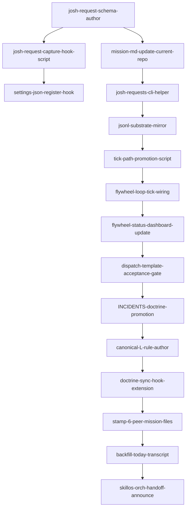

# Phase 1 RESEARCH (combined lanes A/B/C — self-authored)

## Skills library cited (META-RULE 2026-05-03 source-(a))

- **mission-anchor-init** — owns MISSION.md scaffolding; new schema must extend without breaking lock_hash
- **canonical-owner-runtime-state** — runtime-state substrate; closely related (request log IS runtime state)
- **state-truth-recovery** — handles "what's the truth source" — directly applicable
- **donella-meadows-systems-thinking** — Leverage point #6 (information flows): request → action loop is broken because the information channel (Joshua's verbal ask → orch action) has no durable substrate
- **agent-fleet-management** — cross-session propagation pattern
- **flywheel-end-to-end** — mission→shipped pipeline; request capture is the entry-point of that pipeline
- **accretive-file-write** — for atomic appends to MISSION.md without lock_hash invalidation
- **dispatch-tool-contracts** — every captured request becomes a dispatchable item

`skills_library_gap`: small — there's no skill that specifically codifies "input-channel capture for human operator". The closest is `request-validation` (form-validation oriented) and `human-in-the-loop` (decision-point oriented). **Will note as `skills_library_gap=human-operator-input-channel-capture`** for skillos consideration, but the schema this plan ships IS that skill's first artifact.

## Lane A — Problem-space inventory

### Symptom taxonomy (5 failure modes)

| FM | Description | Frequency | Severity |
|----|-------------|-----------|----------|
| FM-1 | Joshua makes verbal request → orch dispatches partial fulfillment → forgets remainder | High (today: socraticode, recovery-doctrine, FoggyBear, plan-adherence) | High |
| FM-2 | Joshua makes request → orch fulfills → no record exists for future ticks/sessions to verify completeness | High (every closed bead loses Joshua-context) | Medium |
| FM-3 | Joshua makes request in pane 1 (orch turn) → orch starts dispatching → context-window pressure pushes request out → forgotten next tick | Medium (compaction events, multi-turn drift) | High |
| FM-4 | Joshua makes request → orch acknowledges with "doing it" → never actually files anything → request invisible to retroactive audit | Medium | High (trust-eroding) |
| FM-5 | Joshua makes implicit request (pattern reaction, "this should be X") → orch interprets as observation not action item → no capture | Medium | Medium |

### Criticality matrix
- **Trust:** every forgotten Joshua request erodes the "system smarter than Joshua" thesis. Recovery cost (Joshua re-surfacing manually) is high — Joshua's attention is the scarcest resource.
- **Petal-9 violation:** recursive self-improvement requires every input signal to enter the substrate. Joshua's ask is the highest-priority input signal; not capturing = highest-priority loss.
- **Cross-session amplification:** if flywheel orch forgets, the peer-orch sessions never even know about it. Joshua's intent doesn't propagate.
- **Context-decay risk:** Claude Code session compactions/resets lose unstaged context. Without disk substrate, Joshua-asks die at session boundary.

### Stocks/flows (Meadows)
- **Stock:** Joshua-request log (currently: nonexistent. Implicit, ephemeral, in-pane-context only)
- **Inflow:** Joshua's messages to orch session (every turn potentially has a request)
- **Outflow:** request closure (currently: no closure protocol exists)
- **Loop status:** **broken at inflow.** No structured capture, no durability. **Information-flow leverage point (#6).**
- **Rules layer (#5):** orch has no rule "every Joshua message gets scanned for request-shape" — adding the rule is the intervention

## Lane B — Ecosystem audit (proven patterns)

### Pattern 1: MISSION.md frontmatter (mission-anchor-init)

Current shape (per `cat ~/Developer/flywheel/.flywheel/MISSION.md` head):
```yaml
schema_version: 1
doc_type: mission
status: locked
lock_hash: <hash>
locked_at: <iso>
provenance_note: <text>
```

Lock-hash is load-bearing — random edits invalidate the lock. **Adding a Josh-request log must extend additively without touching the locked frontmatter.** Per `accretive-file-write` skill: append-only section below the locked frontmatter, with its own sub-lock.

### Pattern 2: STATE.md as runtime substrate (L62)

L62 doctrine: "STATE.md is latent opportunity substrate". STATE.md is mutable per-tick; MISSION.md is locked. **Decision needed:** does Josh-request log live in MISSION.md (mission-locked, eternal) or STATE.md (per-tick, mutable)?

Resolution per audit Phase 3 below: **MISSION.md `## Joshua Requests` section** (canonical, append-only, survives lock — like INCIDENTS) + **STATE.md mirror-pointer** for tick-time visibility. Both substrates referenced; MISSION.md is the truth.

### Pattern 3: Doctrine sync hook (this session shipped flywheel-t5bn)

The doctrine-sync hook propagates AGENTS-CANONICAL.md to all 7 fleet repos when flywheel canonical changes. **Same hook can propagate the Josh-request schema** — schema lives in `flywheel/templates/josh-request-schema.md`, hook stamps to peer MISSION files on flywheel canonical edit.

Stamped repos (per fleet-stamp 6/6 honest going forward): mobile-eats, skillos, alpsinsurance, zesttube, terra-title, zeststream-infra. Blackfoot removed earlier today.

### Pattern 4: Auto-doctor mechanism (this session shipped flywheel-9zuz)

The doctor-signal-bead-promotion.sh script SHIPPED today demonstrates: tick-path mechanism that consumes substrate (doctor JSON), auto-creates beads. **Same architectural pattern works for Joshua-requests:** tick-path mechanism reads MISSION.md request-log section, auto-surfaces open requests in tick prompt, optionally auto-creates bead per open-but-unbeaded request.

### Pattern 5: jeff-issue-chain registry (this session shipped flywheel-vzme)

`~/.local/state/flywheel/jeff-issues.jsonl` + `~/.local/bin/jeff-issues-status` is a proven local-registry pattern with poll/stale/list subcommands. **Same shape works for josh-requests:** parallel substrate at `~/.local/state/flywheel/josh-requests.jsonl` + helper. Difference: source is MISSION.md not gh API.

### Pattern 6: Auto-capture from orch turn (NEW — no precedent in codebase)

This is the novel piece. Closest analogues:
- Claude Code hooks (`UserPromptSubmit` hook): fires on every user message. Could regex for request-shape, append to MISSION.md.
- ntm send messages: every message to orch could be filtered through capture script.
- post-tick orch reflection: orch checks transcript before next dispatch.

**Adopt:** Claude Code `UserPromptSubmit` hook is cleanest substrate-level capture — runs in harness regardless of orch awareness, can't be "forgotten." See `~/.claude/hooks/` for existing hook examples (claude-md-reference-hint.sh).

### ADOPT/EXTEND/AVOID
- **ADOPT:** MISSION.md append-only `## Joshua Requests` section, doctrine-sync stamp pattern, auto-doctor architectural pattern (tick-time consumption), jeff-issues registry shape, UserPromptSubmit hook
- **EXTEND:** mission-anchor-init skill to know about request section, /flywheel:status to surface, /flywheel:tick to consume, /flywheel:learn to harvest
- **AVOID:** mutating locked MISSION.md frontmatter, single-substrate fragility (use both MISSION.md + JSONL), making capture optional (mandatory hook), auto-fulfillment (capture ≠ execute)

## Lane C — Implementation design

### File deliverables

| Path | Purpose |
|------|---------|
| `~/Developer/flywheel/templates/josh-request-schema.md` | Canonical schema doc (frontmatter + entry shape + lifecycle) |
| `~/Developer/flywheel/.flywheel/MISSION.md` (UPDATE) | Add `## Joshua Requests` append-only section |
| `~/.claude/hooks/josh-request-capture.sh` (NEW) | UserPromptSubmit hook: scan Joshua message for request-shape, append to current-repo MISSION.md |
| `~/.claude/settings.json` (UPDATE) | Register hook in `UserPromptSubmit` |
| `~/.local/bin/josh-requests` (NEW) | List/show/close/defer helper (canonical-cli-scoping) |
| `~/.local/state/flywheel/josh-requests.jsonl` (NEW) | Mirror substrate (poll/stale-friendly) |
| `~/Developer/flywheel/.flywheel/scripts/josh-request-tick-promote.sh` (NEW) | Tick-path mechanism: surface open requests in tick prompt, auto-bead unprocessed >Nh |
| `~/Developer/flywheel/.flywheel/flywheel-loop-tick` (UPDATE) | Call promotion script in tick path (sibling to doctor-signal/plan-to-bead/doctrine-ladder/jeff-response) |
| `~/.claude/commands/flywheel/status.md` (UPDATE) | Add `## 📝 Joshua Requests` dashboard section |
| `~/.claude/commands/flywheel/_shared/dispatch-template.md` (UPDATE) | Acceptance gate: every dispatch claims a `josh_request_id` if relevant or `josh_request_id=null` |
| `~/.claude/skills/.flywheel/INCIDENTS.md` (UPDATE) | Promote `joshua-request-forgotten` doctrine from this session |
| `~/Developer/flywheel/.flywheel/AGENTS-CANONICAL.md` (UPDATE) | Document new canonical L-rule for Josh-request capture |
| Stamp targets (READ ONLY for plan, UPDATE in ship-bead): mobile-eats, skillos, alpsinsurance, zesttube, terra-title, zeststream-infra MISSION.md files |

### Schema (Josh-request entry)

Section appended to MISSION.md:
```markdown
## Joshua Requests

<!-- AUTO-MAINTAINED by ~/.claude/hooks/josh-request-capture.sh + ~/.local/bin/josh-requests
     APPEND-ONLY for entries; status field is mutable.
     Schema canonical at ~/Developer/flywheel/templates/josh-request-schema.md -->

### jr-2026-05-03T20:55:00Z-001
- **status:** open  # open|acknowledged|in_progress|done|deferred|wont_do
- **captured_via:** orch_turn  # orch_turn|hook|backfill|agent_mail
- **session:** flywheel
- **pane:** 1
- **excerpt:** "talk to me about what we've learned from the full socraticode indexing of all jeff's repos - did that finish or get forgotten about?"
- **inferred_action:** Run socraticode index across 177 jeff-corpus repos
- **bead:** flywheel-wtdd  # set when bead filed
- **closed_at:** null
- **closure_evidence:** null
```

### Auto-capture hook (UserPromptSubmit)

```bash
#!/usr/bin/env bash
# josh-request-capture.sh — fires on every user message
# Detects request-shape, appends to current-repo MISSION.md request log
set -euo pipefail
USER_MSG="${CLAUDE_USER_PROMPT:-$1}"
REPO=$(git -C "${CLAUDE_PROJECT_DIR:-$PWD}" rev-parse --show-toplevel 2>/dev/null || echo "")
[[ -z "$REPO" ]] && exit 0
MISSION="$REPO/.flywheel/MISSION.md"
[[ -f "$MISSION" ]] || exit 0  # Only flywheel-managed repos

# Request-shape heuristic (PHASE 1 — start permissive, tighten later via doctrine-ladder)
REQUEST_PATTERNS=(
  "^we need"
  "^let'?s"
  "^can you"
  "^please"
  "^should we"
  "^make sure"
  "^add"
  "^build"
  "^create"
  "^fix"
  "^get [^.]+ (going|done|fixed|added|built)"
  "this needs"
  "we cannot forget"
  "make this"
  "this should be"
  "this should get"
  "set up"
  "wire (this|that|it) (in|up)"
)
MATCHED=false
for pat in "${REQUEST_PATTERNS[@]}"; do
  if echo "$USER_MSG" | grep -qiE "$pat"; then MATCHED=true; break; fi
done
[[ "$MATCHED" == "false" ]] && exit 0

# Append entry (atomic via temp file)
TS=$(date -u +%Y-%m-%dT%H:%M:%SZ)
ID="jr-$(date -u +%Y-%m-%dT%H%M%SZ)-$(printf '%03d' $(($(date +%s) % 1000)))"
EXCERPT=$(echo "$USER_MSG" | head -c 500 | tr '\n' ' ')
{
  echo ""
  echo "### $ID"
  echo "- **status:** open"
  echo "- **captured_via:** hook"
  echo "- **session:** $(basename "$REPO")"
  echo "- **excerpt:** \"$EXCERPT\""
  echo "- **inferred_action:** PENDING_ORCH_INTERPRETATION"
  echo "- **bead:** null"
  echo "- **closed_at:** null"
} >> "$MISSION"

# Mirror to JSONL substrate
echo "{\"id\":\"$ID\",\"ts\":\"$TS\",\"session\":\"$(basename "$REPO")\",\"status\":\"open\",\"excerpt\":$(printf '%s' "$EXCERPT" | jq -Rs .),\"captured_via\":\"hook\"}" >> "$HOME/.local/state/flywheel/josh-requests.jsonl"
```

### Helper script (canonical-cli-scoping surface)

```text
josh-requests list [--status=open|acknowledged|...] [--session=<repo>] [--json]
josh-requests show <id>
josh-requests acknowledge <id> --note="<orch interpretation>"
josh-requests link <id> <bead-id>
josh-requests close <id> --evidence="<text>" [--status=done|deferred|wont_do]
josh-requests stale [--hours=24]  # open requests older than N hours
josh-requests backfill --transcript=<path>  # one-shot: scan transcript for missed requests
```

### Tick-path consumer

`josh-request-tick-promote.sh` (called from flywheel-loop-tick before doctor-signal):
1. Read open requests from JSONL
2. For each open >2h with no bead linked: auto-create `[josh-request] <inferred_action>` bead at P0, update entry with bead_id
3. Surface open count in tick prompt: `## 📝 Joshua Requests pre-tick\n{open: N, stale: M, recent: [<top 3>]}`

### /flywheel:status dashboard surface

Add section after Inbox:
```
## 📝 Joshua Requests (<N> open, <M> stale)
- jr-...001 [in_progress] socraticode index jeff-corpus → flywheel-wtdd
- jr-...002 [open] /flywheel:recovery agent-mail identity → flywheel-7jp3
- jr-...003 [acknowledged] capture system → THIS PLAN
```

### Cross-session propagation

Doctrine-sync hook (already exists, ships canonical AGENTS to peers) gets extended:
1. When flywheel `templates/josh-request-schema.md` changes, hook copies to each peer's `templates/`
2. When peer's MISSION.md lacks `## Joshua Requests` section, hook bootstraps it on next sync
3. Each peer's orch CC session gets the same UserPromptSubmit hook (settings.json shared via dotfiles symlink — verify)

### Backfill (one-shot, this session)

Scan today's flywheel orch transcript for Joshua requests. Worker writes to MISSION.md retroactively for the items already flagged in this plan + any others surfaced by transcript scan:
- jr-backfill-001: socraticode index jeff-corpus (5h ago) → flywheel-wtdd (just filed)
- jr-backfill-002: /flywheel:recovery identity-audit (1h ago) → flywheel-7jp3 (in-progress)
- jr-backfill-003: skillos plist diagnosis + plan-adherence (2h ago) → flywheel-6krl + ntm send sent
- jr-backfill-004: this capture system → THIS PLAN
- jr-backfill-005: blackfoot symlink remove (3h ago) → done (closed flywheel-2dwt)
- jr-backfill-006: jeff-issue triage process (4h ago) → flywheel-bltm + flywheel-gmat
- ... (worker scans full transcript)

### Bead DAG (preliminary — Phase 4 finalizes)



15 beads, 14 dependencies, parallelizable into 6 waves.

### Test plan
- **Unit:** hook fires on synthetic Joshua message containing request-pattern, appends entry, exits clean
- **Integration:** ship a test request via real Joshua message, verify entry lands in MISSION.md AND JSONL
- **Tick:** verify open requests surface in next tick prompt
- **Cross-session:** verify schema stamps to mobile-eats MISSION.md after doctrine-sync run
- **Backfill:** retroactive scan finds today's 6+ missed requests
- **Closure:** mark request done with evidence, verify removed from open list
- **No-false-positive:** non-request messages (greetings, ack only) do NOT create entries

## Convergence note

Single-author Phase 1 (no worker fanout per Meadows analysis). Multi-pattern review: cross-checked against doctor-signal trio shipped today (same architectural shape), jeff-issue-chain registry (same JSONL+helper pattern), and existing mission-anchor-init/canonical-owner-runtime-state skills. Adversarial review deferred to Phase 5 polish via codex pane.
