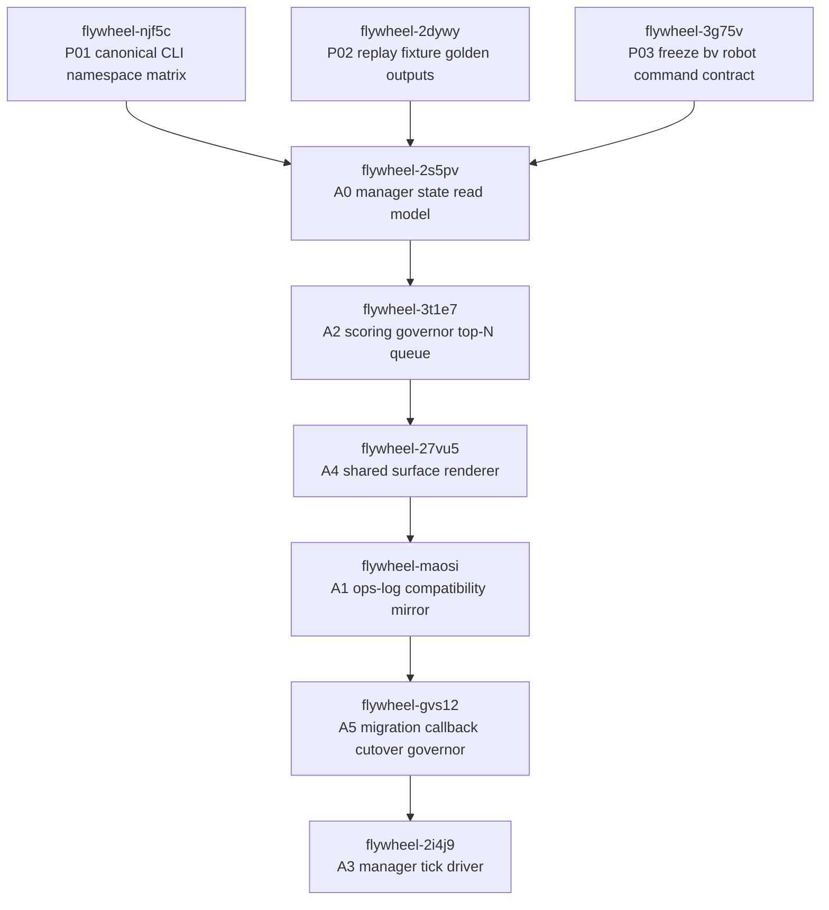

# Manager Loop Architecture - Phase 4 Beads DAG
Artifact: `04-BEADS-DAG.md`
Plan input: `.flywheel/PLANS/manager-loop-architecture-2026-05-05/00-PLAN-r2.md`
Audit input: `.flywheel/PLANS/manager-loop-architecture-2026-05-05/02-AUDIT-r2.md`
Worker task: `decompose-manager-loop-2026-05-05`
Generated: 2026-05-05
Scope: plan-space and bead-space only
## Summary
This DAG decomposes the R2 manager-loop plan into 9 repo-local Beads.
The decomposition follows the R2 ship order:
1. G0 / audit partial contract freeze beads first.
2. A0 manager state read model.
3. A2 scoring governor and top-N queue.
4. A4 shared surface renderer.
5. A1 ops-log compatibility mirror.
6. A5 migration and callback cutover governor.
7. A3 manager tick driver.
The DAG keeps total bead count below the Phase 4 cap.
The DAG uses 7 waves.
The widest wave has 3 beads.
The dependency graph has no fanout greater than 3.
The dependency graph has no cycles.
The audit-r2 partial findings are mitigated 3/3.
The partial findings are P01, P02, and P03.
P01 is a standalone CLI namespace matrix bead.
P02 is a standalone replay fixture golden output bead.
P03 is a standalone `bv` robot contract freeze bead.
## Substrate Validation
Preflight `br doctor` was run in `/Users/josh/Developer/flywheel`.
The preflight gate had zero errors.
The preflight gate had only export/count warnings before bead writes.
During dependency creation, installed `br 0.1.20` hit the known OpenRead class.
The recovery path followed L48, L93, and L94.
A copy-test proved `VACUUM` plus direct dependency insert was reversible.
The live DB was backed up before repair.
The live DB was repaired under the repo SQLite writer lock.
Eight JSONL-only issue rows were preserved before flush.
The 8 manager-loop dependency edges are present in SQLite.
The final `br doctor` output is all OK.
The final `br doctor` parses 1076 JSONL records.
The final `br doctor` reports `sqlite.integrity_check` OK.
The final `br doctor` reports DB and JSONL counts both 1076.
The final `br dep cycles` result is `No dependency cycles detected`.
No alpsinsurance Beads DB was touched.
## Mermaid Graph

## Bead Table
| bead_id | title | priority | depends_on | unblocks | plan_section |
|---|---|---:|---|---|---|
| `flywheel-njf5c` | `[manager-loop] P01 canonical CLI namespace matrix` | P1 | none | `flywheel-2s5pv` | `02-AUDIT-r2.md:209`, `02-AUDIT-r2.md:214`, `02-AUDIT-r2.md:216`, `00-PLAN-r2.md:253`, `00-PLAN-r2.md:430` |
| `flywheel-2dywy` | `[manager-loop] P02 replay fixture golden outputs` | P1 | none | `flywheel-2s5pv` | `02-AUDIT-r2.md:220`, `02-AUDIT-r2.md:225`, `02-AUDIT-r2.md:227`, `00-PLAN-r2.md:981`, `00-PLAN-r2.md:986` |
| `flywheel-3g75v` | `[manager-loop] P03 freeze bv robot command contract` | P1 | none | `flywheel-2s5pv` | `02-AUDIT-r2.md:231`, `02-AUDIT-r2.md:238`, `00-PLAN-r2.md:926`, `00-PLAN-r2.md:991` |
| `flywheel-2s5pv` | `[manager-loop] A0 manager state read model` | P1 | `flywheel-njf5c`, `flywheel-2dywy`, `flywheel-3g75v` | `flywheel-3t1e7` | `00-PLAN-r2.md:172`, `00-PLAN-r2.md:242`, `00-PLAN-r2.md:243`, `00-PLAN-r2.md:991` |
| `flywheel-3t1e7` | `[manager-loop] A2 scoring governor top-N queue` | P1 | `flywheel-2s5pv` | `flywheel-27vu5` | `00-PLAN-r2.md:458`, `02-AUDIT-r2.md:236` |
| `flywheel-27vu5` | `[manager-loop] A4 shared surface renderer` | P2 | `flywheel-3t1e7` | `flywheel-maosi` | `00-PLAN-r2.md:732`, `00-PLAN-r2.md:1403` |
| `flywheel-maosi` | `[manager-loop] A1 ops-log compatibility mirror` | P2 | `flywheel-27vu5` | `flywheel-gvs12` | `00-PLAN-r2.md:289`, `00-PLAN-r2.md:932` |
| `flywheel-gvs12` | `[manager-loop] A5 migration callback cutover governor` | P2 | `flywheel-maosi` | `flywheel-2i4j9` | `00-PLAN-r2.md:832`, `02-AUDIT-r2.md:38` |
| `flywheel-2i4j9` | `[manager-loop] A3 manager tick driver` | P2 | `flywheel-gvs12` | final manager-loop tick primitive | `00-PLAN-r2.md:595`, `00-PLAN-r2.md:1403` |
## Dependency Edge Ledger
The intended Beads dependency commands are:
```bash
br dep add flywheel-2s5pv flywheel-njf5c
br dep add flywheel-2s5pv flywheel-2dywy
br dep add flywheel-2s5pv flywheel-3g75v
br dep add flywheel-3t1e7 flywheel-2s5pv
br dep add flywheel-27vu5 flywheel-3t1e7
br dep add flywheel-maosi flywheel-27vu5
br dep add flywheel-gvs12 flywheel-maosi
br dep add flywheel-2i4j9 flywheel-gvs12
```
The live DB contains these 8 edges.
The edge count check returned 8.
The first `br dep add` attempt exposed installed-`br` OpenRead corruption.
The final edge materialization used the validated L93 direct-SQL fallback.
The dependency semantics are still exactly `child depends_on parent`.
The final cycle check was performed through `br dep cycles`.
The final cycle check returned no cycles.
## Wave Plan
### Wave 0 - Contract and Partial Mitigation
Wave size: 3.
Parallelism: 3.
No dependencies.
Beads:
- `flywheel-njf5c` P01 canonical CLI namespace matrix.
- `flywheel-2dywy` P02 replay fixture golden outputs.
- `flywheel-3g75v` P03 freeze `bv` robot command contract.
Exit gates:
- CLI matrix names every manager-loop surface.
- Replay fixtures define concrete expected outputs.
- `bv` robot command/schema contract is frozen.
- A0 has stable upstream contracts before it starts.
### Wave 1 - State Read Model
Wave size: 1.
Parallelism: 1.
Depends on Wave 0.
Bead:
- `flywheel-2s5pv` A0 manager state read model.
Exit gates:
- State input adapters are read-only.
- M-id to A-id alias table is honored.
- Selector and retry receipts are accepted.
- Fixture replay produces deterministic state model outputs.
### Wave 2 - Scoring and Queue
Wave size: 1.
Parallelism: 1.
Depends on Wave 1.
Bead:
- `flywheel-3t1e7` A2 scoring governor top-N queue.
Exit gates:
- Scoring is deterministic.
- Queue ordering is fixture-stable.
- Blocked and no-action reasons are explicit.
- `bv` inputs pass through the frozen P03 schema boundary.
### Wave 3 - Shared Renderer
Wave size: 1.
Parallelism: 1.
Depends on Wave 2.
Bead:
- `flywheel-27vu5` A4 shared surface renderer.
Exit gates:
- Renderer does not duplicate A0 parsing.
- Renderer does not duplicate A2 scoring.
- JSON and human-facing outputs carry the same reason codes.
- Rendering is read-only.
### Wave 4 - Ops Log Mirror
Wave size: 1.
Parallelism: 1.
Depends on Wave 3.
Bead:
- `flywheel-maosi` A1 ops-log compatibility mirror.
Exit gates:
- A1 is mirror/index only.
- Legacy ops-log consumers remain compatible.
- Source path and source hash fields are preserved.
- A1 does not own canonical manager-loop state.
### Wave 5 - Migration and Cutover
Wave size: 1.
Parallelism: 1.
Depends on Wave 4.
Bead:
- `flywheel-gvs12` A5 migration callback cutover governor.
Exit gates:
- Shadow and parity modes exist.
- Rollback is explicit.
- Callback receipts carry parity evidence.
- Old and new callback surfaces are compared before cutover.
### Wave 6 - Tick Driver
Wave size: 1.
Parallelism: 1.
Depends on Wave 5.
Bead:
- `flywheel-2i4j9` A3 manager tick driver.
Exit gates:
- Tick driver is idempotent by tick id and source hash.
- Tick driver respects A5 cutover state.
- Tick driver emits callback-ready receipts.
- Tick driver dry-run passes all P02 replay fixtures.
## Audit-R2 Partial Finding Mitigation Map
### P01 - Canonical CLI Namespace Matrix
Audit citation: `02-AUDIT-r2.md:209`.
Problem citation: `02-AUDIT-r2.md:214`.
Fix citation: `02-AUDIT-r2.md:216`.
Mitigating bead: `flywheel-njf5c`.
Mitigation status: covered.
Why this bead is sufficient:
- It is a standalone Wave 0 bead.
- A0 depends on it directly.
- It freezes command namespace before implementation begins.
- It maps the six manager-loop surfaces to canonical command classes.
- It names doctor, health, repair, validate, audit, why, schema, examples, and quickstart coverage.
Residual risk after mitigation:
- None for bead conversion.
- Implementation can still fail later if the matrix is incomplete.
- That risk is contained by the bead acceptance criteria.
### P02 - Replay Fixture Golden Outputs
Audit citation: `02-AUDIT-r2.md:220`.
Problem citation: `02-AUDIT-r2.md:225`.
Fix citation: `02-AUDIT-r2.md:227`.
Mitigating bead: `flywheel-2dywy`.
Mitigation status: covered.
Why this bead is sufficient:
- It is a standalone Wave 0 bead.
- A0 depends on it directly.
- It turns generic replay fixtures into concrete golden expectations.
- It names expected verdict, queue ids, and source-hash path.
- It makes replay a gate after each implementation wave.
Residual risk after mitigation:
- None for bead conversion.
- Implementation can still discover fixture gaps.
- Any new fixture gap should update `flywheel-2dywy` or spawn a child bead.
### P03 - Live `bv` Robot Command and Schema
Audit citation: `02-AUDIT-r2.md:231`.
Problem citation: `02-AUDIT-r2.md:236`.
Fix citation: `02-AUDIT-r2.md:238`.
Mitigating bead: `flywheel-3g75v`.
Mitigation status: covered.
Why this bead is sufficient:
- It is a standalone Wave 0 bead.
- A0 depends on it directly.
- A2 inherits it through A0 before scoring uses `bv`.
- It records that `bv --robot-next --format json` is live.
- It records that `bv --robot-triage --format json --robot-max-results 1` is live.
- It records that robot schema commands for `robot-next` and `robot-triage` are live.
- It records that `bv --robot-ready` is unsupported in the current CLI.
Residual risk after mitigation:
- None for bead conversion.
- Later implementation should update the contract if `bv` is upgraded.
- The acceptance criteria require schema probes before consumption.
## Bead Detail: `flywheel-njf5c`
Title: `[manager-loop] P01 canonical CLI namespace matrix`.
Priority: P1.
Wave: 0.
Depends on: none.
Unblocks: `flywheel-2s5pv`.
Plan-section-citation:
- `02-AUDIT-r2.md:209` names P01.
- `02-AUDIT-r2.md:214` states the missing matrix.
- `02-AUDIT-r2.md:216` defines the fix.
- `00-PLAN-r2.md:253` is a command-surface plan reference.
- `00-PLAN-r2.md:430` is a second command-surface plan reference.
Acceptance criteria:
- Create one namespace matrix for `state`, `queue`, `tick`, `ops-log`, `render`, and `migration`.
- Cover doctor, health, repair, validate, audit, why, schema, examples, quickstart, and JSON output.
- Cover dry-run/apply/idempotency-key semantics for mutation paths.
- Record command collision checks for claimed executable names.
- Give each manager-loop primitive command ownership or explicit no-command reason.
Files touched estimate:
- One CLI contract matrix artifact.
- One matrix validation test.
- Later downstream CLI/help files when implementation beads execute.
Test plan:
- Validate all 6 surfaces appear.
- Validate all canonical command classes appear.
- Validate each mutable row has dry-run/apply/idempotency-key semantics.
- Validate every command row has JSON or robot-safe output.
## Bead Detail: `flywheel-2dywy`
Title: `[manager-loop] P02 replay fixture golden outputs`.
Priority: P1.
Wave: 0.
Depends on: none.
Unblocks: `flywheel-2s5pv`.
Plan-section-citation:
- `02-AUDIT-r2.md:220` names P02.
- `02-AUDIT-r2.md:225` states expected outputs are still generic.
- `02-AUDIT-r2.md:227` defines the fix.
- `00-PLAN-r2.md:981` makes replay fixtures a gate.
- `00-PLAN-r2.md:986` starts the named fixture list.
Acceptance criteria:
- Define golden expected outputs for overnight 60+ callbacks.
- Define golden expected outputs for skillos manual callback gap.
- Define golden expected outputs for mobile-eats mission compression.
- Include expected verdict for each fixture.
- Include expected queue ids or queue ordering constraints for each fixture.
- Include expected source-hash file path for each fixture.
Files touched estimate:
- Three fixture files.
- One golden expected-output manifest.
- One replay test harness update.
Test plan:
- Replay each fixture.
- Assert exact expected verdict.
- Assert expected queue ids or order constraints.
- Assert source-hash path.
- Assert stable negative fixture reason code.
## Bead Detail: `flywheel-3g75v`
Title: `[manager-loop] P03 freeze bv robot command contract`.
Priority: P1.
Wave: 0.
Depends on: none.
Unblocks: `flywheel-2s5pv`.
Plan-section-citation:
- `02-AUDIT-r2.md:231` names P03.
- `02-AUDIT-r2.md:238` requires probing `bv --robot-next` and `bv --robot-triage`.
- `00-PLAN-r2.md:926` starts G0 cross-plan contract freeze.
- `00-PLAN-r2.md:991` states G0 ships before A0.
Acceptance criteria:
- Freeze `bv --robot-next --format json` as the single-pick command.
- Freeze `bv --robot-triage --format json` as the graph-aware triage command.
- Freeze `bv --robot-schema --schema-command robot-next --format json`.
- Freeze `bv --robot-schema --schema-command robot-triage --format json`.
- Record `bv --robot-ready` as unsupported by the current live CLI.
- Require A2 to consume `bv` only through this frozen contract.
Files touched estimate:
- One command contract artifact.
- One schema validation test.
- One negative unsupported-command test.
Test plan:
- Assert required fields for `robot-next`.
- Assert required fields for `robot-triage`.
- Assert schema command output has JSON Schema metadata.
- Assert unsupported command fails predictably.
## Bead Detail: `flywheel-2s5pv`
Title: `[manager-loop] A0 manager state read model`.
Priority: P1.
Wave: 1.
Depends on: `flywheel-njf5c`, `flywheel-2dywy`, `flywheel-3g75v`.
Unblocks: `flywheel-3t1e7`.
Plan-section-citation:
- `00-PLAN-r2.md:172` names A0.
- `00-PLAN-r2.md:242` adds selector receipt rows.
- `00-PLAN-r2.md:243` adds retry receipt rows.
- `00-PLAN-r2.md:991` makes A0 the first manager-loop implementation.
Acceptance criteria:
- Implement read-only adapters for mission, state, work, callback, dispatch-log, selector receipt, retry-state receipt, blocker-owner, and mission-anchor inputs.
- Normalize M-id to A-id aliases.
- Expose typed reason codes.
- Produce deterministic JSON for fixtures.
- Do not mutate ops-log or dispatch-log state.
Files touched estimate:
- Two to four parser/model files.
- One schema or contract fixture.
- Two to three tests.
Test plan:
- Unit-test every input adapter.
- Replay P02 golden fixtures.
- Validate P01 `state` surface contract.
- Assert selector and retry receipt rows are accepted.
## Bead Detail: `flywheel-3t1e7`
Title: `[manager-loop] A2 scoring governor top-N queue`.
Priority: P1.
Wave: 2.
Depends on: `flywheel-2s5pv`.
Unblocks: `flywheel-27vu5`.
Plan-section-citation:
- `00-PLAN-r2.md:458` names A2.
- `02-AUDIT-r2.md:236` identifies the robot-command ambiguity A2 must not reintroduce.
Acceptance criteria:
- Implement deterministic scoring fields.
- Implement deterministic tie-breakers.
- Implement eligibility gates.
- Emit blocked and no-action reason codes.
- Consume `bv` only through the P03 boundary.
- Produce stable Top-N queue output.
Files touched estimate:
- Two to three scoring or queue files.
- One queue schema artifact.
- Two to four tests.
Test plan:
- Unit-test scoring weights.
- Unit-test tie-breakers.
- Replay P02 fixtures and assert expected queue ids.
- Run P03 schema contract tests before live `bv` consumption.
## Bead Detail: `flywheel-27vu5`
Title: `[manager-loop] A4 shared surface renderer`.
Priority: P2.
Wave: 3.
Depends on: `flywheel-3t1e7`.
Unblocks: `flywheel-maosi`.
Plan-section-citation:
- `00-PLAN-r2.md:732` names A4.
- `00-PLAN-r2.md:1403` preserves the R2 ship order.
Acceptance criteria:
- Render manager-loop state and queue output.
- Avoid duplicating A0 parsing.
- Avoid duplicating A2 scoring.
- Preserve reason codes and source hashes.
- Emit operator-safe JSON and concise text/Markdown.
- Stay read-only.
Files touched estimate:
- One to two renderer modules.
- One CLI/output adapter.
- Two to three tests.
Test plan:
- Snapshot-test JSON output.
- Snapshot-test text/Markdown output.
- Validate P01 `render`, `state`, and `queue` rows.
- Assert no writes happen in render-only mode.
## Bead Detail: `flywheel-maosi`
Title: `[manager-loop] A1 ops-log compatibility mirror`.
Priority: P2.
Wave: 4.
Depends on: `flywheel-27vu5`.
Unblocks: `flywheel-gvs12`.
Plan-section-citation:
- `00-PLAN-r2.md:289` names A1.
- `00-PLAN-r2.md:932` states A1 is mirror/index only.
Acceptance criteria:
- Keep A1 as mirror/index only.
- Preserve compatibility for legacy ops-log consumers.
- Mirror/index into A0-compatible shape.
- Preserve source path, source hash, mirror timestamp, schema version, and stale/missing reason codes.
- Do not implement scoring or tick dispatch behavior.
Files touched estimate:
- Two to three mirror/index files.
- One schema fixture.
- Two to three tests.
Test plan:
- Replay legacy ops-log fixtures.
- Assert A0-compatible schema.
- Assert mirror/index writes are append-only or dry-run/apply gated.
- Assert no scoring behavior exists.
## Bead Detail: `flywheel-gvs12`
Title: `[manager-loop] A5 migration callback cutover governor`.
Priority: P2.
Wave: 5.
Depends on: `flywheel-maosi`.
Unblocks: `flywheel-2i4j9`.
Plan-section-citation:
- `00-PLAN-r2.md:832` names A5.
- `02-AUDIT-r2.md:38` says R2 resolved cross-plan highs with A5 parity ownership.
Acceptance criteria:
- Implement dual-read and dual-write policy.
- Implement parity checks.
- Implement rollback gates.
- Preserve callback field compatibility.
- Include disabled, shadow, parity-required, cutover-ready, cutover-active, and rollback-required states.
- Callback closeout carries evidence path, schema version, source hashes, and parity verdict.
Files touched estimate:
- Two to four migration/cutover files.
- One callback schema artifact.
- Three to five tests.
Test plan:
- Run shadow fixtures.
- Run parity fixtures.
- Test rollback on mismatch.
- Test rollback on missing source hash.
- Replay P02 fixtures in pre-cutover and post-cutover modes.
## Bead Detail: `flywheel-2i4j9`
Title: `[manager-loop] A3 manager tick driver`.
Priority: P2.
Wave: 6.
Depends on: `flywheel-gvs12`.
Unblocks: final manager-loop tick primitive.
Plan-section-citation:
- `00-PLAN-r2.md:595` names A3.
- `00-PLAN-r2.md:1403` preserves A3 as the final manager-loop primitive in the R2 ship order.
Acceptance criteria:
- Read A0, A2, A4, A1, and A5 outputs.
- Select safe actions.
- Emit callback-ready receipt.
- Respect no-action and blocked verdicts.
- Stay idempotent by tick id and source hash.
- Never bypass A5 cutover state.
- Never bypass the P03 `bv` contract.
Files touched estimate:
- Two to four tick driver files.
- One receipt schema artifact.
- Three to five tests.
Test plan:
- Replay all P02 fixtures through dry-run tick mode.
- Test repeated tick ids.
- Test changed source hashes.
- Validate callback receipt fields against A5 schema.
## Quality Checks
Bead count: 9.
Primitive beads: 6.
Audit partial mitigation beads: 3.
Total bead cap: 15.
Cap status: pass.
Audit-r2 partial mitigations: 3/3.
Wave count: 7.
Max parallel in wave: 3.
Fanout max: 3 from Wave 0 into A0.
Cycle check command: `br dep cycles`.
Cycle check result: `No dependency cycles detected`.
DB health check command: `br doctor`.
DB health result: all OK after repair and flush.
JSONL record count: 1076.
SQLite issue count: 1076.
SQLite integrity: ok.
No source implementation edits were made.
Only bead-space and plan artifact writes were made.
## Callback Values
`beads_created=9`.
`bead_ids=flywheel-njf5c,flywheel-2dywy,flywheel-3g75v,flywheel-2s5pv,flywheel-3t1e7,flywheel-27vu5,flywheel-maosi,flywheel-gvs12,flywheel-2i4j9`.
`audit_partials_mitigated=3/3`.
`dep_cycles=0`.
`wave_count=7`.
`max_parallel_in_wave=3`.
`dag_path=/Users/josh/Developer/flywheel/.flywheel/PLANS/manager-loop-architecture-2026-05-05/04-BEADS-DAG.md`.
`fuckups_logged=br-dep-add-openread-recovered`.
`no_bead_reason=br-openread-existing-L93-incident-and-recovery-tool-covered`.
