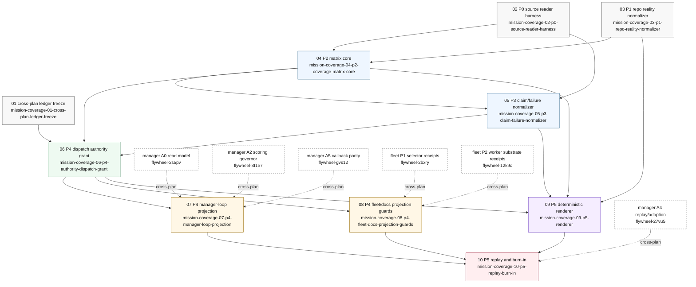

# 04-BEADS-DAG - Mission Coverage Compiler

Task: mission-coverage-dag-doc-2026-05-05
Mode: /flywheel:worker-tick parity
Scope: plan-space only
Pane model constraint: single pane, single dispatch
Output artifact: `.flywheel/PLANS/mission-coverage-compiler-2026-05-05/04-BEADS-DAG.md`
Bead DB writes by DAG-doc worker: 0
Bead DB writes by decompose-create worker: 32 logical operations; 29 new DB rows
Source writes by decompose-create worker beyond Beads DB: this DAG update and `04-BEADS-CREATE-LOG.md`
Staged body source: `/tmp/mission-coverage-bead-01-cross-plan-ledger-freeze.md` through `/tmp/mission-coverage-bead-10-p5-replay-burn-in.md`
Primary implementation target: `.flywheel/PLANS/mission-coverage-compiler-2026-05-05/00-PLAN-r2.md`
Local audit target: `.flywheel/PLANS/mission-coverage-compiler-2026-05-05/02-AUDIT-r2.md`
Cross-plan audit target: `.flywheel/PLANS/02-AUDIT-r2-cross-plan.md`
Skills consulted: beads-workflow, flywheel:plan, canonical-cli-scoping, jeff-planning-enhanced
Socraticode pre-flight: 3 K10 searches against `/Users/josh/Developer/flywheel`
Placeholder count: 10
Internal dependency edges: 16
Cross-plan dependency edges: 6
Real bead IDs mapped: yes
Created bead IDs: `flywheel-2r7l3`, `flywheel-gwbvf`, `flywheel-4ggh2`, `flywheel-wg2e4`, `flywheel-b1059`, `flywheel-2c0pq`, `flywheel-29329`, `flywheel-1c3ha`, `flywheel-2j6ot`, `flywheel-2nx01`
Wave count: 6
Widest wave: 3
Mission audit R2 partials mitigated: 0/0
Cross-plan audit R2 targeted partials mitigated: 1/1
Cross-plan audit R2 new low wording families mitigated: 1/1
Self grade: Y
Composite: 9.5

## 1. Purpose

DAG-001 This artifact converts the R2 mission-coverage compiler plan into a bead creation graph.
DAG-002 It does not create beads.
DAG-003 It does not update beads.
DAG-004 It does not close beads.
DAG-005 It does not run `br sync`.
DAG-006 It does not write `.beads/*`.
DAG-007 It names placeholder bead keys so the later decompose-create pass can replace them with real bead IDs.
DAG-008 The planned placeholders intentionally use descriptive slugs, not fake `flywheel-*` IDs.
DAG-009 Real IDs must be captured from `br create --json` output in the future create pass.
DAG-010 The dependency plan is structured so the first implementation wave can start without downstream consumer authority.
DAG-011 The graph preserves the R2 primitive split: P0 through P5.
DAG-012 The graph preserves the R2 audit boundary that the compiler is not implementation proof.
DAG-013 The graph preserves the cross-plan boundary that manager-loop and fleet own their own gates.
DAG-014 The graph carries the cross-plan audit partial into acceptance criteria instead of pretending it vanished.
DAG-015 The graph carries the low wording family into the first ledger bead instead of creating a separate wording-only bead.
DAG-016 The result is a create-order document, not a project-management substitute.

## 2. Source Anchors

SRC-001 R2 primitive count is six at `00-PLAN-r2.md:239-246`.
SRC-002 P0 source reader is defined at `00-PLAN-r2.md:271-309`.
SRC-003 P1 repo reality normalizer is defined at `00-PLAN-r2.md:325-364`.
SRC-004 P2 matrix core is defined at `00-PLAN-r2.md:377-454`.
SRC-005 P3 claim and failure normalizer is defined at `00-PLAN-r2.md:456-511`.
SRC-006 P4 authority grants and projections are defined at `00-PLAN-r2.md:513-601`.
SRC-007 P5 renderer and replay harness are defined at `00-PLAN-r2.md:603-668`.
SRC-008 R2 ship order is defined at `00-PLAN-r2.md:946-979`.
SRC-009 R2 implementation boundaries are defined at `00-PLAN-r2.md:981-1002`.
SRC-010 R2 final decision uses the plan as implementation target at `00-PLAN-r2.md:1082`.
SRC-011 R2 local audit reports zero partials at `02-AUDIT-r2.md:25`.
SRC-012 R2 local audit reports disposition partial count zero at `02-AUDIT-r2.md:407`.
SRC-013 R2 local audit reports no partially resolved findings at `02-AUDIT-r2.md:608-617`.
SRC-014 R2 local audit reports cross-plan findings resolved 2/2 at `02-AUDIT-r2.md:516-552`.
SRC-015 Cross-plan audit reports PARTIAL-XP-01 at `.flywheel/PLANS/02-AUDIT-r2-cross-plan.md:316`.
SRC-016 Cross-plan audit family D coverage authority wiring appears at `.flywheel/PLANS/02-AUDIT-r2-cross-plan.md:650`.
SRC-017 Cross-plan audit NEW-LOW-01 appears at `.flywheel/PLANS/02-AUDIT-r2-cross-plan.md:297`.
SRC-018 Cross-plan audit family E owner wording appears at `.flywheel/PLANS/02-AUDIT-r2-cross-plan.md:677`.
SRC-019 Cross-plan audit says next safe mission action is consumer replay and advisory burn-in at `.flywheel/PLANS/02-AUDIT-r2-cross-plan.md:517`.
SRC-020 R2 fail conditions include bead DB no-write boundary at `00-PLAN-r2.md:943`.

## 3. Bead Placeholder Register

The placeholder keys below are stable only inside this plan artifact.
They are not real bead IDs.
The future create pass must capture real IDs and update dependency commands before execution.

| Seq | Placeholder | Real ID | Title | Primitive | Wave | Internal deps | Cross-plan deps |
|---:|---|---|---|---|---:|---|---|
| 01 | `mission-coverage-01-cross-plan-ledger-freeze` | `flywheel-2r7l3` | Freeze cross-plan coverage authority ledger | Cross-plan ledger | 0 | none | none |
| 02 | `mission-coverage-02-p0-source-reader-harness` | `flywheel-gwbvf` | P0 existing source reader harness | P0 | 0 | none | none |
| 03 | `mission-coverage-03-p1-repo-reality-normalizer` | `flywheel-4ggh2` | P1 repo reality normalizer | P1 | 0 | none | none |
| 04 | `mission-coverage-04-p2-coverage-matrix-core` | `flywheel-wg2e4` | P2 coverage matrix schema and compiler core | P2 | 1 | 02, 03 | none |
| 05 | `mission-coverage-05-p3-claim-failure-normalizer` | `flywheel-b1059` | P3 claim and failure normalizer fixtures | P3 | 1 | 02, 04 | none |
| 06 | `mission-coverage-06-p4-authority-dispatch-grant` | `flywheel-2c0pq` | P4 dispatch acceptance authority grant | P4 | 2 | 01, 04, 05 | none |
| 07 | `mission-coverage-07-p4-manager-loop-projection` | `flywheel-29329` | P4 manager-loop advisory projection | P4 | 3 | 06 | `flywheel-2s5pv`, `flywheel-3t1e7`, `flywheel-gvs12` |
| 08 | `mission-coverage-08-p4-fleet-docs-projection-guards` | `flywheel-1c3ha` | P4 fleet and docs advisory projection guards | P4 | 3 | 06 | `flywheel-2bxry`, `flywheel-12k9o` |
| 09 | `mission-coverage-09-p5-renderer` | `flywheel-2j6ot` | P5 deterministic renderer outputs | P5 | 4 | 03, 04, 05, 06 | none |
| 10 | `mission-coverage-10-p5-replay-burn-in` | `flywheel-2nx01` | P5 replay harness and consumer burn-in | P5 | 5 | 07, 08, 09 | `flywheel-27vu5` |

Creation note: the first three dependency edges were accepted through `br dep add`.
The fourth `br dep add` hit the installed `br 0.1.20` OpenRead root-page class.
The remaining dependency materialization used the L93 direct-SQL fallback under the repo SQLite writer lock.
The live DB was backed up at `.beads/beads.db.bak.mission-coverage-dep-sql-20260505T190951Z` before fallback insertion.
The post-fallback mission edge count is 22.
The post-fallback cycle check reports no dependency cycles.

## 4. Mermaid Graph



## 5. Internal Dependency Ledger

INT-001 `mission-coverage-04-p2-coverage-matrix-core` depends on `mission-coverage-02-p0-source-reader-harness`.
INT-002 Rationale: P2 consumes P0 evidence records.
INT-003 Source: `00-PLAN-r2.md:383` and `00-PLAN-r2.md:448`.
INT-004 `mission-coverage-04-p2-coverage-matrix-core` depends on `mission-coverage-03-p1-repo-reality-normalizer`.
INT-005 Rationale: P2 consumes P1 repo reality facts.
INT-006 Source: `00-PLAN-r2.md:384` and `00-PLAN-r2.md:449`.
INT-007 `mission-coverage-05-p3-claim-failure-normalizer` depends on `mission-coverage-02-p0-source-reader-harness`.
INT-008 Rationale: P3 translates scanner, callback, mission-anchor, doctor, and idle-state evidence read by P0.
INT-009 Source: `00-PLAN-r2.md:458-466`.
INT-010 `mission-coverage-05-p3-claim-failure-normalizer` depends on `mission-coverage-04-p2-coverage-matrix-core`.
INT-011 Rationale: P3 mappings feed finite matrix reason codes.
INT-012 Source: `00-PLAN-r2.md:467-490`.
INT-013 `mission-coverage-06-p4-authority-dispatch-grant` depends on `mission-coverage-01-cross-plan-ledger-freeze`.
INT-014 Rationale: P4 authority fields must preserve the cross-plan ownership and wording ledger.
INT-015 Source: `.flywheel/PLANS/02-AUDIT-r2-cross-plan.md:650-689`.
INT-016 `mission-coverage-06-p4-authority-dispatch-grant` depends on `mission-coverage-04-p2-coverage-matrix-core`.
INT-017 Rationale: P4 grants cite matrix hashes, reason codes, blocked rows, and eligibility fields.
INT-018 Source: `00-PLAN-r2.md:524-554`.
INT-019 `mission-coverage-06-p4-authority-dispatch-grant` depends on `mission-coverage-05-p3-claim-failure-normalizer`.
INT-020 Rationale: P4 refusal modes require P3 reason-code stability.
INT-021 Source: `00-PLAN-r2.md:596-599`.
INT-022 `mission-coverage-07-p4-manager-loop-projection` depends on `mission-coverage-06-p4-authority-dispatch-grant`.
INT-023 Rationale: manager-loop projection starts advisory and must cite a grant reference.
INT-024 Source: `00-PLAN-r2.md:565-583`.
INT-025 `mission-coverage-08-p4-fleet-docs-projection-guards` depends on `mission-coverage-06-p4-authority-dispatch-grant`.
INT-026 Rationale: fleet, docs, and closed-bead projections are advisory grant surfaces.
INT-027 Source: `00-PLAN-r2.md:584-595`.
INT-028 `mission-coverage-09-p5-renderer` depends on `mission-coverage-03-p1-repo-reality-normalizer`.
INT-029 Rationale: renderer output must include repo-state stale/dirty facts without mutating worktree state.
INT-030 Source: `00-PLAN-r2.md:331-346` and `00-PLAN-r2.md:631`.
INT-031 `mission-coverage-09-p5-renderer` depends on `mission-coverage-04-p2-coverage-matrix-core`.
INT-032 Rationale: renderer consumes matrices and must preserve stable matrix hashes.
INT-033 Source: `00-PLAN-r2.md:609-620`.
INT-034 `mission-coverage-09-p5-renderer` depends on `mission-coverage-05-p3-claim-failure-normalizer`.
INT-035 Rationale: renderer diagnostics must expose normalized reason codes and fixture expectations.
INT-036 Source: `00-PLAN-r2.md:610-618`.
INT-037 `mission-coverage-09-p5-renderer` depends on `mission-coverage-06-p4-authority-dispatch-grant`.
INT-038 Rationale: renderer outputs projection receipts and audit appendix without upgrading grants.
INT-039 Source: `00-PLAN-r2.md:611-636`.
INT-040 `mission-coverage-10-p5-replay-burn-in` depends on `mission-coverage-07-p4-manager-loop-projection`.
INT-041 Rationale: burn-in must replay manager-loop advisory summary behavior.
INT-042 Source: `00-PLAN-r2.md:638` and `00-PLAN-r2.md:665`.
INT-043 `mission-coverage-10-p5-replay-burn-in` depends on `mission-coverage-08-p4-fleet-docs-projection-guards`.
INT-044 Rationale: burn-in must replay fleet hard-gate-held, docs advisory-only, and closed-bead-not-mission-proof cases.
INT-045 Source: `00-PLAN-r2.md:639-642` and `00-PLAN-r2.md:666-667`.
INT-046 `mission-coverage-10-p5-replay-burn-in` depends on `mission-coverage-09-p5-renderer`.
INT-047 Rationale: replay receipts compare expected hashes, actual hashes, diffs, and rendered output.
INT-048 Source: `00-PLAN-r2.md:643-660`.

## 6. Cross-Plan Edges

CROSS-001 Counted cross-plan dependency edges: 6.
CROSS-002 `mission-coverage-07-p4-manager-loop-projection` depends on `flywheel-2s5pv`.
CROSS-003 External owner: manager-loop A0 read model.
CROSS-004 Reason: manager-loop projection fields must match the read model, not invent a parallel queue substrate.
CROSS-005 Source: `00-PLAN-r2.md:566` and cross-plan audit family D.
CROSS-006 `mission-coverage-07-p4-manager-loop-projection` depends on `flywheel-3t1e7`.
CROSS-007 External owner: manager-loop A2 scoring governor.
CROSS-008 Reason: mission coverage can emit advisory signals, but manager-loop owns scoring and queue penalties.
CROSS-009 Source: `00-PLAN-r2.md:567` and `.flywheel/PLANS/02-AUDIT-r2-cross-plan.md:659-666`.
CROSS-010 `mission-coverage-07-p4-manager-loop-projection` depends on `flywheel-gvs12`.
CROSS-011 External owner: manager-loop A5 callback parity.
CROSS-012 Reason: callback parity must remain fail-closed before advisory projection can be trusted by manager-loop.
CROSS-013 Source: `00-PLAN-r2.md:568` and `.flywheel/PLANS/02-AUDIT-r2-cross-plan.md:283-289`.
CROSS-014 `mission-coverage-08-p4-fleet-docs-projection-guards` depends on `flywheel-2bxry`.
CROSS-015 External owner: fleet P1 selector receipts.
CROSS-016 Reason: fleet consumes compiler output only through selector/receipt contracts, not by inheriting matrix semantics.
CROSS-017 Source: `.flywheel/PLANS/02-AUDIT-r2-cross-plan.md:500` and `.flywheel/PLANS/02-AUDIT-r2-cross-plan.md:686-687`.
CROSS-018 `mission-coverage-08-p4-fleet-docs-projection-guards` depends on `flywheel-12k9o`.
CROSS-019 External owner: fleet P2 worker substrate receipts.
CROSS-020 Reason: fleet hard gates remain advisory until worker receipt substrate can carry compiler adoption safely.
CROSS-021 Source: `00-PLAN-r2.md:584-590`.
CROSS-022 `mission-coverage-10-p5-replay-burn-in` depends on `flywheel-27vu5`.
CROSS-023 External owner: manager-loop A4 replay/adoption lane.
CROSS-024 Reason: burn-in must prove at least one live consumer can reject or reprioritize during replay.
CROSS-025 Source: `.flywheel/PLANS/02-AUDIT-r2-cross-plan.md:665-666` and `.flywheel/PLANS/02-AUDIT-r2-cross-plan.md:517`.
CROSS-026 Cross-plan non-edge: no Fleet G13 bead dependency is added because the provided fleet list did not include a G13 bead ID.
CROSS-027 Cross-plan non-edge: no docs validator bead dependency is added because no docs-specific owner bead ID was provided.
CROSS-028 Cross-plan non-edge: no closed-bead audit owner bead dependency is added because no owner bead ID was provided.
CROSS-029 Non-edges remain acceptance gates or citation guards, not invented dependencies.
CROSS-030 This preserves the cross-plan audit instruction to avoid fabricating authority owners.

## 7. Wave Plan

Wave count: 6.
Wave numbering starts at 0 because three setup beads can proceed independently.

### Wave 0 - Evidence and authority ledger foundations

W0-001 Beads: 01, 02, 03.
W0-002 `mission-coverage-01-cross-plan-ledger-freeze` freezes authority and wording boundaries.
W0-003 `mission-coverage-02-p0-source-reader-harness` builds the existing source reader.
W0-004 `mission-coverage-03-p1-repo-reality-normalizer` builds the new repo reality primitive.
W0-005 These three beads have no internal dependencies.
W0-006 These three beads have no counted cross-plan dependency edges.
W0-007 They can be created in any order.
W0-008 They should be implemented before any compiler core work.
W0-009 The ledger bead must land before P4 authority grant work consumes cross-plan wording.
W0-010 P0 must land before P2 and P3 can use normalized evidence.
W0-011 P1 must land before P2 and P5 can use repo-state facts.
W0-012 Acceptance gate: no `.beads/*` writes from P0 or P1 implementation tests except through future authorized bead operations.
W0-013 Audit mitigation: Wave 0 starts the owner wording mitigation for NEW-LOW-01.

### Wave 1 - Matrix and reason-code core

W1-001 Beads: 04, 05.
W1-002 `mission-coverage-04-p2-coverage-matrix-core` depends on 02 and 03.
W1-003 `mission-coverage-05-p3-claim-failure-normalizer` depends on 02 and 04.
W1-004 The apparent parallelism is partial because P3 needs the P2 reason-code basis.
W1-005 P2 should ship finite statuses and reason codes before P3 fixtures lock expected rows.
W1-006 P3 should ship fixture mappings before authority grants consume refusal modes.
W1-007 Acceptance gate: closed-bead scanner success must not become doc or test proof.
W1-008 Acceptance gate: callback text must not become validated evidence without validator output.
W1-009 Audit mitigation: Wave 1 preserves local R2 resolution of M-02 and JF-05.

### Wave 2 - First authority grant

W2-001 Beads: 06.
W2-002 `mission-coverage-06-p4-authority-dispatch-grant` depends on 01, 04, and 05.
W2-003 This is the narrow authority closure bead.
W2-004 It should define `mission_coverage_authority_grant/v0.1`.
W2-005 It should define `dispatch_advisory_projection/v0.1`.
W2-006 It should keep the first grant state advisory.
W2-007 It should include the first rejection fixture `dispatch-missing-mission-row-ref`.
W2-008 It should require `would_block=true`.
W2-009 It should require `blocked_reason=mission_row_refs_missing`.
W2-010 It should name rollback condition false-positive block on valid dispatch.
W2-011 It should prove a scoped dispatch-acceptance path before any broader claims.
W2-012 Acceptance gate: matrix existence never implies authority.
W2-013 Audit mitigation: Wave 2 preserves local R2 closure of H-01.

### Wave 3 - Advisory consumer projections

W3-001 Beads: 07, 08.
W3-002 `mission-coverage-07-p4-manager-loop-projection` depends on 06 plus three manager-loop beads.
W3-003 Manager-loop cross-plan dependencies are `flywheel-2s5pv`, `flywheel-3t1e7`, and `flywheel-gvs12`.
W3-004 `mission-coverage-08-p4-fleet-docs-projection-guards` depends on 06 plus two fleet beads.
W3-005 Fleet cross-plan dependencies are `flywheel-2bxry` and `flywheel-12k9o`.
W3-006 Both Wave 3 beads remain advisory.
W3-007 Neither Wave 3 bead can upgrade a gate without consumer-owned validation.
W3-008 Manager-loop projection must be typed JSON, not markdown scraping.
W3-009 Fleet projection must hold hard gates until replay exists.
W3-010 Docs projection must remain advisory under L81-compatible validation rules.
W3-011 Closed-bead audit projection must separate closure proof from mission proof.
W3-012 Audit mitigation: Wave 3 directly carries PARTIAL-XP-01 family D into acceptance.
W3-013 Audit mitigation: Wave 3 carries NEW-LOW-01 family E ownership wording into consumer semantics.

### Wave 4 - Deterministic rendering

W4-001 Beads: 09.
W4-002 `mission-coverage-09-p5-renderer` depends on 03, 04, 05, and 06.
W4-003 It renders Markdown summary.
W4-004 It renders JSON summary.
W4-005 It renders projection receipts.
W4-006 It renders replay receipts.
W4-007 It renders failure diagnostics.
W4-008 It renders consumer-specific summaries.
W4-009 It renders an audit appendix.
W4-010 It must produce stable ordering.
W4-011 It must produce deterministic hashes.
W4-012 It must support read-only dry-run behavior.
W4-013 It must not mutate bead DB.
W4-014 It must not mutate mission source docs.
W4-015 It must not auto-upgrade authority.
W4-016 Acceptance gate: rendered output is evidence and diagnostics, not authority.

### Wave 5 - Replay and burn-in

W5-001 Beads: 10.
W5-002 `mission-coverage-10-p5-replay-burn-in` depends on 07, 08, and 09.
W5-003 It also depends on cross-plan bead `flywheel-27vu5`.
W5-004 It should replay `dispatch-missing-mission-row-ref`.
W5-005 It should replay `manager-loop-advisory-summary`.
W5-006 It should replay `fleet-hard-gate-held`.
W5-007 It should replay `docs-advisory-only`.
W5-008 It should replay `closed-bead-scan-not-mission-proof`.
W5-009 It should replay `dirty-repo-state-stale`.
W5-010 Skipped replay is non-authoritative.
W5-011 Unsupported replay is non-authoritative.
W5-012 Diff presence is a failure unless accepted by version migration.
W5-013 Burn-in must prove at least one live consumer can reject or reprioritize.
W5-014 Burn-in must leave manager-loop and fleet grants advisory until their owners validate.
W5-015 Acceptance gate: no future hard gate may skip P5 replay.
W5-016 Audit mitigation: Wave 5 closes the targeted cross-plan authority-wiring partial in implementation terms.

## 8. Cross-Plan-Audit-R2 Mitigation Map

MIT-001 Local mission audit R2 partials: 0/0.
MIT-002 There are no local R2 partial findings to map into beads.
MIT-003 The local audit limitation about global authority is a correct boundary, not a partial.
MIT-004 The DAG preserves that boundary by keeping manager-loop, fleet, docs, and closed-bead surfaces advisory until consumer validation.
MIT-005 Cross-plan targeted partials: 1/1 mitigated.
MIT-006 Targeted partial: PARTIAL-XP-01 coverage-authority-consumer-wiring-partial.
MIT-007 Family D acceptance D1: compiler emits manager-loop summary JSON.
MIT-008 D1 owner bead: `mission-coverage-07-p4-manager-loop-projection`.
MIT-009 D1 support bead: `mission-coverage-09-p5-renderer`.
MIT-010 Family D acceptance D2: manager-loop summary includes top uncovered rows.
MIT-011 D2 owner bead: `mission-coverage-07-p4-manager-loop-projection`.
MIT-012 D2 support bead: `mission-coverage-09-p5-renderer`.
MIT-013 Family D acceptance D3: dispatch advisory can emit `would_block=true`.
MIT-014 D3 owner bead: `mission-coverage-06-p4-authority-dispatch-grant`.
MIT-015 Family D acceptance D4: at least one live consumer can reject or reprioritize during replay.
MIT-016 D4 owner bead: `mission-coverage-10-p5-replay-burn-in`.
MIT-017 Family D acceptance D5: no command mutates beads.
MIT-018 D5 owner beads: `mission-coverage-09-p5-renderer` and `mission-coverage-10-p5-replay-burn-in`.
MIT-019 Family D acceptance D6: no command scrapes markdown as canonical input.
MIT-020 D6 owner beads: `mission-coverage-07-p4-manager-loop-projection` and `mission-coverage-09-p5-renderer`.
MIT-021 Family D acceptance D7: dispatch validators own acceptance, not the compiler.
MIT-022 D7 owner beads: `mission-coverage-06-p4-authority-dispatch-grant` and `mission-coverage-10-p5-replay-burn-in`.
MIT-023 Family D acceptance D8: Fleet later hard-gates only after replay and advisory burn-in.
MIT-024 D8 owner beads: `mission-coverage-08-p4-fleet-docs-projection-guards` and `mission-coverage-10-p5-replay-burn-in`.
MIT-025 Cross-plan new low wording family: 1/1 mitigated.
MIT-026 Targeted low: NEW-LOW-01 mission-compiler-owner-wording-leak.
MIT-027 Family E acceptance E1: future text does not name a "Manager mission compiler" as a Manager primitive.
MIT-028 E1 owner bead: `mission-coverage-01-cross-plan-ledger-freeze`.
MIT-029 Family E acceptance E2: future text names the separate mission-coverage compiler lane.
MIT-030 E2 owner bead: `mission-coverage-01-cross-plan-ledger-freeze`.
MIT-031 Family E acceptance E3: Manager may consume JSON summary but not own matrix semantics.
MIT-032 E3 owner bead: `mission-coverage-07-p4-manager-loop-projection`.
MIT-033 Family E acceptance E4: Fleet may call or consume compiler output but not own matrix semantics.
MIT-034 E4 owner bead: `mission-coverage-08-p4-fleet-docs-projection-guards`.
MIT-035 Family E acceptance E5: compiler does not send dispatch packets.
MIT-036 E5 owner beads: `mission-coverage-01-cross-plan-ledger-freeze` and `mission-coverage-06-p4-authority-dispatch-grant`.
MIT-037 Mitigation result: targeted cross-plan partial 1/1 is carried into beads.
MIT-038 Mitigation result: low owner wording family 1/1 is carried into beads.
MIT-039 Mitigation result: no extra R3 plan lane is required.

## 9. Bead Body Summaries

SUM-001 Placeholder: `mission-coverage-01-cross-plan-ledger-freeze`.
SUM-002 Title: `[mission-coverage] Freeze cross-plan coverage authority ledger`.
SUM-003 Wave: 0.
SUM-004 Dependencies: none.
SUM-005 Unblocks: 06, 07, 08.
SUM-006 Summary: freeze cross-plan authority wiring D1-D8 and owner wording E1-E5.
SUM-007 Files: `.flywheel/mission-coverage/cross-plan-ledger.json`, `.flywheel/mission-coverage/cross-plan-ledger.md`, `tests/mission-coverage-cross-plan-ledger.sh`, this DAG.
SUM-008 Acceptance emphasis: no "Manager mission compiler" primitive, no compiler-owned dispatch sending, no invented consumer authority.

SUM-009 Placeholder: `mission-coverage-02-p0-source-reader-harness`.
SUM-010 Title: `[mission-coverage] P0 existing source reader harness`.
SUM-011 Wave: 0.
SUM-012 Dependencies: none.
SUM-013 Unblocks: 04, 05, 06.
SUM-014 Summary: build a read-only source reader for callbacks, scans, validators, doctor receipts, idle probes, and loop markers.
SUM-015 Files: compiler script, source-record schema, fixtures, and tests.
SUM-016 Acceptance emphasis: source reads become evidence records only, never authority.

SUM-017 Placeholder: `mission-coverage-03-p1-repo-reality-normalizer`.
SUM-018 Title: `[mission-coverage] P1 repo reality normalizer`.
SUM-019 Wave: 0.
SUM-020 Dependencies: none.
SUM-021 Unblocks: 04, 09, 10.
SUM-022 Summary: compute read-only repo-state hash, dirty paths, unpushed state, branch, HEAD, and upstream facts.
SUM-023 Files: compiler script, repo reality schema, fixtures, and tests.
SUM-024 Acceptance emphasis: no stash, reset, checkout, repair, or worktree mutation.

SUM-025 Placeholder: `mission-coverage-04-p2-coverage-matrix-core`.
SUM-026 Title: `[mission-coverage] P2 coverage matrix schema and compiler core`.
SUM-027 Wave: 1.
SUM-028 Dependencies: 02 and 03.
SUM-029 Unblocks: 05, 06, 09.
SUM-030 Summary: define matrix schema and deterministic compiler core with finite statuses and reason codes.
SUM-031 Files: compiler script, matrix schema, fixtures, and deterministic ordering tests.
SUM-032 Acceptance emphasis: evidence, validation, authority, and consumer enforcement stay separate.

SUM-033 Placeholder: `mission-coverage-05-p3-claim-failure-normalizer`.
SUM-034 Title: `[mission-coverage] P3 claim and failure normalizer fixtures`.
SUM-035 Wave: 1.
SUM-036 Dependencies: 02 and 04.
SUM-037 Unblocks: 06 and 10.
SUM-038 Summary: map scanner and validator outputs to reason codes with anti-laundering fixtures.
SUM-039 Files: compiler script, normalizer fixtures, expected matrix rows, diagnostics tests.
SUM-040 Acceptance emphasis: closed-bead scanner proof never becomes doc or test proof by itself.

SUM-041 Placeholder: `mission-coverage-06-p4-authority-dispatch-grant`.
SUM-042 Title: `[mission-coverage] P4 dispatch acceptance authority grant`.
SUM-043 Wave: 2.
SUM-044 Dependencies: 01, 04, and 05.
SUM-045 Unblocks: 07, 08, and 10.
SUM-046 Summary: define authority grant schema plus dispatch advisory first rejection fixture.
SUM-047 Files: compiler script, authority grant schema, dispatch advisory projection schema, fixture, and tests.
SUM-048 Acceptance emphasis: `grant_state=advisory`, `would_block=true`, `blocked_reason=mission_row_refs_missing`, rollback on false-positive block.

SUM-049 Placeholder: `mission-coverage-07-p4-manager-loop-projection`.
SUM-050 Title: `[mission-coverage] P4 manager-loop advisory projection`.
SUM-051 Wave: 3.
SUM-052 Dependencies: 06 plus `flywheel-2s5pv`, `flywheel-3t1e7`, and `flywheel-gvs12`.
SUM-053 Unblocks: 10.
SUM-054 Summary: emit manager-loop summary JSON projection with advisory state and manager consumer validation edges.
SUM-055 Files: compiler script, manager projection schema, fixtures, tests, and this DAG.
SUM-056 Acceptance emphasis: manager-loop owns queue/scoring authority; compiler emits typed advisory JSON only.

SUM-057 Placeholder: `mission-coverage-08-p4-fleet-docs-projection-guards`.
SUM-058 Title: `[mission-coverage] P4 fleet and docs advisory projection guards`.
SUM-059 Wave: 3.
SUM-060 Dependencies: 06 plus `flywheel-2bxry` and `flywheel-12k9o`.
SUM-061 Unblocks: 10.
SUM-062 Summary: define fleet, docs, and closed-bead audit projection guards with advisory state.
SUM-063 Files: compiler script, fleet-gate schema, docs-load-bearing schema, closed-bead-audit schema, and tests.
SUM-064 Acceptance emphasis: fleet hard gates wait for replay; docs stay advisory under L81; closure proof is not mission proof.

SUM-065 Placeholder: `mission-coverage-09-p5-renderer`.
SUM-066 Title: `[mission-coverage] P5 deterministic renderer outputs`.
SUM-067 Wave: 4.
SUM-068 Dependencies: 03, 04, 05, and 06.
SUM-069 Unblocks: 10.
SUM-070 Summary: render deterministic Markdown, JSON, projections, diagnostics, consumer summaries, and audit appendix.
SUM-071 Files: compiler script, render summary schema, fixtures, renderer tests, and mission-coverage README.
SUM-072 Acceptance emphasis: renderer is read-only and cannot auto-upgrade grants.

SUM-073 Placeholder: `mission-coverage-10-p5-replay-burn-in`.
SUM-074 Title: `[mission-coverage] P5 replay harness and consumer burn-in`.
SUM-075 Wave: 5.
SUM-076 Dependencies: 07, 08, 09, and `flywheel-27vu5`.
SUM-077 Unblocks: consumer adoption decisions, not automatic hard gates.
SUM-078 Summary: replay dispatch, manager-loop, fleet, docs, closed-bead, and dirty-state cases.
SUM-079 Files: compiler script, replay receipt schema, fixtures, replay tests, and no-mutation tests.
SUM-080 Acceptance emphasis: replay plus consumer-owned validation is required before authority upgrades.

## 10. Decompose.Create.Runbook

RUN-001 This section is intentionally named `decompose.create.runbook` for dispatch verification.
RUN-002 This worker did not execute the runbook.
RUN-003 A future create worker may execute it only after obtaining the bead DB write lane.
RUN-004 A future create worker must confirm no other pane holds `.beads/*` write authority.
RUN-005 A future create worker must verify all staged body files exist before creation.
RUN-006 A future create worker must capture real IDs from JSON output.
RUN-007 A future create worker must update dependency commands with real IDs before adding dependencies.
RUN-008 A future create worker must never add dependencies to placeholder slugs.
RUN-009 A future create worker must use safe local bead tooling if the repo provides it.
RUN-010 A future create worker must leave this DAG as the plan-space receipt.

```bash
# Future execution only. Not run by this plan-space worker.
set -euo pipefail

PLAN_DIR="/Users/josh/Developer/flywheel/.flywheel/PLANS/mission-coverage-compiler-2026-05-05"

test -f /tmp/mission-coverage-bead-01-cross-plan-ledger-freeze.md
test -f /tmp/mission-coverage-bead-02-p0-source-reader-harness.md
test -f /tmp/mission-coverage-bead-03-p1-repo-reality-normalizer.md
test -f /tmp/mission-coverage-bead-04-p2-coverage-matrix-core.md
test -f /tmp/mission-coverage-bead-05-p3-claim-failure-normalizer.md
test -f /tmp/mission-coverage-bead-06-p4-authority-dispatch-grant.md
test -f /tmp/mission-coverage-bead-07-p4-manager-loop-projection.md
test -f /tmp/mission-coverage-bead-08-p4-fleet-docs-projection-guards.md
test -f /tmp/mission-coverage-bead-09-p5-renderer.md
test -f /tmp/mission-coverage-bead-10-p5-replay-burn-in.md

id01=$(br create --json --title "[mission-coverage] Freeze cross-plan coverage authority ledger" --description "$(cat /tmp/mission-coverage-bead-01-cross-plan-ledger-freeze.md)" | jq -r '.id')
id02=$(br create --json --title "[mission-coverage] P0 existing source reader harness" --description "$(cat /tmp/mission-coverage-bead-02-p0-source-reader-harness.md)" | jq -r '.id')
id03=$(br create --json --title "[mission-coverage] P1 repo reality normalizer" --description "$(cat /tmp/mission-coverage-bead-03-p1-repo-reality-normalizer.md)" | jq -r '.id')
id04=$(br create --json --title "[mission-coverage] P2 coverage matrix schema and compiler core" --description "$(cat /tmp/mission-coverage-bead-04-p2-coverage-matrix-core.md)" | jq -r '.id')
id05=$(br create --json --title "[mission-coverage] P3 claim and failure normalizer fixtures" --description "$(cat /tmp/mission-coverage-bead-05-p3-claim-failure-normalizer.md)" | jq -r '.id')
id06=$(br create --json --title "[mission-coverage] P4 dispatch acceptance authority grant" --description "$(cat /tmp/mission-coverage-bead-06-p4-authority-dispatch-grant.md)" | jq -r '.id')
id07=$(br create --json --title "[mission-coverage] P4 manager-loop advisory projection" --description "$(cat /tmp/mission-coverage-bead-07-p4-manager-loop-projection.md)" | jq -r '.id')
id08=$(br create --json --title "[mission-coverage] P4 fleet and docs advisory projection guards" --description "$(cat /tmp/mission-coverage-bead-08-p4-fleet-docs-projection-guards.md)" | jq -r '.id')
id09=$(br create --json --title "[mission-coverage] P5 deterministic renderer outputs" --description "$(cat /tmp/mission-coverage-bead-09-p5-renderer.md)" | jq -r '.id')
id10=$(br create --json --title "[mission-coverage] P5 replay harness and consumer burn-in" --description "$(cat /tmp/mission-coverage-bead-10-p5-replay-burn-in.md)" | jq -r '.id')

printf '%s\n' \
  "01=$id01" "02=$id02" "03=$id03" "04=$id04" "05=$id05" \
  "06=$id06" "07=$id07" "08=$id08" "09=$id09" "10=$id10" \
  > "$PLAN_DIR/04-BEADS-DAG-created-ids.env"
```

RUN-011 Dependency add commands below are future execution only.
RUN-012 Replace shell variables with captured real IDs if the shell state is not still live.
RUN-013 Add internal dependencies first.
RUN-014 Add cross-plan dependencies second.
RUN-015 Re-run `br graph` or equivalent read-only inspection after dependency adds.
RUN-016 Keep all acceptance gates in bead descriptions, not hidden in pane scrollback.

```bash
# Future execution only. Not run by this plan-space worker.
br dep add "$id04" "$id02"
br dep add "$id04" "$id03"
br dep add "$id05" "$id02"
br dep add "$id05" "$id04"
br dep add "$id06" "$id01"
br dep add "$id06" "$id04"
br dep add "$id06" "$id05"
br dep add "$id07" "$id06"
br dep add "$id08" "$id06"
br dep add "$id09" "$id03"
br dep add "$id09" "$id04"
br dep add "$id09" "$id05"
br dep add "$id09" "$id06"
br dep add "$id10" "$id07"
br dep add "$id10" "$id08"
br dep add "$id10" "$id09"

br dep add "$id07" "flywheel-2s5pv"
br dep add "$id07" "flywheel-3t1e7"
br dep add "$id07" "flywheel-gvs12"
br dep add "$id08" "flywheel-2bxry"
br dep add "$id08" "flywheel-12k9o"
br dep add "$id10" "flywheel-27vu5"
```

RUN-017 Expected created bead count: 10.
RUN-018 Expected internal dependencies added: 16.
RUN-019 Expected cross-plan dependencies added: 6.
RUN-020 Expected wave count after creation: 6.
RUN-021 Expected widest wave after creation: 3.
RUN-022 Expected audit partial carry-forward: local 0/0, cross-plan 1/1.
RUN-023 Expected low wording family carry-forward: 1/1.
RUN-024 Expected no invented dependencies: Fleet G13 absent, docs validator absent, closed-bead audit owner absent.
RUN-025 Expected no mutation during dry-run validation: `.beads/*` unchanged until authorized create pass.
RUN-026 Expected future callback after create: include real IDs and dependency count.

## 11. Quality Gate

QG-001 This artifact has the required Mermaid graph.
QG-002 This artifact has the required bead placeholder table.
QG-003 This artifact has the required six-wave plan.
QG-004 This artifact has the required six cross-plan edges.
QG-005 This artifact has the required cross-plan-audit-r2 mitigation map.
QG-006 This artifact has the required ten bead body summaries.
QG-007 This artifact has the required `decompose.create.runbook` section.
QG-008 The graph does not claim real bead IDs for placeholders.
QG-009 The graph does not invent missing external bead IDs.
QG-010 The graph does not convert advisory projections into hard gates.
QG-011 The graph does not convert R2 plan-space convergence into implementation proof.
QG-012 The graph does not claim manager-loop owns matrix semantics.
QG-013 The graph does not claim fleet owns matrix semantics.
QG-014 The graph does not allow docs projection authority without L81-compatible validation.
QG-015 The graph does not allow closed-bead scanner proof to become mission proof.
QG-016 The graph carries the one cross-plan partial into future acceptance criteria.
QG-017 The graph carries the one low wording family into future acceptance criteria.
QG-018 This worker did not execute the future runbook.
QG-019 This worker did not write bead DB.
QG-020 This artifact is ready for the later bead create lane.

## 12. Callback Facts

CALLBACK-001 `self_grade=Y`.
CALLBACK-002 `composite=9.5`.
CALLBACK-003 `bead_placeholders=10`.
CALLBACK-004 `cross_plan_edges=6`.
CALLBACK-005 `wave_count=6`.
CALLBACK-006 `audit_partials_mitigated=0/0`.
CALLBACK-007 `cross_plan_audit_partials_mitigated=1/1`.
CALLBACK-008 `cross_plan_new_low_wording_family_mitigated=1/1`.
CALLBACK-009 `dag_path=/Users/josh/Developer/flywheel/.flywheel/PLANS/mission-coverage-compiler-2026-05-05/04-BEADS-DAG.md`.
CALLBACK-010 `skills_consulted=beads-workflow,flywheel:plan,canonical-cli-scoping,jeff-planning-enhanced`.
CALLBACK-011 `socraticode_queries=3_K10`.
CALLBACK-012 `bead_db_writes=0`.
CALLBACK-013 `l112_expected=OK_mission_coverage_dag_doc`.
