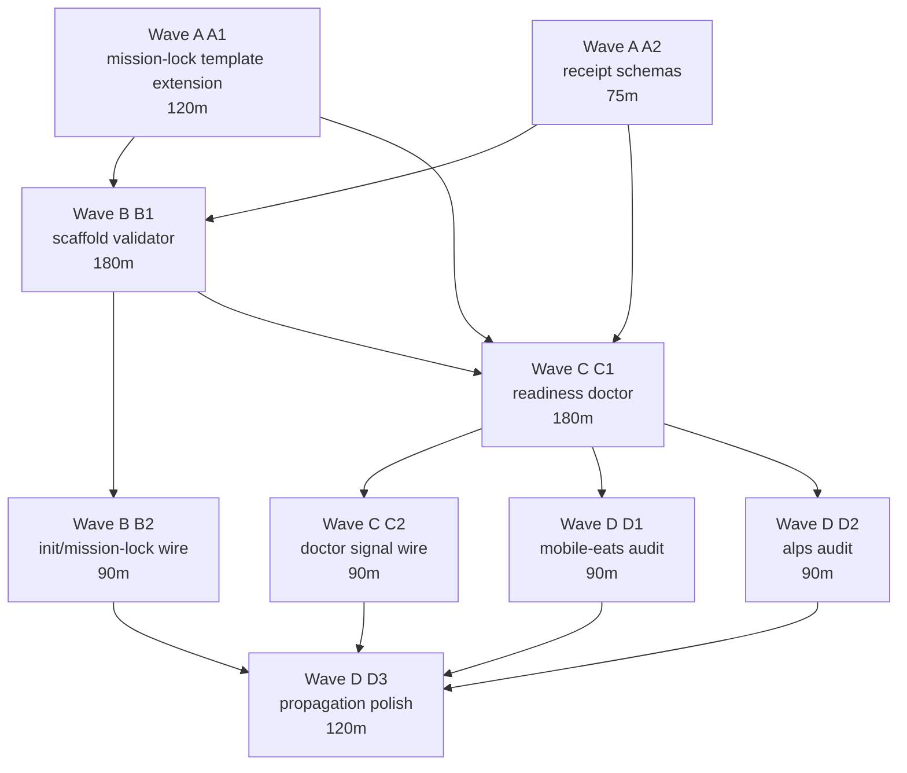

# Research C - Implementation Design

Plan arc: `mission-lock-paradigm-extension-2026-05-06`
Task: `plan-mission-lock-paradigm-extension-phase1-lane-c-2026-05-06`
Bead: `flywheel-plan-mission-lock-paradigm-extension-lane-c-2026-05-06`
Parent: `flywheel-plan-mission-lock-paradigm-extension-2026-05-06`
Lane: C, implementation design
Status: closed
Scope: plan-space-only
Date: 2026-05-06

No code-space files are intentionally changed by this artifact. This is the
design surface for later Phase 4 and Phase 5 implementation beads.

## Inputs Absorbed

Lane A closed the problem-space inventory with six gap classes and a 16-row
failure-mode matrix. Lane C treats these as the implementation contract:

1. `substrate-artifact-missing`
2. `negative-invariant-missing`
3. `trap-class-cross-reference-missing`
4. `skill-arsenal-by-surface-mapping-missing`
5. `data-lifecycle-not-locked`
6. `failure-mode-audit-missing`

Lane B closed the ecosystem audit with this core verdict: do not redesign
mission-lock from scratch. ADOPT the mature substrates for evidence, routing,
identity, canonical CLI shape, and publishability; EXTEND only the
mission-lock-specific completeness contract.

Cross-orch row 151 from `mobile-eats:1` supplies the 10 substrate-artifact
pressure list:

1. design tokens
2. `@theme` projection
3. canonical UI primitives
4. composition primitives
5. behavior config
6. CI gates
7. identity layer
8. SEO and route metadata
9. density caps
10. founder cohort and dispute substrate

Cross-orch row 152 from `alps:1` supplies the five invariant categories:

1. data-lifecycle invariants
2. trap-class cross-references
3. skill-arsenal-by-surface mapping
4. negative invariants
5. failure-mode audit per substrate

Joshua's five lock-time quotes are treated as non-optional product constraints:

1. "we have an e2e skill that specifically says no mocks"
2. "we also have a bunch of saas skills that we can use"
3. "i don't want fallback data - real or nothing"
4. "fallback data is hard to find later on"
5. "most of this should have been caught in our mission lock process"

## Socraticode Survey

Required K: >=10. Completed K=10 against
`/Users/josh/Developer/flywheel`; index status was green with 948 indexed
chunks.

Queries run:

1. `mission-lock senior dev stack capture template sections skills library socraticode research triad MISSION lock`
2. `mission-lock negative invariants no fallback no mocks real data trap classes data lifecycle substrate completeness`
3. `flywheel-loop doctor JSON output schema status missing sections completeness artifacts validation doctor contract`
4. `watcher-isomorphic-probe five sub probes shape JSON status missing artifact probe script`
5. `quality-bar-close-gate script shape CLI verbs json quiet dry-run apply validation gate`
6. `canonical CLI scoping required verbs info help examples schema json quiet dry-run apply doctor health repair audit why`
7. `mission anchor init MISSION template approved vendors budget tos secrets auto rotate senior dev stack fields`
8. `mobile-eats mission-lock undersells design system substrate tokens primitives theme density caps founder cohort dispute schema`
9. `alps mission-lock negative invariants no fallback real data skill surface mapping data lifecycle trap-class accepted fix categories`
10. `plan mission-lock paradigm extension Lane A gap inventory failure-mode matrix substrate artifact missing negative invariant`

Key sibling-shapes found:

- `~/.claude/commands/flywheel/mission-lock.md` is the existing
  senior-dev-stack capture surface and remains the extension point.
- `templates/flywheel-install/MISSION.md.tmpl` has 14 mission sections and
  lock frontmatter but lacks the six new completeness sections.
- `tests/flywheel-loop-canonical-cli.sh` proves the expected canonical CLI
  operator surface: `--info`, `health`, `--examples`, `quickstart`, `help`,
  `schema`, `completion`, `repair`, `audit`, and `why`.
- `.flywheel/scripts/watcher-isomorphic-probe.sh` and
  `tests/watcher-isomorphic-probe.sh` model a multi-probe doctor whose JSON has
  a schema version, top-level status, and per-probe failure details.
- `.flywheel/scripts/quality-bar-close-gate.sh` and
  `tests/quality-bar-close-gate.sh` model a close/readiness gate that reads
  plan state, emits JSON reasons, and refuses close on missing evidence.
- `INCIDENTS.md` entry `mission-lock-drift-no-audit-trail` proves lock
  evidence must be machine-readable, not prose-only.

## Mission-Lock Skill Template Extension (SKILL.md Draft)

Target surface for Phase 4:

- primary command: `~/.claude/commands/flywheel/mission-lock.md`
- portable mission template: `templates/flywheel-install/MISSION.md.tmpl`
- renderer/test fixtures: `templates/flywheel-install/tests/test_render.sh`
- schema: `templates/flywheel-install/schema.json`

The extension is additive. It should preserve the current 14-section
senior-dev-stack capture and insert six new sections before `Confirm And Lock
Receipt`. Every section must write both human-readable prose and a
machine-readable receipt block in the final lock artifact.

### Section X - Negative Invariants

Purpose: capture what the project will never ship, even if doing so appears to
make tests, demos, or local development easier.

Required prompt:

```text
For each product surface, name the states this mission must never ship. Include
data, tests, UI, identity, deploy, observability, and agent workflow. If a
forbidden state has a known skill or doctrine rule, cite it.
```

Required fields:

```yaml
negative_invariants:
  - id: no-runtime-fallback-data
    surface: data-runtime
    rule: "Real data or explicit error; never fallback data."
    source: "Joshua quote row 152"
    validation_signal: "real-service e2e or explicit error-state proof"
    owner: "mission-lock"
    enforcement_mode: blocking
  - id: no-runtime-mocks-on-launch-path
    surface: e2e
    rule: "No mocks on launch-critical runtime paths."
    source: "testing-real-service-e2e-no-mocks"
    validation_signal: "launch-path e2e uses real service fixture or live sandbox"
    owner: "mission-lock"
    enforcement_mode: blocking
```

Minimum required invariants:

- no fallback data on runtime or launch paths
- no mocks on launch-critical E2E paths
- no raw secrets in logs, callbacks, screenshots, or generated artifacts
- no unlabeled demo data that can masquerade as production data
- no feature work before required substrate is generated or explicitly beaded
- no "ready to build" claim without readiness receipt

Refusal rule: if a mission has no negative invariants, mission-lock must refuse
`status=locked` unless the mission explicitly records `negative_invariants:
not_applicable` with a reason and a reviewer.

Lane A gap closed: `negative-invariant-missing`.
Lane B prior art: ADOPT `testing-real-service-e2e-no-mocks`,
`security-audit-for-saas`, `security-posture`, L52, L56, L71.

### Section Y - Trap-Class Cross-References

Purpose: prevent the same lie from reappearing under a different layer name.

Required prompt:

```text
For every selected skill, substrate, and negative invariant, list adjacent trap
classes that are the same failure in another layer. Name the forbidden
substitute and the proof signal.
```

Required table:

| Trap class | Appears as | Sibling trap | Forbidden substitute | Proof signal |
|---|---|---|---|---|
| lying synthetic data | runtime fallback | mocked E2E | placeholder rows, canned JSON, local-only stubs | live source or explicit error UI |
| transport ack as success | callback sent | recovery complete | send acknowledgement as completion | post-action recapture or state transition |
| design substrate drift | route-local UI | token drift | scattered literals and ad-hoc buttons | token projection plus primitive-reuse gate |
| credential safety drift | secret read | key rotation | new credential generation without mission license | existing secret read or approved rotation receipt |

Required fields:

```yaml
trap_class_cross_refs:
  - class: lying-synthetic-data
    primary_surface: runtime-data
    sibling_surfaces: [e2e-tests, demo-fixtures, empty-states]
    selected_skills:
      - testing-real-service-e2e-no-mocks
      - e2e-testing-for-webapps
    forbidden_substitutes:
      - fallback JSON
      - hidden mock server
      - stale canned API response
    proof_signal: real_service_receipt_or_error_state
```

Refusal rule: if a selected skill has a known sibling trap and the lock does not
cite it, the readiness doctor reports `trap_cross_ref_missing`.

Lane A gap closed: `trap-class-cross-reference-missing`.
Lane B prior art: ADOPT real/no-mocks skills and EXTEND incident cross-links.

### Section Z - Skill-Arsenal-By-Surface Mapping

Purpose: make Joshua's skill library load-bearing at lock time. Relevant skills
must be bound to product surfaces, not remembered after drift.

Required prompt:

```text
For each surface in this mission, list the skills consulted first. Classify each
skill ADOPT, EXTEND, or AVOID for this project, and record one line of evidence
or rationale.
```

Required surfaces:

- frontend and visual QA
- backend/API
- auth and identity
- data lifecycle and E2E
- infrastructure and deployment
- security and secrets
- observability and error handling
- agent workflow and callback discipline
- domain-specific SaaS/client workflows

Required fields:

```yaml
skill_surface_map:
  frontend:
    adopt:
      - react-best-practices
      - web-visual-qa
    extend:
      - saas-scaffolder
    avoid:
      - ui-polish
    evidence: "Lane B Table A"
  data_lifecycle:
    adopt:
      - testing-real-service-e2e-no-mocks
      - e2e-testing-for-webapps
    required_invariants:
      - no-runtime-fallback-data
```

Refusal rule: every mission surface must have at least one of:

- adopted skill list
- `NONE_FOUND` plus skillos candidate receipt
- `NOT_APPLICABLE` with surface reason

Lane A gap closed: `skill-arsenal-by-surface-mapping-missing`.
Lane B prior art: ADOPT `feedback_skills_library_load_bearing`, L50, L55.

### Section W - Data-Lifecycle Invariants

Purpose: decide data truth, freshness, retention, deletion, archive, and empty
states before feature work.

Required prompt:

```text
For each data object or external source, state where real data comes from, what
happens when it is missing, how it is archived or deleted, and what fallback is
forbidden.
```

Required fields:

```yaml
data_lifecycle:
  objects:
    - name: dispute
      source_of_truth: "project-specific real service or local owned database"
      allowed_empty_state: "explicit empty state with no synthetic rows"
      forbidden_fallbacks:
        - generated claim rows
        - hidden seeded dispute records
      retention_policy: "project-specific, must be filled at lock time"
      archive_delete_rule: "scaffold then delete/archive/error, never scaffold then fallback"
      e2e_truth_signal: "real-service or owned-db fixture receipt"
```

Minimum required decisions:

- source of truth per data object
- allowed empty state
- explicit error state
- forbidden fallback shape
- freshness and stale-data policy
- create/update/delete/archive ownership
- seed/demo data labeling policy
- PII/regulated data handling if applicable

Refusal rule: if any launch-critical data surface lacks a source of truth or
has `fallback: allowed`, mission-lock must refuse ready-to-build.

Lane A gap closed: `data-lifecycle-not-locked`.
Lane B prior art: ADOPT alps `real-or-nothing` memory and no-mocks skills.

### Section V - Failure-Mode Audit Per Substrate

Purpose: name the default lie, proof signal, and repair path for every adopted
substrate.

Required prompt:

```text
For every substrate this mission adopts, fill the failure-mode audit row:
default lie, proof signal, refusal condition, repair route, and bead/skillos
route if missing.
```

Required table:

| Substrate | Default lie | Proof signal | Refuse when | Repair route |
|---|---|---|---|---|
| design tokens | UI coherent but literals scattered | token file plus projection gate | frontend exists and tokens absent | scaffold validator or bead |
| E2E | tests pass against mocks | real service receipt | launch path uses mock | real-service E2E bead |
| data runtime | fallback hides broken integration | real source or explicit error UI | fallback data reachable | data lifecycle amendment |
| identity | demo user flow looks real | session lifecycle and auth stubs | protected flow has no identity model | identity scaffold bead |
| mission lock | lock doc exists but substrate absent | readiness doctor receipt | missing sections or artifacts | amendment or scaffold bead |

Required fields:

```yaml
failure_mode_audit:
  - substrate: mission-lock
    default_lie: "generated lock artifact equals ready-to-build"
    proof_signal: "readiness doctor status pass"
    refusal_condition: "missing blocking section or scaffold artifact"
    repair_route: "amend lock or file Phase 0 substrate bead"
    durable_receipt: ".flywheel/lock-readiness.json"
```

Refusal rule: every adopted substrate must have exactly one proof signal and
one repair route. Missing proof is `failure_mode_audit_missing`.

Lane A gap closed: `failure-mode-audit-missing`.
Lane B prior art: ADOPT L71, L91, L111, quality-bar close-gate shape.

### Section U - Substrate Scaffolding Requirement

Purpose: turn row 151's "mission-lock produces docs but not substrate" finding
into a mechanical init-time gate.

Required prompt:

```text
For this mission's declared surfaces, list the substrate artifacts that must
exist before feature work. For each missing artifact, choose: generate now,
file Phase 0 bead, or mark not applicable with evidence.
```

Required artifact inventory:

| Artifact class | Default lock-time expectation | Applies when |
|---|---|---|
| design tokens | `lib/design/tokens.ts` or project equivalent | frontend exists |
| theme projection | CSS vars or `@theme` projection | Tailwind/theme system exists |
| UI primitives | canonical primitive inventory | frontend has reusable controls |
| composition primitives | domain composition layer | repeated UI workflows exist |
| behavior config | `lib/design/behavior.ts` or equivalent | UI behavior decisions exist |
| CI gates | tokens/theme, density, purity, primitive reuse | frontend exists |
| identity layer | auth/session/user stubs | authenticated or personalized flow |
| SEO metadata | route metadata baseline | public web routes exist |
| density caps | mission-locked density/responsive constraints | frontend exists |
| domain substrates | founder cohort, dispute, or project-specific equivalents | domain workflows exist |

Required fields:

```yaml
substrate_scaffolding:
  required_artifacts:
    - class: design_tokens
      path_hint: lib/design/tokens.ts
      applies_if: frontend_surface != none
      status: present|missing|not_applicable|beaded
      evidence: path_or_bead_or_reason
      blocking: true
```

Refusal rule: missing blocking artifacts set `blocked_lock=true` in the
scaffold validator unless they are explicitly converted to Phase 0 beads.

Lane A gap closed: `substrate-artifact-missing`.
Lane B prior art: EXTEND `saas-scaffolder`, `demo-foundation`,
`react-best-practices`, and `web-visual-qa`; ADOPT L52 routing.

## Scaffold-Validator Script Design

Proposed implementation path for Phase 4:
`.flywheel/scripts/mission-lock-scaffold-validator.sh`.

Portable command name for docs and callbacks:
`scripts/mission-lock-scaffold-validator.sh`.

This script runs at project init and mission-lock time. It is not a generator in
v1; it is a read-only validator by default with an optional `--apply` mode that
may create only declared scaffold placeholders after explicit Phase 4 design
approval.

### Purpose

Fail the lock when required substrate artifacts are missing and un-beaded.
This closes row 151 by making the "10 substrate artifacts" mechanically visible
before the first feature dispatch.

### Canonical CLI Surface

Required commands and flags:

```text
mission-lock-scaffold-validator.sh --info --json
mission-lock-scaffold-validator.sh --examples --json
mission-lock-scaffold-validator.sh quickstart --json
mission-lock-scaffold-validator.sh help substrate --json
mission-lock-scaffold-validator.sh schema doctor --json
mission-lock-scaffold-validator.sh doctor --repo <repo> --mission <MISSION.md> --json
mission-lock-scaffold-validator.sh health --repo <repo> --json
mission-lock-scaffold-validator.sh validate substrate --repo <repo> --mission <MISSION.md> --json
mission-lock-scaffold-validator.sh audit --repo <repo> --json
mission-lock-scaffold-validator.sh why <artifact-class> --repo <repo> --json
mission-lock-scaffold-validator.sh repair --scope scaffold --repo <repo> --dry-run --json
mission-lock-scaffold-validator.sh repair --scope scaffold --repo <repo> --apply --idempotency-key <key> --json
mission-lock-scaffold-validator.sh completion bash|zsh
```

Universal flags:

- `--json`
- `--no-color`
- `--no-emoji`
- `--width <n>`
- `--dry-run`
- `--apply`
- `--explain`
- `--idempotency-key <key>` for any mutating operation

### Probe Set

Sibling-shape with `watcher-isomorphic-probe.sh`: top-level status plus a
stable `probes` object.

Required probes:

1. `design_tokens`
2. `theme_projection`
3. `ui_primitives`
4. `composition_primitives`
5. `behavior_config`
6. `ci_gates`
7. `identity_layer`
8. `seo_metadata`
9. `density_caps`
10. `domain_substrate`

Each probe reports `status=pass|fail|not_applicable|beaded`, evidence path,
and `blocking=true|false`.

### JSON Output Schema

```json
{
  "schema_version": "mission-lock-scaffold-validator.v1",
  "command": "doctor",
  "repo": "/abs/path",
  "mission_path": "/abs/path/.flywheel/MISSION.md",
  "status": "pass|fail|warn",
  "blocked_lock": true,
  "summary": {
    "required_count": 10,
    "present_count": 6,
    "missing_count": 2,
    "not_applicable_count": 1,
    "beaded_count": 1
  },
  "missing_artifacts": [
    {
      "class": "design_tokens",
      "path_hint": "lib/design/tokens.ts",
      "applies_if": "frontend_surface != none",
      "blocking": true,
      "reason": "frontend declared but no token source found",
      "repair_options": ["generate_now", "file_phase0_bead", "mark_not_applicable"]
    }
  ],
  "present_artifacts": [
    {
      "class": "identity_layer",
      "evidence": "src/auth/session.ts",
      "blocking": true
    }
  ],
  "not_applicable_artifacts": [
    {
      "class": "seo_metadata",
      "reason": "CLI-only project",
      "reviewer": "mission-lock"
    }
  ],
  "beaded_artifacts": [
    {
      "class": "domain_substrate",
      "bead": "project-phase0-domain-substrate",
      "blocking": false
    }
  ],
  "next_actions": [
    "Create design tokens or file Phase 0 bead before ready-to-build."
  ]
}
```

### Init-Time Failure Policy

- `fail`: blocking artifact missing and not beaded.
- `warn`: non-blocking artifact missing or legacy repo in `audit_only`.
- `pass`: all applicable artifacts present, not applicable with evidence, or
  beaded with parented Phase 0 work.

For non-UI projects, UI artifacts may be `not_applicable` only if the mission
explicitly declares `frontend_surface: none|cli|api-only` and the validator
records that decision.

## Lock-Time-Audit Script Design

Proposed implementation path for Phase 4:
`.flywheel/scripts/mission-lock-readiness-doctor.sh`.

Portable command name for docs and callbacks:
`scripts/mission-lock-readiness-doctor.sh`.

This script audits existing locked projects and new locks against the extended
template. It is a backfill/readiness doctor, not a substrate generator.

### Purpose

Detect locks that predate the new template or lack the six completeness
sections. It answers: "Can this mission still claim ready-to-build under the
new mission-lock paradigm?"

### Canonical CLI Surface

Required commands and flags:

```text
mission-lock-readiness-doctor.sh --info --json
mission-lock-readiness-doctor.sh --examples --json
mission-lock-readiness-doctor.sh quickstart --json
mission-lock-readiness-doctor.sh help readiness --json
mission-lock-readiness-doctor.sh schema doctor --json
mission-lock-readiness-doctor.sh doctor --repo <repo> --json
mission-lock-readiness-doctor.sh health --repo <repo> --json
mission-lock-readiness-doctor.sh validate lock --repo <repo> --json
mission-lock-readiness-doctor.sh audit --repo <repo> --json
mission-lock-readiness-doctor.sh why <section-or-gap-class> --repo <repo> --json
mission-lock-readiness-doctor.sh repair --scope amendments --repo <repo> --dry-run --json
mission-lock-readiness-doctor.sh repair --scope amendments --repo <repo> --apply --idempotency-key <key> --json
mission-lock-readiness-doctor.sh completion bash|zsh
```

Universal flags:

- `--json`
- `--no-color`
- `--no-emoji`
- `--width <n>`
- `--dry-run`
- `--apply`
- `--explain`
- `--idempotency-key <key>`

### Audit Dimensions

1. `section_completeness`: six new sections present and non-placeholder.
2. `substrate_readiness`: scaffold validator result embedded or referenced.
3. `negative_invariants_coverage`: required forbidden states named per surface.
4. `trap_cross_refs_coverage`: sibling traps named for selected skills.
5. `skill_surface_map_coverage`: every surface has ADOPT/EXTEND/AVOID or
   `NONE_FOUND` plus skillos candidate.
6. `data_lifecycle_coverage`: launch-critical data objects have source,
   fallback prohibition, empty/error state, and retention/archive/delete rule.
7. `failure_mode_audit_coverage`: adopted substrates have default lie, proof
   signal, refusal condition, and repair route.
8. `bead_routing_coverage`: missing items are beaded or have explicit
   `no_bead_reason`.

### JSON Output Schema

```json
{
  "schema_version": "mission-lock-readiness-doctor.v1",
  "command": "doctor",
  "repo": "/abs/path",
  "mission_path": "/abs/path/.flywheel/MISSION.md",
  "status": "pass|fail|warn",
  "completeness_pct": 78,
  "ready_to_build": false,
  "missing_sections": [
    "negative_invariants",
    "trap_class_cross_refs"
  ],
  "incomplete_sections": [
    {
      "section": "data_lifecycle",
      "reason": "dispute object lacks archive/delete rule"
    }
  ],
  "substrate_readiness": {
    "status": "fail",
    "missing_artifacts_count": 2,
    "blocked_lock": true
  },
  "negative_invariants_coverage": {
    "status": "fail",
    "missing_required": ["no-runtime-fallback-data"]
  },
  "suggested_amendments": [
    {
      "section": "negative_invariants",
      "amendment_type": "add_required_invariant",
      "text": "Add no-runtime-fallback-data with real-source proof signal."
    }
  ],
  "bead_routes": [
    {
      "gap_class": "substrate-artifact-missing",
      "suggested_bead_title": "Phase 0 scaffold design tokens before feature work",
      "priority": 0
    }
  ]
}
```

### Backfill Policy

For already-locked projects such as `mobile-eats` and `alpsinsurance`:

- default mode is `audit_only`
- never rewrite existing MISSION.md without explicit Phase 4/5 propagation bead
- emit suggested amendments and bead routes
- set `ready_to_build=false` when blocking gaps exist, even in audit-only mode
- record legacy status separately so older locks are visible without pretending
  they already comply

## Preliminary Bead DAG For Phases 4-5 Implementation

The Phase 4 decompose should file a small, dependency-heavy DAG. Implementation
must land in flywheel first, then propagate with audit-only backfills.

### Wave A - Foundation

Bead A1: `mission-lock-template-extension`

- Scope: extend `/flywheel:mission-lock` command docs and lock capture template
  with Sections U/V/W/X/Y/Z.
- Files likely touched:
  - `~/.claude/commands/flywheel/mission-lock.md`
  - `templates/flywheel-install/MISSION.md.tmpl`
  - `templates/flywheel-install/schema.json`
  - `templates/flywheel-install/tests/test_render.sh`
- Tests:
  - render smoke proves six sections appear
  - schema validates required fields
  - no generated lock can omit all negative invariants without explicit
    not-applicable evidence
- Est-wall: 120 min.

Bead A2: `mission-lock-receipt-schema`

- Scope: define JSON schemas for scaffold readiness and lock readiness receipts.
- Files likely touched:
  - `.flywheel/validation-schema/v1/mission-lock-scaffold-validator.schema.json`
  - `.flywheel/validation-schema/v1/mission-lock-readiness-doctor.schema.json`
  - template schema inventory if applicable
- Tests:
  - valid/invalid fixtures for both receipts
  - missing required section fails
- Est-wall: 75 min.

### Wave B - Integration

Bead B1: `mission-lock-scaffold-validator`

- Scope: implement `.flywheel/scripts/mission-lock-scaffold-validator.sh` with
  canonical CLI surface and 10 artifact probes.
- Depends on: A1, A2.
- Tests:
  - syntax
  - `--info`, `--examples`, `quickstart`, `help`, `schema`, `completion`
  - pass fixture, missing UI substrate fixture, CLI-only not-applicable fixture
  - JSON schema validation
- Est-wall: 180 min.

Bead B2: `mission-lock-scaffold-validator-init-wire`

- Scope: wire validator into project init / mission-lock preview flow as
  read-only default, blocking only where Phase 4 chooses strict mode.
- Depends on: B1.
- Tests:
  - init fixture emits validator result
  - blocking artifact produces `blocked_lock=true`
  - audit-only legacy mode warns without mutation
- Est-wall: 90 min.

### Wave C - Polish

Bead C1: `mission-lock-readiness-doctor`

- Scope: implement `.flywheel/scripts/mission-lock-readiness-doctor.sh` with
  canonical CLI surface and amendment suggestions.
- Depends on: A1, A2, B1.
- Tests:
  - complete mission fixture passes
  - old 14-section mission fixture warns/fails with suggested amendments
  - missing negative invariant fixture fails
  - no fallback data invariant required when runtime data exists
- Est-wall: 180 min.

Bead C2: `mission-lock-doctor-signal-wire`

- Scope: expose readiness counts in `flywheel-loop doctor --json` or a scoped
  doctor adapter without making cross-repo rewrites.
- Depends on: C1.
- Tests:
  - doctor JSON exposes `mission_lock_readiness`
  - strict mode fails when in-repo lock is below required floor
  - no source mutations in audit-only mode
- Est-wall: 90 min.

### Wave D - Propagation

Bead D1: `mission-lock-backfill-mobile-eats-audit`

- Scope: run readiness doctor against mobile-eats and produce amendment/bead
  suggestions. Do not mutate mobile-eats MISSION.md unless a later propagation
  bead explicitly authorizes it.
- Depends on: C1.
- Tests:
  - backfill report names row 151 artifact classes
  - missing substrate routes to beads or no-bead reasons
- Est-wall: 90 min.

Bead D2: `mission-lock-backfill-alps-audit`

- Scope: run readiness doctor against alpsinsurance and produce amendments for
  negative invariants, data lifecycle, trap-class refs, skill mapping, and
  failure-mode audit.
- Depends on: C1.
- Tests:
  - report names row 152 five fix categories
  - no-fallback invariant appears as blocking
- Est-wall: 90 min.

Bead D3: `mission-lock-propagation-polish`

- Scope: converge docs, INCIDENTS, callback contract, and Phase 5 quality bar.
  Ensure command, template, tests, and doctrine references stay coherent.
- Depends on: B2, C2, D1, D2.
- Tests:
  - L112 end-to-end command
  - Socraticode evidence trailer
  - quality-bar close gate advisory/pass receipt
- Est-wall: 120 min.

### Mermaid DAG



Critical path estimate: A1 120m + B1 180m + C1 180m + C2 90m + D3 120m =
690m if fully serial. With Wave D parallelism after C1, expected wall is
roughly 8-9h across workers.

## Open Questions For Phase 2 Refinement

1. Which of the row 151 substrate artifacts are universally blocking at
   lock-time, and which should be conditional on `frontend_surface != none`?
2. For CLI-only, library, daemon, and API-only projects, should UI substrate be
   `not_applicable`, or should the validator require an equivalent operator
   substrate inventory instead?
3. What are the canonical fields for a founder cohort schema across
   mobile-eats, SaaS scaffolds, and future client projects?
4. What are the canonical fields and lifecycle states for a dispute substrate?
5. Should negative invariants be audited only at mission-lock time, at every PR,
   at Phase 3 audit, or at close-time for any bead touching that surface?
6. Should `--apply` in the scaffold validator generate files, or should all
   scaffold creation route through explicit Phase 0 beads to avoid hidden code
   mutations?
7. How strict should legacy repos be on first backfill: `warn`, `audit_only`, or
   immediate `blocking` for new feature dispatches?
8. Should skillos candidate routing happen inside mission-lock when no skill
   maps to a surface, or should the readiness doctor merely suggest the route?
9. How should mission-lock store evidence from external research triad so that
   lock receipts stay compact but source-traceable?
10. Which truth-source pair is required before mission-lock may mark a data
    lifecycle as real: live API plus E2E, schema plus fixture, or operator
    confirmation plus probe?

Phase 2 should triangulate these tradeoffs explicitly. The multi-model
triangulation skill's useful role is to score the strictness options and
identify where a blocking gate would create unnecessary friction.

## Sibling-Shape References

### `mission-anchor-init`

ADOPT the existing concept that mission state is an opt-in gate with validation
and pivot history. Do not duplicate mission-anchor state. The new readiness
sections are a mission-lock enrichment layer over the existing anchor process.

### `flywheel-loop doctor` JSON Contract

ADOPT the canonical CLI operator surface proven by
`tests/flywheel-loop-canonical-cli.sh`: `--info`, `health`, `--examples`,
`quickstart`, `help`, `schema`, `completion`, `repair`, `audit`, and `why`.
Both proposed scripts must follow this shape from their first implementation
bead.

### `watcher-isomorphic-probe.sh`

ADOPT the multi-probe JSON pattern:

- schema version at top level
- top-level status
- named `probes` object
- per-probe `status`
- fixture tests for all-pass and missing-substrate cases

The scaffold validator should be isomorphic, replacing watcher probes with the
10 substrate artifact probes.

### `quality-bar-close-gate.sh`

ADOPT the readiness-gate posture:

- read plan/mission state
- compute decision from evidence
- refuse on missing critical evidence
- emit machine-readable reasons
- append a ledger only in explicit apply mode

The readiness doctor should reuse this pattern for `ready_to_build=false`
rather than treating generated mission text as proof.

### `templates/flywheel-install/MISSION.md.tmpl`

EXTEND the 14-section mission template. The new sections should be additive and
schema-backed. Do not split into a competing mission file; the current template
remains the durable lock artifact.

## Donella Design Read

System boundary: mission-lock capture through first feature dispatch.

Stock: `locked_but_operationally_incomplete_projects`.

Bad inflow: mission-lock writes destination docs without substrate, negative
invariants, or readiness receipts.

Bad outflow: late Phase 0 cleanup after feature work has already multiplied
the missing substrate.

Balancing loop to create:

```text
mission-lock draft
-> skill/socraticode/research survey
-> six completeness sections
-> scaffold validator and readiness doctor
-> pass, not-applicable, or bead route
-> only then ready-to-build
```

Canonical Meadows leverage points:

- #6 Information flows: missing substrate and invariants become visible in the
  lock receipt before workers build.
- #5 Rules: "locked" semantics change from document existence to readiness
  evidence.
- #4 Self-organization: validators and doctors let each repo audit itself and
  route gaps to beads or skillos.
- #2 Paradigms: mission-lock becomes an operational substrate contract, not only
  a destination document.

Measurement loop:

```text
measure: mission_lock_readiness.ready_to_build
quality: zero uncategorized gap classes
stock signal: locked_but_operationally_incomplete_projects count
repair signal: missing substrate converted to beads or explicit no-bead reasons
```

## Lane C Conclusion

The implementation design is narrow enough for Phase 4: extend the
mission-lock capture surface with six new evidence-bearing sections, add a
scaffold validator for lock-time substrate, add a readiness doctor for new and
legacy locks, then backfill mobile-eats and alps as audit-only propagation
targets. This closes Phase 1 research with Lane A/B/C aligned and ready for
Phase 2 refinement.
