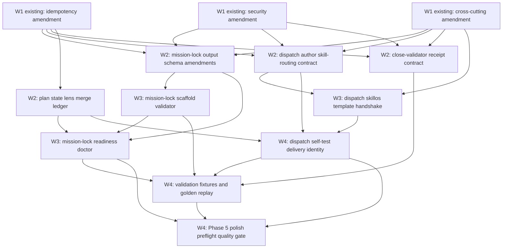

# Phase 4 DECOMPOSE - Mission-Lock Paradigm Extension Bead DAG

task_id: `phase4-decompose-mission-lock-paradigm-extension-2026-05-06`
parent_bead: `flywheel-plan-mission-lock-paradigm-extension-2026-05-06`
scope: plan-space-only
created_at: `2026-05-06T14:50:00Z`
socraticode_queries: 10
indexed_chunks_observed: 100

## Inputs

- Stable plan: `02-REFINE-r4.md`.
- Security audit: `03-AUDIT-r1-security.md`.
- Idempotency audit: `03-AUDIT-r1-idempotency.md`.
- Cross-cutting skill-routing audit: `03-AUDIT-r1-cross-cutting.md`.

Phase 3 produced 18 findings, 0 critical, 4 high, 11 medium, and 3 low. All
three lenses returned `auto_advance`; Phase 4 decomposes mitigations instead of
reopening Phase 2 architecture.

## Mermaid Graph

The graph is acyclic: every edge flows from Wave 1 to Wave 4, with no back-edge
to an earlier wave.

## Bead ID Table

| Wave | Bead ID | New? | Priority | Depends on | Summary |
|---:|---|---|---|---|---|
| 1 | `flywheel-mission-lock-security-negative-invariants-amendments-2026-05-06` | no | P0 | Phase 3 security audit | Existing amendment bead for packet secret bans, credential receipt markers, skillos trust boundary, close-validator immutability, least-privilege metadata, and blocked readiness for missing security invariants. |
| 1 | `flywheel-mission-lock-idempotency-receipt-integrity-amendments-2026-05-06` | no | P0 | Phase 3 idempotency audit | Existing amendment bead for deterministic identity keys, snapshot hashes, per-lens append rows, canonical receipt fields, duplicate-close policy, and readiness repair idempotency. |
| 1 | `flywheel-mission-lock-cross-cutting-skill-routing-amendments-2026-05-06` | no | P0 | Phase 3 cross-cutting audit | Existing amendment bead for routing resolver, discovery precedence, skillos handshake, receipt freshness stamps, overlays, and negative fixture coverage. |
| 2 | `flywheel-mission-lock-output-schema-amendments-2026-05-06` | yes | P0 | all Wave 1 amendments | Extend mission-lock output schema with security negative invariants, principal metadata, lifecycle fields, skill surface map, failure-mode matrix, and receipt identity envelope. |
| 2 | `flywheel-dispatch-author-skill-routing-contract-2026-05-06` | yes | P0 | all Wave 1 amendments | Define dispatch-author routing contract: deterministic class merge, discovery precedence, required overlays, secret-value bans, route receipts, and prompt-budget pruning rules. |
| 2 | `flywheel-close-validator-receipt-contract-2026-05-06` | yes | P0 | all Wave 1 amendments | Define close-validator receipt contract for skill receipts, stale-route checks, credential immutability, duplicate-close reconciliation, L112 hashes, and sanitized evidence joins. |
| 2 | `flywheel-plan-state-lens-merge-ledger-2026-05-06` | yes | P0 | idempotency amendment | Add per-lens append-only audit rows, `state_observed_sha`, merge semantics, and derived STATE summary preservation for parallel audit/close writers. |
| 3 | `flywheel-mission-lock-scaffold-validator-2026-05-06` | yes | P1 | output schema amendments | Implement read-only scaffold validator for required lock sections, section hashes, substrate inventory, negative invariants, and blocked-readiness diagnostics. |
| 3 | `flywheel-mission-lock-readiness-doctor-2026-05-06` | yes | P1 | output schema, state ledger, scaffold validator | Implement readiness doctor fields, legacy audit-only blocked-surface rules, repair receipt identity fields, and Phase 0 scaffold bead suggestions. |
| 3 | `flywheel-dispatch-skillos-template-handshake-2026-05-06` | yes | P1 | dispatch contract, cross-cutting amendment | Define and wire skillos request/ack JSONL schemas with TTL, idempotency key, producer version, stale/unavailable/duplicate states, and degraded fallback rules. |
| 4 | `flywheel-dispatch-self-test-delivery-identity-2026-05-06` | yes | P1 | dispatch contract, state ledger, skillos handshake | Implement dispatch self-test and delivery identity checks so repeated packets prove already-sent/already-complete instead of resending. |
| 4 | `flywheel-mission-lock-validation-fixtures-golden-replay-2026-05-06` | yes | P1 | close contract, scaffold validator, readiness doctor, delivery identity | Add golden fixtures for secret-negative cases, duplicate dispatch/close replay, stale skill routes, parallel STATE merge, and false-positive skill self-tests. |
| 4 | `flywheel-phase5-polish-preflight-quality-gate-2026-05-06` | yes | P2 | readiness doctor, delivery identity, golden replay | Build the Phase 5 preflight package: DAG/no-cycle check, bead description length check, coverage proof, L112 bundle, and 5-skill/three-judges quality receipt. |

New beads: 10. Existing amendment beads referenced: 3. Total DAG nodes: 13.

## Wave Breakdown

| Wave | Count | Parallelism | Completion gate |
|---:|---:|---|---|
| 1 | 3 existing | Can close independently by lens owner. | The three amendment beads exist and are referenced, not duplicated. |
| 2 | 4 new | Contract/schema beads can run in parallel after Wave 1. | Mission-lock, dispatch, close, and STATE contracts agree on identity and redaction envelope. |
| 3 | 3 new | Scaffold validator and skillos handshake can run in parallel; readiness doctor waits on scaffold and STATE contract. | Read-only validators and handshake schemas have fixtures and receipt fields. |
| 4 | 3 new | Delivery identity and golden replay can run after Wave 3; polish preflight waits for both. | Replay/coverage fixtures pass and Phase 5 can polish without reopening architecture. |

## Audit-Finding Coverage Map

| Finding | Severity | Covered by |
|---|---:|---|
| SEC-001 dispatch packet secret-value ban | high | security amendment; dispatch-author contract; delivery identity fixtures |
| SEC-002 credential-touching skill receipt marker | medium | security amendment; close-validator receipt contract; output schema |
| SEC-003 skillos trust boundary implicit | medium | security amendment; skillos handshake; dispatch-author contract |
| SEC-004 close-validator credential immutability | medium | security amendment; close-validator receipt contract; golden replay |
| SEC-005 least-privilege principal metadata | medium | security amendment; output schema; scaffold validator |
| SEC-006 legacy audit-only continuation on security surfaces | low | security amendment; readiness doctor |
| IDEM-001 duplicate dispatch without identity key | high | idempotency amendment; dispatch-author contract; delivery identity; golden replay |
| IDEM-002 receipt field names/schema version | medium | idempotency amendment; close-validator receipt contract; output schema |
| IDEM-003 skill-suite snapshot/hash drift | medium | idempotency amendment; dispatch-author contract; skillos handshake; golden replay |
| IDEM-004 shared STATE race between audit lenses | medium | idempotency amendment; plan state lens merge ledger; readiness doctor |
| IDEM-005 duplicate close/latest-row reconciliation | medium | idempotency amendment; close-validator receipt contract; golden replay |
| IDEM-006 readiness/scaffold repair receipt fields | low | idempotency amendment; scaffold validator; readiness doctor |
| CSR-001 multi-class routing merge ambiguity | high | cross-cutting amendment; dispatch-author contract; golden replay |
| CSR-002 discovery-source disagreement | high | cross-cutting amendment; dispatch-author contract; skillos handshake |
| CSR-003 incomplete skillos handshake protocol | medium | cross-cutting amendment; skillos handshake; delivery identity |
| CSR-004 stale skill references in old dispatches | medium | cross-cutting amendment; close-validator receipt contract; golden replay |
| CSR-005 missing cross-cutting overlays | medium | cross-cutting amendment; dispatch-author contract; readiness doctor |
| CSR-006 gameable dispatch self-test count heuristic | low | cross-cutting amendment; delivery identity; golden replay |

All 15 medium-or-higher findings map to at least one implementation bead and at
least one Phase 3 amendment bead.

## 3 Amendment-Bead Absorption

The three Phase 3 amendment beads are Wave 1 inputs, not duplicated work. Their
payloads are absorbed as follows:

1. Security amendment feeds mission-lock schema, dispatch packet contract, close
   immutability, scaffold principal metadata, and replay negative fixtures.
2. Idempotency amendment feeds the shared receipt identity envelope, STATE merge
   ledger, duplicate dispatch/close checks, and readiness repair receipt fields.
3. Cross-cutting amendment feeds skill-routing resolver rules, discovery
   precedence, skillos handshake, overlay selection, and negative self-test
   fixtures.

## Implementation Cost Estimate

| Wave | Estimate | Notes |
|---:|---:|---|
| 1 | 0-1 worker ticks | Existing beads only need ownership confirmation and close/update routing. |
| 2 | 4-6 worker ticks | Schema and contract work; high leverage and low runtime blast radius. |
| 3 | 5-7 worker ticks | Validator/doctor/handshake wiring with fixtures. |
| 4 | 5-8 worker ticks | Replay fixtures, dispatch identity behavior, and polish gate. |

Total estimated implementation cost: 14-22 worker ticks after Phase 4. Work is
parallelizable within each wave except where explicit dependencies require a
prior contract.

## Open Scope Items

1. Skillos transport shape remains external to this repo until the skillos
   producer side publishes an accepted schema endpoint or file path.
2. Readiness repair apply-mode stays disabled; this DAG only wires read-only
   validation and idempotent receipt fields.
3. Downstream target-repo fixture selection should be chosen by the first
   implementation wave that touches real target repos.

## Validation Notes

- New bead count is 10, within the accepted 8-15 range.
- Total DAG count is 13: 3 existing amendments plus 10 new beads.
- Wave count is 4.
- Open scope item count is 3.
- No bead summary in this artifact exceeds 800 characters.
- Phase 5 polish is eligible because Phase 4 has no cycles, all medium-or-higher
  findings are mapped, and the three existing amendment beads are referenced
  without duplication.
