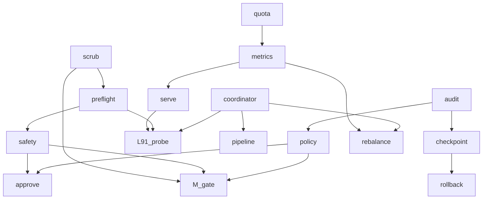

# RESEARCH-A - NTM surface migration prioritization

Task: `ntm-surface-migration-lane-a-2026-05-06`  
Mode: read-only prioritization layer over `/tmp/ntm-surface-audit-summary-2026-05-06.md`  
Socraticode: 10 searches, K=10 each, canonical path `/Users/josh/Developer/flywheel`, indexed chunks observed=989.

## Skills library cited

`/flywheel:skills-best-practices "ntm canonical cli observability migration" --top=10 --include-content` is not shell-executable in this Codex pane, so I used the documented fallback: skill-search query plus direct SKILL.md reads. Skills applied:

- `ntm`: robot-mode first, NTM verbs for pane/session substrate, Agent Mail reservations for worker edits.
- `canonical-cli-scoping`: preserve `--json`, help/info/examples, stable exit semantics, doctor/health/repair posture.
- `dispatch-tool-contracts`: dispatches are proof contracts, not prose prompts; callback proof must be machine-checkable.
- `observability-designer`: W1 must be SLI/telemetry substrate, not a dashboard vanity layer.
- `agent-orchestration`: coordinator/pipeline migration must preserve decomposition, dependency, and partial-failure semantics.
- `migration-architect`: phase by reversibility, parallel-run before supersession, keep rollback paths explicit.
- `donella-meadows-systems-thinking`: prioritize information flows, rules, and self-organization before low-leverage feature adoption.

Skills library gap: none. Note: `observability-platform` surfaced in search, while `observability-designer` existed and was read directly.

## Corpus reconciliation

Audit source says 12 workaround candidates + 16 highest-leverage candidates. The actual workaround list has 13 entries because `rotate` is also listed as `using_well`. The 13 workaround mentions plus 16 top mentions overlap on 12 surfaces, yielding 17 unique scored surfaces. I scored the deduped real corpus and did not add phantom rows.

Composite formula: `4*impact + 2*reversibility - 2*blast_radius - migration_cost`. Higher is better. Reversibility 5 means easy rollback; blast radius 5 means high risk.

## Criticality matrix

| surface | status | impact | reversibility | blast_radius | migration_cost | composite | wave |
|---|---|---:|---:|---:|---:|---:|---|
| scrub | not_using_unaware | 5 | 5 | 2 | 2 | 24 | W2 |
| quota | not_using_have_workaround | 5 | 4 | 2 | 2 | 22 | W1 |
| metrics | not_using_have_workaround | 5 | 4 | 2 | 3 | 21 | W1 |
| preflight | not_using_have_workaround | 5 | 4 | 3 | 2 | 20 | W2 |
| rotate | using_well | 4 | 5 | 3 | 1 | 19 | W0 |
| serve | not_using_have_workaround | 5 | 4 | 3 | 3 | 19 | W1 |
| safety | not_using_have_workaround | 4 | 4 | 3 | 3 | 15 | W2 |
| audit | not_using_have_workaround | 4 | 4 | 3 | 3 | 15 | W3b |
| approve | not_using_have_workaround | 4 | 3 | 3 | 3 | 13 | W2 |
| add | not_using_unaware | 2 | 5 | 2 | 2 | 12 | W4/no-fit |
| rebalance | not_using_unaware | 3 | 4 | 3 | 3 | 11 | W4 |
| ensemble | not_using_unaware | 3 | 4 | 3 | 3 | 11 | W4 |
| coordinator | not_using_have_workaround | 4 | 3 | 4 | 4 | 10 | W3a |
| policy | not_using_have_workaround | 4 | 3 | 4 | 4 | 10 | W3b |
| checkpoint | not_using_have_workaround | 3 | 4 | 4 | 3 | 9 | W3b |
| pipeline | not_using_have_workaround | 3 | 3 | 4 | 4 | 6 | W3a |
| rollback | not_using_have_workaround | 3 | 3 | 5 | 4 | 4 | W3b |

## Failure-mode taxonomy for audit top 16

- quota
  - Failure now: usage-limit panes are detected after stall symptoms, not before dispatch.
  - Migration risk: `/usage` support is agent-dependent, so JSON may be partial.
  - Acceptance probe: doctor exposes quota freshness and refuses capacity-risk dispatch only when two truth sources agree.
- serve
  - Failure now: fleet health is pull/poll heavy; silent failure detection waits for local scripts.
  - Migration risk: local HTTP/SSE introduces auth/bind-scope decisions.
  - Acceptance probe: localhost-only default, redacted JSON endpoints, and no public bind without explicit policy.
- preflight
  - Failure now: hand-rolled pre-send checks are split across dispatch validators and close validators.
  - Migration risk: native preflight may not know flywheel-specific mission-anchor fields.
  - Acceptance probe: wrapper runs native `ntm preflight --json` plus flywheel mission/two-truth checks before every send.
- rebalance
  - Failure now: skewed worker/backlog distribution is visible but not automatically routed.
  - Migration risk: native workload model may not understand bead priority and pane authorization.
  - Acceptance probe: dry-run recommendations compare against `br ready` and topology roles before any apply path.
- metrics
  - Failure now: fleet metrics exist in local scripts but lack one NTM-native success ledger.
  - Migration risk: metrics can become Goodhart-prone if they rank agents instead of system health.
  - Acceptance probe: doctor consumes counters as architecture-health inputs with trend and counterfactual context.
- coordinator
  - Failure now: cross-orch coordination lives in JSONL rows without native conflict/digest/assign semantics.
  - Migration risk: native coordinator may not preserve flywheel ownership fields.
  - Acceptance probe: parallel-run coordinator digest against `cross-orch-coordination.jsonl` for field parity before adoption.
- ensemble
  - Failure now: multi-model review rounds are hand-dispatched and callback-fragile.
  - Migration risk: ensemble can overproduce findings without bead/no-bead routing.
  - Acceptance probe: use only for bounded review packets with `export-findings` or explicit no-bead receipts.
- pipeline
  - Failure now: plan/refine/audit/polish/ship sequencing is slash-command convention plus plan files.
  - Migration risk: native pipeline state could collide with flywheel STATE/receipt authority.
  - Acceptance probe: run read-only dry-run pipeline for a plan arc and prove mission-lock receipts survive unchanged.
- approve
  - Failure now: Joshua-decision-needed gates are prose callbacks and can lose exact evidence/question fields.
  - Migration risk: native approval token must not become a credential or secret channel.
  - Acceptance probe: approval requests carry exact question, evidence path, expiry, and forbidden operations.
- safety
  - Failure now: dcg and dispatch validators cover dangerous commands, while NTM-specific safety is not unified.
  - Migration risk: do not weaken dcg or create a bypass path with `--allow-secret`.
  - Acceptance probe: native `ntm safety check` is additive, with dcg still authoritative for destructive command guard.
- scrub
  - Failure now: packets and callbacks can mention secret classes safely, but scrub evidence is not uniformly native.
  - Migration risk: redaction must never print raw matches or tokens.
  - Acceptance probe: `ntm scrub --json` scans dispatch/callback artifacts and reports placeholders only.
- policy
  - Failure now: L-rules, scripts, and validators encode policy in several substrates.
  - Migration risk: native policy config may be less expressive than flywheel doctrine.
  - Acceptance probe: map one rule class at a time; audit validates config and records non-migrated rules explicitly.
- audit
  - Failure now: closeout proof is spread across reports, validators, callbacks, and JSONL.
  - Migration risk: native audit hash-chain must not replace domain-specific acceptance gates.
  - Acceptance probe: `ntm audit verify/export --json` becomes an additional receipt consistency pass before close.
- checkpoint
  - Failure now: STATE.md and closeout receipts act as manual checkpoints for session/work state.
  - Migration risk: checkpoint capture includes scrollback and git state, so storage and secret scrub boundaries matter.
  - Acceptance probe: save before high-risk recovery, verify integrity, and scrub/export only redacted evidence.
- rollback
  - Failure now: rollback uses git/worktree convention and receipt supersession rather than NTM-native recovery.
  - Migration risk: highest blast radius because rollback mutates session and possibly git state.
  - Acceptance probe: only after checkpoint verification; default `--dry-run`; require explicit approval for apply.
- add
  - Failure now: no current flywheel workflow needs native agent addition beyond existing dispatch/spawn discipline.
  - Migration risk: adding agents can bypass Agent Mail identity, topology, and reservation gates.
  - Acceptance probe: keep as W4/no-fit until a concrete topology-expansion bead defines identity and reservation checks.

## Wave validation

Overall verdict: SPLIT.

- W0 ADOPT: skillos K/L/L29 are orthogonal to NTM utilization, and `rotate` is already `using_well`; Wave 0 is conformance-only, not a reimplementation wave.
- W1 MODIFY: quota+metrics+serve are cohesive Tesla telemetry, but order should be `quota` and `metrics` producers first, then `serve` exposure with localhost/auth defaults.
- W2 MODIFY: preflight+scrub+safety+approve are one dispatch-hardening wave, ordered `scrub -> preflight -> safety -> approve`; approval must be last because it relies on the evidence scrub/preflight/safety produce.
- W3 SPLIT: split into W3a coordination (`coordinator`, `pipeline`) and W3b receipt/control (`audit`, `policy`, `checkpoint`, `rollback`). These have different authority and blast-radius profiles.
- W4 ADOPT: triage not-using-unaware after W1-W3 prove native shape; `add` remains no-fit, while `rebalance` and `ensemble` get dry-run pilots only.

## Dependency graph

Dependency edges: 18.

## Skillos batch wave assignment

- K SIGTERM-trap: W0, promote now; no NTM collision.
- L surgical-bound bulk mutation breaker: W0, promote now; no NTM collision.
- L29 raw-tmux audit pattern: W0, promote now as anti-pattern scan around NTM-only doctrine.
- M shared-library pre-commit gate: W3b, because native `policy` plus `scrub` decide whether this becomes a hook wrapper or a policy-backed audit gate.
- L91 four-state probes: W3a implementation wrapper with W2 `preflight` and W1 `serve` prerequisites; probes should wrap native events, not reimplement event-state if native output is sufficient.

## Three judges sniff scores

- Jeff composite: 8.6/10. Strong reuse of native NTM surfaces; main weakness is native/help-level evidence, so implementation waves still need copy-test receipts.
- Donella: 9.0/10. Best leverage is information flows in W1, rules in W2/W3b, and self-organization in W3a/W4.
- Joshua: 8.8/10. Practical, no source-code churn, and the corpus mismatch is made explicit instead of hidden.

Self-grade: 8.8/10.

## Ladder pass

- Reuse-before-build: pass; every migration candidate wraps or parallel-runs native NTM first.
- Socraticode-first: pass; 10 K=10 searches, 989 indexed chunks observed.
- NTM-only pane operations: pass; callback uses `ntm send`, no raw pane substrate.
- Agent Mail reservation: pass; output path reserved before write, release required after callback.
- Secret safety: pass; no secret values, tokens, bearer strings, or raw env output in artifact.
- Source mutation scope: pass; only this plan artifact written.
- Workaround note: dispatch named `.flywheel/scripts/dispatch-pre-send-validator.sh`, but repo-local path is absent; actual shared wrapper is `/Users/josh/.claude/commands/flywheel/_shared/dispatch-pre-send-validator.sh`, delegating to `.flywheel/scripts/two-truth-sources-validator.sh`.

L112: `OK_ntm_surface_migration_lane_a`

Mission-anchor: continuous-orchestrator-uptime-self-sustaining-fleet
