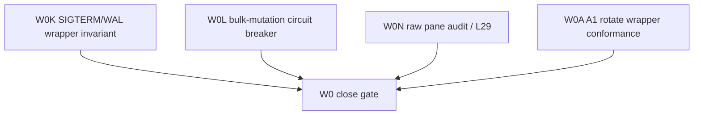
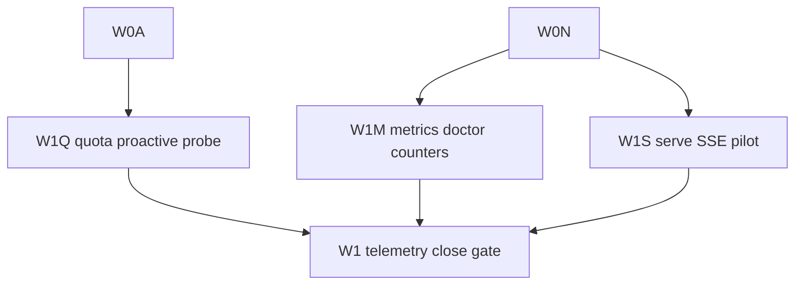
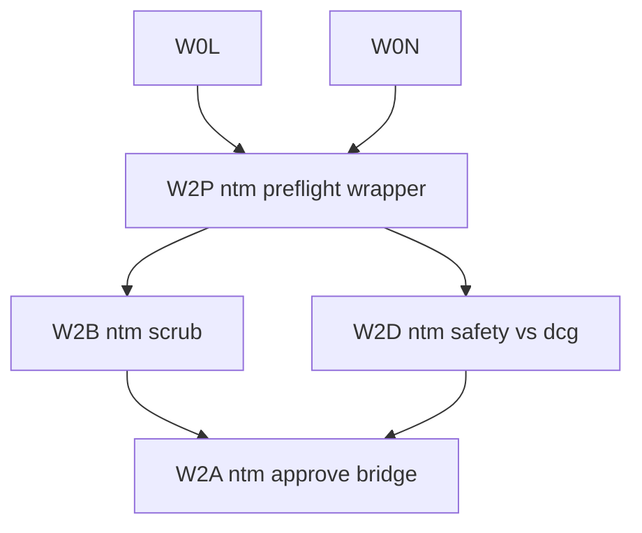
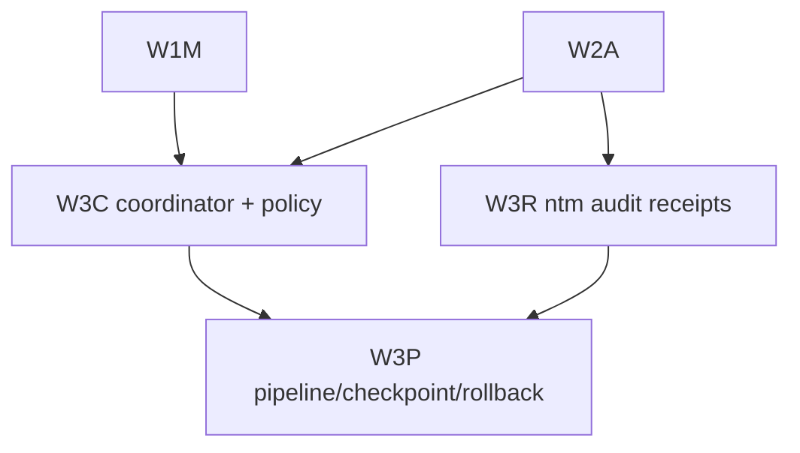
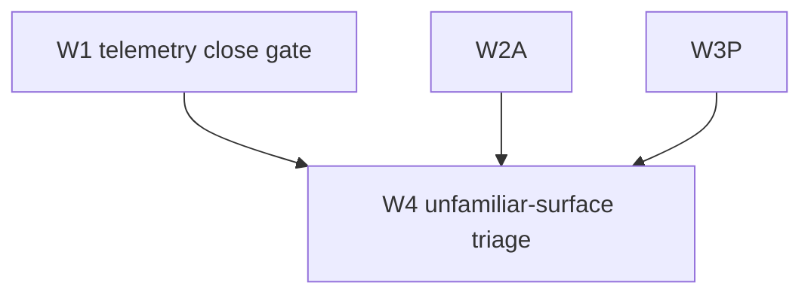
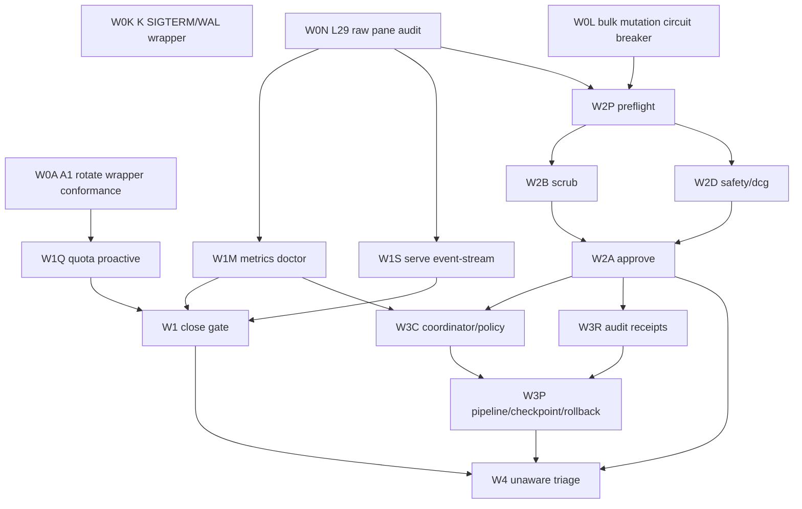

# Lane C Research - Implementation Design

Task: `ntm-surface-migration-lane-c-2026-05-06`  
Plan: `ntm-surface-utilization-migration-2026-05-06`  
Lane: C, implementation design + bead DAG draft  
Mode: plan-space; no runtime source changes  

## Skills Library Cited

Adopted skills:

- `beads-workflow`: bead DAG fields, dependencies, testable close criteria.
- `migration-architect`: phased migration, parallel-run, rollback gates.
- `testing-conformance-harnesses`: native-vs-wrapper differential tests, golden fixtures, coverage matrix.
- `dispatch-tool-contracts`: worker preflight, file reservations, callback envelope, L91/L120 ordering.
- `canonical-cli-scoping`: flag mapping, `--json`, `--dry-run`, doctor/health/repair expectations for wrappers.
- `safe-migrations`: reversible rollout, expand-contract discipline, rollback before cutover.
- `agent-orchestration`: dependency graph and fan-out/fan-in workflow shape.

Skill search also surfaced `socraticode`, `codebase-audit`, `deployment-strategy`, and
`backward-compatibility`; these are useful support skills but not primary.  
`skills_library_gap=none`.

Freshness notes:

- `migration-architect/LATEST.md` has no actionable recent delta beyond a tracked AWS feed refresh.
- `agent-orchestration/LATEST.md` has pending summaries but no concrete instruction that changes this plan.

Socraticode survey:

- `socraticode_queries=10`, each with `limit=10`.
- Key constraints found: L91 four-state dispatch receipts, L120 `br_close_executed`, canonical CLI dispatch validator, `ntm-fleet-health.sh` tests, close-validator/four-lens gates, and prior 13-15 bead plan DAG patterns.

## Design Premise

This migration is not "replace every workaround immediately." It is an expand-contract migration from hand-rolled flywheel substrate to native `ntm` surfaces with differential tests before any cutover.

The 109-surface audit showed:

- `using_well=14`
- `using_partial=9`
- `not_using_have_workaround=12`
- `not_using_unaware=74`
- `a1_collision_with_ntm_rotate=true`, informational because A1 shipped as wrapper.

The executable plan keeps active beads at 15 by grouping tightly-coupled surfaces:

- W0: orthogonal shippables and wrapper conformance.
- W1: telemetry trio.
- W2: dispatch hardening.
- W3: coordination/audit/policy substrate.
- W4: `not_using_unaware` triage.

## Wave-by-Wave Decomposition

### W0 - Orthogonal Shippables + A1 Wrapper Conformance

Purpose: ship already-proven skillos/flywheel invariants before touching larger migration waves.

Beads:

| Key | Bead ID | Title | Depends on | Dispatch shape |
|---|---|---|---|---|
| W0K | `flywheel-ntm-migrate-w0-k-sigterm-wrapper-2026-05-06` | Fold K SIGTERM/WAL wrapper invariant into flywheel doctor contract | none | parallel |
| W0L | `flywheel-ntm-migrate-w0-l-bulk-bound-2026-05-06` | Fold L surgical-bound bulk mutation circuit breaker into dispatch contracts | none | parallel |
| W0N | `flywheel-ntm-migrate-w0-l29-raw-pane-audit-2026-05-06` | Fold L29 raw pane operation audit into ntm-only migration gates | none | parallel |
| W0A | `flywheel-ntm-migrate-w0-a1-rotate-wrapper-conformance-2026-05-06` | Prove A1 delegates to native `ntm rotate` without credential rotation authority | none | parallel |

Mermaid:



Test command and fixture:

```bash
bash .flywheel/tests/test_caam_auto_rotate_on_usage_limit.sh
rg -n 'L29|ntm-only|raw pane' AGENTS.md templates/flywheel-install/AGENTS.md
rg -n 'trap.*SIGTERM|circuit_breaker|br_close_executed|ntm rotate' .flywheel scripts templates AGENTS.md
```

Acceptance fixture: one JSON receipt per fold-in showing source proposal path, target contract path, and non-overlap with skillos-owned implementation files.

Rollback path: revert the fold-in contract rows or disable the doctor invariant flag; A1 wrapper keeps `--dry-run` default and can fall back to current CAAM profile selection with `ntm_rotate_subprocess_rc=null`.

W0 orthogonal-shippable detail:

- K source: `~/.claude/skills/.flywheel/proposals/K-jsm-wrapper-killed-mid-sync-via-kickstart-2026-05-06.md`.
- L source: `~/.claude/skills/.flywheel/proposals/L-scope-creep-on-frontmatter-sweep-2026-05-06.md`.
- L29 source: canonical `AGENTS.md` L29 plus raw pane operation audit evidence.
- Cross-repo coordination: send one `cross_orch_coord` row to `skillos:1` with `consumer=flywheel`, `producer=skillos`, `contract_only=true`, and exact paths adopted.
- M and L91 are not W0 standalone beads: M feeds W2 write-side gate acceptance, and L91 is already a dispatch receipt invariant used by every wave.

### W1 - Tesla Telemetry Trio

Purpose: move capacity and health signals from reactive scripts to native `ntm` telemetry.

Beads:

| Key | Bead ID | Title | Depends on | Dispatch shape |
|---|---|---|---|---|
| W1Q | `flywheel-ntm-migrate-w1-quota-proactive-2026-05-06` | Add `ntm quota --json` proactive quota probe before dispatch | W0A | parallel after W0 |
| W1M | `flywheel-ntm-migrate-w1-metrics-doctor-2026-05-06` | Wire `ntm metrics show/export` into doctor closeout counters | W0N | parallel after W0 |
| W1S | `flywheel-ntm-migrate-w1-serve-eventstream-2026-05-06` | Pilot `ntm serve` local SSE/REST read-only fleet status bridge | W0N | parallel after W0 |

Mermaid:



Test command and fixture:

```bash
/Users/josh/.local/bin/ntm quota flywheel --json > /tmp/w1-quota.json || true
/Users/josh/.local/bin/ntm metrics show --json > /tmp/w1-metrics.json || true
timeout 5 /Users/josh/.local/bin/ntm serve --host 127.0.0.1 --port 7337 --auth-mode local >/tmp/w1-serve.log 2>&1 || true
bash tests/ntm-fleet-health-apply-gate-test.sh
```

Acceptance fixture: differential rows comparing current `ntm-fleet-health.sh` ledger fields to native `quota`, `metrics`, and `/api/robot/health` payloads. Done only when missing/empty/error states are represented.

Rollback path: retain `ntm-fleet-health.sh` as the authoritative doctor input and gate native telemetry behind `NTM_NATIVE_TELEMETRY=1` until two consecutive green ticks.

### W2 - Dispatch Hardening

Purpose: migrate pre-send and pre-close gates to native `ntm` safety surfaces without weakening existing flywheel validators.

Beads:

| Key | Bead ID | Title | Depends on | Dispatch shape |
|---|---|---|---|---|
| W2P | `flywheel-ntm-migrate-w2-preflight-wrapper-2026-05-06` | Put `ntm preflight` before dispatch packet send | W0L, W0N | sequential first |
| W2B | `flywheel-ntm-migrate-w2-scrub-secret-scan-2026-05-06` | Add `ntm scrub` to packet/callback secret-scan path | W2P | parallel |
| W2D | `flywheel-ntm-migrate-w2-safety-dcg-sibling-2026-05-06` | Compare `ntm safety check` with dcg and encode divergence policy | W2P | parallel |
| W2A | `flywheel-ntm-migrate-w2-approve-human-gates-2026-05-06` | Route human approval tokens through `ntm approve` where exact evidence survives | W2B, W2D | sequential close |

Mermaid:



Test command and fixture:

```bash
printf '%s\n' 'test prompt' | /Users/josh/.local/bin/ntm preflight - --json
/Users/josh/.local/bin/ntm scrub --path /tmp --since 1h --json
/Users/josh/.local/bin/ntm safety check 'git reset --hard' --json || true
/Users/josh/.local/bin/ntm approve list --json || true
bash tests/validate-callback-before-close.sh
bash .flywheel/tests/test-dispatch-canonical-cli-validator.sh
```

Acceptance fixture: a 4-case conformance matrix: safe prompt, oversized prompt, secret-like prompt, destructive-command prompt. Native `ntm` verdict must match or be stricter than current flywheel gate. Any stricter native block must file a follow-up bead or explicit `no_bead_reason`.

Rollback path: keep existing `validate-callback-before-close.sh`, `dispatch-pre-send-validator.sh`, and dcg as hard gates; run native checks advisory-only until parity matrix is green.

M fold-in:

- M (`cross-repo-skill-library-no-write-side-gate`) is consumed by W2B/W2P as the write-side gate requirement: validators must run at write boundary, not only post-hoc.
- The migration must not add direct writes to `~/.claude/skills/`; it only cites the gate as acceptance precedent.

### W3 - Coordination, Audit, Policy, Pipeline, Checkpoint, Rollback

Purpose: replace scattered coordination and receipt ledgers with native `ntm` primitives where native coverage is strong enough.

Beads:

| Key | Bead ID | Title | Depends on | Dispatch shape |
|---|---|---|---|---|
| W3C | `flywheel-ntm-migrate-w3-coordinator-policy-2026-05-06` | Evaluate `ntm coordinator` + `ntm policy` as first-class coordination/rules substrate | W1M, W2A | parallel |
| W3R | `flywheel-ntm-migrate-w3-audit-receipts-2026-05-06` | Map native `ntm audit verify/export` to flywheel receipt validation | W2A | parallel |
| W3P | `flywheel-ntm-migrate-w3-pipeline-checkpoint-rollback-2026-05-06` | Pilot `ntm pipeline` with checkpoint/rollback guarded by dry-run receipts | W3C, W3R | sequential |

Mermaid:



Test command and fixture:

```bash
/Users/josh/.local/bin/ntm coordinator status flywheel --json || true
/Users/josh/.local/bin/ntm policy validate --json || true
/Users/josh/.local/bin/ntm audit verify flywheel --json || true
/Users/josh/.local/bin/ntm checkpoint save flywheel -m ntm-surface-migration-dry-run --json --dry-run 2>/dev/null || true
/Users/josh/.local/bin/ntm rollback flywheel last --dry-run --json || true
```

Acceptance fixture: one synthetic migration pipeline YAML/TOML whose stages use existing dispatch wrappers. It must produce a checkpoint id, audit hash-chain verification, and rollback dry-run preview before any mutating run is allowed.

Rollback path: continue using `cross-orch-coordination.jsonl`, `.flywheel/STATE.md`, and existing close receipts as source of truth. Native `pipeline/checkpoint/rollback` stays advisory until it proves clean worktree postcheck, checkpoint integrity, and no untracked mutation.

### W4 - Not-Using-Unaware Triage

Purpose: prevent 74 unfamiliar surfaces from turning into random implementation work.

Bead:

| Key | Bead ID | Title | Depends on | Dispatch shape |
|---|---|---|---|---|
| W4T | `flywheel-ntm-migrate-w4-unaware-triage-2026-05-06` | Triage 74 `not_using_unaware` surfaces; promote assign/rebalance/ensemble only if concrete fit passes | W1DONE, W2A, W3P | final |

Mermaid:



Test command and fixture:

```bash
/Users/josh/.local/bin/ntm assign flywheel --dry-run --json || true
/Users/josh/.local/bin/ntm rebalance flywheel --dry-run --format json || true
/Users/josh/.local/bin/ntm ensemble suggest "which ntm surfaces should flywheel adopt next?" --json || true
```

Acceptance fixture: triage CSV/JSON with columns `surface`, `fit`, `owner`, `decision`, `next_bead_or_no_bead_reason`. Only `assign`, `rebalance`, and `ensemble` are allowed to become W4 implementation candidates without a new plan arc.

Rollback path: no runtime rollback needed; W4 is decision substrate. If triage produces noisy recommendations, mark surfaces `no_fit_for_now` and leave the 109 audit beads open for later polish.

## Full Bead DAG Draft



Cap check: 15 active beads exactly. Fits one plan arc if Phase 4 polish keeps the grouped beads intact. If Phase 3 audit finds W3 native checkpoint/rollback has unsafe edge cases, split W3 into a follow-on plan arc and keep this plan to W0-W2+W4 triage.

## Per-Bead Acceptance Criteria Template

Every implementation bead should include:

- File reservations: exact paths; no broad globs. Native `ntm` dry-run probes need no reservation.
- Tests: one native `ntm <surface> --help`/`--json` probe, one current-wrapper fixture, one differential assertion.
- Callback: `DONE <bead> tests=PASS br_close_executed=yes callback_delivery_verified=true socraticode_queries=N l112_observed=<token>`.
- Four-lens validation: evidence file passes `validate-callback-before-close.sh --json`; no `didnt=none` unless every acceptance gate is audited.
- `br_close` path: run `br close <id> --reason "<score + tests + AUTONOMY>"` before callback, or append JSONL fallback only if br DB is unavailable and report fallback.
- Rollback: explicit env flag or source-of-truth switch that restores current workaround as authoritative.

Worked examples:

### W0 Worked Example

`flywheel-ntm-migrate-w0-a1-rotate-wrapper-conformance-2026-05-06`

- Reserve `.flywheel/scripts/caam-auto-rotate-on-usage-limit.sh`, `.flywheel/tests/test_caam_auto_rotate_on_usage_limit.sh`.
- Test: fake `ntm rotate` records argv; fixture proves wrapper calls `ntm rotate <session> --pane=<pane> --dry-run|--preserve-context` and never creates credentials.
- Accept: `secret_values_observed=0`, `authorized_operations` excludes token rotation, fallback behavior preserves current CAAM selector.
- Rollback: disable native subprocess call with `CAAM_AUTO_ROTATE_NATIVE_NTM=0`.

### W1 Worked Example

`flywheel-ntm-migrate-w1-quota-proactive-2026-05-06`

- Reserve tick/doctor files that consume quota, not `ntm`.
- Test: fixture with healthy quota, warning quota, unsupported agent, and malformed `/usage` output.
- Accept: warning quota blocks new dispatch before capacity halt, unsupported agent degrades to current detector path.
- Rollback: unset `NTM_NATIVE_QUOTA=1`; existing capacity-halt detector remains source of truth.

### W2 Worked Example

`flywheel-ntm-migrate-w2-preflight-wrapper-2026-05-06`

- Reserve dispatch pre-send wrapper and validator tests.
- Test: safe, oversized, secret-like, destructive command prompts.
- Accept: native verdict equals or is stricter than current wrapper; stricter verdict has durable finding route.
- Rollback: native preflight advisory-only, existing wrapper blocks.

### W3 Worked Example

`flywheel-ntm-migrate-w3-pipeline-checkpoint-rollback-2026-05-06`

- Reserve only generated pipeline fixture and tests.
- Test: `ntm pipeline run --dry-run`, `ntm checkpoint verify`, `ntm rollback --dry-run`.
- Accept: no git worktree mutation during dry-run; checkpoint id is audit-linked; rollback preview names exact files it would touch.
- Rollback: keep manual `/flywheel:plan` and `.flywheel/STATE.md` flow authoritative.

### W4 Worked Example

`flywheel-ntm-migrate-w4-unaware-triage-2026-05-06`

- Reserve triage artifact only.
- Test: rerun 74-surface classification from `.beads/issues.jsonl` and confirm every row has `decision`.
- Accept: no implementation beads filed without fit + owner + test surface; `assign/rebalance/ensemble` get explicit candidates or no-fit reasons.
- Rollback: decision-only; supersede triage row with corrected classification.

## Migration Risk Register

| Risk | Likelihood | Impact | Mitigation | Rollback |
|---|---|---:|---|---|
| Native `ntm` command behavior drifts by version | Medium | High | Capture `ntm version` in every fixture; pin expected flags from `--help`; fail advisory on unknown version | Re-enable workaround source of truth env flag |
| Native output omits flywheel-specific fields | High | Medium | Differential tests require either field parity or explicit enrichment wrapper | Keep wrapper and store native output as supplemental field |
| `ntm serve` introduces long-running daemon complexity | Medium | Medium | W1S is read-only pilot on localhost with auth-mode local; no launchd install in first bead | Stop process; doctor consumes old ledger |
| `ntm preflight` false-positives block valid dispatch | Medium | High | Advisory shadow mode first; strict only after 20 clean dispatches or explicit Phase 5 green light | Existing dispatch pre-send validator remains hard gate |
| `ntm scrub` misses repo-specific secret classes | Medium | High | Compare against existing SEC-001 classes and dcg/Infisical references; missing class files a follow-up | Keep current scrub contract hard gate |
| `ntm safety` conflicts with dcg | Medium | High | Divergence policy: stricter gate wins; dcg never weakened | Ignore native safety decision; record divergence |
| `ntm approve` loses exact human question/evidence | Medium | High | Require token payload includes `human_question`, evidence path, expiry, decision source | Existing Joshua-decision callback path remains canonical |
| `ntm coordinator` duplicates cross-orch ledger state | Medium | Medium | One-way shadow comparison for two ticks before migration | `cross-orch-coordination.jsonl` remains source of truth |
| `ntm audit` hash-chain differs from flywheel receipts | Low | Medium | Treat as sibling evidence, not replacement, until verify/export passes | Existing receipt validators remain hard gate |
| Checkpoint/rollback touches dirty worktree | Medium | Critical | Dry-run first, clean-worktree postcheck, reservation check, no `--force` in worker beads | Abort rollback; use manual git recovery |
| W4 triage bloats beyond cap | High | Medium | W4 is decision-only; new implementation candidates require new plan arc | Supersede triage artifact, no source changes |
| Agent callback misses close step | Medium | High | L120 field required; dispatch template includes close before callback | Orchestrator rejects callback and re-dispatches close-only |

## Test Plan by Wave

| Wave | Done correctly means | Required proof |
|---|---|---|
| W0 | Skillos K/L/L29 and A1 wrapper are folded as contracts without cross-repo writes | proposal refs, contract paths, A1 native argv fixture |
| W1 | Native telemetry is equal or better as an information source, but current ledger still works | differential telemetry matrix, `ntm-fleet-health` tests green |
| W2 | Native hardening blocks the same unsafe cases or stricter, with no weaker path than current gates | four-case preflight/scrub/safety matrix, close-validator green |
| W3 | Native coordination/audit/pipeline/checkpoint is shadow-proven before any authoritative cutover | dry-run pipeline fixture, audit verify, rollback preview, clean worktree postcheck |
| W4 | Every unfamiliar surface has a durable decision and no random implementation escapes | 74-row triage artifact with `decision` and `next_bead_or_no_bead_reason` |

## Cap-Check Verdict

`cap_verdict=fits_one_plan`.

This fits one plan arc at exactly 15 beads because grouped beads share one migration risk and one rollback switch per group. If audit or polish splits W3 checkpoint/rollback out for safety, the fallback verdict becomes `needs_plan_of_plans` with W3 as a separate safety plan.

## Three-Judges Sniff

| Judge | Score | Rationale |
|---|---:|---|
| Jeff | 8 | Strong CLI-native migration and rollback discipline; wants more exact upstream `ntm` fixtures during Phase 4. |
| Donella | 9 | Moves information flows and rules upstream while preserving self-organization; avoids random surface adoption. |
| Joshua | 8 | Pragmatic cap, keeps momentum, no overbuild; W3 still needs tight safety polish before execution. |

Composite: 8.3/10.

## Ladder Pass

Lane C spec checklist:

- Wave-by-wave decomposition: pass, W0-W4 covered.
- Bead DAG draft: pass, 15 beads and full mermaid DAG.
- Test plan per wave: pass, native-vs-wrapper/differential proof specified.
- Migration risk register: pass, 12 rows.
- W0 orthogonal detail: pass, K/L/L29 and A1 wrapper conformance included.
- Per-bead acceptance criteria: pass, template plus one worked example per wave.
- Cap check: pass, `fits_one_plan`.
- Three-judges sniff: pass.
- Mission anchor present: pass.

L112: `OK_ntm_surface_migration_lane_c`

Mission-anchor: continuous-orchestrator-uptime-self-sustaining-fleet
