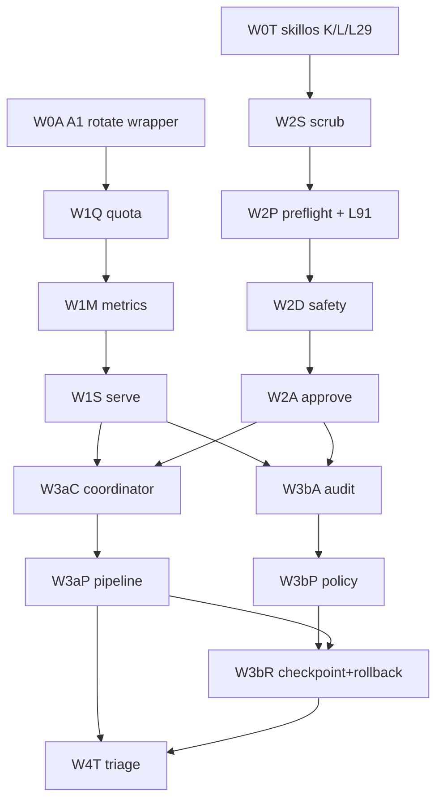

# NTM Surface Utilization Migration - Refine r1

task_id: ntm-surface-migration-refine-r1-2026-05-06  
date: 2026-05-06  
status: convergence_ratified  
mission_anchor: continuous-orchestrator-uptime-self-sustaining-fleet

## 1. Skills Library Cited

- `ntm`: canonical pane/session surface, robot mode, policy/approve/checkpoint/rollback, Agent Mail coordination.
- `canonical-cli-scoping`: every adopted surface needs doctor/health/validate/audit/repair shape, stable exit codes, `--json`, and dry-run/explain where mutating.
- `dispatch-tool-contracts`: dispatch packets are executable contracts; callbacks must prove invariant fields and distinguish Socraticode K from query count.
- `observability-designer`: W1 telemetry must produce actionable SLI/SLO signals, not dashboards without operational decisions.
- `agent-orchestration`: W3 coordination must model DAG ownership, fan-out/fan-in, failure containment, and shared-state boundaries.
- `migration-architect`: phased migration, expand/contract, parallel run, circuit-breaker, and rollback per bead.

## 2. Mission Anchor

The migration target is not "use more NTM commands." The target is fewer brittle local wrappers, fewer invisible dispatch failures, and more native, inspectable control loops for continuous orchestrator uptime. Native NTM surfaces are adopted where they reduce silent failure modes or make recovery state observable. Wrappers remain where they preserve flywheel-specific evidence fields or enforce L-rules that NTM does not own.

Mission anchor: `continuous-orchestrator-uptime-self-sustaining-fleet`

## 3. Final Wave Structure

### W0 - Orthogonal Shippable

W0 contains low-dependency correctness fixes that can land before telemetry or dispatch hardening:

- Skillos K/L/L29 conformance: replace drift-prone operational pane handling with native NTM verbs and positive-only L29 wording.
- Flywheel A1 wrapper conformance: keep the shipped CAAM wrapper shape, but prove it delegates to native `ntm rotate` and preserves flywheel callback fields.

### W1 - Tesla Telemetry, Sequential

W1 is ordered because each layer consumes the prior signal:

1. `quota`: proactive capacity/usage visibility before sessions hit hard limits.
2. `metrics`: common counters and doctor fields over quota and transport activity.
3. `serve`: eventstream/control-plane visibility over the metrics substrate.

### W2 - Dispatch Hardening, Sequential

W2 closes the highest-value failure path before richer orchestration:

1. `scrub`: remove preventable secret/prompt leakage before dispatch.
2. `preflight`: validate dispatch contract before send; L91 folds in here as a wrapper requiring prompt-visible/work-start evidence, not transport-only success.
3. `safety`: integrate native NTM checks with DCG as authority.
4. `approve`: preserve exact human-gate question/evidence and forbid ambiguous escalation.

### W3a - Coordination

W3a remains separate from W3b because coordination changes scheduling behavior:

1. `coordinator`: shadow-mode native coordination for active panes and peer orchestrators.
2. `pipeline`: native DAG execution only after coordinator evidence is stable.

### W3b - Receipt and Control

W3b handles accountability and reversible state:

1. `audit`: canonical receipt and event ledger.
2. `policy`: explicit contract validation and reusable rule checks, including the hybrid M path.
3. `checkpoint + rollback`: one atomic bead because rollback without checkpoint semantics is false safety.

### W4 - Unaware Triage

W4 happens after W1-W3 evidence exists:

- dry-run `rebalance` and `ensemble` recommendations over real telemetry and coordination state.
- `add` is no-fit for this plan; it remains excluded unless a later audit identifies an actual orchestration gap.

## 4. Definitive Bead DAG

Total beads: 15.

| ID | Wave | Title | Depends On |
|---|---:|---|---|
| W0T | W0 | `flywheel-ntm-migrate-w0-skillos-orthogonal-trio-2026-05-06` | none |
| W0A | W0 | `flywheel-ntm-migrate-w0-a1-rotate-wrapper-conformance-2026-05-06` | none |
| W1Q | W1 | `flywheel-ntm-migrate-w1-quota-proactive-2026-05-06` | W0A |
| W1M | W1 | `flywheel-ntm-migrate-w1-metrics-doctor-2026-05-06` | W1Q |
| W1S | W1 | `flywheel-ntm-migrate-w1-serve-eventstream-2026-05-06` | W1M |
| W2S | W2 | `flywheel-ntm-migrate-w2-scrub-secret-scan-2026-05-06` | W0T |
| W2P | W2 | `flywheel-ntm-migrate-w2-preflight-l91-wrapper-2026-05-06` | W2S |
| W2D | W2 | `flywheel-ntm-migrate-w2-safety-dcg-sibling-2026-05-06` | W2P |
| W2A | W2 | `flywheel-ntm-migrate-w2-approve-human-gates-2026-05-06` | W2D |
| W3aC | W3a | `flywheel-ntm-migrate-w3a-coordinator-shadow-2026-05-06` | W1S, W2A |
| W3aP | W3a | `flywheel-ntm-migrate-w3a-pipeline-shadow-2026-05-06` | W3aC |
| W3bA | W3b | `flywheel-ntm-migrate-w3b-audit-receipts-2026-05-06` | W1S, W2A |
| W3bP | W3b | `flywheel-ntm-migrate-w3b-policy-contracts-2026-05-06` | W3bA |
| W3bR | W3b | `flywheel-ntm-migrate-w3b-checkpoint-rollback-2026-05-06` | W3bP, W3aP |
| W4T | W4 | `flywheel-ntm-migrate-w4-unaware-triage-2026-05-06` | W3aP, W3bR |

## 5. Cross-Cutting Findings Consolidated

1. Native-first, wrapper-kept: adopt native NTM surfaces where they own the primitive; keep wrappers only to preserve flywheel evidence, callbacks, or L-rule gates.
2. Pre-send and post-send are different invariants: `ntm send` can prove transport accepted, while L91 needs prompt visible and work started.
3. Telemetry is a dependency, not polish: W3 and W4 need quota/metrics/serve evidence before they can avoid guesswork.
4. DCG remains authority: NTM safety may preflight, explain, and classify, but destructive command authority stays with DCG.
5. Policy is contract enforcement, not prose: M-class validation becomes hybrid W2/W3b, with preflight checks and W3b reusable policy receipts.
6. Coordination waits for dispatch hardening: coordinator/pipeline before W2 would amplify prompt-delivery and approval bugs.
7. Audit and scrub are closeout prerequisites: receipts that can leak secrets or omit hashes cannot be canonical.
8. Scaling surfaces are post-parity: rebalance/ensemble are W4 dry-run triage; `add` is excluded.

## 6. Acceptance Criteria Template and Worked Examples

Template for every bead:

- Native surface named, versioned, and invoked in at least one acceptance probe.
- Wrapper delta is explicit: removed, retained, or narrowed with reason.
- JSON output includes top-level `status`, `scope`, `checked_at`, `findings`, and bead-specific evidence fields.
- Negative invariant covered: stale topology, missing prompt evidence, dirty worktree, denied approval, or leaked secret class as applicable.
- Rollback path executed or dry-run validated.
- L112-style sentinel emitted when the bead closes.

Worked examples:

- W0 example W0A: `caam-auto-rotate` delegates to native `ntm rotate`, preserves `ntm_rotate_subprocess_rc`, and emits wrapper-owned flywheel callback fields. Negative test: native rotate fails and wrapper reports non-zero without hiding stderr.
- W1 example W1Q: `ntm quota --json` emits `status`, `capacity_class`, `remaining_units`, `window_reset_at`, and `source`. Negative test: unknown provider returns `warn` with no hard stop unless configured.
- W2 example W2P: dispatch preflight fails if only transport proof exists. It passes only when `transport_accepted`, `prompt_visible_in_target`, `prompt_submitted`, and `work_started` are all fresh within the configured window.
- W3a example W3aC: coordinator shadow mode recommends owner/pane routing but does not mutate active dispatch state. Negative test: conflicting owners produce `warn` plus no-op recommendation.
- W3b example W3bR: checkpoint refuses rollback on dirty worktree unless the dirty paths are explicitly scoped and preserved. Negative test: untracked unrelated file prevents destructive rollback.
- W4 example W4T: rebalance/ensemble run dry-run over W1-W3 receipts and produce recommendations only. Negative test: `add` candidate is classified `no_fit` unless a bead cites a missing native primitive.

## 7. Migration Risk Register

| Risk | Wave | Severity | Mitigation |
|---|---:|---:|---|
| Native command drift omits flywheel callback fields | W0 | high | wrapper conformance table and callback fixture |
| Transport-only success is mistaken for work started | W2 | high | L91 four-state preflight in W2P |
| Telemetry becomes dashboard-only | W1 | high | every metric tied to an action or gate |
| Serve daemon adds operational complexity | W1 | med | start read-only/eventstream; no mutation in first pass |
| Scrub misses repo-local secret classes | W2 | high | fixture bank from real dispatch packets and SEC rules |
| Safety conflicts with DCG authority | W2 | high | NTM explains/classifies; DCG remains final destructive gate |
| Approve loses exact human question/evidence | W2 | high | structured approval object and receipt round-trip tests |
| Coordinator duplicates cross-orchestrator ownership | W3a | med | shadow mode, Agent Mail reservation awareness |
| Audit hash-chain diverges from receipt schema | W3b | med | one canonical receipt writer and verifier |
| Checkpoint/rollback touches dirty worktree | W3b | high | clean-worktree postcheck and explicit scoped exception path |
| W4 triage expands into implementation | W4 | med | dry-run only; bead creation requires separate approval |
| Callback omits closeout sentinel | all | med | L112 sentinel in acceptance template |

## 8. Rollback Paths Per Bead

| ID | Rollback Path |
|---|---|
| W0T | Restore prior skillos wrapper call sites; keep NTM evidence logs for diagnosis. |
| W0A | Flip wrapper to previous subprocess path; native rotate remains unused by wrapper. |
| W1Q | Disable quota gate and leave metrics source unset; no dispatch mutation. |
| W1M | Remove metrics doctor section; quota still emits local JSON. |
| W1S | Stop serve process and fall back to file receipts/doctor snapshots. |
| W2S | Disable scrub as a gate; keep warning-only mode and fixture corpus. |
| W2P | Revert preflight to advisory; keep L91 verifier callable by doctor. |
| W2D | Disable NTM safety wrapper; DCG remains unchanged and authoritative. |
| W2A | Fall back to existing approval prompt path with exact-question receipt preserved. |
| W3aC | Turn coordinator to no-op recommendation mode. |
| W3aP | Disable native pipeline execution; keep generated DAG as dry-run artifact. |
| W3bA | Revert to previous receipt writer; retain audit reader for comparison. |
| W3bP | Disable policy-as-gate; run `policy validate` in warn-only mode. |
| W3bR | Refuse rollback execution and retain checkpoint metadata only. |
| W4T | Delete recommendations file; no runtime state changes are made. |

## 9. Disagreement-Resolution Log

| Disagreement | Resolution |
|---|---|
| Lane A counted 17 priority surfaces while Lane B audited 28 slots | Use B as full audit universe; use A for priority ordering. DAG uses waves, not raw slot count. |
| Lane C grouped W3 to stay under cap; Lane A split W3 | Split W3 into W3a/W3b but keep 15 beads by merging checkpoint+rollback and grouping W0 skillos trio. |
| L91 placement varied between W3a wrapper and preflight | Final: W2P preflight wrapper. It consumes W1 serve evidence later but belongs before send. |
| M placement varied between W3b and hybrid | Final: hybrid. W2 uses scrub/preflight checks; W3b owns durable policy contracts. |
| W1 ordering was quota/metrics before serve vs looser telemetry grouping | Final: strict quota -> metrics -> serve. |
| `add` had low but non-zero scores | Final: no-fit. It stays out of implementation and only appears in W4 triage as an excluded candidate. |

Disagreements resolved: 6.

## 10. Orch-Uptime Wave 2-4 Supersession Map

| Orch-Uptime Bead | Status | NTM Migration Mapping |
|---|---|---|
| A2 codex usage-limit detector | REFRAMED | W1 quota becomes proactive upstream signal; residual text detector remains useful for non-native cases. |
| A4 CAAM recovery ledger additive fields | REFRAMED | W0A preserves wrapper fields; W3b audit/policy/checkpoint own durable receipt/control shape. |
| B3 mobile-eats arity guard / accept-stall UX | REFRAMED | W2 preflight/approve define native stall semantics; peer arity guard remains peer-owned. |
| B4 watchers register/load/recent-fire | REFRAMED | W1 serve and W3a coordinator provide native evidence sources; watcher-specific checks stay until parity. |
| B5 watcher doctor com.flywheel scope | REFRAMED | W1 serve/W3b audit can feed doctor; scope remains until native eventstream covers it. |
| C2 frozen-projection scan | REFRAMED | W2 scrub/preflight and W3b policy can consume scanner output; template-specific detector remains distinct. |
| C3 WOE ledger bootstrap | REFRAMED | W3b audit receipts reduce duplication but do not remove WOE bootstrap semantics. |
| C4 fleet sweep execution | REFRAMED | W3a coordinator and W4 triage provide native sweep inputs; execution bead still owns closeout. |
| W4 integration validation closeout | REFRAMED | This migration's W4 is narrower dry-run triage; orch-uptime integration closeout remains plan-specific. |

Rows mapped: 9.

## 11. Three-Judges Sniff

- Jeff: 8.5/10. The plan is shippable and capped at 15 beads. Main caution is avoiding W3 coordination before W2 evidence is real.
- Donella: 9.0/10. The wave order reduces feedback delay: telemetry first, gates second, coordination/control third, scaling last.
- Joshua: 8.6/10. Native surfaces are used where they buy uptime. Wrappers are not deleted for aesthetics; they survive only where they carry flywheel-specific proof.
- Self-grade: 8.7/10. Remaining risk is implementation discipline, not plan shape.

## 12. Convergence Verdict r1

Verdict: `steady_state`

Rationale:

- The audit, three lane reports, and Socraticode survey converge on the same backbone: W0 orthogonal fixes, W1 telemetry, W2 dispatch hardening, W3 coordination/control, W4 dry-run triage.
- Bead cap is satisfied at 15.
- L91 and M placement are resolved without adding beads.
- Existing orch-uptime Wave 2-4 items are mapped without claiming unsafe hard supersession.

r2_focus_topic: `none`

L112: `OK_ntm_surface_migration_refine_r1`

Mission anchor: `continuous-orchestrator-uptime-self-sustaining-fleet`
