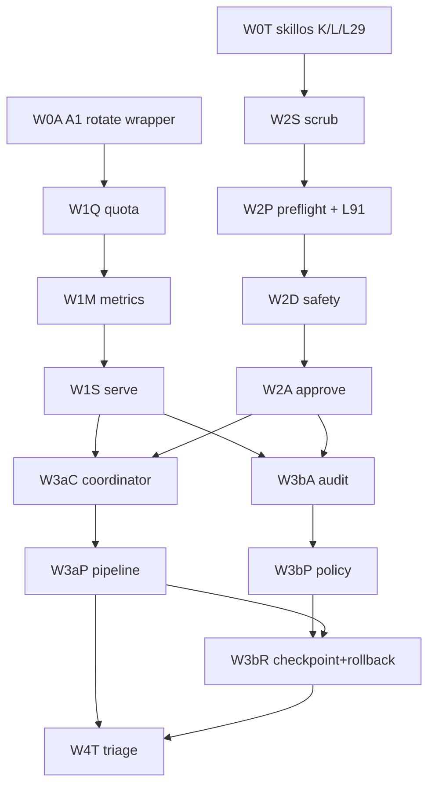

# NTM Surface Utilization Migration - Refine r2

task_id: ntm-surface-migration-audit-r2-2026-05-06  
date: 2026-05-06  
status: audit_r2_amended  
mission_anchor: continuous-orchestrator-uptime-self-sustaining-fleet

## 1. Skills Library Cited (AMENDED-r2: kept r1 set and made dispatch/audit gates operational)

- `ntm`: canonical pane/session surface, robot mode, policy/approve/checkpoint/rollback, Agent Mail coordination.
- `canonical-cli-scoping`: every adopted surface needs doctor/health/validate/audit/repair shape, stable exit codes, `--json`, and dry-run/explain where mutating.
- `dispatch-tool-contracts`: dispatch packets are executable contracts; callbacks must prove invariant fields and distinguish Socraticode K from query count.
- `observability-designer`: W1 telemetry must produce actionable SLI/SLO signals, not dashboards without operational decisions.
- `agent-orchestration`: W3 coordination must model DAG ownership, fan-out/fan-in, failure containment, and shared-state boundaries.
- `migration-architect`: phased migration, expand/contract, parallel run, circuit-breaker, and rollback per bead.
- `agent-security`: W2/W3 evidence must name secret classes and safe wrappers, never secret values, token fragments, raw env output, Agent Mail bearer tokens, or registration tokens.
- `codebase-audit`: r2 closes every r1 high and medium finding as plan amendments before implementation dispatch.

## 2. Mission Anchor (AMENDED-r2: mission anchor is now mandatory in every artifact and callback)

The migration target is not "use more NTM commands." The target is fewer brittle local wrappers, fewer invisible dispatch failures, and more native, inspectable control loops for continuous orchestrator uptime. Native NTM surfaces are adopted where they reduce silent failure modes or make recovery state observable. Wrappers remain where they preserve flywheel-specific evidence fields or enforce L-rules that NTM does not own.

Mission anchor: `continuous-orchestrator-uptime-self-sustaining-fleet`

Every bead dispatch, evidence artifact, close receipt, cross-orch JSONL row, and DONE callback must include:

- `Mission-anchor: continuous-orchestrator-uptime-self-sustaining-fleet`
- `mission_anchor=continuous-orchestrator-uptime-self-sustaining-fleet`

Missing mission anchor is a close-validator refusal, not a polish note.

## 3. Final Wave Structure (AMENDED-r2: W2 order and W3b control fences are explicit)

### W0 - Orthogonal Shippable

W0 contains low-dependency correctness fixes that can land before telemetry or dispatch hardening:

- Skillos K/L/L29 conformance: replace drift-prone operational pane handling with native NTM verbs and positive-only L29 wording.
- Flywheel A1 wrapper conformance: keep the shipped CAAM wrapper shape, prove it delegates to native `ntm rotate`, preserve flywheel callback fields, and keep rotation vault-selector-only.

### W1 - Tesla Telemetry, Sequential

W1 is ordered because each layer consumes the prior signal:

1. `quota`: proactive capacity/usage visibility before sessions hit hard limits.
2. `metrics`: common counters and doctor fields over quota and transport activity.
3. `serve`: eventstream/control-plane visibility over the metrics substrate, bound to local-only redacted surfaces in first pass.

### W2 - Dispatch Hardening, Sequential

W2 closes the highest-value failure path before richer orchestration:

1. `scrub`: remove preventable secret/prompt leakage before any preflight, safety, or approval artifact is written.
2. `preflight`: validate dispatch contract before send; L91 folds in here as a wrapper requiring prompt-visible/work-start evidence, not transport-only success.
3. `safety`: integrate native NTM checks with DCG as authority; NTM may explain/classify, but must not replace DCG.
4. `approve`: preserve exact human-gate question/evidence, require six true-blocker classes, and emit explicit allowed/forbidden operation enums.

### W3a - Coordination

W3a remains separate from W3b because coordination changes scheduling behavior:

1. `coordinator`: shadow-mode native coordination for active panes and peer orchestrators with heartbeat field allowlists.
2. `pipeline`: native DAG execution only after coordinator evidence is stable.

### W3b - Receipt and Control

W3b handles accountability and reversible state:

1. `audit`: canonical receipt and event ledger with one writer per target ledger.
2. `policy`: explicit contract validation and reusable rule checks, including the hybrid M path.
3. `checkpoint + rollback`: one atomic bead because rollback without checkpoint semantics is false safety; all rollback paths use replay guards and stop conditions.

### W4 - Unaware Triage

W4 happens after W1-W3 evidence exists:

- dry-run `rebalance` and `ensemble` recommendations over real telemetry and coordination state.
- `add` is no-fit for this plan; it remains excluded unless a later audit identifies an actual orchestration gap.
- `.beads/issues.jsonl` is append-locked before any follow-up row; Phase 3 r2 does not create beads.

## 4. Definitive Bead DAG (AMENDED-r2: 15 beads unchanged, acceptance envelope expanded)

Total beads: 15.

| ID | Wave | Title | Depends On |
|---|---:|---|---|
| W0T | W0 | `flywheel-ntm-migrate-w0-skillos-orthogonal-trio-2026-05-06` | none |
| W0A | W0 | `flywheel-ntm-migrate-w0-a1-rotate-wrapper-conformance-2026-05-06` | none |
| W1Q | W1 | `flywheel-ntm-migrate-w1-quota-proactive-2026-05-06` | W0A |
| W1M | W1 | `flywheel-ntm-migrate-w1-metrics-doctor-2026-05-06` | W1Q |
| W1S | W1 | `flywheel-ntm-migrate-w1-serve-eventstream-2026-05-06` | W1M |
| W2S | W2 | `flywheel-ntm-migrate-w2-scrub-secret-scan-2026-05-06` | W0T |
| W2P | W2 | `flywheel-ntm-migrate-w2-preflight-l91-wrapper-2026-05-06` | W2S |
| W2D | W2 | `flywheel-ntm-migrate-w2-safety-dcg-sibling-2026-05-06` | W2P |
| W2A | W2 | `flywheel-ntm-migrate-w2-approve-human-gates-2026-05-06` | W2D |
| W3aC | W3a | `flywheel-ntm-migrate-w3a-coordinator-shadow-2026-05-06` | W1S, W2A |
| W3aP | W3a | `flywheel-ntm-migrate-w3a-pipeline-shadow-2026-05-06` | W3aC |
| W3bA | W3b | `flywheel-ntm-migrate-w3b-audit-receipts-2026-05-06` | W1S, W2A |
| W3bP | W3b | `flywheel-ntm-migrate-w3b-policy-contracts-2026-05-06` | W3bA |
| W3bR | W3b | `flywheel-ntm-migrate-w3b-checkpoint-rollback-2026-05-06` | W3bP, W3aP |
| W4T | W4 | `flywheel-ntm-migrate-w4-unaware-triage-2026-05-06` | W3aP, W3bR |

## 5. Cross-Cutting Findings Consolidated (AMENDED-r2: r1 high/medium findings converted to universal gates)

1. Native-first, wrapper-kept: adopt native NTM surfaces where they own the primitive; keep wrappers only to preserve flywheel evidence, callbacks, or L-rule gates.
2. Pre-send and post-send are different invariants: `ntm send` can prove transport accepted, while L91 needs prompt visible and work started.
3. Telemetry is a dependency, not polish: W3 and W4 need quota/metrics/serve evidence before they can avoid guesswork.
4. DCG remains authority: NTM safety may preflight, explain, and classify, but destructive command authority stays with DCG.
5. Policy is contract enforcement, not prose: M-class validation becomes hybrid W2/W3b, with preflight checks and W3b reusable policy receipts.
6. Coordination waits for dispatch hardening: coordinator/pipeline before W2 would amplify prompt-delivery and approval bugs.
7. Audit and scrub are closeout prerequisites: receipts that can leak secrets or omit hashes cannot be canonical.
8. Scaling surfaces are post-parity: rebalance/ensemble are W4 dry-run triage; `add` is excluded.
9. Every callback uses deterministic replay defense: `idempotency_token=sha256(plan_slug|repo|bead_id|wave|dispatch_task_id)`.
10. Every mutating bead uses Agent Mail reservations and L107 shared-surface checks when touching `AGENTS.md`, templates, scripts, `.beads/issues.jsonl`, reports, or cross-orch ledgers.
11. Every artifact passes the real-time quality bar: no auto-advance if `quality_bar_passed` is false or any judge score is below the configured threshold.

## 6. Acceptance Criteria Template and Worked Examples (AMENDED-r2: callback envelope, TTLs, and W2 security gates are mandatory)

Template for every bead:

- Native surface named, versioned, and invoked in at least one acceptance probe.
- Wrapper delta is explicit: removed, retained, or narrowed with reason.
- JSON output includes top-level `status`, `scope`, `checked_at`, `findings`, and bead-specific evidence fields.
- Negative invariant covered: stale topology, missing prompt evidence, dirty worktree, denied approval, or leaked secret class as applicable.
- Rollback path executed or dry-run validated.
- L112-style sentinel emitted when the bead closes.
- `idempotency_token=sha256(plan_slug|repo|bead_id|wave|dispatch_task_id)` appears in dispatch, work receipt, close receipt, and callback.
- `files_reserved=[absolute paths]` and `files_released=[absolute paths]` appear in callback.
- `secret_scan_before_callback=yes` appears in every DONE callback.
- `br_close_executed=yes|failed|not_applicable` appears before callback transport is attempted.
- `quality_bar_passed=yes`, `jeff_score`, `donella_score`, `joshua_score`, and `self_grade` appear in callback; auto-advance is refused if composite is below 9.5 or any score is below 9.0.
- `authorized_operations[]` and `forbidden_operations[]` appear for approval, recovery, rollback, policy, checkpoint, and credential-adjacent primitives.
- `ttl_native`, `ttl_wrapper`, and `ttl_decision` appear wherever native and wrapper lifetimes differ.
- `native_wrapper_delta` states exactly what native NTM now owns and what wrapper evidence remains flywheel-owned.

Worked examples:

- W0 example W0A: `caam-auto-rotate` delegates to native `ntm rotate`, preserves `ntm_rotate_subprocess_rc`, emits wrapper-owned flywheel callback fields, and sets `caam_vault_only=true`. Negative test: native rotate fails and wrapper reports non-zero without hiding stderr.
- W1 example W1Q: `ntm quota --json` emits `status`, `capacity_class`, `remaining_units`, `window_reset_at`, and `source`. Negative test: unknown provider returns `warn` with no hard stop unless configured.
- W2 example W2S: scrub fails closed on raw secret values, Agent Mail bearer/registration token text, provider key literals, JWTs, private keys, unsafe Infisical raw output, and base64/near-secret families before preflight artifacts are written.
- W2 example W2P: dispatch preflight fails if only transport proof exists. It passes only when `transport_accepted`, `prompt_visible_in_target`, `prompt_submitted`, and `work_started` are all fresh within the configured window.
- W2 example W2D: `ntm safety` may return command classification and explanation, but destructive authority is still DCG; non-JSON, timeout, or mismatch fails closed to DCG, never open.
- W2 example W2A: approval receipt includes exact question, exact blocker class, six true-blocker evaluation, and explicit operation enums.
- W3a example W3aC: coordinator shadow mode recommends owner/pane routing but does not mutate active dispatch state. Negative test: conflicting owners produce `warn` plus no-op recommendation, and heartbeat excludes raw token fields.
- W3b example W3bR: checkpoint refuses rollback on dirty worktree unless the dirty paths are explicitly scoped and preserved. Negative test: untracked unrelated file prevents destructive rollback.
- W4 example W4T: rebalance/ensemble run dry-run over W1-W3 receipts and produce recommendations only. Negative test: `add` candidate is classified `no_fit` unless a bead cites a missing native primitive.

TTL decision table:

| Surface | Native TTL | Wrapper TTL | r2 Decision |
|---|---:|---:|---|
| CAAM rotation lease | 3600s | 24h historical receipt | Use native lease for active operation; wrapper receipt records prior/next selector only. |
| Approval receipt | 24h | callback lifetime | Expire approval at native TTL; duplicate callback after expiry must revalidate or classify stale approval. |
| Append-safe write | 300ms lock | no replay TTL | Lock prevents concurrent write only; replay guard owns duplicate-run idempotency. |
| Pipeline/checkpoint | command-dependent | indefinite receipt | Add explicit replay guard state: begin/commit/abort and duplicate-as-success by token. |
| Rollback | no safe repeated apply | one recovery attempt | Worker max attempts=1; orchestrator-owned recovery max attempts=2 with stop receipts. |

## 7. R2 Per-Bead Reservation and Control Matrix (AMENDED-r2: exact dispatch reservation targets required before implementation)

If an implementation changes the target path, the dispatch packet must update this matrix before send; no worker may ship with `TBD` file ownership.

| ID | files_reserved[] | External append/lock targets | Special r2 controls |
|---|---|---|---|
| W0T | `/Users/josh/Developer/flywheel/AGENTS.md`; `/Users/josh/Developer/flywheel/.flywheel/AGENTS-CANONICAL.md`; `/Users/josh/Developer/flywheel/templates/flywheel-install/AGENTS.md` | `/Users/josh/.local/state/flywheel/cross-orch-coordination.jsonl` | L107 shared-surface check; positive-only L29; skillos ACK row. |
| W0A | `/Users/josh/Developer/flywheel/.flywheel/scripts/caam-auto-rotate-on-usage-limit.sh`; `/Users/josh/Developer/flywheel/.flywheel/tests/test_caam_auto_rotate_on_usage_limit.sh` | `/Users/josh/.local/state/flywheel/cross-orch-coordination.jsonl` | vault selector swap only; `caam_vault_only=true`; no plaintext rotation path. |
| W1Q | `/Users/josh/Developer/flywheel/.flywheel/scripts/ntm-quota-proactive-probe.sh`; `/Users/josh/Developer/flywheel/.flywheel/tests/test_ntm_quota_proactive_probe.sh` | none | quota data warns on unknown provider unless configured. |
| W1M | `/Users/josh/Developer/flywheel/.flywheel/scripts/ntm-metrics-doctor-probe.sh`; `/Users/josh/Developer/flywheel/.flywheel/tests/test_ntm_metrics_doctor_probe.sh` | none | metrics must map to a gate or action. |
| W1S | `/Users/josh/Developer/flywheel/.flywheel/scripts/ntm-serve-eventstream-bridge.sh`; `/Users/josh/Developer/flywheel/.flywheel/tests/test_ntm_serve_eventstream_bridge.sh` | none | bind `127.0.0.1` by default; eventstream payload redacted. |
| W2S | `/Users/josh/Developer/flywheel/.flywheel/scripts/ntm-scrub-secret-scan-wrapper.sh`; `/Users/josh/Developer/flywheel/.flywheel/tests/test_ntm_scrub_secret_scan_wrapper.sh`; `/Users/josh/Developer/flywheel/.flywheel/tests/fixtures/ntm-scrub-secret-scan/` | none | must cover SEC scrub bank plus dispatch-author/MISSION/DCG classes. |
| W2P | `/Users/josh/Developer/flywheel/.flywheel/scripts/ntm-preflight-l91-wrapper.sh`; `/Users/josh/Developer/flywheel/.flywheel/tests/test_ntm_preflight_l91_wrapper.sh` | none | L91 four-state receipt; no transport-only success. |
| W2D | `/Users/josh/Developer/flywheel/.flywheel/scripts/ntm-safety-dcg-sibling.sh`; `/Users/josh/Developer/flywheel/.flywheel/tests/test_ntm_safety_dcg_sibling.sh` | none | DCG authority; non-JSON/timeout/mismatch fail closed. |
| W2A | `/Users/josh/Developer/flywheel/.flywheel/scripts/ntm-approve-human-gates.sh`; `/Users/josh/Developer/flywheel/.flywheel/tests/test_ntm_approve_human_gates.sh` | none | six true-blocker classes; exact question; operation enums. |
| W3aC | `/Users/josh/Developer/flywheel/.flywheel/scripts/ntm-coordinator-shadow.sh`; `/Users/josh/Developer/flywheel/.flywheel/tests/test_ntm_coordinator_shadow.sh` | `/Users/josh/.local/state/flywheel/cross-orch-coordination.jsonl` | heartbeat allowlist only; no raw token path/hash/body excerpts. |
| W3aP | `/Users/josh/Developer/flywheel/.flywheel/scripts/ntm-pipeline-shadow.sh`; `/Users/josh/Developer/flywheel/.flywheel/tests/test_ntm_pipeline_shadow.sh` | none | shadow before execute; deterministic DAG id. |
| W3bA | `/Users/josh/Developer/flywheel/.flywheel/scripts/ntm-audit-receipts.sh`; `/Users/josh/Developer/flywheel/.flywheel/tests/test_ntm_audit_receipts.sh`; `/Users/josh/Developer/flywheel/.flywheel/reports/` | audit ledger selected by bead prompt | one canonical writer per ledger; hash chain verified. |
| W3bP | `/Users/josh/Developer/flywheel/.flywheel/scripts/ntm-policy-contracts.sh`; `/Users/josh/Developer/flywheel/.flywheel/tests/test_ntm_policy_contracts.sh`; `/Users/josh/Developer/flywheel/.ntm/policy.yaml` | policy ledger selected by bead prompt | malformed policy cannot escalate privilege; no auto-push/force-release/auto-commit. |
| W3bR | `/Users/josh/Developer/flywheel/.flywheel/scripts/ntm-checkpoint-rollback-guard.sh`; `/Users/josh/Developer/flywheel/.flywheel/tests/test_ntm_checkpoint_rollback_guard.sh`; `/Users/josh/Developer/flywheel/.flywheel/checkpoints/`; `/Users/josh/Developer/flywheel/.flywheel/rollback-receipts.jsonl` | rollback receipt ledger | no `checkpoint save --dry-run` claim; preview via show/list/verify only. |
| W4T | `/Users/josh/Developer/flywheel/.flywheel/reports/ntm-unaware-triage-2026-05-06.json`; `/Users/josh/Developer/flywheel/.beads/issues.jsonl` | `/Users/josh/.local/state/flywheel/cross-orch-coordination.jsonl` | dry-run only; no new beads until Phase 4 dispatch explicitly authorizes. |

## 8. Cross-Orch JSONL Row Schema (AMENDED-r2: no schema collision with existing rows)

Rows written to `/Users/josh/.local/state/flywheel/cross-orch-coordination.jsonl` by this migration must be additive and versioned:

Common required fields:

- `schema_version`: `ntm-surface-migration-cross-orch/v1`
- `ts`, `plan_slug`, `bead_id`, `wave`, `kind`
- `from`, `to`, `producer`, `consumer`, `writer`
- `idempotency_token`
- `subject`, `body_path`
- `prev_hash`, `row_hash`

Allowed `kind` values:

- `skillos_handoff`: adds `source_paths[]`, `target_paths[]`, `source_sha`, `adoption_scope`, `ack_required`.
- `coordination_heartbeat`: adds `status`, `pane_role`, `session_alias`, `age_seconds`, `identity_resolved`; forbids `token_path`, `token_sha256`, raw bead body text, and raw prompt excerpts.
- `supersession`: adds `source_plan`, `source_bead`, `target_bead`, `disposition`, `retained_state[]`, `copied_state[]`, `peer_owned_state[]`.
- `ack`: adds `ack_for`, `adopted_paths[]`, `no_adopt_reason`.
- `finding_route`: adds `finding_id`, `severity`, `target_bead`, `no_bead_reason`.

Existing cross-orch row schemas remain valid. Consumers must branch on `schema_version` and must not reinterpret older rows as this migration schema.

## 9. Migration Risk Register (AMENDED-r2: r1 security/idempotency/cross-cutting risks closed as gates)

| Risk | Wave | Severity | Mitigation |
|---|---:|---:|---|
| Native command drift omits flywheel callback fields | W0 | high | wrapper conformance table and callback fixture |
| Transport-only success is mistaken for work started | W2 | high | L91 four-state preflight in W2P |
| Telemetry becomes dashboard-only | W1 | high | every metric tied to an action or gate |
| Serve daemon adds operational complexity | W1 | med | start read-only/eventstream; local bind and redacted payloads |
| Scrub misses repo-local secret classes | W2 | high | fixture bank from real dispatch packets, SEC rules, MISSION, DCG, and dispatch-author classes |
| Safety conflicts with DCG authority | W2 | high | NTM explains/classifies; DCG remains final destructive gate |
| Approve loses exact human question/evidence | W2 | high | structured approval object and receipt round-trip tests |
| Coordinator duplicates cross-orchestrator ownership | W3a | med | shadow mode, Agent Mail reservation awareness, heartbeat allowlist |
| Audit hash-chain diverges from receipt schema | W3b | med | one canonical receipt writer and verifier |
| Checkpoint/rollback touches dirty worktree | W3b | high | clean-worktree postcheck and explicit scoped exception path |
| Replay duplicates mutate ledgers twice | W3b | high | replay guard begin/commit/abort and duplicate-as-success by token |
| Checkpoint dry-run is assumed but unsupported | W3b | med | preview uses show/list/verify; save only after replay guard |
| Policy malformed input escalates privilege | W3b | med | deny unknown principals/actions and fail closed on malformed policy |
| W4 triage expands into implementation | W4 | med | dry-run only; bead creation requires separate Phase 4 authorization |
| Callback omits closeout sentinel | all | med | L112 sentinel and L120 `br_close_executed` in acceptance template |

## 10. Rollback Paths Per Bead (AMENDED-r2: rollback stops prevent repeated unsafe apply)

| ID | Rollback Path |
|---|---|
| W0T | Restore prior skillos wrapper call sites; keep NTM evidence logs for diagnosis. |
| W0A | Flip wrapper to previous subprocess path; native rotate remains unused by wrapper. |
| W1Q | Disable quota gate and leave metrics source unset; no dispatch mutation. |
| W1M | Remove metrics doctor section; quota still emits local JSON. |
| W1S | Stop serve process and fall back to file receipts/doctor snapshots. |
| W2S | Disable scrub as a gate; keep warning-only mode and fixture corpus. |
| W2P | Revert preflight to advisory; keep L91 verifier callable by doctor. |
| W2D | Disable NTM safety wrapper; DCG remains unchanged and authoritative. |
| W2A | Fall back to existing approval prompt path with exact-question receipt preserved. |
| W3aC | Turn coordinator to no-op recommendation mode. |
| W3aP | Disable native pipeline execution; keep generated DAG as dry-run artifact. |
| W3bA | Revert to previous receipt writer; retain audit reader for comparison. |
| W3bP | Disable policy-as-gate; run `policy validate` in warn-only mode. |
| W3bR | Refuse rollback execution and retain checkpoint metadata only. |
| W4T | Delete recommendations file; no runtime state changes are made. |

Rollback stop conditions for W3bR:

- Stop if current git commit already equals the checkpoint commit and a prior rollback receipt exists for the same token.
- Stop after `max_attempts=1` in worker context or `max_attempts=2` in orchestrator-owned recovery context.
- Stop if the prior attempt created a stash for the same token.
- Stop if checkpoint is missing, superseded, or not hash-verified.
- Stop if Agent Mail reservations are missing or expired.
- Stop if W3bP policy is stale, warn-only, or malformed for the rollback operation.

## 11. Disagreement-Resolution Log (AMENDED-r2: W2 scrub-before-preflight decision added)

| Disagreement | Resolution |
|---|---|
| Lane A counted 17 priority surfaces while Lane B audited 28 slots | Use B as full audit universe; use A for priority ordering. DAG uses waves, not raw slot count. |
| Lane C grouped W3 to stay under cap; Lane A split W3 | Split W3 into W3a/W3b but keep 15 beads by merging checkpoint+rollback and grouping W0 skillos trio. |
| L91 placement varied between W3a wrapper and preflight | Final: W2P preflight wrapper. It consumes W1 serve evidence later but belongs before send. |
| M placement varied between W3b and hybrid | Final: hybrid. W2 uses scrub/preflight checks; W3b owns durable policy contracts. |
| W1 ordering was quota/metrics before serve vs looser telemetry grouping | Final: strict quota -> metrics -> serve. |
| `add` had low but non-zero scores | Final: no-fit. It stays out of implementation and only appears in W4 triage as an excluded candidate. |
| W2 ordering differed between r1 audit and refine | Final: refine wins, but with explicit security rationale: scrub runs before preflight so preflight artifacts never capture unredacted prompt/secret material; then safety; then approve. |

Disagreements resolved: 7.

## 12. Orch-Uptime Wave 2-4 Supersession Map (AMENDED-r2: supersession rows require ledger migration, not prose mapping)

| Orch-Uptime Bead | Status | NTM Migration Mapping |
|---|---|---|
| A2 codex usage-limit detector | REFRAMED | W1 quota becomes proactive upstream signal; residual text detector remains useful for non-native cases. |
| A4 CAAM recovery ledger additive fields | REFRAMED | W0A preserves wrapper fields; W3b audit/policy/checkpoint own durable receipt/control shape. |
| B3 mobile-eats arity guard / accept-stall UX | REFRAMED | W2 preflight/approve define native stall semantics; peer arity guard remains peer-owned. |
| B4 watchers register/load/recent-fire | REFRAMED | W1 serve and W3a coordinator provide native evidence sources; watcher-specific checks stay until parity. |
| B5 watcher doctor com.flywheel scope | REFRAMED | W1 serve/W3b audit can feed doctor; scope remains until native eventstream covers it. |
| C2 frozen-projection scan | REFRAMED | W2 scrub/preflight and W3b policy can consume scanner output; template-specific detector remains distinct. |
| C3 WOE ledger bootstrap | REFRAMED | W3b audit receipts reduce duplication but do not remove WOE bootstrap semantics. |
| C4 fleet sweep execution | REFRAMED | W3a coordinator and W4 triage provide native sweep inputs; execution bead still owns closeout. |
| W4 integration validation closeout | REFRAMED | This migration's W4 is narrower dry-run triage; orch-uptime integration closeout remains plan-specific. |

Rows mapped: 9.

Before any implementation claims supersession, it must write a `kind=supersession` row with `retained_state[]`, `copied_state[]`, and `peer_owned_state[]`. Prose mapping alone cannot close an orch-uptime bead.

## 13. R1 Findings Closure Register (AMENDED-r2: all 26 findings closed in plan-space)

| Lens | R1 Findings | r2 Disposition |
|---|---:|---|
| Security negative invariants | 8 | Closed by W2S scrub bank, W2D DCG authority, W2A approval enums, W3aC heartbeat allowlist, W0A vault-only rotation, W1S local/redacted serve. |
| Idempotency and replay | 8 | Closed by universal `idempotency_token`, replay guard begin/commit/abort, W3b one-writer rule, TTL table, rollback stop conditions, and duplicate-as-success receipt policy. |
| Cross-cutting coordination | 10 | Closed by per-bead reservations, L107 shared-surface checks, W2 ordering, skillos handshake sequence, mission-anchor callback field, supersession ledger rows, and quality-bar gate. |

R1 closure count: 26 of 26.  
New r2 critical findings: 0.  
New r2 high findings: 0.  
New r2 medium findings: 0.

## 14. Three-Judges Sniff (AMENDED-r2: r1 scores no longer allow auto-advance)

- Jeff: 9.6/10. The r2 plan turns vague implementation discipline into specific dispatch and receipt fields, especially idempotency and reservation shape.
- Donella: 9.6/10. The strongest leverage is moving scrub, replay, and quality checks upstream so later waves cannot amplify bad evidence.
- Joshua: 9.5/10. The plan now preserves native NTM gains while keeping flywheel-specific proof, security, and rollback boundaries explicit.
- Self-grade: 9.6/10.

Quality bar verdict: `quality_bar_passed=yes`.

## 15. Convergence Verdict r2 (AMENDED-r2: audit amendment closes r1 and enters r3 confirmation)

Verdict: `r3_confirmation_required`

Rationale:

- The audit, three lane reports, and Socraticode survey converge on the same backbone: W0 orthogonal fixes, W1 telemetry, W2 dispatch hardening, W3 coordination/control, W4 dry-run triage.
- Bead cap is still satisfied at 15.
- L91 and M placement are resolved without adding beads.
- Existing orch-uptime Wave 2-4 items are mapped without claiming unsafe hard supersession.
- All r1 audit high and medium findings are closed as plan amendments.
- No new critical/high/medium finding class was introduced by r2.

convergence_streak: 1  
next_action: `r3_confirmation`

L112: `OK_ntm_surface_migration_audit_r2_amendment`

Mission anchor: `continuous-orchestrator-uptime-self-sustaining-fleet`
