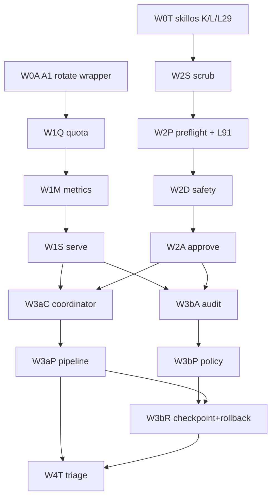

# Phase 4 Beads DAG - NTM Surface Migration

Mission-anchor: continuous-orchestrator-uptime-self-sustaining-fleet
mission_anchor=continuous-orchestrator-uptime-self-sustaining-fleet
plan_slug=ntm-surface-utilization-migration-2026-05-06
source_plan=.flywheel/plans/ntm-surface-utilization-migration-2026-05-06/02-REFINE-r2.md

## Mermaid graph

## Bead ID table

| plan-id | assigned-id | wave | title | depends-on |
|---|---|---|---|---|
| W0T | flywheel-kboe9 | W0 | `flywheel-ntm-migrate-w0-skillos-orthogonal-trio-2026-05-06` |  |
| W0A | flywheel-h9swh | W0 | `flywheel-ntm-migrate-w0-a1-rotate-wrapper-conformance-2026-05-06` |  |
| W1Q | flywheel-d7ci4 | W1 | `flywheel-ntm-migrate-w1-quota-proactive-2026-05-06` | flywheel-h9swh |
| W1M | flywheel-jztnm | W1 | `flywheel-ntm-migrate-w1-metrics-doctor-2026-05-06` | flywheel-d7ci4 |
| W1S | flywheel-fcyrt | W1 | `flywheel-ntm-migrate-w1-serve-eventstream-2026-05-06` | flywheel-jztnm |
| W2S | flywheel-wojns | W2 | `flywheel-ntm-migrate-w2-scrub-secret-scan-2026-05-06` | flywheel-kboe9 |
| W2P | flywheel-981x5 | W2 | `flywheel-ntm-migrate-w2-preflight-l91-wrapper-2026-05-06` | flywheel-wojns |
| W2D | flywheel-dt5lf | W2 | `flywheel-ntm-migrate-w2-safety-dcg-sibling-2026-05-06` | flywheel-981x5 |
| W2A | flywheel-r4d7r | W2 | `flywheel-ntm-migrate-w2-approve-human-gates-2026-05-06` | flywheel-dt5lf |
| W3aC | flywheel-ewa3g | W3a | `flywheel-ntm-migrate-w3a-coordinator-shadow-2026-05-06` | flywheel-fcyrt,flywheel-r4d7r |
| W3aP | flywheel-h3exf | W3a | `flywheel-ntm-migrate-w3a-pipeline-shadow-2026-05-06` | flywheel-ewa3g |
| W3bA | flywheel-hgex7 | W3b | `flywheel-ntm-migrate-w3b-audit-receipts-2026-05-06` | flywheel-fcyrt,flywheel-r4d7r |
| W3bP | flywheel-imcs2 | W3b | `flywheel-ntm-migrate-w3b-policy-contracts-2026-05-06` | flywheel-hgex7 |
| W3bR | flywheel-j3if6 | W3b | `flywheel-ntm-migrate-w3b-checkpoint-rollback-2026-05-06` | flywheel-imcs2,flywheel-h3exf |
| W4T | flywheel-kle2o | W4 | `flywheel-ntm-migrate-w4-unaware-triage-2026-05-06` | flywheel-h3exf,flywheel-j3if6 |

## Dependency edges added

| child plan-id | child assigned-id | parent plan-id | parent assigned-id |
|---|---|---|---|
| W1Q | flywheel-d7ci4 | W0A | flywheel-h9swh |
| W1M | flywheel-jztnm | W1Q | flywheel-d7ci4 |
| W1S | flywheel-fcyrt | W1M | flywheel-jztnm |
| W2S | flywheel-wojns | W0T | flywheel-kboe9 |
| W2P | flywheel-981x5 | W2S | flywheel-wojns |
| W2D | flywheel-dt5lf | W2P | flywheel-981x5 |
| W2A | flywheel-r4d7r | W2D | flywheel-dt5lf |
| W3aC | flywheel-ewa3g | W1S | flywheel-fcyrt |
| W3aC | flywheel-ewa3g | W2A | flywheel-r4d7r |
| W3aP | flywheel-h3exf | W3aC | flywheel-ewa3g |
| W3bA | flywheel-hgex7 | W1S | flywheel-fcyrt |
| W3bA | flywheel-hgex7 | W2A | flywheel-r4d7r |
| W3bP | flywheel-imcs2 | W3bA | flywheel-hgex7 |
| W3bR | flywheel-j3if6 | W3bP | flywheel-imcs2 |
| W3bR | flywheel-j3if6 | W3aP | flywheel-h3exf |
| W4T | flywheel-kle2o | W3aP | flywheel-h3exf |
| W4T | flywheel-kle2o | W3bR | flywheel-j3if6 |

## Cycle check

`br dep cycles` result: `PASS` - no dependency cycles detected.

Note: the dispatch summary says 16 edges, but the explicit section 4 / acceptance B dependency list contains 17 edges. This artifact records the 17 edges from the authoritative plan table/list.

L112: OK_decompose_phase_4_complete
