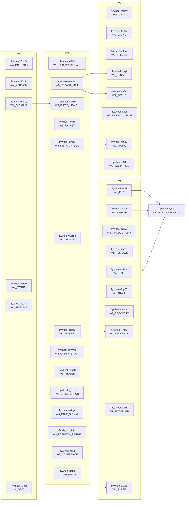

# 04-BEADS-DAG — ntm surface wire-in USE/ISSUE/WRAP backlog

Mission anchor: `continuous-orchestrator-uptime-self-sustaining-fleet`

## Summary

- Total beads filed: `38`
- Wave counts: `W1=10`, `W2=8`, `W3=14`, `W4=6`
- ntm#124 dependency edges: `3`
- Dependency cycles: `0` (`br dep cycles` returned `No dependency cycles detected.`)
- Quality failed: `none`
- Self-grade: `9.3/10`

## Mermaid graph

## Full ID table

| Wave | Key | Bead ID | Priority | Title | Script LOC | ntm target |
|---|---|---|---|---|---:|---|
| W1 | `W1_IDLE` | `flywheel-7fcki` | `P0` | [ntm-wire-in] rewrite idle-pane-auto-dispatch.sh → ntm wait+assign --watch (-559 LOC) | 699 | `ntm wait; future ntm assign --watch after ntm#124` |
| W1 | `W1_FREEZE` | `flywheel-sox9n` | `P0` | [ntm-wire-in] rewrite peer-orch-freeze-monitor.sh → ntm watch+activity (-622 LOC) | 772 | `ntm watch; ntm activity --json` |
| W1 | `W1_PRODUCTIVITY` | `flywheel-zqiw2` | `P0` | [ntm-wire-in] delete peer-orch-productivity-watch.sh → ntm coordinator digest (-621 LOC) | 621 | `ntm coordinator digest --json` |
| W1 | `W1_RESPAWN` | `flywheel-zhr6s` | `P0` | [ntm-wire-in] rewrite worker-auto-respawn-watchdog.sh → ntm wait+respawn (-351 LOC) | 451 | `ntm wait --condition=DEAD; ntm respawn` |
| W1 | `W1_HALT` | `flywheel-rd8oa` | `P0` | [ntm-wire-in] rewrite halt-disease-watchdog.sh → ntm watch+grep (-237 LOC) | 317 | `ntm watch; ntm grep` |
| W1 | `W1_STALL` | `flywheel-8tp66` | `P0` | [ntm-wire-in] rewrite worker-stall-alert-probe.sh → ntm wait generating (-290 LOC) | 370 | `ntm wait --condition=generating --timeout=<Ns>` |
| W1 | `W1_RECOVERY` | `flywheel-gndhc` | `P0` | [ntm-wire-in] rewrite recovery-escape-then-reprompt.sh → ntm interrupt+replay (-140 LOC) | 200 | `ntm interrupt; ntm replay` |
| W1 | `W1_CALLBACK` | `flywheel-7rerv` | `P0` | [ntm-wire-in] rewrite verify-callback-delivery.sh → ntm history (-123 LOC) | 183 | `ntm history --json` |
| W1 | `W1_TWOTRUTH` | `flywheel-9gnjl` | `P0` | [ntm-wire-in] rewrite recency-weighted-two-truth-classifier.sh → ntm diff+activity (-150 LOC) | 220 | `ntm diff; ntm --robot-activity` |
| W1 | `W1_PULSE` | `flywheel-zr12c` | `P0` | [ntm-wire-in] rewrite team-pulse-heartbeat.sh → ntm health+summary (-360 LOC) | 470 | `ntm health; ntm summary` |
| W2 | `W2_LOCK` | `flywheel-melgv` | `P0` | [ntm-wire-in] research shared-surface-reservation-check.sh → ntm lock (ISSUE verdict) | 360 | `ntm lock` |
| W2 | `W2_LOCKS` | `flywheel-8e1fx` | `P0` | [ntm-wire-in] research shared-surface-reservation-check.sh → ntm locks (ISSUE verdict) | 360 | `ntm locks` |
| W2 | `W2_UNLOCK` | `flywheel-m9aoh` | `P0` | [ntm-wire-in] research shared-surface-reservation-check.sh → ntm unlock (ISSUE verdict) | 360 | `ntm unlock` |
| W2 | `W2_REDACT` | `flywheel-zhryi` | `P0` | [ntm-wire-in] research agent-mail-send-redacted.sh → ntm redact (ISSUE verdict) | 323 | `ntm redact; ntm mail` |
| W2 | `W2_SCRUB` | `flywheel-clt8w` | `P0` | [ntm-wire-in] research ntm-scrub-secret-scan-wrapper.sh → ntm scrub (ISSUE verdict) | 260 | `ntm scrub; ntm redact` |
| W2 | `W2_REVIEW_QUEUE` | `flywheel-txeui` | `P0` | [ntm-wire-in] research idle-state-probe.sh → ntm review-queue (ISSUE verdict) | 324 | `ntm review-queue` |
| W2 | `W2_WORK` | `flywheel-ro663` | `P0` | [ntm-wire-in] research dispatch-and-log.sh → ntm work vs assign (ISSUE verdict) | 181 | `ntm work; ntm assign` |
| W2 | `W2_WORKTREE` | `flywheel-i32lt` | `P0` | [ntm-wire-in] research plan-to-bead-auto-trigger.sh → ntm worktree(s) (ISSUE verdict) | 145 | `ntm worktree; ntm worktrees` |
| W3 | `W3_REG_BROADCAST` | `flywheel-47ife` | `P1` | [ntm-wire-in] rewrite agentmail-registration-broadcast.sh → ntm message --broadcast (-232 LOC) | 322 | `ntm message --broadcast` |
| W3 | `W3_REDACT_MAIL` | `flywheel-vw6am` | `P1` | [ntm-wire-in] rewrite agent-mail-send-redacted.sh → ntm mail+redact (-243 LOC) | 323 | `ntm mail; ntm redact` |
| W3 | `W3_FLEET_HEALTH` | `flywheel-dnv8o` | `P1` | [ntm-wire-in] trim ntm-fleet-health.sh → ntm health (-209 LOC) | 289 | `ntm health` |
| W3 | `W3_PACKET` | `flywheel-h9gr6` | `P1` | [ntm-wire-in] trim build-dispatch-packet.sh → ntm context+template (-321 LOC) | 521 | `ntm context; ntm template` |
| W3 | `W3_DISPATCH_LOG` | `flywheel-dj4a3` | `P1` | [ntm-wire-in] trim dispatch-and-log.sh → ntm assign+send+history (-81 LOC) | 181 | `ntm assign; ntm send; ntm history` |
| W3 | `W3_CAPACITY` | `flywheel-v0smn` | `P1` | [ntm-wire-in] trim dispatch-capacity-gate.sh → ntm assign+health (-65 LOC) | 135 | `ntm assign --json; ntm health --json` |
| W3 | `W3_DELIVERY` | `flywheel-ctd96` | `P1` | [ntm-wire-in] rewrite dispatch-delivery-verify.sh → ntm history+activity (-174 LOC) | 294 | `ntm history; ntm activity` |
| W3 | `W3_CODEX_STUCK` | `flywheel-p0wwm` | `P1` | [ntm-wire-in] trim codex-template-stuck-detector.sh → ntm errors+activity+wait (-965 LOC) | 1165 | `ntm errors; ntm activity; ntm wait` |
| W3 | `W3_FROZEN` | `flywheel-8bnz8` | `P1` | [ntm-wire-in] trim frozen-pane-detector.sh → ntm errors+activity+wait (-1257 LOC) | 1557 | `ntm errors; ntm activity; ntm wait` |
| W3 | `W3_STALE_ERROR` | `flywheel-gg1mj` | `P1` | [ntm-wire-in] trim stale-error-auto-ping.sh → ntm errors+send (-151 LOC) | 271 | `ntm errors; ntm send` |
| W3 | `W3_PANE_SIGNAL` | `flywheel-a8opj` | `P1` | [ntm-wire-in] trim pane-work-signal.sh → ntm activity+history (-165 LOC) | 285 | `ntm activity; ntm history` |
| W3 | `W3_RESPAWN_PERMIT` | `flywheel-rb88g` | `P1` | [ntm-wire-in] trim peer-orch-respawn-permit.sh → ntm health+respawn (-289 LOC) | 489 | `ntm health; ntm respawn` |
| W3 | `W3_COHERENCE` | `flywheel-sjdj2` | `P1` | [ntm-wire-in] trim fleet-coherence-scan.sh → ntm sessions+activity+health (-502 LOC) | 722 | `ntm sessions; ntm activity; ntm health` |
| W3 | `W3_LEVERAGE` | `flywheel-3atlk` | `P1` | [ntm-wire-in] trim leverage-ceiling-probe.sh → ntm activity+summary (-329 LOC) | 489 | `ntm activity; ntm summary` |
| W4 | `W4_ONBOARD` | `flywheel-7bs2z` | `P2` | [ntm-wire-in] rewrite flywheel-onboard.sh → ntm setup+init+shell+completion+bind (-484 LOC) | 784 | `ntm setup; ntm init; ntm shell; ntm completion; ntm bind; ntm spawn; ntm deps` |
| W4 | `W4_VERSION` | `flywheel-50q5d` | `P2` | [ntm-wire-in] rewrite jeff-binary-version-watchtower.sh → ntm version+upgrade (-215 LOC) | 335 | `ntm version; ntm upgrade` |
| W4 | `W4_CLEANUP` | `flywheel-r4hmy` | `P2` | [ntm-wire-in] trim private-tmp-prune.sh → ntm cleanup (-157 LOC) | 237 | `ntm cleanup` |
| W4 | `W4_SWARM` | `flywheel-ki5s9` | `P2` | [ntm-wire-in] rewrite peer-orch-blocker-watch.sh → ntm swarm (-136 LOC) | 216 | `ntm swarm; ntm rebalance` |
| W4 | `W4_TIMELINE` | `flywheel-8y034` | `P2` | [ntm-wire-in] rewrite dispatch-log-fitness-invariant.sh → ntm timeline (-145 LOC) | 225 | `ntm timeline` |
| W4 | `W4_DAILY` | `flywheel-43c8f` | `P2` | [ntm-wire-in] rewrite daily-report.sh → ntm analytics+summary+bugs (-0 LOC) | 5 | `ntm analytics; ntm summary; ntm bugs; ntm scan` |

## Dependency edges added

- `flywheel-7fcki` (`W1_IDLE`) depends on `flywheel-xyyfg` — watch/`--watch` blocked until ntm#124 closes.
- `flywheel-sox9n` (`W1_FREEZE`) depends on `flywheel-xyyfg` — watch/`--watch` blocked until ntm#124 closes.
- `flywheel-rd8oa` (`W1_HALT`) depends on `flywheel-xyyfg` — watch/`--watch` blocked until ntm#124 closes.
- `flywheel-vw6am` (`W3_REDACT_MAIL`) depends on `flywheel-zhryi` (`W2_REDACT`) — redacted mail rewrite waits for redact coverage verdict.
- `flywheel-vw6am` (`W3_REDACT_MAIL`) depends on `flywheel-clt8w` (`W2_SCRUB`) — redacted mail rewrite waits for scrub coverage verdict.
- `flywheel-dj4a3` (`W3_DISPATCH_LOG`) depends on `flywheel-ro663` (`W2_WORK`) — dispatch-and-log trim waits for work-vs-assign contract verdict.
- `flywheel-ctd96` (`W3_DELIVERY`) depends on `flywheel-7rerv` (`W1_CALLBACK`) — dispatch delivery verifier follows callback history rewrite.
- `flywheel-43c8f` (`W4_DAILY`) depends on `flywheel-zr12c` (`W1_PULSE`) — daily report summary follows team-pulse health/summary rewrite.
- `flywheel-r4hmy` (`W4_CLEANUP`) depends on `flywheel-dnv8o` (`W3_FLEET_HEALTH`) — cleanup onboarding follows health trim.

## Quality check

Every bead description includes:
- `mission_anchor=continuous-orchestrator-uptime-self-sustaining-fleet`
- `wave: W1|W2|W3|W4`
- absolute flywheel script path plus LOC count
- target `ntm` subcommand(s)
- expected LOC delta
- verifiable acceptance test
- quality self-grade >= 9.0

`quality_check_failed=[]`

## Notes

- W1 is P0 Tier-1 highest-LOC-delete/rewrite.
- W2 is P0 ISSUE research. These beads must output verdicts and issue bodies; they must not file upstream issues directly.
- W3 is P1 remaining Category-1/high-native-call rewrites, excluding today's KEEP-AS-WRAP wrappers.
- W4 is P2 doctor/onboarding/native-surface wire-in work.
- W3a/W3b WRAP ships from earlier today are intentionally out of scope.
