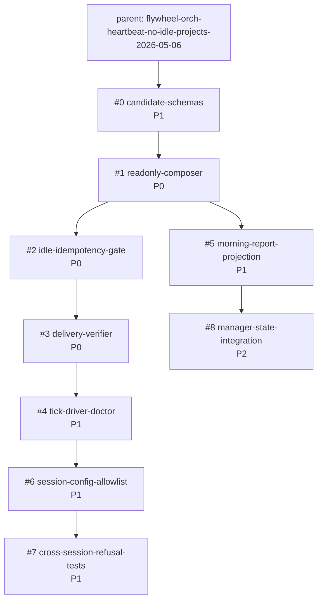

# Phase 4 Beads DAG: orch-heartbeat no idle projects

Task: `plan-orch-heartbeat-phase4-decompose-2026-05-06`
Parent: `flywheel-orch-heartbeat-no-idle-projects-2026-05-06`
Scope: plan-space bead graph only; no code-space mutation.

Primary empirical input: `/tmp/overnight-velocity-report/SUMMARY.md`.

## Summary

Phase 4 decomposes the audited orch-heartbeat plan into nine implementation
beads. The graph keeps the flywheel-local path first: define schemas, compose a
read-only action snapshot, gate on live idle/idempotency state, verify delivery,
then wire cadence/doctor visibility. Peer rollout remains behind explicit
allowlist and refusal tests.

Sibling shape: this follows the capacity-halt Phase 4 decomposition that shipped
earlier today. That plan used Wave A/B/C/D, explicit deps, an audit-finding map,
and append-only JSONL closeout. This DAG uses the same pattern but targets the
orchestrator information-flow loop rather than worker recovery.

## Mermaid DAG

No cycles. Topological order: #0, #1, #2, #3, (#4, #5), #6, (#7, #8).

Critical path: #0 -> #1 -> #2 -> #3 -> #4 -> #6 -> #7 = 245 minutes.

## Bead ID Table

| # | Bead ID | Title | Priority | Depends On | Wave | Est Wall | Audit Finding Addressed | Donella Leverage |
|---|---|---|---:|---|---|---:|---|---|
| 0 | `flywheel-orch-heartbeat-candidate-schemas-2026-05-06` | heartbeat candidate, decision, and delivery schemas | P1 | none | A | 30m | AUD-IDEMP-M1 | #5 Rules, #6 Information Flows |
| 1 | `flywheel-orch-heartbeat-readonly-composer-2026-05-06` | read-only composer over existing ledgers | P0 | #0 | A | 45m | AUD-IDEMP-M1, AUD-NOPUNT-H1, AUD-NOPUNT-M1, AUD-AUTH-L1 | #6 Information Flows |
| 2 | `flywheel-orch-heartbeat-idle-idempotency-gate-2026-05-06` | live idle, duplicate, budget, and blocker gate | P0 | #1 | A | 45m | AUD-IDEMP-H1, AUD-IDEMP-L1, AUD-NOPUNT-H1, AUD-AUTH-M1 | #5 Rules |
| 3 | `flywheel-orch-heartbeat-delivery-verifier-2026-05-06` | flywheel-local NTM delivery verifier and receipts | P0 | #2 | B | 35m | AUD-IDEMP-L1, AUD-AUTH-M1 | #5 Rules, #6 Information Flows |
| 4 | `flywheel-orch-heartbeat-tick-driver-doctor-2026-05-06` | tick-driver manifest and doctor/status fields | P1 | #3 | C | 35m | AUD-NOPUNT-M1 | #5 Rules |
| 5 | `flywheel-orch-heartbeat-morning-report-projection-2026-05-06` | morning report projection from heartbeat snapshot | P1 | #1 | C | 30m | AUD-NOPUNT-M2 | #6 Information Flows |
| 6 | `flywheel-orch-heartbeat-session-config-allowlist-2026-05-06` | per-session config and peer rollout allowlist | P1 | #4 | C | 30m | AUD-AUTH-H1 | #5 Rules |
| 7 | `flywheel-orch-heartbeat-cross-session-refusal-tests-2026-05-06` | cross-session authorization and refusal fixtures | P1 | #6 | C | 25m | AUD-AUTH-H1 | #5 Rules |
| 8 | `flywheel-orch-heartbeat-manager-state-integration-2026-05-06` | manager-state read-model integration | P2 | #5 | D | 20m | source freshness and no-punt invariants | #4 Self-Organization |

## Wave Classification

### Wave A - P0 Foundation And Synthesis Path

- #0 schemas and fixtures creates the rule contract that lets the next beads
  test candidate freshness, action-triplet hashes, and delivery receipts.
- #1 read-only composer is the synthesis layer: it turns the existing 23
  orch-substrate scripts and 30 ledger surfaces into ranked action candidates.
- #2 idle/idempotency gate is the idle-detection layer: it refuses active panes,
  duplicate packets, stale sources, budget overflows, and TRUE blocker classes.

### Wave B - P0 Inject Layer

- #3 flywheel-local delivery verifier is the inject layer. It uses NTM and L91's
  four-state receipt shape so transport accepted does not count as work started.

### Wave C - P1 Driver, Reporting, And Peer Boundary

- #4 registers cadence and doctor fields after delivery receipts exist.
- #5 projects the same snapshot contract into the morning report, so activity
  rows and bead velocity stay separate.
- #6 adds per-session config and keeps peer prompt injection disabled by
  default.
- #7 proves cross-session refusal cases before any peer rollout.

### Wave D - P2 Optional Polish / Future Integration

- #8 folds the narrow heartbeat snapshot into the broader manager-state read
  model after the local loop proves quietness and source freshness.

## Acceptance Gates By Bead

1. `candidate-schemas`: schemas validate candidate, snapshot, decision,
   suppress receipt, and delivery receipt fixtures; source freshness is
   per-adapter, not global.
2. `readonly-composer`: dry-run reproduces the overnight velocity report's
   core classes from fixtures; composer emits TRUE blocker trace and bounded
   three-action packets.
3. `idle-idempotency-gate`: deliver/suppress/error fixture matrix passes;
   idempotency key is structural, not rendered text; duplicate suppress receipt
   is durable.
4. `delivery-verifier`: NTM dry-run/apply receipt records transport accepted,
   prompt visible, prompt submitted, and work-started/not-started; active panes
   refuse.
5. `tick-driver-doctor`: registered in `tick-driver-manifest.json`; doctor
   exposes last fire, last delivery, source-stale count, duplicate suppressions,
   and idle-with-work count.
6. `morning-report-projection`: regenerates the overnight report classes from
   the snapshot contract while separating detector/recovery activity from bead
   created/closed/updated velocity.
7. `session-config-allowlist`: flywheel-local target enabled; peer delivery
   disabled by default; allowlist config requires explicit session and role
   fields.
8. `cross-session-refusal-tests`: protected sessions, active panes, stale
   topology, callback-only panes, and missing live robot state all refuse before
   delivery.
9. `manager-state-integration`: consumes manager-state as an optional read-only
   source without replacing adapter freshness, no-punt, or local delivery
   invariants.

## Sibling Shape References

- Capacity-halt Phase 4:
  `.flywheel/plans/capacity-halt-detector-and-auto-continue-2026-05-06/04-BEADS-DAG.md`.
- Capacity-halt incident entry:
  `Plan-arc Phase 4 decomposed: capacity-halt 7-bead DAG filed (2026-05-06)`.
- Capacity-halt pattern: Wave A/B/C/D, explicit deps, audit IDs embedded in
  bead acceptance, append-only JSONL closeout, no code mutation in decompose.
- Existing substrate: 23 orch-substrate scripts and 30 ledger surfaces are
  treated as read-only producers; heartbeat owns only synthesis, delivery
  receipts, and doctor-visible state.

## File Status

This DAG is plan-space. The nine bead rows, incident entry, and JSONL closure
are append-only closeout writes.
