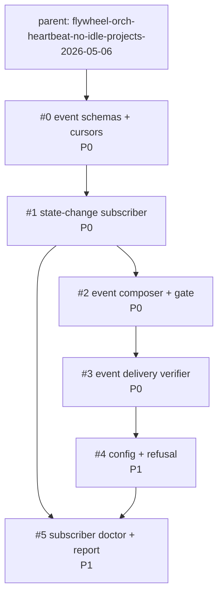

# Phase 5 Polish r1 DAG preview: event-driven orch heartbeat

Preview only. This file does not mutate the nine existing Phase 4 bead rows.

## Existing bead dispositions

### Mark dropped

| Existing bead ID | Proposed status | Reason |
|---|---|---|
| `flywheel-orch-heartbeat-tick-driver-doctor-2026-05-06` | dropped | Cron tick-driver is no longer the primary mechanism. Subscriber health and fallback-poll health replace cadence ownership. |
| `flywheel-orch-heartbeat-morning-report-projection-2026-05-06` | dropped | Morning report projection becomes a consumer of subscriber doctor state, not a standalone implementation bead. |
| `flywheel-orch-heartbeat-manager-state-integration-2026-05-06` | dropped | Manager-state integration is downstream polish after local subscriber quietness is proven. |

### Mark revised

| Existing bead ID | Proposed status | Delta |
|---|---|---|
| `flywheel-orch-heartbeat-candidate-schemas-2026-05-06` | revised | Replace periodic candidate snapshot schema with event transition and cursor schemas. |
| `flywheel-orch-heartbeat-readonly-composer-2026-05-06` | revised | Consume subscriber transitions and merge with idempotency/TRUE-blocker gate. |
| `flywheel-orch-heartbeat-idle-idempotency-gate-2026-05-06` | revised | Gate event-triggered prompt candidates with structural action hash and live idle state. |
| `flywheel-orch-heartbeat-delivery-verifier-2026-05-06` | revised | Keep L91 verifier, but explicitly consume subscriber handoff receipts. |
| `flywheel-orch-heartbeat-session-config-allowlist-2026-05-06` | revised | Convert allowlist to subscription config with peer delivery disabled by default. |
| `flywheel-orch-heartbeat-cross-session-refusal-tests-2026-05-06` | revised | Test event-triggered refusal paths, not cron-triggered prompt paths. |

## New bead IDs to file in follow-up

| New bead ID | Wave | Priority | Origin |
|---|---|---:|---|
| `flywheel-orch-heartbeat-event-schemas-and-cursors-2026-05-06` | A | P0 | transforms existing #0 |
| `flywheel-orch-heartbeat-state-change-subscriber-2026-05-06` | A | P0 | new subscriber primitive |
| `flywheel-orch-heartbeat-event-composer-and-gate-2026-05-06` | B | P0 | transforms/merges existing #1 and #2 |
| `flywheel-orch-heartbeat-event-delivery-verifier-2026-05-06` | B | P0 | keeps/revises existing #3 |
| `flywheel-orch-heartbeat-event-config-and-refusal-2026-05-06` | C | P1 | transforms/merges existing #6 and #7 |
| `flywheel-orch-heartbeat-subscriber-doctor-report-2026-05-06` | D | P1 | collapses existing #4/#5 and defers #8 |

## Reconverged Mermaid DAG

No cycles expected. Critical path after reconvergence:

`event schemas + cursors -> state-change subscriber -> event composer + gate -> event delivery verifier -> config + refusal -> subscriber doctor + report`

## Wave preview

| Wave | Beads | Meaning |
|---|---|---|
| A | event schemas + cursors; state-change subscriber | Foundation: event truth and fallback poll. |
| B | event composer + gate; event delivery verifier | Integration: safe prompt handoff and evidence-based delivery. |
| C | config + refusal | Polish: first-ship boundary and peer refusal coverage. |
| D | subscriber doctor + report | Cross-fleet: visible lag, fallback use, and fleet rollup readiness. |

Net bead count delta: 9 -> 6.

Disposition counts over existing nine: kept=1, collapsed=3, transformed=5.
New follow-up beads: 1 wholly new primitive and 5 revised/merged beads.
