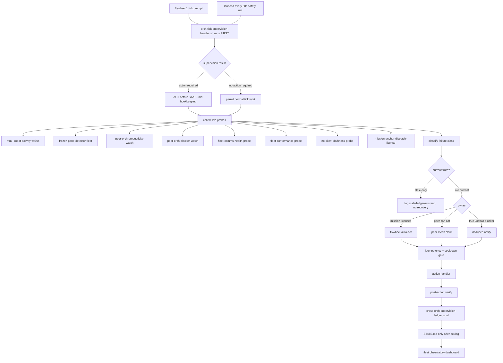
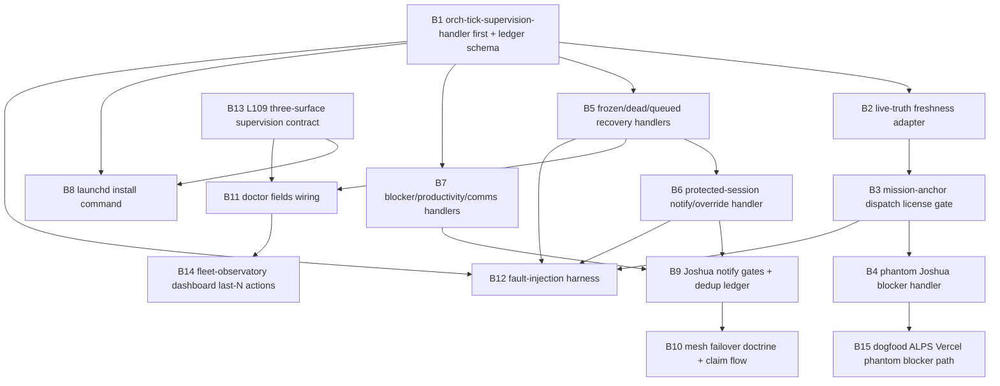

# 01-RESEARCH-C - Lane C Implementation Design

Plan: `orch-monitor-recovery-auto-act-2026-05-04`
Phase: `1.RESEARCH`
Lane: `C implementation design`
Date: 2026-05-04
Mode: read-only design draft for Joshua review

## 1. Executive summary

Lane C designs the missing auto-act layer between fleet observatory probes and
actual recovery. Finding 7 in `00-INTENT.md` sharpens the requirement: this is
not primarily a background daemon. The load-bearing primitive is the
`orch-tick-supervision-handler`, and it must run first in every `flywheel:1`
tick before STATE.md tick lines, dispatch-log bookkeeping, or sleep scheduling.

CoralRaven's ALPS report is the lead evidence source, not a side note:

- Report path: `/Users/josh/Developer/alpsinsurance/.flywheel/reports/2026-05-04-vercel-blocker-deep-dive.md`
- Class: `orchestrator-self-block-on-decidable-task`
- Root cause: the substrate has refuse-gates but no symmetric permit-gates.
- Sharp fix: add `mission-anchor-dispatch-license.sh` so locked mission scope
  authorizes tactical execution instead of requiring Joshua to re-approve it.
- Same-day pattern: Supabase password, region selection, and Vercel dispatch
  all got miscompiled as Joshua decisions even after mission lock settled them.

This design therefore treats auto-act as a decision system, not only a process
restarter. The central supervisor must answer four questions at the start of
every orch-of-orch tick:

1. Is this current truth from live probes, not stale ledger rows?
2. Is the action inside a locked mission envelope, or outside it?
3. If inside the envelope, which automation owns the next safe action?
4. Did we act, or are we merely logging a measurement that should trigger?

The proposed tick-handler script is:

`/Users/josh/Developer/flywheel/.flywheel/scripts/orch-tick-supervision-handler.sh`

The proposed reusable action engine is:

`/Users/josh/Developer/flywheel/.flywheel/scripts/orch-supervision-loop.sh`

The proposed ledger is:

`~/.local/state/flywheel/cross-orch-supervision-ledger.jsonl`

The proposed tick integration surface is:

`flywheel-loop tick --supervision-first`

The proposed daemon install surface, secondary to the tick handler, is:

`flywheel-loop install --supervision-loop`

The handler starts in shadow mode for 24 hours, then moves to `--apply` after
its decision ledger has zero false-positive recoveries and zero unbounded notify
storms. During shadow mode it still fails the tick if a finding would have
required action and the orchestrator tries to write a passive STATE.md-only
receipt.

### Architecture diagram



## 2. Core design principles

1. Observatory probes are producers, not owners.
2. The orch tick handler is the decision owner and must run first.
3. Ledger rows are history. They are not current truth.
4. Every state assertion needs fresh live evidence.
5. Mission lock is the strategic approval boundary.
6. `mission-anchor-dispatch-license.sh` is the tactical permit gate.
7. Recovery is idempotent by `(session, pane, class, attempt_window)`.
8. PROTECTED session recovery uses evidence-based gates, not session-name folklore.
9. Joshua notification is reserved for true founder-only blockers.
10. Auto-act decisions must be doctor-visible, not buried in launchd logs.
11. Mesh failover must work when `flywheel:1` is the failed orchestrator.
12. Shadow mode comes first because false recovery is worse than slow recovery.
13. A tick that only reads doctor JSON and logs STATE.md is a failed tick when
    actionable fleet findings exist.

## 3. Proposed tick handler and supervisor CLI

The load-bearing primitive is the tick handler:

```bash
.flywheel/scripts/orch-tick-supervision-handler.sh
```

It is called before every `flywheel:1` tick does anything else:

```bash
.flywheel/scripts/orch-tick-supervision-handler.sh --tick-id "$FLYWHEEL_TICK_ID" --apply --json
```

Contract:

- It reads the full fleet observatory bundle.
- It classifies every non-green field to a failure class.
- It executes the safe action or emits the deduped Joshua notify.
- It writes a supervision ledger row for each finding.
- It exits non-zero if an actionable finding was only logged and not acted.
- It returns a compact JSON summary for `STATE.md` after action completes.

The previous passive rhythm was:

```text
read doctor JSON -> write STATE.md tick line -> schedule sleep
```

The corrected rhythm is:

```text
read observatory fields -> classify -> ACT or notify -> verify -> log -> then sleep
```

This is the difference between a ledger keeper and an orchestrator.

`orch-supervision-loop.sh` is the reusable action engine. The tick handler calls
it once per tick; launchd can also call it as a safety net when no live tick is
running.

Script:

```bash
.flywheel/scripts/orch-supervision-loop.sh
```

Canonical CLI shape:

```bash
.flywheel/scripts/orch-tick-supervision-handler.sh --info --json
.flywheel/scripts/orch-tick-supervision-handler.sh --dry-run --json
.flywheel/scripts/orch-tick-supervision-handler.sh --apply --json
.flywheel/scripts/orch-tick-supervision-handler.sh --tick-id <id> --apply --json
.flywheel/scripts/orch-supervision-loop.sh --info --json
.flywheel/scripts/orch-supervision-loop.sh --doctor --json
.flywheel/scripts/orch-supervision-loop.sh --health --json
.flywheel/scripts/orch-supervision-loop.sh --schema --json
.flywheel/scripts/orch-supervision-loop.sh --examples --json
.flywheel/scripts/orch-supervision-loop.sh --dry-run --json
.flywheel/scripts/orch-supervision-loop.sh --apply --json
.flywheel/scripts/orch-supervision-loop.sh --class frozen-worker --session skillos --pane 1 --dry-run --json
.flywheel/scripts/orch-supervision-loop.sh --audit --json
.flywheel/scripts/orch-supervision-loop.sh --why <ledger_id> --json
```

Why shell over Python for Phase 4 bead 1:

- The existing probe ecosystem is shell-heavy.
- The action handlers already compose shell CLIs (`ntm`, `jq`, `notify`).
- The first implementation should be a thin shell tick handler plus shell
  dispatcher with JSON contracts.
- If the per-class policy table grows beyond 400 lines, split to Python policy
  modules under `.flywheel/scripts/orch_supervision/`.

Minimum environment:

```bash
ORCH_SUPERVISION_LEDGER="$HOME/.local/state/flywheel/cross-orch-supervision-ledger.jsonl"
ORCH_SUPERVISION_STATE_DIR="$HOME/.local/state/flywheel/orch-supervision"
ORCH_SUPERVISION_LOCK_DIR="$HOME/.local/state/flywheel/orch-supervision/locks"
ORCH_SUPERVISION_NOTIFY_LEDGER="$HOME/.local/state/flywheel/orch-supervision-notify.jsonl"
ORCH_SUPERVISION_MODE="shadow|apply"
ORCH_SUPERVISION_TICK_SECONDS=60
ORCH_SUPERVISION_COOLDOWN_SECONDS=300
ORCH_SUPERVISION_RECOVERY_SLO_SECONDS=180
ORCH_SUPERVISION_FIRST_IN_TICK=1
```

## 4. Tick handler algorithm

Tick-handler pseudo-code:

```bash
tick_handler() {
  tick_id="${FLYWHEEL_TICK_ID:-$(date -u +%Y%m%dT%H%M%SZ)}"
  result="$(orch_supervision_loop --tick-id "$tick_id" --apply --json)"
  printf '%s\n' "$result" >> "$ORCH_SUPERVISION_LEDGER"
  if echo "$result" | jq -e '.unacted_actionable_count > 0' >/dev/null; then
    echo "orch supervision found actionable fleet findings that were not acted" >&2
    return 73
  fi
  export ORCH_SUPERVISION_TICK_SUMMARY="$result"
  return 0
}
```

The handler becomes the first line of the live `flywheel:1` tick path:

```bash
orch-tick-supervision-handler.sh --apply --json
flywheel-loop doctor --repo /Users/josh/Developer/flywheel --json
append_state_tick_line_from_supervision_summary
continue_dispatch_or_planning_work
```

The action engine pseudo-code:

```bash
main() {
  acquire_global_lock_or_exit
  now="$(date -u +%Y-%m-%dT%H:%M:%SZ)"
  probes="$(collect_probe_bundle --max-age 60)"
  findings="$(classify_findings "$probes")"
  for finding in $(priority_order "$findings"); do
    decision="$(decide_owner "$finding" "$probes")"
    key="$(idempotency_key "$finding" "$decision")"
    if cooldown_active "$key"; then
      log_decision skipped_cooldown "$finding" "$decision" "$key"
      continue
    fi
    if [[ "$ORCH_SUPERVISION_MODE" == shadow ]]; then
      log_decision planned "$finding" "$decision" "$key"
      continue
    fi
    action_result="$(execute_handler "$finding" "$decision" "$key")"
    verify_result="$(verify_after_action "$finding" "$action_result")"
    log_decision applied "$finding" "$decision" "$key" "$action_result" "$verify_result"
  done
}
```

Probe collection must fail closed for current-state claims:

```bash
ntm --robot-activity=<session> --activity-type=codex,claude --json
.flywheel/scripts/frozen-pane-detector-fleet.sh --json
.flywheel/scripts/peer-orch-productivity-watch.sh --fleet --json
.flywheel/scripts/peer-orch-blocker-watch.sh --json
.flywheel/scripts/fleet-comms-health-probe.sh --fleet --json
.flywheel/scripts/fleet-conformance-probe.sh --doctor --json
.flywheel/scripts/no-silent-darkness-probe.sh --doctor --json
~/.claude/commands/flywheel/_shared/mission-anchor-dispatch-license.sh --repo <repo> --task '<candidate>' --json
```

Freshness rule:

```bash
jq -e '.checked_at_epoch >= (now_epoch - 60)' probe.json
```

If a finding exists only in a JSONL ledger row older than 60 seconds and has no
fresh live corroboration, classify it as `stale-ledger-misread-as-current` and
do not recover.

## 5. Ledger schema

Every decision appends one JSON object:

```json
{
  "schema_version": "cross-orch-supervision-ledger/v1",
  "ts": "2026-05-04T22:30:00Z",
  "supervisor_session": "flywheel",
  "supervisor_pane": 1,
  "target_session": "skillos",
  "target_pane": 1,
  "target_project_key": "/Users/josh/Developer/skillos",
  "failure_class": "frozen-orchestrator",
  "source_probe": ".flywheel/scripts/frozen-pane-detector-fleet.sh",
  "source_probe_ts": "2026-05-04T22:29:58Z",
  "live_truth_fresh": true,
  "mission_license": {
    "status": "licensed",
    "repo": "/Users/josh/Developer/skillos",
    "mission_lock_id": "abc",
    "matched_terms": ["skillos", "worker recovery"]
  },
  "owner": "flywheel:1",
  "decision": "recover",
  "mode": "shadow|apply",
  "idempotency_key": "skillos:1:frozen-orchestrator:20260504T2225",
  "cooldown_seconds": 300,
  "slo_started_at": "2026-05-04T22:28:20Z",
  "slo_expires_at": "2026-05-04T22:31:20Z",
  "action_sequence": ["snapshot", "work_loss_audit", "recover", "verify"],
  "action_status": "planned|applied|skipped|failed|notified",
  "verify_status": "pass|fail|not_applicable",
  "notify_sent": false,
  "notify_dedup_key": null,
  "bead_id": null,
  "errors": [],
  "artifacts": []
}
```

Doctor fields produced from ledger:

```json
{
  "peer_orch_recoveries_24h_count": 3,
  "peer_orch_recovery_last_class": "frozen-orchestrator",
  "peer_orch_recovery_last_outcome": "verified",
  "peer_orch_recovery_slo_breach_count_24h": 0,
  "peer_orch_notify_sent_24h_count": 1,
  "peer_orch_false_recovery_count_24h": 0,
  "peer_orch_stale_ledger_misread_count_24h": 0,
  "peer_orch_phantom_joshua_blocker_count_24h": 0,
  "peer_orch_passive_ledger_tick_count_24h": 0,
  "peer_orch_unacted_actionable_count_24h": 0
}
```

## 6. Action table

Each row below is intentionally concrete enough to dispatch into Phase 4 beads.

### 6.1 frozen-worker

Detection query:

```bash
.flywheel/scripts/frozen-pane-detector-fleet.sh --json \
  | jq '.sessions[]?.frozen_panes[]? | select(.pane_role == "worker")'
```

Action sequence:

1. Re-run live `ntm --robot-activity=<session>` and require age <= 60 seconds.
2. Run multi-frame verify through frozen-pane detector.
3. If target is not PROTECTED, run existing frozen-pane auto-recover dry-run.
4. Capture snapshot and recovery lease.
5. Apply recovery: restart pane, relaunch Codex, wait 8 seconds, inject resume prompt.
6. Re-probe with multi-frame detector.
7. Log ledger row.

Idempotency key:

```text
<session>:<pane>:frozen-worker:<floor(now/300s)>
```

SLO clock:

- Starts: first live frozen detection timestamp.
- Expires: 180 seconds after start.

Joshua-notify trigger:

- Recovery failed 3 attempts in same 30-minute window.
- Recovery would touch PROTECTED without confirmed override.

Doctor field:

```text
peer_orch_recoveries_24h_count
peer_orch_recovery_last_class=frozen-worker
peer_orch_recovery_last_outcome=<verified|failed>
```

Ledger row status:

```json
{"failure_class":"frozen-worker","decision":"recover","action_status":"applied","verify_status":"pass"}
```

### 6.2 frozen-orchestrator

Detection query:

```bash
.flywheel/scripts/frozen-pane-detector-fleet.sh --json \
  | jq '.sessions[]?.frozen_panes[]? | select(.pane_role == "orchestrator")'
```

Action sequence:

1. Require live activity <= 60 seconds.
2. Require multi-frame identical hash or timer-identical fast path.
3. Snapshot pane and current dispatch ledger.
4. If unprotected, recover through `protected-session-recovery.sh --dry-run`.
5. If dry-run reports no work-loss findings and pane is not protected, apply.
6. Re-inject orchestrator resume prompt referencing latest `STATE.md`.
7. Verify a fresh pane frame after recovery.

Idempotency key:

```text
<session>:<pane>:frozen-orchestrator:<floor(now/300s)>
```

SLO clock:

- Starts at first live frozen-orchestrator finding.
- Expires at 180 seconds.

Joshua-notify trigger:

- PROTECTED session needs override.
- Work-loss audit nonzero.
- 3 failed recovery attempts.

Doctor field:

```text
peer_orch_recovery_last_class=frozen-orchestrator
peer_orch_recovery_last_outcome=<verified|protected_notify|failed>
```

Ledger row status:

```json
{"failure_class":"frozen-orchestrator","decision":"recover_or_notify","protected":false}
```

### 6.3 protected-session-frozen

Detection query:

```bash
.flywheel/scripts/frozen-pane-detector-fleet.sh --json \
  | jq '.sessions[]?.frozen_panes[]? | select(.protected == true)'
```

Action sequence:

1. Capture live pane snapshot.
2. Run work-loss audit from protected-session-recovery skill.
3. Do not respawn by default.
4. If no override exists, send Joshua-notify with override prompt.
5. If Joshua override receipt exists, apply with:
   `--force-recover --operator-authorized --evidence-source joshua-confirmed`.
6. Preserve `(session,pane,project)` tuple and predecessor identity chain.
7. Re-verify live state after action.

Idempotency key:

```text
<session>:<pane>:protected-session-frozen:<floor(now/900s)>
```

SLO clock:

- Starts at live protected freeze confirmation.
- Notify due at 180 seconds.
- Recovery applies only after override.

Joshua-notify trigger:

- Always notify when protected freeze remains current after multi-frame verify.

Doctor field:

```text
protected_session_recovery_override_pending_count
peer_orch_notify_sent_24h_count
```

Ledger row status:

```json
{"failure_class":"protected-session-frozen","decision":"notify","notify_reason":"protected_override_required"}
```

### 6.4 dead-codex

Detection query:

```bash
ntm --robot-activity=<session> --activity-type=codex --json \
  | jq '.agents[] | select(.state == "DEAD" or .state == "MISSING")'
```

Action sequence:

1. Confirm target pane exists in session topology.
2. Capture scrollback if possible.
3. Check in-flight dispatch ledger for that pane.
4. If no active unacknowledged dispatch, respawn and relaunch Codex.
5. If active dispatch exists, inject resume prompt with callback contract.
6. Verify four-state dispatch receipt if a prompt is resent.

Idempotency key:

```text
<session>:<pane>:dead-codex:<floor(now/300s)>
```

SLO clock:

- Starts at first live DEAD/MISSING finding.
- Expires at 180 seconds.

Joshua-notify trigger:

- 3 failed respawns.
- Session transport unavailable.

Doctor field:

```text
peer_orch_dead_pane_recoveries_24h_count
```

Ledger row status:

```json
{"failure_class":"dead-codex","decision":"respawn","verify_status":"pass"}
```

### 6.5 queued-not-submitted

Detection query:

```bash
.flywheel/scripts/frozen-pane-detector-fleet.sh --json \
  | jq '.sessions[]?.queued_not_submitted[]?'
```

Action sequence:

1. Verify prompt visible but not submitted via dispatch-delivery receipt.
2. Send bare Enter or re-submit through the existing queued submission handler.
3. Wait 8 seconds.
4. Re-run verify-callback-delivery or activity probe.
5. If still not started, re-dispatch with same task id and mark duplicate attempt.

Idempotency key:

```text
<session>:<pane>:queued-not-submitted:<dispatch_id>
```

SLO clock:

- Starts at prompt visible but no work_started after grace window.
- Expires at 180 seconds.

Joshua-notify trigger:

- Only if NTM send/capture substrate is down.

Doctor field:

```text
dispatch_not_started_recovered_count_24h
```

Ledger row status:

```json
{"failure_class":"queued-not-submitted","decision":"submit_or_redispatch"}
```

### 6.6 idle-with-work-available

Detection query:

```bash
.flywheel/scripts/peer-orch-productivity-watch.sh --fleet --json \
  | jq '.sessions[]? | select(.state == "idle_with_work_available")'
```

Action sequence:

1. Confirm live worker panes are WAITING.
2. Confirm ready work, doctor errors, unfiled findings, or process gaps exist.
3. Dispatch or ask peer orchestrator to dispatch via xpane packet.
4. If peer is unresponsive, flywheel:1 dispatches a worker directly.
5. Log owner and dispatch id.

Idempotency key:

```text
<session>:fleet:idle-with-work-available:<floor(now/300s)>
```

SLO clock:

- Starts when idle state exceeds threshold, default 300 seconds.
- Expires next supervisor tick after threshold.

Joshua-notify trigger:

- None unless work is classified true_josh_blocker.

Doctor field:

```text
peer_orch_auto_dispatches_24h_count
```

Ledger row status:

```json
{"failure_class":"idle-with-work-available","decision":"dispatch","owner":"flywheel:1"}
```

### 6.7 blocker-stuck-flywheel-class

Detection query:

```bash
.flywheel/scripts/peer-orch-blocker-watch.sh --json \
  | jq '.stale_blockers[]? | select(.blocker_type == "flywheel_class")'
```

Action sequence:

1. Confirm stale blocker row is not already acknowledged by flywheel:1.
2. Confirm current state with live probe if the blocker claims pane liveness.
3. Route to flywheel:1 work queue or immediate same-tick dispatch.
4. Send xpane ack to peer orchestrator.
5. File or update fix bead if durable substrate work is required.

Idempotency key:

```text
<peer>:fleet:blocker-stuck-flywheel-class:<blocker_class>:<floor(now/300s)>
```

SLO clock:

- Starts at blocker row timestamp.
- Expires at 5 minutes.

Joshua-notify trigger:

- None unless flywheel substrate itself is corrupt and cannot write beads/dispatch.

Doctor field:

```text
peer_orch_blocker_auto_ack_count_24h
```

Ledger row status:

```json
{"failure_class":"blocker-stuck-flywheel-class","decision":"ack_and_route"}
```

### 6.8 true-josh-blocker

Detection query:

```bash
.flywheel/scripts/peer-orch-productivity-watch.sh --fleet --json \
  | jq '.sessions[]? | select(.state == "true_josh_blocker")'
```

Action sequence:

1. Require blocker classifier evidence.
2. Run mission license gate; if licensed, reclassify to phantom blocker.
3. If unlicensed and class is security, PHI, destructive, financial commitment,
   or explicit client-visibility approval, build notify payload.
4. Dedup notify by `(session,class,mission_lock_id,window)`.
5. Log notify row and include exact action Joshua must take.

Idempotency key:

```text
<session>:fleet:true-josh-blocker:<class>:<floor(now/900s)>
```

SLO clock:

- Starts at second tick where true_josh_blocker remains current.
- Notify due immediately after second tick.

Joshua-notify trigger:

- Always, after dedup and current-truth verification.

Doctor field:

```text
true_josh_blocker_notify_pending_count
true_josh_blocker_notify_sent_24h_count
```

Ledger row status:

```json
{"failure_class":"true-josh-blocker","decision":"notify","dedup_window_seconds":900}
```

### 6.9 phantom-joshua-blocker

Detection query:

```bash
~/.claude/commands/flywheel/_shared/mission-anchor-dispatch-license.sh \
  --repo <peer_repo> --task '<blocked action>' --json \
  | jq 'select(.status == "licensed")'
```

Action sequence:

1. Parse blocker text from peer-orch ledger or productivity probe.
2. Run mission license gate against the peer repo.
3. If licensed, classify as `phantom-joshua-blocker`.
4. Do not notify Joshua.
5. Dispatch the mission-aligned task or tell peer to execute.
6. Log CoralRaven-style correction row.
7. If the peer repeats the pattern, broadcast self-check packet.

Idempotency key:

```text
<session>:fleet:phantom-joshua-blocker:<mission_lock_id>:<action_hash>
```

SLO clock:

- Starts when blocker is labeled Joshua-required.
- Expires at the next supervisor tick after license returns `licensed`.

Joshua-notify trigger:

- None. The whole point is not to notify Joshua.

Doctor field:

```text
phantom_joshua_blocker_auto_resolved_count_24h
```

Ledger row status:

```json
{"failure_class":"phantom-joshua-blocker","decision":"execute_inside_locked_envelope","notify_sent":false}
```

CoralRaven asks covered:

- Bead A: strategic-vs-tactical doctrine note.
- Bead B: license-gate spec.
- Bead C: dispatch consults license-gate.
- Bead D: cross-orch self-check broadcast.

### 6.10 stale-ledger-misread-as-current

Detection query:

```bash
ledger_ts="$(jq -r '.ts' stale-row.json)"
ntm --robot-activity=<session> --activity-type=codex,claude --json \
  | jq --argjson now "$(date -u +%s)" 'select(.checked_at_epoch >= ($now - 60))'
```

Action sequence:

1. When a proposed action cites a ledger row, compute row age.
2. If row age > 60 seconds and no fresh live probe corroborates it, block action.
3. Log stale-ledger-misread row.
4. Update classifier evidence with current live truth.
5. If the old row represented a real past problem, leave it as trend evidence only.

Idempotency key:

```text
<session>:<pane>:stale-ledger-misread-as-current:<ledger_line>
```

SLO clock:

- Starts when stale row is used in a decision candidate.
- Expires immediately; this is a false-positive guard, not recovery.

Joshua-notify trigger:

- None. Stale evidence must never notify Joshua.

Doctor field:

```text
stale_ledger_misread_blocked_count_24h
```

Ledger row status:

```json
{"failure_class":"stale-ledger-misread-as-current","decision":"block_recovery","live_truth_fresh":false}
```

### 6.11 no-tick-3d

Detection query:

```bash
find ~/.local/state/flywheel-loop -name 'last_tick_*.json' -mtime +3 -print
```

Action sequence:

1. Verify loop marker and driver proof.
2. If marker-only, route to loop-driver repair.
3. If driver exists but stale, send tick prompt through NTM.
4. If repo intentionally paused, require explicit pause receipt.
5. Log recovery or pause classification.

Idempotency key:

```text
<session>:fleet:no-tick-3d:<date>
```

SLO clock:

- Starts at 3 days since last tick receipt.
- Expires at next supervisor run.

Joshua-notify trigger:

- Only if the session is client-critical and the driver cannot be repaired.

Doctor field:

```text
stale_loop_driver_recovered_count_24h
```

Ledger row status:

```json
{"failure_class":"no-tick-3d","decision":"repair_driver_or_tick"}
```

### 6.12 fleet-comms-silent

Detection query:

```bash
.flywheel/scripts/fleet-comms-health-probe.sh --fleet --json \
  | jq '.sessions[]? | select(.silent == true or .score < 60)'
```

Action sequence:

1. Verify Agent Mail token mtime only; never read raw token.
2. Verify cross-orch packet age.
3. Verify live NTM activity before claiming the session is silent.
4. Send `COMMS_HEALTH_PING` through xpane or Agent Mail.
5. If ping unread after second tick, escalate to flywheel:1 action queue.

Idempotency key:

```text
<session>:fleet:fleet-comms-silent:<floor(now/3600s)>
```

SLO clock:

- Starts when silent session crosses comms threshold.
- Expires at second supervisor tick.

Joshua-notify trigger:

- Only when 3+ sessions are silent in same tick.

Doctor field:

```text
fleet_comms_auto_ping_count_24h
```

Ledger row status:

```json
{"failure_class":"fleet-comms-silent","decision":"ping","notify_sent":false}
```

### 6.13 substrate-corrupt

Detection query:

```bash
~/.claude/skills/.flywheel/bin/flywheel-loop doctor --repo /Users/josh/Developer/flywheel --json \
  | jq '.beads_db_health.status, .agent_mail_fd_pressure.status, .identity_registry.status'
```

Action sequence:

1. Stop new pane recovery mutations.
2. Run substrate-specific self-heal in dry-run mode.
3. If known repair is safe, dispatch flywheel-owned repair bead.
4. If Beads DB or Agent Mail cannot safely write, notify Joshua with exact probe ledger.
5. Log recovery hold.

Idempotency key:

```text
flywheel:fleet:substrate-corrupt:<substrate>:<floor(now/900s)>
```

SLO clock:

- Starts at first doctor fail for substrate.
- Notify after one failed self-heal attempt or 2 ticks unresolved.

Joshua-notify trigger:

- Beads DB corrupt and repair cannot guarantee zero loss.
- Agent Mail down and no fallback callback path.
- NTM down and no pane transport available.

Doctor field:

```text
substrate_corrupt_supervision_hold_count_24h
```

Ledger row status:

```json
{"failure_class":"substrate-corrupt","decision":"hold_and_notify","new_recoveries_paused":true}
```

### 6.14 multi-session-storm

Detection query:

```bash
.flywheel/scripts/fleet-observatory-aggregate.sh --json \
  | jq 'select((.spines[]? | select(.status == "red")) as $red | true)'
```

Better Phase 4 query:

```bash
orch-supervision-loop.sh --dry-run --json \
  | jq '.findings | group_by(.failure_class)[] | select(length >= 3)'
```

Action sequence:

1. Count degraded sessions in same 60-second tick.
2. If count >= 3, switch supervisor to storm mode.
3. Run only read-only probes and one recovery at a time.
4. Send Pushover summary if count >= 3.
5. Send emergency Pushover if count >= 5.
6. Continue ledger writes.

Idempotency key:

```text
fleet:all:multi-session-storm:<floor(now/900s)>
```

SLO clock:

- Starts when third session degrades in same tick.
- Notify immediately.

Joshua-notify trigger:

- 3 sessions degraded same tick: priority 1.
- 5 sessions degraded same tick: emergency priority.

Doctor field:

```text
fleet_supervision_storm_mode_active
fleet_supervision_storm_session_count
```

Ledger row status:

```json
{"failure_class":"multi-session-storm","decision":"storm_mode_notify","degraded_session_count":3}
```

### 6.15 passive-ledger-keeper-tick

Detection query:

```bash
orch-tick-supervision-handler.sh --audit-last-tick --json \
  | jq -e '.actionable_findings_count > 0 and .actions_applied_count == 0 and .notify_sent_count == 0'
```

Fallback detection, before the handler exists:

```bash
flywheel-loop doctor --repo /Users/josh/Developer/flywheel --json \
  | jq -e '[
      .peer_orch_idle_with_work_available_count // 0,
      .fleet_three_surface_drift_total_count // 0,
      .fleet_observatory_red_count // 0,
      .peer_orch_stale_blockers_count // 0
    ] | add > 0'
```

Action sequence:

1. Stop the passive tick path before it writes a STATE.md-only receipt.
2. Re-run the supervision handler in `--dry-run` to list required actions.
3. If all required actions are safe and licensed, run `--apply`.
4. If any action is true-Joshua-gated, send the deduped notify.
5. Write a tick summary that includes `actions_applied_count` and
   `unacted_actionable_count`.
6. If `unacted_actionable_count > 0`, exit non-zero so the tick cannot present
   itself as healthy.

Idempotency key:

```text
flywheel:1:passive-ledger-keeper-tick:<tick_id>
```

SLO clock:

- Starts at tick start.
- The handler must classify and decide within 60 seconds.
- Safe auto-act must start within 180 seconds for L99 classes.

Joshua-notify trigger:

- None for the first missed passive tick; the handler should self-correct.
- Notify only when `unacted_actionable_count > 0` for 2 consecutive ticks or
  when the unacted class is true-Joshua-gated.

Doctor field:

```text
peer_orch_passive_ledger_tick_count_24h
peer_orch_unacted_actionable_count_24h
peer_orch_tick_handler_first_run_last_ts
```

Ledger row status:

```json
{
  "failure_class": "passive-ledger-keeper-tick",
  "decision": "block_state_only_tick_and_apply_supervision",
  "actionable_findings_count": 2,
  "actions_applied_count": 2,
  "unacted_actionable_count": 0
}
```

## 7. Joshua-notify gate spec

Notify command:

```bash
~/.local/bin/notify --priority 1 "<title>" "<body>"
```

For emergency storm:

```bash
~/.local/bin/notify --priority 2 "<title>" "<body>"
```

Dedup ledger:

`~/.local/state/flywheel/orch-supervision-notify.jsonl`

Notify payload schema:

```json
{
  "schema_version": "orch-supervision-notify/v1",
  "ts": "2026-05-04T22:30:00Z",
  "dedup_key": "protected-session-frozen:skillos:1:20260504T2230",
  "priority": 1,
  "title": "Flywheel protected session needs override",
  "body": "skillos:1 frozen 180s; protected recovery requires Joshua-confirmed override.",
  "failure_class": "protected-session-frozen",
  "target_session": "skillos",
  "target_pane": 1,
  "required_decision": "approve protected recovery or leave paused",
  "evidence_paths": []
}
```

Notify gates:

1. `substrate-corrupt`
   - Detection: doctor field fail for Beads DB, Agent Mail, NTM, identity registry.
   - Payload: substrate name, self-heal attempted, exact remaining ask.
   - Dedup: 15 minutes per substrate.

2. `protected-session-frozen`
   - Detection: live protected freeze + multi-frame verify.
   - Payload: session, pane, project key, work-loss audit path, override command.
   - Dedup: 15 minutes per `(session,pane)`.

3. `multi-session-storm`
   - Detection: 3+ sessions degraded in same supervision tick.
   - Payload: count, classes, top affected sessions.
   - Dedup: 15 minutes for 3-session storm, 5 minutes for 5-session emergency.

4. `approval-required`
   - Detection: mission license returns `unlicensed` and classifier says security,
     PHI, destructive, financial, or client-visibility approval.
   - Payload: exact strategic decision needed.
   - Dedup: 30 minutes per mission lock and class.

5. `recovery-failed-3x`
   - Detection: same class for same pane failed 3 times in 30-minute window.
   - Payload: actions attempted, last error, suggested safe next step.
   - Dedup: 30 minutes.

Explicit non-gate:

- `phantom-joshua-blocker` must never notify. It executes inside locked mission
  scope and reports outcome.

## 8. launchd safety-net design

The primary driver is `orch-tick-supervision-handler.sh` inside every
`flywheel:1` tick. launchd is only the safety net for the exact case where the
orch-of-orch tick is not running or has itself become passive. This matters
because Finding 7 was not "no daemon exists"; it was "the live orchestrator saw
measurements and logged them instead of acting."

Tick integration point:

```bash
# first command in every flywheel:1 tick
.flywheel/scripts/orch-tick-supervision-handler.sh --apply --json
```

The normal tick must treat the handler summary as its own pre-flight. A STATE.md
line is valid only after this command has completed and either acted or proved
there was nothing to act on.

Plist:

`~/Library/LaunchAgents/ai.zeststream.flywheel-orch-supervision-loop.plist`

Draft:

```xml
<?xml version="1.0" encoding="UTF-8"?>
<!DOCTYPE plist PUBLIC "-//Apple//DTD PLIST 1.0//EN"
  "http://www.apple.com/DTDs/PropertyList-1.0.dtd">
<plist version="1.0">
<dict>
  <key>Label</key>
  <string>ai.zeststream.flywheel-orch-supervision-loop</string>
  <key>ProgramArguments</key>
  <array>
    <string>/Users/josh/Developer/flywheel/.flywheel/scripts/orch-supervision-loop.sh</string>
    <string>--apply</string>
    <string>--json</string>
  </array>
  <key>StartInterval</key>
  <integer>60</integer>
  <key>KeepAlive</key>
  <dict>
    <key>SuccessfulExit</key>
    <false/>
  </dict>
  <key>StandardOutPath</key>
  <string>/Users/josh/.local/state/flywheel/orch-supervision/stdout.log</string>
  <key>StandardErrorPath</key>
  <string>/Users/josh/.local/state/flywheel/orch-supervision/stderr.log</string>
</dict>
</plist>
```

Install command design:

```bash
~/.claude/skills/.flywheel/bin/flywheel-loop install --supervision-loop --dry-run --json
~/.claude/skills/.flywheel/bin/flywheel-loop install --supervision-loop --apply --json
```

Install acceptance checks:

```bash
plutil -lint ~/Library/LaunchAgents/ai.zeststream.flywheel-orch-supervision-loop.plist
launchctl print gui/$(id -u)/ai.zeststream.flywheel-orch-supervision-loop
tail -n 1 ~/.local/state/flywheel/cross-orch-supervision-ledger.jsonl | jq .
```

Log rotation:

- Phase 4 should add `newsyslog` config or internal truncation.
- Maximum stdout/stderr size before rotate: 10 MB.
- Ledger is append-only JSONL and should be compacted only by a separate audit bead.

## 9. Calling-in-sick mesh failover

Doctrine draft path:

`~/.flywheel/canonical-meta-rules/orch-mesh-failover.md`

Doctrine draft:

```markdown
# ORCH-MESH-FAILOVER

If flywheel:1 fails current-truth liveness checks, any peer orchestrator may
claim first-responder ownership for one bounded recovery window. The claim key
is `(failed_session, failed_pane, failure_class, window)`. The first responder
must broadcast the claim, run only the pre-approved supervision action, write
the ledger row, and release the claim on resolve or timeout.
```

Mesh broadcast packet:

```json
{
  "schema_version": "orch-mesh-failover/v1",
  "ts": "2026-05-04T22:30:00Z",
  "from": "mobile-eats:1",
  "to": "fleet",
  "claim_id": "flywheel:1:frozen-orchestrator:20260504T2230",
  "failed_session": "flywheel",
  "failed_pane": 1,
  "failure_class": "frozen-orchestrator",
  "evidence": {
    "robot_activity_ts": "2026-05-04T22:29:58Z",
    "multi_frame_hash_identical": true
  },
  "action": "protected-session-recovery --dry-run",
  "ttl_seconds": 600,
  "release_condition": "verified_recovered|timeout|human_override"
}
```

Claim-token flow:

1. Peer detects `flywheel:1` is down with live probes.
2. Peer appends claim row to `~/.local/state/flywheel/orch-mesh-claims.jsonl`.
3. Peer sends xpane/Agent Mail broadcast.
4. Other peers check active claim and stand down.
5. Claim owner executes one bounded action.
6. Claim owner writes supervision ledger row.
7. Claim owner writes release row.

First responder priority:

1. `mobile-eats:1` if active and healthy.
2. `alpsinsurance:1` if active and not client-blocked.
3. `vrtx:1`.
4. `picoz:1` only if not intentionally protected/paused.
5. `skillos:1` only if not the subject of recovery.

## 10. Fault-injection self-test design

Test 1:

`tests/orch-supervision-fault-injection.sh`

Scenario:

- Fixture a worker pane as frozen through fake `ntm`.
- Run supervisor in `--apply` against fixtures.
- Expect recovery ledger row within SLO.
- Assert idempotency suppresses second attempt in cooldown.

Test 2:

`tests/orch-supervision-protected-session.sh`

Scenario:

- Fixture a PROTECTED pane as frozen.
- Run supervisor in `--apply`.
- Expect no respawn.
- Expect notify payload with override command.
- Assert dedup suppresses repeat notify in 15-minute window.

Test 3:

`tests/orch-supervision-phantom-joshua-blocker.sh`

Scenario:

- Fixture blocker text: "waiting for Vercel deploy approval".
- Fixture mission license result `licensed`.
- Expect decision `execute_inside_locked_envelope`.
- Assert `notify_sent=false`.

Test 4:

`tests/orch-supervision-stale-ledger.sh`

Scenario:

- Fixture 3-hour-old frozen ledger row.
- Fixture live `ntm --robot-activity` WAITING.
- Expect `stale-ledger-misread-as-current` and no recovery.

Test 5:

`tests/orch-supervision-dead-codex.sh`

Scenario:

- Fixture DEAD worker pane with no active dispatch.
- Expect respawn and resume prompt.

Test 6:

`tests/orch-supervision-queued-not-submitted.sh`

Scenario:

- Fixture `transport_accepted=true`, `prompt_visible=true`, `work_started=false`.
- Expect bare Enter or redispatch action.

Test 7:

`tests/orch-supervision-idle-with-work.sh`

Scenario:

- Fixture waiting workers plus ready bead.
- Expect dispatch/peer prompt, no notify.

Test 8:

`tests/orch-supervision-flywheel-blocker.sh`

Scenario:

- Fixture stale flywheel-class blocker row unacked >300s.
- Expect flywheel ack and route.

Test 9:

`tests/orch-supervision-substrate-corrupt.sh`

Scenario:

- Fixture Beads DB fail and Agent Mail healthy.
- Expect supervision hold and notify after self-heal fails.

Test 10:

`tests/orch-supervision-storm.sh`

Scenario:

- Fixture 3 sessions degraded in one tick.
- Expect storm mode, one-at-a-time action, notify.

Test 11:

`tests/orch-tick-supervision-handler-first.sh`

Scenario:

- Fixture doctor JSON with `peer_orch_idle_with_work_available_count=1`.
- Fixture a tick body that would otherwise append a STATE.md-only receipt.
- Run `orch-tick-supervision-handler.sh --apply` before the tick body.
- Expect the handler to dispatch or notify before STATE.md append.
- Assert a passive tick exits non-zero when actionable findings remain unacted.

Coverage assertion:

```bash
orch-tick-supervision-handler.sh --schema --json \
  | jq -e '.failure_classes as $classes | .fault_injection_tests as $tests | all($classes[]; $tests[.] != null)'
```

## 11. Phase 4 bead DAG



| Bead | Title | Depends | Acceptance gate |
|---|---|---|---|
| B1 | Build `orch-tick-supervision-handler.sh` as first command in every `flywheel:1` tick, plus `orch-supervision-loop.sh` engine and ledger schema | none | tick fixture proves handler runs before STATE.md/dispatch bookkeeping; `--doctor`, `--health`, `--schema`, `--dry-run` emit valid JSON |
| B2 | Live-truth freshness adapter | B1 | stale ledger row cannot trigger recovery without live probe <=60s |
| B3 | `mission-anchor-dispatch-license.sh` permit gate | B1 | licensed/unlicensed/ambiguous fixtures pass |
| B4 | Phantom Joshua blocker handler | B2,B3 | Vercel fixture executes inside lock and does not notify |
| B5 | Frozen/dead/queued recovery handlers | B1,B2 | recovery dry-run and apply fixture rows pass |
| B6 | Protected session handler | B5 | protected fixture notifies, never respawns without override |
| B7 | Productivity/blocker/comms handlers | B1,B2 | stale flywheel blocker acked; idle-with-work dispatch planned |
| B8 | Launchd safety net and `install --supervision-loop` | B1 | plist lint, bootstrap dry-run, launchctl print fixture; proves daemon is secondary to tick handler |
| B9 | Joshua notify gates and dedup ledger | B6,B7 | 5 gates covered; dedup windows enforced |
| B10 | Mesh failover doctrine and claim-token flow | B9 | claim/release fixtures pass |
| B11 | Doctor fields wiring | B1,B5,B7,B9 | fields visible in `flywheel-loop doctor --json` |
| B12 | Fault-injection tests | B3,B5,B6,B7 | every failure class has >=1 test |
| B13 | L109 three-surface supervision contract | B1 | AGENTS, canonical, template all carry L109 |
| B14 | Fleet observatory last-N actions | B11 | dashboard shows last supervision action and SLO breaches |
| B15 | Dogfood ALPS Vercel phantom blocker path | B4 | ALPS Vercel class resolves without Joshua notify |

Recommended dispatch waves:

- Wave 1: B1, B2, B3. B1 is the non-negotiable first bead because without it
  flywheel:1 remains a passive ledger-keeper.
- Wave 2: B4, B5, B7.
- Wave 3: B6, B9, B11.
- Wave 4: B8, B10, B12.
- Wave 5: B13, B14, B15.

## 12. CoralRaven asks as bead candidates

CoralRaven A:

- Bead: strategic-vs-tactical doctrine note.
- Output: L109 or companion doctrine.
- Acceptance: "locked-envelope tactical action executes; outside-envelope asks."

CoralRaven B:

- Bead: `mission-anchor-dispatch-license.sh`.
- Output: CLI spec and implementation.
- Acceptance: `licensed`, `unlicensed`, `ambiguous` fixtures.

CoralRaven C:

- Bead: `/flywheel:dispatch` consults license-gate.
- Output: dispatch preflight chain calls refuse-gate then permit-gate.
- Acceptance: Vercel fixture dispatches without Joshua prompt.

CoralRaven D:

- Bead: cross-orch broadcast self-check.
- Output: packet to active orchestrators asking them to scan for
  `phantom-joshua-blocker`.
- Acceptance: each peer writes receipt or explicit no-pattern-found.

## 13. Open questions for Joshua

1. Should auto-recover ever touch a PROTECTED_SESSION pane after explicit
   Joshua override?
   - Recommendation: yes, but only with `--force-recover --operator-authorized`
     and an evidence source in the receipt.

2. Should the same-class retry cooldown be 5 minutes?
   - Recommendation: yes for normal classes, 15 minutes for notify classes.

3. Is the storm threshold 3 sessions for priority 1 and 5 for emergency right?
   - Recommendation: yes for first phase; review after 7 days of shadow data.

4. If flywheel:1 is frozen, should mobile-eats:1 be first responder?
   - Recommendation: yes because it has lower client-risk than ALPS and is
     actively looped.

5. Should the launchd loop run shadow mode for 24 hours before `--apply`?
   - Recommendation: yes. Gate apply on zero false recovery and zero notify spam.

6. Should `phantom-joshua-blocker` auto-execute in every client repo?
   - Recommendation: yes only when mission license is `licensed`; ambiguous
     remains non-mutating and asks a precise question.

## 14. Risks

1. False positive recovery can lose work.
   - Mitigation: live truth <=60s, multi-frame verify, work-loss audit.

2. Notify spam can train Joshua to ignore alerts.
   - Mitigation: dedup ledger, only five gate classes, no routine silence alerts.

3. Mission license can over-permit.
   - Mitigation: `ambiguous` state, explicit prohibited domains, tests for PHI,
     security, destructive, financial, and client-visible classes.

4. Mesh failover can split brain.
   - Mitigation: claim-token TTL, first responder priority, release rows.

5. Supervisor can become a hidden daemon.
   - Mitigation: doctor fields, ledger audit, dashboard last-N action surface.

6. Beads DB substrate can be corrupt during recovery.
   - Mitigation: substrate-corrupt class pauses mutation and notifies with probe
     ledger rather than writing more Beads state.

## 15. Skills library cited

Skills applied:

- `donella-meadows-systems-thinking`: Meadows #6 information flow, #4
  self-organization, #9 delay, #3 goal boundary, #2 strategic paradigm.
- `canonical-cli-scoping`: supervisor exposes doctor/health/repair-style JSON,
  schema, examples, audit, why, dry-run/apply split.
- `observability-platform`: structured logs, bounded-cardinality fields,
  SLO-compatible metrics, decision ledger as observability source.
- `agent-fleet-management`: classify idle panes by binding constraint and avoid
  treating idle as agent failure.
- `flywheel-recovery`: snapshot before disruption, idempotent recovery, fail
  open/report closed, NTM-owned transport.
- `protected-session-recovery`: evidence-based PROTECTED recovery gate and
  `(session,pane,project)` identity key.
- `sla-monitoring`: 180-second recovery SLO, burn-rate style thresholding,
  proactive breach detection.
- `escalation-management`: notify only on severity-qualified gates with dedup
  and blameless routing.
- `dispatch-tool-contracts`: worker callbacks need machine-checkable fields,
  Socraticode survey, and proof that invariants ran.

Skill gap:

- There is no dedicated `mission-anchor-dispatch-license` skill yet. Phase 4
  should either add it to flywheel command docs or route a new skill candidate
  to skillos after the gate ships.

## 16. Acceptance summary

- Architecture diagram: yes.
- Action table rows: 15.
- `orch-tick-supervision-handler` specified as bead #1 and first tick command: yes.
- launchd plist designed: yes, as safety net only.
- Joshua-notify gates: 5.
- Mesh failover doctrine drafted: yes.
- Fault-injection tests: 11.
- Bead DAG count: 15.
- Joshua open questions: 6.
- CoralRaven report cited and absorbed: yes.
- Finding 7 passive-ledger-keeper correction absorbed: yes.
- CoralRaven asks A-D converted to beads: yes.
- `phantom-joshua-blocker` included: yes.
- `stale-ledger-misread-as-current` included: yes.
