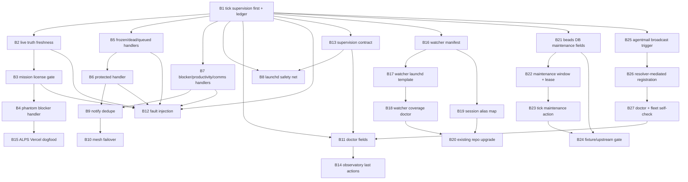

## Contents

- [1. Verdict](#1-verdict)
- [2. Problem Statement](#2-problem-statement)
- [3. Mechanism](#3-mechanism)
- [4. Failure Mode Taxonomy](#4-failure-mode-taxonomy)
- [5. Substrate Inventory](#5-substrate-inventory)
- [6. Bead Count Resolution](#6-bead-count-resolution)
  - [Core Supervision Beads](#core-supervision-beads)
  - [Watcher Propagation Beads](#watcher-propagation-beads)
  - [Beads-DB Maintenance Beads](#beads-db-maintenance-beads)
  - [Agent Mail Registration Beads](#agent-mail-registration-beads)
- [7. Bead-To-Source Mapping](#7-bead-to-source-mapping)
- [8. Cross-Plan Coordination With Wire-Or-Explain](#8-cross-plan-coordination-with-wire-or-explain)
- [9. Phase 4 DAG Preview](#9-phase-4-dag-preview)
- [10. Phase 3 Audit Lens Recommendation](#10-phase-3-audit-lens-recommendation)
- [11. Source Claim Ledger](#11-source-claim-ledger)
- [12. Convergence Notes](#12-convergence-notes)
- [13. Metrics](#13-metrics)
- [Callback Line](#callback-line)
# Phase 2 REFINE r1 - orch-monitor-recovery-auto-act-2026-05-04

Generated: 2026-05-04

Mode: plan-space read-only synthesis

Input base: Phase 1 lanes A/B/C plus supplemental watcher, Beads-DB, and
Agent Mail registration findings.

## 1. Verdict

This plan should converge on one mechanism:

```text
flywheel:1 tick starts with a supervision handler that consumes fleet
observations, classifies current truth, executes the safe action or deduped
Joshua-notify, verifies, and only then permits ordinary tick bookkeeping.
```

The gap is not "we need more observability." The gap is that observability is
not an action authority.

Resolved counts:

```text
lane_a_classes_resolved=13
lane_b_primitives_audited=35
lane_b_primitives_wired_proposed=25
final_bead_count=27
agentmail_registration_absorbed=yes
wire_or_explain_overlap_count=5
audit_lenses_recommended=cross-cutting,idempotency,security,operator-ergonomics,performance
commits_total=0
socraticode_queries=4
indexed_chunks_observed=443
```

Why `agentmail_registration_absorbed=yes`:

- The dispatch for `agentmail-registration-substrate-fix-d4e1ca` says three live
  panes have `needs_registration` and no token-safe fix path
  (`/tmp/dispatch_agentmail-registration-substrate-fix-d4e1ca.md:7-18`).
- Pane 2 landed `/tmp/agentmail-registration-substrate-fix-output.md` before
  this callback. It diagnosed 3/3 rows, chose Option D, and proposed three
  structural beads (`/tmp/agentmail-registration-substrate-fix-output.md:11-29`,
  `:267-336`, `:401-408`).
- This r1 absorbs those three beads because the class is the same
  observe-without-act failure: broadcasts measured or requested registration but
  did not close the loop into active rows, explicit deferrals, or blocking
  receipts.

## 2. Problem Statement

Flywheel is currently grading workers harder than orchestrators.

Workers must reserve files, prove callbacks, report beads/no-bead reasons, and
carry structured receipts. The orch-of-orch can still read a fleet dashboard,
write a STATE line, and sleep while a peer orchestrator is frozen, misblocked,
or waiting on flywheel-owned substrate.

The intent file names the failure directly:

- skillos looked frozen for 13+ minutes and flywheel:1 took no action
  (`00-INTENT.md:15-20`).
- alps Vercel deployment was misclassified as a Joshua approval despite mission
  lock authorizing that mission class (`00-INTENT.md:30-38`).
- old ledger rows were treated as current truth until live probes corrected the
  state (`00-INTENT.md:50-63`).
- flywheel:1 became a passive ledger keeper: read doctor JSON, log STATE, sleep
  (`00-INTENT.md:121-151`).

Therefore the refined problem statement is:

```text
The fleet has producers of observability facts but no top-level rule that makes
flywheel:1 act on those facts within SLO. The stock that accumulates is
unacted fleet supervision debt: frozen/dead panes, stale blockers, idle-with-work
sessions, stale loop drivers, identity registration drift, watcher holes, and
Beads DB maintenance hazards.
```

The plan must not create another dashboard. It must make the tick handler an
act-on-observation authority.

## 3. Mechanism

The load-bearing primitive is:

```bash
.flywheel/scripts/orch-tick-supervision-handler.sh
```

It calls a reusable action engine:

```bash
.flywheel/scripts/orch-supervision-loop.sh
```

The handler runs before every `flywheel:1` tick body. Lane C states this as the
core architecture: the handler must run before STATE.md tick lines, dispatch-log
bookkeeping, or sleep scheduling (`01-RESEARCH-C.md:9-16`, `:115-150`).

Corrected tick rhythm:

```text
read observatory fields
classify current truth
decide owner
act OR notify OR deliberately no-touch
verify
write ledger row
then write ordinary tick/state receipt
```

Primary ledger:

```text
~/.local/state/flywheel/cross-orch-supervision-ledger.jsonl
```

Supporting ledgers:

- `~/.local/state/flywheel/orch-supervision-notify.jsonl`
- `~/.local/state/flywheel/orch-mesh-claims.jsonl`
- `~/.local/state/flywheel/beads-db-maintenance.jsonl`
- existing child ledgers: frozen recovery, productivity escalation, comms
  health, process gaps, cross-orch coordination, dispatch log, Agent Mail
  registry.

Gate-truth separation:

- This is a flow gate: did an observed fleet condition route to the right action?
- It is not a code-correctness gate.
- It is not a deploy approval gate.
- It is not a permission to recover protected sessions.
- It is not a substitute for wire-or-explain's artifact-consumer gate.

Canonical CLI scoping:

- `orch-supervision-loop.sh` must expose `doctor`, `health`, `repair`, `validate`,
  `audit`, `why`, `schema`, `--info`, `--examples`, `--json`, `--dry-run`,
  `--apply`, and stable exit codes.
- Mutating actions are dry-run first and idempotent by action key.
- Doctor/status must show last-N actions and unacted-actionable counts so this
  does not become a hidden daemon.

Donella frame:

```text
SYSTEM: flywheel-owned cross-orchestrator supervision
STOCK: unacted supervision debt
PATTERN: dashboards/probes report facts, orch logs them, fleet waits
LOOP: missing balancing loop from observation to action
LEVERAGE_POINT: #6 information flow, #5 rules, #4 self-organization
INTERVENTION: tick-first action handler with a policy matrix and ledger
MEASURE: action latency, SLO breaches, false recovery count, notify dedupe,
         unacted actionable count, passive ledger tick count
```

## 4. Failure Mode Taxonomy

Resolution: choose 13 canonical failure classes.

Why 13:

- Lane A inventoried 13 root classes (`01-RESEARCH-A.md:3-10`, `:503-511`).
- Lane C has 15 action rows because it splits some classes by action backend
  and adds passive-tick guard rows (`01-RESEARCH-C.md:338-389`, `:999-1067`).
- For Phase 4, use 13 as the taxonomy count and let bead action handlers
  implement subtypes where necessary.

Canonical class list:

| Class | Source | Primary action |
|---|---|---|
| `frozen-orch` | `01-RESEARCH-A.md:119-138` | verify live state; recover if unprotected, notify/refuse if protected |
| `velocity-zero-chevron-visible` | `01-RESEARCH-A.md:141-160` | no-touch escalation; never kill on chevron-only state |
| `dead-codex` | `01-RESEARCH-A.md:163-182` | relaunch/resume with dispatch receipt checks |
| `idle-with-work-available` | `01-RESEARCH-A.md:185-204` | dispatch work or xpane peer orch |
| `blocker-stuck` | `01-RESEARCH-A.md:207-226` | ack, route owner, or notify only after true blocker proof |
| `no-tick-3d` | `01-RESEARCH-A.md:229-248` | verify driver; repair tick driver or send tick prompt |
| `canonical-drift-N` | `01-RESEARCH-A.md:251-270` | route process repair; no Joshua unless doctrine decision needed |
| `flywheel:1-itself-down` | `01-RESEARCH-A.md:273-292` | peer-mesh claim and bounded first-responder flow |
| `substrate-corrupt` | `01-RESEARCH-A.md:295-314` | pause risky mutations; dry-run self-heal; notify only with L48 ledger |
| `protected-session-but-frozen` | `01-RESEARCH-A.md:317-336` | same-tick Joshua-notify with override shape; no respawn by default |
| `identity-rotation-mid-flight` | `01-RESEARCH-A.md:339-358` | pause/reroute callbacks; preserve `(session,pane,project)` identity |
| `cross-fleet-failure-storm` | `01-RESEARCH-A.md:361-380` | storm circuit breaker and incident-mode routing |
| `cross-session-callback-orphan` | `01-RESEARCH-A.md:383-402` | retry or reroute callback to live owner |

Subtypes absorbed under those classes:

- `waiting-on-slow-subprocess` is a subtype of `frozen-orch` classification
  guard, not a recovery class. It exists to prevent false recovery
  (`00-INTENT.md:98-119`).
- `phantom-joshua-blocker` is a subtype of `blocker-stuck`: mission license
  converts it to execute-inside-lock (`00-INTENT.md:30-38`,
  `01-RESEARCH-C.md:713-758`).
- `stale-ledger-misread-as-current` is a subtype of any current-truth decision
  and must block recovery (`00-INTENT.md:50-63`, `01-RESEARCH-C.md:767-810`).
- `passive-ledger-keeper-tick` is the meta-class that fails the tick when any
  actionable class is only logged (`00-INTENT.md:121-151`,
  `01-RESEARCH-C.md:999-1067`).
- `queued-not-submitted` is an action subtype of `dead-codex`/dispatch delivery,
  not a root fleet class (`01-RESEARCH-C.md:535-577`).

## 5. Substrate Inventory

Resolution: Lane B audited 35 primitives and found 25 that need adoption wiring
for this plan. "Wired" below means sufficient as a local primitive; "wire" means
the Phase 4 plan must connect it to the supervision handler or ledger.

| # | Primitive | Current r1 status | Cost | Recommended order |
|---:|---|---|---|---|
| 1 | frozen-pane-detector v2 | wire | M | Wave 2 recovery |
| 2 | frozen recovery leases | wired support | L | child backend |
| 3 | frozen recovery ledger | wire parent ref | L | Wave 1 ledger |
| 4 | frozen pane samples | wire evidence refs | L | Wave 1 ledger |
| 5 | frozen detector self-test | wired support | L | keep |
| 6 | frozen detector SLO thresholds | wired support | L | keep |
| 7 | frozen fleet wrapper | wire | M | Wave 2 recovery |
| 8 | frozen fleet launchd | wire as safety net | M | Wave 4 install |
| 9 | recovery SLO probe | wire | M | Wave 3 doctor |
| 10 | idle-state probe | wired support | L | child backend |
| 11 | idle-pane auto dispatch | wire parent action | M | Wave 2 productivity |
| 12 | idle watcher plists | wire coverage | M | Watcher sub-DAG |
| 13 | peer blocker watch | wire | M | Wave 2 blocker |
| 14 | peer productivity watch | wire parent action | M | Wave 2 productivity |
| 15 | productivity ledger | wire parent ref | L | Wave 1 ledger |
| 16 | fleet comms health | wire | M | Wave 2 comms |
| 17 | comms health ledger | wire parent ref | L | Wave 1 ledger |
| 18 | cross-orch coordination ledger | wired support | L | child source |
| 19 | fleet conformance probe | wire bounded cache | H | Wave 3 doctor |
| 20 | fleet process gap detector | wire structural action | M | Wave 3 process |
| 21 | process gap state | wire parent ref | L | Wave 1 ledger |
| 22 | fleet observatory aggregate | wire recommendation consumer | M | Wave 3 dashboard |
| 23 | fleet watcher coverage probe | wire repair path | M | Watcher sub-DAG |
| 24 | canonical rule freshness | wired support | L | child source |
| 25 | fleet L-rule lag probe | wired support | L | child source |
| 26 | Agent Mail identity registry | wire no-raw-token action | H | AgentMail sub-DAG |
| 27 | identity history | wire recovery proof | M | AgentMail sub-DAG |
| 28 | orch worker identity manifest | wire target choice | M | AgentMail sub-DAG |
| 29 | NTM fleet health | wired support | L | child source |
| 30 | loop driver plists | wire stale-driver action | M | Wave 2 no-tick |
| 31 | protected-session-recovery skill | wire gated backend | M | Wave 2 protected |
| 32 | flywheel-recovery skill | wired support | L | child backend |
| 33 | notify binary | wire dedupe policy | M | Wave 3 notify |
| 34 | halt-disease watchdog | wire signal input | M | Wave 3 substrate |
| 35 | dispatch delivery receipt L91 | wire callback orphan aggregate | M | Wave 2 callback |

Counts:

```text
already_sufficient_or_support=10
needs_supervisor_wiring=25
```

Recommended wire order:

1. Ledger/action-id spine: #3, #4, #15, #17, #21.
2. Live truth and classification: #1, #7, #9, #13, #14, #16, #19, #22, #34, #35.
3. Safe action backends: #11, #20, #30, #31, #33.
4. Propagation and identity: #8, #12, #23, #26, #27, #28.
5. Keep-as-input support: #2, #5, #6, #10, #18, #24, #25, #29, #32.

## 6. Bead Count Resolution

Resolution: final r1 bead count is 27.

This is intentionally above Lane C's original 15 because Phase 1 supplemental
research landed while wire-or-explain was in audit. The supplement is not
duplicative; it adds propagation and maintenance tracks that feed the same
supervision-first handler.

Count:

```text
15 core supervision beads
+5 watcher propagation beads
+4 Beads-DB maintenance beads
+3 Agent Mail registration beads
=27
```

### Core Supervision Beads

| Bead | Title | Source finding | Notes |
|---|---|---|---|
| B1 | `orch-tick-supervision-handler-first-and-ledger` | Lane C B1, Finding 7 | Root bead; handler first in tick and ledger schema. |
| B2 | `orch-live-truth-freshness-adapter` | stale ledger correction | Live probe <=60s; stale ledger cannot trigger recovery. |
| B3 | `mission-anchor-dispatch-license-gate` | CoralRaven asks B/C | Permit gate symmetric with refuse gate. |
| B4 | `phantom-joshua-blocker-handler` | Vercel/Supabase/region pattern | Execute inside lock, do not notify. |
| B5 | `frozen-dead-queued-recovery-handlers` | Lane A frozen/dead/queued | Non-protected recovery backends. |
| B6 | `protected-session-notify-override-handler` | protected-session class | Notify-only unless authorized. |
| B7 | `blocker-productivity-comms-handlers` | blocker/idle/comms | Ack, dispatch, ping, or route. |
| B8 | `orch-supervision-launchd-safety-net` | Lane C launchd section | Secondary driver only. |
| B9 | `joshua-notify-gates-and-dedup-ledger` | Lane C notify gates | Five notify classes, sparse alerts. |
| B10 | `orch-mesh-failover-claim-flow` | flywheel:1-itself-down | Peer first-responder claim/release. |
| B11 | `orch-supervision-doctor-fields` | Lane B action-poor state | Last action, SLO, unacted counts. |
| B12 | `orch-supervision-fault-injection-harness` | Lane C tests | 11+ fixtures, one per action class. |
| B13 | `supervision-contract-three-surface` | doctrine after mechanics | New rule only after mechanics prove shape. |
| B14 | `fleet-observatory-last-actions-surface` | aggregate consumer gap | Dashboard/status shows actions, not just score. |
| B15 | `dogfood-alps-vercel-phantom-blocker` | CoralRaven ALPS report | Proves mission-licensed deploy path. |

### Watcher Propagation Beads

Source: `/tmp/worker-watcher-propagation-output.md:221-231`.

| Bead | Title | Source finding |
|---|---|---|
| B16 | `watcher-manifest-template` | repo-local watcher invariant missing |
| B17 | `watcher-launchd-template` | central logic plus per-repo plist |
| B18 | `watcher-coverage-doctor` | compare manifests, launchd, sessions, evidence |
| B19 | `watcher-session-alias-map` | cfs/clutterfreespaces and repo/session aliases |
| B20 | `watcher-existing-repo-upgrade` | upgrade flywheel/alps/mobile-eats/skillos/picoz/cfs/vrtx |

### Beads-DB Maintenance Beads

Source: `/tmp/beadsdb-vacuum-gap-output.md:937-1018`.

| Bead | Title | Source finding |
|---|---|---|
| B21 | `beads-db-maintenance-observability-fields` | page/freelist/autovacuum fields missing |
| B22 | `beads-db-maintenance-window-predicate-and-lease` | safe_to_vacuum predicate absent |
| B23 | `beads-db-tick-handler-maintenance-action` | Option A supervision-first maintenance |
| B24 | `beads-db-fixture-corpus-and-upstream-gate` | current upstream issue decision requires fixtures |

### Agent Mail Registration Beads

Source: `/tmp/dispatch_agentmail-registration-substrate-fix-d4e1ca.md:7-18`,
`:30-49` and `/tmp/agentmail-registration-substrate-fix-output.md:11-29`,
`:267-336`, `:401-408`.

| Bead | Title | Source finding | r1 status |
|---|---|---|---|
| B25 | `agentmail-registration-broadcast-close-loop` | broadcasts sent but recipients not acting | absorbed |
| B26 | `agentmail-live-vs-dead-registration-readiness-gate` | dead deferrals differ from live readiness halts | absorbed |
| B27 | `agentmail-registration-repair-cli-no-raw-token` | canonical repair command missing | absorbed |

## 7. Bead-To-Source Mapping

| Source | Beads |
|---|---|
| INTENT problem and passive-ledger finding | B1,B2,B11,B12 |
| CoralRaven mission-license findings | B3,B4,B15 |
| Lane A 13-class taxonomy | B1,B2,B5,B6,B7,B9,B10,B12 |
| Lane B 35-primitives inventory | B1,B2,B5,B7,B9,B11,B14,B21-B27 |
| Lane C 15-bead DAG | B1-B15 |
| Worker-watcher propagation | B16-B20 |
| Beads-DB vacuum gap | B21-B24 |
| Agent Mail registration dispatch | B25-B27 |

## 8. Cross-Plan Coordination With Wire-Or-Explain

wire-or-explain owns artifact wiring truth. orch-monitor owns observation-to-act
supervision truth. They touch the same tick path but answer different questions.

No duplicate bead should be filed across the two plans.

Overlap count: 5.

| Overlap | wire-or-explain owner | orch-monitor behavior |
|---|---|---|
| Artifact ledger and close gate | WOE B1-B7 | Consume status; do not recreate artifact ledger. |
| Cross-orch row scoping | WOE B12 | Use its ownership rows when deciding who can block local ticks. |
| Worker side branches | WOE B13 | Read dispatch branch proof; do not implement branch policy here. |
| DCG orphan reset blocker | WOE B14 | Respect reset guard in recovery; do not add a second DCG rule. |
| Substrate-loss memory/learn promotion | WOE B15 | Link supervision events; do not duplicate the substrate-loss memory bead. |

Independent orch-monitor surfaces:

- Live truth freshness for pane/session state.
- Mission-license permit gate for tactical action.
- Protected-session recovery/no-touch handling.
- Joshua-notify dedupe and override rows.
- Peer-mesh failover.
- Watcher propagation.
- Beads DB maintenance predicate.
- Agent Mail registration broadcast/resolver action.

Dependency rule:

```text
If a Phase 4 orch-monitor bead needs "artifact shipped and wired" truth, it
depends on wire-or-explain output rather than creating a local substitute.
```

## 9. Phase 4 DAG Preview



Dispatch waves:

1. Wave 1: B1, B2, B3, B21.
2. Wave 2: B4, B5, B7, B16, B22, B25.
3. Wave 3: B6, B9, B11, B17, B18, B23, B26.
4. Wave 4: B8, B10, B12, B19, B20, B24, B27.
5. Wave 5: B13, B14, B15.

Why B1 first:

Without tick-first supervision, every supplemental track can become another
observer. B1 is the difference between "probe says" and "fleet acted."

## 10. Phase 3 Audit Lens Recommendation

Recommended lenses:

1. **Cross-cutting integration** - verify tick-first ordering, child ledger refs,
   wire-or-explain consumption, Agent Mail identity path, Beads maintenance,
   watcher propagation, and status/doctor surfacing.
2. **Idempotency and atomicity** - verify action IDs, cooldowns, leases,
   dedupe, replay, no double notify, no duplicate recovery, no duplicate
   maintenance, and no double registration broadcast.
3. **Security and protected-session safety** - verify no raw token output, no
   protected recovery without override, no mission-license over-permit, no
   destructive shared-state action, and no pane kill on chevron/unknown state.
4. **Operator ergonomics** - verify status lines and action receipts let an
   orchestrator see what happened without reading raw ledgers.
5. **Performance and SLO** - verify bounded probe time, cached slow doctors,
   180s recovery envelope, and no launchd/tick loop hang.

Optional r2 lens if capacity expands:

- **Mesh failover split-brain** - dedicated audit for claim TTLs, first
  responder selection, release rows, and stale flywheel:1 state.

## 11. Source Claim Ledger

| Claim | Source |
|---|---|
| flywheel:1 must own fleet productivity and recovery | `00-INTENT.md:11-20`, `01-RESEARCH-A.md:3-10` |
| mission lock permits Vercel tactical dispatch | `00-INTENT.md:30-38`, `:78-96` |
| current truth must come from live probes, not old ledgers | `00-INTENT.md:50-63`, `01-RESEARCH-C.md:270-278` |
| tick handler must run first | `00-INTENT.md:121-151`, `01-RESEARCH-C.md:9-16`, `:115-150` |
| Lane A resolved class count is 13 | `01-RESEARCH-A.md:116-402`, `:503-511` |
| Lane B raw primitives count is 35 | `01-RESEARCH-B.md:49-88` |
| Lane B says missing primitive is top-level supervisor | `01-RESEARCH-B.md:11-47`, `:259-347` |
| Lane C original DAG count is 15 | `01-RESEARCH-C.md:1390-1448`, `:1560-1575` |
| watcher supplement proposes 5 beads | `/tmp/worker-watcher-propagation-output.md:221-231` |
| Beads DB supplement proposes 4 beads | `/tmp/beadsdb-vacuum-gap-output.md:937-1018` |
| Agent Mail registration class is live and absorbed | `/tmp/dispatch_agentmail-registration-substrate-fix-d4e1ca.md:7-18`, `:30-49`; `/tmp/agentmail-registration-substrate-fix-output.md:267-336` |
| wire-or-explain overlap must be consumed, not duplicated | `../wire-or-explain-tick-gate-2026-05-04/02-REFINE-r2.md:85-117`, `:386-425` |

## 12. Convergence Notes

Resolved disagreements:

1. **13 taxonomy classes vs 15 action rows.** Use 13 as the problem taxonomy.
   Preserve Lane C's 15 action rows as implementation subtypes inside B5-B12.
2. **15 vs 24 vs 27 beads.** Keep Lane C's 15, absorb the 9 watcher/Beads-DB
   supplemental beads, and absorb the 3 Agent Mail registration beads now that
   pane 2 landed the report.
3. **launchd vs tick handler.** Tick handler is primary. launchd is safety net.
   This follows Lane C and the Beads-DB Option A report.
4. **dashboard vs action loop.** Fleet observatory remains a surface, not the
   decision owner. The supervisor consumes its fields and writes action rows.
5. **Joshua-notify vs auto-act.** Notify is sparse and class-gated. Mission
   licensed tactical tasks execute; protected sessions and true founder-only
   decisions notify with evidence.

Risks to audit:

- False positive recovery against protected or chevron-visible panes.
- Mission-license over-permit on security/PHI/destructive/client-visible work.
- Supervisor becoming a hidden daemon instead of a doctor-visible tick step.
- Beads maintenance racing active `br` writers.
- Agent Mail registration repair leaking raw token material.
- Wire-or-explain and orch-monitor both trying to own the same tick-close gate.

## 13. Metrics

```text
problem_statement_complete=yes
mechanism=orch_tick_supervision_handler_first
lane_a_classes_resolved=13
lane_b_primitives_audited=35
lane_b_primitives_wired_proposed=25
core_beads=15
watcher_beads=5
beadsdb_beads=4
agentmail_registration_beads_reserved=3
final_bead_count=27
agentmail_registration_absorbed=yes
wire_or_explain_overlap_count=5
audit_lenses_recommended=cross-cutting,idempotency,security,operator-ergonomics,performance
self_grade=Y
commits_total=0
```

## Callback Line

```text
DONE orchmon-refine-r1 output=.flywheel/plans/orch-monitor-recovery-auto-act-2026-05-04/02-REFINE-r1.md self_grade=Y lane_a_classes_resolved=13 lane_b_primitives_wired_proposed=25 final_bead_count=27 agentmail_registration_absorbed=yes wire_or_explain_overlap_count=5 audit_lenses_recommended=cross-cutting,idempotency,security,operator-ergonomics,performance commits_total=0 callback_delivery_verified=true
```
