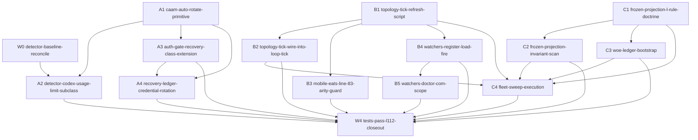

# Phase 4 DECOMPOSE - Orchestrator Uptime Bead DAG

task_id: `orch-uptime-decompose-2026-05-06`
plan_slug: `orch-uptime-2026-05-06`
scope: Phase 4 bead decomposition
created_at: `2026-05-06T20:56:53Z`
socraticode_queries: 10
bead_db_write_strategy: JSONL append-only fallback

## Inputs

- Primary plan: `00-PLAN.md`
- Research lanes: `01-RESEARCH-A.md`, `01-RESEARCH-B.md`, `01-RESEARCH-C.md`
- Audit lenses: `03-AUDIT-r1-security.md`, `03-AUDIT-r1-cross-cutting.md`, `03-AUDIT-r1-paradigm.md`
- Dispatch packet: `/tmp/dispatch_orch-uptime-decompose-2026-05-06.md`

Phase 3 disposition is `auto_advance`: 0 critical, 7 high, 8 medium, 4 low,
and no finding maps to TRUE Joshua-blocker classes.

## Wave 0 Reconcile

`br show flywheel-wire-codex-queued-not-submitted-classifier-and-recovery-2026-05-06 --json`
failed with a non-retryable BusySnapshot. JSONL and INCIDENTS evidence both
show the queued-not-submitted bead is closed and verified:

- `.beads/issues.jsonl` close row at `2026-05-06T12:33:15Z`
- `.beads/issues.jsonl` verification row at `2026-05-06T12:42:22Z`
- `INCIDENTS.md` L2961 area with `OK_codex_queued_not_submitted_wired`

Therefore Wave 0 remains a real baseline-reconcile gate, but the old "open P0"
coordination branch is a no-op unless live `br` is repaired and contradicts the
append-only latest rows.

## Mermaid DAG



No cycles. Critical path: `A1 -> A3 -> A4 -> W4` and `B1 -> B2 -> C4 -> W4`.

## Bead ID Table

| Wave | Key | Bead ID | Priority | Depends on | Coordinates with | Summary |
|---:|---|---|---:|---|---|---|
| 0 | W0 | `flywheel-orch-uptime-detector-baseline-reconcile-2026-05-06` | P0 | none | queued-not-submitted closed rows | Verify detector baseline and preserve queued-not-submitted before usage-limit work. |
| 1 | A1 | `flywheel-orch-uptime-caam-auto-rotate-primitive-2026-05-06` | P0 | none | mobile-eats idle evidence | Add dry-run-default CAAM selector primitive with security/idempotency amendments. |
| 1 | B1 | `flywheel-orch-uptime-topology-tick-refresh-script-2026-05-06` | P0 | none | `flywheel-5ktd.2`, `flywheel-zidg` | Add append-only topology freshness primitive with per-fire ledger evidence. |
| 1 | C1 | `flywheel-orch-uptime-frozen-projection-l-rule-2026-05-06` | P0 | none | skillos Option C Hybrid | Promote `templates-name-sources-not-values` doctrine and absorb skillos draft. |
| 2 | A2 | `flywheel-orch-uptime-detector-codex-usage-limit-2026-05-06` | P0 | W0, A1 | `flywheel-wire-codex-model-at-capacity-halt-class-c38ad0dd` | Add `codex_usage_limit` subclass without regressing siblings. |
| 2 | A3 | `flywheel-orch-uptime-auth-gate-credential-rotation-2026-05-06` | P0 | A1 | `flywheel-5ktd.3`, capacity-halt sibling | Add tightly-scoped `recovery_class=credential_rotation` authorization. |
| 2 | B2 | `flywheel-orch-uptime-topology-tick-wire-2026-05-06` | P0 | B1, `flywheel-25om8` | `flywheel-5ktd.3`, `flywheel-zidg` | Wire topology refresh after L102 and before topology-consuming gates. |
| 2 | B3 | `flywheel-orch-uptime-mobile-eats-arity-guard-2026-05-06` | P1 | B1 | mobile-eats evidence | Patch line-83 arity guard and add `--accept-stall` UX fixture. |
| 2 | B4 | `flywheel-orch-uptime-watchers-register-load-fire-2026-05-06` | P1 | B1 | `flywheel-2x5yi`, `flywheel-viux` | Split watcher acceptance into registered, loaded, and recent-fire evidence. |
| 2 | C2 | `flywheel-orch-uptime-frozen-projection-scan-2026-05-06` | P1 | C1 | fleet template debt | Add canonical CLI scanner with warn-existing/fail-new policy. |
| 2 | C3 | `flywheel-orch-uptime-woe-ledger-bootstrap-2026-05-06` | P1 | C1 | `flywheel-3iz0` | Bootstrap WOE ledger as scoped blocker for WOE-drain claims only. |
| 3 | A4 | `flywheel-orch-uptime-recovery-ledger-caam-additive-2026-05-06` | P1 | A1, A3 | recovery-doctor substrate | Add optional CAAM recovery fields without weakening required fields. |
| 3 | B5 | `flywheel-orch-uptime-watchers-doctor-com-scope-2026-05-06` | P1 | B4 | `flywheel-2x5yi`, `flywheel-viux` | Teach watcher doctor to count `com.flywheel.*` guarded scope. |
| 3 | C4 | `flywheel-orch-uptime-fleet-sweep-execution-2026-05-06` | P1 | B1, B2, C1, C2, C3 | `flywheel-pp1g`, peer repos | Run frozen-projection fleet sweep and route peer-owned debt. |
| 4 | W4 | `flywheel-orch-uptime-integration-validation-closeout-2026-05-06` | P1 | A2, A3, A4, B2, B3, B4, B5, C2, C3, C4 | all sibling surfaces | Aggregate tests, L112, INCIDENTS, memory, and closeout evidence. |

New beads: 15. Wave count: 5 including Wave 0. Coordinates-with edges: 11.

## Audit Amendment Coverage

| # | Amendment | Covered by |
|---:|---|---|
| 1 | `authorized_operations[]` and `forbidden_operations[]` on `credential_rotation` | A1, A3, W4 |
| 2 | Idempotency extension with active/selected/post-check profile and TTL | A1, A4, W4 |
| 3 | `--allow-unhealthy` refused in auto-recover unless operator ack exists | A1, W4 |
| 4 | Wave 0 detector baseline reconcile before A2 | W0, A2 |
| 5 | Coordinates-with edges for missing P0/P1 beads | B1, A2, A3, B2, B4, B5 |
| 6 | Shared primitive contract fields | A1, B1, C2, C3, W4 |
| 7 | `topology-tick-refresh` ledger row on every fire | B1, B2, W4 |
| 8 | Watcher registration/load/fire split | B4, B5, W4 |
| 9 | Durable cross-orch coord row written this turn | C1, C4 |
| 10 | Frozen projection warn on existing debt, fail on newly modified templates | C2, C4 |
| 11 | WOE bootstrap scoped blocker only for WOE-drain claims | C3, W4 |
| 12 | `founder_pages_avoided_by_orch_uptime_24h` metric | W4 |
| 13 | Label drift: L75 for skillos, L115/L117 for peer recovery | C1, C4, W4 |
| 14 | mobile-eats empirical idle evidence and `--accept-stall` flag UX | A1, A2, B3 |

All 14 amendments are represented in acceptance criteria on at least one bead.

## C1 L-Rule Draft To Adopt Verbatim

```text
Templates name sources, not values.
Any cron, launchd, watcher, scheduler, or dispatch template that references
mutable state must name the authoritative source path and field selector,
never copy the current field value into prompt text.
The receiving pane or agent must read the source at execution time and
cite the path in closeout.
Literal sampled values are allowed only when the value is immutable by
construction or a receipt names why sampling is intentional.
Doctor must count mutable-state literals in prompt templates and fail
strict mode when the count is nonzero.
```

## Shared Primitive Contract

Every new primitive in this DAG must emit:

`dry_run`, `apply`, `idempotency_key`, `lock_path`, `ledger_path`, `status`,
`error_class` or `failure_class`, `primitive_invoked`, `post_check`, and
`schema_version`.

This applies directly to A1, B1, C2, and C3; W4 verifies consistency.

## External Coordination Edges

| Bead | Edge type | Existing bead/session |
|---|---|---|
| B2 | hard-dep or non-overlap proof | `flywheel-25om8` |
| B1/B2 | coordinates-with | `flywheel-5ktd.2`, `flywheel-zidg` |
| B2/A3 | coordinates-with | `flywheel-5ktd.3` |
| A2/A3 | coordinates-with | `flywheel-wire-codex-model-at-capacity-halt-class-c38ad0dd` |
| B4/B5 | coordinates-with | `flywheel-2x5yi`, `flywheel-viux` |
| C3 | coordinates-with | `flywheel-3iz0` |
| C4 | coordinates-with | `flywheel-pp1g`, skillos, mobile-eats, ALPS |

## Validation Notes

- `br show` and `br --no-db` both failed on current bead substrate; this DAG uses
  the dispatch-approved JSONL append-only fallback.
- Bead rows are intentionally self-contained and include `acceptance_criteria`,
  `testing_obligations`, `skills_required`, `dependencies`, `coordinates_with`,
  and `amendment_refs`.
- No implementation source files are changed by this phase.

L112: OK_orch_uptime_phase4_decompose_complete

Mission-anchor: continuous-orchestrator-uptime-self-sustaining-fleet
