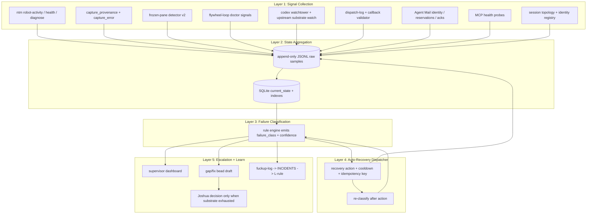
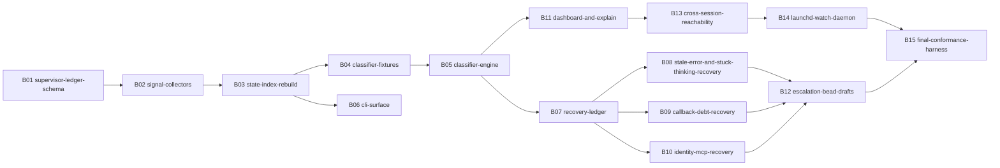

# Lane C - Implementation Design

Plan: `orchestrator-workforce-supervision-2026-05-04`
Lane: C - implementation design
Scope: read-only design, no skill files or beads created.

## 0. Evidence Ledger

Inputs used:

| source | role |
|---|---|
| `00-INTENT.md` | target failure classes, cross-session dashboard goal, existing tool inventory |
| `01-RESEARCH-A.md` | workforce state taxonomy, failure mode catalog, missing signals |
| `01-RESEARCH-B.md` | Jeff/upstream patterns, existing flywheel layer audit |
| `agent-fleet-management` | fleet stocks: accounts, machines/panes, tokens, queue, driver |
| `canonical-cli-scoping` | CLI surface: doctor/health/repair, validate/audit/why, JSON/schema/dry-run/idempotency |
| `canonical-owner-runtime-state` | runtime proof over repo/marker claims |
| `donella-meadows-systems-thinking` | stocks, flows, feedback loops, leverage discipline |
| `feedback_publishability_bar_three_judges.md` | Jeff/Donella/Josh judge pass |

Skills library lookup:

| skill | decision |
|---|---|
| `agent-orchestration` | ADOPT for worker queue and coordination semantics |
| `agent-monitoring` | ADOPT even though it did not rank top-10 in this query; it is the direct monitoring skill from Lane A/B |
| `ntm` | ADOPT for pane transport and robot-mode state |
| `dashboard-generation` | EXTEND for compact dashboard layout |
| `incident-response` | EXTEND for escalation states and severity |
| `trouble-ticket-automation` | EVALUATE only; classification ideas translate, domain does not |

Socraticode queries run against `/Users/josh/Developer/flywheel`:

1. `supervisor dashboard workforce state pane callback recovery ledger auto recover doctor json`
2. `validate callback verify callback delivery frozen pane detector auto nudge dispatch capacity gate`
3. `canonical CLI scoping doctor health repair audit why schema idempotency flywheel supervisor`

Key hits: `AGENTS.md` L60/L69/L71/L82, `README.md` command/script maps, `tests/flywheel-readme.sh`, `tests/fixtures/verify-callback-delivery/*`, `INCIDENTS.md` frozen Codex and observability-contract incidents.

## 1. Canonical Supervision-Mesh Architecture



### Layer 1: Signal Collection

| signal source | JSON shape / fields | cadence | notes |
|---|---|---|---|
| `ntm --robot-activity` | session, pane, state, velocity, state_since, capture_provenance, capture_collected_at, capture_error | 30s in watch, every tick in one-shot | primary pane behavior source |
| `ntm health --json` | process/pane status, idle/error details | 60s | secondary source; never wins alone when activity disagrees |
| `ntm --robot-diagnose` | recommendations, deeper pane/session diagnosis | on `diagnose` or failure | annotation, not capacity gate |
| frozen-pane detector v2 | frozen/unknown/alive, byte delta, reason | 60s or on stuck-thinking candidate | live-delta proof per L67 |
| `flywheel-loop doctor --json` | storage, identity, daily report, last tick, doctor blockers | every tick / 5m watch | repo health and blocker attribution |
| codex watchtower | upstream issue/release status, relevant issue count | tick + daily | explains systemic Codex failures |
| dispatch log | task_id, session, pane, sent_at, callback route, callback state | append on dispatch/callback | callback-debt stock |
| callback validator | status pass/fail/unknown, evidence path, no-bead validity | on callback / reaper | integration gate |
| Agent Mail | identity, reservations, acks, inbox health | 2m or on dispatch | identity and coordination proof |
| MCP health | server/tool family, last_success, last_error | 2m | separates substrate failure from worker failure |
| topology registry | expected sessions/panes, callback pane, role | on startup + changes | desired workforce shape |

### Layer 2: State Aggregation

Pick: **append-only JSONL raw ledger plus SQLite current-state index**.

Rationale:

- JSONL preserves lineage and replayability for audits, L52/L53/L56, and mixed-version schema migrations.
- SQLite gives fast dashboard queries, joins, cooldown lookup, and cross-session current-state views.
- Raw samples are never overwritten; current-state rows are derived and rebuildable.

Proposed files:

| path | role |
|---|---|
| `~/.local/state/flywheel/supervisor/samples.jsonl` | append-only Layer 1 raw samples |
| `~/.local/state/flywheel/supervisor/recovery-events.jsonl` | append-only recovery attempts and outcomes |
| `~/.local/state/flywheel/supervisor/escalations.jsonl` | append-only gap/fix/escalation records |
| `~/.local/state/flywheel/supervisor/state.sqlite3` | derived current-state, indexes, cooldowns |

Core `current_pane_state` fields:

`session`, `pane`, `agent_type`, `pane_state`, `scrollback_delta`, `capture_provenance`, `capture_error`, `sampled_at`, `state_since`, `time_since_last_callback`, `identity_status`, `mcp_status`, `current_bead`, `task_id`, `dispatch_age_seconds`, `callback_deadline_at`, `recovery_attempts_30m`, `cooldown_until`, `failure_class`, `confidence`, `last_explanation`, `source_conflicts_json`.

### Layer 3: Failure Classification

Failure enum:

`healthy`, `unknown_source_conflict`, `stale_error`, `stuck_thinking`, `callback_overdue`, `capture_unavailable`, `identity_drift`, `mcp_degraded`, `frozen_pane`, `dispatch_stalled`, `storage_blocked`, `doctor_blocked`, `cross_session_missing`.

Rule sketch:

| class | rule |
|---|---|
| `healthy` | live capture, no overdue callback, no identity/MCP drift, state WAITING/GENERATING/THINKING with movement |
| `stale_error` | state ERROR with live capture, but newer benign reply or byte delta clears error signature |
| `stuck_thinking` | THINKING, velocity=0, no byte delta beyond threshold, not frozen-confirmed |
| `callback_overdue` | dispatch deadline passed and no validated callback receipt exists |
| `capture_unavailable` | capture_provenance unavailable or capture_error present |
| `identity_drift` | registry missing/mismatch/token orphan or callback identity mismatch |
| `mcp_degraded` | required MCP server/tool has recent failure affecting this session/task |
| `frozen_pane` | frozen detector confirms Codex #12645-style stuck prompt or zero delta beyond hard threshold |
| `dispatch_stalled` | ready work + WAITING capacity + no dispatch, or dispatched task not started |
| `unknown_source_conflict` | activity, health, topology, or callback sources disagree without safe resolution |

### Layer 4: Auto-Recovery Dispatcher

Recovery must be explicit: `failure_class -> recovery_action -> execute -> log -> re-classify`.

| failure_class | recovery action | guardrails |
|---|---|---|
| `stale_error` | benign ping/nudge | max 1 per 10m per pane, 3 strikes -> escalate |
| `stuck_thinking` | soft status probe, then interrupt if unchanged | requires live source + byte delta proof |
| `callback_overdue` | validate callback logs, reaper, ask worker to resend if pane alive | no integration before receipt |
| `capture_unavailable` | run diagnose, mark capacity unknown, escalate transport repair | no auto-recover UNKNOWN source |
| `identity_drift` | re-run identity doctor / force re-cite identity | no raw token in logs |
| `mcp_degraded` | surface MCP recovery instruction to orchestrator pane | do not blame worker |
| `frozen_pane` | frozen-pane v2 recovery path / respawn candidate | idempotency key and strike ledger |
| `dispatch_stalled` | watcher-style dispatch if capacity and queue prove available | uses Beads ready + topology proof |

### Layer 5: Escalation + Learn

Escalation creates a durable record, not a prose handoff:

- 3 strikes in 30m -> draft/fix bead with diagnostic bundle.
- BLOCKED or irreversible recovery -> fuckup-log row.
- recurring class -> INCIDENTS/L-rule promotion ladder.
- dashboard surfaces current stock levels and pending Joshua decisions.
- Joshua notification only after L48 substrate exhaustion and when decision is genuinely human-owned.

## 2. `/flywheel:supervisor` Canonical CLI Surface

Primary location: slash command `/flywheel:supervisor` backed by `~/.claude/skills/.flywheel/bin/flywheel-supervisor`. If implementation prefers extending `flywheel-loop`, keep `/flywheel:supervisor` as the operator entrypoint and dispatch to the binary.

Required commands:

| command | purpose | output |
|---|---|---|
| `/flywheel:supervisor` | compact cross-session dashboard, about 500 tokens | human table; `--json` equivalent |
| `/flywheel:supervisor --watch` | daemon mode replacing watcher v4 + auto-nudge | NDJSON events or periodic summary |
| `/flywheel:supervisor --diagnose <session>:<pane>` | deep probe for one pane | source ledger, conflicts, recommendation |
| `/flywheel:supervisor --auto-recover` | run one recovery cycle | dry-run by default unless `--apply` |
| `/flywheel:supervisor --explain <session>:<pane>` | explain current state and evidence | provenance chain |
| `/flywheel:supervisor --escalate <session>:<pane> --reason <X>` | manual escalation path | escalation receipt |
| `/flywheel:supervisor --history <session>:<pane>` | recovery attempt and state history | JSONL-derived timeline |
| `/flywheel:supervisor --silence <session>:<pane> --duration <N>m` | temporary mute / Joshua override | audit row with expiry |

Canonical-cli-scoping additions:

- `doctor [--fix] [--scope collector|state|classifier|recovery|dashboard]`
- `health [--watch -i N]`
- `repair --scope <scope> --dry-run|--apply`
- `validate fixture|sample|state|receipt`
- `audit`
- `why <state-id|recovery-id|task-id>`
- `schema <command|sample|state|recovery>`
- `metrics`, `logs`, `trace <id>`
- `--info`, `--examples`, `quickstart`, `help <topic>`, `completion <shell>`
- universal `--json`, `--no-color`, `--no-emoji`, `--width`
- mutating operations require `--dry-run`, `--explain`, `--idempotency-key`.

Exit codes: `0` success, `1` domain fail/degraded, `2` usage, `3` transient upstream/tool failure, `4` gate blocked, `5+` documented domain-specific.

## 3. SKILL.md Draft

Target path: `~/.claude/skills/.flywheel/supervisor/SKILL.md`.

```markdown
---
name: flywheel-supervisor
description: "Use when supervising agent workforce state across flywheel, skillos, mobile-eats, alps, picoz, or any NTM-driven agent fleet. Triggers: idle panes, stuck thinking, callback overdue, stale error text, capture unavailable, identity drift, MCP degraded, frozen pane, dispatch stalled, workforce dashboard."
status: draft
---

# Flywheel Supervisor

I use this skill when I need one evidenced view of the workforce instead of guessing from pane text.

## Three Moves

1. **Collect live signals.** Pull `ntm` activity/health, capture provenance, frozen-pane output, doctor JSON, dispatch log, Agent Mail identity, MCP health, and topology.
2. **Classify state.** Reduce those signals into one pane state with confidence, source conflicts, callback debt, identity status, and recovery history.
3. **Recover or escalate.** Apply the smallest safe recovery with a cooldown and idempotency key; after 3 strikes, file a diagnostic bead and route the trauma into the learning ladder.

## Operator Surface

```bash
/flywheel:supervisor --json
/flywheel:supervisor --diagnose flywheel:4 --json
/flywheel:supervisor --auto-recover --dry-run --json
/flywheel:supervisor --explain skillos:2
/flywheel:supervisor --history mobile-eats:2 --json
/flywheel:supervisor doctor --json
```

## State Contract

Every dashboard row must show:

- session and pane
- current state and failure class
- last live sample time
- capture provenance
- callback debt age
- identity status
- MCP status
- current bead/task
- recovery attempts in the last 30 minutes
- next action

## Recovery Rules

- Never auto-recover `UNKNOWN` without a live second source.
- Never integrate a worker callback before validation receipt pass.
- Never count a repo loop as live from marker files alone.
- Never log raw tokens or Agent Mail bearer values.
- Always append recovery attempts to the supervisor ledger.

## Validation

Run:

```bash
/flywheel:supervisor validate fixture --all --json
/flywheel:supervisor doctor --json
/flywheel:supervisor --auto-recover --dry-run --fixture stale-error --json
```

## Brand Voice

Dashboard text is direct and evidence-grounded:

- "I see flywheel:4 as stuck-thinking: 0 byte delta for 7m, callback not overdue."
- "I am not recovering skillos:2 yet: activity and health disagree."
- "I filed a diagnostic bead after 3 failed nudges."

No enemy framing, no vague reassurance, no prose-only health claims.
```

## 4. Phase Decomposition

| phase | priority | deliverable | acceptance |
|---|---|---|---|
| Phase 1 | P0 | Layer 1+2 signal collection and canonical state ledger | collectors write JSONL samples; SQLite current-state rebuilds from ledger; replaces `/tmp/*last-fired` state |
| Phase 2 | P0 | Layer 3 failure classifier | fixture inputs classify into exact enum; source conflict is first-class |
| Phase 3 | P1 | Layer 4 auto-recovery dispatcher | cooldowns, idempotency, dry-run/apply, 3-strike escalation receipts |
| Phase 4 | P1 | Layer 5 escalation + dashboard | compact dashboard, gap/fix bead draft, doctrine ladder hooks |
| Phase 5 | P2 | cross-session unification | flywheel, skillos, mobile-eats, alps, picoz visible with reachability status |
| Phase 6 | P2 | launchd plist / daemon survival | `--watch` survives reboot, emits health, never mutates without apply |

## 5. Preliminary Bead DAG

Placeholder IDs only; Phase 4 should create real beads after audit.



| bead | deps | estimate | notes |
|---|---|---:|---|
| B01 supervisor-ledger-schema | none | M | schema for samples, current state, recovery event |
| B02 signal-collectors | B01 | L | ntm, doctor, dispatch, Agent Mail, MCP, topology |
| B03 state-index-rebuild | B02 | M | JSONL -> SQLite rebuild and current-state query |
| B04 classifier-fixtures | B01 | M | four required trauma fixtures plus source-conflict fixtures |
| B05 classifier-engine | B03, B04 | M | enum rules and confidence |
| B06 cli-surface | B01, B03 | L | canonical CLI commands and schemas |
| B07 recovery-ledger | B05 | M | cooldowns, idempotency, history |
| B08 stale-error-and-stuck-thinking-recovery | B07 | M | canonize watcher/auto-nudge/frozen detector rules |
| B09 callback-debt-recovery | B07 | M | validator/reaper/verify-callback integration |
| B10 identity-mcp-recovery | B07 | M | identity doctor + MCP recovery instruction |
| B11 dashboard-and-explain | B05, B06 | M | 500-token dashboard + `why/explain` |
| B12 escalation-bead-drafts | B08, B09, B10 | M | diagnostic bead draft and L52/L53/L56 routing |
| B13 cross-session-reachability | B11 | M | skillos/mobile-eats/alps/picoz reachability |
| B14 launchd-watch-daemon | B13 | S | plist and daemon health, no auto-apply by default |
| B15 final-conformance-harness | B12, B14 | M | e2e fixtures and publishability gate |

Parallel waves:

1. B01
2. B02, B04, B06
3. B03, B05, B07
4. B08, B09, B10, B11
5. B12, B13
6. B14, B15

## 6. Test Plan

| layer | unit tests | integration tests | conformance fixtures |
|---|---|---|---|
| Layer 1 | collector parsers for each source, missing-field handling | collect from fixture directory and live dry-run mode | `capture-unavailable`, `health-activity-disagreement` |
| Layer 2 | JSONL schema validation, SQLite rebuild idempotency | delete SQLite and rebuild from ledger; compare state hash | mixed schema v1/v2 sample ledger |
| Layer 3 | synthetic state -> expected `failure_class` | classify full fixture bundles with source conflicts | `stale-error`, `stuck-thinking`, `frozen-pane`, `callback-overdue` |
| Layer 4 | cooldown/idempotency key rules, 3-strike escalation | inject stale-error -> nudge dry-run -> recovery event -> reclassify healthy | `stale-error`, `stuck-thinking`, `identity-drift`, `mcp-degraded` |
| Layer 5 | escalation row and bead draft schema | 3 failed attempts -> diagnostic bead draft + fuckup row | `capture-unavailable`, `callback-overdue`, `frozen-pane` |
| CLI | `--help`, `--info`, `--examples`, `schema`, exit codes | `doctor --json`, `repair --dry-run --json`, `validate fixture --all` | canonical-cli-scoping harness |

Required observed-trauma fixtures:

1. stale-error scrollback with live capture and benign reply after error.
2. stuck-thinking with `state=THINKING`, velocity 0, byte delta 0 for threshold.
3. capture-unavailable with `capture_provenance=unavailable` and `capture_error`.
4. frozen-pane Codex #12645 signature with chevron prompt, zero delta, state age >5m.

Additional fixture: callback overdue with dispatch row, no `ntm_logs` callback, and validator receipt absent.

## 7. Three-Judges Synthetic Pass

| judge | pass criteria | design pass |
|---|---|---|
| Jeff | doctor/health/repair triad, schemas, JSON, dry-run repair, executable fixtures | PASS: CLI surface includes triad, schemas, idempotency, fixtures, conformance harness |
| Donella | named stocks and feedback loops, not parameter-only nudges | PASS: stocks are workforce-utilization, stuckness, callback-debt, escalation-queue, recovery-success-rate; loops reclassify after recovery and escalate after repeated failure |
| Josh | ZestStream operator voice, receipts over assertions, sellable canonical layer | PASS: dashboard language is first-person ops, evidence-grounded, and produces receipts instead of pane folklore |

Named stocks:

- `workforce_utilization`: working panes / usable panes.
- `workforce_stuckness`: panes in stuck/frozen/unknown classes.
- `callback_debt`: overdue callbacks by age bucket.
- `escalation_queue`: unresolved escalations and diagnostic bead drafts.
- `recovery_success_rate`: successful recoveries / attempted recoveries by class.

Closed feedback loops:

- recovery success -> cooldown reset and classifier state update.
- recovery failure -> strike increment -> diagnostic bead after threshold.
- callback receipt pass -> debt decremented and integration allowed.
- source conflict -> auto-recovery halted until second live source exists.
- recurring failure class -> fuckup-log/INCIDENTS/L-rule promotion.

## Closeout

DID:

1. Canonical supervision-mesh architecture.
2. `/flywheel:supervisor` canonical CLI surface.
3. Draft SKILL.md body.
4. Phase decomposition.
5. Preliminary 15-bead DAG.
6. Layered test plan.
7. Three-judges synthetic pass.

DIDNT:

- none

GAPS:

- none filed; unresolved implementation details are captured as planned bead work, not out-of-scope gaps.

Ladder: passed.
