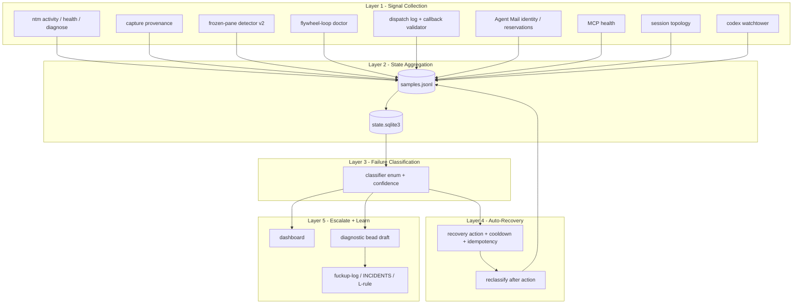
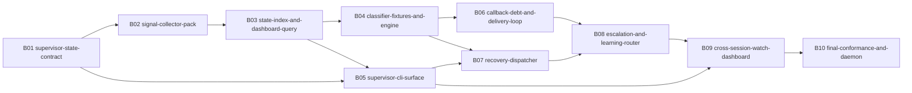

# Phase 2 REFINE r1 - Orchestrator Workforce Supervision

Plan: `orchestrator-workforce-supervision-2026-05-04`
Phase: 2.REFINE round 1
Status: canonical synthesis candidate
Sources: `00-INTENT.md`, `01-RESEARCH-A.md`, `01-RESEARCH-B.md`, `01-RESEARCH-C.md`

## 1. Executive Summary

Joshua's complaint is right: callback fixes alone do not supervise a workforce.

The missing system is a cross-session supervision mesh that turns pane,
callback, identity, MCP, doctor, topology, and recovery signals into one
machine-readable current state.

The canonical fix is `/flywheel:supervisor`: a doctor/health/repair-grade CLI
and watch loop backed by append-only receipts and a rebuildable current-state
index.

This plan does not replace `ntm`, Beads, Agent Mail, `flywheel-loop doctor`,
frozen-pane v2, watcher v4, callback validation, or auto-nudge. It composes
them.

The leverage point is Donella Meadows #6, information flows: make hidden
workforce state visible early enough that the system recovers before Joshua has
to point at an idle pane.

The controlling stocks are workforce-utilization, callback-debt,
escalation-queue, and recovery-success-rate.

Lane A defines the failure space: too many states collapse into `idle`,
`error`, or vague `THINKING`, so recovery and dispatch decisions are wrong.

Lane B defines the ecosystem precedent: Jeff's systems prefer robot JSON,
schemas, doctor/health/repair surfaces, append-only evidence, and idempotent
repair.

Lane C defines the implementation shape: collect signals, aggregate state,
classify failure, recover with cooldown/idempotency, escalate, and learn.

This r1 synthesis keeps the five-layer architecture and reduces Lane C's
15-bead sketch to a 10-bead DAG that Phase 4 can dispatch.

## 2. Stocks, Flows, and Leverage

System boundary:

The system is the active NTM-driven workforce across flywheel, skillos,
mobile-eats, alpsinsurance, picoz, and future flywheel-installed sessions whose
orchestrators expect visible worker panes, callbacks, and validated evidence.

Primary stocks:

| stock | definition | current symptom | target measure |
|---|---|---|---|
| `workforce_utilization` | usable working panes / expected usable panes | Joshua sees idle panes first | utilization by session with live proof age |
| `callback_debt` | dispatched tasks past callback deadline without validated DONE/BLOCKED | work completes or stalls invisibly | count and age buckets by task/pane/session |
| `escalation_queue` | unresolved diagnostics needing bead, recovery, or Joshua decision | point fixes and ad hoc nudges | queue length, age, owner, evidence |
| `recovery_success_rate` | successful recoveries / attempted recoveries by class | repeated nudges do not become diagnosis | success ratio by failure class |

Secondary stocks:

| stock | definition | use |
|---|---|---|
| `source_conflict_count` | panes where sources disagree | fail-closed dispatch decisions |
| `capture_unavailable_count` | panes missing live capture proof | transport recovery instead of worker blame |
| `identity_drift_count` | pane/task identity disagreements | block unverifiable callbacks |
| `mcp_degraded_count` | task-affecting MCP failures | separate substrate outage from worker inactivity |
| `recovery_strike_count` | failed recoveries per pane/class | trigger bead/escalation after threshold |

Inflows:

| stock | inflow |
|---|---|
| `workforce_utilization` | worker dispatch starts; pane becomes live/moving; callback validates cleanly |
| `callback_debt` | dispatch row created with deadline and expected callback |
| `escalation_queue` | three-strike recovery, unresolved source conflict, frozen/capture unavailable, callback fail |
| `recovery_success_rate` | recovery attempt logged and later reclassified healthy |

Outflows:

| stock | outflow |
|---|---|
| `workforce_utilization` | pane exits, freezes, loses identity/MCP, enters cooldown, or becomes source-conflicted |
| `callback_debt` | callback delivered, verified, validated, and integrated |
| `escalation_queue` | bead created/updated, recovery applied, Joshua decision recorded, or no-bead reason accepted |
| `recovery_success_rate` | failed attempts lower the rate until later successes rebalance it |

Feedback loops:

| loop | current behavior | target behavior |
|---|---|---|
| callback debt | absence noticed late | deadline breach feeds validator/reaper/recovery |
| stale-error | one ad hoc nudge class | fixture-tested recovery class |
| stuck-thinking | THINKING may mean progress or frozen work | velocity and byte delta classify movement |
| source-conflict | humans arbitrate manually | conflict blocks unsafe decisions |
| learning | repeated incidents stay in scrollback | failed recovery files beads/fuckups/doctrine |
| utilization | watcher sees idle only | ready work + reachability + cooldown + debt decide capacity |

Delays:

| delay | consequence | mitigation |
|---|---|---|
| callback deadline | overdue work is hidden | explicit `expected_callback_at` |
| capture staleness | old text masquerades as live | `capture_collected_at` and provenance |
| topology staleness | missing sessions look expected | reachability status and sample age |
| recovery confirmation | nudge result guessed | reclassify after cooldown |
| doctrine promotion | recurring failures repeat | route into L52/L53/L56 ladder |

Leverage point:

Meadows #6, information flows, is the highest supported leverage point. Adding
another nudge threshold is a low-leverage parameter change. Making callback
debt, source conflict, and recovery outcomes visible changes the next action.

Rule leverage:

The plan also changes rules of the system: recovery is dry-run by default,
idempotent, cooldown-bound, source-arbitrated, and escalates after three
strikes.

Goal leverage:

The goal is not "keep panes busy." The goal is "keep the workforce verifiably
advancing validated work."

## 3. Workforce State Taxonomy

Lane A's taxonomy is retained and grouped into operator-facing families.

### Availability

| state | meaning | posture |
|---|---|---|
| `waiting` | pane reachable and available | eligible if debt/cooldown allow |
| `idle_untrusted` | one source says idle but another is absent/contradictory | collect second truth source |
| `cross_session_not_visible` | topology expects session but live probes cannot see it | mark missing/stale; do not infer healthy |
| `exited` | pane process exited or unreachable | respawn or capacity blocked |
| `unknown` | required sources disagree/absent | fail closed |

### Progress

| state | meaning | posture |
|---|---|---|
| `dispatched_not_started` | dispatch row exists without live start proof | ping or redispatch after deadline |
| `thinking_moving` | THINKING with output/byte movement | observe |
| `thinking_zero_delta` | THINKING without movement beyond threshold | soft status probe |
| `generating_moving` | output generation is moving | observe |
| `frozen_confirmed` | frozen detector confirms stuck live pane | interrupt/respawn policy |

### Capture And Text

| state | meaning | posture |
|---|---|---|
| `error_text_live` | current live pane has error text | classify and recover |
| `error_text_stale` | old error text is no longer live | clear false positive |
| `capture_unavailable` | live text/provenance cannot be captured | transport recovery |

### Callback

| state | meaning | posture |
|---|---|---|
| `callback_pending` | deadline passed without validated DONE/BLOCKED | callback debt recovery |
| `callback_delivered_unvalidated` | text exists but validation absent | validate before integrate |
| `callback_validated_pass` | delivery/schema/evidence passed | integrate |
| `callback_validated_fail` | callback malformed or evidence missing | repair bead or redispatch |

### Identity And Substrate

| state | meaning | posture |
|---|---|---|
| `identity_registered` | worker identity current | normal |
| `identity_missing` | active pane lacks identity proof | registration repair |
| `identity_mismatch` | callback/task/registry identity disagree | fail closed |
| `mcp_ok` | required MCP tools reachable | normal |
| `mcp_degraded` | required MCP surface failing | substrate recovery |
| `doctor_blocked` | repo doctor/prelude blocks work | route to blocker owner |
| `storage_blocked` | storage gate blocks work | storage protocol |

Taxonomy rule:

`unknown`, `source_conflict`, `capture_unavailable`, and `waiting` must never
collapse into the same capacity result.

## 4. Failure-Mode Catalog

| failure mode | detection signal | current recovery | target recovery | criticality |
|---|---|---|---|---|
| stale-error-text | live provenance plus newer pane delta after error | `/tmp/auto-nudge-stale-error-recovery.sh` | fixture-tested `stale_error` + cooldowned benign ping | P1 |
| stuck-thinking-too-long | THINKING, velocity 0, byte delta 0 past threshold | manual nudge / frozen detector separately | graduated probe, reclassify, then interrupt only after proof | P1 |
| callback-never-arrived | dispatch deadline passed, no validated callback | reaper + worker verify partially | callback debt ledger and repair path | P0 |
| capture-unavailable | `capture_provenance=unavailable` or capture error | manual transport investigation | capacity unknown + diagnose + transport repair | P0/P1 |
| registry-drift | topology/session/Agent Mail mismatch | manual registration repair | identity proof row and force re-cite | P1 |
| MCP-disconnected | MCP tool/server failure affects task | manual retry | MCP health row and recovery instruction | P1 |
| identity-mismatch | callback sender/pane/task/registry disagree | partial schema catch | fail closed before integration | P1 |
| frozen-pane | zero delta and frozen detector confirms stuck prompt | manual interrupt/respawn | idempotent recovery with strike ledger | P1 |
| dispatch-stalled | ready work + waiting capacity + no dispatch | watcher v4 partial | capacity gate with debt/reachability/cooldown | P0/P1 |
| cross-session-blindness | topology says present, live probes absent | manual comparison | reachability dashboard state | P0 |
| three-strike-no-recovery | repeated recovery without healthy reclassify | ad hoc escalation | diagnostic bead + fuckup row | P1 |
| storage-gate-cascade | storage doctor blocks multiple tasks | storage discipline partial | supervisor stock row with affected tasks | P1 |
| health-activity-disagreement | health and activity imply different states | no arbitration | source conflict state | P0/P1 |
| topology-stale-row | topology row exists but sample age stale | none | topology age and reachability remediation | P1 |
| doctor-prelude-blocked-with-worker-active | doctor blocks while worker task active | manual | blocker attribution and integration hold | P1 |
| validation-reaper-pending | reaper skips because callback not found | partial | queue with task id, reason, next action | P0/P1 |
| silent-idle-after-closeout | worker closes but orch does not dispatch next work | watcher partial | closeout feeds utilization loop | P1 |
| callback-delivery-false-positive | worker believes callback sent, pane 1 did not receive it | verify doctrine exists | verified delivery gate in debt ledger | P0 |

Coverage rule:

Every failure mode above maps to at least one bead in Section 8. If Phase 3
removes any mode, it must produce a no-bead reason or a gap bead.

## 5. Architecture - Supervision Mesh Layers

The architecture keeps Lane C's five layers. Receipts are truth; dashboards
consume receipts.

### Layer 1 - Signal Collection

| collector | source | minimum fields |
|---|---|---|
| pane activity | `ntm` robot activity | session, pane, state, velocity, provenance |
| pane health | `ntm health --json` | process status, idle/error details, sample time |
| diagnose | `ntm robot-diagnose` | recommendations and annotations |
| capture | provenance fields | collected_at, provenance, capture_error |
| frozen | frozen-pane detector v2 | byte delta, state age, frozen/unknown/alive |
| doctor | `flywheel-loop doctor --json` | blockers, storage, identity, validation |
| dispatch | dispatch log | task, bead, pane, callback route, deadline |
| callback | validator + delivery verifier | delivered, schema_valid, evidence_valid |
| identity | Agent Mail | agent, project, profile age, reservations |
| MCP | MCP probe/last errors | server, tool family, success/error |
| topology | session topology | expected panes, roles, callback pane, age |
| upstream | codex watchtower | upstream issue/release pressure |

All collectors emit versioned JSON with `sample_collected_at`, `source`,
`schema_version`, and `provenance`.

### Layer 2 - State Aggregation

Use append-only JSONL for raw samples and SQLite for rebuildable current state.

| path | purpose |
|---|---|
| `~/.local/state/flywheel/supervisor/samples.jsonl` | raw collector samples |
| `~/.local/state/flywheel/supervisor/recovery-events.jsonl` | recovery attempts/outcomes |
| `~/.local/state/flywheel/supervisor/escalations.jsonl` | bead/fuckup/escalation records |
| `~/.local/state/flywheel/supervisor/state.sqlite3` | derived current state |

Current-state fields:

`session`, `pane`, `agent_type`, `pane_state`, `failure_class`, `confidence`,
`scrollback_delta`, `capture_provenance`, `capture_error`, `sampled_at`,
`state_since`, `time_since_last_callback`, `identity_status`, `mcp_status`,
`current_bead`, `task_id`, `dispatch_age_seconds`, `callback_deadline_at`,
`recovery_attempts_30m`, `cooldown_until`, `last_explanation`,
`source_conflicts_json`.

### Layer 3 - Failure Classification

Canonical enum:

`healthy`, `waiting`, `unknown_source_conflict`, `stale_error`,
`stuck_thinking`, `callback_overdue`, `capture_unavailable`,
`identity_drift`, `mcp_degraded`, `frozen_pane`, `dispatch_stalled`,
`storage_blocked`, `doctor_blocked`, `cross_session_missing`.

Every enum value gets at least one fixture and one expected JSON output. Source
conflict never silently picks the optimistic state.

### Layer 4 - Auto-Recovery

| class | recovery | guard |
|---|---|---|
| `stale_error` | benign ping/nudge | one per 10m per pane, 3 strikes escalate |
| `stuck_thinking` | status probe, then interrupt if unchanged | live source + zero delta proof |
| `callback_overdue` | validate logs, reaper, ask worker resend | no integration before validation |
| `capture_unavailable` | diagnose and mark capacity unknown | no recovery without second truth source |
| `identity_drift` | identity doctor and force re-cite | never log tokens |
| `mcp_degraded` | surface MCP recovery instruction | do not blame worker |
| `frozen_pane` | frozen-pane v2 recovery/respawn candidate | idempotency key + strike ledger |
| `dispatch_stalled` | watcher-style dispatch | respects cooldown and callback debt |

All mutating recovery supports dry-run, apply, explain, idempotency key, audit
record, and post-action reclassification.

### Layer 5 - Escalate And Learn

| output | trigger |
|---|---|
| diagnostic bead draft | 3 failed recoveries, callback validation fail, sustained capture unavailable |
| fuckup-log row | BLOCKED or irreversible recovery class |
| INCIDENTS candidate | repeated class across windows |
| L-rule candidate | cross-repo recurring class with evidence |
| Joshua-disposes item | substrate exhausted and human decision required |

No escalation is prose-only. Every escalation has receipt path, evidence
bundle, owner, and next action.

## 6. `/flywheel:supervisor` Canonical CLI

Operator entrypoint:

`/flywheel:supervisor`, backed by `~/.claude/skills/.flywheel/bin/flywheel-supervisor`.

Required commands:

| command | purpose |
|---|---|
| `/flywheel:supervisor` | compact cross-session dashboard |
| `/flywheel:supervisor --json` | stable machine dashboard |
| `/flywheel:supervisor --watch` | daemon/watch mode |
| `/flywheel:supervisor --diagnose <session>:<pane>` | deep source ledger |
| `/flywheel:supervisor --auto-recover` | one recovery cycle, dry-run by default |
| `/flywheel:supervisor --explain <session>:<pane>` | state and evidence explanation |
| `/flywheel:supervisor --history <session>:<pane>` | state/recovery timeline |
| `/flywheel:supervisor --escalate <session>:<pane> --reason <x>` | manual escalation receipt |
| `/flywheel:supervisor --silence <session>:<pane> --duration <n>m` | temporary mute with audit |

Canonical CLI scoping:

| surface | requirement |
|---|---|
| `doctor [--fix] [--scope collector|state|classifier|recovery|dashboard]` | diagnose subsystems |
| `health [--watch -i N] [--json]` | lightweight monitoring |
| `repair --scope <scope> --dry-run|--apply` | idempotent repair |
| `validate fixture|sample|state|receipt` | pure-read verification |
| `audit` | recent mutations |
| `why <state-id|recovery-id|task-id>` | provenance trace |
| `schema <command|sample|state|recovery>` | emit schemas |
| `metrics`, `logs`, `trace <id>` | observability |
| `--info`, `--examples`, `quickstart`, `help <topic>`, `completion <shell>` | self-documentation |

Universal flags:

`--json`, `--no-color`, `--no-emoji`, `--width <n>`, `--dry-run`, `--apply`,
`--explain`, `--idempotency-key`.

Exit codes:

| code | meaning |
|---:|---|
| 0 | success |
| 1 | domain fail/degraded |
| 2 | usage error |
| 3 | transient upstream/tool failure |
| 4 | blocked by safety gate |
| 5+ | documented domain-specific |

Dashboard row contract:

Every row includes session, pane, expected role, reachability, current state,
failure class, confidence, sample age, capture provenance, callback debt age,
identity status, MCP status, task/bead, recovery attempts, cooldown, and next
action.

## 7. Substrate Dependencies

### Jeff / Upstream Substrates

| dependency | verdict | version-sensitive fields | role |
|---|---|---|---|
| `ntm` | ADOPT | capture provenance, robot activity schema | primary pane truth |
| `br` / Beads | ADOPT | JSON/robot schema, ready graph | ready work and diagnostic beads |
| Agent Mail | ADOPT | identity, reservations, acks | identity and coordination proof |
| `dcg` | ADOPT | hook JSON and permission envelope | fail-closed recovery posture |
| `cass` / `cm` | ADOPT | `--robot`, `--json`, health/status | historical callback/incident lookup |
| `frankensqlite` | EXTEND | WAL/recovery/schema epoch | durable state precedent |
| `x-cli` | AVOID critical path | OAuth/output drift | optional upstream signal only |

### Flywheel-Built Layers

| layer | verdict | role |
|---|---|---|
| watcher v4 | EXTEND | seed waiting-capacity and dispatch-stalled logic |
| auto-nudge stale-error | EXTEND | canonize into one recovery class |
| frozen-pane detector v2 | ADOPT | proof for frozen/stuck classifications |
| `flywheel-loop doctor` | ADOPT | repo health and blocker source |
| codex watchtower | EXTEND | upstream Codex pressure |
| callback validation | ADOPT | integration gate |
| verify-callback delivery | ADOPT | delivery truth |
| validation receipts | ADOPT | schema/evidence proof |
| DID/DIDNT/GAPS contract | ADOPT | closeout integrity |
| doctrine sync | EXTEND | later L-rule propagation if shipped |

Version and drift rules:

1. `ntm` must expose capture provenance or stale-error automation is disabled.
2. Callback validation requires delivery verifier and validator to agree on task id.
3. Beads parsing must use JSON schema/fixtures before capacity decisions.
4. Agent Mail identity recovery should use live `flywheel-loop identity` surfaces.
5. Watcher v4 and auto-nudge are migration inputs, not final owners.

## 8. Phase Decomposition

| phase | priority | output | rationale |
|---|---|---|---|
| Phase 1 | P0 | schema and append-only ledger | no recovery without replayable samples |
| Phase 2 | P0 | collectors and state index | compose existing truth sources first |
| Phase 3 | P0 | classifier and fixtures | prevent idle/error collapse |
| Phase 4 | P1 | recovery dispatcher | mutating behavior after classification |
| Phase 5 | P1 | dashboard, escalation, learning hooks | surface state and route failures |
| Phase 6 | P2 | watch daemon and conformance | durable runtime after one-shot proof |

Preliminary bead DAG:

| bead | priority | dependencies | scope | key acceptance gates |
|---|---|---|---|---|
| B01 `supervisor-state-contract` | P0 | none | schemas for samples, state, recovery, debt, conflicts, escalations | schema emits; fixtures validate; missing sources become typed samples; canonical path documented |
| B02 `signal-collector-pack` | P0 | B01 | collectors for ntm, capture, frozen, doctor, dispatch, callback, Agent Mail, MCP, topology, watchtower | fixture parser tests; live dry-run; version drift warning; no forbidden transport |
| B03 `state-index-and-dashboard-query` | P0 | B02 | JSONL write path and SQLite rebuild/current query | deterministic rebuild; stable fixture hash; full dashboard fields; mixed schema tolerated |
| B04 `classifier-fixtures-and-engine` | P0 | B03 | enum, confidence, fixture suite | every enum fixture; source conflict fail-closed; stale-error/stuck/callback fixtures pass |
| B05 `supervisor-cli-surface` | P0/P1 | B01, B03 | `/flywheel:supervisor` CLI and slash surface | canonical CLI gates; JSON everywhere; dry-run/apply; name collision checked |
| B06 `callback-debt-and-delivery-loop` | P0 | B04 | callback debt stock and delivery/validation/reaper integration | age buckets; false-positive fixture stays overdue; valid callback decrements debt |
| B07 `recovery-dispatcher` | P1 | B04, B05 | dry-run/apply recovery by class | recovery event append; idempotency; cooldown; three-strike escalation; no UNKNOWN auto-recover |
| B08 `escalation-and-learning-router` | P1 | B06, B07 | diagnostic bead drafts, fuckup-log, INCIDENTS/L-rule routing | three-strike bead draft; fuckup row; evidence bundle; L52/L53/L56 fields |
| B09 `cross-session-watch-dashboard` | P1/P2 | B05, B08 | fleet view and watch mode | visible/missing/stale/unknown separated; utilization proof age; NDJSON watch; 500-token default |
| B10 `final-conformance-and-daemon` | P2 | B09 | e2e harness, daemon survival, launchd/watch proof | full fixtures pass; doctor/health/validate/repair pass; one watch cycle dry-run; three-judges receipt |

Wave plan:

| wave | beads | purpose |
|---|---|---|
| 1 | B01 | contracts first |
| 2 | B02, B03 | collect and index state |
| 3 | B04, B05 | classify and expose CLI |
| 4 | B06, B07 | close callback/recovery loops |
| 5 | B08, B09 | escalate, learn, dashboard fleet |
| 6 | B10 | conformance and daemon |

Lane C's 15 beads are reduced into 10 by merging schema/index work, combining
fixtures with classifier, folding stale/stuck/callback/identity recovery into a
single dispatcher bead, and making final conformance own daemon proof.

No r1 gap beads are needed.

## 9. Three-Judges Score

| judge | score | rationale |
|---|---:|---|
| Jeff | 8.5/10 | Strong robot/schema/doctor/repair posture; Phase 3 must audit mixed-version and idempotency hard. |
| Donella | 9/10 | Stocks, flows, delays, feedback loops, and leverage point are explicit. |
| Josh | 8.5/10 | Solves the actual complaint with an operator-grade view; dashboard voice still needs polish. |

Pass conditions: schemas before implementation, JSON everywhere, doctor/health/
repair, fixture-backed failure classes, dry-run/idempotent recovery, tracked
stocks, recovery feedback into classification, evidence-grounded dashboard
voice, and gap routing to beads/doctrine.

## 10. Open Questions for Joshua-Disposes

1. Should watch-mode auto-recovery ever run with `--apply` by default, or should
   daemon mode stay dry-run until specific recovery classes are approved?

2. What is the first protected rollout scope: flywheel only, or flywheel plus
   skillos/mobile-eats to prove cross-session value immediately?

3. Should `callback_debt` hard-block new dispatch to the same pane, or degrade
   capacity until a configurable age threshold?

4. For frozen-pane recovery, is soft interrupt acceptable after hard proof, or
   should interrupt/respawn require a diagnostic bead first?

5. Should supervisor state live in a new
   `~/.local/state/flywheel/supervisor/` namespace, or integrate directly with
   existing loop state files to minimize surfaces?

## Convergence Notes

| input | lines | role |
|---|---:|---|
| `00-INTENT.md` | 99 | trigger and goal |
| `01-RESEARCH-A.md` | 210 | problem-space |
| `01-RESEARCH-B.md` | 141 | ecosystem/substrate |
| `01-RESEARCH-C.md` | 430 | implementation design |
| `02-REFINE-r1.md` | TBD | converged r1 draft |

r2 should preserve this 10-section structure and make corrections rather than
rebuilding the architecture.

## Three-Q Audit

Validated:

Every major claim traces to Lane A, Lane B, Lane C, or the cited skills. Every
failure mode maps to at least one bead.

Documented:

The plan is self-contained for Phase 3 audit and Phase 4 decomposition. It
includes architecture, CLI, dependencies, phases, bead DAG, acceptance gates,
and open decisions.

Surfaced:

The 10-bead DAG has no orphan beads and no apparent cycles. No gap beads are
needed in r1.

## Closeout

DID:

1. Read intent plus Lane A, Lane B, and Lane C.
2. Ran Socraticode preflight for workforce supervision and planning patterns.
3. Consulted planning-workflow, Donella Meadows systems thinking, and canonical CLI scoping.
4. Synthesized stocks, flows, loops, and leverage point.
5. Preserved Lane A taxonomy and failure catalog.
6. Preserved Lane B substrate verdicts and version-drift risks.
7. Preserved Lane C five-layer architecture and `/flywheel:supervisor` surface.
8. Reduced Lane C's 15-bead sketch to 10 dispatchable beads.
9. Listed Joshua-disposes decisions.
10. Kept work plan-space only.

DIDNT:

- Did not create beads; Phase 4 owns bead materialization.
- Did not mutate source implementation files.
- Did not start auto-recovery behavior.

GAPS:

- none

Ladder:

passed
