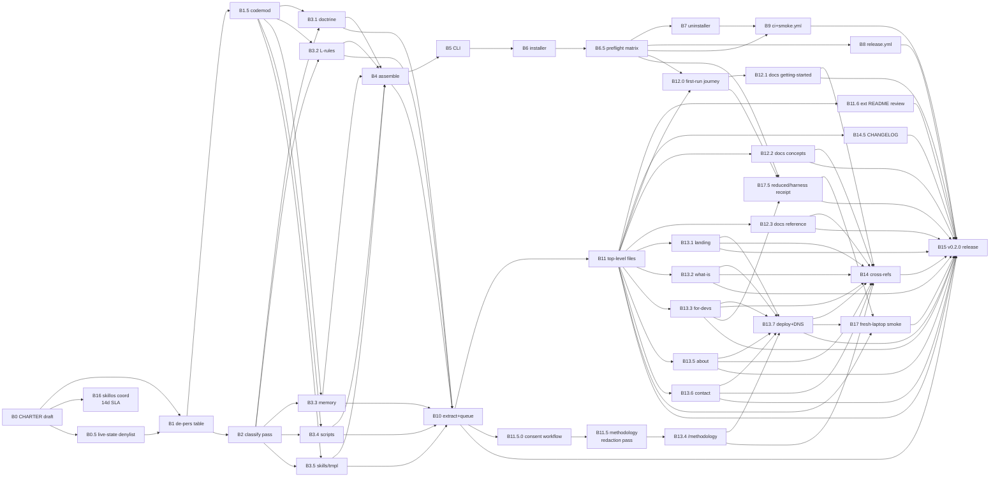

# 04-BEADS-DAG.md — Canonical bead DAG (Phase 4 DECOMPOSE)

**Plan:** `public-share-readiness`
**Phase:** 4 DECOMPOSE
**Author:** flywheel:1
**Composed:** 2026-05-12T~19:40Z
**Inputs:** `00-PLAN.md` (R4, 594 lines); `03-AUDIT-FINDINGS.md` (39 findings); Joshua-ratifications 2026-05-12T19:30Z (4 classes)
**Status:** Canonical DAG. Phase 5 polish replaces placeholder IDs with `flywheel-<id>` from `br create`.

---

## 1. Executive summary

Under working hypothesis **H3 (engine + methodology-reframed-case-study)**, this 36-bead DAG ships at the v0.2.0 tag: a public MIT-licensed engine at `github.com/JYeswak/flywheel` (extracted via classification + de-personalization codemod + per-substrate sweeps + assembly + verification) AND a six-page SMB-facing site at `flywheel.zeststream.ai` whose case-study slot reframes to `/methodology/how-we-built-this` (Joshua Class 6b ratification, option C, no self-referential case study). The DAG carries three Joshua-ratified additions over the 33-bead R4 baseline: **B0.5** live-state-artifact denylist (Class 5; extraction codemod halts on contact), **B11.5.0** consent workflow + per-named-entity matrix (Class 4; fallback drops case-study to `/methodology`), **B11.6** external developer README review (F3 trust-bar; blocks B15). Halted propagator scripts (`canonical-doctrine-sync.sh`, `sync-canonical-doctrine.sh`, `agents-md-fleet-propagator.sh`) are excluded from extraction entirely (Class 6a, option A). B11.5 is reframed; B16 carries a 14-day SLA fallback. Acceptance criteria are single-axis and script-verifiable for every P0 bead.

**Phase 5 installability amendment (2026-05-12T20:47Z, pane 2):** `05-INSTALLABILITY-COVERAGE-AUDIT.md` found that the 36-bead DAG is a strong extraction/publication plan but not yet a complete first-run operator journey. Phase 5 split three focused beads before `br create`: **B6.5** public dependency preflight matrix, **B12.0** first-run journey + support-tier docs, and **B17.5** reduced-mode/harness compatibility receipt. B6, B12.1, B13.3, B16, B17, and B15 remain tightened around dependency preflight, harness support tiers, reduced local mode, SkillOS capability-control-plane boundaries, and Mobile Eats L170 journey semantics. Red Hat/SMB positioning is a proof surface; SkillOS remains the capability control plane.

**Cross-lane updates folded into Phase 5 (2026-05-12T20:53Z):** Mobile Eats clarified that L170 quality distinguishes registry-valid journeys from runtime-proven journeys; fixture/data blockers are product evidence, not cross-repo doctrine. SkillOS repaired Socraticode and trauma-promotion gates and reports remaining red gates (`claude-state-pressure`, `file-length`, `jsm-marker`) as next-phase local work, not blockers to Flywheel Phase 5 DAG convergence.

---

## 2. Critical path

```
B0 → B0.5 → B1 → B1.5 → B2 → B3.4 → B4 → B5 → B6 → B6.5 → B10 → B11 → B12.0 → B17.5 → B17 → B15
```

16-node series. B3.4 (script sweep, 10-15h) is the dominant per-category sweep on the extraction side; B6.5 becomes the installability gate before release-grade smoke can mean anything. B3.1/B3.2/B3.3/B3.5 parallelize alongside B3.4. B11.5 + B11.5.0 (case-study redaction + consent) sit off-critical because `/methodology` fallback means B15 can launch even if H3 case-study collapses. B16 is off-critical because of the 14-day-or-zero-skills SLA fallback, but it is no longer a narrow skill handoff: it records the SkillOS capability-control-plane boundary. B12.* and B13.* parallelize against B5-B11, with B12.0 anchoring the first-run journey before docs polish.

---

## 3. Mermaid diagram



---

## 4. Bead table

| ID | Title | Pri | Effort | Wave | Depends on | Acceptance criterion (single-axis, observable) |
|---|---|---|---|---|---|---|
| B0 | Author `CHARTER.md` draft for Joshua review | P0 | M | 0 | — | `CHARTER.md` exists at repo root and its head commit contains a `Reviewed-by: Joshua Nowak <chiefzester@gmail.com>` trailer |
| B0.5 | Live-state artifact denylist — extractor refuses to copy these paths | P0 | S | 0 | B0 | `state/live-state-denylist.yaml` exists and `scripts/depersonalize.py --probe-denylist` against a synthetic denylist-path-bearing tree exits non-zero with documented error code |
| B16 | SkillOS capability-control-plane boundary handoff with 14-day SLA fallback | P0 | S | 0 | B0 | agent-mail topic `flywheel-skill-boundary-v0.2` has either a non-null `acknowledged_at` OR an `auto_locked_at` set ≥14 days after `created_at`, and the body distinguishes Flywheel installability/loop ownership from SkillOS capability-loop substrate ownership |
| B1 | Author `de-personalization-table.yaml` (master mapping; private) | P0 | M | 1 | B0, B0.5 | `de-personalization-table.yaml` validates against `scripts/de-personalization-table.schema.json` with exit code 0 |
| B1.5 | Build the de-personalization codemod (`scripts/depersonalize.py`) | P0 | M | 1 | B1 | `scripts/depersonalize.py --dry-run` on the source monorepo emits a diff whose post-apply `grep` of any value in the table's left column returns zero matches |
| B2 | Implement classification pass (`scripts/classify.py`) | P0 | M | 1 | B1 | `scripts/classify.py` emits `classification.jsonl` containing one row per scanned file and zero rows with `class: null` |
| B3.1 | Doctrine sweep (Mode A + Mode B; 94 files) | P0 | L | 2 | B1, B1.5, B2 | `grep -rE` of the de-personalization regex set against the doctrine extraction tree returns zero matches |
| B3.2 | L-rule sweep (Mode A dominant; 109 files) | P0 | M | 2 | B1, B1.5, B2 | `grep -rE` of the de-personalization regex set against the L-rule extraction tree returns zero matches |
| B3.3 | Memory-rule sweep (Mode A + Mode B + manual-review queue; 183 files) | P0 | L | 2 | B1, B1.5, B2 | `grep -rE` of the de-personalization regex set against the memory-rule extraction tree returns zero matches |
| B3.4 | Script sweep (path parameterization codemod; 394 files; excludes halted propagators) | P0 | L | 2 | B1, B1.5, B2 | `grep -rE` of the de-personalization regex set against the script extraction tree returns zero matches AND `find` for the three halted propagator filenames in the extraction tree returns empty |
| B3.5 | Skill + template sweep (~6 skills + 62 templates) | P0 | M | 2 | B1, B1.5, B2 | `grep -rE` of the de-personalization regex set against the skill+template extraction tree returns zero matches |
| B4 | Implement assembly pass (`scripts/assemble.py`) | P0 | M | 3 | B3.1, B3.2, B3.3, B3.4, B3.5 | `scripts/assemble.py` produces `.flywheel/extraction/staging/` AND `git -C <source> status --porcelain` reports zero modified paths |
| B5 | Author the engine CLI (`flywheel` bash entrypoint + subcommands) | P0 | L | 3 | B4 | `flywheel --help` returns exit 0 with usage text on a fresh staging-tree install |
| B6 | Author installer + dependency preflight (`install.sh` with fresh/partial/existing detection and reduced-mode resolver) | P0 | L | 3 | B5 | `installer-smoke.yml` legs on `macos-14` + `ubuntu-22.04` prove `preflight → install → doctor → uninstall → byte-equality`, and preflight emits status rows for Git, shell, Python, Node, Rust/Cargo, Go, SQLite, tmux, Agent Mail, Beads/`br`, NTM, DCG, CASS-style memory, and Socraticode |
| B6.5 | Public dependency preflight matrix + reduced-mode resolver fixture | P0 | M | 3 | B6 | `scripts/preflight.sh --json --fixture fixtures/preflight/{fresh,partial,existing,reduced}.json` emits one row per dependency and exits 0 for full mode or exits 20 with documented reduced-mode reason when optional substrate is absent |
| B7 | Author the uninstaller (`uninstall.sh --confirm`) | P0 | M | 4 | B6.5 | `uninstall.sh --confirm` on a freshly-installed staging tree leaves `git status --porcelain` empty |
| B8 | Author `release.yml` (tag-triggered release with SHA256 + `gh attest`) | P0 | M | 4 | B6.5 | A probe tag push produces a github release whose tarball SHA256 byte-matches the published `install.sh.sha256` |
| B9 | Author `ci.yml` + `installer-smoke.yml` workflows | P0 | M | 4 | B6.5, B7 | Both workflows green on a probe PR against `main` |
| B10 | Run extraction end-to-end + flush manual-review queue | P0 | L | 5 | B3.1, B3.2, B3.3, B3.4, B3.5, B4 | `.flywheel/extraction/staging/` exists AND `jq 'select(.signed_off_by==null)' < manual-review-queue/<ts>/*.jsonl` returns empty |
| B11 | Author public repo top-level files (`README` + `LICENSE` + `CHARTER` + `CHANGELOG` + `CODE_OF_CONDUCT` + `CONTRIBUTING` + `SECURITY` + quantified-differentiator block in `README`) | P0 | M | 5 | B10 | `test -f` returns 0 for all 7 files AND `grep -q 'Signed-off-by' CONTRIBUTING.md` returns 0 AND `README.md` contains a `## Why flywheel` section with at least one numeric measurement (regex `[0-9]+\s*(hours\|beads\|rules\|files\|lines)`) |
| B11.5.0 | H3 case-study consent collection + per-named-entity matrix + industry-only redaction policy | P0 | M | 5 | B10 | `consent-matrix.yaml` exists AND every row's `status` field ∈ `{granted, declined, not-applicable-fully-redacted}` (no `pending` at evaluation time) OR `fallback_activated: true` is set |
| B11.5 | Run methodology-reframed redaction pass (case-study slot becomes `/methodology/how-we-built-this`) | P0 | L | 5 | B11.5.0 | `grep -wFf <(yq '.clients[].canonical_name' de-personalization-table.yaml) methodology-draft.md` returns zero matches |
| B11.6 | External-developer README review (2 reviewers, neither Joshua nor flywheel:1) | P0 | S | 5 | B11 | `review-log.jsonl` contains exactly 2 rows with distinct `reviewer_id` values and each row's `verdict` field ∈ `{approved, approved_with_followups}` |
| B14.5 | Author `CHANGELOG.md` initial v0.2.0 entry | P0 | S | 5 | B11 | `CHANGELOG.md` contains a `## [0.2.0] - <date>` section AND `keepachangelog-lint CHANGELOG.md` exits 0 |
| B12.0 | First-run journey narrative + harness support-tier matrix | P0 | S | 6 | B6.5, B11 | `docs/getting-started/first-run.md` exists and names persona, first value, return loop, guardrail, Claude/Codex/OpenClaw/Gemini support tiers, reduced local mode, and post-run inspection commands |
| B12.1 | `docs/getting-started` + `docs/architecture` + first-run operator journey | P1 | M | 6 | B10, B11, B12.0 | `markdownlint docs/getting-started/ docs/architecture/` exits 0 AND `docs/getting-started` names persona, first value, return loop, guardrail, harness support tiers, reduced mode, and post-run inspection commands |
| B12.2 | `docs/concepts` (5 pages: plan-bead-code, trauma-promotion, substrate-classes, cross-orch-protocol, doctor-health-repair) | P1 | M | 6 | B10, B11 | `find docs/concepts -name '*.mdx' \| wc -l` returns 5 AND `markdownlint docs/concepts/` exits 0 |
| B12.3 | `docs/reference` + `docs/guides` + `docs/about` | P1 | M | 6 | B10, B11 | `markdownlint docs/reference/ docs/guides/ docs/about/` exits 0 |
| B13.1 | Webpage `/` landing | P1 | M | 6 | B11 | Built page passes `pa11y http://localhost:3000/` with zero error-level violations |
| B13.2 | Webpage `/what-is-flywheel` | P1 | M | 6 | B11 | Built page passes `pa11y http://localhost:3000/what-is-flywheel` with zero error-level violations |
| B13.3 | Webpage `/for-developers` | P1 | S | 6 | B11 | Built page contains a link with `href` equal to the canonical `github.com/JYeswak/flywheel` URL (HTML fixture grep returns 1) AND names support tiers honestly for Claude, Codex, OpenClaw, Gemini, and reduced local mode |
| B13.4 | Webpage `/methodology/how-we-built-this` (Class 6b option C reframe of former `/case-studies`) | P1 | M | 6 | B11.5 | Built page exists at route `/methodology/how-we-built-this` AND contains at least one named numeric metric (regex `[0-9]+\s+(hours\|beads\|rules\|files\|incidents)`) AND `grep -wFf <(yq '.clients[].canonical_name' de-personalization-table.yaml) <built-html>` returns zero matches |
| B13.5 | Webpage `/about` (Joshua photo + bio + direct email) | P1 | M | 6 | B11 | Built page contains `chiefzester@gmail.com` as an `href="mailto:"` link AND an `` with `alt` referencing Joshua |
| B13.6 | Webpage `/contact` + intake-form-routing | P1 | M | 6 | B11 | Form submission to `chiefzester@gmail.com` from a test browser session delivers a message with subject prefix `[flywheel-contact]` within 60 seconds |
| B13.7 | Webpage deploy + DNS + Cloudflare-Worker for `install.sh` | P1 | M | 6 | B13.1, B13.2, B13.3, B13.4, B13.5, B13.6 | `curl -fsSL https://flywheel.zeststream.ai/install.sh \| sha256sum` matches the released `install.sh.sha256` byte-for-byte |
| B14 | Wire webpage↔github cross-references | P1 | S | 6 | B12.1, B12.2, B12.3, B13.7 | `lychee --no-progress https://flywheel.zeststream.ai https://github.com/JYeswak/flywheel` reports zero broken links |
| B17.5 | Reduced-mode + harness compatibility receipt | P0 | S | 6 | B6.5, B12.0, B13.3 | `journey-smoke --matrix claude,codex,openclaw,gemini,reduced --dry-run --json` emits support-tier rows for all five lanes, labels each lane `registry_valid` and/or `runtime_proven`, and at least the reduced lane reaches `dispatch_or_simulate: pass`; fixture/data blockers remain product evidence, not doctrine escalation |
| B17 | Pre-launch journey smoke test on fresh laptop (installability receipt) | P0 | S | 6 | B11, B13.7, B17.5 | The journey smoke emits a JSON receipt with `preflight`, `init`, `doctor`, `tick`, `dispatch_or_simulate`, `closeout`, and `inspect_next_action` all `pass` for either `mode=full` or explicitly documented `mode=reduced` on fresh `macos-14` |
| B15 | Publish v0.2.0 release + Joshua sign-off | P0 | M | 7 | B8, B9, B10, B11, B11.6, B12.1, B12.2, B12.3, B13.1, B13.2, B13.3, B13.5, B13.6, B13.7, B14, B14.5, B17, B17.5 | The git tag `v0.2.0` exists, the github release at that tag is published, `gh api /repos/JYeswak/flywheel/commits/v0.2.0/check-runs --jq '.check_runs[] \| select(.conclusion!="success")'` returns empty, and Joshua signs off on repo, website, and first-run journey |

**Total: 39 beads.** P0 count: 28. P1 count: 11. Effort sum (midpoints): S=9 × 1.5h = 13.5h; M=23 × 5h = 115h; L=7 × 14h = 98h. **Total envelope: ~227h.** This remains inside the Phase 3 feasibility finding F1 envelope (~180-240h total) while making public installability first-class rather than implicit.

---

## 5. Wave map

Waves run sequentially; beads within a wave dispatch in parallel.

### Wave 0 — Foundation (no deps)

- **B0** Author `CHARTER.md` draft
- **B0.5** Live-state denylist (requires B0 because charter declares engine/overlay boundary)
- **B16** SkillOS capability-control-plane boundary handoff with 14d SLA

### Wave 1 — Extraction tooling

- **B1** de-personalization-table.yaml
- **B1.5** depersonalize.py codemod
- **B2** classify.py classification pass

### Wave 2 — Per-substrate sweeps (parallel)

- **B3.1** doctrine sweep
- **B3.2** L-rule sweep
- **B3.3** memory-rule sweep
- **B3.4** script sweep (halted propagator exclusion)
- **B3.5** skill + template sweep

### Wave 3 — Integration

- **B4** assembly pass
- **B5** engine CLI
- **B6** installer + dependency preflight + reduced-mode resolver
- **B6.5** public dependency preflight matrix + reduced-mode resolver fixture

### Wave 4 — Installer + verification

- **B7** uninstaller
- **B8** release.yml
- **B9** ci.yml + installer-smoke.yml

### Wave 5 — Repo + publishing

- **B10** extraction E2E + manual-review queue flush
- **B11** repo top-level files (with quantified-differentiator block)
- **B11.5.0** consent workflow + matrix
- **B11.5** methodology-reframed redaction pass
- **B11.6** external README review
- **B14.5** CHANGELOG initial entry

### Wave 6 — Docs, webpage + smoke

- **B12.0** first-run journey + support-tier matrix
- **B12.1, B12.2, B12.3** docs sections (parallel)
- **B13.1-B13.6** webpage pages (parallel; B13.4 depends on B11.5)
- **B13.7** webpage deploy + DNS + install-proxy Worker
- **B14** webpage↔github cross-references
- **B17.5** reduced-mode + harness compatibility receipt
- **B17** fresh-laptop journey smoke test

### Wave 7 — Launch

- **B15** v0.2.0 publish + Joshua sign-off

---

## 6. Audit-finding-to-bead map

Every HIGH-or-above audit finding (1 CRITICAL + 10 HIGH = 11) maps to ≥1 bead. The CRITICAL finding is the Class 5 live-state-artifact-denylist absence; the 10 HIGH split across the three lenses.

| Finding | Lens | Severity | Class | Bead mapping |
|---|---|---|---|---|
| F1+F10 completeness | completeness | CRITICAL | Class 5 | **B0.5** (denylist), enforced by **B3.1-B3.5** (per-sweep grep) and **B4** (assembly halt) |
| F3 completeness | completeness | HIGH | Class 6a | **B3.4** (script sweep excludes halted propagators); enforced by acceptance grep on filenames |
| F5 completeness | completeness | HIGH | Class 4 | **B11.5.0** (consent matrix); fallback to `/methodology` via **B13.4** |
| F1 trust-bar | trust-bar | HIGH | Class 6b | **B13.4** reframed to `/methodology/how-we-built-this` (option C); **B11.5** redaction pass updated accordingly |
| F2 trust-bar | trust-bar | HIGH | — | **B11** acceptance includes the quantified-differentiator regex (`Why flywheel` section + numeric measurement) |
| F3 trust-bar | trust-bar | HIGH | — | **B11.6** (external-developer README review; blocks B15) |
| F1 feasibility | feasibility | HIGH | — | Plan-level: effort envelope restated as ~180-240h total in §4 of this DAG; no separate bead |
| F3 feasibility | feasibility | HIGH | — | **B16** SLA fallback (14-day auto-lock to zero-skills v0.2) |
| F4 feasibility | feasibility | HIGH | Class 4 | **B11.5.0** industry-only redaction policy (replaces geography with industry descriptor) |
| F1 trust-bar critical | trust-bar | CRITICAL | — | Same as F1+F10 completeness; mapped to **B0.5** |
| F-other (medium/low × 28) | mixed | M/L | — | Absorbed as Phase 5 polish-round refinements per §7 |

**Trust-bar HIGH coverage:** 3/3 mapped.
**Feasibility HIGH coverage:** 3/3 mapped (one plan-level).
**Completeness HIGH coverage:** 4/4 mapped (3 to beads, 1 plan-level via DAG §4 envelope restatement).
**Critical coverage:** 1/1 mapped.

---

## 7. Phase 5 polish queue

Per `/flywheel:plan` spec, Phase 5 polishes until telemetry steady-state. Minimum 6 rounds:

| Round | Goal | Tools / skills |
|---|---|---|
| P1 | Assign canonical `flywheel-<id>` IDs via `br create`; persist dependency graph via `br dep add`; verify zero cycles via `bvg`; use the 39-bead split DAG unless Phase 5 explicitly reverts with a no-split receipt | `beads-workflow`, `beads-br`, `bvp`/`bvg` |
| P2 | Sharpen acceptance criteria: every single-axis check converts to a literal shell command stored in each bead's `acceptance_script` field; B6/B12.1/B13.3/B16/B17/B15 must preserve the installability coverage audit requirements | `canonical-cli-scoping`, `world-class-doctor-mode-for-cli-tools` |
| P3 | Effort recalibration: per-bead worker-hour estimate against historical NTM telemetry from analogous beads in `dispatch-log.jsonl`; flag any L-bead >16h for further split | `beads-workflow`, `extreme-software-optimization` |
| P4 | Dispatch packet authoring: every P0 bead has a Phase-8-ready prompt body that names skills, MUST/MUST-NOT lists, evidence-pack format, and ntm-callback template | `dispatch-tool-contracts`, `mcp-server-design` |
| P5 | Compliance scoring: run each bead through the 10-dim rubric for its category (doctrine / script / webpage / installer); reject beads <700/1000; rewrite and re-score | `agent-ergonomics-cli`, `de-slopify`, `ubs` |
| P6 | Convergence check: P5 vs P6 bead-body line-delta <3%; acceptance scripts unchanged; dispatch packets unchanged → Phase 6 (BEAD-CREATE) fires | `plan-space-convergence` |

If P6 fails convergence, P7+ runs until steady-state. The trigger is `delta_pct < 3 AND stable_rounds >= 2`.

### 7.1 Installability coverage gate before `br create`

Pane 2 selected the **split path** before P1 bead creation because the three installability gaps carry distinct ownership and acceptance surfaces:

1. **B6.5** public dependency preflight matrix: installer substrate; belongs with CLI/installer implementation.
2. **B12.0** first-run journey/support-tier docs: developer comprehension; belongs before docs/webpage polish.
3. **B17.5** reduced-mode/harness compatibility receipt: journey verification; belongs before fresh-laptop launch smoke.

This gate prevents Phase 5 from rubber-stamping an extraction-only DAG as a public-installability plan. A green command smoke is necessary evidence, but Mobile Eats L170 semantics require journey-grade value evidence: persona, first value, return loop, and guardrail. Phase 5 must distinguish `registry_valid` journeys from `runtime_proven` journeys; fixture/data blockers are product evidence unless they expose a direct Flywheel substrate gap.

---

## 8. Quality bar evidence requirements

Per `/flywheel:plan` quality-bar: `compliance_score >= 700/1000` per bead before Phase 6 fires. Per-category grading skills:

| Bead category | Beads | Grader skills |
|---|---|---|
| Doctrine / charter | B0 | `readme-writing`, `de-slopify`, `zeststream-brand-voice` |
| Extraction script (Python) | B1.5, B2, B4 | `python-best-practices`, `canonical-cli-scoping`, `testing-conformance-harnesses` |
| Extraction script (shell sweep) | B3.1, B3.2, B3.3, B3.4, B3.5 | `python-best-practices`, `rg-optimized`, `canonical-cli-scoping` |
| Table / schema | B1, B0.5 | `schema-validator-duo`, `data-quality-validation` |
| CLI / installer | B5, B6, B7 | `world-class-doctor-mode-for-cli-tools`, `installer-workmanship`, `canonical-cli-scoping` |
| CI / release | B8, B9 | `gh-actions`, `release-preparations`, `ci-cd-pipeline` |
| Repo files | B10, B11, B11.6, B14.5 | `readme-writing`, `de-slopify`, `zeststream-brand-voice`, `technical-writing` |
| Consent / legal | B11.5.0 | `contract-review`, `consent-management`, `compliance-automation` |
| Methodology / case-study | B11.5 | `technical-writing`, `de-slopify`, `zeststream-brand-voice` |
| Docs (Nextra) | B12.1, B12.2, B12.3 | `technical-writing`, `documentation-website-for-software-project`, `api-documentation-generation` |
| Webpage | B13.1, B13.2, B13.3, B13.4, B13.5, B13.6 | `ux-audit`, `technical-writing`, `zeststream-brand-voice`, `page-cro` |
| Webpage infra | B13.7, B14 | `vercel`, `cloudflare-api`, `dns-ssl-configuration` |
| Cross-orch coord | B16 | `cross-orch-handoff`, `agent-mail` |
| Smoke / release | B17, B15 | `testing-real-service-e2e-no-mocks`, `flywheel-end-to-end`, `release-preparations` |

Each bead's Phase-5-P5 round runs its category's grader skills; the lowest score across graders is the bead's score; <700 blocks Phase 6 entry.

---

*End of 04-BEADS-DAG.md. Phase 5 POLISH consumes this as input.*
