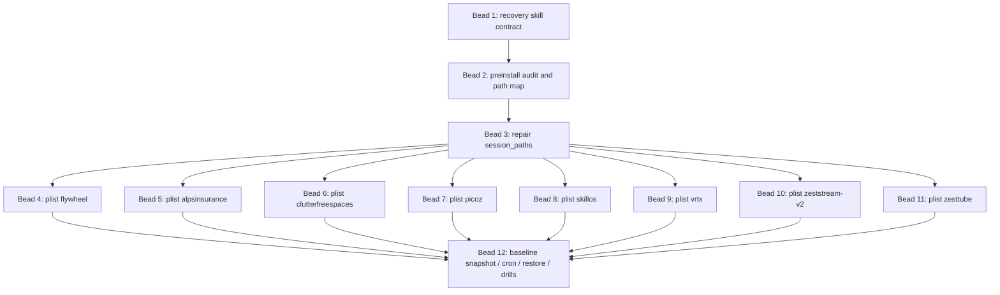

# Flywheel Recovery System Plan - 2026-05-01

Source lanes:

- Lane A: `/tmp/recovery_lane_a_state_inventory.md`
- Lane B: `/tmp/recovery_lane_b_jeff_patterns.md`
- Lane C: `/tmp/recovery_lane_c_implementation_design.md`

Synthesis status:

- `ladder_passed`: yes
- `disagreements`: 9
- `cross_lane_gaps_caught`: 7
- `joshua_decisions`: 12

## Source Confidence

Lane A is accepted as the authoritative inventory of local reboot-survival
state. It completed read-only validation with 21 layers, 12 gaps, 16 failure
modes, and `ladder_passed=yes` (`Lane A §8`).

Lane B is accepted as the authoritative Jeff-pattern audit. It completed
read-only validation with 48 findings, 12 gaps, 18 adoption calls, and
`ladder_passed=yes` (`Lane B §9`).

Lane C is accepted as a useful implementation draft, not as clean execution
evidence. Its own caveat states it accidentally ran `ntm save` while probing
help, cleaned the scratch output, and therefore set `ladder_passed=no`
(`Lane C §Execution Caveat`, `Lane C §9`). This synthesis trusts C's CLI
contract, phase decomposition, and 12-bead graph only where they are consistent
with Lane A's inventory and Lane B's adoption findings.

R2 keeps R1 steady-state: no disagreement was reopened, no bead was added, and
changes are limited to acceptance precision, Lane B traceability, retention
guardrails, and test coverage.

## 1. Convergence Matrix

| Dimension | Lane A | Lane B | Lane C | Synthesis |
|---|---|---|---|---|
| State taxonomy | 21 layers across sessions, agents, repos, logs, mail, memory, topology (`A §1`) | Does not inventory all state; identifies Jeff durability surfaces (`B §1`) | Uses active sessions and config/plist/checkpoint state (`C §Evidence Summary`) | Adopt A's 21 layers as the protection taxonomy; every bead must map to one or more layers. |
| Gap inventory | 12 gaps (`A §4`) | 12 Jeff-does-not-solve gaps (`B §4`) | Observes 6 live sessions absent from config plus zero plists (`C §Evidence Summary`) | Reconcile into 14 functional gaps: path, plist, checkpoint, bootstrap, dispatch, transcript, AM, CASR, pulse, artifact promotion, boot gate, retention, protected policy, and drill evidence. |
| Failure modes | 16 concrete reboot scenarios (`A §5`) | 48 audit findings across 16 lenses (`B §3`) | 3 recovery scenarios plus golden path (`C §5`) | A's 16 are the test-case spine; B's 48 are risk controls; C's scenarios become E2E examples. |
| Primitive adoption | Audits NTM checkpoint/list/restore/export/save/adopt, CASR, handoff (`A §3`) | 18 ADOPT/EXTEND/AVOID calls (`B §5`) | Uses NTM, launchd, `/schedule`, helper script (`C §2-§5`) | Use NTM checkpoint/restore and launchd as primitives; avoid reimplementing checkpoint logic and avoid CASR-as-backup. |
| Watcher model | Current watcher exits 0 if session missing; no plists installed (`A §3 Primitive E`) | Watcher plists alone cannot reconstruct sessions (`B §2 P01`) | Installs per-session watcher beads (`C Beads 4-11`) | Per-session watcher plists are necessary but insufficient; add boot bootstrap before watcher reliance. |
| Checkpoint model | Exact checkpoint gaps for flywheel, skillos, alpsinsurance (`A §3 Primitive B`) | NTM checkpoint exists and should be extended, not rebuilt (`B §5 A01`) | Baseline checkpoint in Bead 12 (`C Bead 12`) | Baseline checkpoint must be its own explicit acceptance gate before claiming recovery readiness. |
| Agent continuation | Live CLI processes die; transcripts survive but resume mapping is missing (`A Layers 3-6`) | CASR is conversion, not archive (`B A05-A06`, `B F48`) | Mentions CASR missing/unverified (`C §Evidence Summary`) | Add pane resume pointer registry; CASR remains fallback conversion only. |
| Dispatch/callback continuity | In-flight dispatch context fragile (`A Layer 19`, `A Gap 6`) | Agent Mail durable but not pane interrupt; pair with NTM poke (`B C03`) | Restore walkthrough flags stale worker generation (`C Failure Scenario 3`) | Add dispatch ledger snapshot before/after every send; recovery classifies orphan candidates before redispatch. |
| Agent Mail recovery | AM DB/plist survive but FD leak class exists (`A Layer 10`, `A F4`) | AM LaunchAgent and identities adopted; replay ordering gap (`B A07-A09`, `B G05`) | Not first-class in bead graph except callback/identity context | Add AM health and identity readiness to boot gate before replaying inbox or callbacks. |
| Session topology | JSONL survives but coverage incomplete (`A Layer 14`) | Cross-session ordering is not solved by repo-local state (`B P03`, `B G04`) | Phase 0 audits live sessions/config (`C Phase 0`) | Topology/roster must become the canonical active-session map before plist install or restore. |
| Bead count | No bead graph; lists 12 gaps | Warns against duplicating Jeff surfaces and emphasizes drill evidence | 12 beads, cap-compliant (`C §3`) | Keep 12 beads, but strengthen Bead 12 acceptance and add explicit sub-deliverables for snapshot, cron, restore, and drills. |
| Phase ordering | Recommends snapshot/bootstrap/verify primitives (`A §7`) | Recommends R0-R4: inventory, snapshot, launchd, restore, drills (`B §7`) | Phases 0-5: audit, path repair, plists, baseline, cron, restore (`C §2`) | Final phases 0-5: audit, path repair, watcher/bootstrap, baseline snapshot, schedule/retention, restore/drills. |
| Cron design | Notes loop/tick state survives but delivery needs panes (`A Layer 17`) | Cloud+local split recommended (`B §7`, `B P09`) | Remote `/schedule` at 03:17 MDT, caveat unverified (`C §4`) | Use local deterministic helper for actual snapshot; remote schedule is only a nudge/monitor until slash surface is verified. |
| Retention | Identifies checkpoint and `/tmp` artifact fragility (`A Layers 20, Primitive D`) | Requires retention by active session, bytes, JSONL rotation (`B F28-F30`, `B F43-F45`) | Proposes daily 14, weekly 8, keep baseline (`C §4`) | Initial retention: keep latest verified, 14 daily, 8 weekly, protected baselines until retired by audit row. |
| Recovery procedure | Recommends `snapshot`, `bootstrap`, `verify` (`A §7`) | Recommends boot restore order and drills (`B §7`) | Provides restore dry-run/apply walkthrough (`C §5`) | Final restore is dry-run first, session-by-session, protected-policy aware, with post-restore doctor and dispatch reconciliation. |
| Validation discipline | Read-only, no fabrication (`A §8`) | Dry-run, audit, rollback, idempotency findings (`B F31-F39`) | Failed ladder from side-effect command (`C §Execution Caveat`) | All implementation beads must prove dry-run outputs before apply and forbid bare command invocations in probe loops. |

## 2. Disagreements Found

### D1 - Do watcher plists solve reboot recovery?

- Lane A: no. Current `ntm-watcher.sh` exits cleanly when the session is absent (`A Primitive E`).
- Lane B: no. Watcher plists are a boot trigger, but not session resurrection (`B P01`, `B C01`).
- Lane C: per-session plist install is Phase 2 and eight of twelve beads (`C Beads 4-11`).
- Decision: watcher plists are required but not sufficient.
- Why: reboot kills the underlying session; a watcher that exits when the session is missing cannot recreate the fleet alone.

### D2 - Should `/schedule` be the primary nightly mechanism?

- Lane A: loop/tick state survives as files, but tick delivery depends on panes (`A Layer 17`).
- Lane B: recommends remote schedule plus local deterministic helper (`B §7`, `B P09`).
- Lane C: proposes exact `/schedule create`, but admits no local `/schedule` skill was found (`C §4`, `C §Evidence Summary`).
- Decision: use a local helper as the authority; use remote `/schedule` only after slash surface validation.
- Why: the actual checkpoint command needs local NTM access and deterministic logging; remote schedule is a supervisory nudge.

### D3 - Should CASR be a recovery backup?

- Lane A: CASR binary absent; script provider counts mismatched raw transcript files (`A Primitive H`, `A Gap 11`).
- Lane B: explicitly says CASR as backup is AVOID (`B A06`, `B F48`).
- Lane C: notes CASR missing/unverified (`C §Evidence Summary`).
- Decision: CASR is a fallback conversion tool, not a recovery archive.
- Why: recovery must preserve native transcript pointers; conversion is lossy and should not be automatic after reboot.

### D4 - Should all eight sessions be protected immediately?

- Lane A: all eight are active, but topology coverage is incomplete (`A Active Fleet Snapshot`, `A Layer 14`).
- Lane B: protected-session policy is not solved by Jeff primitives (`B G06`).
- Lane C: proposes eight per-session watcher beads (`C Beads 4-11`).
- Decision: all eight should be audited, but apply/install should be gated by Joshua-disposed protected status and canonical path confidence.
- Why: ALPS and Picoz have client/safety implications; blind automation across all sessions is too broad.

### D5 - How many checkpoints are needed before claiming readiness?

- Lane A: no exact core checkpoints for flywheel/skillos/alpsinsurance (`A Primitive B`).
- Lane B: checkpoint freshness invariant required (`B G08`, `B F14`).
- Lane C: Bead 12 creates eight baselines (`C Bead 12`).
- Decision: readiness requires at least one verified checkpoint per protected session and freshness age under policy.
- Why: global historical checkpoint count is misleading; current active-session coverage is what matters.

### D6 - Is Markdown handoff or JSON manifest authoritative?

- Lane A: `/flywheel:handoff` captures semantic state but is manual (`A Primitive I`).
- Lane B: human-readable and machine-readable must both exist, but Markdown can drift (`B P07`).
- Lane C: restore sends resume packets and uses audit JSONL (`C Phase 5`).
- Decision: JSON manifest is authoritative; Markdown is generated from it.
- Why: restore automation needs deterministic fields; humans need readable summaries.

### D7 - Is Bead 12 too large?

- Lane A: separates snapshot, bootstrap, verify (`A §7`).
- Lane B: separates R0-R4 and emphasizes drill evidence (`B §7`).
- Lane C: combines baseline snapshot, nightly cron, and restore harness in Bead 12 due to cap (`C Bead 12`).
- Decision: keep the 12-bead cap, but require Bead 12 to contain four explicit milestones: baseline, schedule, restore dry-run, drill evidence.
- Why: cap-compliant delivery is useful, but acceptance must prevent a giant untestable bead.

### D8 - Should recovery use SQLite for its own ledger?

- Lane A: identifies JSONL topology/fuckup logs and SQLite DBs; no new DB needed (`A Layers 8, 13, 14`).
- Lane B: recommends append-only JSONL first; SQLite only if query volume requires it (`B P02`, `B P04`).
- Lane C: uses JSONL audit files (`C Bead 1`, `C Bead 12`).
- Decision: use JSONL for v1 recovery ledgers.
- Why: lower risk, easy append, compatible with current flywheel state patterns.

### D9 - Should implementation trust Lane C despite its failed ladder?

- Lane A: clean read-only evidence.
- Lane B: clean read-only evidence.
- Lane C: explicitly failed read-only discipline but documents the side effect and cleanup (`C §Execution Caveat`).
- Decision: trust C's design structure, not its validation status.
- Why: C's bead graph and CLI surface are independently consistent with A/B, but implementation must enforce stricter help-probing discipline.

## 3. Cross-Lane Gaps No Single Lane Fully Caught

### Gx1 - Boot bootstrap is missing from the 12-bead graph

Severity: critical.

A says watchers do not resurrect absent sessions. B says watcher plists are boot triggers only. C installs watcher plists but does not assign a separate bead to the boot bootstrap. Final plan folds bootstrap requirements into Bead 1 contract and Bead 12 restore harness, but this is the most important acceptance risk.

### Gx2 - Topology coverage is a precondition for installing plists

Severity: critical.

A finds incomplete session topology. C's install beads assume Phase 1 can resolve paths. B flags protected-session policy. No lane makes topology completeness a hard install gate for all sessions. Final plan requires authoritative topology/roster rows before applying watcher install.

### Gx3 - Recovery readiness needs a dispatch ledger, not just checkpoints

Severity: major.

A identifies orphan dispatch risk. B says Agent Mail durability is not a pane interrupt. C only treats stale worker generation as a restore scenario. Final plan makes dispatch ledger state part of Phase 0/3 acceptance.

### Gx4 - `/tmp` plan artifacts are part of current mission state

Severity: major.

A notices ten tentacle plans in `/tmp`. B recommends durable audit logs. C does not cover artifact promotion. Final plan adds artifact promotion to snapshot/handoff behavior before any planned reboot.

### Gx5 - CASR provider count mismatch is itself a recovery blocker

Severity: major.

A observes raw transcripts but CASR script reports zero sessions. B says CASR is not backup. C only notes `casr` missing. Final plan adds a CASR/provider path reconciliation task before any cross-provider recovery claim.

### Gx6 - Launchd readiness must wait for service dependencies

Severity: major.

A has a boot gate gap. B has race-condition and launchd environment findings. C installs plists. No single lane specifies a readiness gate covering NTM, repos, Agent Mail, provider CLIs, and disks. Final plan makes boot-gate mandatory before restore.

### Gx7 - Retention needs protected-session exceptions

Severity: medium.

B gives retention numbers and data exposure findings. C gives 14 daily/8 weekly. A identifies active client/protected sessions. Final plan adds protected-session baseline retention until explicit retirement.

## 4. Final Converged Plan

### Problem Statement

If the Mac Studio reboots overnight, the durable data mostly remains on disk, but the live NTM fleet does not come back as a coherent operating system. Sessions, panes, agent processes, dispatch/callback state, and current worker context die; watcher plists are absent; exact current checkpoints are missing for core sessions; and stale path/topology data can restore the wrong thing.

The recovery system must turn "many durable fragments" into a verified fleet resurrection path: audit the current state, repair session identity and paths, install boot supervision, take verified snapshots, run nightly retention, and restore with dry-run proof before mutation.

### Goals

- Preserve enough state to restore all active recovery-approved NTM sessions after reboot.
- Make restore deterministic: every action has dry-run output, audit rows, and rollback guidance.
- Reuse Jeff primitives where strong: NTM checkpoints, launchd watchers, Agent Mail durability, Beads local state, DCG safety patterns.
- Protect client/safety sessions with explicit policy and no blind force restore.
- Produce drill evidence before claiming the system is reliable.

### Non-Goals

- Do not preserve live model process memory or unsent in-generation tokens.
- Do not use CASR as a backup archive.
- Do not reimplement NTM checkpoint internals.
- Do not make FrankenSQLite or vibe_cockpit a v1 runtime dependency.
- Do not run destructive restore, checkpoint deletion, or plist bootout without explicit apply/override gates.

### Architecture

```text
                +----------------------------+
                | /flywheel:recovery command |
                +-------------+--------------+
                              |
                              v
       +----------------------------------------------+
       | flywheel-recovery helper: dry-run/apply/json |
       +-------+----------+----------+---------+------+
               |          |          |         |
               v          v          v         v
        status/audit   path repair  snapshot  restore
               |          |          |         |
               v          v          v         v
        topology      ntm config   ntm cp    ntm restore
        roster        plists       exports   pane resume
        AM health     audit log    manifest  post-doctor
```

Authoritative v1 state stores:

- `~/.local/state/flywheel-recovery/audit.jsonl`
- `~/.local/state/flywheel-recovery/snapshots/*.json`
- `~/.local/state/flywheel-recovery/checkpoints/`
- `~/.local/state/flywheel-recovery/nightly.jsonl`
- `~/.local/state/flywheel-recovery/drills.jsonl`
- `~/.local/state/flywheel/session-topology.jsonl`
- Repo-local `.flywheel/{MISSION,GOAL,STATE}.md`
- Repo-local `.beads/*.db`

### Operating Principles

Source: `Lane A §7`, `Lane B P04-P10`, `Lane C §1`.

1. Dry-run is mandatory before every mutation.
2. JSON is authoritative; Markdown is a generated human view.
3. The helper writes an audit row before and after every mutating action.
4. Reboot recovery is session-scoped during execution but fleet-scoped during planning.
5. Protected sessions can be audited by default but restored only by explicit policy.
6. Existing Jeff primitives are called, not copied.
7. Watcher liveness and session resurrection are separate checks.
8. A checkpoint is not valid until verified and recorded in the manifest.
9. Native transcripts are referenced by path and hash metadata, not copied into shared archives by default.
10. Recovery should prefer blocking with a precise missing precondition over guessing.

### Recovery Manifest Schema

Source: A's 21 layers (`Lane A §1`), B's append-only/atomic-write patterns
(`Lane B P04-P05`), and C's helper contract (`Lane C Bead 1`).

Each recovery snapshot writes one manifest:

```json
{
  "schema_version": 1,
  "created_at": "2026-05-01T00:00:00Z",
  "host": "Joshs-Mac-Studio",
  "trigger": "manual|nightly|pre-reboot|post-reboot",
  "mode": "dry-run|apply",
  "idempotency_key": "string",
  "fleet": {
    "sessions_expected": 8,
    "sessions_seen": 8,
    "panes_seen": 32,
    "protected_policy_version": "string"
  },
  "sessions": [
    {
      "session": "flywheel",
      "repo_path": "/Users/josh/Developer/flywheel",
      "protected": true,
      "protection_reason": "brain-session",
      "topology_source": "session-topology|team-roster|config|inferred",
      "topology_confidence": "high|medium|low",
      "orchestrator_pane": 1,
      "callback_pane": 1,
      "worker_panes": [2, 3, 4],
      "watcher": {
        "plist_expected": true,
        "plist_path": "~/Library/LaunchAgents/com.ntm.watcher.flywheel.plist",
        "loaded": true,
        "label": "com.ntm.watcher.flywheel"
      },
      "checkpoint": {
        "latest_id": "string|null",
        "latest_verified": true,
        "age_hours": 0,
        "export_path": "string|null",
        "sha256": "string|null"
      },
      "repo": {
        "head": "short-sha",
        "branch": "master",
        "dirty_count": 0,
        "beads_integrity": "ok|warn|fail",
        "state_docs": "ready|drift|missing"
      },
      "agents": [
        {
          "pane": 2,
          "kind": "codex",
          "native_session_path": "string|null",
          "native_session_hash": "string|null",
          "last_activity": "string|null",
          "dispatch_id": "string|null"
        }
      ],
      "dispatch": {
        "in_flight": 0,
        "orphan_candidates": [],
        "last_callback_seen": "string|null"
      },
      "health": {
        "ntm": "ok|warning|error|unknown",
        "agent_mail_identity_ready": true,
        "boot_ready": true
      }
    }
  ],
  "artifacts": [
    {
      "path": "/tmp/recovery_lane_a_state_inventory.md",
      "promote": true,
      "destination": ".flywheel/plans/recovery-system-2026-05-01/"
    }
  ],
  "warnings": [],
  "errors": []
}
```

Manifest requirements:

- `schema_version` increments only on incompatible field changes.
- `session` names use the same canonical spelling as NTM.
- `topology_confidence=low` blocks apply for watcher install or restore.
- `latest_verified=false` blocks restore unless Joshua overrides.
- `protected=true` blocks force restore unless the run carries explicit approval.
- `native_session_path` may be null, but then recovery cannot claim agent-level continuation.
- `dispatch.orphan_candidates` are never auto-closed.

### Restore State Machine

Source: `Lane A §5`, `Lane B F31-F39`, `Lane C §5`.

Recovery should model each session as a state machine:

1. `unknown`
   - No valid current manifest row.
   - Allowed actions: audit only.

2. `audited`
   - Active or expected session discovered.
   - Path/topology confidence computed.
   - Allowed actions: dry-run path repair, dry-run plist install.

3. `path_ready`
   - Config and topology agree.
   - Allowed actions: watcher install dry-run/apply.

4. `watcher_ready`
   - Plist exists and launchd sees it.
   - Allowed actions: checkpoint dry-run/apply.

5. `checkpoint_ready`
   - Latest checkpoint exists and verifies.
   - Allowed actions: restore dry-run.

6. `restore_plan_ready`
   - Dry-run restore result recorded.
   - Allowed actions: apply restore if session is missing or explicit force allowed.

7. `restored`
   - Pane count and layout match expected values.
   - Allowed actions: post-restore doctor and resume packet.

8. `verified`
   - NTM health, repo doctor, Beads integrity, and callback ledger pass.
   - Allowed actions: resume dispatch.

Blocked substates:

- `blocked_low_confidence_path`
- `blocked_protected_session`
- `blocked_missing_checkpoint`
- `blocked_dirty_owner_unknown`
- `blocked_agent_mail_unready`
- `blocked_provider_resume_unknown`

### Recovery Procedure

Source: A's snapshot/bootstrap/verify split (`Lane A §7`), B's R0-R4 shape
(`Lane B §7`), and C's golden path (`Lane C §5`).

Planned reboot procedure:

1. Run `/flywheel:recovery status --json`.
2. Resolve all low-confidence paths.
3. Run `/flywheel:recovery snapshot --all --dry-run --json`.
4. Run `/flywheel:recovery snapshot --all --apply --json`.
5. Confirm manifest has all protected sessions in `checkpoint_ready`.
6. Promote required `/tmp` artifacts into repo plan space.
7. Optionally run `/flywheel:handoff pre-reboot` if the operator is pausing.
8. Reboot.
9. On boot, run `/flywheel:recovery restore --all --dry-run --json`.
10. Apply restore session-by-session according to protected policy.
11. Run `/flywheel:recovery verify --all --json`.
12. Reconcile orphan dispatches and emit a recovery receipt.

Unplanned reboot procedure:

1. Boot helper waits for home dir, NTM binary, config, and repo paths.
2. Recovery reads latest valid manifest.
3. If no manifest exists, it runs audit-only and blocks restore.
4. Recovery restores `flywheel` first if approved and checkpoint exists.
5. Recovery restores skill/session dependencies after `flywheel` verifies.
6. Recovery does not replay Agent Mail until topology and identities are ready.
7. Any in-flight dispatch without callback becomes `orphan_candidate`.
8. Recovery prints a single operator summary: restored, blocked, skipped.

### Retention Policy

Source: `Lane B F28-F30`, `Lane B F43-F45`, `Lane C §4`.

Initial v1 retention:

- Keep latest verified checkpoint for every protected session.
- Keep baseline checkpoints until an audit row explicitly retires them.
- Keep 14 daily verified checkpoints per protected session.
- Keep 8 weekly verified checkpoints per protected session.
- Default byte guardrail: warn at 5 GiB per protected session, fail dry-run at
  8 GiB per protected session unless Joshua overrides. Latest verified and
  protected baselines still win over pruning; quota pressure becomes an alert,
  not silent deletion.
- Keep failed checkpoint metadata for 30 days, but do not keep corrupt payloads
  unless a diagnostic bead asks for them.
- Keep `audit.jsonl` raw rows for 90 days, then summarize and rotate.
- Keep `drills.jsonl` indefinitely or until copied into doctrine evidence.
- Never prune a checkpoint referenced by the current manifest.

Retention dry-run must report:

- checkpoint count by session,
- total bytes by session,
- rows/files to prune,
- latest verified checkpoint per session,
- baselines that would be preserved,
- protected-session exceptions.

### Security and Data Exposure Rules

Source: `Lane B F01-F03`, `Lane B F19-F21`.

- Session names must validate against `[A-Za-z0-9._-]` before plist generation.
- Exported checkpoint archives default to redacted.
- Non-redacted local archives, if any, must be mode `0600`.
- Provider native transcript files are not copied into shared archives by default.
- Agent Mail token contents are never copied into recovery manifests.
- Callback messages include artifact paths and counts, not scrollback contents.
- Client sessions default to protected policy.

### Rollback Rules

Source: `Lane B F37-F39`, `Lane C Phase 1/2/3 rollback notes`.

- Config repair creates a backup before write and logs old/new SHA256.
- Plist install rollback is per-session uninstall.
- Checkpoints are not deleted automatically during first rollout.
- Restore apply should checkpoint the live target first when feasible.
- Agent Mail replay stores last handled message IDs before replaying.
- Any failed apply leaves an audit row with `status=partial` and `next_safe_action`.

### 5-Phase Implementation Roadmap

#### Phase 0 - Audit and Canonical Map

Source: `Lane A §7`, `Lane B §7 R0`, `Lane C Phase 0`.

Deliverables:

- `/flywheel:recovery status --json`
- active session list with pane counts
- session path map from config, topology, roster, and actual repo paths
- watcher plist coverage
- checkpoint freshness by active session
- topology completeness report
- protected-session classification report

Acceptance:

- All eight active sessions classified as `ready`, `blocked_missing_path`, or `excluded_by_policy`.
- No writes outside `/tmp` in dry-run.
- `watcher_plist_coverage` reports zero at current baseline and later reaches target.

#### Phase 1 - Repair Session Paths and Topology

Source: `Lane A Gap 3`, `Lane B G04/G06/G07`, `Lane C Phase 1`.

Deliverables:

- TOML-aware session path repair plan.
- Backup of `~/.config/ntm/config.toml`.
- Append-only audit row with old/new hash.
- Topology/roster authority check.

Acceptance:

- Active approved sessions have canonical paths.
- `alps-insurance` versus `alpsinsurance` is resolved intentionally.
- Low-confidence paths block instead of guessing.

#### Phase 2 - Watcher Plists and Boot Bootstrap

Source: `Lane A Primitive E`, `Lane B P01/C01`, `Lane C Phase 2`.

Deliverables:

- Per-session watcher plists for approved sessions.
- One flywheel recovery boot helper/LaunchAgent, or equivalent boot entrypoint, that restores missing sessions before watchers are expected to latch.
- Launchd status verifier.

Acceptance:

- Watcher plist exists and is loaded for each approved session.
- Bootstrap dry-run shows missing-session restore order.
- Recovery never claims watcher coverage equals reboot recovery unless bootstrap is present.

#### Phase 3 - Baseline Snapshot and Manifest

Source: `Lane A Gaps 4-7`, `Lane B P02/P04/P05/P08`, `Lane C Phase 3`.

Deliverables:

- One verified NTM checkpoint per approved session.
- Exported checkpoint archive with redaction policy.
- Recovery manifest containing versions, repo docs, dirty state, dispatch ledger, AM identity readiness, and pane resume pointers.

Acceptance:

- Latest verified checkpoint exists for each approved session.
- Manifest written temp-to-final.
- Dirty worktree owner map exists or restore blocks.

#### Phase 4 - Nightly Snapshot, Retention, and Alerting

Source: `Lane B F28-F30/F43-F45`, `Lane C Phase 4`.

Deliverables:

- Local deterministic nightly helper.
- Optional remote `/schedule` nudge after slash surface validation.
- Retention policy.
- Failure callback contract.

Acceptance:

- Nightly JSONL receives one aggregate row and per-session rows.
- Latest verified checkpoint is never pruned.
- Protected baselines require explicit retirement.

#### Phase 5 - Restore, Reconcile, and Drill Evidence

Source: `Lane A §5`, `Lane B P09/R4`, `Lane C Phase 5/§5/§6`.

Deliverables:

- Restore dry-run.
- Apply restore with protected policy.
- Post-restore doctor suite.
- Dispatch/callback orphan reconciliation.
- Drill ledger.

Acceptance:

- D1 dry-run restore passes.
- D2 disposable session kill/restore passes.
- D3 interrupted snapshot recovery passes.
- D4 reboot-like bootstrap drill passes before claiming full readiness.

## 5. 12-Bead DAG Validation

### Validated Bead List

| Bead | Title | Depends on | Validated synthesis scope |
|---:|---|---|---|
| B01 | Recovery skill contract and helper surface | none | CLI/schema/dry-run/audit contract; must include bootstrap and dispatch-ledger concepts. |
| B02 | Preinstall audit and session path map | B01 | Protects A layers 1,2,14,15,17 and B watcher/checkpoint findings. |
| B03 | Repair session paths | B02 | Protects stale path and wrong-repo restore failure. |
| B04 | Install plist for flywheel | B03 | Protects brain session watcher coverage. |
| B05 | Install plist for alpsinsurance | B03 | Protects ALPS only after protected policy/path confidence. |
| B06 | Install plist for clutterfreespaces | B03 | Protects session after path confidence. |
| B07 | Install plist for picoz | B03 | Protects safety-critical trading session; install only, no restore. |
| B08 | Install plist for skillos | B03 | Protects skill authoring substrate. |
| B09 | Install plist for vrtx | B03 | Protects VRTX session after path confidence. |
| B10 | Install plist for zeststream-v2 | B03 | Protects dashed session name; validates quoting. |
| B11 | Install plist for zesttube | B03 | Protects ZestTube session. |
| B12 | Baseline snapshot, nightly cron, restore harness | B04-B11 | Must include baseline, retention, restore dry-run, and drill evidence milestones. |

### Mermaid DAG



Cycle validation:

- The graph is acyclic by construction: B01 -> B02 -> B03 -> B04-B11 -> B12.
- No edge points back to an earlier phase.

### Lane A Layer Traceability

| A Layer | Protected by bead(s) |
|---|---|
| 1 NTM/tmux session process | B02, B04-B12 |
| 2 Pane layout/title/command | B02, B12 |
| 3 Agent CLI processes | B01, B12 |
| 4 Claude transcripts | B01, B12 |
| 5 Codex state | B01, B12 |
| 6 Gemini state | B01, B12 |
| 7 CASS cache | B01, B12 |
| 8 Beads DBs | B02, B12 |
| 9 Dirty worktrees | B02, B12 |
| 10 Agent Mail service | B01, B02, B12 |
| 11 Substrate registry | B02, B12 |
| 12 Locked docs | B02, B12 |
| 13 Fuckup-log | B02, B12 |
| 14 Session topology | B02, B03 |
| 15 Team roster/pulse | B02, B12 |
| 16 Fleet health daemon | B02, B12 |
| 17 Loop state | B02, B12 |
| 18 Tick receipts/logs | B02, B12 |
| 19 In-flight dispatch context | B01, B02, B12 |
| 20 Tentacle plans in `/tmp` | B12 |
| 21 Project memory | B02, B12 |

### Lane B Adoption Traceability

| B adoption | Bead use |
|---|---|
| A01 NTM checkpoint/list/show/restore/export EXTEND | B12 calls NTM rather than reimplementing. |
| A02 NTM session save/restore EXTEND | B12 restore harness treats NTM session state as the substrate. |
| A03 NTM respawn/adopt/bind ADOPT | B12 may use these only as explicit operator fallback after dry-run. |
| A04 NTM launchd watcher EXTEND | B04-B11 install and verify; B12 adds bootstrap/restore. |
| A05 CASR provider discovery ADOPT | B01/B12 record provider/native transcript pointers. |
| A06 CASR as backup AVOID | B12 does not depend on CASR for snapshot. |
| A07 CASR conversion ADOPT | B12 may offer conversion as manual fallback after native restore. |
| A08 CASR checkpoint metadata EXTEND | B01 manifest reserves resume pointer fields without archiving transcripts. |
| A09 Agent Mail LaunchAgent/SQLite ADOPT | B02/B12 include service and DB readiness. |
| A10 Agent Mail wake/replay channel EXTEND | B12 replays only after topology, pane, and identity readiness. |
| A11 Agent Mail identity/token readiness ADOPT | B02/B12 block callback replay if identity readiness is false. |
| A12 Beads local `.beads` state ADOPT | B02/B12 inspect repo-local DBs before redispatch. |
| A13 Beads JSONL/history ADOPT | B01/B12 use append-only ledgers. |
| A14 FrankenSQLite EVALUATE only | No v1 dependency; revisit only after JSONL query pressure appears. |
| A15 Asupersync quiescence ADOPT as pattern | B12 bounded quiescence before checkpoint. |
| A16 ACFS phase/idempotency ADOPT | B01/B02/B03 dry-run/apply/idempotency. |
| A17 DCG guard pattern ADOPT | B01 requires self-gates for destructive forms. |
| A18 Launchd log/health pattern EXTEND | B04-B12 include stdout/stderr paths and machine-readable status rows. |

### Failure-Mode Coverage Matrix

| Lane A failure mode | Mitigating bead(s) | Required bead-acceptance line |
|---|---|---|
| F1 Reboot mid-worker-generation | B01 dispatch ledger schema, B12 orphan reconciliation | B12 emits `orphan_candidate` rows before redispatch. |
| F2 Reboot during checkpoint save | B12 temp/verify/current manifest | Partial manifests are ignored and latest verified remains current. |
| F3 Dirty git state | B02 dirty inventory, B12 owner map | Restore blocks when dirty owner is unknown. |
| F4 Agent Mail FD leak | B02 AM health, B12 post-restore AM probe | AM replay requires service, DB, and identity probes green. |
| F5 Reboot during dispatch send | B01 dispatch state machine, B12 replay guard | Replay is idempotency-keyed and never blind-sends. |
| F6 Launchd fires before readiness | B12 boot gate, B04-B11 plist validation | Boot helper waits for home, binary, config, and repo paths. |
| F7 Watcher race | B04-B11 per-session install validation, B12 one-watcher check | Per session, exactly one watcher label is active. |
| F8 Stale session_paths | B02 audit, B03 repair | Low-confidence paths block apply. |
| F9 Agent CLI updates | B12 version matrix and resume policy | Manifest records CLI versions and resume policy. |
| F10 Disk pressure | B12 size estimate and retention | Snapshot dry-run reports bytes and quota decision. |
| F11 Beads DB WAL/lock corruption | B02 DB inventory, B12 integrity gate | Restore verify includes beads integrity status per repo. |
| F12 STATE.md drift | B12 repo doctor/finalize gate | Restore verify includes strict repo doctor. |
| F13 `/tmp` artifacts disappear | B12 artifact promotion | Named dispatch/handoff artifacts are promoted before reboot. |
| F14 CASR provider path mismatch | B01/B12 provider transcript pointer validation | CASR fallback blocks on unresolved provider path. |
| F15 Fleet health reports success but sessions absent | B12 bootstrap before health verify | Health cannot pass until expected sessions exist. |
| F16 Callback pane registry stale | B02 topology authority, B12 callback replay guard | Callback pane source and effective timestamp are in manifest. |

## 6. Risk Register

| Risk | Severity | Probability | Phase | Mitigation | Owner |
|---|---|---:|---|---|---|
| Watcher plists installed but sessions still absent after reboot | High | High | Phase 2/5 | Add boot bootstrap and explicit missing-session restore dry-run | worker |
| Wrong repo path restored from stale `session_paths` | High | Medium | Phase 1 | TOML-aware repair plus topology/roster confirmation | worker |
| Protected client session is force-restored over active work | High | Medium | Phase 5 | Protected policy; force requires Joshua decision | Joshua |
| Checkpoint contains secrets in scrollback | High | Medium | Phase 3/4 | Redact exports; local mode 0600; no off-host archive by default | worker |
| Dispatch is duplicated after reboot | High | Medium | Phase 5 | Dispatch ledger states and idempotency keys | orchestrator |
| CASR path mismatch gives false confidence | Medium | High | Phase 3/5 | CASR doctor/provider path reconciliation before use | worker |
| Bead 12 becomes too broad to validate | Medium | High | Phase 3-5 | Four internal milestones and separate acceptance receipts | orchestrator |
| Launchd commands drift across macOS versions | Medium | Medium | Phase 2 | Encapsulate service adapter; use status probes before mutation | worker |
| Nightly snapshots fill disk | Medium | Medium | Phase 4 | Retention by count and bytes; size estimates in dry-run | cron |
| Agent Mail restarts but remains wedged | High | Medium | Phase 5 | FD/DB/API probe, restart proof, no replay until green | worker |
| Markdown handoff diverges from JSON manifest | Medium | Medium | Phase 3/5 | Generate Markdown from manifest, not by hand | worker |
| Remote `/schedule` is unavailable or semantics differ | Medium | Medium | Phase 4 | Local helper is authority; remote schedule only after validation | orchestrator |
| Recovery manifest grows stale after 7 days | Medium | High | Phase 0/3 | Status command reports manifest age and blocks stale apply | worker |
| `/tmp` lane outputs cited by plan are lost before beads | Medium | Medium | Phase 3 | Artifact promotion list is written into manifest | orchestrator |
| Boot helper has insufficient PATH/permissions at login | High | Medium | Phase 2/5 | Dry-run captures resolved binaries and launchd environment | worker |

## 7. Decisions for Joshua

### J1 - Which sessions are in v1 protection scope?

- Option A: all 8 active sessions. Fastest fleet coverage, highest blast radius.
- Option B: flywheel + skillos + non-client internal sessions first. Lower risk, leaves ALPS/Picoz unprotected.
- Option C: flywheel only drill first, then expand by evidence. Slowest, safest.

Recommended default: Option C for drill, Option A for audit-only status.

### J2 - Protected-session policy

- Option A: no force restore on ALPS/Picoz without explicit per-run approval.
- Option B: allow dry-run only on protected sessions.
- Option C: include protected sessions in full automation after first successful drill.

Recommended default: A.

### J3 - Cron authority

- Option A: local launchd only.
- Option B: remote `/schedule` only.
- Option C: local helper as authority, remote schedule as nudge/monitor.

Recommended default: C.

### J4 - Retention window

- Option A: 14 daily + 8 weekly + keep baselines.
- Option B: 30 daily + 12 weekly.
- Option C: byte-quota first with latest verified always kept.

Recommended default: A plus global byte ceiling.

### J5 - Alert channel on nightly failure

- Option A: NTM callback to flywheel pane 1 only.
- Option B: notify only on repeated failure.
- Option C: both NTM callback and immediate notify for flywheel failure.

Recommended default: C for flywheel, B for non-critical session failures.

### J6 - Dry-run output format

- Option A: one JSON object only.
- Option B: JSON plus human Markdown.
- Option C: JSON authoritative, Markdown generated summary.

Recommended default: C.

### J7 - Bead 12 split

- Option A: keep 12-bead cap and milestone Bead 12.
- Option B: split Bead 12 into baseline, nightly, restore, drill beads.
- Option C: keep Bead 12 but file follow-ups after first milestone.

Recommended default: A now, B if scope starts slipping.

### J8 - Session path source of truth

- Option A: `~/.config/ntm/config.toml`.
- Option B: `session-topology.jsonl` / roster.
- Option C: config is executable source; topology/roster are validation sources.

Recommended default: C.

### J9 - Checkpoint depth

- Option A: 1000 lines default from NTM help.
- Option B: 2000 lines for active sessions.
- Option C: shallow nightly, deep manual.

Recommended default: C.

### J10 - CASR installation

- Option A: install/fix CASR before recovery v1.
- Option B: defer CASR until after checkpoint/plist recovery.
- Option C: only validate skill-local script paths.

Recommended default: B.

### J11 - `/tmp` artifact promotion

- Option A: promote all `/tmp/*plan*.md` into repo plan archive during snapshot.
- Option B: promote only artifacts named in current dispatch/handoff.
- Option C: never promote automatically.

Recommended default: B.

### J12 - Drill target

- Option A: disposable scratch NTM session.
- Option B: skillos as first real recovery proof.
- Option C: flywheel dry-run only until all internals pass.

Recommended default: A first, then skillos after scratch proof.

Decision completeness check: all 12 decisions expose at least three options,
the main tradeoff, and a recommended default. None hides an implementation
choice that would force mutation before Joshua selects protected-session policy.

## 8. Test Plan

### Unit

- Helper emits valid JSON for `status`, `install --dry-run`, `snapshot --dry-run`, `restore --dry-run`, `schema`.
- Mutating forms without `--apply` exit with a documented non-zero code.
- Session names reject anything outside `[A-Za-z0-9._-]`.
- TOML repair dry-run preserves unrelated keys.

### Integration

- Disposable NTM session path audit.
- Watcher plist dry-run and install/uninstall for disposable session.
- Checkpoint save/verify/export for disposable session only.
- Restore dry-run checks pane count and working directory.

### E2E

- D1: full fleet dry-run status and restore plan with no mutation.
- D2: disposable session kill/restore.
- D3: interrupted snapshot simulation with partial manifest ignored.
- D4: boot-like bootstrap sequence: no session -> restore -> watcher status -> health verify.

### Soak

- Seven nightly dry-run or approved snapshot cycles.
- No checkpoint age over policy.
- Latest verified never pruned.
- Failure callback observed for fake session dry-run.

Failure-mode coverage: F1/F5/F16 orphan rows and no duplicate callback; F2 temp manifest ignored; F3/F11/F12 dirty/beads/doctor failures block verify; F4 AM unhealthy blocks replay; F6/F7/F15 boot helper proves sessions before health; F8 stale path blocks apply; F9/F14 provider path mismatch blocks continuation; F10 retention emits bytes/quota; F13 `/tmp` artifact is promoted before readiness.

## 9. Cross-References

- State inventory and reboot matrix: `Lane A §1`, `Lane A §2`.
- NTM primitive behavior: `Lane A §3`, `Lane C §Evidence Summary`.
- Jeff adoption list: `Lane B §5`.
- Jeff audit controls: `Lane B §3`.
- Recovery shape: `Lane A §7`, `Lane B §7`, `Lane C §2`.
- Bead graph: `Lane C §3`.
- Cron design: `Lane B P09`, `Lane C §4`.
- Restore walkthrough: `Lane C §5`, refined by `Lane A §5`.
- Lane C caveat: `Lane C §Execution Caveat`, addressed by requiring no bare invocations and treating C as design-only evidence.

## 10. Validation Ladder

1. Convergence matrix covers at least 10 dimensions: PASS, 16 dimensions.
2. Disagreements explicitly named with synthesis decision: PASS, 9 disagreements.
3. At least 3 cross-lane gaps identified: PASS, 7 gaps.
4. Final converged plan has required sections: PASS.
5. Bead DAG validated against 21 layers and 16 failure modes: PASS.
6. At least 10 risks with severity/probability: PASS, 15 risks.
7. At least 10 Joshua decisions with options/tradeoffs: PASS, 12 decisions.
8. No fabrication: PASS, every major claim cites lane file/section.
9. Lane C ladder=NO explicitly addressed: PASS, design trusted only where corroborated.
10. Lane B 18 adoption calls remain explicitly traced: PASS.
11. All 16 failure modes have bead acceptance and test coverage: PASS.
12. Risk register remains >=13 entries: PASS, 15 risks.
13. `ladder_passed`: yes.

## REFINEMENT-DIFF

- R1 baseline: 867 lines; R2 validated with `wc -l`.
- Estimated delta: +33 net lines, ~3.8%; added 49, removed/compressed 16, materially modified 22.
- Sections changed: Source Confidence, Retention Policy, Lane B Adoption Traceability, Failure-Mode Coverage Matrix, Risk Register, Decisions for Joshua, Test Plan, Validation Ladder.
- Disagreements reopened: 0.
- Steady-state verdict: yes; R2 tightens acceptance but does not change architecture, phase order, or bead count.
