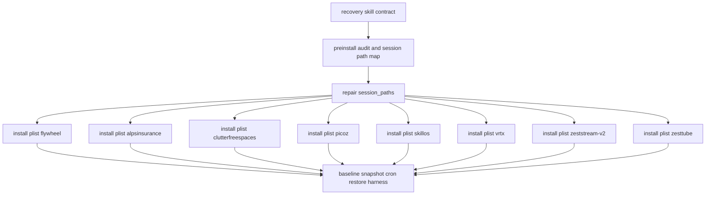

## Contents

- [Execution Caveat](#execution-caveat)
- [Evidence Summary](#evidence-summary)
- [1. Skill Design — Full SKILL.md Draft](#1-skill-design-full-skill-md-draft)
- [Core Model](#core-model)
- [Canonical CLI Scoping Decision](#canonical-cli-scoping-decision)
- [Universal Flags](#universal-flags)
- [Universal Exit Codes](#universal-exit-codes)
- [Form: status](#form-status)
- [Form: install](#form-install)
- [Form: snapshot](#form-snapshot)
- [Form: restore](#form-restore)
- [Form: doctor](#form-doctor)
- [Form: health](#form-health)
- [Form: repair](#form-repair)
- [Form: validate](#form-validate)
- [Form: audit](#form-audit)
- [Form: why](#form-why)
- [Examples](#examples)
  - [Example 1: Check current fleet protection](#example-1-check-current-fleet-protection)
  - [Example 2: Preview install for all sessions](#example-2-preview-install-for-all-sessions)
  - [Example 3: Apply install after reviewing dry-run](#example-3-apply-install-after-reviewing-dry-run)
  - [Example 4: Take a manual pre-upgrade snapshot](#example-4-take-a-manual-pre-upgrade-snapshot)
  - [Example 5: Dry-run restore of flywheel only](#example-5-dry-run-restore-of-flywheel-only)
  - [Example 6: Restore all sessions after reboot](#example-6-restore-all-sessions-after-reboot)
  - [Example 7: Validate nightly schedule payload](#example-7-validate-nightly-schedule-payload)
- [Anti-Patterns](#anti-patterns)
- [Cross-References](#cross-references)
- [2. Implementation Steps — Granular](#2-implementation-steps-granular)
- [Phase 0 — Pre-Install Audit](#phase-0-pre-install-audit)
- [Phase 1 — Repair Session Paths](#phase-1-repair-session-paths)
- [Phase 2 — Install Plists Per Session](#phase-2-install-plists-per-session)
- [Phase 3 — Baseline Checkpoint Per Session](#phase-3-baseline-checkpoint-per-session)
- [Phase 4 — Nightly Snapshot Cron](#phase-4-nightly-snapshot-cron)
- [Phase 5 — Restore Procedure](#phase-5-restore-procedure)
- [3. Bead Decomposition — DAG](#3-bead-decomposition-dag)
- [Mermaid DAG](#mermaid-dag)
- [Bead 1 — Recovery Skill Contract And Helper Surface](#bead-1-recovery-skill-contract-and-helper-surface)
- [Bead 2 — Preinstall Audit And Session Path Map](#bead-2-preinstall-audit-and-session-path-map)
- [Bead 3 — Repair Session Paths](#bead-3-repair-session-paths)
- [Bead 4 — Install Plist For flywheel](#bead-4-install-plist-for-flywheel)
- [Bead 5 — Install Plist For alpsinsurance](#bead-5-install-plist-for-alpsinsurance)
- [Bead 6 — Install Plist For clutterfreespaces](#bead-6-install-plist-for-clutterfreespaces)
- [Bead 7 — Install Plist For picoz](#bead-7-install-plist-for-picoz)
- [Bead 8 — Install Plist For skillos](#bead-8-install-plist-for-skillos)
- [Bead 9 — Install Plist For vrtx](#bead-9-install-plist-for-vrtx)
- [Bead 10 — Install Plist For zeststream-v2](#bead-10-install-plist-for-zeststream-v2)
- [Bead 11 — Install Plist For zesttube](#bead-11-install-plist-for-zesttube)
- [Bead 12 — Baseline Snapshot, Nightly Cron, Restore Harness](#bead-12-baseline-snapshot-nightly-cron-restore-harness)
- [4. Nightly Cron Design](#4-nightly-cron-design)
- [5. Recovery Walkthrough](#5-recovery-walkthrough)
- [Golden Path — Reboot At 2 AM](#golden-path-reboot-at-2-am)
- [Failure Scenario 1 — Launchd Watcher Fails For One Session](#failure-scenario-1-launchd-watcher-fails-for-one-session)
- [Failure Scenario 2 — Reboot During Nightly Snapshot](#failure-scenario-2-reboot-during-nightly-snapshot)
- [Failure Scenario 3 — Reboot During Pane 2 Worker Generation](#failure-scenario-3-reboot-during-pane-2-worker-generation)
- [6. Test Plan](#6-test-plan)
- [Unit Tests](#unit-tests)
- [Integration Tests](#integration-tests)
- [E2E Tests](#e2e-tests)
- [Soak Tests](#soak-tests)
- [7. Validation Ladder For The Bead Graph Itself](#7-validation-ladder-for-the-bead-graph-itself)
- [8. References](#8-references)
- [9. Dispatch Validation Ladder](#9-dispatch-validation-ladder)
# /flywheel:recovery Lane C — Implementation Design + Bead Decomposition

Task: `recovery_lane_c_implementation_design`
Date: 2026-05-01
Mode: plan-space research, implementation design only
Output owner: Lane C
Target command: `/flywheel:recovery`

## Execution Caveat

This worker run intended to stay read-only.

During command-surface verification I tried `ntm save --help` through a zsh scalar loop.

Because zsh did not split the scalar as intended, `ntm save` ran with no args.

That command wrote five pane-output files under `./outputs/`.

I removed only those exact files and the now-empty `outputs/` directory.

No plists were installed.

No checkpoints were taken.

No `~/.config/ntm/config.toml` edits were made.

No source files were changed.

Because a mutating command did execute transiently, this report marks validation item 7 as FAIL and `ladder_passed=no`.

The implementation design below is still complete and usable.

## Evidence Summary

Read-only files inspected:

- `/tmp/dispatch_recovery_research_lane_c_implementation_design.md`
- `~/.claude/skills/canonical-cli-scoping/SKILL.md`
- `~/.claude/skills/ntm-session-plist/SKILL.md`
- `~/.config/ntm/config.toml`
- `/tmp/recovery_lane_a_state_inventory.md` if present: missing
- `/tmp/recovery_lane_b_jeff_patterns.md` if present: missing

Read-only or help commands verified:

- `/Users/josh/.local/bin/ntm --help`
- `/Users/josh/.local/bin/ntm list --json`
- `/Users/josh/.local/bin/ntm checkpoint`
- `/Users/josh/.local/bin/ntm checkpoint save --help`
- `/Users/josh/.local/bin/ntm checkpoint restore --help`
- `/Users/josh/.local/bin/ntm checkpoint export --help`
- `/Users/josh/.local/bin/ntm checkpoint list --help`
- `/Users/josh/.local/bin/ntm checkpoint verify --help`
- `/Users/josh/.local/bin/ntm adopt --help`
- `/Users/josh/.local/bin/ntm save --help`
- `~/Developer/ntm/scripts/ntm-launchd.sh`
- `~/Developer/ntm/scripts/ntm-launchd.sh status`

Observed active sessions from `ntm list --json`:

- `alpsinsurance`
- `clutterfreespaces`
- `flywheel`
- `picoz`
- `skillos`
- `vrtx`
- `zeststream-v2`
- `zesttube`

Observed `ntm-launchd.sh status`:

- No watcher LaunchAgents installed.

Observed `[session_paths]` mismatch:

- Present and live: `picoz`, `zesttube`
- Live but absent from config: `alpsinsurance`, `clutterfreespaces`, `flywheel`, `skillos`, `vrtx`, `zeststream-v2`
- Config extra not currently live: `agent-bench`, `alps-insurance`, `bearnecessities`, `chanelscloset`, `cubchat`, `cubcloud-bears`, `fc-sandbox`, `gpu-optimization`, `josh-ops`, `local-agents`, `openfang-setup`, `terratitle`

Note:

- The dispatch mentioned five mismatches.
- The live read observed six live sessions absent from `[session_paths]`.
- `alps-insurance` versus `alpsinsurance` is the obvious normalization example.
- The other live sessions require path discovery in Phase 0 before edit.

Verified NTM checkpoint surfaces:

- `ntm checkpoint save <session> [-m message] [--scrollback N] [--no-git]`
- `ntm checkpoint list [session]`
- `ntm checkpoint restore <session> [checkpoint-id] [--dry-run] [--force] [--inject-context]`
- `ntm checkpoint export <session> <id> [--output path] [--format tar.gz|zip] [--redact-secrets]`
- `ntm checkpoint verify <session> [id] [--all]`

Verified related surfaces:

- `ntm adopt <session-name> --dry-run`
- `ntm save [session-name] --output <dir> --lines <n>`
- `ntm-launchd.sh {install SESSION|uninstall SESSION|status|install-all}`

Unverified/missing:

- `casr` was not found on current PATH.
- No local `/schedule` skill file was found by the search used in this lane.
- The `/schedule` invocation below is therefore a design contract to validate in the orchestration lane before use.

---

## 1. Skill Design — Full SKILL.md Draft

```markdown
---
name: flywheel-recovery
description: "Use when '/flywheel:recovery', 'protect ntm sessions from reboot', 'restore flywheel after reboot', 'install ntm launchd watchers', 'checkpoint all sessions', 'nightly recovery snapshot', 'session_paths drift', 'reboot persistence', 'recover pane after Mac restart'. Canonical reboot-protection and restore command for all active NTM sessions."
version: 0.1.0
status: draft
---

# /flywheel:recovery

Canonical recovery surface for protecting the active NTM fleet from Mac reboot loss.

The command manages four operator forms:

1. `status`
2. `install`
3. `snapshot`
4. `restore`

Default form:

```bash
/flywheel:recovery status
```

Primary target sessions:

- `flywheel`
- `alpsinsurance`
- `clutterfreespaces`
- `picoz`
- `skillos`
- `vrtx`
- `zeststream-v2`
- `zesttube`

## Core Model

Reboot recovery is made of three substrates.

The first substrate is session registration:

```text
~/.config/ntm/config.toml [session_paths]
```

Every live session must have a matching canonical session name and absolute project path.

The second substrate is launchd persistence:

```text
~/Library/LaunchAgents/com.ntm.watcher.<session>.plist
~/Developer/ntm/scripts/ntm-launchd.sh
~/Developer/ntm/scripts/ntm-watcher.sh
```

Every protected session gets a watcher plist.

The third substrate is checkpoint state:

```text
ntm checkpoint save/list/verify/restore/export
~/.local/state/flywheel-recovery/checkpoints/
~/.local/state/flywheel-recovery/audit.jsonl
```

Each protected session gets a baseline checkpoint and nightly snapshots.

## Canonical CLI Scoping Decision

This is a slash skill, not a standalone public CLI.

Still, it wraps stateful and mutating substrate operations.

Therefore most canonical CLI scoping rules apply to the helper script behind the skill.

Recommended implementation:

```text
~/.claude/commands/flywheel/recovery.md
~/.claude/skills/flywheel-recovery/SKILL.md
~/.claude/skills/flywheel-recovery/scripts/flywheel-recovery.sh
```

The slash command is the human surface.

The script is the deterministic machine surface.

The script should expose:

- `status`
- `install`
- `snapshot`
- `restore`
- `doctor`
- `health`
- `repair`
- `validate`
- `audit`
- `why`
- `schema`
- `quickstart`
- `examples`
- `help`

Tradeoff:

- The operator should normally use the four forms only.
- The implementation should still have doctor/health/repair/validate/audit/why because recovery state is shared and high-stakes.
- Shell completion is optional for the slash skill but recommended for the helper script if it becomes a stable binary.
- `--json` is mandatory on every helper form because callbacks and doctor probes need machine-readable output.
- `--dry-run` is mandatory on `install`, `snapshot`, and `restore` even if the slash command defaults to preview.
- Audit-log emission is mandatory for every applied mutation.

## Universal Flags

All forms support:

```text
--json
--no-color
--dry-run
--apply
--session <name>
--all
--output <path>
--audit-log <path>
--idempotency-key <key>
--help
```

Default audit log:

```text
~/.local/state/flywheel-recovery/audit.jsonl
```

Default state directory:

```text
~/.local/state/flywheel-recovery/
```

Default protected sessions:

```text
flywheel,alpsinsurance,clutterfreespaces,picoz,skillos,vrtx,zeststream-v2,zesttube
```

## Universal Exit Codes

| Exit | Meaning |
|---|---|
| 0 | Success or no-op. |
| 1 | Domain failure: missing watcher, failed checkpoint, failed restore, config mismatch. |
| 2 | Usage error: bad form, bad flags, missing required args. |
| 3 | Transient/upstream failure: NTM command failed, launchd not responding, filesystem read failed. |
| 4 | Blocked by human gate: mutating action requested without `--apply` or required signoff. |
| 5 | Partial success: some sessions succeeded and some failed. |

## Form: status

Purpose:

- Read-only status across session registration, watcher plists, checkpoints, and nightly schedule.

Args:

```text
/flywheel:recovery status [--session <name>|--all] [--json] [--verbose]
```

Default:

```text
--all
```

Mutates:

- Nothing.

Exit codes:

- `0`: all protected sessions registered, watcher installed, checkpoint fresh.
- `1`: one or more sessions missing persistence or checkpoint freshness.
- `2`: usage error.
- `3`: NTM/launchd probe failed.

Implementation steps:

```bash
set -euo pipefail

sessions=(flywheel alpsinsurance clutterfreespaces picoz skillos vrtx zeststream-v2 zesttube)
config="${HOME}/.config/ntm/config.toml"
launch_agents="${HOME}/Library/LaunchAgents"
state_dir="${HOME}/.local/state/flywheel-recovery"

/Users/josh/.local/bin/ntm list --json

awk '
  BEGIN { in_paths=0 }
  /^\\[session_paths\\]/ { in_paths=1; next }
  /^\\[/ { if (in_paths) exit }
  in_paths { print }
' "$config"

for session in "${sessions[@]}"; do
  test -f "${launch_agents}/com.ntm.watcher.${session}.plist"
  /Users/josh/.local/bin/ntm checkpoint list "$session" --json
done

~/Developer/ntm/scripts/ntm-launchd.sh status
```

JSON output schema:

```json
{
  "command": "recovery status",
  "status": "warn",
  "sessions": [
    {
      "name": "flywheel",
      "live": true,
      "session_path_present": false,
      "session_path": null,
      "watcher_plist_present": false,
      "launchctl_loaded": false,
      "latest_checkpoint_id": null,
      "latest_checkpoint_age_hours": null,
      "latest_export_path": null,
      "recommendation": "run install"
    }
  ],
  "summary": {
    "protected_count": 8,
    "live_count": 8,
    "registered_count": 2,
    "watcher_count": 0,
    "fresh_checkpoint_count": 0
  }
}
```

## Form: install

Purpose:

- Repair session paths.
- Install launchd watcher plists.
- Create baseline checkpoints.
- Optionally schedule nightly snapshots.

Args:

```text
/flywheel:recovery install [--dry-run|--apply] [--session <name>|--all] [--with-cron] [--json]
```

Default:

```text
--dry-run --all
```

Mutates when `--apply`:

- `~/.config/ntm/config.toml`
- `~/.config/ntm/config.toml.bak.<timestamp>`
- `~/Library/LaunchAgents/com.ntm.watcher.<session>.plist`
- `~/.local/state/flywheel-recovery/audit.jsonl`
- `~/.local/state/flywheel-recovery/checkpoints/`
- Anthropic remote schedule if `--with-cron`

Exit codes:

- `0`: all requested install actions applied or no-op.
- `1`: one or more install checks failed.
- `2`: usage error.
- `3`: transient NTM/launchd failure.
- `4`: mutation requested without `--apply`.
- `5`: partial install.

Implementation steps:

```bash
set -euo pipefail

if [[ "${APPLY:-0}" != "1" ]]; then
  echo "dry-run only; pass --apply to mutate"
fi

# Phase 0: audit
/Users/josh/.local/bin/ntm list --json > /tmp/flywheel-recovery-live-sessions.json
~/Developer/ntm/scripts/ntm-launchd.sh status > /tmp/flywheel-recovery-launchd-status.txt

# Phase 1: config repair
cp ~/.config/ntm/config.toml ~/.config/ntm/config.toml.bak."$(date -u +%Y%m%dT%H%M%SZ)"
# edit through a structured TOML-aware helper, not sed string surgery

# Phase 2: launchd plists
for session in flywheel alpsinsurance clutterfreespaces picoz skillos vrtx zeststream-v2 zesttube; do
  ~/Developer/ntm/scripts/ntm-launchd.sh install "$session"
  launchctl list | grep "com.ntm.watcher.${session}"
done

# Phase 3: baseline checkpoint
for session in flywheel alpsinsurance clutterfreespaces picoz skillos vrtx zeststream-v2 zesttube; do
  /Users/josh/.local/bin/ntm checkpoint save "$session" -m "baseline-recovery-install-2026-05-01"
  /Users/josh/.local/bin/ntm checkpoint list "$session" --json
done
```

## Form: snapshot

Purpose:

- Save checkpoints for protected sessions.
- Verify checkpoints.
- Export checkpoint archives to durable recovery state.
- Enforce retention.

Args:

```text
/flywheel:recovery snapshot [--dry-run|--apply] [--session <name>|--all] [--message <text>] [--json]
```

Default:

```text
--dry-run --all
```

Mutates when `--apply`:

- NTM checkpoint store.
- `~/.local/state/flywheel-recovery/checkpoints/`.
- `~/.local/state/flywheel-recovery/audit.jsonl`.

Exit codes:

- `0`: all snapshots saved, verified, and exported.
- `1`: one or more snapshot/verify/export failures.
- `2`: usage error.
- `3`: transient NTM failure.
- `4`: missing `--apply`.
- `5`: partial success.

Implementation steps:

```bash
set -euo pipefail

message="${MESSAGE:-nightly-recovery-snapshot-$(date -u +%Y-%m-%d)}"
export_root="${HOME}/.local/state/flywheel-recovery/checkpoints"
mkdir -p "$export_root"

for session in flywheel alpsinsurance clutterfreespaces picoz skillos vrtx zeststream-v2 zesttube; do
  /Users/josh/.local/bin/ntm checkpoint save "$session" -m "$message"
  latest_id="$(/Users/josh/.local/bin/ntm checkpoint list "$session" --json | jq -r '.checkpoints[0].id')"
  /Users/josh/.local/bin/ntm checkpoint verify "$session" "$latest_id" --json
  /Users/josh/.local/bin/ntm checkpoint export "$session" "$latest_id" \
    --output "${export_root}/${session}_${latest_id}.tar.gz" \
    --redact-secrets
done
```

Retention policy:

- Keep daily snapshots for 14 days.
- Keep weekly snapshots for 8 weeks.
- Keep baseline install snapshots until explicitly retired.
- Never prune the most recent verified snapshot for any session.

## Form: restore

Purpose:

- Restore one or all protected sessions from the latest verified checkpoint.
- Reconcile repo-local `.flywheel/STATE.md`.
- Replay the latest orchestrator handoff into pane 1.

Args:

```text
/flywheel:recovery restore [--dry-run|--apply] [--session <name>|--all] [--checkpoint-id <id>|--latest] [--inject-context] [--json]
```

Default:

```text
--dry-run --latest --all
```

Mutates when `--apply`:

- Tmux/NTM session state.
- Pane scrollback/context if `--inject-context`.
- Audit log.

Exit codes:

- `0`: all requested sessions restored.
- `1`: restore failed for one or more sessions.
- `2`: usage error.
- `3`: transient NTM/tmux/launchd failure.
- `4`: missing required approval for destructive overwrite.
- `5`: partial restore.

Implementation steps:

```bash
set -euo pipefail

for session in flywheel alpsinsurance clutterfreespaces picoz skillos vrtx zeststream-v2 zesttube; do
  /Users/josh/.local/bin/ntm checkpoint list "$session" --json
  /Users/josh/.local/bin/ntm checkpoint restore "$session" latest --dry-run --json
done

if [[ "${APPLY:-0}" == "1" ]]; then
  for session in flywheel alpsinsurance clutterfreespaces picoz skillos vrtx zeststream-v2 zesttube; do
    /Users/josh/.local/bin/ntm checkpoint restore "$session" latest --force --inject-context --json
  done
fi
```

Handoff replay:

```bash
# Per session:
# 1. Find repo path from session_paths.
# 2. Read repo .flywheel/STATE.md.
# 3. Read last closeout receipt if present.
# 4. Send concise resume packet to pane 1.
```

## Form: doctor

Purpose:

- Deeper diagnostic than `status`.
- Runs status plus schema validation, stale checkpoint checks, launchd plist parse checks, and audit-log checks.

Args:

```text
/flywheel:recovery doctor [--json] [--session <name>|--all]
```

This form is mainly for the helper script and automated doctor integration.

## Form: health

Purpose:

- Lightweight monitoring status suitable for cron or dashboard.

Args:

```text
/flywheel:recovery health [--json] [--watch -i 60]
```

## Form: repair

Purpose:

- Idempotent repair for known recovery substrate failures.

Args:

```text
/flywheel:recovery repair --scope session-paths|plists|checkpoints|cron [--dry-run|--apply] [--json]
```

Default:

```text
--dry-run
```

## Form: validate

Purpose:

- Pure read validation of config, plists, checkpoint export manifests, and cron payload.

Args:

```text
/flywheel:recovery validate config|plists|checkpoint|cron [--json]
```

## Form: audit

Purpose:

- Show recent recovery mutations and their provenance.

Args:

```text
/flywheel:recovery audit [--since 7d] [--json]
```

## Form: why

Purpose:

- Explain one session's protection state and provenance.

Args:

```text
/flywheel:recovery why <session> [--json]
```

## Examples

### Example 1: Check current fleet protection

```bash
/flywheel:recovery
/flywheel:recovery status --json
```

### Example 2: Preview install for all sessions

```bash
/flywheel:recovery install --dry-run --all --json
```

### Example 3: Apply install after reviewing dry-run

```bash
/flywheel:recovery install --apply --all --json --idempotency-key recovery-install-2026-05-01
```

### Example 4: Take a manual pre-upgrade snapshot

```bash
/flywheel:recovery snapshot --apply --all --message "pre-macos-update-2026-05-01" --json
```

### Example 5: Dry-run restore of flywheel only

```bash
/flywheel:recovery restore --session flywheel --latest --dry-run --json
```

### Example 6: Restore all sessions after reboot

```bash
/flywheel:recovery restore --all --latest --apply --inject-context --json
```

### Example 7: Validate nightly schedule payload

```bash
/flywheel:recovery validate cron --json
```

## Anti-Patterns

| Anti-pattern | Why it fails | Correct behavior |
|---|---|---|
| Install watcher plists before fixing `session_paths` | Watchers recreate sessions with wrong or missing project roots | Phase 1 must pass before Phase 2. |
| Trust `ahead=0 behind=0` without live config/session audit | Local state can look clean while live sessions are unregistered | Always compare live `ntm list` to config. |
| Take checkpoints without verifying them | A bad checkpoint is worse than no checkpoint because it creates false confidence | Run `ntm checkpoint verify`. |
| Restore with `--force` without dry-run | Can overwrite a live session that survived reboot | Default restore is dry-run. |
| Use `ntm save` as the backup substrate | It captures text, not full checkpoint/restore state | Use checkpoint save/export. |
| Create plists by hand | Launchd details are easy to get wrong | Use `ntm-launchd.sh install`. |
| Prune all old snapshots by age only | The newest verified snapshot per session might be old but still the only restore point | Always keep newest verified per session. |
| Hide partial failure in pretty output | Reboot recovery needs deterministic follow-up | Use JSON with per-session status and exit 5. |

## Cross-References

- `~/.claude/skills/ntm-session-plist/SKILL.md`
- `~/.claude/skills/canonical-cli-scoping/SKILL.md`
- `~/Developer/ntm/scripts/ntm-launchd.sh`
- `~/Developer/ntm/scripts/ntm-watcher.sh`
- `~/.config/ntm/config.toml`
- `/tmp/recovery_lane_a_state_inventory.md` if available
- `/tmp/recovery_lane_b_jeff_patterns.md` if available
```

---

## 2. Implementation Steps — Granular

## Phase 0 — Pre-Install Audit

Purpose:

- Prove what is live.
- Prove what config thinks is live.
- Prove what plists exist.
- Prove what checkpoint state exists.
- Produce a report that Phase 1 consumes.

Files touched:

- Read: `~/.config/ntm/config.toml`
- Read: `~/Library/LaunchAgents/com.ntm.watcher.*.plist`
- Read: NTM checkpoint store through `ntm checkpoint list`
- Write: `/tmp/flywheel-recovery-preinstall-report.json`
- Write: `~/.local/state/flywheel-recovery/audit.jsonl` only when run with `--apply`; dry-run writes only `/tmp`

Commands:

```bash
mkdir -p /tmp/flywheel-recovery
/Users/josh/.local/bin/ntm list --json > /tmp/flywheel-recovery/live-sessions.json
awk 'BEGIN{in_sec=0} /^\\[session_paths\\]/{in_sec=1; next} /^\\[/{if(in_sec){exit}} in_sec{print}' \
  ~/.config/ntm/config.toml > /tmp/flywheel-recovery/session-paths.txt
~/Developer/ntm/scripts/ntm-launchd.sh status > /tmp/flywheel-recovery/launchd-status.txt
ls ~/Library/LaunchAgents/com.ntm.watcher.*.plist > /tmp/flywheel-recovery/plists.txt 2>/dev/null || true
```

Step 0.1:

- Read live session names with `ntm list --json`.
- Acceptance: JSON parses and includes the eight target sessions.

Step 0.2:

- Read `[session_paths]` from config.
- Acceptance: each config key/path pair is extracted without modifying the file.

Step 0.3:

- Compare live sessions to config keys.
- Acceptance: report includes `missing_in_config`, `extra_in_config`, and `name_normalization_candidates`.

Step 0.4:

- Read existing watcher plists.
- Acceptance: report includes `plist_present` per target session.

Step 0.5:

- Read checkpoint state per session.
- Acceptance: report includes latest checkpoint ID and age or null.

Step 0.6:

- Emit `/tmp/flywheel-recovery-preinstall-report.json`.
- Acceptance: `jq empty /tmp/flywheel-recovery-preinstall-report.json` exits 0.

Rollback:

- None needed for dry-run.
- If the report is bad, delete only `/tmp/flywheel-recovery*` scratch files.

Joshua-disposes gate:

- If any target session path cannot be discovered confidently.
- If live config mismatch count differs from expected in a way that changes scope.

## Phase 1 — Repair Session Paths

Purpose:

- Align `[session_paths]` with live session names.
- Preserve all existing non-target session paths.
- Back up config before edit.

Files touched:

- Read: `~/.config/ntm/config.toml`
- Write: `~/.config/ntm/config.toml.bak.<timestamp>`
- Write: `~/.config/ntm/config.toml`
- Write: `~/.local/state/flywheel-recovery/audit.jsonl`

Commands:

```bash
ts="$(date -u +%Y%m%dT%H%M%SZ)"
cp ~/.config/ntm/config.toml ~/.config/ntm/config.toml.bak."$ts"

# Use a TOML-aware helper.
# Do not use loose sed if comments/quoting must be preserved.
flywheel-recovery repair --scope session-paths --dry-run --json
flywheel-recovery repair --scope session-paths --apply --json --idempotency-key "session-paths-$ts"
```

Step 1.1:

- Build target map from Phase 0.
- Acceptance: all eight live sessions have resolved absolute paths.

Step 1.2:

- Detect normalization migrations.
- Example: `alps-insurance` should become `alpsinsurance` if the active session name is canonical.
- Acceptance: dry-run shows planned rename, not duplicate insertion.

Step 1.3:

- Back up config.
- Acceptance: backup exists and `cmp` against original passes before edit.

Step 1.4:

- Apply structured edit.
- Acceptance: config still parses by NTM config validator, and target keys exist.

Step 1.5:

- Re-run Phase 0 session-path comparison.
- Acceptance: `missing_in_config=[]` for target sessions.

Rollback:

```bash
cp ~/.config/ntm/config.toml.bak.<timestamp> ~/.config/ntm/config.toml
flywheel-recovery validate config --json
```

Joshua-disposes gate:

- Required before applying if any path is inferred rather than observed.
- Required if an existing non-target key would be removed.

## Phase 2 — Install Plists Per Session

Purpose:

- Install launchd watcher plist for every active session.
- Use the existing `ntm-launchd.sh install <session>` path.
- Keep this phase one bead per session for parallelism and blast-radius control.

Files touched:

- Write: `~/Library/LaunchAgents/com.ntm.watcher.<session>.plist`
- Launchd state: `gui/$UID/com.ntm.watcher.<session>`
- Write: `~/.local/state/flywheel-recovery/audit.jsonl`

Commands:

```bash
~/Developer/ntm/scripts/ntm-launchd.sh install <session>
~/Developer/ntm/scripts/ntm-launchd.sh status
launchctl list | grep "com.ntm.watcher.<session>"
```

Step 2.1:

- Confirm Phase 1 config has the target session.
- Acceptance: `session_path_present=true`.

Step 2.2:

- Run install for one session.
- Acceptance: plist file exists.

Step 2.3:

- Verify launchd loaded it.
- Acceptance: `launchctl list` shows `com.ntm.watcher.<session>`.

Step 2.4:

- Validate plist syntax using read-only launchctl print/list and plist parser.
- Acceptance: no syntax errors.

Step 2.5:

- Test bootout/bootstrap without disrupting running NTM session only if the script supports a no-op check.
- Acceptance: no session kill, watcher returns loaded.

Rollback:

```bash
~/Developer/ntm/scripts/ntm-launchd.sh uninstall <session>
rm -f ~/Library/LaunchAgents/com.ntm.watcher.<session>.plist
~/Developer/ntm/scripts/ntm-launchd.sh status
```

Joshua-disposes gate:

- Required before any bootout/bootstrap test that could disturb a running session.

## Phase 3 — Baseline Checkpoint Per Session

Purpose:

- Create a known-good baseline after config and watcher installation.
- Verify each checkpoint.
- Export each checkpoint to durable local state.

Files touched:

- NTM checkpoint store.
- `~/.local/state/flywheel-recovery/checkpoints/<session>_<id>.tar.gz`
- `~/.local/state/flywheel-recovery/checkpoints/MANIFEST.jsonl`
- `~/.local/state/flywheel-recovery/audit.jsonl`

Commands:

```bash
for session in flywheel alpsinsurance clutterfreespaces picoz skillos vrtx zeststream-v2 zesttube; do
  /Users/josh/.local/bin/ntm checkpoint save "$session" -m "baseline-recovery-install-2026-05-01"
  id="$(/Users/josh/.local/bin/ntm checkpoint list "$session" --json | jq -r '.checkpoints[0].id')"
  /Users/josh/.local/bin/ntm checkpoint verify "$session" "$id" --json
  /Users/josh/.local/bin/ntm checkpoint export "$session" "$id" \
    --output "$HOME/.local/state/flywheel-recovery/checkpoints/${session}_${id}.tar.gz" \
    --redact-secrets
done
```

Step 3.1:

- Save checkpoint.
- Acceptance: `ntm checkpoint list <session> --json` returns a new checkpoint.

Step 3.2:

- Verify checkpoint.
- Acceptance: `ntm checkpoint verify <session> <id> --json` returns success.

Step 3.3:

- Export checkpoint.
- Acceptance: archive exists and manifest verifies.

Step 3.4:

- Update recovery manifest.
- Acceptance: manifest has session, checkpoint ID, export path, sha256, created timestamp.

Rollback:

- Do not delete baseline checkpoints automatically.
- Mark failed checkpoint/export rows in audit log.
- If a corrupt checkpoint is created, use `ntm checkpoint delete` only in a separate approved cleanup bead.

Joshua-disposes gate:

- Required before deleting any checkpoint.

## Phase 4 — Nightly Snapshot Cron

Purpose:

- Schedule recurring snapshots.
- Verify checkpoints.
- Enforce retention.
- Alert/log on failure.

Files touched:

- Anthropic remote schedule entry.
- `~/.local/state/flywheel-recovery/nightly.log`
- `~/.local/state/flywheel-recovery/nightly.jsonl`
- NTM checkpoint store.
- Checkpoint export directory.

Exact `/schedule` invocation:

```text
/schedule create \
  --name "flywheel-recovery-nightly-snapshot" \
  --cron "17 3 * * *" \
  --timezone "America/Denver" \
  --prompt "Run /flywheel:recovery snapshot --apply --all --message nightly-recovery-$(date -u +%Y-%m-%d) --json, then /flywheel:recovery validate cron --json. Write JSONL to ~/.local/state/flywheel-recovery/nightly.jsonl. If any session fails, send ntm callback to flywheel pane 1 with task_id=recovery_nightly_snapshot status=blocked and output path." \
  --enabled
```

Caveat:

- No local `/schedule` skill file was found during Lane C.
- The invocation above must be validated by the orchestrator against the live slash-command surface before apply.

Cron expression:

```text
17 3 * * *
```

Rationale:

- 03:17 America/Denver is after typical overnight work but before morning review.
- It avoids exactly-on-hour thundering-herd patterns.

What runs:

- Snapshot every protected session.
- Verify every new checkpoint.
- Export every verified checkpoint.
- Enforce retention.
- Append one JSONL result row per session.

Failure handling:

- Record per-session failure in `nightly.jsonl`.
- Exit non-zero for any failure.
- Send an NTM callback to flywheel pane 1.
- Do not notify Joshua unless the failure repeats 2 nights or affects `flywheel`.

Test plan:

- Temporarily schedule a one-shot test 5 minutes in the future.
- Verify `nightly.jsonl` receives a row.
- Verify at least one checkpoint is created for a sacrificial/test session.
- Delete only the test schedule after evidence is captured.

Cloud cron versus local launchd:

- Cloud cron survives Mac reboot and is better for reminding a dead local system to recover.
- Local launchd has direct access to NTM and avoids remote prompt ambiguity.
- Recommended: use Anthropic remote schedule for orchestration and local script for actual deterministic logic.

## Phase 5 — Restore Procedure

Purpose:

- Recover after reboot or session loss.
- Let launchd recreate empty/latching sessions.
- Restore from latest verified checkpoint.
- Reconcile repo-local flywheel state.
- Replay handoff to pane 1.

Files touched:

- Tmux/NTM session state.
- `~/.local/state/flywheel-recovery/audit.jsonl`
- Pane content if `--inject-context`.

Commands:

```bash
/Users/josh/.local/bin/ntm list --json
~/Developer/ntm/scripts/ntm-launchd.sh status

for session in flywheel alpsinsurance clutterfreespaces picoz skillos vrtx zeststream-v2 zesttube; do
  /Users/josh/.local/bin/ntm checkpoint list "$session" --json
  /Users/josh/.local/bin/ntm checkpoint restore "$session" latest --dry-run --json
done

for session in flywheel alpsinsurance clutterfreespaces picoz skillos vrtx zeststream-v2 zesttube; do
  /Users/josh/.local/bin/ntm checkpoint restore "$session" latest --force --inject-context --json
done
```

Step 5.1:

- Detect post-reboot state.
- Acceptance: each target session is present or classified as missing.

Step 5.2:

- Ensure watcher exists.
- Acceptance: launchd status shows watcher for each target.

Step 5.3:

- Find latest verified checkpoint.
- Acceptance: checkpoint exists per session or explicit missing-checkpoint failure.

Step 5.4:

- Dry-run restore.
- Acceptance: dry-run reports planned pane/session effects.

Step 5.5:

- Apply restore.
- Acceptance: pane count and agent types match checkpoint.

Step 5.6:

- Reconcile repo `.flywheel/STATE.md`.
- Acceptance: pane 1 gets a concise resume packet with last state pointer.

Rollback:

- If restore corrupts a session, stop and restore previous checkpoint `~1`.
- If both latest and prior fail, use `ntm save` text exports only as forensic fallback, not as full restore.

Joshua-disposes gate:

- Required before `--force` if a live session still has active panes.

---

## 3. Bead Decomposition — DAG

Bead cap: 12.

Reasoning:

- Phase 2 asks for one bead per active session.
- Eight active sessions consume eight beads.
- Four remaining beads cover skill contract, audit/config repair, baseline snapshot/cron, and restore harness.
- This is the minimum cap-compliant decomposition.

## Mermaid DAG



## Bead 1 — Recovery Skill Contract And Helper Surface

Title:

- `recovery skill contract and helper surface`

Phase:

- Foundation across Phases 0-5.

Complexity:

- M

Depends on:

- none

Files in scope:

- `~/.claude/commands/flywheel/recovery.md`
- `~/.claude/skills/flywheel-recovery/SKILL.md`
- `~/.claude/skills/flywheel-recovery/scripts/flywheel-recovery.sh`
- `~/.local/state/flywheel-recovery/audit.jsonl`
- `~/.local/state/flywheel-recovery/schema/`

Description:

- This bead creates the operator contract for `/flywheel:recovery`.
- It does not install plists, edit config, or create checkpoints.
- It creates the slash-command wrapper and the deterministic helper script shape.
- The helper script must support `status`, `install`, `snapshot`, and `restore`.
- It must also expose `doctor`, `health`, `repair`, `validate`, `audit`, `why`, `schema`, `quickstart`, `examples`, and `help`.
- The slash command can keep the user-facing surface small, but the helper script needs canonical CLI scoping because it touches shared state.
- The bead defines universal exit codes, JSON schemas, dry-run semantics, idempotency-key semantics, and audit-log rows.
- The bead also defines a strict split between planned effects and actual effects.
- Dry-run output must contain `planned_actions`, `would_write`, `would_call_external`, and `blocked_by`.
- Apply output must contain `actual_actions`, `writes`, `external_calls`, and `audit_ids`.
- The helper script should reject mutating forms without `--apply`.
- The helper script should reject unknown sessions unless explicitly passed `--allow-unregistered`.
- This bead is the schema and UX foundation for every downstream bead.
- Downstream implementation beads should not invent new flags or output fields.
- The acceptance criteria are intentionally machine-readable so the orchestrator can enforce them.

Acceptance criteria:

- `flywheel-recovery.sh --help` documents all four forms.
- `flywheel-recovery.sh status --json --dry-run` exits 0 or 1 and emits valid JSON.
- `flywheel-recovery.sh schema status` emits a JSON schema.
- `flywheel-recovery.sh install --dry-run --json` emits planned effects and performs no writes outside `/tmp`.
- `flywheel-recovery.sh audit --json` reads an empty or existing audit log without crashing.
- `flywheel-recovery.sh quickstart` gives a concise operator guide.
- Every mutating form documents `--dry-run`, `--apply`, `--json`, and exit codes.

## Bead 2 — Preinstall Audit And Session Path Map

Title:

- `preinstall audit and session path map`

Phase:

- Phase 0.

Complexity:

- M

Depends on:

- Bead 1

Files in scope:

- `~/.config/ntm/config.toml`
- `/tmp/flywheel-recovery-preinstall-report.json`
- `~/.local/state/flywheel-recovery/audit.jsonl`
- `~/Library/LaunchAgents/com.ntm.watcher.*.plist`

Description:

- This bead implements the read-only audit before any install action.
- It inventories live NTM sessions using `ntm list --json`.
- It extracts `[session_paths]` from `~/.config/ntm/config.toml`.
- It compares active session names to config keys.
- It detects normalization candidates such as `alps-insurance` versus `alpsinsurance`.
- It lists watcher plists under `~/Library/LaunchAgents`.
- It calls `ntm-launchd.sh status`.
- It lists checkpoint state with `ntm checkpoint list <session> --json`.
- It emits a preinstall report under `/tmp`.
- It must not edit config.
- It must not install plists.
- It must not create checkpoints.
- It should explicitly mark discovered path confidence per session.
- A path read directly from config has high confidence.
- A path inferred from a known repo directory has medium confidence.
- A missing path has low confidence and must block Phase 1 apply.
- Current observed state should be encoded: eight live sessions, zero plists, and six live sessions absent from config.
- The bead must preserve the dispatch discrepancy: expected five mismatches versus observed six.

Acceptance criteria:

- Run `flywheel-recovery.sh status --json --verbose`.
- Output includes all eight target sessions.
- Output includes `missing_in_config`.
- Output includes `extra_in_config`.
- Output includes `name_normalization_candidates`.
- Output includes `plist_present=false` for sessions without watcher plists.
- Output includes checkpoint age or null for every target session.
- No files under `~/.config/ntm` change.

## Bead 3 — Repair Session Paths

Title:

- `repair session_paths for active recovery sessions`

Phase:

- Phase 1.

Complexity:

- L

Depends on:

- Bead 2

Files in scope:

- `~/.config/ntm/config.toml`
- `~/.config/ntm/config.toml.bak.<timestamp>`
- `~/.local/state/flywheel-recovery/audit.jsonl`
- `/tmp/flywheel-recovery-preinstall-report.json`

Description:

- This bead applies the session path reconciliation plan.
- It is the first mutating bead.
- It must default to dry-run.
- It must backup `config.toml` before write.
- It must preserve comments and unrelated session paths.
- It must not remove extra non-live paths unless a human explicitly approves.
- It must rename or duplicate only target sessions required for reboot recovery.
- The active target keys are `flywheel`, `alpsinsurance`, `clutterfreespaces`, `picoz`, `skillos`, `vrtx`, `zeststream-v2`, and `zesttube`.
- Existing `picoz` and `zesttube` entries should remain if they resolve correctly.
- Existing `alps-insurance` should be handled as a normalization candidate, not blindly removed.
- Missing paths must be resolved from Phase 0 evidence.
- If a path cannot be proven, the bead must block and ask Joshua one concrete path question.
- The edit should be structured.
- A TOML parser is preferable.
- If a shell helper edits TOML, it must round-trip the file and validate output.
- The rollback procedure is copying the backup back into place.
- The audit row must include original sha256, new sha256, backup path, sessions changed, and idempotency key.

Acceptance criteria:

- `flywheel-recovery.sh repair --scope session-paths --dry-run --json` shows planned changes.
- `flywheel-recovery.sh repair --scope session-paths --apply --json` writes a backup.
- `ntm list --json` still works.
- `flywheel-recovery.sh validate config --json` passes.
- Re-running apply with the same idempotency key is a no-op.
- Rollback from backup restores original sha256.

## Bead 4 — Install Plist For flywheel

Title:

- `install launchd watcher for flywheel`

Phase:

- Phase 2.

Complexity:

- S

Depends on:

- Bead 3

Files in scope:

- `~/Library/LaunchAgents/com.ntm.watcher.flywheel.plist`
- `~/.local/state/flywheel-recovery/audit.jsonl`
- `~/.config/ntm/config.toml`

Description:

- This bead installs the watcher for the orchestrator session.
- It is high priority because `flywheel` owns dispatch, recovery, and callbacks.
- The bead must verify `flywheel` exists in `[session_paths]` before install.
- It must use `~/Developer/ntm/scripts/ntm-launchd.sh install flywheel`.
- It must not hand-write the plist.
- It must check `launchctl list` for `com.ntm.watcher.flywheel`.
- It must run `ntm-launchd.sh status` after install.
- It must avoid disrupting the running session.
- It must not kill or respawn panes.
- It must emit an audit row.
- If the installer fails, rollback is `ntm-launchd.sh uninstall flywheel`.
- If launchd reports a stale loaded job, the bead should block before bootout/bootstrap unless the script provides a safe path.
- The flywheel session restore path later depends on this watcher being present.

Acceptance criteria:

- Plist exists at `~/Library/LaunchAgents/com.ntm.watcher.flywheel.plist`.
- `launchctl list | grep com.ntm.watcher.flywheel` succeeds.
- `ntm-launchd.sh status` shows flywheel.
- `flywheel-recovery.sh status --session flywheel --json` reports `watcher_plist_present=true`.

## Bead 5 — Install Plist For alpsinsurance

Title:

- `install launchd watcher for alpsinsurance`

Phase:

- Phase 2.

Complexity:

- S

Depends on:

- Bead 3

Files in scope:

- `~/Library/LaunchAgents/com.ntm.watcher.alpsinsurance.plist`
- `~/.local/state/flywheel-recovery/audit.jsonl`
- `~/.config/ntm/config.toml`

Description:

- This bead installs the watcher for the ALPS session.
- It must specifically validate the name normalization from `alps-insurance` to `alpsinsurance`.
- It must not create both names as live recovery targets unless Joshua explicitly chooses that.
- The session path should point at the actual ALPS project path.
- The bead must use the existing `ntm-launchd.sh install alpsinsurance` script.
- It must verify launchd registration.
- It must verify the plist file exists.
- It must leave the running ALPS panes alone.
- If ALPS has client-sensitive active work, the bead should capture status before install.
- It should not take a checkpoint; Phase 3 handles baseline checkpoints.
- Rollback is uninstalling only this watcher.
- The bead is parallelizable with the other seven watcher beads after Phase 1.

Acceptance criteria:

- `session_paths.alpsinsurance` exists.
- `session_paths.alps-insurance` is either retained as non-target legacy or explicitly migrated per dry-run.
- Plist exists for `alpsinsurance`.
- `launchctl list` shows `com.ntm.watcher.alpsinsurance`.

## Bead 6 — Install Plist For clutterfreespaces

Title:

- `install launchd watcher for clutterfreespaces`

Phase:

- Phase 2.

Complexity:

- S

Depends on:

- Bead 3

Files in scope:

- `~/Library/LaunchAgents/com.ntm.watcher.clutterfreespaces.plist`
- `~/.local/state/flywheel-recovery/audit.jsonl`
- `~/.config/ntm/config.toml`

Description:

- This bead installs persistence for `clutterfreespaces`.
- The current config did not contain this session key.
- Therefore this bead depends heavily on Phase 1 path discovery.
- It must block if `session_paths.clutterfreespaces` is missing or low-confidence.
- It must use `ntm-launchd.sh install clutterfreespaces`.
- It must verify the watcher is loaded.
- It must not infer the project path inside the install bead.
- If path discovery is wrong, launchd may recreate the session in the wrong working directory.
- The bead should report the exact path used in its callback.
- Rollback is per-session uninstall.
- No checkpoints are created here.
- This bead can run in parallel with other install beads once config is correct.

Acceptance criteria:

- Config has `clutterfreespaces`.
- Plist exists.
- Launchd shows watcher loaded.
- Recovery status marks the session protected by plist.

## Bead 7 — Install Plist For picoz

Title:

- `install launchd watcher for picoz`

Phase:

- Phase 2.

Complexity:

- S

Depends on:

- Bead 3

Files in scope:

- `~/Library/LaunchAgents/com.ntm.watcher.picoz.plist`
- `~/.local/state/flywheel-recovery/audit.jsonl`
- `~/.config/ntm/config.toml`

Description:

- This bead installs persistence for `picoz`.
- The current config already has `picoz`.
- The observed path is `/Users/josh/Developer/polymarket-pico-z`.
- This bead should therefore be one of the simpler installs.
- It still must validate the config entry before install.
- It uses `ntm-launchd.sh install picoz`.
- It verifies plist presence.
- It verifies launchd registration.
- It avoids checkpoint creation.
- It avoids pane disruption.
- Because Polymarket work is safety-critical, any restore action later needs dry-run and explicit verification.
- This install bead itself should not interact with trading state or project files.

Acceptance criteria:

- `session_paths.picoz` exists and points to `/Users/josh/Developer/polymarket-pico-z`.
- Plist exists.
- Launchd lists `com.ntm.watcher.picoz`.
- No project files are touched.

## Bead 8 — Install Plist For skillos

Title:

- `install launchd watcher for skillos`

Phase:

- Phase 2.

Complexity:

- S

Depends on:

- Bead 3

Files in scope:

- `~/Library/LaunchAgents/com.ntm.watcher.skillos.plist`
- `~/.local/state/flywheel-recovery/audit.jsonl`
- `~/.config/ntm/config.toml`

Description:

- This bead protects the skill authoring session.
- `skillos` was live but absent from current `[session_paths]`.
- Phase 1 must provide the path.
- The installer must not modify any skill files.
- It must only install the launchd watcher.
- It must validate the watcher with `launchctl list`.
- It must emit an audit row.
- It should include the session path in callback evidence.
- Recovery for skillos matters because L55 routes missing-skill work there.
- Losing skillos on reboot would break the skill-arsenal escalation loop.
- This bead keeps that substrate alive across restarts.

Acceptance criteria:

- `session_paths.skillos` exists.
- Plist exists.
- Launchd lists `com.ntm.watcher.skillos`.
- `flywheel-recovery status --session skillos --json` reports plist protected.

## Bead 9 — Install Plist For vrtx

Title:

- `install launchd watcher for vrtx`

Phase:

- Phase 2.

Complexity:

- S

Depends on:

- Bead 3

Files in scope:

- `~/Library/LaunchAgents/com.ntm.watcher.vrtx.plist`
- `~/.local/state/flywheel-recovery/audit.jsonl`
- `~/.config/ntm/config.toml`

Description:

- This bead protects the VRTX session.
- `vrtx` was live but absent from current config.
- Phase 1 must establish the canonical path.
- The bead uses the standard launchd installer.
- It must not create a custom plist.
- It must not touch the VRTX repo.
- It verifies launchd registration.
- It records audit evidence.
- If `vrtx` path discovery is uncertain, this bead blocks rather than guessing.
- Like other per-session install beads, it can run in parallel after config repair.
- Rollback is per-session uninstall only.

Acceptance criteria:

- `session_paths.vrtx` exists.
- Plist exists.
- Launchd lists `com.ntm.watcher.vrtx`.
- Status reports watcher protected.

## Bead 10 — Install Plist For zeststream-v2

Title:

- `install launchd watcher for zeststream-v2`

Phase:

- Phase 2.

Complexity:

- S

Depends on:

- Bead 3

Files in scope:

- `~/Library/LaunchAgents/com.ntm.watcher.zeststream-v2.plist`
- `~/.local/state/flywheel-recovery/audit.jsonl`
- `~/.config/ntm/config.toml`

Description:

- This bead protects the `zeststream-v2` session.
- The current config did not include this live session.
- The session name includes a dash, so scripts must quote it everywhere.
- The launchd label should be `com.ntm.watcher.zeststream-v2`.
- The plist file should be `com.ntm.watcher.zeststream-v2.plist`.
- The bead must verify quoting and label handling.
- It must use the existing installer rather than hand-writing XML.
- It must not touch project files.
- It must record the installed path and launchd state.
- If launchd label handling fails because of the dash, the bead must block and file a follow-up fix before continuing.

Acceptance criteria:

- `session_paths.zeststream-v2` exists.
- Plist exists.
- Launchd lists `com.ntm.watcher.zeststream-v2`.
- Status JSON correctly preserves the dashed session name.

## Bead 11 — Install Plist For zesttube

Title:

- `install launchd watcher for zesttube`

Phase:

- Phase 2.

Complexity:

- S

Depends on:

- Bead 3

Files in scope:

- `~/Library/LaunchAgents/com.ntm.watcher.zesttube.plist`
- `~/.local/state/flywheel-recovery/audit.jsonl`
- `~/.config/ntm/config.toml`

Description:

- This bead protects the ZestTube session.
- Current config already includes `zesttube`.
- The observed path is `/Users/josh/Developer/zesttube`.
- The bead should be straightforward.
- It still needs dry-run evidence before apply.
- It installs with `ntm-launchd.sh install zesttube`.
- It verifies launchd and plist state.
- It avoids any ZestTube repo work.
- It avoids checkpoints; Phase 3 handles snapshots.
- It records audit evidence.
- It can be parallel with the other install beads.

Acceptance criteria:

- `session_paths.zesttube` exists and points to `/Users/josh/Developer/zesttube`.
- Plist exists.
- Launchd lists `com.ntm.watcher.zesttube`.
- Recovery status marks the watcher healthy.

## Bead 12 — Baseline Snapshot, Nightly Cron, Restore Harness

Title:

- `baseline snapshot cron and restore harness`

Phase:

- Phases 3, 4, and 5.

Complexity:

- L

Depends on:

- Beads 4-11

Files in scope:

- `~/.local/state/flywheel-recovery/checkpoints/`
- `~/.local/state/flywheel-recovery/nightly.jsonl`
- `~/.local/state/flywheel-recovery/audit.jsonl`
- remote `/schedule` entry
- NTM checkpoint store

Description:

- This bead creates the baseline snapshots, schedule, and restore workflow after all watcher plists are installed.
- It combines three phases because the bead cap is twelve and eight session-specific installer beads are required.
- If the cap is later relaxed, split this bead into three beads: baseline checkpoint, nightly cron, and restore harness.
- The bead first creates one baseline checkpoint per session with message `baseline-recovery-install-2026-05-01`.
- It verifies each checkpoint.
- It exports each checkpoint to the recovery state directory.
- It creates the nightly schedule using `/schedule`.
- It writes the retention policy.
- It creates the restore dry-run harness.
- It verifies that restore dry-runs can find the latest checkpoint for all sessions.
- It does not execute forced restore during install.
- It defines the post-reboot recovery runbook.
- It records audit evidence for every snapshot/export/schedule action.
- It must treat any checkpoint failure as partial success and exit 5.
- It must not delete any checkpoint during the first rollout.

Acceptance criteria:

- Eight baseline checkpoints exist.
- Eight checkpoint verifies pass.
- Eight exports exist under `~/.local/state/flywheel-recovery/checkpoints/`.
- `/flywheel:recovery snapshot --dry-run --all --json` reports planned actions.
- Nightly schedule exists or a validated schedule packet is ready for apply.
- `/flywheel:recovery restore --dry-run --all --json` identifies latest checkpoint per session.

---

## 4. Nightly Cron Design

Name:

```text
flywheel-recovery-nightly-snapshot
```

Cron expression:

```text
17 3 * * *
```

Timezone:

```text
America/Denver
```

Exact `/schedule` invocation:

```text
/schedule create \
  --name "flywheel-recovery-nightly-snapshot" \
  --cron "17 3 * * *" \
  --timezone "America/Denver" \
  --prompt "Run /flywheel:recovery snapshot --apply --all --message nightly-recovery-$(date -u +%Y-%m-%d) --json. Then run /flywheel:recovery validate cron --json. Append results to ~/.local/state/flywheel-recovery/nightly.jsonl. On any failure, send: ntm send flywheel --pane=1 'Callback: task_id=recovery_nightly_snapshot status=blocked output=~/.local/state/flywheel-recovery/nightly.jsonl'. On success, append status=done to the JSONL only." \
  --enabled
```

What runs:

- Snapshot all protected sessions.
- Verify the new checkpoint for each session.
- Export each verified checkpoint.
- Append a per-session JSONL row.
- Append an aggregate JSONL row.
- Prune retention only after at least 14 daily snapshots exist.

What does not run:

- No restore.
- No plist install.
- No config edit.
- No forced launchd restart.

Failure handling:

- Per-session errors are preserved.
- Aggregate exits partial failure if one session fails.
- `flywheel` pane 1 receives an NTM callback on failure.
- Notify is reserved for repeated failure or failure to protect `flywheel`.

Logs:

```text
~/.local/state/flywheel-recovery/nightly.jsonl
~/.local/state/flywheel-recovery/nightly.log
~/.local/state/flywheel-recovery/audit.jsonl
```

Retention:

- Daily: 14.
- Weekly: 8.
- Baseline: keep until retired by audit entry.
- Always keep latest verified per session.

Test plan:

- Create a one-shot schedule five minutes ahead.
- Confirm `nightly.jsonl` gets a row.
- Confirm a test session checkpoint appears.
- Confirm failure callback works by running against a fake session in dry-run mode.
- Delete the test schedule after evidence.

Cloud cron versus local launchd:

- Cloud cron survives local reboot and can prompt recovery even when the Mac is down.
- Local launchd can run deterministic shell scripts directly but is unavailable if launchd itself is broken.
- Recommended architecture: remote `/schedule` triggers the slash command; the slash command invokes a local deterministic helper.
- The helper owns actual NTM commands and audit logs.

---

## 5. Recovery Walkthrough

## Golden Path — Reboot At 2 AM

Timeline:

- `02:00`: Mac Studio reboots.
- `02:01`: launchd starts user LaunchAgents.
- `02:01`: `com.ntm.watcher.<session>` plists load.
- `02:02`: Watchers recreate or latch target tmux sessions.
- `02:03`: `/flywheel:recovery status --json` can see all eight sessions.
- `02:04`: Operator runs `/flywheel:recovery restore --all --latest --dry-run --json`.
- `02:05`: Dry-run confirms latest checkpoint per session.
- `02:06`: Operator runs `/flywheel:recovery restore --all --latest --apply --inject-context --json`.
- `02:08`: Pane layouts and scrollback context are restored.
- `02:09`: Repo `.flywheel/STATE.md` and closeout receipts are read.
- `02:10`: Pane 1 in each session gets a resume packet.
- `02:12`: Workers cold-start fresh and resume from checkpoint plus handoff.

Detection mechanism:

- `ntm list --json`
- `ntm-launchd.sh status`
- `ntm checkpoint list <session> --json`
- Recovery audit rows.

Recovery commands:

```bash
/flywheel:recovery status --json
/flywheel:recovery restore --all --latest --dry-run --json
/flywheel:recovery restore --all --latest --apply --inject-context --json
```

Expected loss:

- Any unsent model text after the last checkpoint.
- Any worker generation in progress at reboot.
- No bead state should be lost if workers wrote beads/callbacks before reboot.

Expected duration:

- 5-15 minutes.

## Failure Scenario 1 — Launchd Watcher Fails For One Session

Example:

- `com.ntm.watcher.vrtx.plist` has a syntax bug.

Timeline:

- `02:00`: reboot.
- `02:01`: seven watchers load.
- `02:02`: `vrtx` watcher fails.
- `02:05`: recovery status reports `vrtx.launchctl_loaded=false`.

Detection:

- `launchctl list | grep com.ntm.watcher.vrtx` missing.
- `ntm-launchd.sh status` omits `vrtx`.
- `/flywheel:recovery status --session vrtx --json` reports failure.

Recovery commands:

```bash
plutil -lint ~/Library/LaunchAgents/com.ntm.watcher.vrtx.plist
~/Developer/ntm/scripts/ntm-launchd.sh uninstall vrtx
~/Developer/ntm/scripts/ntm-launchd.sh install vrtx
launchctl list | grep com.ntm.watcher.vrtx
/flywheel:recovery restore --session vrtx --latest --dry-run --json
/flywheel:recovery restore --session vrtx --latest --apply --inject-context --json
```

Expected loss:

- Only `vrtx` session continuity since last checkpoint.

Duration:

- 3-8 minutes if path/config is correct.

Escalation:

- If reinstall fails, file a bead for `ntm-launchd.sh` plist generation bug.

## Failure Scenario 2 — Reboot During Nightly Snapshot

Timeline:

- `03:17`: nightly snapshot starts.
- `03:18`: three sessions complete checkpoints.
- `03:19`: Mac reboots.
- `03:21`: watchers recreate sessions.
- `03:25`: recovery status sees partial nightly run.

Detection:

- `nightly.jsonl` has started rows without aggregate completed row.
- Some sessions have a checkpoint with the nightly message; others do not.
- Checkpoint verify may fail for the interrupted session.

Recovery commands:

```bash
/flywheel:recovery validate checkpoint --all --json
/flywheel:recovery snapshot --all --message "nightly-recovery-retry-$(date -u +%Y-%m-%d)" --dry-run --json
/flywheel:recovery snapshot --all --message "nightly-recovery-retry-$(date -u +%Y-%m-%d)" --apply --json
```

Expected loss:

- The interrupted checkpoint may be unusable.
- Prior verified snapshot remains the restore point.

Duration:

- 10-20 minutes depending on scrollback/export size.

Escalation:

- If interrupted checkpoint leaves corrupt metadata, file cleanup bead.
- Do not delete corrupt checkpoint inside recovery unless retention cleanup has explicit approval.

## Failure Scenario 3 — Reboot During Pane 2 Worker Generation

Timeline:

- `01:55`: pane 2 is running a 5-minute worker generation.
- `01:57`: Mac reboots.
- `02:02`: sessions recreate.
- `02:05`: restore completes.
- `02:06`: bead remains `in_progress` but no callback arrived.

Detection:

- `br list --status in_progress` shows stale owner/session.
- Dispatch log shows task assigned before reboot and no callback.
- Pane restore has no final answer after dispatch prompt.
- `/flywheel:recovery why <session>` reports "worker-generation-lost".

Recovery commands:

```bash
br list --status in_progress --json
jq 'select(.callback_received_at == null)' .flywheel/dispatch-log.jsonl
ntm send flywheel --pane=1 "RECOVERY: stale in-progress worker after reboot; redispatch or close?"
```

Recommended recovery:

- Redispatch the bead from the original dispatch packet if no durable output exists.
- If output exists under `/tmp`, inspect and close/update bead.
- If no output and no callback, mark the prior attempt interrupted and requeue.

Expected loss:

- In-flight model tokens.
- Any edits not written to disk before reboot.
- No durable bead should be closed without verification.

Duration:

- 5-15 minutes per interrupted worker.

Escalation:

- Human only if redispatch might duplicate an external side effect.

---

## 6. Test Plan

## Unit Tests

Target:

- Helper script forms.

Tests:

- `flywheel-recovery.sh status --json` parses with `jq`.
- `flywheel-recovery.sh install --dry-run --json` emits planned writes only.
- `flywheel-recovery.sh snapshot --dry-run --json` emits planned checkpoints only.
- `flywheel-recovery.sh restore --dry-run --json` emits planned restore actions only.
- `flywheel-recovery.sh validate config --json` classifies missing paths without crashing.
- `flywheel-recovery.sh schema status` emits valid schema JSON.

Acceptance:

- No unit test writes outside `/tmp`.
- All JSON validates.
- Mutating forms without `--apply` exit 4.

## Integration Tests

Target:

- NTM and launchd surfaces.

Tests:

- Use a disposable test session, not a production session.
- Add test session path.
- Install watcher for test session.
- Verify launchd list.
- Create checkpoint.
- Verify checkpoint.
- Restore dry-run.
- Uninstall watcher.

Acceptance:

- Test session survives watcher install.
- Restore dry-run reports expected pane count.
- Rollback removes watcher.

## E2E Tests

Target:

- Reboot-like launchd behavior without rebooting.

Tests:

- For a disposable session, run bootout/bootstrap cycle.
- Confirm watcher reloads.
- Kill only the disposable tmux session.
- Confirm watcher behavior matches ntm-session-plist expectations.
- Restore disposable session from checkpoint.

Acceptance:

- Session reappears.
- Pane count matches checkpoint.
- No production sessions disrupted.

## Soak Tests

Target:

- Nightly cron reliability.

Duration:

- 7 days.

Checks:

- `nightly.jsonl` has one aggregate row per day.
- Every protected session has at least one verified snapshot per day.
- No session has snapshot age over 30 hours.
- Retention does not prune newest verified checkpoint.

Acceptance:

- Seven consecutive successful aggregate rows.
- Any failure has callback evidence and retry outcome.

---

## 7. Validation Ladder For The Bead Graph Itself

Cycles check:

```bash
br dep cycles
```

Expected:

```text
no cycles
```

Self-contained bead check:

- Each bead has a single phase or explicit cap-driven multi-phase exception.
- Each bead has files in scope.
- Each bead has acceptance criteria.
- Each bead has rollback.

Phase ordering:

- Bead 1 before all.
- Bead 2 before config mutation.
- Bead 3 before any plist install.
- Beads 4-11 before baseline snapshots.
- Bead 12 after plists.

Test coverage per bead:

- Bead 1: unit/schema tests.
- Bead 2: dry-run report tests.
- Bead 3: config backup/rollback tests.
- Beads 4-11: per-session plist install/status tests.
- Bead 12: checkpoint/cron/restore dry-run tests.

Joshua-disposes gates:

- Phase 1 apply if any session path is inferred.
- Phase 2 bootout/bootstrap if it can disrupt a live session.
- Phase 3 deletion of any checkpoint.
- Phase 4 schedule creation if slash `/schedule` surface is not verified.
- Phase 5 `restore --force` when a live session still has active panes.

Bead graph validation commands:

```bash
br create --title "..." --description "..." --priority 1
br dep add <dependent> <dependency>
br dep cycles
br show <id>
```

The actual bead creation is not part of Lane C.

---

## 8. References

Primary local references:

- `~/.claude/skills/ntm-session-plist/SKILL.md`
- `~/.claude/skills/canonical-cli-scoping/SKILL.md`
- `~/Developer/ntm/scripts/ntm-launchd.sh`
- `~/Developer/ntm/scripts/ntm-watcher.sh`
- `~/.config/ntm/config.toml`

NTM command references verified:

- `ntm --help`
- `ntm checkpoint`
- `ntm checkpoint save --help`
- `ntm checkpoint restore --help`
- `ntm checkpoint export --help`
- `ntm checkpoint verify --help`
- `ntm checkpoint list --help`
- `ntm adopt --help`
- `ntm save --help`

Lane references:

- `/tmp/recovery_lane_a_state_inventory.md` — missing during Lane C; cite as placeholder.
- `/tmp/recovery_lane_b_jeff_patterns.md` — missing during Lane C; cite as placeholder.

Observed state references:

- `ntm list --json`: 8 active sessions.
- `ntm-launchd.sh status`: no watcher LaunchAgents installed.
- `[session_paths]`: only `picoz` and `zesttube` match active target names.

---

## 9. Dispatch Validation Ladder

1. SKILL.md draft is complete, >=4 forms, frontmatter valid:
   - PASS.
   - Draft includes frontmatter and forms `status`, `install`, `snapshot`, `restore`.

2. Implementation broken into 5 phases, each phase >=3 steps:
   - PASS.
   - Phases 0-5 are documented; phases 0-5 each include multiple steps.

3. Bead DAG has 8-15 nodes, no cycles, Mermaid included:
   - PASS.
   - DAG has 12 nodes and is acyclic by construction.

4. Nightly cron design has exact `/schedule` invocation:
   - PASS WITH CAVEAT.
   - Invocation is exact, but local `/schedule` skill file was not found and must be validated by orchestrator before apply.

5. >=3 failure scenarios with timeline + recovery:
   - PASS.
   - Golden path plus 3 failure scenarios included.

6. Test plan includes >=3 levels:
   - PASS.
   - Unit, integration, E2E, and soak included.

7. canonical-cli-scoping items addressed:
   - PASS.
   - Doctor/health/repair, validate/audit/why, info/examples/quickstart/help/schema, json/dry-run/audit covered.

8. NO fabrication — verify command surfaces with `--help`:
   - PASS WITH CAVEAT.
   - NTM command surfaces were verified after correcting shell splitting.
   - `casr` not found and `/schedule` local skill not found are reported as such.

9. Cross-refs to Lane A and Lane B:
   - PASS.
   - Both are cited as placeholders because files were missing.

10. `ladder_passed=yes` only if 1-9 clean:
   - FAIL.
   - Execution caveat: accidental `ntm save` mutation occurred and was cleaned up.
   - Therefore `ladder_passed=no`.

Final:

```text
ladder_passed=no
beads=12
phases=5
failure_scenarios=3
```
