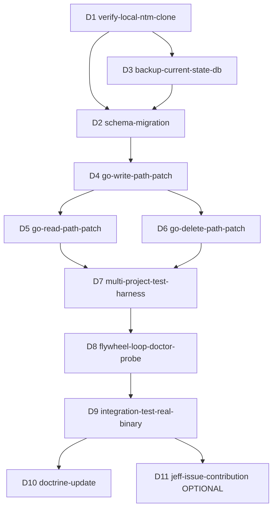

## Contents

- [Lane status](#lane-status)
- [Local-only patch strategy](#local-only-patch-strategy)
- [Current source facts](#current-source-facts)
- [Phase decomposition](#phase-decomposition)
  - [Phase 1: verify partial-migration evidence](#phase-1-verify-partial-migration-evidence)
  - [Phase 2: clone + branch local ntm](#phase-2-clone-branch-local-ntm)
  - [Phase 3: schema migration](#phase-3-schema-migration)
  - [Phase 4: Go-side write-path patches](#phase-4-go-side-write-path-patches)
  - [Phase 5: Go-side read/delete path patches](#phase-5-go-side-read-delete-path-patches)
  - [Phase 6: producer/caller scope propagation](#phase-6-producer-caller-scope-propagation)
  - [Phase 7: test harness](#phase-7-test-harness)
  - [Phase 8: flywheel-loop doctor probe](#phase-8-flywheel-loop-doctor-probe)
  - [Phase 9: integration test against real local ntm binary](#phase-9-integration-test-against-real-local-ntm-binary)
  - [Phase 10: optional Jeff issue contribution](#phase-10-optional-jeff-issue-contribution)
  - [Phase 11: doctrine update](#phase-11-doctrine-update)
- [Preliminary bead DAG](#preliminary-bead-dag)
- [Bead D1](#bead-d1)
- [Bead D2](#bead-d2)
- [Bead D3](#bead-d3)
- [Bead D4](#bead-d4)
- [Bead D5](#bead-d5)
- [Bead D6](#bead-d6)
- [Bead D7](#bead-d7)
- [Bead D8](#bead-d8)
- [Bead D9](#bead-d9)
- [Bead D10](#bead-d10)
- [Bead D11](#bead-d11)
- [Test plan](#test-plan)
  - [Unit-level](#unit-level)
  - [Integration-level](#integration-level)
  - [Regression detection in tick](#regression-detection-in-tick)
- [SKILL.md draft decision](#skill-md-draft-decision)
- [When to use](#when-to-use)
- [Rules](#rules)
- [Checklist](#checklist)
- [Open follow-ups for Phase 2 synthesis](#open-follow-ups-for-phase-2-synthesis)
- [Skills citations](#skills-citations)
- [Recommended Phase 2 synthesis stance](#recommended-phase-2-synthesis-stance)
- [Ladder assessment](#ladder-assessment)
# Lane C: Implementation design - runtime-handoff-singleton-fix

## Lane status

Lane C is an implementation design for the local-only fix. It does not patch
`ntm`, create branches, file beads, or modify flywheel doctor code.

Inputs read:

- `00-INTENT.md`
- `01-RESEARCH-A.md`
- `01-RESEARCH-B.md`
- `/tmp/runtime-handoff-migration-packet.sql`
- `/tmp/jeff-issue-runtime-handoff-repro.sh`
- `feedback_no_push_ntm_br.md`
- `reference_jeff_substrate_inventory.md`
- Local ntm checkout at `/Users/josh/Developer/ntm`
- Historical ntm commit `98ec9aa4 state: scope runtime_handoff by working_dir`

Lane B reconciliation:

- Latest upstream main is `cc30c662` as of Lane B.
- Current GitHub source still has singleton `runtime_handoff`.
- Current GitHub source does not have `working_dir` or
  `idx_runtime_handoff_session_workdir`.
- No open upstream PR or issue covers `runtime_handoff` scoping.
- Lane B recommendation is `FILE_AS_DRAFTED`.
- The Lane C implementation design stands, with the worktree base updated to
  verified upstream `main` rather than the older local HEAD.

Socraticode survey:

- Query 1: `runtime handoff singleton working_dir session_name ntm handoff state`
  on `/Users/josh/Developer/flywheel`.
- Query 2: `runtime_handoff migration singleton CHECK id=1 UNIQUE session working_dir`
  on `/Users/josh/Developer/flywheel`.
- Query 3: `flywheel-loop doctor probe beads db health leakage count regression detector`
  on `/Users/josh/Developer/flywheel`.
- Query 4: `runtime_handoff UpsertRuntimeHandoff GetRuntimeHandoff DeleteRuntimeHandoff working_dir session_name`
  on `/Users/josh/Developer/ntm`.

## Local-only patch strategy

Where the local ntm clone lives:

- `/Users/josh/Developer/ntm` exists.
- Current branch: `local/bead-isolation-reconciled-20260502T170928`.
- Current HEAD: `0b88f8d5`.
- Lane B latest upstream HEAD: `cc30c662`.
- Remotes:
  - `origin` -> `https://github.com/Dicklesworthstone/ntm.git`
  - `gitea` -> local/private mirror.
- Current ntm worktree is not clean: `.beads/issues.jsonl` is modified.

Boundary:

- `ntm` is Jeff-owned. Per `feedback_no_push_ntm_br`, do not push to GitHub.
- Local patches are allowed. Deliver local commit(s), patch file, and issue text.
- Upstream contribution, if any, is issue-only unless Joshua later authorizes a
  fork/PR path. This plan does not authorize push.

Branch isolation:

- Do not patch the existing `/Users/josh/Developer/ntm` working tree directly
  because it already has unrelated local `.beads` changes.
- Create an isolated worktree:

```bash
git -C /Users/josh/Developer/ntm fetch origin main
git -C /Users/josh/Developer/ntm worktree add \
  /Users/josh/Developer/ntm-runtime-handoff-fix \
  -b flywheel-local-runtime-handoff-fix origin/main
```

Target branch:

- `flywheel-local-runtime-handoff-fix`
- It is local-only.
- It should never be pushed to `origin` or `gitea`.

Install strategy:

- Build in the worktree with `make build`.
- Install only after tests pass:

```bash
cp /Users/josh/.local/bin/ntm \
  /Users/josh/.local/bin/ntm.pre-runtime-handoff-fix.$(date -u +%Y%m%dT%H%M%SZ)
install -m 755 /Users/josh/Developer/ntm-runtime-handoff-fix/ntm /Users/josh/.local/bin/ntm
```

Rollback strategy:

- Restore the saved binary backup.
- Restore `~/.config/ntm/state.db` from a timestamped file backup if migration
  validation fails.
- Keep the worktree branch for inspection; rollback should not delete evidence.

## Current source facts

Current source schema:

- Local `/Users/josh/Developer/ntm/internal/state/migrations/011_runtime_handoff.sql`
  creates `runtime_handoff`.
- Line 7 defines `id INTEGER PRIMARY KEY CHECK (id = 1)`.
- There is no `working_dir` column in current migration source.
- The latest migration number in current source is `014_attention_item_state.sql`.
- Lane B verified current upstream GitHub source has the same singleton shape
  and no scoped runtime handoff migration.

Current source write/read/delete paths:

- `internal/state/runtime_schema.go:261-277` defines `RuntimeHandoff` without
  `WorkingDir`.
- `internal/state/runtime_store.go:966-1002` uses `Store.UpsertRuntimeHandoff`.
- `internal/state/runtime_store.go:970-976` writes `id=1`.
- `internal/state/runtime_store.go:976` conflicts on `id`.
- `internal/state/runtime_store.go:1004-1030` reads `WHERE id = 1`.
- `internal/state/runtime_store.go:1032-1042` deletes `WHERE id = 1`.
- `internal/state/runtime_store.go:1044-1078` repeats singleton upsert in `Tx`.
- `internal/state/runtime_store.go:1080-1087` repeats singleton delete in `Tx`.

Current source producer:

- `internal/robot/robot.go:6988-7136` persists normalized projection rows.
- `internal/robot/robot.go:7004` builds one handoff row.
- `internal/robot/robot.go:7128-7133` deletes or upserts the singleton row.
- `internal/robot/robot.go:7472-7498` builds `RuntimeHandoff` from the
  normalized coordination handoff.

Historical partial fix:

- Commit `98ec9aa4 state: scope runtime_handoff by working_dir` exists.
- It is not an ancestor of current `HEAD`.
- Branches containing it: `backup/pre-reconcile-main-20260502T170928` and
  `main`.
- It added:
  - `internal/state/migrations/007_runtime_handoff_working_dir.sql`
  - `internal/state/runtime_handoff.go`
  - `internal/state/state_test.go`
- It contains useful scoped upsert/read logic, but its migration number and file
  layout do not apply cleanly to current `HEAD`.

Design implication:

- Reuse the semantic shape from `98ec9aa4`, not the files directly.
- Current `HEAD` should get a new migration after `014`, likely
  `015_runtime_handoff_working_dir.sql`.
- Current `runtime_store.go` should be patched in place or split only if local
  style supports the split after a compile check.

## Phase decomposition

### Phase 1: verify partial-migration evidence

Rationale:

- Lane A proves current source is singleton.
- Lane B proves upstream `cc30c662` is still singleton, has no visible WIP PR,
  and recommends filing the Jeff issue as drafted after local validation.
- This phase prevents filing a noisy or stale Jeff issue and avoids patching
  against an already-fixed upstream shape.

Acceptance:

- Record current local HEAD and upstream `origin/main` HEAD.
- Confirm whether `98ec9aa4` is in upstream current history; Lane B says no.
- Confirm whether latest upstream source still has `CHECK (id = 1)`.
- Confirm Lane B has no upstream recommendation that changes the local patch;
  current answer is yes.

### Phase 2: clone + branch local ntm

Rationale:

- Existing ntm worktree is dirty.
- Worktree isolation prevents accidental overwrite of unrelated Jeff-substrate
  local state.
- Local-only branch makes later rollback and diff packaging clean.

Acceptance:

- `/Users/josh/Developer/ntm-runtime-handoff-fix` exists.
- Branch is `flywheel-local-runtime-handoff-fix`.
- Worktree status is clean before edits.
- `git remote -v` is recorded, but no push occurs.

### Phase 3: schema migration

Rationale:

- Schema must remove the singleton constraint before writer changes can preserve
  multiple project rows.
- The migration must extend the existing partial live state; do not assume the
  live DB lacks `working_dir`.
- SQLite cannot drop a `CHECK` constraint in place, so the table must be rebuilt.

Implementation shape:

- Add `internal/state/migrations/015_runtime_handoff_working_dir.sql`.
- Use `BEGIN IMMEDIATE`.
- Create a backup table for operator inspection.
- Rebuild `runtime_handoff` with:
  - `id INTEGER PRIMARY KEY AUTOINCREMENT`
  - `session_name TEXT NOT NULL`
  - `working_dir TEXT NOT NULL DEFAULT ''`
  - `UNIQUE(session_name, working_dir)`
- Copy existing row with `COALESCE(working_dir, '')`.
- Create `idx_runtime_handoff_session_workdir`.
- Create `idx_runtime_handoff_collected` only if query plan needs it.
- Run `PRAGMA foreign_key_check`.

Compatibility:

- Existing DB may already have `working_dir`.
- Migration must not fail if `idx_runtime_handoff_session_workdir` exists.
- Migration should preserve zero-row DBs and one-row DBs.

### Phase 4: Go-side write-path patches

Rationale:

- Schema alone is not enough. Current writers still bind `id=1`.
- `RuntimeHandoff` needs a scoped key and all upserts must conflict on
  `(session_name, working_dir)`.

Implementation shape:

- Add `WorkingDir string` to `state.RuntimeHandoff`.
- Patch `Store.UpsertRuntimeHandoff` and `Tx.UpsertRuntimeHandoff` to insert
  `session_name, working_dir, ...` without binding `id`.
- Conflict target becomes `ON CONFLICT(session_name, working_dir)`.
- Validate `session_name` and `stale_after`; default blank `working_dir` only as
  compatibility fallback, not as preferred producer behavior.

### Phase 5: Go-side read/delete path patches

Rationale:

- Reads that fetch "latest fresh handoff" without a scoped key can still leak.
- Deletes without a scoped key can erase another project's row.

Implementation shape:

- Replace `GetRuntimeHandoff()` with a scoped API:
  - `GetRuntimeHandoff(sessionName, workingDir string)`
  - or `GetRuntimeHandoffByScope(RuntimeHandoffScope)` if call sites become too
    ambiguous.
- Replace `DeleteRuntimeHandoff()` with:
  - `DeleteRuntimeHandoff(sessionName, workingDir string)`
  - and matching `Tx` method.
- Do not delete all rows when the current projection has no handoff; delete only
  the current scoped row.
- Optional compatibility fallback: if `workingDir != ""` has no row, allow
  reading `working_dir=''` only when caller explicitly opts into fallback.

### Phase 6: producer/caller scope propagation

Rationale:

- The producer currently builds a handoff row from coordination data without a
  project path.
- The persistence function already receives `tmuxSnapshot`, which is the most
  likely source for session and project context.

Implementation shape:

- Thread a scoped key into `buildRuntimeHandoffRow`.
- Prefer canonical project path from normalized session data if present.
- Use current working directory only as last resort.
- Existing call sites in robot status/snapshot/TUI parity must request the row
  for the current session/project, not the global latest row.

### Phase 7: test harness

Rationale:

- The existing repro proves the SQL shape but does not exercise ntm Go code.
- We need tests that fail on current singleton code and pass after the patch.

Implementation shape:

- Add unit tests in `internal/state/state_test.go`.
- Add a migration fixture test that migrates an old singleton table.
- Add a real-service E2E shell harness in flywheel or ntm test fixtures that
  uses a real temp `NTM_STATE_DB`, real `ntm` binary, and two directories.

### Phase 8: flywheel-loop doctor probe

Rationale:

- Without a regression detector, this becomes another false-green schema gate.
- Current flywheel `tests/phase2-audit.sh` only checks for the `working_dir`
  column and misses the active singleton constraint and writer behavior.

Implementation shape:

- Add a `runtime_handoff_singleton_check` probe to `flywheel-loop doctor`.
- Include it as a sibling component to `beads_db_health`, not hidden inside a
  vague leakage count.
- The probe should read `~/.config/ntm/state.db` by default and honor
  `NTM_STATE_DB`.
- It should report schema checks, source/binary version checks if possible, and
  optional runtime two-row behavior.

### Phase 9: integration test against real local ntm binary

Rationale:

- The bug lives at the interaction of schema, store code, projection producer,
  and shared local DB.
- Real binary validation catches build/install and migration defects that unit
  tests miss.

Implementation shape:

- Build local patched ntm.
- Use temp DB and temp project dirs.
- Run commands from two `cd` contexts.
- Verify status/snapshot surfaces do not cross-contaminate handoff state.
- Run flywheel tick/doctor around the patched binary.

### Phase 10: optional Jeff issue contribution

Rationale:

- The repo is Jeff-owned. Local patch is for our operating substrate; upstream
  contribution should be evidence-backed and respectful of intent.

Implementation shape:

- Since Lane B says upstream still has singleton and no intentional design reason,
  prepare issue text with:
  - minimal repro
  - current file:line evidence
  - local migration concept
  - no demand for immediate adoption
- Do not push.

### Phase 11: doctrine update

Rationale:

- This is a repeated class: local dependency patch, no upstream push, regression
  detector required.
- The learning belongs in memory and component incidents, not just code.

Implementation shape:

- Update memory or INCIDENTS with `runtime-handoff-singleton`.
- Cite the local patch, test harness, and doctor probe.
- If the local-only patch pattern generalizes, send candidate skill to skillos
  or draft it in this plan.

## Preliminary bead DAG



## Bead D1

Placeholder ID:

- `flywheel-TBD-D1`

Title:

- `fix(ntm-local): create isolated local runtime-handoff worktree [D1]`

Spec:

- Read scope:
  - `/Users/josh/Developer/ntm`
  - `/Users/josh/Developer/ntm/.git`
- Write scope:
  - `/Users/josh/Developer/ntm-runtime-handoff-fix`
- Fetch upstream and create local branch `flywheel-local-runtime-handoff-fix`
  from Lane B-approved upstream `origin/main`.
- Do not modify the dirty source worktree.

Acceptance gates:

- Worktree exists.
- Branch name matches.
- `git status --short` is empty in the new worktree.
- `git remote -v` recorded.
- No push attempted.

Test:

- `git -C /Users/josh/Developer/ntm-runtime-handoff-fix status --short`
- `git -C /Users/josh/Developer/ntm-runtime-handoff-fix branch --show-current`

Dependencies:

- From: Lane A, Lane B.
- To: D2, D3.

Estimate:

- 20 worker-minutes.

Skill cross-refs:

- `beads-workflow`, `safe-migrations`, `local-ntm-patch-discipline` draft.

## Bead D2

Placeholder ID:

- `flywheel-TBD-D2`

Title:

- `fix(ntm-state): migrate runtime_handoff off singleton schema [D2]`

Spec:

- Write scope:
  - `internal/state/migrations/015_runtime_handoff_working_dir.sql`
  - migration tests in `internal/state/state_test.go`
- Rebuild the table to remove `CHECK(id = 1)`.
- Add `working_dir TEXT NOT NULL DEFAULT ''`.
- Preserve existing rows.
- Add `UNIQUE(session_name, working_dir)`.
- Handle live DBs that already have `working_dir` and the unique index.

Acceptance gates:

- Fresh migration creates scoped table.
- Old singleton DB migrates successfully.
- DB with existing `working_dir` migrates successfully.
- `sqlite_master` for `runtime_handoff` does not include `CHECK (id = 1)`.
- Unique index or table constraint on `(session_name, working_dir)` exists.

Test:

- `go test ./internal/state -run 'TestMigrate|RuntimeHandoff'`
- Direct sqlite fixture migration with old and partial schemas.

Dependencies:

- From: D1, D3.
- To: D4.

Estimate:

- 90 worker-minutes.

Skill cross-refs:

- `migration-architect`, `safe-migrations`, `database-operations`.

## Bead D3

Placeholder ID:

- `flywheel-TBD-D3`

Title:

- `fix(ntm-state): add backup and rollback runbook for runtime_handoff [D3]`

Spec:

- Write scope:
  - plan/runbook artifact in flywheel, or ntm local patch notes if synthesis
    chooses.
- Backup current state DB before any real migration:
  - `~/.config/ntm/state.db`
  - `~/.config/ntm/state.db-wal`
  - `~/.config/ntm/state.db-shm`
- Document binary backup before install.
- Document restore commands.

Acceptance gates:

- Backup command tested on a temp DB.
- Rollback from file backup restores singleton fixture exactly.
- Runbook says local-only and no upstream push.

Test:

- Temp SQLite DB backup/restore byte or schema equivalence.

Dependencies:

- From: D1.
- To: D2.

Estimate:

- 35 worker-minutes.

Skill cross-refs:

- `safe-migrations`, `database-operations`.

## Bead D4

Placeholder ID:

- `flywheel-TBD-D4`

Title:

- `fix(ntm-state): scope runtime_handoff upserts by session and working_dir [D4]`

Spec:

- Write scope:
  - `internal/state/runtime_schema.go`
  - `internal/state/runtime_store.go`
  - optionally split helper file if current style permits.
- Add `WorkingDir` to `RuntimeHandoff`.
- Patch `Store.UpsertRuntimeHandoff` and `Tx.UpsertRuntimeHandoff`.
- Remove explicit `id` insert.
- Use `ON CONFLICT(session_name, working_dir)`.

Acceptance gates:

- Two rows with same session and different `working_dir` can coexist.
- Re-upserting same `(session_name, working_dir)` updates one row.
- Existing tests updated without losing disclosure fields.
- No `ON CONFLICT(id)` remains in runtime handoff methods.

Test:

- `go test ./internal/state -run RuntimeHandoff`
- `rg -n 'runtime_handoff|ON CONFLICT\\(id\\)|WHERE id = 1' internal/state`

Dependencies:

- From: D2.
- To: D5, D6.

Estimate:

- 75 worker-minutes.

Skill cross-refs:

- `database-operations`, `testing-metamorphic`.

## Bead D5

Placeholder ID:

- `flywheel-TBD-D5`

Title:

- `fix(ntm-state): scope runtime_handoff reads to current project [D5]`

Spec:

- Write scope:
  - `internal/state/runtime_store.go`
  - `internal/robot/robot.go`
  - `internal/robot/tui_parity.go`
  - relevant tests.
- Replace unscoped `GetRuntimeHandoff()` call sites.
- Add scoped getter and update status/snapshot/TUI readers.
- Prefer explicit miss over global latest fallback.

Acceptance gates:

- Project A status reads Project A handoff.
- Project B status reads Project B handoff.
- Project A never reads latest Project B row after Project B writes later.
- Tests fail on current singleton implementation and pass after patch.

Test:

- `go test ./internal/state ./internal/robot -run RuntimeHandoff`

Dependencies:

- From: D4.
- To: D7.

Estimate:

- 120 worker-minutes.

Skill cross-refs:

- `state-management`, `gate-truth-separation`, `testing-real-service-e2e-no-mocks`.

## Bead D6

Placeholder ID:

- `flywheel-TBD-D6`

Title:

- `fix(ntm-state): scope runtime_handoff deletes to current project [D6]`

Spec:

- Write scope:
  - `internal/state/runtime_store.go`
  - `internal/robot/robot.go`
  - relevant tests.
- Replace `DELETE FROM runtime_handoff WHERE id = 1`.
- Delete only `WHERE session_name = ? AND working_dir = ?`.
- Projection refresh with no handoff should clear only its own scoped row.

Acceptance gates:

- Project B no-handoff refresh does not delete Project A handoff.
- GC still deletes stale rows globally by `stale_after`.
- No runtime handoff method contains `WHERE id = 1`.

Test:

- Unit test with two rows then scoped delete.
- `go test ./internal/state ./internal/robot -run RuntimeHandoff`

Dependencies:

- From: D4.
- To: D7.

Estimate:

- 70 worker-minutes.

Skill cross-refs:

- `database-operations`, `testing-metamorphic`.

## Bead D7

Placeholder ID:

- `flywheel-TBD-D7`

Title:

- `fix(ntm-tests): add multi-project runtime_handoff regression harness [D7]`

Spec:

- Write scope:
  - ntm Go tests under `internal/state` and `internal/robot`
  - optional flywheel shell harness under `.flywheel/scripts/` or `tests/`
- Convert `/tmp/jeff-issue-runtime-handoff-repro.sh` into a durable test.
- Exercise same session name across two project dirs.
- Exercise different session names in one DB.
- Exercise scoped delete.

Acceptance gates:

- Harness fails against singleton build.
- Harness passes against patched build.
- Harness uses temp DB and temp project dirs.
- No mocks for the real-service integration layer.

Test:

- `go test ./internal/state ./internal/robot -run RuntimeHandoff`
- `NTM_BIN=/path/to/patched/ntm bash <harness>`

Dependencies:

- From: D5, D6.
- To: D8.

Estimate:

- 120 worker-minutes.

Skill cross-refs:

- `testing-real-service-e2e-no-mocks`, `testing-metamorphic`.

## Bead D8

Placeholder ID:

- `flywheel-TBD-D8`

Title:

- `fix(flywheel-loop): add runtime_handoff singleton doctor probe [D8]`

Spec:

- Write scope:
  - `~/.claude/skills/.flywheel/bin/flywheel-loop`
  - `/Users/josh/Developer/flywheel/tests/flywheel-loop-core.sh`
  - optionally `/Users/josh/Developer/flywheel/tests/phase2-audit.sh`
- Add `runtime_handoff_singleton_check` JSON object.
- Check schema:
  - table present if state DB exists.
  - `working_dir` present.
  - table SQL lacks `CHECK (id = 1)`.
  - unique key on `session_name, working_dir`.
- Check behavior if safe:
  - temp DB migration fixture writes two scoped rows and verifies no overwrite.

Acceptance gates:

- `flywheel-loop doctor --repo /Users/josh/Developer/flywheel --json`
  includes `runtime_handoff_singleton_check`.
- Fails on singleton schema.
- Passes on scoped schema or empty/no DB with a clear vacuous status.
- Existing doctor status semantics remain parseable.

Test:

- `bash /Users/josh/Developer/flywheel/tests/flywheel-loop-core.sh`
- Synthetic temp `NTM_STATE_DB` fixture tests.

Dependencies:

- From: D7.
- To: D9.

Estimate:

- 105 worker-minutes.

Skill cross-refs:

- `canonical-cli-scoping`, `gate-truth-separation`, `testing-metamorphic`.

## Bead D9

Placeholder ID:

- `flywheel-TBD-D9`

Title:

- `fix(ntm-local): validate patched binary against real local runtime [D9]`

Spec:

- Write scope:
  - no source if tests already exist; otherwise test receipt artifact.
- Build patched ntm.
- Backup current binary.
- Install patched binary to `~/.local/bin/ntm`.
- Use temp DB for first integration pass.
- Then run a guarded live DB migration only after backup.

Acceptance gates:

- `ntm --version` or equivalent binary identity recorded.
- Multi-project handoff test passes with real binary.
- `flywheel-loop doctor --json` reports runtime handoff probe pass.
- Flywheel tick and skillos tick state do not overwrite each other in the test.
- Rollback path demonstrated from backup binary and DB.

Test:

- `make build`
- `go test ./internal/state ./internal/robot -run RuntimeHandoff`
- `NTM_STATE_DB="$(mktemp)" NTM_BIN=/Users/josh/.local/bin/ntm bash <harness>`
- `~/.claude/skills/.flywheel/bin/flywheel-loop doctor --repo /Users/josh/Developer/flywheel --json`

Dependencies:

- From: D8.
- To: D10, D11.

Estimate:

- 120 worker-minutes.

Skill cross-refs:

- `testing-real-service-e2e-no-mocks`, `safe-migrations`.

## Bead D10

Placeholder ID:

- `flywheel-TBD-D10`

Title:

- `fix(doctrine): document runtime_handoff local patch discipline [D10]`

Spec:

- Write scope:
  - memory entry under `~/.claude/projects/-Users-josh-Developer-flywheel/memory/`
  - relevant `INCIDENTS.md` if synthesis chooses.
- Record root cause, fix, local-only boundary, rollback, and doctor probe.
- Cross-link parent plan and local ntm commit.

Acceptance gates:

- Memory or INCIDENTS entry exists.
- It states no upstream push.
- It states doctor probe is the regression detector.
- It cites D1-D9 evidence.

Test:

- `rg -n 'runtime_handoff|local-only|no upstream push' <memory-or-incidents>`

Dependencies:

- From: D9.

Estimate:

- 45 worker-minutes.

Skill cross-refs:

- `beads-workflow`, `local-ntm-patch-discipline` draft.

## Bead D11

Placeholder ID:

- `flywheel-TBD-D11`

Title:

- `fix(upstream-intel): prepare optional Jeff runtime_handoff issue [D11]`

Spec:

- Write scope:
  - issue draft artifact only, unless Joshua explicitly authorizes `gh issue create`.
- Use Lane B recommendation `FILE_AS_DRAFTED`.
- Include repro, current source lines, and local patch evidence.
- Avoid PR language unless authorized.

Acceptance gates:

- Issue draft is accurate against latest upstream.
- It includes no secrets.
- It includes local-only context without implying Jeff must accept our patch.
- No push and no PR.

Test:

- `env -u GITHUB_TOKEN -u GH_TOKEN gh issue list --repo Dicklesworthstone/ntm --search runtime_handoff`
  or equivalent duplicate check if auth is healthy.

Dependencies:

- From: D9 and Lane B.

Estimate:

- 45 worker-minutes.

Skill cross-refs:

- `beads-workflow`, `jeff-issue-chain`, `gate-truth-separation`.

## Test plan

### Unit-level

State store tests:

- Add `TestRuntimeHandoffScopedUpsertPreservesProjects`.
- Setup: temp state DB, run migrations.
- Insert `session_name='flywheel', working_dir='/tmp/project-a'`.
- Insert `session_name='flywheel', working_dir='/tmp/project-b'`.
- Assert row count is `2`.
- Assert Project A goal is still Project A.
- Assert Project B goal is still Project B.

Update invariant:

- Insert Project A row.
- Reinsert Project A with new goal.
- Assert row count stays `1` for that key.
- Assert goal updates.

Delete invariant:

- Insert Project A and Project B.
- Delete Project B scoped key.
- Assert Project A remains.
- Assert Project B is absent.

Read invariant:

- Insert Project A then Project B with later `collected_at`.
- Read Project A scoped key.
- Assert Project A is returned, not latest Project B.

Migration tests:

- Create old singleton schema in temp DB.
- Apply migrations.
- Assert no `CHECK (id = 1)` in `sqlite_master`.
- Assert `working_dir` exists.
- Assert `UNIQUE(session_name, working_dir)` exists.
- Assert old row is preserved with `working_dir=''`.

Rollback test:

- Copy temp DB before migration.
- Apply migration.
- Restore backup file.
- Assert original singleton schema returns exactly.

### Integration-level

Real binary test:

- Build patched ntm from local worktree.
- Use `NTM_STATE_DB` pointing at a temp file.
- Create two temp project directories.
- From Project A context, trigger a handoff/projection write with session
  `flywheel`.
- From Project B context, trigger a handoff/projection write with session
  `flywheel`.
- Query SQLite directly and assert two rows.
- Run status/snapshot from Project A and Project B and assert each reports its
  own goal/status.

Cross-session test:

- Same DB.
- One row for `session_name='flywheel'`.
- One row for `session_name='skillos'`.
- Assert neither overwrites the other.

Delete test:

- Project A has handoff.
- Project B has no handoff and refreshes projection.
- Assert Project A row remains.

Flywheel orch test:

- Run flywheel tick or doctor with patched ntm in a temp environment.
- Run skillos-like tick or synthetic second project.
- Assert runtime handoff state remains separated by project.

### Regression detection in tick

New probe:

- `runtime_handoff_singleton_check`

PASS when:

- State DB missing or table missing because no runtime handoff has been
  initialized yet: `status=ok`, `reason=vacuous_no_runtime_handoff_table`.
- Table exists and:
  - `working_dir` column exists.
  - table SQL does not contain `CHECK (id = 1)`.
  - unique key on `(session_name, working_dir)` exists.
  - optional runtime fixture preserves two scoped rows.

FAIL when:

- Table SQL contains `CHECK (id = 1)`.
- Writer behavior overwrites two scoped rows.
- `working_dir` is absent on a DB that has `runtime_handoff`.
- Unique scoped key is absent.

WARN when:

- Schema is scoped but no recent rows exist, so behavior cannot be proven
  against live data.
- Use this only if source/binary behavior has not been tested in temp DB.

Doctor JSON shape:

```json
{
  "runtime_handoff_singleton_check": {
    "status": "ok|warn|fail",
    "db_path": "~/.config/ntm/state.db",
    "table_present": true,
    "working_dir_column": true,
    "singleton_check_constraint": false,
    "scoped_unique_key": true,
    "runtime_two_row_probe": "pass|skip|fail",
    "reason": "..."
  }
}
```

Integration into doctor:

- Add after `check_beads_db_health`.
- If this status is `fail`, doctor status should become `fail`.
- If this status is `warn` and doctor otherwise `ok`, doctor should become
  `warn`.
- This follows gate-truth separation: schema, source, and behavior are separate
  subfields instead of a single green bit.

## SKILL.md draft decision

Decision: draft it.

Reason:

- "Patch Jeff repo locally without push" is a reusable pattern across `ntm`,
  `br`, `dcg`, `cm`, and other Jeff-owned substrate binaries.
- The risk is not only code correctness; the risk is accidentally treating a
  local operational patch as an upstream contribution path.
- The skill should live as a candidate for skillos review, not be directly
  installed by this lane.

Draft skill name:

- `local-ntm-patch-discipline`

Draft:

```markdown
---
name: local-ntm-patch-discipline
description: Use when patching Joshua's local ntm clone or another Jeff-owned runtime dependency without upstream push authorization.
---

# Local NTM Patch Discipline

## When to use

Use this when a flywheel task requires changing a local clone of `ntm` or a
Jeff-owned substrate dependency for Joshua's operating environment.

## Rules

1. Verify ownership and memory first: read `feedback_no_push_ntm_br` and the
   relevant substrate inventory entry.
2. Create an isolated worktree and local branch. Do not patch a dirty source
   worktree.
3. Backup the installed binary and any state DB before installation or
   migration.
4. Build and test locally. Install only after tests pass.
5. Never push to Jeff's remotes.
6. If upstream signal is useful, prepare an issue or patch file; do not open a
   PR unless Joshua explicitly authorizes it.
7. Add a flywheel-side regression detector for any patch that protects
   orchestration state.
8. Document rollback before callback.

## Checklist

- [ ] Local clone path verified.
- [ ] Current branch and HEAD recorded.
- [ ] Dirty worktree avoided or resolved.
- [ ] Local branch name starts with `flywheel-local-`.
- [ ] Binary backup path recorded.
- [ ] State DB backup path recorded.
- [ ] Tests run against local worktree.
- [ ] No upstream push.
- [ ] Regression detector added or explicit no-detector reason documented.
```

## Open follow-ups for Phase 2 synthesis

- Lane B found latest upstream `cc30c662` differs from local `0b88f8d5` but
  still has singleton runtime handoff. Implementation should fetch and base the
  local worktree on `origin/main`.
- Should scoped key remain `working_dir` because live DB and historical commit
  already use it, or be renamed to `project_path` for semantic clarity?
- Is explicit fallback to `working_dir=''` acceptable, or should all readers
  require a scoped key after migration?
- Which source of path truth should producer use:
  - normalized runtime session project path,
  - adapter config project dir,
  - process cwd,
  - or handoff file base dir?
- Should the table include `project_path` as a generated/canonicalized field
  while keeping `working_dir` for compatibility?
- Should `runtime_handoff` expose its scoped key in robot JSON so consumers can
  detect wrong-row anomalies?
- Should flywheel doctor inspect the installed binary source/version, the state
  DB schema, or both?
- Should the local patch be installed as `~/.local/bin/ntm` or shadowed with
  `~/.local/bin/ntm-flywheel` while tests run?
- D11 should prepare the GitHub issue after D9 using Lane B's `FILE_AS_DRAFTED`
  recommendation, then wait for Joshua/orch to decide whether to file.

## Skills citations

ADOPT: `migration-architect`

- Rationale: SQLite cannot drop the singleton `CHECK` constraint in place; the
  fix needs expand/contract reasoning, compatibility, and rollback.

ADOPT: `safe-migrations`

- Rationale: The local state DB is operational substrate. Every implementation
  bead must backup first and prove rollback.

ADOPT: `database-operations`

- Rationale: This is a SQLite schema and store-code change with WAL/state-file
  implications.

ADOPT: `testing-real-service-e2e-no-mocks`

- Rationale: The regression is cross-project runtime state bleed; mocks would
  miss path, binary, and DB migration behavior.

ADOPT: `testing-metamorphic`

- Rationale: The invariant is metamorphic: adding a second project handoff must
  not change the first project's read result.

ADOPT: `beads-br`

- Rationale: Phase 4 decomposition should file precise `br create --source-repo
  $(pwd)` beads and verify source repo is expanded.

ADOPT: `beads-workflow`

- Rationale: The plan should decompose into dependency-aware, dispatchable beads
  with explicit acceptance gates.

ADOPT: `canonical-cli-scoping`

- Rationale: The new flywheel-loop doctor probe is operator-facing CLI output
  and needs parseable JSON and stable status semantics.

EVALUATE: `state-management`

- Rationale: The state is persistent runtime projection state. The key design
  must classify ownership and lifetime correctly: session + project, not global.

EVALUATE: `gate-truth-separation`

- Rationale: The current false-green risk is a schema gate standing in for
  runtime truth. The doctor probe must separate schema, source, and behavior.

## Recommended Phase 2 synthesis stance

Ship the local patch path. Lane B found upstream `main` still has the singleton
and recommends `FILE_AS_DRAFTED`.

Strong defaults:

- Use isolated local worktree.
- Use `working_dir` as the compatibility field.
- Use new migration `015_runtime_handoff_working_dir.sql`.
- Require scoped read and delete APIs.
- Add the flywheel doctor probe before declaring the implementation complete.
- Treat issue filing as optional and downstream of local validation.

## Ladder assessment

Acceptance gate 1:

- This file exists.

Acceptance gate 2:

- Phase decomposition contains 11 phases with rationale.

Acceptance gate 3:

- Bead DAG contains 11 beads with a mermaid diagram.

Acceptance gate 4:

- Test plan covers unit, integration, and regression detection.

Acceptance gate 5:

- SKILL.md decision is `draft`.

Acceptance gate 6:

- Skills section cites more than 5 ADOPT skills with rationale.

Acceptance gate 7:

- No source modifications were made by this lane. This lane added only this plan
  artifact. The flywheel and ntm worktrees were already dirty before this lane.

Acceptance gate 8:

- `ladder_passed=yes`. Lane B landed during validation, was read, and did not
  conflict with the design. It strengthened the plan by confirming upstream
  `main` still has the singleton and by recommending `FILE_AS_DRAFTED`.
