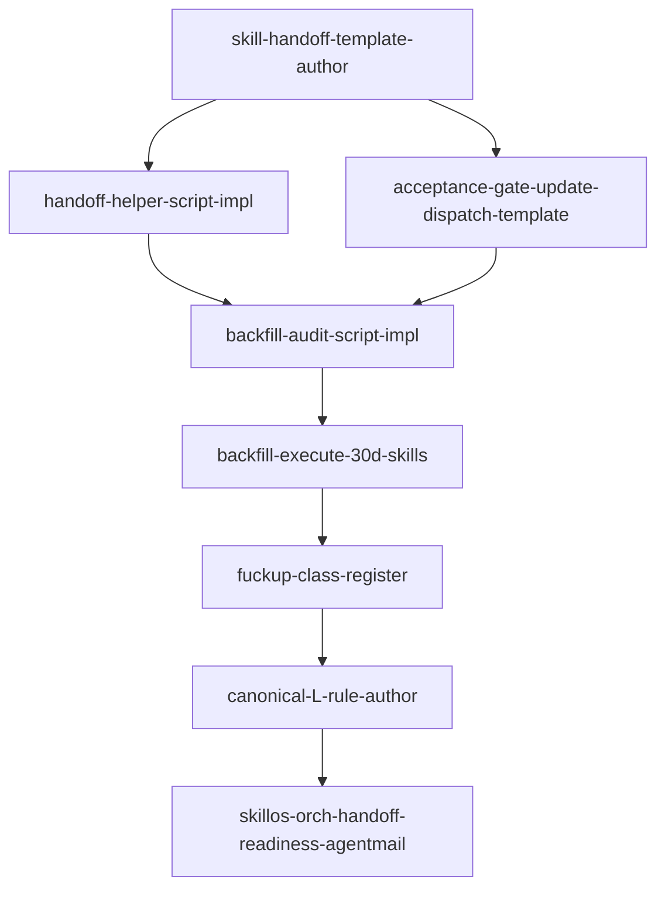

# Phase 1 RESEARCH (combined lanes A/B/C — self-authored)

## Skills library cited (META-RULE 2026-05-03 source-(a))

- **skill-builder** — canonical SKILL.md authoring template; defines name/description/when_to_use frontmatter contract that skillos validates on intake
- **agent-mail** — fleet-mail message + reservation primitives that the proven LavenderGlen→FoggyBear handoff used
- **canonical-cli-scoping** — applied to the handoff template itself: must support dry-run, idempotency, and explicit dispatch-vs-handoff separation
- **dispatch-tool-contracts** — every dispatch must declare callback contract, reservation cycle, and acceptance gates
- **beads-workflow** — skillos creates a receiving bead per handoff; flywheel creates a sending bead with `external_dependency=<skillos-bead-id>` cross-link
- **donella-meadows-systems-thinking** — leverage point #6 (information flows) is the framing: workers ship skills, but the catalog actor (skillos) doesn't know unless we tell it
- **gate-truth-separation** — handoff acceptance must distinguish "sent" (information delivered) from "accepted" (skillos ingested with version assigned)

`skills_library_gap`: none — this is a connector pattern across existing skills, not a new domain.

## Lane A — Problem-space inventory

### Symptom taxonomy (4 failure modes)

| FM | Description | Frequency | Severity |
|----|-------------|-----------|----------|
| FM-1 | Skill shipped to ~/.claude/skills/ without skillos notification → catalog drift, duplicate authoring risk | High (every flywheel-orch skill since 2026-05-01 except canonical-cli-scoping) | Medium |
| FM-2 | Skill shipped, fleet-mail sent, but no receiving bead created skillos-side → intake never closes the loop | Medium | Medium |
| FM-3 | Receiving bead created but no version bump / hardening cycle run → skill enters catalog at v0.1.0 forever | Medium | High (long-term) |
| FM-4 | Same skill authored twice in different sessions because no "claim before author" lookup → wasted tokens, divergent implementations | Low (so far) | High (when it happens) |

### Criticality matrix
- **Catalog truth:** ~428 skills in qdrant, 435 on filesystem (drift=7 per 2026-05-03 skillos digest). Every undeclared skill grows the drift number.
- **Petal 9 violation:** Recursive Self-Improvement requires every shipped skill to enter the reuse layer. Without handoff, petal 9 is open-loop.
- **Joshua's stated belief:** "I don't think skillos is putting anywhere near enough attention on the skill pack ecosystem" — half the problem is upstream (skillos GOAL drift), half is downstream (no inbound flow from peers). We address downstream; skillos orch addresses upstream.

### Stocks/flows (Meadows)
- **Stock:** canonical skill pack (qdrant `skills_catalog` collection)
- **Inflow:** skill creations across all flywheel-managed sessions
- **Outflow:** skill retirements (rare); version supersession
- **Current loop status:** inflow has no telemetry to skillos orch except for canonical-cli-scoping. **Information-flow leverage point (#6).**

## Lane B — Ecosystem audit (proven patterns)

### Pattern 1: fleet-mail skill-handoff (LavenderGlen → FoggyBear)

Source: `~/Developer/skillos/state/canonical-cli-scoping-v0.2-2026-05-01.json`

**Schema (the receipt skillos already produces):**
```json
{
  "schema_version": 1,
  "doc_type": "skill_hardening_receipt",
  "repo": "skillos",
  "source": "fleet-mail-skill-handoff",
  "fleet_mail": {
    "project_key": "/Users/josh/.local/state/flywheel/fleet-mail-project",
    "message_id": <int>,
    "sender": "<flywheel-agent-id>",
    "recipient": "FoggyBear",
    "subject": "[skill-handoff] <name> v<X.Y.Z> — for skillos hardening cycle",
    "marked_read": true
  },
  "bead": {
    "id": "skillos-<3-letter>",
    "title": "Harden <name> to v<next>",
    "status": "in_progress_at_artifact_write",
    "source_repo_repaired": true
  },
  "skill": {
    "name": "<skill-name>",
    "path": "/Users/josh/.claude/skills/<name>",
    "previous_version": "<X.Y.Z>",
    "new_version": "<X.Y+1.0>",
    "status": "hardened",
    "jsm_show": "not_found|found",
    "jsm_push_run": false,
    "distribution": "forbidden|allowed"
  },
  "hardening_requests_from_message": [...],
  "files_updated": [...],
  "files_added": [...]
}
```

This shape is the skillos-side intake schema. Our flywheel-side template must produce a fleet-mail message that contains exactly the fields skillos expects to populate this receipt.

### Pattern 2: doctrine-relay intake (LavenderGlen → FoggyBear, 13 messages)

Source: `~/Developer/skillos/state/doctrine-relay-intake-2026-05-01.json` + `doctrine-relay-routing-matrix-2026-05-01.json`

**Mechanism:** sender batches doctrine rules into fleet-mail messages tagged `[doctrine-L<NN>]` with `requested_action: "review for skill-pack creation OR existing pack amendment"`. Receiver creates one routing bead (skillos-2j8) with `relay_rules[]` array, reads canonical AGENTS.md, runs ownership_findings (jsm_status: upstream_owned vs is_owner: true), produces a routing matrix.

**Adopt for skill-handoff:** the message-to-receipt arc is identical. Single skill = single message; multiple skills = batch message with `skill_handoffs[]`.

### Pattern 3: agent-mail file reservations (L51)

Skillos-side hardening writes to `~/.claude/skills/<name>/`. Flywheel sender already reserved those files during the creation dispatch (e.g. info-source-watchtower dispatch reserved `/Users/josh/.claude/skills/info-source-watchtower/SKILL.md` etc). **Releases must complete before skillos can reserve for hardening**. Sequencing: sender_release → skillos_reserve → skillos_harden → skillos_release.

### Pattern 4: ownership policy (jsm)

Skillos's ownership_findings logic categorizes skills as `upstream_owned` (Jeff's repos: vibing-with-ntm, agent-mail, beads-workflow, etc — `distribution_policy: forbidden`) vs locally-owned (`is_owner: true` — distribution allowed). The flywheel-side handoff message MUST declare the ownership claim so skillos doesn't waste an intake bead on a forbidden-distribution skill.

### ADOPT/EXTEND/AVOID
- **ADOPT:** fleet-mail message format, skillos receipt schema, ownership declaration, file reservation handoff sequencing
- **EXTEND:** add `flywheel_origin_session`, `flywheel_creation_bead_id`, `flywheel_dispatch_log_ref` so skillos can backtrace
- **AVOID:** writing directly into `~/Developer/skillos/state/` (cross-orch boundary); using ntm send instead of agent-mail (L61 requires both for cross-session, but skillos orch is the receiving authority, not a worker)

## Lane C — Implementation design

### File deliverables

| Path | Purpose |
|------|---------|
| `~/Developer/flywheel/.flywheel/templates/skill-handoff-to-skillos.md` | Reusable fleet-mail message template with `{{skill_name}}` `{{version}}` `{{path}}` substitutions |
| `~/.claude/skills/.flywheel/dispatch-templates/skill-creation-with-handoff.md` | Updated dispatch packet template — adds mandatory handoff step to every skill-creation dispatch |
| `~/Developer/flywheel/.flywheel/scripts/handoff-skill-to-skillos.sh` | Bash helper: takes skill name + version, sends fleet-mail message, logs dispatch-log entry |
| `~/Developer/flywheel/.flywheel/scripts/audit-skill-handoff-coverage.sh` | Backfill audit: walk ~/.claude/skills/* mtime <30d, cross-ref against dispatch-log + skillos receipts, print gap |
| `~/Developer/flywheel/templates/fuckup-heuristics.json` | Add class `skill-shipped-without-skillos-handoff` |
| `~/Developer/flywheel/.flywheel/AGENTS-CANONICAL.md` | New canonical L-rule: L<NN> SKILL-CREATION-REQUIRES-SKILLOS-HANDOFF |

### Dispatch-template acceptance gate addition

The current `_shared:dispatch-template` mentions reservations and callbacks but not handoff. Add:

```markdown
## Skillos handoff (REQUIRED if dispatch creates ~/.claude/skills/*)

If your task creates or modifies any file under ~/.claude/skills/<name>/:
1. Run `~/Developer/flywheel/.flywheel/scripts/handoff-skill-to-skillos.sh <name> <version>` AFTER reservations released and BEFORE callback
2. Include in callback: `skillos_handoff_message_id=<int>` and `skillos_handoff_skipped_reason=null|<text>`
3. Acceptance: callback rejected if skillos_handoff_message_id is null AND skipped_reason is null
```

### Bash helper contract (canonical-cli-scoping)

```text
handoff-skill-to-skillos.sh [--dry-run] [--batch] <skill-name> [<version>]

Exit codes: 0 ok, 1 fleet-mail send failed, 2 skill not found, 3 ownership=forbidden (no handoff needed), 4 already-handed-off-this-version

Output (json on stdout):
  {"action":"sent|skipped|forbidden|duplicate","message_id":<int|null>,"skill":"<name>","version":"<X.Y.Z>","ownership":"local|upstream"}
```

### Bead DAG (preliminary — refined in Phase 4)



8 beads. All flywheel-scoped. P is the single cross-session message (agent-mail to skillos orch announcing the new contract).

### Test plan
- **Unit:** dry-run mode prints expected fleet-mail message without sending
- **Integration:** ship a tiny test skill, run handoff script, verify skillos creates intake bead within 1 tick (~30 min)
- **Regression:** ship a Jeff-owned skill (e.g. vibing-with-ntm hypothetically), verify ownership=forbidden short-circuits with exit 3
- **Backfill:** audit script must find at least info-source-watchtower (shipped today, no handoff) as a gap

## Convergence note

All 3 lanes self-authored from existing context. No new external research needed because the proven precedent (canonical-cli-scoping v0.2) provides ground truth. Convergence achieved trivially (single author, no disagreement). Adversarial review deferred to Phase 5 polish via codex pane once capacity returns.
