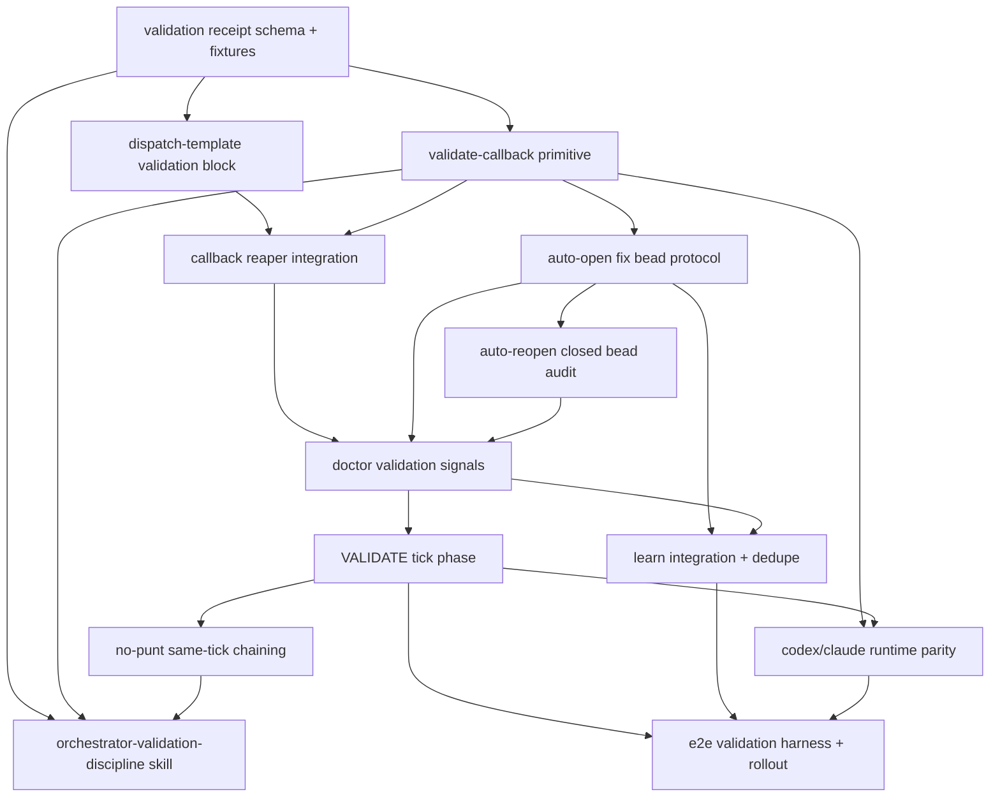

# Phase 1 Lane C - Implementation Design (Preliminary)

Plan: `validate-everything-we-build-2026-05-03`
Slug: `validate-and-redispatch-foundational-2026-05-03`
Lane: C, implementation design shape only
Result: `ladder_passed=yes`
Scope: read-only design. No skill files, beads, AGENTS.md, INCIDENTS.md, source, or runtime state were intentionally mutated.

Lane B dependency: Lane B will provide the Jeff/upstream pattern catalog and may rename, split, or reprioritize the beads below. This lane intentionally designs local flywheel shape first and marks Jeff-specific adapter choices as placeholders.

## Research Ledger

Skills lookup:

- Ran the required `/flywheel:skills-best-practices "implementation design tick phases doctor signal mechanical gate orchestrator dispatch template" --top=10 --include-content` equivalent by reading the slash command contract and querying the skill-search substrate. The exact slash command is a read-only lookup over `~/.claude/skills/` with `--doctor`, `--info`, `--json`, `--schema`, and include-content modes.
- Relevant matches to cite: `flywheel-doctor-author` for producer/measurement/consumer/promotion, `install-substrate` for registry plus doctor invariant shape, `observability-designer` for signal taxonomy, `agentic-coding-flywheel-setup` for flywheel substrate setup, `canonical-cli-scoping` for CLI surface requirements, `beads-workflow` for bead safety, and `agent-mail` for file reservation/callback coordination.
- `skills_library_gap=partial`: no existing skill bundles the full orchestrator callback validation discipline. This argues for a new `orchestrator-validation-discipline` skill rather than only extending a generic dispatch contract.

Socraticode citations used:

| # | Query | Citation | Design implication |
|---:|---|---|---|
| 1 | `dispatch template callback validation block acceptance gates` | `README.md:181` | Dispatch packets already define callback, receipts, Socraticode, reservations, and validation expectations; validation block should extend this contract, not invent a side channel. |
| 2 | same | `INCIDENTS.md:181` | Hidden execution and missing callback instructions created observability failures; validation must consume visible callbacks only. |
| 3 | same | `templates/josh-request-schema.md:271` | Request capture already models hook, CLI, JSONL, tick consumer, MISSION, doctrine-sync, and dashboard consumers; validation should use the same multi-consumer shape. |
| 4 | `flywheel-loop tick phases integrate dispatch validate callback` | `AGENTS.md:631` | L61 requires doctrine landing to wire into AGENTS/README; validation failures that land doctrine must trigger ecosystem-touch later. |
| 5 | same | `README.md:91` | Core command map names `flywheel-loop doctor`, `tick --dry-run`, NTM, Agent Mail, and Socraticode as existing control-plane surfaces. |
| 6 | `doctor signal callbacks_unvalidated_count auto doctor bead promotion` | `AGENTS.md:991` | L68/L60 use a soft-halt model until missing signals have bead/update/no-bead reason; callback validation should mirror this pattern. |
| 7 | same | `templates/josh-request-schema.v1-archive.md:181` | Existing request schema shows how a new surface gets hook, CLI, JSONL, tick, dispatch-template, and dashboard consumers. |
| 8 | `no silent darkness L60 five signal contract producer measurement consumer` | `AGENTS.md:991` | Doctor signals must be measured, preserved in receipts, and promoted from warn to fail only after a consumer exists. |
| 9 | `josh requests capture validation hook CLI tick consumer schema` | `templates/josh-request-schema.md:1` | Schema-frontmatter plus strict consumer rejection is the right model for validation receipts. |
| 10 | same | `templates/josh-request-schema.md:181` | Terminal closure requires typed evidence; callback validation should reject "done" without evidence. |
| 11 | `auto open fix bead reopen falsely closed bead artifact missing` | `INCIDENTS.md:451` | Self-bug beads can be trapped by the same broken selector they describe; auto-opened validation beads need selector escape priority. |
| 12 | `flywheel learn fuckup log INCIDENTS promotion state mining` | `AGENTS.md:361` | L56 promotion ladder distinguishes fuckup-log, INCIDENTS, and L-rule layers; validation failure routing must avoid double-processing with `/flywheel:learn`. |
| 13 | `codex parity agent context ntm send callback parsing L69` | `AGENTS.md:991` | L69 requires Codex probes through the Codex agent and callback parsing; raw orchestrator shell probes cannot satisfy parity validation. |
| 14 | `canonical cli scoping doctor health repair validate audit why schema` | `INCIDENTS.md:361` | CLI implementation must carry doctor/health/repair, validate/audit/why, JSON, schema, dry-run, idempotency, and observability from first dispatch. |
| 15 | `tick phase DISPATCH INTEGRATE BEADS next_phase no ready work chain same tick` | `tests/fixtures/data-backed-deferral/row185-catch.json:1` | The system already has fixtures where data points to an action and the bad draft asks Joshua; tests should assert chain-the-action behavior. |

Required local readings consumed: `00-INTENT.md`, `01-RESEARCH-A.md`, `feedback_three_audit_questions_per_surface.md`, AGENTS.md L60 and L69, `flywheel-doctor-author/SKILL.md`, and bead `flywheel-7lby`.

## 1. SKILL.md Draft Shape

Recommended new skill: `~/.claude/skills/orchestrator-validation-discipline/SKILL.md`.

Why new skill instead of only extending `dispatch-tool-contracts`: Lane A found the failure is broader than dispatch formatting. The bundle must cover the three-question audit, callback validation, no-punt chaining, fix-bead/reopen routing, cross-runtime parity, doctor signals, and `/flywheel:learn` interaction. `dispatch-tool-contracts` can consume the executable block later, but it should not own the whole doctrine.

Draft sections:

1. Frontmatter: trigger terms `orchestrator validation`, `worker callback`, `DONE validation`, `auto-open bead`, `auto-reopen bead`, `no punt`, `cross-runtime parity`, `3-Q audit`.
2. The Three Questions: every surface answers Q1 validated, Q2 documented, Q3 surfaced, with accepted evidence types.
3. Validate Callback Primitive: a callback is a claim until a validation receipt exists.
4. Dispatch Template Injection Block: exact block rendered into every worker dispatch, including artifact paths, acceptance gates, validation callback schema, and no-punt instruction.
5. No-Punt Rule: if the tick identifies the next actionable phase, it chains that phase same tick or records a machine-readable chain blocker.
6. Auto-Open Fix Bead Protocol: failed validation creates or updates a fix bead unless callback includes an explicit valid `no_bead_reason`.
7. Auto-Reopen Falsely Closed Protocol: closed bead with missing claimed artifact becomes reopen candidate or immediate reopen, depending on Joshua-disposes policy.
8. Cross-Runtime Parity: Claude probes run in Claude Bash context; Codex probes run through `ntm send` to the Codex agent and parse callback; both still apply CLI identity proof.
9. Doctor Signals: producer, measurement, consumer, promotion fields per `flywheel-doctor-author`.
10. `/flywheel:learn` Interaction: validation failures produce one durable event and mark whether learn should promote, ignore, or extend an existing rule.
11. Tests and Fixtures: synthetic callbacks, missing artifacts, false positives, runtime-unresponsive cases, no-punt cases.
12. Anti-patterns: forwarding worker DONE without validation, closing a bead on prose, raw shell parity proof, opening duplicate fix beads, asking Joshua when a next phase is known.

Executable surface shape, to be implemented later:

- `flywheel-loop validate-callback --repo PATH --dispatch-id ID --callback-ref REF --json`
- `flywheel-loop validate-callback --render-dispatch-block --repo PATH --json`
- `flywheel-loop audit-surface --surface TYPE --ref REF --three-q --json`
- `flywheel-loop doctor --validation-signals --json`
- `flywheel-loop validation-receipt --schema`
- `flywheel-loop validation-fixture --case missing-artifact|unvalidated-callback|runtime-drift|tick-punted --json`

The skill tests should not call production Beads by default. They should use temporary fixture repos, `--dry-run`, and explicit fake callback logs until the mutating phase is approved.

## 2. Phase Decomposition

Phase 1: Validation schema and fixture corpus
Depends on: Lane A taxonomy, `flywheel-doctor-author`, `canonical-cli-scoping`.
Build shape: JSON schema for validation receipts, callback claim model, surface audit model, and fixture files for DONE/BLOCKED/missing-artifact/runtime-unresponsive/no-punt.
Acceptance: `validate-callback --schema` emits stable JSON; fixtures parse; no mutating commands.
Rollback: remove schema/fixture files and disable dispatch-template reference.

Phase 2: Dispatch template injection block
Depends on: Phase 1.
Build shape: reusable block injected into worker dispatch packets: validation fields, artifact expectations, callback grammar, no-punt rule, file reservation release, bead/no-bead/fuckup receipts.
Skills/tools: `agent-mail`, `beads-workflow`, `canonical-cli-scoping`.
Acceptance: rendered dispatch contains validation block and rejects missing callback instructions in fixture tests.
Rollback: feature flag off for template renderer; old dispatch template remains.

Phase 3: `validate-callback` primitive
Depends on: Phases 1-2.
Build shape: read-only validator that takes callback text/log ref plus dispatch contract and emits `pass|fail|unknown`, evidence checks, missing fields, and recommended routing.
Acceptance: synthetic DONE without artifact fails; valid DONE with artifact passes; BLOCKED without fuckup row fails; runtime-unresponsive is `unknown`, not pass.
Rollback: validator remains advisory; dispatch template stops requiring receipt id.

Phase 4: Callback reaper integration
Depends on: Phase 3.
Build shape: orchestrator/tick reaper runs `validate-callback` before forwarding or integrating worker DONE.
Acceptance: dispatch-log callback entry gains validation receipt ref; unvalidated callbacks increment `callbacks_unvalidated_count`.
Rollback: reaper records validation as warning only; no dispatch halt.

Phase 5: Auto-open fix bead protocol
Depends on: Phases 3-4.
Build shape: validation failure with actionable repair opens/updates a repo-local bead or records explicit `no_bead_reason`. Duplicate detection keys on dispatch id, trauma class, and artifact path.
Acceptance: missing artifact fixture creates dry-run bead payload; duplicate fixture updates same candidate; low-signal fixture yields no-bead reason.
Rollback: switch mutator to dry-run and preserve validation receipts.

Phase 6: Auto-reopen falsely closed bead audit
Depends on: Phases 3 and 5.
Build shape: scanner for closed beads whose close reason claims an artifact/path/command that fails validation.
Acceptance: fixture closed bead with missing file becomes reopen candidate; valid closed bead stays closed.
Rollback: candidate-only mode, no `br reopen` mutation.

Phase 7: Doctor signal producer and consumer
Depends on: Phases 3-6.
Build shape: doctor emits callback validation signals and consumes them in strict mode. Signals follow producer/measurement/consumer/promotion shape.
Acceptance: doctor fixture counts requested signals; repeated soft breaches can promote to fail only after consumer proof.
Rollback: signals remain visible but non-failing.

Phase 8: VALIDATE tick phase
Depends on: Phases 4 and 7.
Build shape: insert `VALIDATE` between DISPATCH and INTEGRATE. Tick cannot integrate callback claims until validation receipt exists or a bounded unknown/blocker is filed.
Acceptance: tick fixture with pending callback enters VALIDATE, not INTEGRATE; clean callback proceeds.
Rollback: tick phase disabled by config, validator still available manually.

Phase 9: No-punt chaining
Depends on: Phase 8 and `flywheel-7lby`.
Build shape: when a tick concludes `next_phase=Y`, driver chains Y in the same tick if capacity and safety gates permit; otherwise emits `chain_blocker`.
Acceptance: fixture `no ready work + next_phase=BEADS` calls BEADS or records blocker; `ticks_punted_count` increments if neither occurs.
Rollback: warn-only signal, no automatic chaining.

Phase 10: `/flywheel:learn` integration
Depends on: Phases 5, 7, and 8.
Build shape: validation failures write a single normalized event with `learn_route=ignore|review|promote|skill_extend`; `/flywheel:learn` consumes without double-logging. Positive validation outcomes are not written to fuckup-log.
Acceptance: duplicate validation failure does not create duplicate learn/fuckup events; recurring trauma maps to L56 ladder.
Rollback: disable learn-route emission and keep validation receipts.

Phase 11: Cross-runtime and Codex parity
Depends on: Phase 3, Phase 8, L69, Lane B runtime pattern placeholders.
Build shape: parity checks record `agent_context` and `orchestrator_shell_context` separately. Codex column uses `ntm send` to the Codex agent and callback parsing; Claude column uses agent Bash context.
Acceptance: raw-shell success plus agent failure yields `context_drift`; agent timeout yields `runtime_unresponsive`; neither is reported as pass.
Rollback: parity gate advisory only; no automatic failure outside parity beads.

Phase 12: Doctrine, skill, and rollout harness
Depends on: Phases 1-11.
Build shape: final Phase 4/5 beads land the new skill, L-rule, README/AGENTS wire-in, tests, and migration plan for in-flight dispatches.
Acceptance: end-to-end smoke: synthetic worker DONE claiming missing artifact causes validation failure, fix-bead dry-run, doctor signal, and no integrate.
Rollback: revert feature flags to manual validation while preserving docs and receipts for audit.

## 3. Doctor Signal Taxonomy

Pattern: each signal has a producer, measurement, consumer, and promotion rule. The initial rollout should be warn/soft-halt until the consumer is proven in fixtures; strict fail can follow after Phase 7.

| Signal | Source / producer | Measurement | Consumer | Threshold and gate behavior |
|---|---|---|---|---|
| `callbacks_unvalidated_count` | Callback reaper observing callback received with no validation receipt | Count callbacks older than one reaper cycle whose dispatch contract required validation | `flywheel-loop doctor --validation-signals`; VALIDATE tick phase | `>=1` fail in strict mode per 00-INTENT; warn during rollout. Blocks INTEGRATE for those callbacks. |
| `callbacks_validated_with_failures_count` | `validate-callback` receipts with `status=fail` | Count failed validations by dispatch id and failure class | Doctor, auto-open bead protocol, `/flywheel:learn` router | Warn `>=1`; fail if no fix bead, reopened bead, or no-bead reason exists. |
| `ticks_punted_count` | Tick receipt with `next_phase` identified but no chained phase and no `chain_blocker` | Count per tick interval and per session | Doctor plus tick wrapper | Warn `>=1`; candidate fail/halt after Joshua decides severity. `flywheel-7lby` argues high criticality. |
| `surfaces_unwired_count` | 3-Q audit registry/receipts | Count surface categories where Q1, Q2, or Q3 is `none|partial` below policy | Doctor and plan/tick audit phase | Warn for any; fail for high-criticality surfaces from Lane A or age > one planning cycle. |
| `closed_bead_artifact_missing_count` | Closed bead artifact audit | Count closed beads whose close reason claims a canonical artifact that does not exist or fails smoke | Doctor and auto-reopen scanner | Fail `>=1` for P0/P1 or claimed-shipped artifacts; warn for lower severity until reopen policy lands. |
| `validation_receipts_schema_invalid_count` | Receipt parser | Count malformed or schema-mismatched validation receipts | Doctor | Fail in strict mode because invalid receipt is equivalent to no receipt. |
| `agent_context_probe_drift_count` | Cross-runtime parity validator | Count mismatches between agent context and orchestrator shell context | Doctor and parity epic | Warn `>=1`; fail for parity beads or runtime infrastructure work. |
| `validation_events_unrouted_count` | `/flywheel:learn` integration audit | Count failed validations with no learn route and no explicit ignore reason | Doctor and learn review | Warn `>=1`; fail after learn consumer is wired. |

Promotion rule: no signal becomes a hard halt until a fixture proves the producer writes it, the doctor measures it, a consumer changes behavior from it, and a receipt preserves it. That is the L60/L68 pattern applied to validation.

## 4. Preliminary Bead DAG

Proposed bead shape, not final Phase 4 issuance:

Suggested preliminary beads:

1. `validation-receipt-schema-fixtures`
2. `dispatch-template-inject-validation-block`
3. `validate-callback-primitive`
4. `callback-reaper-validation-gate`
5. `auto-open-fix-bead-on-validation-failure`
6. `auto-reopen-falsely-closed-bead`
7. `doctor-validation-signals`
8. `validate-tick-phase`
9. `orch-no-punt-same-tick-chain` (companion/implementation for `flywheel-7lby`)
10. `learn-validation-event-routing`
11. `codex-claude-agent-context-parity-validation`
12. `orchestrator-validation-discipline-skill`
13. `validation-e2e-smoke-harness`

Lane B will provide whether any of these should map to existing Jeff substrate primitives, especially for callback parsing, validation receipt schema, and bead reopen/update semantics.

## 5. Test Plan

Schema tests:

- Parse every fixture and reject missing `schema_version`, unknown status, missing evidence refs, or untyped closure evidence.
- Assert v1-style free-text DONE cannot satisfy the v2 validation receipt.

Dispatch-template tests:

- Render a worker dispatch and assert the validation block includes artifact gates, callback grammar, no-punt rule, reservation release, bead/no-bead field, and fuckup-log field.
- Render a malformed dispatch missing callback instructions and assert template audit fails.

Validate-callback tests:

- Synthetic DONE claims `evidence=/tmp/missing.md`; file absent; assert `status=fail`, `failure_class=artifact_missing`, and fix-bead recommendation.
- Synthetic DONE with existing fixture artifact and expected fields; assert pass.
- Synthetic BLOCKED without `fuckups_logged`; assert fail.
- Synthetic Codex probe timeout; assert `runtime_unresponsive`, not pass and not raw-shell fallback.

Auto-open bead tests:

- Feed failed validation twice; assert one bead candidate is created then updated, not duplicated.
- Feed low-severity failure with explicit valid `no_bead_reason`; assert no bead mutator.
- Feed high-criticality missing artifact; assert no-bead reason is rejected unless policy explicitly allows.

Auto-reopen tests:

- Fixture closed bead with close reason `shipped artifact=/tmp/does-not-exist`; assert reopen candidate.
- Fixture closed bead with existing artifact and passing smoke; assert no action.
- Fixture closed bead where artifact path is ambiguous; assert `unknown` and no automatic reopen.

Doctor tests:

- Fixture callback log with one unvalidated callback; assert `callbacks_unvalidated_count=1`.
- Fixture failed validation with no fix bead; assert strict doctor fail.
- Fixture failed validation with fix bead ref; assert warning/record but no missing-remediation fail.
- Fixture `next_phase=BEADS` with no chain and no blocker; assert `ticks_punted_count=1`.

Tick phase tests:

- Pending callback claim routes tick to VALIDATE before INTEGRATE.
- Failed validation blocks INTEGRATE and emits bead/learn route.
- Clean validation proceeds to integration.
- `next_phase` chaining runs same tick when capacity and safety gates pass.

Learn integration tests:

- Failed validation writes one normalized event and one route; repeated scan does not double-process.
- Positive validation receipt does not enter fuckup-log.
- Recurring validation class maps to L56 promotion ladder, not direct L-rule.

Cross-runtime tests:

- Claude fixture uses agent Bash context.
- Codex fixture uses `ntm send` prompt plus callback parsing.
- Raw shell pass plus agent fail produces `context_drift`.
- CLI identity proof records resolved path/realpath/help smoke for collision-prone commands.

End-to-end smoke before "shipped":

1. Dispatch synthetic worker packet with validation block.
2. Worker callback claims DONE with missing artifact.
3. Reaper runs validation before forwarding.
4. Validation receipt fails.
5. Fix-bead dry-run payload is generated.
6. Doctor emits `callbacks_validated_with_failures_count=1`.
7. Tick refuses INTEGRATE and enters VALIDATE/remediation.
8. `/flywheel:learn` sees exactly one routed event.

## 6. Trade-Offs For Joshua-Disposes

1. Should `ticks_punted_count>=1` be strict fail/halt immediately, or warn until repeated? `flywheel-7lby` is P0 and argues fail, but automatic phase chaining has blast radius.
2. Should auto-open fix beads run for every validation failure, or only high-criticality/P0-P1/high-confidence failures? Broad auto-open prevents silent loss but can create noise if validators are immature.
3. Should `validate-callback` block the orchestrator pane synchronously, or run in background while the orchestrator continues safe unrelated work? Blocking is simpler and safer; background preserves throughput but needs stronger receipts.
4. Should falsely closed beads be reopened automatically, or should the scanner create reopen candidates for human/orchestrator review? Automatic reopen is honest but can fight legitimate non-file artifacts.
5. Where should positive validation outcomes live? They should not pollute fuckup-log, but the system needs some success substrate for calibration.
6. How strict should Codex parity be when a Codex pane is frozen or runtime-unresponsive? L69 says do not substitute raw shell; Joshua should decide whether that halts parity epics or creates retry work.
7. How should in-flight dispatches migrate when the validation primitive lands? Options: grandfather existing callbacks, backfill validation receipts, or force revalidation before integration.

## Open Questions For Lane B And Phase 4

- Lane B should identify whether Jeff's current substrate already has a canonical callback receipt or validation event schema that should be reused.
- Lane B should check whether `br` has safe reopen/update semantics suitable for auto-reopen, or whether flywheel needs a wrapper.
- Lane B should identify any `ntm` callback parsing or pane-agent context primitives that reduce bespoke parsing for Codex parity.
- Phase 4 should decide whether the new skill owns executable scripts or only documents `flywheel-loop` subcommands.
- Phase 4 should choose exact bead IDs and dependencies, then split mutating work so schema, doctor, tick, and bead mutation have separate review gates.
