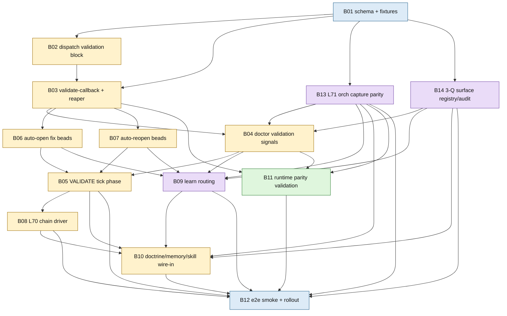

# Phase 2 REFINE r2 - Convergence Test Validate-Everything Plan

Plan: `validate-everything-we-build-2026-05-03`
Slug: `validate-and-redispatch-foundational-2026-05-03`
Status: synthesis r2 complete
ladder_passed: yes

## 1. Executive Summary

Build a flywheel validation layer where every surface answers Joshua's three audit questions before it can be treated as done: is it validated, is it documented, and is every skill/issue/finding surfaced into the learning loop? The plan ships a schema-backed callback validator, dispatch validation block, VALIDATE tick phase, doctor signals, auto-open/reopen protocols, `/flywheel:learn` routing, same-tick chaining under L70 ORCH-NO-PUNT, and cross-runtime capture parity under recommended L71 ORCH-CAPTURE-PARITY. The goal is not a one-off callback checker; it is that every Claude, Codex, future runtime, hook, CLI, bead, doctor signal, memory, and dispatch participates in the same evidence-and-learning loop.

Skills source-(a) baseline: `planning-workflow` says great plans are self-contained, dependency-aware, justified, testable, and ordered schema -> API -> UI (`/Users/josh/.claude/skills/planning-workflow/SKILL.md:79` through `:88`). `jeff-convergence-audit` requires source-(a) skills lookup before audit packets and says two consecutive zero rounds are convergence (`/Users/josh/.claude/skills/jeff-convergence-audit/SKILL.md:24` through `:42`, `:133` through `:137`). Round 2 lookup surfaced `planning-workflow`, `jeff-convergence-audit`, `beads-workflow`, and `repeatedly-apply-skill`. `skills_library_gap=none_for_refine_core`; no extra skill gap beyond B-prime's narrow gap for full Jeff-corpus mining. `01-RESEARCH-MEADOWS-COMPONENTS.md` was not present at r2 read time.

## 2. Goal-Level Intervention

Meadows #3 goal: every flywheel surface participates in the learning loop. "Validated" means a mechanical proof exists; "documented" means the right durable surface is updated; "surfaced" means findings route to beads, fuckup-log, INCIDENTS, skills, doctor, `/flywheel:learn`, or explicit no-action receipts. The goal is not "implement validation primitives"; primitives are only useful when they change the stock and flow of validated learning.

Lane A shows every major surface currently fails at least one question:

| Surface family | Q1 validated | Q2 documented | Q3 surfaced | Main gap |
|---|---|---|---|---|
| Worker callbacks | partial | partial | partial | `orchestrator-skipped-callback-validation`; DONE is not mechanically proven before summary/integration. |
| Tick phases | partial | partial | partial | VALIDATE phase does not exist; L70 no-punt needs mechanical chaining. |
| Doctor signals | partial | partial | partial | Callback validation, punted ticks, capture parity, and 3-Q coverage are not first-class doctor signals. |
| Josh-request capture | partial | partial | partial | Claude path exists; Codex/future runtime capture is a parity gap. |
| Beads and close reasons | partial | partial | partial | Closed bead can claim shipped artifacts that do not exist. |
| Skills/memory/INCIDENTS | partial | full/partial | partial | Learned signal exists but routing and promotion are not mechanically tied to validation receipts. |
| Runtime panes | partial | partial | partial | L69 context proof is new; raw shell truth can still be confused with agent truth. |
| CLI/MCP/watchtowers | partial | partial | partial | Documented or installed is not the same as wired, smoked, and consumed. |

Meadows hierarchy applied to the whole plan:

| Level | Refined intervention |
|---|---|
| #2 Paradigm | Stop treating Claude hooks as the default and Codex/future runtimes as exceptions. |
| #3 Goal | All orchs and surfaces are first-class learning participants. |
| #5 Rules | L70 no-punt, recommended L71 capture parity, recommended VALIDATE-CALLBACK-OR-PUNT, recommended THREE-Q-AUDIT-PER-SURFACE. |
| #6 Information flow | Hook/JSONL/NTM/agent-mail capture, validation receipts, doctor JSON, tick receipts, learn routes. |
| #7-#9 Buffers/delays/parameters | Useful only after the above; timeout tweaks do not fix a severed learning loop. |

## 3. Rule-Level Intervention

Rules to land or implement:

| Rule | Status | Scope | Why it matters |
|---|---|---|---|
| L70 ORCH-NO-PUNT | shipped | Same-tick chaining when next actionable phase is known. | Prevents "identified next action, then idle" (`AGENTS.md:1081` through `:1149`). |
| L71 ORCH-CAPTURE-PARITY | recommended | Every orch/runtime must surface Joshua-originated input to canonical capture. | Codex stock is currently zero; hook-only fix is Meadows #6 without #3/#5. |
| L?? VALIDATE-CALLBACK-OR-PUNT | recommended | A worker callback is a claim until validation receipt exists; failure must route to bead/reopen/no-bead. | Closes `flywheel-1z65` and prevents prose-only DONE forwarding. |
| L?? THREE-Q-AUDIT-PER-SURFACE | recommended | Every new or changed surface answers validated/documented/surfaced before closure. | Promotes the umbrella meta-rule into canonical doctrine. |

Doctor signal taxonomy, refined by leverage:

| Signal | Leverage | Producer | Consumer / behavior |
|---|---|---|---|
| `callbacks_unvalidated_count` | #5 rule + #6 info | Callback reaper | Blocks INTEGRATE in strict mode; validates L?? callback rule. |
| `callbacks_validated_with_failures_count` | #5 + #6 | `validate-callback` receipts | Requires fix bead, reopen, or valid no-bead reason. |
| `ticks_punted_count` | #5 | Tick driver | Hard fail under L70 unless `chain_blocked_reason` exists. |
| `orchs_with_capture_gap_count` | #3 + #5 + #6 | Runtime/session capture coverage probe | Warn for 7 days or immediate fail if Joshua chooses hard L71. |
| `surfaces_unwired_count` | #3 + #5 | 3-Q surface registry/audit | Flags documented-but-not-wired surfaces. |
| `closed_bead_artifact_missing_count` | #5 + #6 | Closed bead artifact scanner | Produces reopen candidate or reopen action. |
| `validation_receipts_schema_invalid_count` | #6 | Receipt parser | Invalid receipt equals no receipt in strict mode. |
| `agent_context_probe_drift_count` | #3 + #6 | Cross-runtime parity validator | Raw shell pass plus agent fail is context drift, not pass. |
| `validation_events_unrouted_count` | #3 + #6 | Learn routing audit | Ensures findings do not stop at receipts. |

Pure #6 signals are insufficient if no rule consumes them. The refined plan therefore promotes any signal that detects participation gaps (`capture_gap`, `surface_unwired`, callback validation) to #3/#5 intervention, not just dashboard telemetry.

## 4. Mechanism-Level Intervention

| Mechanism | Meadows level | Q1 validated | Q2 documented | Q3 surfaced | Refined behavior |
|---|---|---|---|---|---|
| Tick driver chains DISPATCH -> BEADS -> DISPATCH | #5 rule executing via #6 receipt flow | partial -> B08 fixtures | L70 shipped | partial -> `ticks_punted_count` | Implement `chain_if_capacity`; if no chain, require `chain_blocked_reason`. |
| Worker callback validation primitive | #5 + #6 | none -> B03 receipt tests | partial via `flywheel-1z65` | partial -> B06/B09 | `validate-callback` runs before summary/integration; emits pass/fail/unknown receipt. |
| Josh-request capture per runtime | #3 + #5 + #6 | partial, Claude-only | partial via schema/audit | partial -> B13 signal | Claude hook remains one mechanism; Codex/future runtimes use agent-mail or `ntm send` wrapper first, pane-tail poller last. |
| Auto-open fix-bead protocol | #5 | none -> B06 dry-run/apply tests | partial via L52 | partial -> repo-local beads | Failed validation with actionable evidence becomes repo-local bead or update, not scrollback. |
| Auto-reopen falsely closed protocol | #5 | none -> B07 scanner tests | partial via watchtower doctrine | partial -> reopen candidates | Closed bead with missing claimed artifact becomes reopen candidate/apply path. |
| Cross-runtime parity probe | #3 + #6 | partial via L69/q03g | partial via parity epic | partial -> B11 context-drift signal | Agent context and orchestrator shell context recorded separately; L69 preserved. |
| `/flywheel:learn` event routing | #3 + #6 | partial -> B09 duplicate tests | partial via L56 | partial -> learn route ledger | Failed validation routes once through L56; positive receipts do not pollute fuckup-log. |
| 3-Q surface registry | #3 + #5 + #6 | none -> B14 audit runner | partial via 00-INTENT | partial -> B04/B09 | Defines the stock of surfaces and makes coverage measurable. |

Mechanisms must remain read-only first. Mutation gets explicit apply modes, dry-run artifacts, idempotency keys, and repo-local proof.

## 5. Refined Bead DAG

B01-B12 remain the implementation spine from the pre-draft. Round 1 adds two beads because Meadows exposed missing goal/rule machinery: B13 for L71 capture parity and B14 for the 3-Q surface registry/audit. B10 becomes a doctrine wire-in bead that consumes executable evidence from B03-B09 and B13-B14 rather than inventing doctrine first.

| Bead | Title | Leverage | Refinement |
|---|---|---|---|
| B01 | validation schema + fixtures | #6 | Keep; foundation for receipts and fixtures. |
| B02 | dispatch-template validation block | #5/#6 | Keep; dispatch-time rule injection. |
| B03 | validate-callback primitive + reaper | #5/#6 | Keep; load-bearing callback gate. |
| B04 | doctor validation signals | #5/#6 | Keep; add `orchs_with_capture_gap_count` and 3-Q signal consumers after B13/B14. |
| B05 | VALIDATE tick phase | #5/#6 | Keep; blocks INTEGRATE on unvalidated/failed callbacks. |
| B06 | auto-open fix beads | #5 | Keep; enforce L52 for validation gaps. |
| B07 | auto-reopen falsely closed beads | #5 | Keep; documented/shipped claims need artifact proof. |
| B08 | L70 same-tick chain driver | #5 | Keep; high leverage rule implementation. |
| B09 | learn validation routing | #3/#6 | Keep; ensures findings feed the learning loop. |
| B10 | doctrine + memory + skill wire-in | #5 | Refine to include L71, VALIDATE-CALLBACK, THREE-Q only after executable proof. |
| B11 | Codex/Claude parity validation | #3/#6 | Keep; make it depend on B13 capture parity where prompt capture is involved. |
| B12 | e2e smoke harness + rollout | #6 proof of #3/#5 | Keep; final gate before "shipped." |
| B13 | orch capture parity rule/signal/mechanisms | #3/#5/#6 | New; turns xap2-style hook gap into cross-runtime participation rule. |
| B14 | 3-Q surface registry and audit runner | #3/#5/#6 | New; makes "every surface" finite, enumerable, and doctor-consumable. |

Wave order: Wave 1 B01-B03; Wave 2a B13/B14 plus B06/B07; Wave 2b B04 after B13/B14; Wave 3 B05/B08/B09/B11; Wave 4 B10/B12.

## 6. Test Plan

End-to-end smoke per component:

- Schema: validate passing/failing fixtures; reject malformed receipts and free-text DONE as proof.
- Dispatch template: render Claude and Codex worker packets; fail if validation block/callback fields are absent.
- Callback validator: fake worker DONE claims missing artifact; assert `status=fail`, no summary/integration, fix-bead recommendation.
- Doctor: fixture logs produce `callbacks_unvalidated_count`, `callbacks_validated_with_failures_count`, `ticks_punted_count`, `orchs_with_capture_gap_count`, and `surfaces_unwired_count`.
- Tick: pending callback enters VALIDATE before INTEGRATE; clean receipt proceeds; failed receipt blocks until routed.
- Auto-open: repeat same failed validation twice; assert update, not duplicate bead.
- Auto-reopen: closed bead claims missing artifact; assert reopen candidate in dry-run.
- Learn: failed validation routes once; positive validation does not enter fuckup-log.
- Capture parity: active Claude and Codex orch sessions must each have a capture row or explicit non-participating state.
- 3-Q registry: every registered surface has Q1/Q2/Q3 fields plus evidence refs.

Synthetic test cases:

- `DONE evidence=/tmp/missing.md` -> fail, `artifact_missing`, fix-bead dry-run.
- `DONE` with artifact but no `beads_filed|beads_updated|no_bead_reason` -> fail L52.
- `BLOCKED` without `fuckups_logged` -> fail L53.
- `next_phase=BEADS` with capacity but no chain -> `ticks_punted_count=1`.
- Raw shell command passes while Codex agent probe fails -> `context_drift`.
- Codex pane timeout -> `runtime_unresponsive`, not pass.
- Claude hook capture exists but Codex capture missing -> `orchs_with_capture_gap_count=1`.
- Surface documented in README but no smoke/doctor/tick consumer -> `surfaces_unwired_count=1`.

Cross-runtime tests must exercise Claude and Codex paths separately. Claude hook proof cannot stand in for Codex; Codex raw shell proof cannot stand in for agent callback proof.

## 7. Trade-Offs For Joshua-Disposes

1. L71 severity: should ORCH-CAPTURE-PARITY be hard fail immediately like L70, or warn-only for 7 days before fail? Recommendation: warn 7 days for existing runtimes, hard fail for any newly added runtime.
2. Auto-open breadth: should every validation failure create/update a fix bead, or only P0/P1/high-confidence failures? Recommendation: all failures require bead/update/no-bead receipt; mutating auto-open starts with high-confidence only.
3. Auto-reopen policy: should falsely closed beads be reopened automatically or only listed as candidates? Recommendation: candidate-only first; automatic reopen for P0/P1 after two clean fixture rounds.
4. Blocking model: should `validate-callback` block synchronously before any integration, or run in background while safe unrelated work continues? Recommendation: block integration for that callback, allow unrelated safe work with receipt isolation.
5. Positive validation substrate: where should pass receipts live so calibration improves without polluting fuckup-log? Recommendation: validation receipt ledger plus optional skill outcome, not fuckup-log.
6. Implementation order: rule first, signal first, or mechanism first? Recommendation: schema/mechanism fixture first (B01-B03), then signal (B04/B13/B14), then rule doctrine (B10) after proof; L70 is exception because Joshua already shipped it.
7. Historical backfill: should the scanner audit historical closed beads or forward-only? Recommendation: forward-only by default, plus targeted backfill for high-criticality examples that seeded the plan.

## 8. Jeff Pattern Frequency Applied

| Jeff pattern | Repo hits | Plan component |
|---|---:|---|
| validation / validate | 125 | B01-B05 and B14; validation becomes a finite contract, not prose. |
| e2e / end-to-end | 96 | B12 final smoke harness; every component gets at least one synthetic e2e. |
| health | 94 | B04 doctor/health JSON and runtime capture coverage. |
| audit | 94 | B14 3-Q surface audit and B07 closed bead audit. |
| golden / snapshot | 94 | B01 receipt fixtures and stable robot JSON. |
| feedback / outcome | 91 | B09 learn routing and positive validation receipt substrate. |
| coverage | 88 | B14 surface registry coverage over "every surface." |
| schema | 80 | B01 validation receipt schema, B03 `--schema`, B12 final receipt. |
| doctor | 77 | B04 signal producer/measurement/consumer/promotion. |
| checksum / sha256 / signature | 77 | Applied to CLI/hook/installer surfaces that claim external artifacts. |

Jeff anti-patterns applied:

- Do not accept README or benchmark claims as proof; `frankensqlite` explicitly rejects README-only proof (`/Users/josh/Developer/frankensqlite/docs/canonical_parity_contract.md:175` through `:183`).
- Quarantine or dry-run before mutation; `coding_agent_session_search` keeps corrupt assets quarantined and doctor read-only unless `--fix` is explicit (`/Users/josh/Developer/coding_agent_session_search/AGENTS.md:393` through `:396`).
- Do not trade real oracle parity for speed; `frankenpandas` requires full differential testing rather than cherry-picked subsets (`/Users/josh/Developer/frankenpandas/AGENTS.md:152` through `:164`).
- Do not treat upstream release as enough; verified installer checksums need canonical refresh and diff review (`/Users/josh/Developer/agentic_coding_flywheel_setup/AGENTS.md:140` through `:146`).
- Fail closed on missing evidence; `asupersync` GA evidence packets make missing/unverifiable evidence a NO_GO state (`/Users/josh/Developer/asupersync/docs/wasm_ga_go_no_go_evidence_packet.md:13` through `:23`).

## 9. Open Questions For Phase 3 Audit

Best audit lenses for Phase 3:

1. Evidence-contract lens: does the plan define schemas, receipts, fixtures, and fail-closed behavior for every claimed proof? This is the strongest Jeff-convergence lens.
2. Runtime-context parity lens: do Claude, Codex, and future runtimes prove behavior through their own agent context, with live truth and capture coverage?
3. Learning-loop/surfacing lens: does every failure, positive outcome, skill gap, doctrine gap, and issue finding route exactly once into the right durable substrate?

Secondary lenses if capacity exists:

- Mutation-safety lens: all auto-open/reopen/repair paths are dry-run first, idempotent, repo-local, and auditable.
- Operator UX lens: every new CLI/tick/doctor surface has `--json`, schema, examples, dry-run, and clear `why`.

Phase 3 should decide the seven trade-offs above, then run one convergence audit pass against this r2 plan. Because r2 changed the mechanism table and wave order, recommend r3 with only these work items: verify no Meadows component file landed late, confirm Section 4 Q1/Q2/Q3 statuses are sufficient, and make no new DAG changes unless a hard inconsistency is found.
