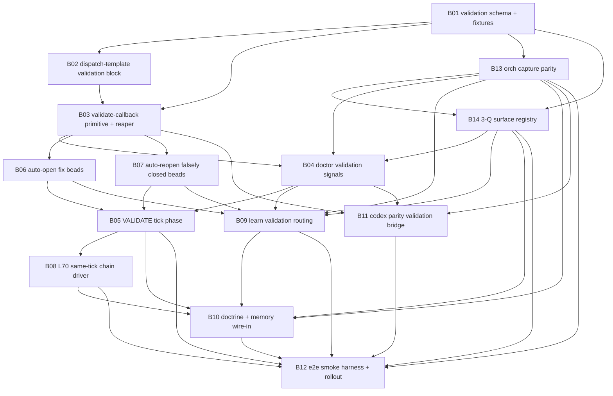

## Contents

- [Research Ledger](#research-ledger)
- [Coverage Map](#coverage-map)
- [DAG](#dag)
- [Wave Plan](#wave-plan)
- [B01 - Pre-Draft Body](#b01-pre-draft-body)
  - [Title](#title)
  - [Goal](#goal)
  - [Why now](#why-now)
  - [Acceptance gates](#acceptance-gates)
  - [DOD](#dod)
  - [Doctrine references](#doctrine-references)
  - [Out of scope](#out-of-scope)
  - [Dependencies](#dependencies)
  - [Pre-flight blockers](#pre-flight-blockers)
- [B02 - Pre-Draft Body](#b02-pre-draft-body)
  - [Title](#title)
  - [Goal](#goal)
  - [Why now](#why-now)
  - [Acceptance gates](#acceptance-gates)
  - [DOD](#dod)
  - [Doctrine references](#doctrine-references)
  - [Out of scope](#out-of-scope)
  - [Dependencies](#dependencies)
  - [Pre-flight blockers](#pre-flight-blockers)
- [B03 - Pre-Draft Body](#b03-pre-draft-body)
  - [Title](#title)
  - [Goal](#goal)
  - [Why now](#why-now)
  - [Acceptance gates](#acceptance-gates)
  - [DOD](#dod)
  - [Doctrine references](#doctrine-references)
  - [Out of scope](#out-of-scope)
  - [Dependencies](#dependencies)
  - [Pre-flight blockers](#pre-flight-blockers)
- [B04 - Pre-Draft Body](#b04-pre-draft-body)
  - [Title](#title)
  - [Goal](#goal)
  - [Why now](#why-now)
  - [Acceptance gates](#acceptance-gates)
  - [DOD](#dod)
  - [Doctrine references](#doctrine-references)
  - [Out of scope](#out-of-scope)
  - [Dependencies](#dependencies)
  - [Pre-flight blockers](#pre-flight-blockers)
- [B05 - Pre-Draft Body](#b05-pre-draft-body)
  - [Title](#title)
  - [Goal](#goal)
  - [Why now](#why-now)
  - [Acceptance gates](#acceptance-gates)
  - [DOD](#dod)
  - [Doctrine references](#doctrine-references)
  - [Out of scope](#out-of-scope)
  - [Dependencies](#dependencies)
  - [Pre-flight blockers](#pre-flight-blockers)
- [B06 - Pre-Draft Body](#b06-pre-draft-body)
  - [Title](#title)
  - [Goal](#goal)
  - [Why now](#why-now)
  - [Acceptance gates](#acceptance-gates)
  - [DOD](#dod)
  - [Doctrine references](#doctrine-references)
  - [Out of scope](#out-of-scope)
  - [Dependencies](#dependencies)
  - [Pre-flight blockers](#pre-flight-blockers)
- [B07 - Pre-Draft Body](#b07-pre-draft-body)
  - [Title](#title)
  - [Goal](#goal)
  - [Why now](#why-now)
  - [Acceptance gates](#acceptance-gates)
  - [DOD](#dod)
  - [Doctrine references](#doctrine-references)
  - [Out of scope](#out-of-scope)
  - [Dependencies](#dependencies)
  - [Pre-flight blockers](#pre-flight-blockers)
- [B08 - Pre-Draft Body](#b08-pre-draft-body)
  - [Title](#title)
  - [Goal](#goal)
  - [Why now](#why-now)
  - [Acceptance gates](#acceptance-gates)
  - [DOD](#dod)
  - [Doctrine references](#doctrine-references)
  - [Out of scope](#out-of-scope)
  - [Dependencies](#dependencies)
  - [Pre-flight blockers](#pre-flight-blockers)
- [B09 - Pre-Draft Body](#b09-pre-draft-body)
  - [Title](#title)
  - [Goal](#goal)
  - [Why now](#why-now)
  - [Acceptance gates](#acceptance-gates)
  - [DOD](#dod)
  - [Doctrine references](#doctrine-references)
  - [Out of scope](#out-of-scope)
  - [Dependencies](#dependencies)
  - [Pre-flight blockers](#pre-flight-blockers)
- [B10 - Pre-Draft Body](#b10-pre-draft-body)
  - [Title](#title)
  - [Goal](#goal)
  - [Why now](#why-now)
  - [Acceptance gates](#acceptance-gates)
  - [DOD](#dod)
  - [Doctrine references](#doctrine-references)
  - [Out of scope](#out-of-scope)
  - [Dependencies](#dependencies)
  - [Pre-flight blockers](#pre-flight-blockers)
- [B11 - Pre-Draft Body](#b11-pre-draft-body)
  - [Title](#title)
  - [Goal](#goal)
  - [Why now](#why-now)
  - [Acceptance gates](#acceptance-gates)
  - [DOD](#dod)
  - [Doctrine references](#doctrine-references)
  - [Out of scope](#out-of-scope)
  - [Dependencies](#dependencies)
  - [Pre-flight blockers](#pre-flight-blockers)
- [B12 - Pre-Draft Body](#b12-pre-draft-body)
  - [Title](#title)
  - [Goal](#goal)
  - [Why now](#why-now)
  - [Acceptance gates](#acceptance-gates)
  - [DOD](#dod)
  - [Doctrine references](#doctrine-references)
  - [Out of scope](#out-of-scope)
  - [Dependencies](#dependencies)
  - [Pre-flight blockers](#pre-flight-blockers)
- [B13 - Pre-Draft Body](#b13-pre-draft-body)
  - [Title](#title)
  - [Goal](#goal)
  - [Why now](#why-now)
  - [Acceptance gates](#acceptance-gates)
  - [DOD](#dod)
  - [Doctrine references](#doctrine-references)
  - [Out of scope](#out-of-scope)
  - [Dependencies](#dependencies)
  - [Pre-flight blockers](#pre-flight-blockers)
  - [Wave assignment](#wave-assignment)
- [B14 - Pre-Draft Body](#b14-pre-draft-body)
  - [Title](#title)
  - [Goal](#goal)
  - [Why now](#why-now)
  - [Acceptance gates](#acceptance-gates)
  - [DOD](#dod)
  - [Doctrine references](#doctrine-references)
  - [Out of scope](#out-of-scope)
  - [Dependencies](#dependencies)
  - [Pre-flight blockers](#pre-flight-blockers)
  - [Wave assignment](#wave-assignment)
- [Pre-Flight Blocker Summary](#pre-flight-blocker-summary)
- [Phase 4 Creation Notes](#phase-4-creation-notes)
# Phase 4 PRE-DRAFT - Bead Bodies

Plan: `validate-everything-we-build-2026-05-03`
Slug: `validate-and-redispatch-foundational-2026-05-03`
Mode: PRE-DRAFT only. No `br create`, no source edits, no AGENTS.md/INCIDENTS.md mutation.
Result: `ladder_passed=yes`

## Research Ledger

Required readings consumed:

- `00-INTENT.md`: canonical scope for validation, documentation, surfacing, and the 9 implementation components.
- `01-RESEARCH-A.md`: 25 surface categories, 20 high-criticality gaps, and trauma-class evidence.
- `01-RESEARCH-C.md`: 12-phase implementation design, doctor signal taxonomy, preliminary bead DAG, and test plan.
- `AGENTS.md` L60: five-signal doctor pattern; liveness is proven by output, not markers.
- `AGENTS.md` L69: probes must run through the agent execution context; raw shell probes are not runtime truth.
- JD-002 q03g-absent proof rule: companion to L69; fixture-only may prove schemas and packet rendering, but active-runtime parity claims require q03g or an equivalent live in-agent probe.
- `AGENTS.md` L70: ORCH-NO-PUNT; next actionable phase runs same tick.
- `flywheel-7lby`: P0 L70 mechanical gate and `ticks_punted_count`.
- `flywheel-1z65`: callback validation doctrine and validation-before-forwarding trauma.
- `flywheel-2p25`: toolset parity epic across Claude and Codex runtimes.
- `02-REFINE-r4.md`: final converged plan adding B13/B14 as first-class beads for L71 capture parity and 3-Q surface registry.
- `03-AUDIT-FINDINGS.md`: PARITY-001, EV-001, and WIRE-001 drove the B13/B14 additions after JD-001 approval.
- `01-RESEARCH-MEADOWS.md`: L71 ORCH-CAPTURE-PARITY uses a Meadows #3 + #5 + #6 stack.
- `flywheel-zuav`: L71 candidate doctrine and `orchs_with_capture_gap_count` signal.
- `flywheel-xap2`: P0 Joshua-request Codex capture parity mechanism child.

Skills used:

- `beads-workflow`: self-contained bead bodies, explicit dependencies, testable acceptance, no cycles.
- `canonical-cli-scoping`: component-tagged titles and executable surface gates with doctor/health/repair, validate/audit/why, JSON/schema/dry-run discipline.
- `agent-mail`: file reservation for this pre-draft artifact and later bead-thread coordination pattern.

Socraticode citations:

- `AGENTS.md:1081`: L70 says named next phase must run same tick. This dispatch is applying L70 to itself: pane 3 did Phase 4 pre-draft while Lane B-prime was still in flight instead of waiting for next tick.
- `AGENTS.md:991`: no-silent-darkness shows soft halt plus bead/update/no-bead reason pattern; validation gates should mirror it.
- `README.md:181`: worker dispatch contract already includes callback, receipts, Socraticode, reservations, and no-bead/fuckup fields; validation should extend this contract.
- `templates/josh-request-schema.md:271`: mature surfaces have hook, CLI, JSONL, tick, MISSION, doctrine-sync, dispatch-template, and dashboard consumers.
- `AGENTS.md:1020`: L69 requires Codex probes through Codex agent callbacks, not orchestrator shell.

## Coverage Map

| 00-INTENT component | Pre-draft bead(s) |
|---|---|
| Mechanical gate / dispatch-template injection | B02, B03 |
| Doctor signal taxonomy | B04 |
| VALIDATE tick phase | B05 |
| Auto-open fix-beads | B06 |
| Auto-reopen falsely closed beads | B07 |
| L-rule landing / promotion path | B10 |
| `/flywheel:learn` integration | B09 |
| Memory wire-in | B10 |
| Codex parity | B11, B13 |
| L70 chain detection / DISPATCH-BEADS-DISPATCH | B08 |
| Cross-runtime Joshua-input capture parity | B13 |
| 3-Q surface registry / audit runner | B14 |

## DAG

Topological order is B01 -> B02/B03 -> B06/B07/B13 -> B14 -> B04 -> B05/B08/B09/B11 -> B10 -> B12.

No cycles: all edges point from lower-order primitives toward later integration/rollout beads.

## Wave Plan

Wave 1 - Contract primitives, parallel after Joshua-disposes:

- B01 validation schema + fixtures.
- B02 dispatch-template validation block.
- B03 validate-callback primitive + reaper.

Wave 2 - Remediation primitives, parallel after B03:

- B06 auto-open fix beads.
- B07 auto-reopen falsely closed beads.

Wave 3 - Cross-runtime capture parity:

- B13 orch capture parity.
- B11 Codex parity validation bridge can start in fixture-only/dry-run mode after B13 if `flywheel-q03g` contract is clear; otherwise blocked.

Wave 4 - 3-Q registry, measurement, tick behavior, and learning:

- B14 3-Q surface registry.
- B04 doctor validation signals after B13/B14 provide capture and surface producers.
- B05 VALIDATE tick phase.
- B08 L70 same-tick chain driver.
- B09 `/flywheel:learn` validation routing.

Wave 5 - Ecosystem wire-in and proof:

- B10 doctrine + memory wire-in.
- B12 end-to-end smoke harness + rollout.

## B01 - Pre-Draft Body

### Title

`[validation-schema] define callback validation receipt schema and fixture corpus`

### Goal

Create the canonical validation receipt contract used by every later component. This bead defines the schema, fixture corpus, and read-only parser expectations for worker callback claims, artifact evidence, 3-Q surface audit results, runtime context probes, and chain-blocker receipts. It must make "validated" a machine-readable state rather than prose.

### Why now

Trauma class: `orchestrator-skipped-callback-validation`. Lane A found worker DONE callbacks and closed beads are only partially validated, and `flywheel-1z65` records the exact case where callback claims were forwarded without probing artifacts. Without a schema, every later gate will re-invent receipt fields and drift.

### Acceptance gates

1. Schema file exists at the final chosen canonical path and includes `schema_version`, `dispatch_id`, `callback_ref`, `status`, `failure_classes[]`, `evidence[]`, `artifact_checks[]`, `runtime_context`, `bead_actions[]`, `learn_route`, and `chain_blocker`.
2. Fixture corpus includes at minimum: valid DONE, missing artifact DONE, BLOCKED without fuckup row, runtime unresponsive, context drift, valid no-bead reason, invalid no-bead reason, closed bead missing artifact, and tick-punted.
3. A read-only parser validates all passing fixtures and rejects all failing fixtures with deterministic JSON errors.
4. Receipt statuses are only `pass`, `fail`, or `unknown`; runtime timeout maps to `unknown`, never `pass`.
5. Artifact evidence supports typed refs: path, command, dispatch-log ref, bead id, commit sha, transcript hash, and Joshua confirmation hash.
6. No fixture uses real secrets, real Agent Mail tokens, or live production mutation.
7. Documentation in the schema explicitly maps each field to the three audit questions: validated, documented, surfaced.

### DOD

Close reason shape: `schema_path=<path> fixtures=<dir> parser_cmd=<cmd> tests=<cmd>:PASS commit=<sha>`.
Commit message tag: `[validation-schema]`.

### Doctrine references

L52, L53, L56, L60, L69, L70; `feedback_three_audit_questions_per_surface.md`; `feedback_orchestrator_validates_callbacks.md`; bead `flywheel-1z65`.

### Out of scope

No dispatch-template mutation, no doctor signal, no bead creation, no automatic reopen, no Codex pane probing.

### Dependencies

Blocks on: Phase 3 Joshua-disposes if schema policy questions change.
Blocks: B02, B03, B04, B05, B06, B07, B09, B11, B12.

### Pre-flight blockers

BLOCKED BY: Phase 3 audit findings before final shape if Joshua changes positive-event or auto-open policy.

## B02 - Pre-Draft Body

### Title

`[dispatch-template-validation] append validation block to every worker dispatch packet`

### Goal

Append a canonical validation block to dispatch packets so every worker callback carries enough evidence for the orchestrator to validate it. This bead makes the validation contract visible at dispatch time, not after callback receipt.

### Why now

Trauma classes: `orchestrator-skipped-callback-validation`, `dispatch-acceptance-gate-incomplete-corpus`, and `orchestrator-observability-contract-bypass`. Lane A found dispatch templates partially documented but not mechanically enforcing validation, and 00-INTENT names dispatch-template injection as the first mechanical gate.

### Acceptance gates

1. Dispatch template renderer appends a `VALIDATION BLOCK` without restructuring existing packet schema.
2. The block requires worker callback fields: `evidence=`, `artifact_checks=`, `validation_notes=`, `files_released=`, `beads_filed|beads_updated|no_bead_reason=`, and `fuckups_logged=` when trauma occurred.
3. The block includes `chain_if_capacity`: worker must run named `next_phase` in the same turn if capacity exists, or return `chain_blocked_reason=`.
4. Template audit fixture fails a dispatch packet that lacks callback instructions or validation fields.
5. Template audit fixture passes a valid Claude worker packet and a valid Codex worker packet.
6. Generated dispatch text includes Agent Mail reservation/release and L52/L53 callback receipt requirements.
7. The block names `validate-callback` receipt as the orchestrator-side next step before summary or integration.

### DOD

Close reason shape: `template_path=<path> audit_cmd=<cmd>:PASS sample_dispatch=<path> validation_block_hash=<sha256> commit=<sha>`.
Commit message tag: `[dispatch-template-validation]`.

### Doctrine references

L50, L51, L52, L53, L60, L70; `flywheel-1z65`; `flywheel-7lby`; `feedback_orchestrator_must_dispatch.md`.

### Out of scope

No implementation of `validate-callback`, no doctor signal, no automatic bead mutation.

### Dependencies

Blocks on: B01.
Blocks: B03, B05, B08, B12.

### Pre-flight blockers

BLOCKED BY: Phase 3 audit findings if dispatch block wording depends on Joshua-disposes decisions around blocking vs background validation.

## B03 - Pre-Draft Body

### Title

`[validate-callback] implement read-only callback validator and reaper gate`

### Goal

Build the read-only `validate-callback` primitive and wire the callback reaper to run it before forwarding, summarizing, or integrating worker DONE. This bead turns worker DONE into a claim that must produce a validation receipt.

### Why now

Trauma class: `orchestrator-skipped-callback-validation`. `flywheel-1z65` records the orchestrator forwarding a worker audit before checking missing artifacts and opening/reopening beads. The primitive is the load-bearing mechanical gate for the whole plan.

### Acceptance gates

1. `flywheel-loop validate-callback --repo PATH --dispatch-id ID --callback-ref REF --json` exists or an equivalent canonical surface is implemented.
2. Command is read-only by default and supports `--dry-run`, `--schema`, `--examples`, and deterministic `--json`.
3. Missing artifact fixture returns non-zero with `status=fail` and `failure_class=artifact_missing`.
4. Runtime timeout fixture returns `status=unknown` and `failure_class=runtime_unresponsive`, not success.
5. Valid DONE fixture returns `status=pass` and records all typed evidence refs.
6. Callback reaper records validation receipt ref in dispatch-log or the chosen receipt ledger before any INTEGRATE step.
7. Reaper refuses to summarize a failed callback without bead/reopen/no-bead remediation routing.
8. `validate-callback --why <receipt>` or equivalent explains why each gate passed, failed, or remained unknown.

### DOD

Close reason shape: `validator_cmd=<cmd> receipt_ledger=<path> fixtures=<cmd>:PASS reaper_probe=<cmd>:PASS commit=<sha>`.
Commit message tag: `[validate-callback]`.

### Doctrine references

L52, L53, L56, L60, L67, L69, L70; `feedback_orchestrator_validates_callbacks.md`; `flywheel-1z65`.

### Out of scope

No mutating fix-bead creation, no auto-reopen, no doctor strict failure, no `/flywheel:learn` routing.

### Dependencies

Blocks on: B01, B02.
Blocks: B04, B05, B06, B07, B09, B11, B12.

### Pre-flight blockers

BLOCKED BY: Phase 3 audit findings if the validator is synchronous vs background.

## B04 - Pre-Draft Body

### Title

`[doctor-validation-signals] wire callback validation signals into flywheel-loop doctor`

### Goal

Add doctor signals for validation discipline using the L60 producer/measurement/consumer/promotion pattern. This bead makes unvalidated callbacks, validation failures, tick punts, unwired surfaces, missing closed-bead artifacts, invalid receipts, context drift, and unrouted validation events visible to the orchestrator.

### Why now

Trauma classes: `orchestrator-skipped-callback-validation`, `orchestrator-idle-with-actionable-work`, `documented-bug-not-actioned-self-recursion`, and `skill-substrate-validation-drift`. Lane A found doctor signals are partial and callback validation is not yet a doctor-gated state.

### Acceptance gates

1. Doctor emits `callbacks_unvalidated_count`.
2. Doctor emits `callbacks_validated_with_failures_count`.
3. Doctor emits `ticks_punted_count`.
4. Doctor emits `surfaces_unwired_count`.
5. Doctor emits `closed_bead_artifact_missing_count`.
6. Doctor emits `validation_receipts_schema_invalid_count`, `agent_context_probe_drift_count`, and `validation_events_unrouted_count` if those producers exist.
7. Doctor emits `parity_proof_level_distribution`: `{schema_only_count, runtime_verified_count}`; warn if any active runtime claim is `schema_only` for more than 7 days.
8. Every signal documents producer, measurement, consumer, and promotion behavior.
9. Strict mode fails on `callbacks_unvalidated_count>=1` after consumer proof; rollout mode can warn until B12 passes.
10. Doctor output includes JSON fields stable enough for tick receipts and `/flywheel:status`.

### DOD

Close reason shape: `doctor_cmd=<cmd> signals=<list> fixture_cmd=<cmd>:PASS strict_behavior=<warn|fail> commit=<sha>`.
Commit message tag: `[doctor-validation-signals]`.

### Doctrine references

L60, L68, L70; `flywheel-doctor-author`; `flywheel-1z65`; `flywheel-7lby`; `feedback_substrate_watchtower_must_be_wired.md`.

### Out of scope

No tick phase insertion, no auto-open mutator, no parity probe implementation.

### Dependencies

Blocks on: B03.
Blocks: B05, B08, B09, B11, B12.

### Pre-flight blockers

BLOCKED BY: Phase 3 audit findings if thresholds change, especially whether `ticks_punted_count>=1` is immediate fail or rollout warn.

## B05 - Pre-Draft Body

### Title

`[validate-tick-phase] insert VALIDATE phase between DISPATCH and INTEGRATE`

### Goal

Add a first-class VALIDATE phase to the tick state machine. The tick must validate all in-flight worker callbacks before integration, summary, or new dispatch work can treat their claims as true.

### Why now

Trauma classes: `orchestrator-skipped-callback-validation`, `worker_capacity_gate_false_block`, and `meat-puppet-orchestrator-decision-on-partial-state`. The current tick can observe callbacks and still proceed on partial state; Lane C identified VALIDATE as the phase that prevents this.

### Acceptance gates

1. Tick phase order includes VALIDATE after DISPATCH callback reap and before INTEGRATE.
2. Pending callback with no receipt routes to VALIDATE and increments/consumes `callbacks_unvalidated_count`.
3. Failed validation prevents INTEGRATE until fix bead, reopen, or no-bead reason exists.
4. Unknown/runtime-unresponsive validation creates a bounded blocker state, not raw-shell fallback.
5. Clean validation proceeds to INTEGRATE and preserves receipt ref in tick receipt.
6. Tick dry-run shows planned VALIDATE actions without mutating state.
7. Tick receipt includes validation summary fields for doctor and `/flywheel:learn`.

### DOD

Close reason shape: `tick_cmd=<cmd> receipt=<path> fixtures=<cmd>:PASS validate_phase_seen=yes commit=<sha>`.
Commit message tag: `[validate-tick-phase]`.

### Doctrine references

L50, L52, L53, L60, L67, L69, L70; `flywheel-1z65`; `feedback_data_guides_decisions_not_human_judgment.md`.

### Out of scope

No new doctor signals beyond consuming existing ones; no dispatch block rendering; no parity binary.

### Dependencies

Blocks on: B03, B04, B06, B07.
Blocks: B08, B09, B10, B12.

### Pre-flight blockers

BLOCKED BY: Phase 3 audit findings if validation should run in background instead of blocking INTEGRATE.

## B06 - Pre-Draft Body

### Title

`[auto-fix-bead] auto-open or update fix beads when validation gates fail`

### Goal

When validation fails with actionable evidence, automatically create or update a repo-local fix bead. This bead prevents validation failures from becoming scrollback-only observations and closes the L52 gap for callback validation.

### Why now

Trauma classes: `orchestrator-skipped-callback-validation`, `silent-finding-loss`, and `documented-bug-not-actioned-self-recursion`. `flywheel-1z65` says failed gates must file fix beads or reopen audited beads before fuckup logging and summary.

### Acceptance gates

1. Failed validation receipt with high-confidence actionable repair produces a `br create` dry-run payload containing title, priority, type, evidence, parent, and dependency refs.
2. Duplicate detection updates an existing fix bead candidate instead of creating a duplicate.
3. Mutating mode is gated by explicit apply path, idempotency key, and audit receipt.
4. Fix bead body includes the failed validation receipt, original dispatch id, callback ref, trauma class, artifact path/command, and parent dependency.
5. Low-confidence failure can record explicit `no_bead_reason`, but high-criticality Lane A classes cannot silently no-op.
6. Auto-open path never writes to global Beads; `br where` or equivalent must prove repo-local `.beads`.
7. Tests cover missing artifact, missing callback field, duplicate bead, and explicit no-bead reason.

### DOD

Close reason shape: `auto_fix_cmd=<cmd> dry_run_payload=<path> idempotency_test=<cmd>:PASS repo_local_probe=<cmd>:PASS commit=<sha>`.
Commit message tag: `[auto-fix-bead]`.

### Doctrine references

L52, L53, L56, L60, L70; `flywheel-1z65`; `beads-workflow`; `feedback_three_audit_questions_per_surface.md`.

### Out of scope

No automatic reopen of closed beads, no learn promotion, no doctor threshold changes.

### Dependencies

Blocks on: B03.
Blocks: B04, B05, B09, B12.

### Pre-flight blockers

BLOCKED BY: Phase 3 audit findings if Joshua limits auto-open to P0/P1 or high-confidence failures only.

## B07 - Pre-Draft Body

### Title

`[auto-reopen-bead] detect and reopen falsely closed beads with missing shipped artifacts`

### Goal

Scan closed beads whose close reason claims shipped artifacts or command surfaces and reopen or candidate them when mechanical probes fail. This bead specifically targets the "closed bead != shipped substrate" failure class.

### Why now

Trauma classes: `orchestrator-skipped-callback-validation`, `documented-bug-not-actioned-self-recursion`, and `closed-bead-artifact-missing`. The `flywheel-1z65` evidence cited josh-request beads closed as shipped while canonical artifacts were missing.

### Acceptance gates

1. Scanner reads closed bead close reasons and extracts typed artifact refs from known patterns.
2. Missing file, non-executable file, failed smoke command, or invalid schema produces `reopen_candidate`.
3. Valid artifact with passing smoke remains closed and records no action.
4. Ambiguous prose-only close reason produces `unknown` with no automatic reopen.
5. Reopen mutation, if enabled, uses repo-local `br reopen` plus comment with validation receipt and audit reference.
6. Dry-run mode is default and emits JSON candidate list.
7. Tests cover missing file, command smoke fail, ambiguous close reason, and valid artifact.

### DOD

Close reason shape: `scanner_cmd=<cmd> candidates_fixture=<cmd>:PASS dry_run_json=<path> reopen_mode=<candidate|apply> commit=<sha>`.
Commit message tag: `[auto-reopen-bead]`.

### Doctrine references

L52, L56, L60, L61, L70; `flywheel-1z65`; `feedback_substrate_watchtower_must_be_wired.md`.

### Out of scope

No broad historical backport outside the current plan policy; no reopening beads based only on human suspicion; no global Beads vault mutation.

### Dependencies

Blocks on: B03.
Blocks: B04, B05, B09, B12.

### Pre-flight blockers

BLOCKED BY: Phase 3 audit findings if Joshua chooses candidate-only rather than automatic reopen.

## B08 - Pre-Draft Body

### Title

`[orch-no-punt-chain] implement L70 same-tick phase chaining and ticks_punted_count gate`

### Goal

Implement the mechanical gate for L70: when DISPATCH names BEADS, BEADS names DISPATCH, INTEGRATE names LEARN, or any worker callback names a next phase and capacity exists, the tick chains that phase in the same tick or records a concrete blocker.

### Why now

Trauma class: `orch-punt-to-next-tick-instead-of-next-actionable`. This pre-draft task itself exists because L70 was applied immediately after Lane C instead of waiting for Lane B-prime. `flywheel-7lby` is P0 and requires the chain gate.

### Acceptance gates

1. Tick driver detects `next_phase=BEADS` from DISPATCH with `br_ready=0` and plan artifacts present, then runs BEADS same tick.
2. Tick driver detects new ready beads after BEADS and chains DISPATCH same tick.
3. Tick driver detects `next_phase=LEARN` and unprocessed fuckup-log rows after INTEGRATE and chains LEARN same tick.
4. If capacity is exhausted or safety gates fail, receipt includes `chain_blocked_reason=<concrete cause>`.
5. Missing chain and missing blocker increments `ticks_punted_count`.
6. Dispatch packets include worker `chain_if_capacity` block from B02.
7. Tests include DISPATCH->BEADS->DISPATCH, INTEGRATE->LEARN, worker callback `next_phase=X`, and legitimate chain-blocked cases.

### DOD

Close reason shape: `chain_cmd=<cmd> fixtures=<cmd>:PASS ticks_punted_probe=<cmd>:PASS receipt=<path> commit=<sha>`.
Commit message tag: `[orch-no-punt-chain]`.

### Doctrine references

L60, L70; `flywheel-7lby`; `feedback_orchestrator_must_dispatch.md`; `feedback_flywheel_never_idles.md`; `feedback_data_guides_decisions_not_human_judgment.md`.

### Out of scope

No new bead creation from plans beyond invoking existing BEADS phase; no cross-session dispatch into mobile-eats; no bypass of safety/capacity gates.

### Dependencies

Blocks on: B02, B04, B05.
Blocks: B10, B12.
Related existing bead: `flywheel-7lby`.

### Pre-flight blockers

BLOCKED BY: Phase 3 audit findings if `ticks_punted_count>=1` threshold is changed from fail to rollout warn.

## B09 - Pre-Draft Body

### Title

`[learn-validation-routing] route validation events through /flywheel:learn without double-processing`

### Goal

Integrate validation failures and positive validation receipts with `/flywheel:learn` so every finding is surfaced exactly once, promoted through L56 when appropriate, and never misrouted into the fuckup-log when it is a positive event.

### Why now

Trauma classes: `positive-event-misrouted-to-fuckup-log`, `trauma-amnesia`, `doctrine-orphaning`, and `orchestrator-skipped-callback-validation`. Lane A found learn loop surfacing is partial, and 00-INTENT requires every worker callback ingested to produce validation receipts before LEARN advances.

### Acceptance gates

1. Validation receipt includes `learn_route=ignore|review|promote|skill_extend`.
2. Failed validation with trauma class creates exactly one learn/fuckup event or links to an existing one.
3. Positive validation receipt is routed to a positive outcome substrate or ignored with explicit reason; it is not written as a fuckup.
4. Recurring failure class follows L56: fuckup-log -> INCIDENTS -> L-rule, not direct L-rule.
5. Duplicate scan of same receipt does not create duplicate learn events.
6. `/flywheel:learn --review` or equivalent can list unrouted validation events.
7. Tests cover failed validation, duplicate failed validation, positive validation, and skill-extension routing.

### DOD

Close reason shape: `learn_cmd=<cmd> routing_ledger=<path> duplicate_test=<cmd>:PASS positive_route=<path|none_reason> commit=<sha>`.
Commit message tag: `[learn-validation-routing]`.

### Doctrine references

L53, L56, L61, L62, L70; `/flywheel:learn`; `feedback_three_audit_questions_per_surface.md`.

### Out of scope

No authoring of new skills, no direct INCIDENTS.md or AGENTS.md promotion unless the learn command already supports it.

### Dependencies

Blocks on: B04, B06, B07.
Blocks: B10, B12.

### Pre-flight blockers

BLOCKED BY: Phase 3 audit findings on positive-event substrate location.

## B10 - Pre-Draft Body

### Title

`[doctrine-memory-wire] codify validation discipline into L-rules, memory, skill, and README surfaces`

### Goal

Wire the validation discipline into the ecosystem documentation surfaces after the executable gates exist. This bead converts proven behavior into durable doctrine: L-rule promotion path for L71+, memory references, README updates, and the new `orchestrator-validation-discipline` skill or approved extension.

### Why now

Trauma classes: `canonical_doctrine_drift_local`, `doctrine-orphaning`, and `skill-substrate-validation-drift`. L70 already landed this turn; future validation doctrine needs a disciplined promotion path rather than memory-only notes.

### Acceptance gates

1. New doctrine is added only after executable proof from B03-B09 exists.
2. AGENTS.md update follows L-rule schema with evidence, forbidden outputs, companion rules, review_due, and trauma_class.
3. README update is made if command/tick/worker behavior changes operator workflow.
4. Memory note cross-references plan artifact, validation receipt evidence, and implementing beads.
5. New or extended skill includes triggers, exact usage pattern, anti-patterns, tests/fixtures, and executable command references.
6. Doctrine update cites L60, L69, L70, `flywheel-1z65`, and `flywheel-7lby`.
7. A drift check verifies canonical AGENTS/README/memory/skill surfaces all mention the same validation primitive name.

### DOD

Close reason shape: `agents_line=<line> readme_updated=<yes|no:reason> memory=<path> skill=<path> drift_check=<cmd>:PASS commit=<sha>`.
Commit message tag: `[doctrine-memory-wire]`.

### Doctrine references

L56, L60, L61, L69, L70; `feedback_three_audit_questions_per_surface.md`; `feedback_orchestrator_validates_callbacks.md`; `feedback_substrate_watchtower_must_be_wired.md`.

### Out of scope

No executable validation logic; no Phase 4 bead creation; no direct edit before Joshua-disposes approves final graph.

### Dependencies

Blocks on: B05, B08, B09.
Blocks: B12.

### Pre-flight blockers

BLOCKED BY: Phase 3 audit findings and Lane B-prime corpus if Jeff pattern attribution changes wording or surface ownership.

## B11 - Pre-Draft Body

### Title

`[codex-parity-validation] enforce L69 agent-context validation for Codex and Claude callback probes`

### Goal

Make callback validation and parity checks work across Claude Code and Codex without collapsing raw shell truth into agent runtime truth. This bead binds the validation primitive to `flywheel-2p25` and `flywheel-q03g` so Codex-specific probes run through Codex agent callbacks.

### Why now

Trauma classes: `fleet-death-rca`, `codex-pane-crashed-mid-dispatch`, `frozen-codex-spinner-misclassified-as-thinking`, and `orchestrator-probe-discipline`. ORX1 proved that raw shell and Codex execution context can diverge; L69 was written to stop that exact misclassification.

### Acceptance gates

1. Validation receipt supports `agent_context` and `orchestrator_shell_context` as separate fields.
2. Codex probe path sends probe through `ntm send <session> --pane=<n>` and validates the callback content.
3. Claude probe path uses Claude agent Bash context where applicable.
4. Raw shell pass plus agent failure returns `context_drift`, not pass.
5. Agent timeout returns `runtime_unresponsive`, not pass and not raw-shell fallback.
6. CLI identity proof records `command -v`, `realpath`, version/help/smoke for collision-prone commands per L65.
7. Integration point with `flywheel-q03g` parity probe is documented; if q03g is absent, this bead runs fixture-only or blocks.
8. q03g-absent proof rule: B11 may ship in fixture-only mode (schemas + packet rendering tests pass) for first rollout, BUT any claim of "active runtime is parity-compliant" requires q03g (or equivalent live in-agent probe per L69) to have been executed against that runtime. Fixture-only output must be marked `proof_level=schema_only` in parity probe JSON; live-probe output is `proof_level=runtime_verified`. Doctor signal must distinguish the two.
9. Tests cover Codex agent pass, Codex agent fail, raw-shell/agent drift, and runtime timeout.

### DOD

Close reason shape: `codex_probe_fixture=<cmd>:PASS claude_probe_fixture=<cmd>:PASS q03g_integration=<yes|blocked:reason> context_drift_test=<cmd>:PASS commit=<sha>`.
Commit message tag: `[codex-parity-validation]`.

### Doctrine references

L65, L67, L69, L70; `flywheel-2p25`; `flywheel-q03g`; `flywheel-orx1`; `/tmp/orx1-h1-vs-h3-diagnosis.md`.

### Out of scope

No implementation of the full parity probe binary if `flywheel-q03g` owns it; no Codex hook installer symmetry work owned by `flywheel-sx1e`.

### Dependencies

Blocks on: B03, B04.
Blocks: B12.
Related existing epic: `flywheel-2p25`.

### Pre-flight blockers

BLOCKED BY: `flywheel-q03g` if final implementation requires the parity probe binary before Codex/Claude matrix checks can run. Also blocked by Lane B-prime if Jeff substrate provides a better callback/probe primitive.

## B12 - Pre-Draft Body

### Title

`[validation-e2e] ship end-to-end smoke harness and staged rollout gate`

### Goal

Prove the validation system works end to end before declaring it shipped. This bead ties schema, dispatch block, callback validator, doctor signals, VALIDATE tick phase, auto-open/reopen, learn routing, no-punt chaining, doctrine wire-in, and Codex parity into one staged smoke harness.

### Why now

Trauma classes: `orchestrator-skipped-callback-validation`, `loop-driver-active-but-prompt-shell-executed`, `dispatch-acceptance-gate-incomplete-corpus`, and `documented-bug-not-actioned-self-recursion`. The plan exists because partial surface checks repeatedly shipped without end-to-end proof.

### Acceptance gates

1. End-to-end fixture dispatches a synthetic worker packet with validation block.
2. Synthetic worker DONE claims a missing artifact; validator fails before summary/integration.
3. Failed validation produces fix-bead dry-run payload and doctor `callbacks_validated_with_failures_count=1`.
4. Tick enters VALIDATE and refuses INTEGRATE until remediation route exists.
5. Learn routing sees exactly one failed validation event and does not duplicate it.
6. L70 fixture proves DISPATCH->BEADS->DISPATCH chaining or concrete blocker.
7. Codex parity fixture proves agent-context callback path or records q03g blocker.
8. Rollout plan has feature flags or staged modes: schema-only, warn-only doctor, strict doctor, mutating remediation.
9. Final receipt records every changed surface: command, template, doctor, tick, learn, docs, skill, tests.

### DOD

Close reason shape: `e2e_cmd=<cmd>:PASS rollout_mode=<mode> receipts=<dir> doctor=<cmd>:PASS tick=<cmd>:PASS commit=<sha>`.
Commit message tag: `[validation-e2e]`.

### Doctrine references

L50, L52, L53, L56, L60, L61, L69, L70; `flywheel-1z65`; `flywheel-7lby`; `flywheel-2p25`; `feedback_three_audit_questions_per_surface.md`.

### Out of scope

No new feature scope beyond proving already implemented beads; no retroactive validation of every historical closed bead unless Joshua explicitly approves.

### Dependencies

Blocks on: B05, B08, B09, B10, B11.
Blocks: final plan closeout and implementation rollout.

### Pre-flight blockers

BLOCKED BY: Phase 3 audit findings and Lane B-prime if final rollout must adopt Jeff pattern names or additional upstream-derived gates.

## B13 - Pre-Draft Body

### Title

`[orch-capture-parity] define cross-runtime Joshua-input capture parity rule and signal`

### Goal

Make every orchestrator runtime, including Claude Code, Codex, and future runtimes, surface Joshua-originated input through canonical capture or explicitly declare itself non-participating. This bead turns capture parity into a fleet participation rule and doctor-visible measurement, while leaving the specific per-runtime capture mechanism to implementation sub-beads.

### Why now

Trauma classes: `codex-feedback-gap`, `runtime-capture-parity-gap`, and `claude-first-orchestrator-paradigm`. The codex feedback probe found `~/.local/state/flywheel/josh-requests.jsonl` was effectively Claude-only while skillos/mobile-eats Codex orchestrators were receiving input through other channels. `flywheel-xap2` is now P0 for the Codex capture mechanism, and `flywheel-zuav` records the L71 candidate rule: every orch must surface Joshua input or be doctor non-conformant. Meadows analysis says the hook is only the #6 mechanism; B13 preserves the #3 goal and #5 rule so the next runtime does not repeat the same gap.

### Acceptance gates

1. A read-only capture parity probe enumerates active orchestrator runtimes from the canonical topology source and emits JSON rows with `session`, `pane`, `runtime`, `participation_state`, `capture_path`, `last_capture_ts`, `last_josh_input_seen_ts`, `gap_reason`, and `evidence_refs[]`.
2. Probe fixtures cover at minimum: Claude hook capture present, Codex capture missing, Codex capture present through wrapper or agent-mail, explicit non-participating runtime, stale capture row, and all-clear fleet.
3. Doctor integration exposes `orchs_with_capture_gap_count` and records per-runtime details; threshold is `>=1` warn during the L71 rollout window and fail after the chosen deadline or immediately if Joshua ratifies hard L71.
4. The probe never treats raw pane scrollback alone as proof of capture; Codex proof must include captured canonical row or agent-context callback evidence per L69.
5. Dry-run remediation output recommends one of the approved mechanism tracks without mutating config: primary agent-mail/cross-orch route, secondary `ntm send` wrapper capture, or tertiary pane-tail poller only with explicit fragility note.
6. Duplicate capture prevention is specified: repeated dispatch/tick prompts with the same prompt hash do not create duplicate Joshua-request rows.
7. `flywheel-xap2` integration is explicit: this bead defines the rule/signal contract, while xap2 or its children implement the chosen Codex capture mechanism.
8. Test output includes a fixture where Claude passes and Codex fails, proving `orchs_with_capture_gap_count=1` and a non-zero strict status.

### DOD

Close reason shape: `capture_probe=<cmd>:PASS doctor_signal=orchs_with_capture_gap_count fixtures=<dir>:PASS xap2_link=<bead> no_bead_reason=<text-or-none> commit=<sha>`.
Commit message tag: `[orch-capture-parity]`.

### Doctrine references

L69, L70, L71-candidate (`flywheel-zuav`), L52, `feedback_three_audit_questions_per_surface.md`, `01-RESEARCH-MEADOWS.md`, `flywheel-2p25`, `flywheel-xap2`, `/tmp/codex-feedback-gap-probe.md`.

### Out of scope

No implementation of the mechanism choice itself. Agent-mail routing, `ntm send` wrapper capture, and pane-tail polling each belong in mechanism sub-beads under `flywheel-xap2` or its successors. No ratification of L71 into AGENTS.md; B10 owns doctrine landing after executable proof.

### Dependencies

Blocks on: B01.
Blocks: B04, B09, B10, B11, B12, B14.
Related parents: `flywheel-2p25`, `flywheel-xap2`, `flywheel-zuav`.

### Pre-flight blockers

BLOCKED BY: NONE. `flywheel-xap2` P0 should land first or in parallel, but B13 can define the rule/signal contract without waiting for the final mechanism.

### Wave assignment

Wave 3, before B14/B04 consume capture parity as a doctor producer and before B11 makes runtime parity claims involving Joshua-input capture.

## B14 - Pre-Draft Body

### Title

`[three-q-surface-registry] implement 3-Q surface registry and audit runner`

### Goal

Make every flywheel surface finite, enumerable, and mechanically auditable against Joshua's three questions: validated end to end, documented in the right doctrine surface, and surfaced into the learning loop. This bead creates the registry and audit runner that turn the META-RULE into a machine-checkable contract.

### Why now

Trauma classes: `documented-not-wired`, `silent-finding-loss`, `doctrine-orphaning`, and `surface-validation-blindness`. `feedback_three_audit_questions_per_surface.md` established the umbrella META-RULE, and Phase 3 found the plan still had B13/B14-shaped holes: lens 1+2 found eight surfaces failing at least one question, while lens 3 found B14 absent even though the final DAG depends on it. B14 is the Meadows #5 rule plus #6 mechanism that prevents "every surface" from staying an unbounded phrase.

### Acceptance gates

1. Registry file shape is defined with `schema_version`, `surface_id`, `category`, `owner`, `repo`, `runtime_scope`, `q1_validated`, `q2_documented`, `q3_surfaced`, `evidence_refs[]`, `last_checked_ts`, `status`, and `gap_reason`.
2. Initial registry seed covers the Lane A surface taxonomy, including L-rules, INCIDENTS.md trauma classes, memory notes, skills, beads, doctor signals, tick phases, dispatch templates, worker callbacks, hooks, launchd plists, CLI surfaces, MCP servers, agent-mail, josh-requests, `/flywheel:learn`, and cross-orch propagation paths.
3. Audit runner command emits deterministic JSON and non-zero strict status when any required surface has a missing or stale Q1/Q2/Q3 evidence ref.
4. Doctor integration emits `surfaces_unwired_count` and includes the top failing surface ids with Q1/Q2/Q3 failure flags.
5. Every registered surface has an automated probe or an explicit `manual_or_external_reason`; `unknown` is allowed during migration but cannot count as `validated`.
6. Fixtures cover documented-only, validated-only, surfaced-only, complete, stale-evidence, missing-artifact, and unknown-runtime surfaces.
7. B04 can consume the registry output without parsing prose, and B09 can route newly discovered unwired-surface failures into `/flywheel:learn` exactly once.
8. The audit runner can filter by surface category and by owner bead so Phase 4 workers can prove their own surface without rerunning the entire fleet audit.
9. The registry explicitly models Codex and Claude separately when a surface is runtime-dependent, so a Claude-only pass cannot satisfy a cross-runtime surface.

### DOD

Close reason shape: `registry=<path> audit_cmd=<cmd>:PASS doctor_signal=surfaces_unwired_count fixtures=<dir>:PASS categories=<N> commit=<sha>`.
Commit message tag: `[three-q-surface-registry]`.

### Doctrine references

`feedback_three_audit_questions_per_surface.md`, L60, L61, L70, L56, L69, `02-REFINE-r4.md`, `03-AUDIT-FINDINGS.md`, `01-RESEARCH-A.md`.

### Out of scope

No retroactive repair of every failing surface. This bead defines the registry, probes, fixtures, and signal; B04 consumes the signal, B09 routes learning events, B10 lands doctrine, and later implementation beads remediate specific surface failures.

### Dependencies

Blocks on: B01, B13.
Blocks: B04, B09, B10, B12.
Related parent: `flywheel-2p25`.
References: B11 for runtime-specific parity probes and B04 for doctor signal consumption.

### Pre-flight blockers

BLOCKED BY: Phase 3 audit findings only if Joshua changes the finite surface taxonomy or strictness threshold. No external binary is required for the initial registry/audit runner.

### Wave assignment

Wave 4, before B04 finalizes doctor signals and before B10 lands THREE-Q doctrine.

## Pre-Flight Blocker Summary

- B01, B02, B03, B04, B05, B06, B07, B08, B09, B10, B12: BLOCKED BY Phase 3 audit findings if Joshua-disposes changes thresholds, blocking behavior, or auto-mutation policy.
- B10, B11, B12: BLOCKED BY Lane B-prime corpus completion if Jeff substrate provides canonical names/patterns that should be attributed or reused.
- B11: BLOCKED BY `flywheel-q03g` when implementation requires the parity probe binary rather than fixture-only validation.
- B13: BLOCKED BY NONE; `flywheel-xap2` can land first or in parallel as mechanism implementation.
- B14: BLOCKED BY Phase 3 audit findings only if Joshua changes the finite surface taxonomy or strictness threshold.

## Phase 4 Creation Notes

When Phase 4 DECOMPOSE actually creates beads:

1. Keep existing parent links to `flywheel-1z65`, `flywheel-7lby`, and `flywheel-2p25`.
2. Add B13 parent/comment links to `flywheel-2p25`, `flywheel-xap2`, and `flywheel-zuav`.
3. Add B14 parent/comment links to `flywheel-2p25`, with explicit references to B11 and B04.
4. Use repo-local `br create`; do not touch global Beads.
5. Add dependencies exactly in DAG topological order.
6. Run `br dep cycles` after creation.
7. Add a comment to each created bead pointing back to this pre-draft artifact and the final Phase 3 Joshua-disposes decision.
