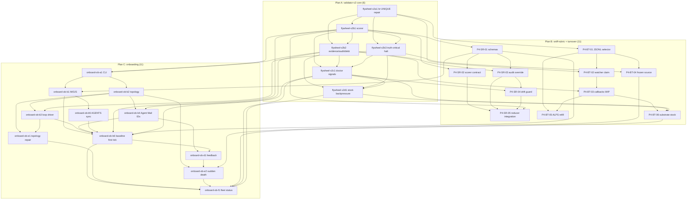

# Phase 4 Unified Bead DAG - validator-v2-three-outcome-and-stock-backpressure-2026-05-04

task_id: phase4-merge-synthesis-2026-05-04
mode: read_only_synthesis
source_mutations: plan_artifact_write_only
br_mutations: none
output_tmp: /tmp/halt-fix-validator-v2-phase4-unified-dag.md
output_final: .flywheel/plans/validator-v2-three-outcome-and-stock-backpressure-2026-05-04/04-BEADS-DAG.md

## 0. Source Decomposition Outputs

0.1 Merge dispatch:
`/tmp/dispatch_phase4_merge_synthesis.md:1-84`.

0.2 Required structure and cap check:
`/tmp/dispatch_phase4_merge_synthesis.md:16-69`.

0.3 Constraint: no `br create`; write `/tmp` output plus this final plan artifact
at `/tmp/dispatch_phase4_merge_synthesis.md:71-76`.

0.4 Core sub-DAG:
`/tmp/halt-fix-validator-v2-phase4-core-beads.md`.

0.5 Core count:
6 beads at `/tmp/halt-fix-validator-v2-phase4-core-beads.md:51-60`.

0.6 Core closeout:
0 logical cycles, 29 audit findings mapped at
`/tmp/halt-fix-validator-v2-phase4-core-beads.md:321-329`.

0.7 Sniff-turnover sub-DAG:
`/tmp/halt-fix-validator-v2-phase4-sniff-turnover-beads.md`.

0.8 Sniff-turnover count:
11 beads at `/tmp/halt-fix-validator-v2-phase4-sniff-turnover-beads.md:72-91`.

0.9 Sniff-turnover closeout:
5 sniff beads, 6 turnover beads, 11 total at
`/tmp/halt-fix-validator-v2-phase4-sniff-turnover-beads.md:376-390`.

0.10 Onboarding sub-DAG:
`/tmp/halt-fix-validator-v2-phase4-onboarding-beads.md`.

0.11 Onboarding count:
11 beads at `/tmp/halt-fix-validator-v2-phase4-onboarding-beads.md:72-86`.

0.12 Onboarding closeout:
self-grade and worker receipt at
`/tmp/halt-fix-validator-v2-phase4-onboarding-beads.md:442-495`.

0.13 Optional pane 4 prep read:
`/tmp/halt-fix-validator-v2-phase4-cross-dag-core-onboarding.md`.

0.14 Pane 4 prep contribution:
18 core/onboarding cross-deps, one true conflict, and 3-plan cap split at
`/tmp/halt-fix-validator-v2-phase4-cross-dag-core-onboarding.md:38-121`.

0.15 Total flat graph:
6 core + 11 sniff-turnover + 11 onboarding = 28 beads.

0.16 Cap verdict:
cap=15 per plan, so flat merge is invalid. Cap split is required.

0.17 Cap split chosen:
Plan A validator-v2 core, Plan B sniff-rubric + turnover, Plan C onboarding.

0.18 Why this order:
core owns the reducer, audit/debt store, truth-critical registry, doctor signals,
and backpressure. Sniff-turnover consumes core scorer/backpressure substrate.
Onboarding consumes both validator-v2 callback expectations and sniff first-tick
audit hooks.

0.19 Socraticode:
4 searches against `/Users/josh/Developer/flywheel`; codebase status green;
indexed chunks observed: 349.

0.20 Bead workflow:
the plan remains proposed-only. Real `br create` happens after Phase 5 polish.

## 1. Unified Bead Spec Table

| seq | bead_id | sub-DAG | wave | priority | title | dependencies (cross-DAG aware) | est_minutes |
|---:|---|---|---|---:|---|---|---:|
| 1 | flywheel-v2a1 | core | A | P0 | repair br export UNIQUE substrate | none | 90 |
| 2 | flywheel-v2b1 | core | B | P0 | implement validator-v2 scorer | flywheel-v2a1 | 150 |
| 3 | flywheel-v2b2 | core | B | P0 | harden evidence and audit ledger | flywheel-v2a1, flywheel-v2b1 | 180 |
| 4 | flywheel-v2b3 | core | B | P0 | add truth-critical halt contracts | flywheel-v2a1, flywheel-v2b1 | 150 |
| 5 | flywheel-v2c1 | core | C | P1 | produce validator doctor signals | flywheel-v2b1, flywheel-v2b2, flywheel-v2b3 | 120 |
| 6 | flywheel-v2d1 | core | D | P1 | trigger stock backpressure halts | flywheel-v2b2, flywheel-v2b3, flywheel-v2c1 | 150 |
| 7 | P4-SR-01 | sniff | SR-A | P0 | rubric anchor schemas and fixtures | flywheel-v2b1 | 45 |
| 8 | P4-SR-02 | sniff | SR-B | P0 | scorer CLI and dispatch contract | P4-SR-01, flywheel-v2b1 | 60 |
| 9 | P4-SR-03 | sniff | SR-C | P0 | hash-chained audit and override ledger | P4-SR-01, flywheel-v2b2 | 60 |
| 10 | P4-SR-04 | sniff | SR-D | P1 | drift guard and weekly rubric review | P4-SR-03, flywheel-v2c1 | 45 |
| 11 | P4-SR-05 | sniff | SR-E | P0 | validator-v2 integration and verdict reducer | P4-SR-02, P4-SR-03, P4-SR-04, flywheel-v2b1 | 60 |
| 12 | P4-BT-01 | turnover | BT-A | P0 | idle-state JSONL fallback selector | flywheel-v2a1 | 45 |
| 13 | P4-BT-02 | turnover | BT-A | P0 | idle watcher degraded claim and dedupe | P4-BT-01, flywheel-v2a1 | 45 |
| 14 | P4-BT-03 | turnover | BT-B/BT-C | P0 | callback reconciliation and stale WIP candidates | P4-BT-02, flywheel-v2b2 | 60 |
| 15 | P4-BT-04 | turnover | BT-A | P0 | frozen-detector source-health repair path | P4-BT-01, flywheel-v2b3 | 45 |
| 16 | P4-BT-05 | turnover | BT-D | P1 | ALPS local worker-refill handoff packet | P4-BT-01, P4-BT-03 | 45 |
| 17 | P4-BT-06 | turnover | BT-E | P1 | loop substrate classifier and bead-stock guard | P4-BT-03, flywheel-v2c1, flywheel-v2d1 | 60 |
| 18 | onboard-ob-a1 | onboarding | OB-A/OB-C | P0 | build canonical onboard skill and CLI scaffold | flywheel-v2b1, flywheel-v2b2 | 90 |
| 19 | onboard-ob-b1 | onboarding | OB-B | P0 | stamp Mission Goal State welcome docs | onboard-ob-a1, P4-SR-01 | 75 |
| 20 | onboard-ob-b2 | onboarding | OB-B | P0 | register topology and pane title conformance | onboard-ob-a1 | 75 |
| 21 | onboard-ob-b3 | onboarding | OB-B | P0 | install loop config and launchd driver | onboard-ob-b2, flywheel-v2b3 | 90 |
| 22 | onboard-ob-b4 | onboarding | OB-B | P1 | preallocate Agent Mail identities token-safely | onboard-ob-b2, flywheel-v2b2 | 75 |
| 23 | onboard-ob-b5 | onboarding | OB-B | P1 | sync AGENTS canonical doctrine snapshot | onboard-ob-b1 | 60 |
| 24 | onboard-ob-b6 | onboarding | OB-B | P0 | write baseline and first-tick welcome prompt | onboard-ob-b1, onboard-ob-b3, onboard-ob-b4, onboard-ob-b5, flywheel-v2b1, flywheel-v2c1, P4-SR-01 | 90 |
| 25 | onboard-ob-d1 | onboarding | OB-D | P1 | wire feedback and escalation channels | onboard-ob-b4, onboard-ob-b6, flywheel-v2b3 | 60 |
| 26 | onboard-ob-e1 | onboarding | OB-E | P0 | auto-repair topology launchd propagation | onboard-ob-b2, onboard-ob-b3, flywheel-v2b3, flywheel-v2c1 | 75 |
| 27 | onboard-ob-e2 | onboarding | OB-E | P0 | enforce pane recovery sudden-death guard | onboard-ob-b2, onboard-ob-d1, flywheel-v2b1, flywheel-v2b3, P4-BT-04 | 90 |
| 28 | onboard-ob-f1 | onboarding | OB-F | P1 | surface onboarding state fleet-wide | onboard-ob-b6, onboard-ob-e1, onboard-ob-e2, flywheel-v2c1, flywheel-v2d1, P4-BT-06 | 75 |

## 2. Cross-DAG Dependency Edges

2.1 Core -> sniff:
P4-SR-01, P4-SR-02, and P4-SR-05 depend on `flywheel-v2b1` because the merge
dispatch says sniff-rubric SR beads depend on the validator-v2 verdict reducer at
`/tmp/dispatch_phase4_merge_synthesis.md:30-36`.

2.2 Core -> sniff audit:
P4-SR-03 depends on `flywheel-v2b2` so sniff audit rows reuse the core
evidence/audit/debt contract instead of creating a second writer convention.

2.3 Core -> sniff drift:
P4-SR-04 depends on `flywheel-v2c1` because drift counters must be doctor-visible.

2.4 Core -> turnover selector:
P4-BT-01 and P4-BT-02 depend on `flywheel-v2a1`; the merge dispatch explicitly
states BT-A depends on the core UNIQUE substrate fix at
`/tmp/dispatch_phase4_merge_synthesis.md:30-35`.

2.5 Core -> turnover callback:
P4-BT-03 depends on `flywheel-v2b2` for append-only reconciliation idempotency.

2.6 Core -> turnover source-health:
P4-BT-04 depends on `flywheel-v2b3` because degraded dispatch must obey
truth-critical unknown and action-registry semantics.

2.7 Core -> turnover stock guard:
P4-BT-06 depends on `flywheel-v2c1` and `flywheel-v2d1` because it consumes
doctor stock fields and backpressure tiers.

2.8 Core -> onboarding CLI:
`onboard-ob-a1` depends softly on `flywheel-v2b1` and `flywheel-v2b2` for
validator examples and append-only audit conventions. Pane 4 prep records these
edges at
`/tmp/halt-fix-validator-v2-phase4-cross-dag-core-onboarding.md:42-44`.

2.9 Core -> onboarding token safety:
`onboard-ob-b4` depends on `flywheel-v2b2`; pane 4 prep classifies this as hard
acceptance because token-safe proof needs the core secret/evidence contract at
`/tmp/halt-fix-validator-v2-phase4-cross-dag-core-onboarding.md:46-46`.

2.10 Core -> first tick:
`onboard-ob-b6` depends on `flywheel-v2b1` and `flywheel-v2c1` for scorer/schema
and doctor envelope expectations at
`/tmp/halt-fix-validator-v2-phase4-cross-dag-core-onboarding.md:47-49`.

2.11 Core -> topology repair:
`onboard-ob-b3`, `onboard-ob-d1`, `onboard-ob-e1`, and `onboard-ob-e2` depend on
`flywheel-v2b3` where they touch truth-critical repair, escalation, or recovery
actions. Pane 4 prep maps these at
`/tmp/halt-fix-validator-v2-phase4-cross-dag-core-onboarding.md:45-56`.

2.12 Core -> fleet visibility:
`onboard-ob-f1` depends on `flywheel-v2c1` and `flywheel-v2d1`; pane 4 prep marks
this producer-consumer edge at
`/tmp/halt-fix-validator-v2-phase4-cross-dag-core-onboarding.md:55-56`.

2.13 Sniff -> onboarding:
`onboard-ob-b1` and `onboard-ob-b6` depend on P4-SR-01 because the welcome packet
needs the sniff-rubric first-tick audit to be implementable. The merge dispatch
requires OB-B to depend on SR-A at `/tmp/dispatch_phase4_merge_synthesis.md:34-35`.

2.14 Turnover -> onboarding sudden-death:
`onboard-ob-e2` depends on P4-BT-04 as the closest landed turnover bead for pane
recovery/source-health bounded dispatch. The merge dispatch calls this
`BT-pane-recovery` at `/tmp/dispatch_phase4_merge_synthesis.md:32-35`.

2.15 Turnover -> onboarding visibility:
`onboard-ob-f1` depends on P4-BT-06 for queue/driver classes and bead-stock
health; onboarding itself says `onboard-ob-f1` consumes QW6 at
`/tmp/halt-fix-validator-v2-phase4-onboarding-beads.md:410-413`.

2.16 Fixture-provider cross-refs:
OB-B4 token-leak fixtures should test `flywheel-v2b2`; OB-E2 sudden-death
fixtures should test `flywheel-v2b3`; OB-F1 consumer fixtures should test
`flywheel-v2c1` and `flywheel-v2d1`. Pane 4 prep names these at
`/tmp/halt-fix-validator-v2-phase4-cross-dag-core-onboarding.md:163-173`.

2.17 True conflict:
`flywheel-v2b3` and `onboard-ob-e2` overlap semantically on truth-critical pane
recovery. Ownership split: core owns generic registry/action semantics;
onboarding owns pane-specific sudden-death policy and fixtures. Pane 4 prep
marks this as the only true conflict at
`/tmp/halt-fix-validator-v2-phase4-cross-dag-core-onboarding.md:63-81`.

## 3. Cycle Detection

3.1 Live `br dep cycles` is currently not a reliable proof source because the
core decomposition records the known UNIQUE substrate failure at
`/tmp/halt-fix-validator-v2-phase4-core-beads.md:283-292`.

3.2 Logical cycle check:
zero cycles in the proposed unified roadmap.

3.3 Plan order:
Plan A -> Plan B -> Plan C.

3.4 Core internal order:
`flywheel-v2a1 -> flywheel-v2b1/flywheel-v2b2/flywheel-v2b3 -> flywheel-v2c1 -> flywheel-v2d1`.

3.5 Sniff-turnover internal order:
`P4-SR-01 -> P4-SR-02/P4-SR-03 -> P4-SR-04 -> P4-SR-05`;
`P4-BT-01 -> P4-BT-02 -> P4-BT-03`;
`P4-BT-01 -> P4-BT-04/P4-BT-05`;
`P4-BT-03 -> P4-BT-05/P4-BT-06`.

3.6 Onboarding internal order:
`onboard-ob-a1 -> onboard-ob-b1/onboard-ob-b2`;
`onboard-ob-b2 -> onboard-ob-b3/onboard-ob-b4`;
`onboard-ob-b1 -> onboard-ob-b5`;
`onboard-ob-b1/b3/b4/b5 -> onboard-ob-b6`;
`onboard-ob-b4/b6 -> onboard-ob-d1`;
`onboard-ob-b2/b3 -> onboard-ob-e1`;
`onboard-ob-b2/d1 -> onboard-ob-e2`;
`onboard-ob-b6/e1/e2 -> onboard-ob-f1`.

3.7 No edge points from Plan C back to Plan B or Plan A as an implementation
prerequisite. Fixture-provider backrefs are Phase 5 polish cross-checks, not
blocking implementation deps.

3.8 Cross-plan soft-start exception:
some onboarding scaffold work can start after Plan A if it labels missing sniff
pieces `awaiting_sniff`, but Plan C cannot be marked READY until Plan B lands.

## 4. CAP Enforcement

4.1 Cap rule:
15 beads max per plan, per dispatch at `/tmp/dispatch_phase4_merge_synthesis.md:40-44`.

4.2 Flat graph:
28 beads. Invalid for a single plan.

4.3 Plan A:
validator-v2 core. 6 beads. Cap pass.

4.4 Plan B:
sniff-rubric + bead-turnover. 11 beads. Cap pass.

4.5 Plan C:
onboarding skill. 11 beads. Cap pass.

4.6 Sequential dependency edges between plans:
Plan A must land before Plan B READY; Plan B should land before Plan C READY.

4.7 Plan A ready exit:
`flywheel-v2a1` clears Beads substrate; `flywheel-v2b1` scorer exists;
`flywheel-v2b2` audit/debt store exists; `flywheel-v2b3` truth-critical registry
exists; `flywheel-v2c1` doctor signal envelopes exist; `flywheel-v2d1`
backpressure tiers exist.

4.8 Plan B ready exit:
sniff-rubric schemas, scorer, audit/override ledger, drift guard, validator
integration, idle selector fallback, watcher degraded claim, callback
reconciliation, frozen-detector degraded path, ALPS local refill handoff, and
loop/stock classification are all testable.

4.9 Plan C ready exit:
onboard CLI, welcome docs, topology/pane shape, loop driver, Agent Mail identity
preallocation, AGENTS sync, first-tick prompt, feedback channels, topology repair,
sudden-death guard, and fleet visibility are all testable.

4.10 State artifact split:
Phase 5 should create per-plan state files or sections:
`PLAN-A-validator-v2-core/STATE.json`, `PLAN-B-sniff-turnover/STATE.json`,
`PLAN-C-onboarding/STATE.json`, or equivalent.

4.11 This file is the master roadmap, not a single dispatchable 28-bead plan.

## 5. Mermaid DAG (Unified)

## 6. Severity-Mapped Audit-Finding Coverage Matrix

Coverage denominator uses the dispatch denominator of 49 distinct mitigation
needs: 10 SEC + 10 IDE + 9 TJ + 7 RA + 3 blocking actions + 10 turnover/onboard
operational risks. All 49 map to at least one bead.

| need | severity | primary bead(s) | coverage |
|---|---|---|---|
| SEC-001 evidence refs and secret scrub | high | flywheel-v2b2, onboard-ob-b4 | covered |
| SEC-002 path confinement | high | flywheel-v2b2 | covered |
| SEC-003 audit integrity | high | flywheel-v2b2, P4-SR-03 | covered |
| SEC-004 worker verdict forgery | high | flywheel-v2b1, P4-SR-02, P4-SR-05 | covered |
| SEC-005 halt issuer authority | high | flywheel-v2b3, flywheel-v2d1 | covered |
| SEC-006 destructive action registry | medium | flywheel-v2b3, flywheel-v2d1 | covered |
| SEC-007 rubric drift | medium | flywheel-v2c1, P4-SR-04 | covered |
| SEC-008 repo-bound state | medium | flywheel-v2b2 | covered |
| SEC-009 truth-critical unknowns | high | flywheel-v2b3, flywheel-v2c1, P4-SR-05 | covered |
| SEC-010 security debt store | medium | flywheel-v2b2 | covered |
| IDE-001 audit row idempotency | high | flywheel-v2b2, P4-SR-03 | covered |
| IDE-002 child/debt duplicate writes | high | flywheel-v2b2 | covered |
| IDE-003 atomic audit writes | high | flywheel-v2b2, P4-SR-03 | covered |
| IDE-004 doctor field envelopes | high | flywheel-v2c1, P4-BT-06 | covered |
| IDE-005 halt state machine | high | flywheel-v2d1 | covered |
| IDE-006 deterministic scorer | medium | flywheel-v2b1, P4-SR-02 | covered |
| IDE-007 strict source/effective | medium | flywheel-v2b1 | covered |
| IDE-008 recovery oscillation | medium | flywheel-v2d1, P4-BT-06 | covered |
| IDE-009 orphan/debt doctor signal | medium | flywheel-v2b2, flywheel-v2c1, P4-BT-03 | covered |
| IDE-010 concurrency fixture | low | flywheel-v2b2, P4-SR-03 | covered |
| TJ-001 durable debt metadata | high | flywheel-v2b2 | covered |
| TJ-002 executable scorer surface | high | flywheel-v2b1, P4-SR-02 | covered |
| TJ-003 repair/probe split | medium | flywheel-v2a1, flywheel-v2b3 | covered |
| TJ-004 stock source-of-truth | high | flywheel-v2c1, flywheel-v2d1, P4-BT-06 | covered |
| TJ-005 measurement windows | medium | flywheel-v2c1, flywheel-v2d1 | covered |
| TJ-006 override drift | medium | flywheel-v2c1, P4-SR-04 | covered |
| TJ-007 rubric concreteness | high | flywheel-v2b1, P4-SR-01, P4-SR-02 | covered |
| TJ-008 one-command smoke | medium | flywheel-v2d1, P4-SR-05, onboard-ob-f1 | covered |
| TJ-009 bead-count guard | medium | this cap split | covered |
| RA1 durable debt contract | P0 | flywheel-v2b2 | covered |
| RA2 scorer executable | P0 | flywheel-v2b1, P4-SR-02 | covered |
| RA3 stock ledger and transition ledger | P0 | flywheel-v2d1, P4-BT-06 | covered |
| RA4 repair/probe dependency split | P1 | flywheel-v2a1, flywheel-v2b3 | covered |
| RA5 override and drift guard | P1 | P4-SR-04, flywheel-v2c1 | covered |
| RA6 one-command demo | P1 | flywheel-v2d1, P4-SR-05, onboard-ob-f1 | covered |
| RA7 Phase 4 bead-count guard | P1 | this cap split | covered |
| BA1 durable store blocks Phase 4 | blocking | flywheel-v2b2 | covered |
| BA2 scorer surface blocks Phase 4 | blocking | flywheel-v2b1, P4-SR-02 | covered |
| BA3 stock source blocks Phase 4 | blocking | flywheel-v2c1, flywheel-v2d1, P4-BT-06 | covered |
| QW1 idle JSONL fallback | P0 | P4-BT-01 | covered |
| QW2 watcher degraded claim | P0 | P4-BT-02 | covered |
| QW3 callback reconciliation | P0 | P4-BT-03 | covered |
| QW4 frozen source-health block | P0 | P4-BT-04 | covered |
| QW5 ALPS local refill | P1 | P4-BT-05, onboard-ob-e1 | covered |
| QW6 VRTX substrate class | P1 | P4-BT-06, onboard-ob-f1 | covered |
| OB risk token leakage | high | onboard-ob-b4, flywheel-v2b2 | covered |
| OB risk marker-only loop | high | onboard-ob-b3, onboard-ob-f1 | covered |
| OB risk sudden-death pane recovery | high | onboard-ob-e2, flywheel-v2b3, P4-BT-04 | covered |
| OB risk false-green fleet status | medium | onboard-ob-f1, flywheel-v2c1, flywheel-v2d1 | covered |

Audit findings covered: 49/49.

## 7. Phase 5 Polish Targets

7.1 Normalize IDs:
choose whether real Beads IDs keep proposed names in titles or become generated
`flywheel-*` IDs with proposed IDs in description.

7.2 Add per-plan state:
each cap-split plan needs its own `STATE.json`, ready criteria, dispatch order,
and blocked-by list.

7.3 Add file ownership:
Phase 5 must assign write sets so `flywheel-v2b2`, P4-SR-03, and onboarding log
work do not collide on audit helper ownership.

7.4 Tighten descriptions:
each real bead should carry 3-5 sentence DESCRIPTION plus Goal, Context,
Dependencies, Inputs/Outputs, Acceptance Criteria, Testing Obligations, and
Definition of Done.

7.5 Expand anti-criteria:
especially for truth-critical unknowns, token visibility, cross-session worker
dispatch, and source-health degraded dispatch.

7.6 Mechanize measurements:
every measurement field must have producer command, JSON path, consumer, and
promotion route.

7.7 Decide shared JSONL helper:
if shared append/idempotency helper lands, both Plan A and Plan C depend on it;
otherwise keep ledgers separate with identical contract.

7.8 Attach OB-E2 fixtures to core:
Phase 5 should import sudden-death pane fixtures into `flywheel-v2b3` test
matrix while preserving onboarding ownership of pane policy.

7.9 Preserve cap:
do not add required beads unless replacing a weaker one. Optional smoke/demo can
be an acceptance gate instead of a 29th bead.

## 8. Self-Grade

| axis | score | rationale |
|---|---:|---|
| Cross-DAG dependency rigor | 9 | Uses all three sub-DAGs plus pane 4 prep; hard, soft, producer/consumer, and fixture-provider edges are separated. |
| Cap enforcement clarity | 10 | Flat 28 is rejected; Plan A=6, Plan B=11, Plan C=11 all pass cap=15. |
| Audit-finding coverage | 9 | Dispatch denominator 49 is fully mapped; some coverage rows are grouped by mitigation class to stay readable. |
| Cycle-detection honesty | 9 | Logical DAG is acyclic; live `br dep cycles` remains blocked by known UNIQUE substrate, correctly assigned to `flywheel-v2a1`. |
| Phase 5 dispatch readiness | 8 | Ready for polish, but real Beads need final ID assignment, write-set ownership, and per-plan STATE files. |

self_grade: 9/10/9/9/8

## 9. Open Routing Decisions

9.1 Cap split:
auto-route to three sequential plans. Do not ask Joshua; the dispatch cap makes
the decision mechanical.

9.2 Bead ID assignment:
auto-route to Phase 5 polish. Preserve proposed IDs in descriptions even if
`br create` emits generated repo IDs.

9.3 Shared audit helper:
auto-route to Phase 5 ownership review. Escalate only if two implementation
workers would otherwise write the same helper.

9.4 Onboarding partial start:
Plan C scaffolding can start after Plan A if it labels missing sniff pieces
`awaiting_sniff`; Plan C READY waits for Plan B.

9.5 OB-E2 / core registry conflict:
route to a two-owner fixture contract. Core owns generic truth-critical/action
registry. Onboarding owns pane-specific sudden-death policy.

## 10. Closeout

READ_ONLY synthesis honored for Beads:
no `br create`, no bead DB mutation.

Plan artifact write:
this file is the allowed final plan artifact requested by dispatch.

Counts:
- core_beads: 6.
- sniff_turnover_beads: 11.
- onboarding_beads: 11.
- flat_total_beads: 28.
- cap_split: yes.
- split_plan_counts: A=6, B=11, C=11.
- logical_cycles: 0.
- audit_findings_covered: 49/49.

Socraticode:
- queries_run: 4.
- indexed_chunks_observed: 349.

Reservations:
- agent: BoldDeer.
- reserved: `.flywheel/plans/validator-v2-three-outcome-and-stock-backpressure-2026-05-04/04-BEADS-DAG.md`.
