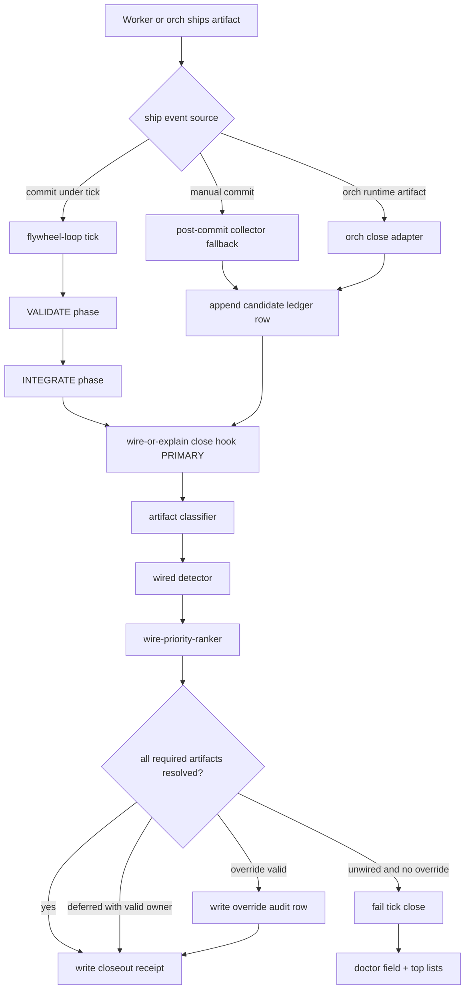
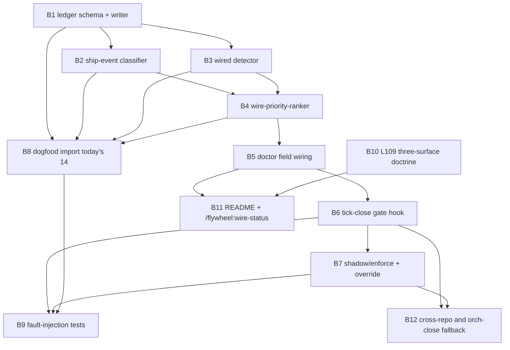

## Contents

- [1. Executive summary](#1-executive-summary)
- [2. Source findings absorbed](#2-source-findings-absorbed)
- [3. Gate truth separation](#3-gate-truth-separation)
- [4. Architecture decision](#4-architecture-decision)
- [5. Lifecycle placement diagram](#5-lifecycle-placement-diagram)
- [6. CLI surface](#6-cli-surface)
- [7. Gate algorithm](#7-gate-algorithm)
- [8. Artifact classes](#8-artifact-classes)
- [9. Ledger schema](#9-ledger-schema)
- [10. Validator](#10-validator)
- [11. Append-only and compaction strategy](#11-append-only-and-compaction-strategy)
- [12. Doctor field surfaces](#12-doctor-field-surfaces)
  - [12.1 `wire_or_explain_ledger_present`](#12-1-wire-or-explain-ledger-present)
  - [12.2 `unwired_artifact_count_24h`](#12-2-unwired-artifact-count-24h)
  - [12.3 `wire_deferred_count_24h`](#12-3-wire-deferred-count-24h)
  - [12.4 `wire_deferred_median_age_hours`](#12-4-wire-deferred-median-age-hours)
  - [12.5 `wire_deferred_overdue_count`](#12-5-wire-deferred-overdue-count)
  - [12.6 `wire_or_explain_top_unwired_class`](#12-6-wire-or-explain-top-unwired-class)
  - [12.7 `unwired_artifact_top_5_oldest`](#12-7-unwired-artifact-top-5-oldest)
  - [12.8 `unwired_artifact_top_5_highest_downstream_cost`](#12-8-unwired-artifact-top-5-highest-downstream-cost)
  - [12.9 `wire_or_explain_ledger_freshness_seconds`](#12-9-wire-or-explain-ledger-freshness-seconds)
  - [12.10 `wire_or_explain_ledger_row_count_24h`](#12-10-wire-or-explain-ledger-row-count-24h)
  - [12.11 `wire_or_explain_ledger_row_count_7d`](#12-11-wire-or-explain-ledger-row-count-7d)
  - [12.12 `wire_or_explain_shadow_mode`](#12-12-wire-or-explain-shadow-mode)
  - [12.13 Summary packet](#12-13-summary-packet)
- [13. Doctor error and warning policy](#13-doctor-error-and-warning-policy)
- [14. List-and-sort primitive](#14-list-and-sort-primitive)
- [15. Wired detector design](#15-wired-detector-design)
- [16. Override design](#16-override-design)
- [17. Failure modes and mitigations](#17-failure-modes-and-mitigations)
  - [17.1 Slow consumer-discovery](#17-1-slow-consumer-discovery)
  - [17.2 False positive](#17-2-false-positive)
  - [17.3 False negative](#17-3-false-negative)
  - [17.4 Bottleneck on every commit](#17-4-bottleneck-on-every-commit)
  - [17.5 Recursion](#17-5-recursion)
- [18. Shadow to enforcing rollout](#18-shadow-to-enforcing-rollout)
- [19. Dogfood plan](#19-dogfood-plan)
- [20. Fault-injection tests](#20-fault-injection-tests)
- [21. Phase 4 bead DAG](#21-phase-4-bead-dag)
- [22. Open risks](#22-open-risks)
- [23. Joshua questions](#23-joshua-questions)
- [24. Recommended decision](#24-recommended-decision)
- [25. Acceptance summary](#25-acceptance-summary)
- [Convergence with sub-agent Lane C](#convergence-with-sub-agent-lane-c)
# 01-RESEARCH-C-codex - Lane C Implementation Design

Plan: `wire-or-explain-tick-gate-2026-05-04`
Phase: `1.RESEARCH`
Lane: `C implementation design`
Trace: Codex independent parallel lane
Date: 2026-05-04
Mode: read-only design draft for Joshua review

## 1. Executive summary

This lane specifies the `wire-or-explain` gate: a tick-close rule that prevents
the loop from claiming completion while newly shipped artifacts have no
consumer, no deferred owner, and no durable explanation.

The failure class is not "missing documentation" and not "bad commit hygiene."
It is a feedback-loop failure:

- The fleet shipped probes, rules, and dashboard surfaces.
- The tick loop recorded that they existed.
- Nothing forced the tick loop to consume them.
- The next tick could still report healthy progress.

The stock that rises is `unwired-output backlog`.

The primary gate should sit at:

`flywheel-loop tick` close hook, after `VALIDATE` and before the closeout
receipt can mark the tick done.

The secondary fallback should be:

a non-blocking post-commit ship-event collector that writes candidate rows to
the `wire-or-explain` ledger but never blocks `git commit`.

I do not recommend a blocking pre-commit hook. Pre-commit cannot know whether a
new probe is wired into a tick handler, a launchd job, a slash command, an
Agent Mail callback, or a cross-repo consumer. It would either block too much
or encode weak string heuristics that create false confidence.

I do recommend an orch close hook that calls the same tick-close gate. It should
not be a separate primary gate. The operator-facing invariant is one gate:

```text
No tick closes green until every shipped artifact is wired or explained.
```

CoralRaven's ALPS reports provide the convergent frame:

- Refuse-gates exist; permit-gates are missing.
- Mission lock should license tactical action inside the envelope.
- The system needs list-and-sort answers, not binary "this one thing passed."
- The defect survives compaction unless it becomes substrate.

Lane C therefore designs `wire-or-explain` as a flow gate. It measures whether
new work has a downstream path, not whether the work exists.

## 2. Source findings absorbed

Read-first sources used:

- `.flywheel/plans/wire-or-explain-tick-gate-2026-05-04/00-INTENT.md`
- `/Users/josh/Developer/alpsinsurance/.flywheel/reports/2026-05-04-vercel-blocker-deep-dive.md`
- `/Users/josh/Developer/alpsinsurance/.flywheel/reports/2026-05-04-meta-failure-why-orchestrator-cannot-decide.md`
- `.flywheel/plans/orch-monitor-recovery-auto-act-2026-05-04/01-RESEARCH-C.md`

Socraticode constraints used:

- Existing tick script already has `VALIDATE` and `INTEGRATE` phases.
- `tests/validate-tick-phase.sh` proves phase selection and receipt fields are
  testable with fixtures.
- `flywheel-loop doctor --json` already exposes validation-derived fields such
  as `surfaces_unwired_count`, `ticks_punted_count`, and three-Q failures.
- `.flywheel/scripts/three-q-surface-audit.py` already models validated,
  documented, and surfaced rows with evidence references.
- `tests/doctor-validation-signals.sh` already asserts doctor fields with
  producer, measurement, consumer, and promotion path metadata.

Skill constraints used:

- `donella-meadows-systems-thinking`: intervene at Meadows #5 rules and #6
  information flow; measure the stock.
- `gate-truth-separation`: keep process, flow, and safety gates separate.
- `observability-platform`: make the gate's ledger queryable and bounded.
- `dispatch-tool-contracts`: machine-check callback fields and evidence.
- `canonical-cli-scoping`: give the gate doctor, health, validate, audit, why,
  schema, examples, dry-run, and apply surfaces.
- `jeff-convergence-audit`: do not bead-decompose until convergence.
- `lean-formal-feedback-loop`: treat proof friction as evidence; keep the
  invariant explicit and testable.

## 3. Gate truth separation

`wire-or-explain` is a flow gate.

It answers:

```text
Did the shipped artifact enter at least one downstream consumer loop, or is
there a durable deferred decision explaining when and why it will?
```

It does not answer:

- Code correctness.
- Production safety.
- Security approval.
- Test coverage adequacy.
- Whether Joshua likes the direction.
- Whether a deployment should happen.

Gate classes:

| Gate layer | Question | Example signal | Owner |
|---|---|---|---|
| Code gate | Does the file parse and tests pass? | `bash -n`, unit tests | worker |
| Process gate | Did the worker callback arrive and validate? | validation receipt | orchestrator |
| Flow gate | Is the artifact consumed downstream? | `wire-or-explain` row | tick close hook |
| Safety gate | Is action allowed? | DCG, secret gate | safety substrate |
| Mission gate | Is tactical work inside lock? | license gate | dispatch substrate |

The old failure collapsed code/process success into flow success. A script could
exist, parse, and have tests, yet remain unused by tick, doctor, dispatch, or
launchd.

## 4. Architecture decision

Primary gate:

`flywheel-loop tick` close hook.

Placement:

- After `VALIDATE` and `INTEGRATE` work has produced ship events.
- Before `.flywheel/last_closeout_receipt.json` can be written as green.
- Before `STATE.md` records a final "tick complete" line.
- Before the tick callback claims `status=done`.

Secondary fallback:

post-commit ship-event collector.

Fallback behavior:

- Runs after commit, or via periodic scan, in non-blocking mode.
- Detects candidate ship events from `git diff-tree`, commit message trailers,
  and changed paths.
- Appends `resolution=unwired` candidates when no matching ledger row exists.
- Does not block `git commit`.
- Does not decide wiring.
- Provides inputs to the next tick-close gate.

Orch close integration:

- `orch-tick-supervision-handler` should call the same gate at close.
- It should not maintain separate semantics.
- The orch handler can add live fleet artifacts that have no commit event.

Rejected primary options:

- Pre-commit hook: too early; high false-positive risk; no cross-repo context.
- Blocking post-commit hook: too late for clean operator UX and can wedge git.
- Background daemon only: repeats the observatory mistake by measuring outside
  the tick without forcing the tick to act.
- Manual closeout checklist: recreates the human-vigilance failure.

## 5. Lifecycle placement diagram



## 6. CLI surface

Primary CLI:

```bash
.flywheel/scripts/wire-or-explain-gate.sh
```

Canonical command shape:

```bash
.flywheel/scripts/wire-or-explain-gate.sh --info --json
.flywheel/scripts/wire-or-explain-gate.sh --schema --json
.flywheel/scripts/wire-or-explain-gate.sh --examples --json
.flywheel/scripts/wire-or-explain-gate.sh doctor --repo "$REPO" --json
.flywheel/scripts/wire-or-explain-gate.sh health --repo "$REPO" --json
.flywheel/scripts/wire-or-explain-gate.sh validate --repo "$REPO" --since "$SHA" --json
.flywheel/scripts/wire-or-explain-gate.sh rank --repo "$REPO" --json
.flywheel/scripts/wire-or-explain-gate.sh audit --repo "$REPO" --json
.flywheel/scripts/wire-or-explain-gate.sh why --ship-event-id <id> --json
.flywheel/scripts/wire-or-explain-gate.sh repair --repo "$REPO" --dry-run --json
.flywheel/scripts/wire-or-explain-gate.sh repair --repo "$REPO" --apply --idempotency-key <key> --json
.flywheel/scripts/wire-or-explain-gate.sh close-hook --repo "$REPO" --tick-id <id> --mode shadow --json
.flywheel/scripts/wire-or-explain-gate.sh close-hook --repo "$REPO" --tick-id <id> --mode enforce --json
```

Post-commit fallback:

```bash
.flywheel/scripts/wire-or-explain-ship-event-collector.sh --repo "$REPO" --commit "$SHA" --json
```

Dogfood importer:

```bash
.flywheel/scripts/wire-or-explain-dogfood-import.sh --repo /Users/josh/Developer/flywheel --date 2026-05-04 --dry-run --json
.flywheel/scripts/wire-or-explain-dogfood-import.sh --repo /Users/josh/Developer/flywheel --date 2026-05-04 --apply --json
```

Operator slash surface:

```text
/flywheel:wire-status
```

It should render the ranked list, not a binary verdict.

## 7. Gate algorithm

Tick-close pseudo-code:

```bash
wire_or_explain_close_hook() {
  tick_id="$1"
  repo="$2"
  mode="${WIRE_OR_EXPLAIN_MODE:-shadow}"
  ship_events="$(collect_ship_events --repo "$repo" --tick-id "$tick_id")"
  existing_rows="$(read_wire_ledger --repo "$repo")"
  classified="$(classify_ship_events "$ship_events")"
  resolved="$(detect_wiring "$classified" "$existing_rows")"
  ranked="$(wire_priority_ranker "$resolved")"
  append_ledger_rows "$ranked"
  doctor_summary="$(summarize_for_doctor "$ranked")"
  if has_unresolved_required "$ranked"; then
    if valid_override_present; then
      append_override_audit "$ranked"
      return 0
    fi
    if [[ "$mode" == "shadow" ]]; then
      return 0
    fi
    write_failed_tick_receipt "$doctor_summary"
    return 74
  fi
  return 0
}
```

Closeout receipt contract:

```json
{
  "wire_or_explain": {
    "schema_version": "wire-or-explain-closeout/v1",
    "mode": "shadow|enforce",
    "ship_events_checked": 0,
    "unwired_artifact_count_24h": 0,
    "wire_deferred_count_24h": 0,
    "top_unwired": [],
    "top_deferred": [],
    "gate_status": "pass|warn|fail|override"
  }
}
```

## 8. Artifact classes

The classifier should start conservative and explicit.

| Artifact class | Ship detection | Wired means |
|---|---|---|
| `shell_script` | changed executable under `.flywheel/scripts/` or `tests/` | called by tick, doctor, slash command, launchd, test, dispatch template, or another script |
| `doctor_field` | `flywheel-loop doctor` field added or test references field | field is surfaced in strict/warn thresholds and docs/status if operator-facing |
| `l_rule` | `AGENTS.md`, canonical, or template rule block changed | rule exists on all three doctrine surfaces or has deferred propagation row |
| `slash_command` | command md under `~/.claude/commands` or repo command template | command routes to executable substrate and has smoke command |
| `launchd_plist` | plist under LaunchAgents/template paths | loaded or documented as installable with validation command |
| `hook` | hook file or hook config changed | hook installed, tested, and represented in doctor or hook parity probe |
| `skill` | `SKILL.md` or skill reference changed | skill indexed/available and has usage surface or deliberate reference-only status |
| `memory_file` | feedback or memory artifact written | read by a known hook, router, dispatch template, or explicit human-only reason |
| `plan_artifact` | `.flywheel/plans/**` created | promoted to bead DAG, reviewed, or deferred until phase gate |
| `bead` | `.beads/issues.jsonl` new/closed row | has dependency or dispatch route; closed beads have evidence scan pass |
| `dashboard` | status or aggregate output changed | consumed by tick handler, doctor, status, or explicit manual-dashboard reason |
| `cross_repo_artifact` | path outside repo changed from tick | local ledger row points to remote consumer or remote deferred row |

## 9. Ledger schema

Ledger path:

`~/.local/state/flywheel/wire-or-explain-ledger.jsonl`

Each row is append-only JSONL.

Required base fields:

```json
{
  "schema_version": "wire-or-explain-ledger/v1",
  "ts": "<iso>",
  "ship_event_id": "<hash>",
  "artifact_class": "<class>",
  "artifact_path": "<abs>",
  "ship_commit": "<sha>",
  "ship_actor": "<orch_or_worker_identity>",
  "resolution": "wired|deferred|unwired",
  "evidence_command": "<CLI>",
  "evidence_output_hash": "<sha256>",
  "verified_at": "<iso>"
}
```

Required when `resolution=wired`:

```json
{
  "wired_into": "<file:line>",
  "consumer_class": "tick|doctor|launchd|slash|dispatch-template|hook|skill-router|manual",
  "consumer_probe": "<CLI>",
  "consumer_probe_hash": "<sha256>"
}
```

Required when `resolution=deferred`:

```json
{
  "deferred_until": "<bead|iso>",
  "deferred_reason": "<one line>",
  "deferred_owner": "<session:pane|bead|human>",
  "deferred_created_at": "<iso>"
}
```

Required when `resolution=unwired`:

```json
{
  "unwired_reason": "<class>",
  "priority_score": 0,
  "priority_components": {
    "age_hours": 0,
    "ship_cost_loc": 0,
    "downstream_dep_count": 0,
    "class_weight": 0
  }
}
```

Optional fields:

```json
{
  "tick_id": "<id>",
  "repo": "<abs>",
  "artifact_id": "<stable id>",
  "artifact_digest": "sha256:<hash>",
  "ship_loc_added": 0,
  "ship_loc_changed": 0,
  "downstream_refs": [],
  "suspected_consumers": [],
  "override": null,
  "supersedes_ship_event_id": null,
  "notes": []
}
```

Row identity:

```text
ship_event_id = sha256(repo + "\0" + artifact_path + "\0" + artifact_digest + "\0" + ship_commit)
```

Latest state is computed by latest row per `ship_event_id`, then by
`supersedes_ship_event_id` chains for reclassification.

## 10. Validator

Minimal jq validator:

```bash
jq -e '
  .schema_version == "wire-or-explain-ledger/v1"
  and (.ts | type == "string")
  and (.ship_event_id | type == "string" and length > 16)
  and (.artifact_class | type == "string" and length > 0)
  and (.artifact_path | type == "string" and startswith("/"))
  and (.ship_actor | type == "string" and length > 0)
  and (.resolution | IN("wired","deferred","unwired"))
  and (.evidence_command | type == "string" and length > 0)
  and (.evidence_output_hash | type == "string" and test("^sha256:"))
  and (.verified_at | type == "string")
  and (
    (.resolution == "wired" and (.wired_into | type == "string" and length > 0))
    or (.resolution == "deferred" and (.deferred_until | type == "string" and length > 0) and (.deferred_reason | type == "string" and length > 15))
    or (.resolution == "unwired" and (.unwired_reason | type == "string" and length > 0))
  )
'
```

Strict validator additions:

- `ship_commit` must be a 7 to 40 character hex string or `runtime`.
- `artifact_class` must be in the known class list.
- `deferred_until` must be an open bead id or a future ISO timestamp.
- `wired_into` must reference an existing path and a line range when local.
- `evidence_command` must be re-runnable in read-only mode.
- `evidence_output_hash` must match current output in strict mode unless the
  row is older than the compaction window.

## 11. Append-only and compaction strategy

Append-only invariants:

- Never rewrite historical rows.
- Never delete override rows.
- Never mutate `resolution` in place.
- Reclassification appends a new row with the same `ship_event_id`.
- Supersession appends a new row with `supersedes_ship_event_id`.

Compaction:

- Raw ledger remains append-only for 30 days minimum.
- A daily derived snapshot may be written to:

`~/.local/state/flywheel/wire-or-explain-state.json`

- Snapshot contains latest rows, top ranked unresolved rows, and overdue
  deferred rows.
- Snapshot is disposable and can be regenerated.
- Compaction writes a receipt:

`~/.local/state/flywheel/wire-or-explain-compaction.jsonl`

Compaction command:

```bash
.flywheel/scripts/wire-or-explain-gate.sh compact --dry-run --json
.flywheel/scripts/wire-or-explain-gate.sh compact --apply --idempotency-key <key> --json
```

## 12. Doctor field surfaces

All fields live at top level in `flywheel-loop doctor --json`, with detail under
`.wire_or_explain`.

### 12.1 `wire_or_explain_ledger_present`

Jq path:

```jq
.wire_or_explain.ledger_present
```

Threshold:

- `false` in shadow mode: warning.
- `false` in enforcing mode: error.

Status colors:

- green: true.
- yellow: false while `mode=shadow`.
- red: false while `mode=enforce`.

### 12.2 `unwired_artifact_count_24h`

Jq path:

```jq
.wire_or_explain.unwired_artifact_count_24h
```

Threshold:

- `0`: green.
- `1..4`: yellow in shadow, red in enforce.
- `>=5`: red in all modes.

Errors injection:

```jq
select(.unwired_artifact_count_24h > 0 and .wire_or_explain.mode == "enforce")
```

### 12.3 `wire_deferred_count_24h`

Jq path:

```jq
.wire_or_explain.wire_deferred_count_24h
```

Threshold:

- `0..3`: green.
- `4..10`: yellow.
- `>10`: red.

Rationale:

Deferral is allowed, but a rising deferral stock means the gate is becoming a
parking lot.

### 12.4 `wire_deferred_median_age_hours`

Jq path:

```jq
.wire_or_explain.wire_deferred_median_age_hours
```

Threshold:

- `<24`: green.
- `24..72`: yellow.
- `>72`: red.

### 12.5 `wire_deferred_overdue_count`

Jq path:

```jq
.wire_or_explain.wire_deferred_overdue_count
```

Threshold:

- `0`: green.
- `>=1`: red.

Errors injection:

```jq
select(.wire_deferred_overdue_count > 0)
```

### 12.6 `wire_or_explain_top_unwired_class`

Jq path:

```jq
.wire_or_explain.top_unwired_class
```

Threshold:

- informational if count is zero.
- yellow/red follows `unwired_artifact_count_24h`.

Purpose:

This directs repair work. Example classes: `shell_script`, `l_rule`,
`doctor_field`, `memory_file`.

### 12.7 `unwired_artifact_top_5_oldest`

Jq path:

```jq
.wire_or_explain.unwired_artifact_top_5_oldest
```

Threshold:

- informational list when total count is zero.
- required non-empty list when `unwired_artifact_count_24h > 0`.
- doctor error if count > 0 and list is empty.

Sort:

```text
age_hours desc, priority_score desc
```

### 12.8 `unwired_artifact_top_5_highest_downstream_cost`

Jq path:

```jq
.wire_or_explain.unwired_artifact_top_5_highest_downstream_cost
```

Threshold:

- informational list when total count is zero.
- required non-empty list when count > 0.
- doctor error if ranking cannot compute cost.

Sort:

```text
downstream_dep_count desc, ship_cost_loc desc, age_hours desc
```

### 12.9 `wire_or_explain_ledger_freshness_seconds`

Jq path:

```jq
.wire_or_explain.ledger_freshness_seconds
```

Threshold:

- `<300`: green.
- `300..3600`: yellow.
- `>3600` with a non-empty ledger: red.

Purpose:

Proves the emitter and close-hook are still writing, not just installed.

### 12.10 `wire_or_explain_ledger_row_count_24h`

Jq path:

```jq
.wire_or_explain.ledger_row_count_24h
```

Threshold:

- informational when no commits shipped.
- warning when commits exist in the last 24 hours and row count is zero.

Purpose:

Detects false-negative class where the collector missed ship events.

### 12.11 `wire_or_explain_ledger_row_count_7d`

Jq path:

```jq
.wire_or_explain.ledger_row_count_7d
```

Threshold:

- informational.
- used for Day 7 flip criteria.

Purpose:

Prevents enforcing before the gate has seen enough traffic to calibrate.

### 12.12 `wire_or_explain_shadow_mode`

Jq path:

```jq
.wire_or_explain.shadow_mode
```

Threshold:

- informational in normal doctor.
- strict doctor warns if shadow mode remains after Day 7 without a rollback or
  explicit extension row.

Purpose:

Makes rollout state visible so the gate does not stay permanently advisory.

### 12.13 Summary packet

Doctor detail shape:

```json
{
  "wire_or_explain": {
    "schema_version": "wire-or-explain-doctor/v1",
    "mode": "shadow|enforce",
    "ledger": "/Users/josh/.local/state/flywheel/wire-or-explain-ledger.jsonl",
    "ledger_present": true,
    "ledger_freshness_seconds": 0,
    "ledger_valid_rows": 0,
    "ledger_invalid_rows": 0,
    "ledger_row_count_24h": 0,
    "ledger_row_count_7d": 0,
    "shadow_mode": true,
    "unwired_artifact_count_24h": 0,
    "wire_deferred_count_24h": 0,
    "wire_deferred_median_age_hours": 0,
    "wire_deferred_overdue_count": 0,
    "top_unwired_class": null,
    "unwired_artifact_top_5_oldest": [],
    "unwired_artifact_top_5_highest_downstream_cost": [],
    "status": "green|yellow|red"
  }
}
```

## 13. Doctor error and warning policy

Normal doctor:

- missing ledger in shadow: warning.
- unwired artifacts in shadow: warning.
- overdue deferred rows: error.
- invalid ledger rows: error.
- ranker failure when unwired count is nonzero: error.

Strict doctor:

- missing ledger: error.
- any unwired artifact without deferral or override: error.
- deferred overdue count greater than zero: error.
- invalid ledger rows greater than zero: error.

This mirrors current `three_q_unaudited_count` behavior: normal mode can warn
while rollout stabilizes; strict mode enforces once substrate is trusted.

## 14. List-and-sort primitive

The required primitive is:

```bash
.flywheel/scripts/wire-priority-ranker.py --repo "$REPO" --json
```

Inputs:

- latest ledger rows.
- `git log --numstat` for LOC and age.
- `rg` references from known consumer roots.
- three-Q registry rows.
- doctor field references from tests and flywheel-loop.
- launchd plists and command docs.

Output:

```json
{
  "schema_version": "wire-priority-ranker/v1",
  "ranked": [
    {
      "ship_event_id": "abc",
      "artifact_class": "shell_script",
      "artifact_path": "/Users/josh/Developer/flywheel/.flywheel/scripts/fleet-process-gap-detector.sh",
      "age_hours": 6.5,
      "ship_cost_loc": 220,
      "downstream_dep_count": 4,
      "class_weight": 1.4,
      "priority_score": 73.2,
      "recommended_action": "wire_to_tick_handler"
    }
  ]
}
```

Priority formula v1:

```text
priority_score =
  (age_hours * 0.25)
  + (log2(ship_cost_loc + 1) * 2.0)
  + (downstream_dep_count * 5.0)
  + (class_weight * 10.0)
```

Initial class weights:

| Class | Weight |
|---|---:|
| doctor_field | 1.5 |
| shell_script | 1.4 |
| l_rule | 1.4 |
| launchd_plist | 1.3 |
| slash_command | 1.2 |
| dashboard | 1.2 |
| memory_file | 0.7 |
| plan_artifact | 0.6 |

The ranker must return the full list and top-N slices. A binary pass/fail would
repeat CoralRaven's "refilled one, not all" failure.

## 15. Wired detector design

`wired-detector` should be evidence-first, not string-confidence-only.

Accepted evidence shapes:

- `consumer_probe` command returns zero.
- artifact path appears in an executable tick, launchd plist, hook config, or
  slash command with runnable command.
- doctor JSON exposes a field and strict/warn thresholds reference it.
- tests assert the consumer behavior, not just file existence.
- three-Q surface registry row marks Q1/Q2/Q3 pass with evidence refs.
- a deferral row names an open bead or future timestamp.

Questionable evidence:

- README mention only.
- AGENTS doctrine only.
- memory file only.
- script exists and has tests but no caller.
- dashboard command exists but no tick or operator status line consumes it.

Detector output categories:

```text
wired
deferred
questionably_wired
unwired
not_required
unknown
```

`questionably_wired` should appear in the ranked list below `unwired` but above
clean deferred rows.

## 16. Override design

Allowed bypass cases:

1. Emergency hotfix.
2. `--joshua-confirmed=<reason>` flag.
3. Bootstrap while shipping the gate itself.
4. Cross-repo ship where consumer lands in another commit.

Override flags:

```bash
.flywheel/scripts/wire-or-explain-gate.sh close-hook \
  --repo "$REPO" \
  --tick-id "$TICK_ID" \
  --mode enforce \
  --joshua-confirmed "emergency hotfix: prod deploy unblock" \
  --json
```

Environment fallback for non-interactive runners:

```bash
WIRE_OR_EXPLAIN_OVERRIDE_REASON="bootstrap-gate-self"
WIRE_OR_EXPLAIN_OVERRIDE_EXPIRES_AT="2026-05-04T23:59:00Z"
```

Audit row:

```json
{
  "schema_version": "wire-or-explain-override/v1",
  "ts": "2026-05-04T23:00:00Z",
  "tick_id": "tick-abc",
  "reason": "emergency hotfix",
  "actor": "flywheel:1",
  "expires_at": "2026-05-04T23:30:00Z",
  "affected_ship_event_ids": [],
  "joshua_confirmed_hash": "sha256:<hash-or-null>"
}
```

Time limits:

- Emergency hotfix: 2 hours maximum.
- Joshua confirmed: 24 hours maximum unless tied to a bead.
- Bootstrap: only while the gate beads are in progress.
- Cross-repo ship: 48 hours maximum, then overdue.

Override cannot suppress ledger rows. It only prevents the tick from failing.

## 17. Failure modes and mitigations

### 17.1 Slow consumer-discovery

Failure:

The detector spends too long scanning the repo, every tick gets slower, and the
gate becomes a bottleneck.

Mitigation:

- Post-commit collector precomputes ship candidates.
- Detector uses bounded root set.
- Expensive graph/rank work runs once per ship event, cached by artifact digest.
- Tick close reads cached rows and only verifies stale or new entries.
- Hard budget: 15 seconds in shadow, 30 seconds in enforce.
- On timeout: `resolution=unknown`, warning in shadow, fail in enforce only
  after Day 7.

### 17.2 False positive

Failure:

Artifact is wired, but detector misses the consumer and blocks tick close.

Mitigation:

- `wire-or-explain why <id>` shows missed probes and suspected consumers.
- `resolution=deferred` can name a verification bead instead of bypassing.
- `--joshua-confirmed` override has bounded expiry.
- Detector supports a local allowlist:

`.flywheel/wire-or-explain/manual-consumers.json`

- Every manual consumer row requires an evidence command.

### 17.3 False negative

Failure:

Artifact is unwired, but no ledger row is written, so the gate passes.

Mitigation:

- Ship-event collector compares commit diff to class patterns.
- Tick close also scans last tick's changed files and dispatch-log evidence.
- Doctor exposes `ship_event_unclassified_count_24h`.
- Day 0 dogfood import seeds today's 14 artifacts to verify detection.
- Strict mode fails if the collector was not run for the last commit range.

### 17.4 Bottleneck on every commit

Failure:

Blocking pre-commit or post-commit makes normal work painful.

Mitigation:

- Do not block commits.
- Collector is non-blocking.
- Enforcement lives at tick close where orchestration context exists.
- Emergency hotfix override is explicit and audited.
- Shadow mode for 7 days measures runtime cost.

### 17.5 Recursion

Failure:

The gate itself ships artifacts that must be wired by the gate. The system
blocks itself before the gate can exist.

Mitigation:

- Bootstrap override class: `bootstrap-wire-or-explain`.
- First gate beads write `resolution=deferred` rows to themselves.
- The gate's own scripts must be dogfooded by B8 before enforcement flips.
- Bootstrap expires when tests and doctor fields pass.
- After bootstrap, the gate's own rows are treated like any other artifact.

## 18. Shadow to enforcing rollout

Day 0:

- Ship ledger writer, collector, detector, ranker, and doctor fields.
- Run in `mode=shadow`.
- Never block tick close.
- Write rows for every candidate artifact.
- Render `/flywheel:wire-status`.
- Dogfood import today's 14 artifacts.

Day 1 to Day 6:

- Review daily top-N lists.
- Patch detector false positives.
- Classify all dogfood rows as wired/deferred/unwired.
- Track gate runtime p50/p95.
- Ensure no invalid ledger rows.

Day 7 review:

Flip criteria:

- false-positive rate under 5 percent for 48 hours.
- false-negative spot check finds zero missed high-cost artifacts.
- p95 close-hook runtime under 10 seconds.
- `wire_deferred_overdue_count == 0`.
- dogfood 14 artifacts all resolved or explicitly deferred.
- `/flywheel:wire-status` is usable by an orch without reading raw JSON.

Enforcement:

- Normal tick fails when required artifacts are unresolved.
- Strict doctor fails on any unresolved required artifact.
- Shadow can remain available with `WIRE_OR_EXPLAIN_MODE=shadow` for diagnostics.

Rollback:

- Set `WIRE_OR_EXPLAIN_MODE=shadow`.
- Keep ledger and doctor fields live.
- File rollback bead with top failure class.
- Do not delete ledger rows.
- Re-enable enforcement after two clean days.

Success metric:

```text
unwired_artifact_count_24h = 0 for 7 consecutive days
and wire_deferred_overdue_count = 0
and no manually discovered high-cost unwired artifact escapes the gate.
```

## 19. Dogfood plan

First 14 ledger rows:

Shell scripts:

1. `.flywheel/scripts/peer-orch-productivity-watch.sh`
2. `.flywheel/scripts/fleet-conformance-probe.sh`
3. `.flywheel/scripts/fleet-comms-health-probe.sh`
4. `.flywheel/scripts/fleet-process-gap-detector.sh`
5. `.flywheel/scripts/fleet-observatory-aggregate.sh`
6. `.flywheel/scripts/shared-surface-reservation-check.sh`

L-rules:

7. L101
8. L102
9. L103
10. L104
11. L105
12. L106
13. L107
14. L108

Dogfood import script:

```bash
.flywheel/scripts/wire-or-explain-dogfood-import.sh --repo /Users/josh/Developer/flywheel --date 2026-05-04 --dry-run --json
.flywheel/scripts/wire-or-explain-dogfood-import.sh --repo /Users/josh/Developer/flywheel --date 2026-05-04 --apply --json
```

Import row shape:

```json
{
  "schema_version": "wire-or-explain-ledger/v1",
  "ts": "2026-05-04T23:00:00Z",
  "ship_event_id": "dogfood:<artifact>",
  "artifact_class": "shell_script|l_rule",
  "artifact_path": "/Users/josh/Developer/flywheel/<path>",
  "ship_commit": "unknown-retroactive",
  "ship_actor": "flywheel:1",
  "resolution": "unwired",
  "unwired_reason": "retroactive_dogfood_unclassified",
  "evidence_command": "wire-or-explain-dogfood-import --date 2026-05-04",
  "evidence_output_hash": "sha256:<hash>",
  "verified_at": "2026-05-04T23:00:00Z"
}
```

Acceptance:

- exactly 14 rows on first apply.
- second apply is idempotent.
- rows rank into both oldest and downstream-cost lists.
- every row can be resolved by detector or deferred with a bead.

## 20. Fault-injection tests

Test 1:

`tests/wire-or-explain-ledger-schema.sh`

- Valid rows pass jq schema.
- Missing required wired/deferred/unwired fields fail.

Test 2:

`tests/wire-or-explain-collector.sh`

- Fixture commit adding `.flywheel/scripts/new-probe.sh`.
- Collector writes one candidate row.
- Re-run writes zero duplicate rows.

Test 3:

`tests/wire-or-explain-wired-detector.sh`

- Fixture script called by tick.
- Detector returns `wired`.
- Evidence command hash is stable.

Test 4:

`tests/wire-or-explain-unwired-detector.sh`

- Fixture script exists, tests exist, no consumer.
- Detector returns `unwired`.

Test 5:

`tests/wire-or-explain-deferred.sh`

- Fixture row deferred to open bead.
- Gate passes.
- Closed/missing bead becomes overdue.

Test 6:

`tests/wire-or-explain-tick-close.sh`

- Fixture tick with one unwired artifact.
- Shadow mode exits 0 and logs warning.
- Enforce mode exits nonzero before closeout receipt.

Test 7:

`tests/wire-or-explain-override.sh`

- Emergency override permits close.
- Audit row is written.
- Expired override fails.

Test 8:

`tests/wire-priority-ranker.sh`

- Three fixtures sort by age, LOC, and downstream count.
- Top 5 lists are non-empty when unresolved rows exist.

Test 9:

`tests/wire-or-explain-dogfood-import.sh`

- Today's 14 artifacts import exactly once.
- Second apply is no-op.

Test 10:

`tests/wire-or-explain-doctor.sh`

- Doctor exposes all required fields.
- Strict mode injects errors at thresholds.

Test 11:

`tests/wire-or-explain-recursion-bootstrap.sh`

- Gate scripts can ship under bootstrap override.
- Bootstrap expires after acceptance gates pass.

Test 12:

`tests/wire-or-explain-cross-repo.sh`

- Cross-repo artifact can defer to remote consumer commit.
- Deferred row becomes overdue if remote proof never appears.

## 21. Phase 4 bead DAG



| Bead | Title | Depends | Acceptance gate |
|---|---|---|---|
| B1 | Ledger schema + writer | none | validator accepts required fields and rejects malformed rows |
| B2 | Ship-event classifier | B1 | classifies scripts, L-rules, doctor fields, plans, skills, hooks |
| B3 | Wired detector | B1 | detects wired, deferred, questionable, unwired fixtures |
| B4 | `wire-priority-ranker` | B2,B3 | emits full sorted list plus top 5 oldest and top 5 cost |
| B5 | Doctor field wiring | B4 | all 8 required doctor fields exposed with thresholds |
| B6 | Tick-close gate hook | B5 | enforce mode blocks closeout receipt on unresolved artifact |
| B7 | Shadow/enforce + override | B6 | mode flags, audit rows, expiry limits pass fixtures |
| B8 | Dogfood import today's 14 | B1,B2,B3,B4 | exactly 14 rows, idempotent import, ranked output |
| B9 | Fault-injection tests | B6,B7,B8 | 12 tests pass locally |
| B10 | L109 three-surface doctrine | B6 | AGENTS, canonical, template carry the rule |
| B11 | README + `/flywheel:wire-status` | B5,B10 | operator status command lists ranked unresolved artifacts |
| B12 | Cross-repo and orch-close fallback | B6,B7 | remote deferral and orch runtime artifact fixtures pass |

Dispatch order:

- Wave 1: B1, B2, B3.
- Wave 2: B4, B5.
- Wave 3: B6, B7.
- Wave 4: B8, B9.
- Wave 5: B10, B11, B12.

## 22. Open risks

Risk: Over-enforcement blocks legitimate fast work.

Mitigation:

- Seven-day shadow mode.
- Emergency override.
- Tick-close enforcement, not commit-blocking.

Risk: Detector rewards shallow "wired" evidence.

Mitigation:

- Evidence command must prove consumer behavior.
- README mentions alone are questionable, not wired.
- Three-Q registry can supplement but not replace runtime proof.

Risk: Cross-repo work gets mislabeled unwired.

Mitigation:

- Cross-repo deferral class.
- Remote repo proof command.
- 48-hour expiry unless bead-linked.

Risk: Memory files are special.

Mitigation:

- Memory can be wired by hook/router/dispatch-template read proof.
- Human-only memory requires explicit manual reason and lower class weight.

Risk: Recursion while shipping gate.

Mitigation:

- Bootstrap override with expiry.
- Dogfood gate's own artifacts before enforcement.

Risk: Gate produces another dashboard nobody reads.

Mitigation:

- Tick-close hook is primary.
- `/flywheel:wire-status` is secondary operator surface.
- Doctor error/warn fields block or warn in normal loop.

## 23. Joshua questions

1. Should enforcement flip after Day 7 automatically if criteria pass, or
   require explicit Joshua approval?

2. Should `wire-or-explain` block only `flywheel:1` ticks first, or all
   repo-local `flywheel-loop tick` runs at once?

3. Should memory files default to `not_required` unless a dispatch claims they
   are load-bearing, or default to `questionably_wired`?

4. For cross-repo ships, is 48 hours the right maximum deferral window before
   overdue?

5. Should the initial L109 doctrine say "tick-close gate" explicitly, or use a
   more general "ship-close gate" term for future reuse?

6. Should high-cost unwired artifacts auto-file repair beads during enforcing
   mode, or only fail tick close and let the orchestrator dispatch manually?

## 24. Recommended decision

Recommendation:

Ship `wire-or-explain` as a tick-close gate in shadow mode first.

Reason:

- It places the rule where the missing feedback loop actually is.
- It avoids turning `git commit` into a slow global policy engine.
- It can use existing tick, doctor, validation, and three-Q substrate.
- It produces the ranked list Joshua asked for.
- It is reversible.

Do not start with pre-commit blocking.

Do not start with a background daemon.

Do not accept binary pass/fail output.

## 25. Acceptance summary

- Architecture decided: yes.
- Primary gate: `flywheel-loop tick` close hook.
- Secondary fallback: non-blocking post-commit ship-event collector.
- Doctor fields proposed: 12 (8 dispatch-required fields plus 4 convergence
  additions for freshness, row counts, and rollout mode).
- Failure modes covered: 5.
- Override specified: yes.
- Shadow mode specified: yes.
- Dogfood artifacts: 14.
- Bead DAG count: 12.
- Joshua open questions: 6.
- CoralRaven list-and-sort enhancement: yes.
- `wire-priority-ranker` primitive: yes.
- Sub-agent output read before draft completion: no.

## Convergence with sub-agent Lane C

architecture_choice_agreement: high - Codex says primary `flywheel-loop tick`
close hook with non-blocking post-commit collector fallback; subagent says
primary tick-close, post-commit emitter, plus orch-tick secondary scan. Same
core architecture. Difference is naming: Codex treats orch close as an adapter
to the same gate, subagent names it a secondary gate with deduplication.

ledger_schema_diff: subagent schema is slightly richer. Both agree on
`wire-or-explain-ledger/v1`, append-only JSONL, `ship_event_id`,
`artifact_class`, `artifact_path`, `ship_commit`, `ship_actor`, `resolution`,
`wired_into`, `deferred_until`, `deferred_reason`, `evidence_command`,
`evidence_output_hash`, and `verified_at`. Subagent adds
`supersedes_event_id`, `ship_repo`, `shadow_mode`, `joshua_confirmed_reason`,
and `classifier_version`, and includes `pending` and
`joshua_confirmed_bypass` as explicit resolutions. Codex adds
`consumer_class`, `consumer_probe`, `consumer_probe_hash`,
`deferred_owner`, `priority_components`, `artifact_digest`,
`downstream_refs`, and explicit override audit rows. Merged recommendation:
use subagent's base row as canonical and add Codex priority/ranker fields under
optional `priority_components`.

doctor_field_diff: subagent proposes the same required doctor fields plus
freshness, row-count, and rollout-mode fields; Codex initially proposed the 8
required dispatch fields plus nested detail, then adopted those additions.
Subagent adds freshness and row count fields:
`wire_or_explain_ledger_freshness_seconds`,
`wire_or_explain_ledger_row_count_24h`,
`wire_or_explain_ledger_row_count_7d`, and
`wire_or_explain_shadow_mode`. Codex adds stricter detail requirements for
top-5 lists and `wire_or_explain.status`. Merged recommendation: ship all 11
or 12 concrete fields depending on whether summary/status is counted as a
field, plus Codex nested status/detail packet and top-list non-empty
invariants.

bead_dag_diff: subagent proposes 15 beads and an explicit flip-to-enforcing
bead; Codex proposes 12 beads to stay within the dispatch's 8-12 preliminary
DAG request by combining shadow/enforce/override, README/slash, and
cross-repo/orch fallback. Both include ledger, classifier, wired detector,
doctor fields, tick-close gate, post-commit emission/fallback,
shadow/enforce, override, dogfood import, tests, L109 doctrine, and
`/flywheel:wire-status`. Codex makes `wire-priority-ranker` B4 as a must-have;
subagent includes the CoralRaven list/sort primitive in the design and top
lists but does not isolate it as strongly in the DAG. Merged recommendation:
keep the Phase 4 DAG at 12 beads for dispatchability, with
`wire-priority-ranker` as its own bead, and add subagent's flip-to-enforcing as
a Phase 5 activation bead after the 7-day shadow review.

joint_recommendation: implement tick-close as the enforcing boundary, use
post-commit only as an emitter, include an orch-close adapter with identical
semantics and `ship_event_id` dedupe, run 7 days shadow, dogfood exactly the 14
dispatch-named artifacts first, emit full ranked lists every check, and do not
block `git commit`.
