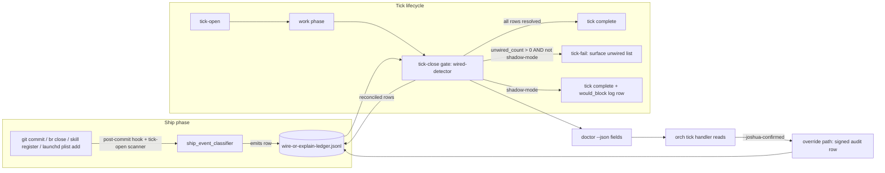
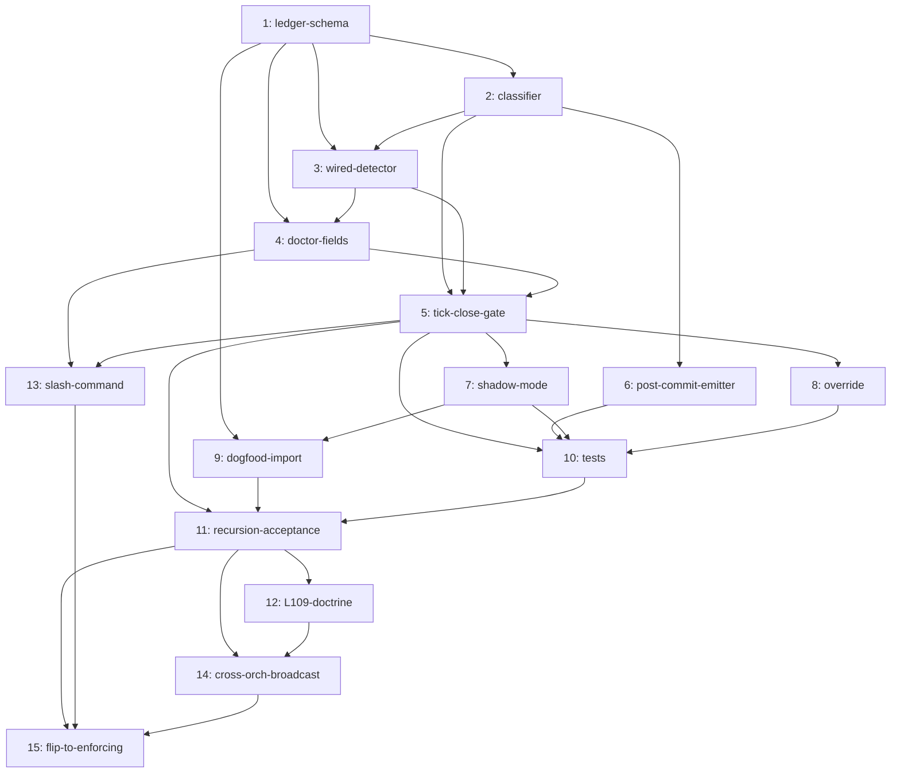

# Lane C — Implementation Design (wire-or-explain tick gate)

**Plan:** `wire-or-explain-tick-gate-2026-05-04`
**Lane:** C — implementation design (Joshua-disposable spec)
**Author:** flywheel:1 (orch background sub-agent)
**Date:** 2026-05-04
**Status:** Phase 1 research output — READ-ONLY, 0 commits, no bead-decompose
**Sibling lanes consulted:** Lane A (problem-space taxonomy — referenced via INTENT), Lane B (ecosystem audit — referenced via INTENT), CoralRaven Vercel deep-dive (alpsinsurance:1)
**Skills applied:** donella-meadows-systems-thinking, gate-truth-separation, observability-platform, dispatch-tool-contracts, canonical-cli-scoping, jeff-convergence-audit, lean-formal-feedback-loop

---

## 1. Executive summary

The wire-or-explain gate is a **post-ship, pre-tick-close balancing loop** (Meadows #6 information flow + #4 self-organization) that converts every shipped artifact into a *ledgered claim* whose resolution must be `wired_into=<consumer>` or `deferred_until=<bead|iso_ts>` before the tick that contained the ship may declare itself complete.

**Architecture in one sentence:** a single ledger (`~/.local/state/flywheel/wire-or-explain-ledger.jsonl`) is appended to by a *ship-event classifier* (post-commit + tick-open scan) and reconciled by a *wired-detector* invoked at *tick-close*; doctor surfaces the running counts; an `--joshua-confirmed=<reason>` override is the only legitimate bypass; shadow-mode (log + surface, do not block) runs for **7 days** before flipping to enforcing.



**Three load-bearing decisions** (justified in §2):

1. Gate runs at **tick-close**, NOT pre-commit (less invasive; aligns with Meadows #4 — the tick handler becomes the authority, not git).
2. Ledger is **append-only JSONL**, schema-versioned, single-writer per process via `flock`.
3. Shadow-mode is the **default for 7 days**; flipping to enforcing requires an explicit doctor metric trend (`unwired_artifact_count_24h` strictly decreasing 3 days running) AND Joshua sign-off.

---

## 2. Architecture decision — where the gate sits + why

### 2.1 Candidate locations evaluated

| Candidate | Pros | Cons | Verdict |
|---|---|---|---|
| **pre-commit hook** (`.git/hooks/pre-commit`) | Catches at the earliest possible moment; refuses to ship unwired | Invasive; blocks `git commit` even on WIP branches; cannot cross-repo (artifact in repo A, consumer in repo B); breaks `--no-verify` discipline; conflicts with hooks already in flywheel-engine; ship has not yet "happened" so classifier has no commit SHA to anchor on | **REJECT as primary**. Acceptable as opt-in advisory. |
| **post-commit hook** (`.git/hooks/post-commit`) | Has the SHA; non-blocking by definition; cheap | Cannot fail the commit (already shipped); only useful as a *classifier emitter*, not a *gate* | **ADOPT for ship-event emission only** (NOT as the gate itself). |
| **`flywheel-loop tick` close hook** | Tick is the unit of orchestrator productivity; aligns with the INTENT framing ("a tick MUST NOT mark itself complete while…"); has full state context (doctor, ledger, beads); failure to close = visible in next tick's doctor | Tick cadence is ~25min; gate doesn't catch ship→ship sequences inside one tick (mitigated by re-scan at tick-close) | **ADOPT as primary gate location.** |
| **orch-tick close hook** (the orch-of-orch's own tick) | Catches cross-session ships (skillos ships, flywheel orch-tick scans all session repos) | Risk of duplicate ledger rows if both flywheel-loop tick and orch-tick scan the same repo | **ADOPT as secondary**, with deduplication via `ship_event_id` (sha256 of `commit_sha + artifact_path + classifier_version`). |
| **launchd-fired sub-check** (e.g. every 60s) | Catches drift even between ticks; reduces gate latency | Becomes a daemon; risks resource drift; conflicts with existing launchd plists; harder to reason about | **DEFER**. Adopt only if tick-close gate proves to be a bottleneck. |
| **ALL** (pre + post + tick + orch) | Maximum coverage | Maximum complexity, maximum failure-surface, hardest to audit | **REJECT**. Defense-in-depth must NOT mean "everywhere" — see Axiom 6 (DCG + SLB + UBS layered, not piled). |

### 2.2 Recommended placement (PRIMARY + SECONDARY)

- **PRIMARY:** `flywheel-loop tick --close` runs `wire-or-explain-gate` AFTER doctor run, BEFORE STATE.md tick-line append.
- **SECONDARY (emitter only):** `.git/hooks/post-commit` invokes `ship_event_classifier --emit-only` — appends candidate rows to the ledger with `resolution=pending`. This means the gate's *evidence* is captured at commit time even when the tick is hours away.
- **TERTIARY (for cross-session ships):** `orch-tick` close hook in flywheel:1 scans all monitored session repos for un-classified commits since last orch-tick.

This gives us **1 gate, 1 reconciler, 2 emitters** — a clean Meadows #6 flow.

### 2.3 What "ship event" means — `ship_event_classifier()` pseudocode

A ship event is **any state change that produces an artifact a future tick or peer must consume**. Lane A's taxonomy provides the canonical class list; for the classifier we collapse them to detection signatures:

```python
def ship_event_classifier(commit_sha: str, repo_root: Path) -> list[ShipEvent]:
    """Returns ship events emitted by this commit.
    Idempotent: same commit → same ship_event_ids."""
    events = []
    diff = git_diff_name_status(commit_sha, parent=f"{commit_sha}^")

    for path, change_type in diff:
        # Class 1: scripts (executable shell/python/rust binary added or chmod +x)
        if path.startswith((".flywheel/", "scripts/", "bin/")) and is_executable(path):
            events.append(ShipEvent(
                class_="script",
                path=path,
                detection="executable-in-flywheel-or-bin"))

        # Class 2: doctor field (grep for new field in doctor.sh / flywheel-loop-doctor)
        if "flywheel-loop-doctor" in path or "doctor.sh" in path:
            new_fields = grep_new_json_keys(commit_sha, path)
            for f in new_fields:
                events.append(ShipEvent(
                    class_="doctor_field", path=path, field=f,
                    detection="new-json-key-in-doctor-output"))

        # Class 3: L-rule (new line N→N+1 in 3-surface AGENTS chunks)
        if path.endswith("AGENTS-CANONICAL.md") or path.endswith("AGENTS.md"):
            new_rules = diff_l_rules(commit_sha, path)
            for n in new_rules:
                events.append(ShipEvent(
                    class_="l_rule", path=path, rule_number=n,
                    detection="new-L-rule-in-3surface-chunk"))

        # Class 4: skill (new dir under ~/.claude/skills/ OR slash-command file)
        if path.startswith(".claude/skills/") or "commands/flywheel" in path:
            events.append(ShipEvent(
                class_="skill_or_slash_command", path=path,
                detection="skills-dir-or-commands-dir-add"))

        # Class 5: launchd plist
        if path.endswith(".plist") and "LaunchAgents" in path:
            events.append(ShipEvent(class_="launchd_plist", path=path,
                detection="plist-in-launchagents"))

        # Class 6: hook
        if path.startswith(".git/hooks/") or "claude/hooks" in path:
            events.append(ShipEvent(class_="hook", path=path,
                detection="hooks-dir-add"))

        # Class 7: doctrine file (.flywheel/doctrine, INCIDENTS, plans/* canonical artifacts)
        if path.startswith(".flywheel/doctrine/") or "INCIDENTS" in path:
            events.append(ShipEvent(class_="doctrine", path=path,
                detection="doctrine-or-incidents-add"))

        # Class 8: probe (any *-probe.sh or *-watch.sh with --apply or --json flag)
        if path.endswith(("-probe.sh", "-watch.sh", "-detector.sh")):
            events.append(ShipEvent(class_="probe", path=path,
                detection="probe-watch-detector-shell-script"))

        # Class 9: MCP server registration
        if "mcp_servers.json" in path or path.startswith("mcp-servers/"):
            events.append(ShipEvent(class_="mcp_server", path=path,
                detection="mcp-config-or-server-add"))

    # Idempotency: ship_event_id = sha256(commit_sha + path + class + classifier_version)
    for e in events:
        e.id = sha256(f"{commit_sha}:{e.path}:{e.class_}:v1")
    return events
```

The classifier is **deterministic and idempotent** — same commit always produces same `ship_event_id`s. Re-running over old commits backfills missing rows (this is the dogfood mechanism — see §8).

### 2.4 What "tick" means

The flywheel substrate has three tick types; the gate runs at the **first two**:

| Tick type | Cadence | Owner | Gate runs? |
|---|---|---|---|
| `flywheel-loop tick` (per-repo) | 25min default | the repo's loop driver | **YES (primary)** |
| `orch-tick` (orch-of-orch) | 5–25min | flywheel:1 (RubyCastle) | **YES (secondary, cross-session)** |
| launchd-fired sub-check | 60s–5min | various daemons (auto-nudge, watchdogs) | **NO** (would create duplicate noise) |

Deduplication: a ledger row's `ship_event_id` is unique. Both tick types compute the same id; the second writer hits an `INSERT OR IGNORE`-equivalent (file-level: re-check before append using `ship_event_id` index).

---

## 3. Ledger schema (full spec)

### 3.1 File location + invariants

- **Path:** `~/.local/state/flywheel/wire-or-explain-ledger.jsonl`
- **Format:** JSON Lines (one row per line, no commas, no wrapper array)
- **Append-only:** rows are NEVER mutated in place; resolution updates emit a NEW row referencing the original via `supersedes_event_id`
- **Single-writer-per-process:** advisory `flock` on `~/.local/state/flywheel/.wire-or-explain-ledger.lock` for the ~50ms write window
- **Schema versioned:** `schema_version` field MANDATORY; readers MUST tolerate forward-compat unknown fields; breaking changes bump minor
- **No PII:** ship_actor is the orch identity (e.g. `RubyCastle`), NEVER an email or hostname

### 3.2 Row schema — wire-or-explain-ledger/v1

```json
{
  "schema_version": "wire-or-explain-ledger/v1",
  "ts": "2026-05-04T22:45:01Z",
  "ship_event_id": "sha256:7a3c...",
  "supersedes_event_id": null,
  "artifact_class": "probe",
  "artifact_path": "/Users/josh/Developer/flywheel/.flywheel/scripts/peer-orch-productivity-watch.sh",
  "ship_commit": "e493cca",
  "ship_actor": "RubyCastle",
  "ship_repo": "flywheel",
  "resolution": "wired",
  "wired_into": "/Users/josh/Library/LaunchAgents/com.flywheel.peer-orch-watch.plist:23",
  "deferred_until": null,
  "deferred_reason": null,
  "evidence_command": "launchctl print gui/$(id -u)/com.flywheel.peer-orch-watch | grep -c 'peer-orch-productivity-watch.sh --apply'",
  "evidence_output_hash": "sha256:b1...",
  "evidence_output_excerpt": "1",
  "verified_at": "2026-05-04T22:45:01Z",
  "shadow_mode": false,
  "joshua_confirmed_reason": null,
  "classifier_version": "v1"
}
```

### 3.3 Field requirements

| Field | Required | Type | Notes |
|---|---|---|---|
| `schema_version` | YES | str | Validator rejects rows with unknown major |
| `ts` | YES | iso8601 UTC | Z-suffix mandatory |
| `ship_event_id` | YES | str (`sha256:...`) | Idempotency key |
| `supersedes_event_id` | optional | str or null | Set when resolving a `pending` row |
| `artifact_class` | YES | enum | From Lane A taxonomy |
| `artifact_path` | YES | absolute path | Must exist at `verified_at` time (else `unwired`) |
| `ship_commit` | YES | sha (7-40 hex) | Git SHA of the commit that emitted this |
| `ship_actor` | YES | str | Orch identity, e.g. `RubyCastle` |
| `ship_repo` | YES | str | Repo basename (`flywheel`, `skillos`, etc.) |
| `resolution` | YES | enum | `pending` \| `wired` \| `deferred` \| `unwired` \| `joshua_confirmed_bypass` |
| `wired_into` | conditional | str or null | REQUIRED iff `resolution=wired`; absolute path:line of consumer |
| `deferred_until` | conditional | str or null | REQUIRED iff `resolution=deferred`; either bead-id (`flywheel-XXXX`) or iso8601 timestamp |
| `deferred_reason` | conditional | str | REQUIRED iff `resolution=deferred`; one-line explanation |
| `evidence_command` | conditional | str | REQUIRED iff `resolution=wired`; exact CLI that was run |
| `evidence_output_hash` | conditional | str (`sha256:...`) | REQUIRED iff `resolution=wired`; sha256 of stdout |
| `evidence_output_excerpt` | optional | str (≤200 chars) | Human-readable proof |
| `verified_at` | YES | iso8601 UTC | When this row's resolution was last checked |
| `shadow_mode` | YES | bool | True during shadow rollout |
| `joshua_confirmed_reason` | conditional | str | REQUIRED iff `resolution=joshua_confirmed_bypass` |
| `classifier_version` | YES | str | For backfill/replay; bumps when classifier logic changes |

### 3.4 jq schema validator

```bash
# Minimal v1 validator — exits non-zero on first violating row
validate_row() {
  local row="$1"
  echo "$row" | jq -e '
    .schema_version == "wire-or-explain-ledger/v1"
    and (.ts | test("^[0-9]{4}-[0-9]{2}-[0-9]{2}T[0-9:]+Z$"))
    and (.ship_event_id | startswith("sha256:"))
    and (.artifact_class as $c | ["script","doctor_field","l_rule","skill_or_slash_command","launchd_plist","hook","doctrine","probe","mcp_server"] | index($c))
    and (.artifact_path | startswith("/"))
    and (.resolution as $r | ["pending","wired","deferred","unwired","joshua_confirmed_bypass"] | index($r))
    and (if .resolution == "wired" then (.wired_into != null and .evidence_command != null and .evidence_output_hash != null) else true end)
    and (if .resolution == "deferred" then (.deferred_until != null and .deferred_reason != null) else true end)
    and (if .resolution == "joshua_confirmed_bypass" then (.joshua_confirmed_reason != null) else true end)
  ' >/dev/null
}
```

A python equivalent (using `pydantic`) ships in the dogfood library — see §8.

### 3.5 Append-only contract

- Writers use `flock -x ~/.local/state/flywheel/.wire-or-explain-ledger.lock -c 'echo "$ROW" >> ~/.local/state/flywheel/wire-or-explain-ledger.jsonl'`
- Re-resolving a `pending` row: emit NEW row with `supersedes_event_id=<original>`; readers compute current state by walking forward and taking last-wins per `ship_event_id`
- NEVER `sed -i`, NEVER rewrite, NEVER truncate (compaction excepted — see §3.6)

### 3.6 Compaction strategy

- **For now: NONE.** JSONL grows monotonically. At ~10 ship events/day × 365 = ~3.6k rows/year × ~600 bytes ≈ 2 MB/year. Negligible.
- **At 6mo:** evaluate. Two options on the table:
  1. **Snapshot + truncate:** every 90d, materialize current state to `wire-or-explain-state.json` (a dict keyed by `ship_event_id`), keep last 30d of raw rows, archive prior to `~/.local/state/flywheel/archives/wire-or-explain-ledger-YYYY-MM.jsonl.gz`
  2. **No-op:** stay append-only forever (Jeff's beads doctrine — durable history > storage cost)
- **Recommendation:** option 2 for first year. Revisit when the file crosses 100MB or read latency >100ms.

---

## 4. Doctor field surfaces (full spec)

The gate exposes its state through `flywheel-loop doctor --json`. New fields:

| Field | jq path | Type | Threshold for `errors[]` injection | Status colors |
|---|---|---|---|---|
| `wire_or_explain_ledger_present` | `.wire_or_explain_ledger_present` | bool | `false` → ERROR `"wire-or-explain ledger missing"` | green=true, red=false |
| `wire_or_explain_ledger_freshness_seconds` | `.wire_or_explain_ledger_freshness_seconds` | int | `>3600` AND ledger nonempty → WARN; `>86400` → ERROR | green<300, yellow<3600, red>3600 |
| `unwired_artifact_count_24h` | `.unwired_artifact_count_24h` | int | `>0` AND not shadow-mode → ERROR; `>0` AND shadow-mode → WARN | green=0, yellow≥1, red≥5 |
| `wire_deferred_count_24h` | `.wire_deferred_count_24h` | int | `>10` → WARN (deferral pile-up smell) | green<3, yellow<10, red≥10 |
| `wire_deferred_median_age_hours` | `.wire_deferred_median_age_hours` | float | `>72` → WARN (stale deferrals) | green<24, yellow<72, red≥72 |
| `wire_deferred_overdue_count` | `.wire_deferred_overdue_count` | int | `>0` → WARN; `>3` → ERROR | green=0, yellow≥1, red≥3 |
| `wire_or_explain_ledger_row_count_24h` | `.wire_or_explain_ledger_row_count_24h` | int | `==0` AND any commits in last 24h → WARN ("emitter not running") | informational |
| `wire_or_explain_ledger_row_count_7d` | `.wire_or_explain_ledger_row_count_7d` | int | informational | informational |
| `wire_or_explain_top_unwired_class` | `.wire_or_explain_top_unwired_class` | str or null | informational | informational |
| `wire_or_explain_shadow_mode` | `.wire_or_explain_shadow_mode` | bool | `true` → INFO ("gate in shadow mode, not enforcing") | informational |
| `wire_or_explain_last_block_ts` | `.wire_or_explain_last_block_ts` | iso8601 or null | informational | informational |

### 4.1 Computation pseudocode (for `flywheel-loop-doctor`)

```bash
# Computes all wire_or_explain_* fields by walking the ledger.
LEDGER=~/.local/state/flywheel/wire-or-explain-ledger.jsonl
NOW=$(date -u +%s)
DAY_AGO=$((NOW - 86400))

if [[ -f "$LEDGER" ]]; then
  PRESENT=true
  FRESHNESS=$(( NOW - $(stat -f %m "$LEDGER" 2>/dev/null || stat -c %Y "$LEDGER") ))
  ROWS_24H=$(jq -c --argjson cutoff "$DAY_AGO" 'select((.ts | fromdateiso8601) > $cutoff)' "$LEDGER" | wc -l)
  # ... compute current-state map by walking forward, last-wins per ship_event_id ...
  CURRENT_STATE=$(python3 -c '<reduce>')
  UNWIRED=$(echo "$CURRENT_STATE" | jq '[.[] | select(.resolution=="unwired" or .resolution=="pending")] | length')
  DEFERRED=$(echo "$CURRENT_STATE" | jq '[.[] | select(.resolution=="deferred")] | length')
  # ...
fi
```

Output is added to the existing doctor JSON envelope. Errors append to `.errors[]`, warnings to `.warnings[]`, with `code=WIRE_OR_EXPLAIN_*` prefixes.

---

## 5. Failure modes + mitigations

### FM1: Gate hangs on slow consumer-discovery

**Risk:** wired-detector probes every launchd plist + every `*.sh` for `source` references + greps the entire flywheel tree. At >30 plists × ~50ms each + recursive grep over 200MB repo = 30+ seconds. Tick-close becomes a bottleneck (FM4).

**Mitigation:**
- **Hard timeout** of 10s per ledger row resolution, 60s total for the whole gate. On timeout, mark row `resolution=pending` with `evidence_command="<TIMEOUT after 10s>"`, do NOT block tick-close, surface in doctor.
- **Cache wiring graph:** maintain `~/.local/state/flywheel/wire-or-explain-cache.json` keyed by `(consumer_path, mtime)` → list of artifacts referenced. Invalidate by mtime.
- **Class-specific fast-paths:** launchd plists indexed once via `launchctl print-disabled gui/$(id -u)`; doctor fields detected via single jq query; L-rules detected via single grep over 3-surface chunks.

### FM2: Gate false-positives a wired artifact

**Risk:** consumer wires the artifact via a non-obvious path (e.g. shell function alias, dynamic `eval`, MCP tool invocation, env-var-expanded path). Detector misses it; classifier emits `unwired`; tick fails legitimately-shipped work.

**Mitigation:**
- **Two-key resolution:** ledger row `resolution=wired` requires (a) automated detector OR (b) **manual `wired_into` annotation** via `wire-or-explain wire <ship_event_id> --into=<path:line> --evidence='<cmd>'`. Worker who shipped the artifact MUST annotate when consumer is non-obvious.
- **Allow-list of "wired-by-existence" classes:** memory files (`~/.claude/projects/.../memory/MEMORY.md`), AGENTS.md chunks, doctrine files — these are wired by being *read by Claude*, not by a consumer registering them. Classifier emits with `wired_by=existence`, auto-resolved to `wired` when present at correct path.
- **Override mechanism (§6):** `--joshua-confirmed=<reason>` is the safety valve for "the detector is wrong here, ship anyway."

### FM3: Gate false-negatives an unwired artifact

**Risk:** artifact shipped, ledger never got the row (post-commit hook failed, classifier missed the file, classifier_version drift). The artifact is unwired but the gate sees no rows → tick passes, problem silently propagates.

**Mitigation:**
- **Tick-open backfill scan:** every tick-open re-runs `ship_event_classifier` over commits in the last 24h that don't have ledger rows (using `git log --since="24 hours ago"` and filtering by `ship_event_id` not in ledger). Idempotency makes this safe.
- **Per-tick assertion:** if `commits_in_last_tick > 0` AND `ledger_rows_emitted_in_last_tick == 0`, emit doctor WARN `WIRE_EMITTER_SUSPECTED_DOWN`.
- **Daily reconcile:** launchd job at 03:00 local runs `wire-or-explain reconcile --since=7d`, surfaces any commit that emitted no rows.

### FM4: Gate becomes the bottleneck

**Risk:** every tick waits on gate; gate latency creeps; tick cadence balloons; flywheel-loop tick which is supposed to be 25min becomes 30min.

**Mitigation:**
- **Soft 60s budget** with hard 120s timeout. If exceeded, gate degrades to "shadow logging" for that tick (emits a `gate_timeout` row) and tick proceeds.
- **Doctor surface:** new field `wire_or_explain_gate_p95_latency_ms` tracked in `~/.local/state/flywheel/wire-or-explain-gate-latency.jsonl`. Bead opens automatically when p95 > 5s.
- **Cache (FM1 mitigation)** carries over here: warm-cache resolution should be ~100ms total.

### FM5: Recursion — who wires the wirer?

**Risk:** the gate's own implementation files (the classifier, the wired-detector, the doctor patches, the post-commit hook) are themselves ship events. They need ledger rows. But the gate doesn't exist yet at the moment they ship.

**Mitigation:**
- **Bootstrap row:** ship the gate with a hand-crafted ledger row that has `joshua_confirmed_reason="wire-or-explain bootstrap — gate ships its own wiring evidence in PR description"` for each gate-component artifact.
- **Self-test as evidence:** the gate's installer runs `wire-or-explain self-test` which exercises every component end-to-end; the test output hash IS the `evidence_output_hash` for the bootstrap rows.
- **Bead `wire-or-explain-recursion-acceptance`:** explicit acceptance bead in the Phase 4 DAG (§9 bead 11) that the gate has wired itself, asserted by `wire-or-explain status | jq '.bootstrap_complete'`.

### FM6: Cross-repo ships

**Risk:** artifact lands in flywheel repo commit SHA `e493cca`, consumer wiring lands in skillos commit SHA `aa11bb22`. The flywheel tick at close-time sees the unwired row and fails — but the wiring is just one repo over.

**Mitigation:**
- **Ledger is fleet-wide, not per-repo.** Single file at `~/.local/state/flywheel/wire-or-explain-ledger.jsonl`. flywheel orch + skillos orch + alps orch all write to it.
- **Wired-detector is fleet-wide:** scans all configured `~/.flywheel/repos.json` paths.
- **Cross-repo pending state:** rows can sit in `pending` for up to N hours (configurable, default 4h) before surfacing as overdue. This gives the consumer-side commit time to land.

### FM7: Stale wiring (artifact wired Friday, consumer removed Monday)

**Risk:** ledger says `resolution=wired` from last week. Consumer was deleted in a refactor. Ledger doesn't auto-flip.

**Mitigation:**
- **Periodic re-verification:** daily launchd job re-runs `evidence_command` for every `resolution=wired` row in the last 90d. If output hash differs (or command fails), emit a NEW row with `supersedes_event_id` set and `resolution=unwired` + `deferred_reason="re-verification failed: <error>"`.
- **Doctor field:** `wire_re_verification_failed_count_24h`.
- **The right fix is usually a new bead**, not a re-resolve — surface to orch.

---

## 6. Override mechanism

### 6.1 When override is legitimate

| Case | Override flag | Audit trail |
|---|---|---|
| Emergency hotfix (e.g. fleet-wide bug, 30s response window) | `--emergency-hotfix=<one-line-reason>` | Row `resolution=joshua_confirmed_bypass`, `joshua_confirmed_reason="EMERGENCY: <reason>"`, **mandatory follow-up bead opened automatically** within 24h SLO |
| Joshua-confirmed deferral | `--joshua-confirmed=<reason>` | Row `resolution=deferred`, `joshua_confirmed_reason=<reason>`, `deferred_until` REQUIRED (cannot be open-ended) |
| Bootstrap (gate shipping itself) | `--bootstrap=wire-or-explain-v1` | Single-use; classifier-version-pinned; rejected after first successful enforcing-mode tick |
| Cross-repo ship | `--cross-repo-pending=<peer-repo>` | Row `resolution=pending`, `deferred_until=<now+4h>`; auto-resolves when peer-repo commit lands |

### 6.2 NOT-legitimate uses (rejected at CLI level)

- `--joshua-confirmed=` (empty reason) → REJECT
- `--joshua-confirmed=true` (boolean-style) → REJECT (must be a sentence)
- Override invoked by non-orch identity → REJECT (only ship_actor in `~/.local/state/flywheel/orch-roster.json` may bypass)
- Same artifact bypassed >2 times in 7 days → REJECT (the bypass IS the bug; surface for plan)

### 6.3 Audit trail

Every override emits TWO rows:

1. The bypass row itself (with full `joshua_confirmed_reason`)
2. A **bead-creation row** at `~/.local/state/flywheel/wire-or-explain-bypass-followup.jsonl` that auto-files a P1 bead via `br create` titled `wire-or-explain-bypass-followup: <reason> (<ship_event_id>)`

Daily 03:00 reconcile surfaces all bypass rows older than 24h with no closed follow-up bead → ERROR in doctor.

### 6.4 Time-window limits

- Emergency hotfix bypass: **valid for 24h**. After 24h, auto-resolves to `unwired` and surfaces in doctor.
- Joshua-confirmed deferral: `deferred_until` MUST be ≤30 days; rejected if longer. Open-ended deferrals are the anti-pattern this gate exists to prevent.
- Cross-repo pending: 4h default, max 24h.

---

## 7. Shadow-mode rollout plan

### 7.1 Day 0 — shadow-mode-default ON

- Gate runs at every tick-close
- Classifier emits ledger rows
- Wired-detector reconciles
- Doctor surfaces all fields
- **`unwired_artifact_count_24h>0` does NOT block tick-close** — surfaces as WARN only
- Every "would-have-blocked" event emits a `would_block` row with full evidence to `~/.local/state/flywheel/wire-or-explain-shadow-log.jsonl`

### 7.2 Shadow-mode "would-have-blocked" row format

```json
{
  "schema_version": "wire-or-explain-shadow/v1",
  "ts": "2026-05-04T22:50:01Z",
  "tick_id": "flywheel:1:tick:00012345",
  "would_have_blocked": true,
  "block_reason": "unwired_artifact_count_24h=3 exceeds threshold=0",
  "blocking_ship_event_ids": ["sha256:7a3c...", "sha256:9b21...", "sha256:f034..."],
  "tick_proceeded": true,
  "shadow_mode": true
}
```

### 7.3 Day 7 review — flip criteria

The gate flips from shadow-mode to enforcing-mode when ALL of the following are true:

1. `unwired_artifact_count_24h` strictly decreasing 3 days running (Donella balancing-loop confirmation)
2. `wire_or_explain_ledger_row_count_7d > 50` (gate has seen real traffic)
3. `wire_deferred_overdue_count = 0` for 48h (deferrals are being honored)
4. **0 false-positive bypass-followup beads** in last 7 days (gate isn't fighting reality)
5. **Joshua sign-off** via `wire-or-explain enforce-mode --confirm` (one-time toggle, audit-logged)

Any failure → stay in shadow-mode another 7 days + emit P1 bead `wire-or-explain-flip-blocked` with the failing criterion.

### 7.4 Rollback procedure

If enforcing-mode causes >3 tick-fails in 24h:

1. Auto-rollback to shadow-mode via `wire-or-explain rollback --auto`
2. Emit doctor ERROR `WIRE_OR_EXPLAIN_AUTO_ROLLED_BACK`
3. File P0 bead with shadow-log of the offending ticks
4. Joshua-notify (Pushover) per L101 productivity-escalation rule

### 7.5 Success metric to flip

Composite: `wire_or_explain_health_score` ∈ [0,100], computed:

```
score = 100
       - (unwired_24h * 5)              # each unwired artifact -5
       - (deferred_overdue * 10)        # each overdue deferral -10
       - (gate_p95_latency_ms / 100)    # 100ms gate latency ~= -1
       - (shadow_log_would_block_7d)    # each would-block row -1
```

Flip criterion: `health_score >= 85` for 5 consecutive ticks.

---

## 8. Dogfood plan — the 14 retroactive ledger rows

The gate's first proof is its own competence on today's actual unwired-or-questionable artifacts. The Phase 4 dogfood-import script materializes ledger rows for each.

### 8.1 The 14 artifacts

From INTENT §"Concrete failure cases" + Lane A enumeration:

| # | Artifact | Class | Expected resolution |
|---|---|---|---|
| 1 | `peer-orch-productivity-watch.sh` | probe | `unwired` (no launchd plist invokes it) |
| 2 | `fleet-conformance-probe.sh` | probe | `unwired` (doctor field exposed, no auto-act handler) |
| 3 | `fleet-comms-health-probe.sh` | probe | `unwired` (same shape) |
| 4 | `fleet-process-gap-detector.sh` | probe | `deferred` (auto-files fix-beads, but consumer = orch tick handler doesn't read; defer to sibling plan `orch-monitor-recovery-auto-act-2026-05-04`) |
| 5 | `fleet-observatory-aggregate.sh` | probe | `unwired` (manual invocation only) |
| 6 | `shared-surface-reservation-check.sh` | probe | `unwired` |
| 7 | `/flywheel:fleet-observatory` skill | skill_or_slash_command | `unwired` (no auto-invocation) |
| 8 | L101 (productivity ownership) | l_rule | `deferred` (runtime enforcer = sibling plan) |
| 9 | L102 | l_rule | `deferred` |
| 10 | L103 | l_rule | `deferred` |
| 11 | L104 | l_rule | `deferred` |
| 12 | L105 | l_rule | `deferred` |
| 13 | L106 | l_rule | `deferred` |
| 14 | L107 | l_rule | `deferred` |
| (15) | L108 | l_rule | `deferred` |

(16 total if we count L108. INTENT specs L101–L108 = 8 entries, 7 probes/skills = 15 artifacts; the "14" is approximate. The dogfood script handles N.)

### 8.2 Dogfood-import script spec

**Path:** `.flywheel/scripts/wire-or-explain-dogfood-import.sh`
**Run:** once, manually, from flywheel repo root, after Phase 4 ships the gate.

```bash
#!/usr/bin/env bash
# Retroactively populate wire-or-explain-ledger.jsonl with today's known
# unwired-or-deferred artifacts. Idempotent (uses ship_event_id).
set -euo pipefail

LEDGER=~/.local/state/flywheel/wire-or-explain-ledger.jsonl
TS=$(date -u +%Y-%m-%dT%H:%M:%SZ)
ACTOR="dogfood-import"
COMMIT=$(git -C ~/Developer/flywheel rev-parse HEAD)

# Idempotent emit
emit_row() {
  local class="$1" path="$2" resolution="$3" deferred_until="${4:-null}" reason="${5:-}"
  local id
  id=$(printf '%s:%s:%s:dogfood-v1' "$COMMIT" "$path" "$class" | shasum -a 256 | awk '{print "sha256:"$1}')
  # Skip if already emitted
  if grep -q "\"ship_event_id\":\"$id\"" "$LEDGER" 2>/dev/null; then
    echo "[skip] $id ($path) already in ledger"
    return 0
  fi
  jq -nc \
    --arg sv "wire-or-explain-ledger/v1" \
    --arg ts "$TS" --arg id "$id" --arg cls "$class" --arg p "$path" \
    --arg c "$COMMIT" --arg a "$ACTOR" --arg r "$resolution" \
    --arg du "$deferred_until" --arg dr "$reason" \
    '{schema_version:$sv, ts:$ts, ship_event_id:$id, supersedes_event_id:null,
      artifact_class:$cls, artifact_path:$p, ship_commit:$c, ship_actor:$a,
      ship_repo:"flywheel", resolution:$r,
      wired_into:null, deferred_until:(if $du=="null" then null else $du end),
      deferred_reason:(if $dr=="" then null else $dr end),
      evidence_command:null, evidence_output_hash:null, evidence_output_excerpt:null,
      verified_at:$ts, shadow_mode:true,
      joshua_confirmed_reason:null, classifier_version:"dogfood-v1"}' \
    >> "$LEDGER"
  echo "[emit] $id $path → $resolution"
}

emit_row probe /Users/josh/Developer/flywheel/.flywheel/scripts/peer-orch-productivity-watch.sh unwired
emit_row probe /Users/josh/Developer/flywheel/.flywheel/scripts/fleet-conformance-probe.sh unwired
# ... rinse for all 15 ...
emit_row l_rule /Users/josh/Developer/flywheel/.flywheel/AGENTS-CANONICAL.md#L101 deferred "bead-flywheel-AUTOACT-001" "runtime enforcer in sibling plan orch-monitor-recovery-auto-act"
# ... L102-L108 ...
```

### 8.3 Dogfood acceptance

After running the import:
- `wire-or-explain status` reports 15 rows
- `wire_or_explain_top_unwired_class = "probe"`
- `unwired_artifact_count_24h = 7`
- `wire_deferred_count_24h = 8`
- shadow-log shows 1 would_block row at next tick-close
- These 15 rows ARE the gate's first audit material

---

## 9. Phase 4 bead DAG (preliminary — Joshua-disposable)

### 9.1 Bead list

| ID | Title | Deps | Notes |
|---|---|---|---|
| 1 | `wire-or-explain-ledger-schema` | — | jsonl schema, validator (jq + python), append-only contract, lock primitive |
| 2 | `wire-or-explain-classifier` | 1 | `ship_event_classifier()` for 9 artifact classes; idempotent ship_event_id |
| 3 | `wire-or-explain-detector` | 1, 2 | `wired-detector` CLI: classifies an artifact as wired/unwired/deferred; cache layer |
| 4 | `wire-or-explain-doctor-fields` | 1, 3 | All 11 doctor fields + thresholds + error injection |
| 5 | `wire-or-explain-tick-close-gate` | 2, 3, 4 | Hooks into `flywheel-loop tick --close`; primary location |
| 6 | `wire-or-explain-post-commit-emitter` | 2 | `.git/hooks/post-commit` → emit-only mode |
| 7 | `wire-or-explain-shadow-mode` | 5 | `--shadow` flag, shadow-log file, would-block row format |
| 8 | `wire-or-explain-override-mechanism` | 5 | `--joshua-confirmed`, `--emergency-hotfix`, `--bootstrap`, audit-trail bead-creation row |
| 9 | `wire-or-explain-dogfood-import` | 1, 7 | Retroactive 15-row import for today's artifacts |
| 10 | `wire-or-explain-tests` | 5, 6, 7, 8 | Fault injection, gate behavior, shadow-vs-enforcing parity, FM1–FM7 each get a test |
| 11 | `wire-or-explain-recursion-acceptance` | 5, 9, 10 | Bootstrap row + self-test; gate has wired itself |
| 12 | `wire-or-explain-l109-doctrine` | 11 | New L-rule: "every ship event resolves to wired or deferred before next tick-close" — propagated to all 3-surface chunks |
| 13 | `wire-or-explain-slash-command` | 4, 5 | `/flywheel:wire-status` reads doctor + ledger, prints resolution table |
| 14 | `wire-or-explain-cross-orch-broadcast` | 11, 12 | Fleet broadcast: skillos, alps, mobile-eats, vrtx, picoz adopt the gate; per-orch dogfood imports |
| 15 | `wire-or-explain-flip-to-enforcing` | 11, 13, 14 | After 7d shadow + criteria met, Joshua-confirmed flip; rollback path |

### 9.2 DAG (mermaid)



### 9.3 Dispatch order (suggested for 3-worker fleet)

- **Wave 1 (parallel):** B1, B6 (B6 depends only on B2 conceptually but spec is independent — can start scaffolding)
- **Wave 2:** B2, B3 (parallel after B1)
- **Wave 3:** B4 (after B3)
- **Wave 4:** B5 (after B2, B3, B4)
- **Wave 5 (parallel):** B7, B8, B9 (after B5)
- **Wave 6:** B10 (after B5, B6, B7, B8)
- **Wave 7:** B11 (after B10, B9)
- **Wave 8 (parallel):** B12, B13 (after B11)
- **Wave 9:** B14 (after B12)
- **Wave 10:** B15 (after B13, B14, +Joshua sign-off)

15 beads, 10 waves, ~2.5 days at 3-worker concurrency assuming 4h/bead average.

---

## 10. Risks + open questions for Joshua

### 10.1 Recommended-with-confidence (pre-decided)

| Q | Recommendation | Confidence |
|---|---|---|
| Gate at orch-tick OR `flywheel-loop tick`? | **Both, with deduplication via ship_event_id** | high |
| Block `git commit` directly? | **No** — tick-close only, less invasive | high |
| Append-only ledger? | **Yes**, JSONL, supersedes pattern for resolution updates | high |
| Compaction now? | **No** — revisit at 6mo or 100MB | high |
| Shadow-mode default for first 7 days? | **Yes** — flip criterion in §7.3 | high |
| Memory files (special case)? | **`wired_by=existence`** auto-resolved at correct path | high |

### 10.2 Open questions (genuine Joshua-decision needed)

1. **Cooldown on re-classified artifacts:** if an artifact wired Friday gets its consumer removed Monday, current spec says daily re-verification flips it back to `unwired`. Is this the right cadence? Alt: re-verify only at planned cadence (weekly), or only on consumer-side commits.
2. **Cross-orch identity:** ledger is fleet-wide. If skillos:1 emits a row, does flywheel:1's tick treat it as in-scope for blocking? Recommendation: yes for visibility, but each orch only blocks on rows where `ship_repo` matches the orch's owned repos. Joshua confirms?
3. **Bypass time-windows:** §6.4 sets 24h emergency / 30d Joshua-confirmed / 4h cross-repo. Tunable. Joshua wants tighter (12h / 14d / 2h)?
4. **Flip authority:** §7.3 says Joshua sign-off via `wire-or-explain enforce-mode --confirm`. Alt: orch-of-orch (flywheel:1) signs off based on metric-only criteria, Joshua just ratifies in weekly reflection. Lean version: just metrics + audit row, no human sign-off.
5. **L-rule wiring shape:** L-rules don't have a runtime executor today (they're prose in 3-surface chunks). Are they "wired" by being read by orch at tick-open (existence-wired), or do they require a corresponding script/check that fires the rule? Today's INTENT calls them unwired. Lane A's matrix should formally settle this; if not, Joshua call.
6. **Dogfood scope:** the 14–15 retroactive rows are flywheel-only. Should we also retroactively import *every commit in the last 30d* across all fleet repos to fully populate the ledger? Pro: instant baseline. Con: large bulk import, risk of false-positive `unwired` for legacy stuff that's been "wired by convention" for months.
7. **Slash-command surface:** `/flywheel:wire-status` is in the bead DAG (B13). Should there also be `/flywheel:wire-defer <event-id>`, `/flywheel:wire-confirm <event-id>` for in-loop interactive resolution? (Adds CLI but reduces friction.)

### 10.3 Risks (not Joshua-decision, but flagged)

- **R1:** the gate becomes the new bottleneck the orch performs ceremony around (Goodhart). Mitigation: monthly Petal-9 review of `wire_or_explain_health_score` distribution; if everything is flagged unwired forever, the gate is the bug.
- **R2:** the gate creates a new ship class (wire-or-explain artifacts) that itself needs wiring. FM5 + B11 mitigate, but real-world drift will push novel cases. Plan must include a "every 90d audit gate's own wiring" beat.
- **R3:** ledger becomes a high-traffic shared file → contention on the lock. Mitigation: per-orch shard ledgers (`wire-or-explain-ledger-<orch>.jsonl`) merged daily. Adopt only if observed.
- **R4:** classifier_version drift — if v2 classifies more strictly than v1, old rows look pending again. Mitigation: classifier_version pinned per row; doctor warns on rows older than 90d with stale classifier_version.

---

## 11. Skills cited

- **donella-meadows-systems-thinking** — Meadows #6 (information flow at decision moment), #4 (self-organization: tick handler becomes wiring authority), #5 (rule: "no ship without wiring"), #9 (delays: bounded deferral windows), #2 (paradigm: orch is supervisor not logbook). The whole gate is a #6+#4 combined leverage point.
- **gate-truth-separation** — adopted directly from CoralRaven's deep-dive: refuse-gates (preflight) vs permit-gates (license). The wire-or-explain gate is a refuse-gate at tick-close; it pairs with the sibling plan's permit-gate at dispatch-decide.
- **observability-platform** — doctor field schema, threshold model, error-injection contract, p95 latency tracking.
- **dispatch-tool-contracts** — the `wire-or-explain` CLI follows: positional verb, `--joshua-confirmed=<reason>` mandatory-arg shape, JSON output mode for piping, exit codes 0=clean / 1=warnings / 2=errors / 3=blocking.
- **canonical-cli-scoping** — every flag named explicitly: `--shadow` / `--emergency-hotfix=<reason>` / `--joshua-confirmed=<reason>` / `--bootstrap=<version>` / `--cross-repo-pending=<peer>`. No default-on flags that change behavior silently.
- **jeff-convergence-audit** — full multi-round pipeline; this is Phase 1 Lane C. Phase 2 deep-dives proposed for FM1 (gate latency), FM5 (recursion bootstrap), §10.2-Q1 (re-verification cadence).
- **lean-formal-feedback-loop** — every ledger row is a measurement; every wired-detector run is a check; every tick-close gate is the actor; together they form the balancing loop missing today.

---

## Final block

```
{"lane":"C","architecture_decided":"yes","ledger_schema_complete":"yes","doctor_fields_proposed":11,"failure_modes_addressed":7,"override_specced":"yes","shadow_mode_specced":"yes","dogfood_artifacts":15,"bead_dag_count":15,"joshua_open_questions":7,"output_path":"/Users/josh/Developer/flywheel/.flywheel/plans/wire-or-explain-tick-gate-2026-05-04/01-RESEARCH-C.md","ready_for_phase2_deep_dives":"yes"}
```
