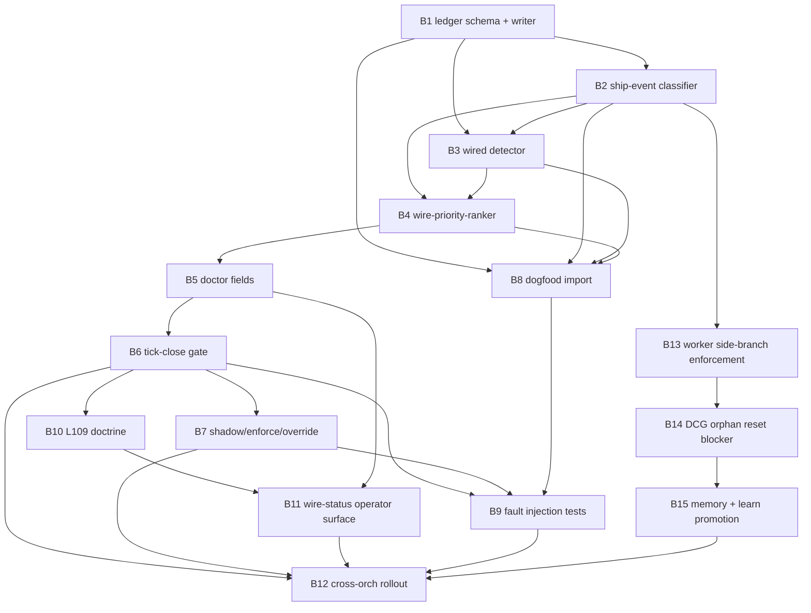

# Phase 2 REFINE r1 — wire-or-explain-tick-gate-2026-05-04

Generated: 2026-05-04T22:34Z
Mode: plan-space read-only synthesis
Input base: Phase 1 synthesis plus Lane A/B/C sub-agent and codex traces

## 1. Problem Statement

Flywheel repeatedly ships operational artifacts, then lets the tick close as if "file exists", "doctor field exists", "dashboard line exists", or "L-rule text exists" were the same thing as downstream consumption. The failure is the ship-then-orphan pattern: the unwired-output backlog rises because stop/refuse gates are runtime-enforced while permit/continue/wire gates are mostly doctrine-only, so the tick becomes a passive ledger keeper that reads doctor JSON, logs STATE, and sleeps instead of reading, classifying, acting, and recording the next decision. The Phase 1 sources converge on the same invariant: every shipped artifact must resolve to `wired_into=<consumer>` or `deferred_until=<bead|iso-ts> reason=<specific>` before tick close, or the tick must surface/fail on `unwired_artifact_count_24h` depending on rollout mode. Sources: INTENT one-line invariant at `00-INTENT.md:3-5`; stock/pattern/loop/leverage trace at `00-INTENT.md:11-17`; concrete unwired fleet artifacts at `00-INTENT.md:21-32`; Lane A codex strict definition at `01-RESEARCH-A-codex.md:11-17`; Phase 1 F1/F2 synthesis at `02-PHASE1-SYNTHESIS.md:23-46`.

## 2. Mechanism

The converged mechanism is a wire-or-explain tick-close gate. It is not another dashboard. It is a small, append-only, idempotent artifact ledger plus a close-hook that makes the tick handler the wiring authority.

Core invariant:

```text
No tick closes green until every shipped artifact in scope is wired, deferred, not-required, or explicitly bypassed with an expiring audited reason.
```

Placement:

- Primary gate: `flywheel-loop tick` close hook, after validation and before closeout receipt can mark the tick done. Lane C codex names this at `01-RESEARCH-C-codex.md:26-34`; Lane C sub-agent adopts it at `01-RESEARCH-C.md:52-67`.
- Secondary emitter: non-blocking post-commit collector. It writes candidate ship rows but never blocks `git commit`, preserving Lane C's rejection of pre-commit as primary at `01-RESEARCH-C.md:52-59` and `01-RESEARCH-C-codex.md:31-39`.
- Secondary cross-session close hook: flywheel orch close scans configured repo roots for unclassified ship events, deduped by stable `ship_event_id`; Lane C sub-agent specifies both tick types at `01-RESEARCH-C.md:143-153`.

Source of truth:

- Fleet-level ledger: `~/.local/state/flywheel/wire-or-explain-ledger.jsonl`, append-only and schema-versioned.
- Derived cache: `~/.local/state/flywheel/wire-or-explain-state.json` or `.flywheel/state/wire-or-explain-status.json`, never the authority.
- Existing `.flywheel/dispatch-log.jsonl` should gain an `event:"artifact_shipped"` or equivalent row class because Lane B found 1,205+ dispatch-log rows but no universal ship-side row at `01-RESEARCH-B.md:177-188` and Lane B codex converged on that gap at `01-RESEARCH-B-codex.md:1019-1033`.

Required resolution states:

| State | Meaning | Minimum proof |
|---|---|---|
| `wired` | An independent consumer exists and acts/blocks/notifies/promotes from the artifact. | `wired_into=<path:line|consumer-id>`, `consumer_class`, `discover_command`, `verify_command`, `evidence_output_hash`. |
| `deferred` | Wiring is intentionally delayed and owned. | `deferred_until=<open-bead|future-iso-ts>`, `deferred_owner`, `deferred_reason` length >15 chars. |
| `unwired` | No consumer proof and no valid deferral. | `unwired_reason`, priority components, recommended next action. |
| `questionably_wired` | Manual/status/prose evidence exists but no automatic consumer. | Ranked below unwired, above clean deferred. |
| `not_required` | Artifact class is intentionally manual or informational. | Class-specific reason and discoverability proof. |
| `bypassed` | Emergency/Joshua/bootstrap/cross-repo temporary bypass. | Override row with expiry; ledger row still exists. |

The gate truth is a flow gate, not a code, process, safety, or mission gate. It asks whether a shipped artifact entered a downstream loop or has a bounded deferral. It does not decide whether code is correct, a deploy is safe, or Joshua likes the direction. Gate separation is explicit in Lane C codex at `01-RESEARCH-C-codex.md:92-124` and matches the skill's "name the gate class before fixing it" rule.

The gate must emit list-and-sort output. CoralRaven's same-axis correction says binary "is this task licensed?" is insufficient; the substrate must emit the full licensed/unresolved set sorted by structural priority. INTENT requires `unwired_artifact_top_5_oldest` and `unwired_artifact_top_5_highest_downstream_cost` at `00-INTENT.md:86-92`; Phase 1 F4 ratifies the same primitive at `02-PHASE1-SYNTHESIS.md:59-68`; Lane C codex specifies the ranker and score fields at `01-RESEARCH-C-codex.md:735-797`.

## 3. Failure Mode Taxonomy

Resolution: choose **7 failure modes** for D3.

Why 7:

- Lane C sub-agent lists seven modes, including bootstrap recursion, cross-repo ships, and stale wiring at `01-RESEARCH-C.md:300-364`.
- Lane C codex lists five core runtime modes at `01-RESEARCH-C-codex.md:888-965`.
- The off-by-N comes from definition scope. Codex counted only close-hook runtime defects; Lane A's strict definition requires proof that an artifact remains wired over time and across repo boundaries, so cross-repo ships and stale consumer removal are not optional edge cases.

Canonical failure modes:

| ID | Failure mode | Source proof | Required mitigation |
|---|---|---|---|
| FM1 | Slow consumer discovery | Lane C sub-agent `01-RESEARCH-C.md:302-310`; codex `01-RESEARCH-C-codex.md:888-903` | Bounded scan roots, cache by mtime/digest, hard per-row and total timeout, latency doctor field. |
| FM2 | False positive blocks wired artifact | `01-RESEARCH-C.md:311-319`; `01-RESEARCH-C-codex.md:905-920` | `why`, manual `wired_into` with evidence, bounded override, manual-consumers registry. |
| FM3 | False negative misses unwired artifact | `01-RESEARCH-C.md:320-328`; `01-RESEARCH-C-codex.md:922-935` | Tick-open backfill over commit range, collector health field, dogfood import. |
| FM4 | Gate becomes bottleneck | `01-RESEARCH-C.md:329-336`; `01-RESEARCH-C-codex.md:936-948` | Shadow-first, non-blocking collector, tick-close only, p95 latency signal. |
| FM5 | Bootstrap recursion | `01-RESEARCH-C.md:338-346`; `01-RESEARCH-C-codex.md:950-964` | Bootstrap rows, self-test evidence hash, dogfood before enforce. |
| FM6 | Cross-repo ship waits on peer repo consumer | `01-RESEARCH-C.md:347-355`; sub-agent open question at `01-RESEARCH-C.md:641-648` | Fleet ledger, repo ownership scope, bounded cross-repo pending. |
| FM7 | Stale wiring after consumer removal | `01-RESEARCH-C.md:356-363`; Lane B codex discoverability/checks at `01-RESEARCH-B-codex.md:489-509` | Daily re-verification, new superseding unwired row, repair bead. |

Two additional concerns stay as subcases, not top-level modes:

- Deferred forever is handled by FM2/FM6 plus `wire_deferred_overdue_count`; Lane B codex says `deferred` is not pass unless it has a bead/deadline at `01-RESEARCH-B-codex.md:510-519`.
- Circular self-proof is handled by FM2/FM5 plus consumer/proof separation; Lane B codex forbids producer path proving itself at `01-RESEARCH-B-codex.md:740-755`.

## 4. Bead Count

Resolution: choose **15 beads** for D1.

Why 15:

- The Phase 1 disagreement was 12 vs 15: Phase 1 synthesis records Lane C sub-agent at 15 and Lane C codex at 12 at `02-PHASE1-SYNTHESIS.md:103-107`.
- The 12-bead codex DAG covers the core gate substrate (`01-RESEARCH-C-codex.md:1165-1215`) but predates the fully absorbed Finding 9 three-layer substrate-loss fix.
- The 15-bead count preserves the implementation core, adds Finding 9's structural/DCG/memory layers, and keeps cross-orch rollout explicit instead of burying it in "docs" or "final rollout".

Converged bead set:

| Bead | Title | Priority | Findings covered | Why it exists |
|---|---|---:|---|---|
| B1 | `wire-or-explain-ledger-schema-and-writer` | P0 | F1,F3 | Schema, append-only writer, lock, validator, JSONL source of truth. |
| B2 | `wire-or-explain-ship-event-classifier` | P0 | F1,F8,F9 | Deterministic ship rows for scripts, rules, docs, skills, hooks, corpora, and branch artifacts. |
| B3 | `wire-or-explain-wired-detector` | P0 | F1,F2,F7 | Evidence-first classifier for wired/deferred/questionable/unwired/not-required. |
| B4 | `wire-priority-ranker` | P0 | F4 | Full sorted unresolved list; oldest and highest downstream cost slices. |
| B5 | `wire-or-explain-doctor-fields` | P0 | F1,F4,F7 | Doctor surface under `.wire_or_explain`, thresholds, error/warn policy. |
| B6 | `wire-or-explain-tick-close-gate` | P0 | F1,F2,F5 | Close hook, shadow/warn/enforce behavior, failed closeout receipt in enforce. |
| B7 | `wire-or-explain-shadow-enforce-override` | P0 | F5,FM2,FM5,FM6 | Mode state machine, expiring overrides, bootstrap, cross-repo pending. |
| B8 | `wire-or-explain-dogfood-import-2026-05-04` | P0 | F1,F3,F4,F5 | Retroactively imports today's corpus as first proof set. |
| B9 | `wire-or-explain-fault-injection-tests` | P0 | FM1-FM7 | Fixtures for schema, detector, deferred rows, recursion, timeout, ranker, cross-repo. |
| B10 | `wire-or-explain-l109-three-surface-doctrine` | P1 | F2,F5,F6 | Canonical L-rule and three-surface doctrine after mechanics prove shape. |
| B11 | `wire-status-operator-surface` | P1 | F4,F7 | `/flywheel:wire-status` and README/status integration for ranked unresolved rows. |
| B12 | `wire-or-explain-cross-orch-fleet-rollout` | P1 | F6,F8,FM6 | Fleet ledger ownership, repo scopes, skillos/alps/mobile-eats/vrtx/picoz rollout. |
| B13 | `dispatch-worker-side-branch-enforcement` | P0 | F9 | `/flywheel:dispatch` requires worker side-branches, not local-main worker commits. |
| B14 | `dcg-orphan-commit-reset-blocker` | P0 | F9 | DCG rule `core.git:reset-mixed-with-orphan-commits` prevents silent substrate loss. |
| B15 | `substrate-loss-memory-and-learn-promotion` | P1 | F9,F6 | Promote `feedback-substrate-loss-worker-commit-orphan.md`, process fuckup row 578, wire into learn/doctrine path. |

Mapping to the nine findings:

- F1 measurement-not-action: B1-B6.
- F2 refuse-vs-permit asymmetry: B3, B6, B7, B10.
- F3 canonical reference shape exists: B1-B3 and dogfood against sync.sh.
- F4 list-and-sort: B4, B5, B11.
- F5 shadow-warn-enforce: B7, B9, B12.
- F6 orchestrator-not-graded-like-workers: B1 ledger schema includes dispatch-lifecycle rows; B10 doctrine; B12 rollout.
- F7 doctor probe without remediation hint: B3 detector output, B5 doctor fields, B11 status remediation.
- F8 Jeff-corpus consumer-path mismatch: B2 adds corpus consumer-path artifact class; B8 dogfood can import it; B12 rollout templates.
- F9 substrate-loss-worker-commit-orphan: B13-B15.

The 15 count is still implementation-disciplined. It avoids the false economy of merging branch discipline, DCG reset blocking, and memory promotion into one bead; those surfaces have different owners, tests, and rollback paths.

## 5. Today-Wired Baseline

Resolution: choose **1 wired baseline chain** for D2.

Definition used:

An artifact is wired when it has producer, automatic consumer, action/decision, durable receipt, and a tick-close dependency or status consequence. A "manual dashboard exists" or "doctor JSON emits a field" is partial, not wired. This is Lane A codex's strict definition at `01-RESEARCH-A-codex.md:80-100`.

Why count 1, not 0 or 2:

- Count 0 is too strict for the baseline because live grep shows canonical meta-rule sync has a complete reference chain: `.flywheel/flywheel-loop-tick:915-917` invokes `sync.sh --apply --json`, `:928-934` runs `--check-three-surface`, `:942-950` derives drift and logs a fuckup row on drift, and `:1189/:1277` carries `meta_rule_three_surface_drift_count` into tick outputs. This matches Lane A's correction at `01-RESEARCH-A.md:1007-1009`.
- Count 2 double-counts L102 and L108 as separate fully wired artifacts. They are doctrine IDs riding one shared sync/check chain. The baseline should count the independent wiring mechanism, not two prose rules that depend on it. Phase 1 synthesis identifies the "canonical reference shape" as one place at `02-PHASE1-SYNTHESIS.md:48-57`.
- Therefore the today-wired baseline is `1`: canonical meta-rule sync/check as an end-to-end consumer chain. Other shipped surfaces are probe-side or surface-side wired but consumer/action-side partial.

Grep-test run for this round:

```text
rg -n 'META_RULE_SYNC|meta_rule_three_surface_drift_count|canonical-meta-rules|sync\\.sh|META_RULE_THREE_SURFACE_OUT' \
  .flywheel/flywheel-loop-tick ~/.claude/skills/.flywheel/bin/flywheel-loop
```

Observed proof:

- `.flywheel/flywheel-loop-tick:915-917`: path and `--apply --json`.
- `.flywheel/flywheel-loop-tick:928-934`: three-surface check and failure packet.
- `.flywheel/flywheel-loop-tick:942-950`: drift extraction and fuckup logging path.
- `.flywheel/flywheel-loop-tick:1189,1277`: drift count carried into output.

Negative proof:

```text
rg -n 'event.*artifact_shipped|artifact_shipped|wire_or_explain|wiring-ledger|wire-or-explain' \
  .flywheel/dispatch-log.jsonl .flywheel/flywheel-loop-tick ~/.claude/skills/.flywheel/bin/flywheel-loop .flywheel/scripts
```

It found only this Phase 2 dispatch row and no production wire-or-explain ledger. Lane B independently found the same missing row class at `01-RESEARCH-B.md:177-188`; Lane B codex says the current closest mechanism is `surfaces_unwired_count`, not a ship ledger, at `01-RESEARCH-B-codex.md:85-105`.

Refined classification:

| Class | Baseline state |
|---|---|
| Canonical meta-rule sync/check chain | Wired baseline: 1. |
| Today's probe scripts | Half-wired: emitted/read in doctor, not universally acted on by tick close. Lane A correction at `01-RESEARCH-A.md:963-974`. |
| L101-L108 doctrine | Three-surface present, runtime-enforcer gap remains. Lane A correction at `01-RESEARCH-A.md:976-989`. |
| `/flywheel:fleet-observatory` | Manual command; needs explicit `not_required` or `deferred` row, not silent pass. Lane A correction at `01-RESEARCH-A.md:1003-1005`. |
| Jeff corpus mirror | Shipped corpus, consumer path mismatch. INTENT at `00-INTENT.md:135-163`. |

## 6. Three-Layer Fix Integration for Finding 9

Finding 9 is absorbed into this plan, not split to a sibling plan, because it has the same shape: a worker artifact "ships" on local main, then orchestrator merge/reset destroys the consumer path. INTENT records two same-session instances and about 15 minutes recovery per event at `00-INTENT.md:166-177`.

Layer A: structural rule.

- `/flywheel:dispatch` creates or requires per-worker side branches named like `worker-pane-N-task-id`.
- Workers never commit directly to local main for dispatched work.
- Orchestrator merges already-pushed worker branches.
- Wire-or-explain class: `worker_branch_artifact`.
- Bead: B13.

Layer B: information-flow/DCG rule.

- DCG blocks `git reset` or equivalent history rewrite when local commits would become orphaned and are not reachable from a protected worker branch or remote ref.
- Rule name from CoralRaven: `core.git:reset-mixed-with-orphan-commits`.
- Wire-or-explain class: `dcg_rule`.
- Bead: B14.

Layer C: behavioral memory and promotion.

- Promote `feedback-substrate-loss-worker-commit-orphan.md`.
- Process fuckup-log row 578 through `/flywheel:learn`.
- Connect to L56 promotion ladder and future L-rule if repeated cross-repo.
- Bead: B15.

This is Donella #5/#6/#4: change the rules, expose the information flow at reset time, and let the worker/orch merge system self-organize around side branches.

## 7. Phase 4 Bead DAG Preview



Dependency notes:

- B1 is the single root because every other bead needs the ledger shape.
- B2 and B3 split producer detection from consumer proof so string heuristics cannot become truth.
- B4 is separate because list-and-sort is a first-class requirement, not formatting.
- B5/B6 keep doctor visibility separate from close enforcement.
- B7 gates shadow/warn/enforce and all bypass semantics before tests and rollout.
- B8 dogfoods the known 2026-05-04 corpus before enforcement can be trusted.
- B9 is not "final tests"; it is fault injection for FM1-FM7.
- B10 lands doctrine after mechanics exist, avoiding doctrine-only repeat failure.
- B11 is operator surface, not primary enforcement.
- B12 handles fleet and cross-orch ownership after the single-repo substrate proves out.
- B13-B15 layer Finding 9; B12 depends on B15 because fleet rollout without substrate-loss protection repeats the worker-commit orphan class.

## 8. Phase 3 AUDIT Lens Recommendation

Recommended Phase 3 audit lenses:

1. **Cross-cutting integration** — verify the gate composes with tick close, doctor JSON, dispatch-log, callback validation, Agent Mail, br/beads, DCG, and cross-orch sessions. This is the highest-risk lens because the gate is a meta-gate; Phase 1 found many existing consumers with weak discoverability at `01-RESEARCH-B.md:16-24` and `01-RESEARCH-B.md:190`.
2. **Idempotency and atomicity** — verify JSONL append/upsert behavior, `ship_event_id`, bundle/ship_group handling, re-runs, deferred replacement rules, and no duplicate count inflation. Lane B codex makes this explicit at `01-RESEARCH-B-codex.md:701-738`.
3. **Security and safety** — verify the gate never encourages unsafe bypasses, secret/path leakage in evidence excerpts, destructive reset behavior, or pre-commit blocking that drives workers to `--no-verify`. Finding 9's DCG layer and the override surface make this necessary.

Secondary lenses, if capacity allows:

- Performance/latency, focused on FM1/FM4.
- UX/operator ergonomics, focused on `/flywheel:wire-status` and ranked remediation hints.
- Cross-repo parity, focused on skillos/alps/mobile-eats/vrtx/picoz ownership boundaries.

## 9. Preliminary Bead Acceptance Sketches

These are not Phase 4 bead bodies. They are enough structure for Phase 3 audit
to test whether the planned DAG is mechanically dispatchable.

### B1 — ledger schema + writer

Acceptance gates:

1. `tests/wire-or-explain-ledger-schema.sh` accepts one `wired`, one `deferred`,
   one `unwired`, one `questionably_wired`, one `not_required`, and one bypass row.
2. The same test rejects missing `schema_version`, missing `ship_event_id`, empty
   `deferred_reason`, non-absolute local `artifact_path`, and missing
   `evidence_output_hash` for `wired`.
3. Writer appends through `flock` and never rewrites prior JSONL rows.
4. Re-running writer with same row id is idempotent and produces no duplicate
   latest state.
5. Source-of-truth path is the JSONL ledger; any cache is regenerated from it.

### B2 — ship-event classifier

Acceptance gates:

1. Fixture commit adding `.flywheel/scripts/foo.sh` emits `artifact_class=script`.
2. Fixture commit adding an L-rule emits `artifact_class=l_rule`.
3. Fixture commit changing a dispatch template emits `artifact_class=dispatch_template`.
4. Fixture commit adding a worker branch artifact emits `artifact_class=worker_branch_artifact`.
5. Classifier output is stable across two runs on the same commit.

### B3 — wired detector

Acceptance gates:

1. A script referenced by tick handler with a runnable evidence command returns
   `wired`.
2. A script mentioned only in README returns `questionably_wired`, not `wired`.
3. A row with future `deferred_until` returns `deferred`.
4. A row with expired deferral returns `unwired` or `deferred_overdue`.
5. Detector refuses circular proof where producer path equals consumer proof path
   without a separate registry/discover command.

### B4 — wire-priority-ranker

Acceptance gates:

1. Ranker returns the full unresolved list, not only top-N.
2. `unwired_artifact_top_5_oldest` sorts by age descending then priority.
3. `unwired_artifact_top_5_highest_downstream_cost` sorts by dependency count,
   ship cost, then age.
4. Class weights are visible in JSON output.
5. Ranker failure while unresolved count >0 creates a doctor error, not a silent
   empty list.

### B5 — doctor fields

Acceptance gates:

1. `flywheel-loop doctor --json` exposes `.wire_or_explain`.
2. It exposes `unwired_artifact_count_24h`, `wire_deferred_count_24h`,
   `wire_deferred_overdue_count`, `wire_or_explain_ledger_freshness_seconds`,
   `unwired_artifact_top_5_oldest`, and
   `unwired_artifact_top_5_highest_downstream_cost`.
3. Missing ledger is warn in shadow and error in enforce.
4. Overdue deferral is error in both modes.
5. Doctor output includes producer/measurement/consumer/promotion metadata,
   matching existing validation-signal style from Lane B codex
   `01-RESEARCH-B-codex.md:92-100`.

### B6 — tick-close gate

Acceptance gates:

1. Fixture tick with zero unresolved rows closes green.
2. Fixture tick with one unresolved row closes warn in shadow.
3. Fixture tick with one unresolved row fails in enforce.
4. Closeout receipt includes `wire_or_explain.schema_version`, `mode`,
   `ship_events_checked`, unresolved/deferred counts, and top unresolved rows.
5. Failure writes a durable failed tick receipt.

### B7 — shadow/enforce/override

Acceptance gates:

1. `WIRE_OR_EXPLAIN_MODE=shadow` never blocks but writes `would_block` rows.
2. `WIRE_OR_EXPLAIN_MODE=enforce` blocks unresolved rows.
3. Empty override reason is rejected.
4. Expired override is rejected.
5. Bootstrap override expires after gate self-test and cannot be reused.

### B8 — dogfood import

Acceptance gates:

1. Dry-run prints the exact 2026-05-04 rows that would be imported.
2. Apply writes idempotent rows.
3. Re-run apply writes zero duplicates.
4. Output includes the resolved D2 baseline row for canonical meta-rule sync.
5. Output ranks the known unresolved rows and includes F8/F9 classes.

### B9 — fault-injection tests

Acceptance gates:

1. FM1 timeout fixture passes.
2. FM2 false-positive fixture can be manually resolved with evidence.
3. FM3 collector-missed fixture creates `ship_event_unclassified_count_24h`.
4. FM4 latency fixture surfaces p95 signal.
5. FM5 recursion fixture proves bootstrap rows close.
6. FM6 cross-repo pending fixture expires.
7. FM7 stale consumer fixture supersedes a formerly wired row.

### B10 — L109 doctrine

Acceptance gates:

1. L-rule lands in root `AGENTS.md`.
2. L-rule lands in `.flywheel/AGENTS-CANONICAL.md`.
3. L-rule lands in `templates/flywheel-install/AGENTS.md`.
4. Rule cites the shipped mechanics and not only this plan.
5. `sync-canonical-doctrine.sh --check` or equivalent sees no drift.

### B11 — `/flywheel:wire-status`

Acceptance gates:

1. Status renders <=50 lines by default.
2. It shows mode, unresolved count, deferred count, overdue count, and top three
   recommended actions.
3. It has `--json`.
4. It does not mutate the ledger.
5. It links to the exact command to resolve/defer a selected row.

### B12 — cross-orch rollout

Acceptance gates:

1. Fleet config names repos in scope.
2. Rows include `ship_repo` and `ship_actor`.
3. Each orch blocks only on owned rows in enforce mode.
4. Cross-repo pending rows surface fleet-wide but do not halt unrelated repos
   before expiry.
5. skillos/alps/mobile-eats/vrtx/picoz smoke fixtures pass.

### B13 — worker side-branch enforcement

Acceptance gates:

1. Dispatch packet includes required branch name.
2. Worker callback reports branch/ref.
3. Local-main worker commits are rejected or marked invalid.
4. Orchestrator merge path consumes worker branch.
5. Side-branch proof is written to the wire-or-explain ledger.

### B14 — DCG orphan reset blocker

Acceptance gates:

1. Reset with no orphan commits passes.
2. Reset that would orphan a local worker commit fails.
3. Reset that preserves a pushed worker branch passes.
4. Block message names the orphan commit and recovery commands.
5. Synthetic fixture uses fake commits and never touches production refs.

### B15 — substrate-loss memory + learn promotion

Acceptance gates:

1. Memory file exists and cites the two ALPS commits from INTENT.
2. Fuckup row 578 is either processed or explicitly superseded by a later row.
3. `/flywheel:learn` promotion path references B13/B14 evidence.
4. Follow-up doctrine candidate is documented if recurrence threshold is met.
5. Callback contract for branch/reset dispatches includes `substrate_loss_guard=PASS`.

## 10. Doctor and CLI Surface Contract

The implementation must satisfy canonical CLI scoping because this is a new
operator substrate, not an internal helper. The minimum command shape:

```bash
.flywheel/scripts/wire-or-explain-gate.sh --info --json
.flywheel/scripts/wire-or-explain-gate.sh --schema --json
.flywheel/scripts/wire-or-explain-gate.sh --examples --json
.flywheel/scripts/wire-or-explain-gate.sh doctor --repo "$REPO" --json
.flywheel/scripts/wire-or-explain-gate.sh health --repo "$REPO" --json
.flywheel/scripts/wire-or-explain-gate.sh validate --repo "$REPO" --since "$SHA" --json
.flywheel/scripts/wire-or-explain-gate.sh rank --repo "$REPO" --json
.flywheel/scripts/wire-or-explain-gate.sh audit --repo "$REPO" --json
.flywheel/scripts/wire-or-explain-gate.sh why --ship-event-id <id> --json
.flywheel/scripts/wire-or-explain-gate.sh repair --repo "$REPO" --dry-run --json
.flywheel/scripts/wire-or-explain-gate.sh repair --repo "$REPO" --apply --idempotency-key <key> --json
.flywheel/scripts/wire-or-explain-gate.sh close-hook --repo "$REPO" --tick-id <id> --mode shadow --json
.flywheel/scripts/wire-or-explain-gate.sh close-hook --repo "$REPO" --tick-id <id> --mode enforce --json
```

The canonical read/query surface should be promoted into `flywheel-loop` only
after the helper proves out:

```bash
flywheel-loop deps -v --json
flywheel-loop wiring-ledger --repo "$REPO" --json
```

This composes Lane B's Jeff `ntm deps -v` adoption at
`01-RESEARCH-B.md:196-204` with Lane B codex's recommended helper/query split at
`01-RESEARCH-B-codex.md:1034-1042`.

## 11. Rollout State Machine

Rollout states:

| State | Duration | Behavior | Exit condition |
|---|---:|---|---|
| `off` | install only | No row collection. | B1/B2 smoke pass. |
| `shadow` | day 0-1 minimum | Collect, rank, warn, never block. | No invalid rows; ranker works; p95 acceptable. |
| `warn` | day 2+ | Critical rows older than grace window fail strict doctor but not tick close. | False positives beaded; dogfood rows resolved/deferred. |
| `enforce` | after audit | Tick close fails on unresolved required rows. | Phase 3 audit says no blocker class. |
| `rollback` | temporary | Disable blocking, keep row collection. | Rollback reason beaded and fixed. |

Minimum flip criteria:

1. `wire_deferred_overdue_count == 0`.
2. `wire_or_explain_ledger_invalid_rows == 0`.
3. `wire_or_explain_gate_p95_latency_ms < 5000`.
4. Dogfood corpus has zero unknown rows.
5. Phase 3 audit has zero critical/high true blockers.

This keeps the skill's "shadow → warn → enforce" convergence from Phase 1
without freezing legitimate work. Sources: Phase 1 F5 at
`02-PHASE1-SYNTHESIS.md:70-79`, Lane B codex rollout at
`01-RESEARCH-B-codex.md:773-792`, Lane C sub-agent shadow plan at
`01-RESEARCH-C.md:402-430`.

## 12. Phase 3 Questions to Audit, Not Decide Here

1. Does `wired` require action in the same tick, or can a daily launchd job be a
   valid consumer for low-risk artifacts?
2. Are memory files default `not_required`, `questionably_wired`, or
   `wired_by_existence`? Lane C sub-agent recommends auto-resolution at correct
   path at `01-RESEARCH-C.md:638-640`; Lane C codex is stricter at
   `01-RESEARCH-C-codex.md:813-819`.
3. Should cross-orch ledger rows block only the owning repo or every fleet tick?
   Lane C sub-agent asks this at `01-RESEARCH-C.md:641-645`.
4. What is the maximum safe bypass window for emergency/Joshua/cross-repo cases?
5. Can a manual dashboard ever be a terminal consumer, or only `not_required`?
   Lane B codex says dashboards cannot be terminal consumers for enforcement at
   `01-RESEARCH-B-codex.md:578-585`.

These are audit targets because they affect false positives, safety boundaries,
and rollout blast radius. They do not block r1 synthesis.

## 13. Source Claim Ledger

| Claim | Source rows |
|---|---|
| The invariant is no tick completes with unwired shipped artifacts. | `00-INTENT.md:3-5`; `01-RESEARCH-C-codex.md:44-46`. |
| The stock is unwired-output backlog. | `00-INTENT.md:13-17`; `01-RESEARCH-C-codex.md:16-24`. |
| Refuse gates exist, permit gates are missing. | `00-INTENT.md:32`; `02-PHASE1-SYNTHESIS.md:36-46`; `01-RESEARCH-B.md:21-23`. |
| List-and-sort output is required. | `00-INTENT.md:76-92`; `02-PHASE1-SYNTHESIS.md:59-68`; `01-RESEARCH-C-codex.md:735-797`. |
| Existing substrate lacks universal ship-side ledger. | `01-RESEARCH-B.md:16-24`; `01-RESEARCH-B-codex.md:12-31`; `01-RESEARCH-B-codex.md:1019-1033`. |
| `surfaces_unwired_count` is closest, not sufficient. | `01-RESEARCH-B-codex.md:85-105`; Socraticode hits AGENTS L80/L71. |
| Sync.sh is the reference wired shape. | `02-PHASE1-SYNTHESIS.md:48-57`; `01-RESEARCH-A.md:1007-1009`; grep proof in this round. |
| Bead count 15 preserves F9. | `01-RESEARCH-C.md:559-575`; `01-RESEARCH-C-codex.md:1202-1215`; `00-INTENT.md:166-177`. |
| Failure-mode count 7 is the correct scope. | `01-RESEARCH-C.md:300-364`; `01-RESEARCH-C-codex.md:888-965`. |
| Shadow-first rollout is required. | `02-PHASE1-SYNTHESIS.md:70-79`; `01-RESEARCH-B-codex.md:773-792`; `01-RESEARCH-C.md:402-430`. |

## 14. Convergence Metric

Baseline comparison target: `02-PHASE1-SYNTHESIS.md` has 173 lines.

Round 1 intentionally expands beyond Phase 1 because it resolves D1/D2/D3, folds in Finding 9, and converts the convergence table into a dispatchable bead preview. This is the load-bearing synthesis round. A later r2 should change less than 5% if no new source findings land.

Approximate strict delta vs Phase 1 synthesis:

- Added material: detailed mechanism, seven-mode taxonomy, 15-bead map, F9 layering, D2 grep proof.
- Removed material: Phase 1 transition logistics and unresolved Joshua questions.
- Expected diff: >5%, so Phase 2 likely needs r2 if the orchestrator applies the same line-diff convergence rule from `/flywheel:plan`.

## 15. Ladder Check

- Required output file: yes, this file.
- Problem statement includes ship-then-orphan, refuse-vs-permit asymmetry, and passive-ledger-keeping: yes.
- Mechanism specifies `wired_into` OR `deferred_until` and tick handler as wiring authority: yes.
- D1 resolved: yes, 15 beads, mapped to nine findings.
- D2 resolved: yes, one current wired baseline chain, with grep-test.
- D3 resolved: yes, seven failure modes, off-by-N explained.
- CoralRaven Finding 9 layered in: yes, B13-B15.
- Preliminary mermaid DAG: yes.
- Phase 3 audit lenses recommended: yes, three.
- Source-row citations included: yes.
- Plan-space read-only: yes. No source edits, no beads, no commits.

Final metrics:

```text
findings_resolved=9/9
d1_resolved=15:core12+finding9_three_layers
d2_resolved=1:canonical_meta_rule_sync_chain
d3_resolved=7:runtime5+cross_repo+stale_wiring
finding9_layered_in=yes
preliminary_bead_count=15
audit_lenses_recommended=cross-cutting,idempotency,security
commits_total=0
```
