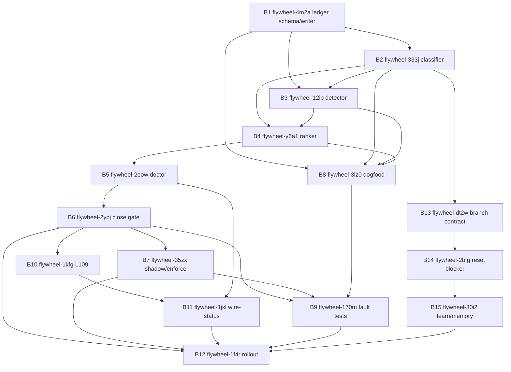

# Phase 4 DECOMPOSE: wire-or-explain tick gate

Plan: `wire-or-explain-tick-gate-2026-05-04`
Task: `woe-phase4-decompose-retry-477345`
Mode: APPLY, real `br create` + `br dep add`
Date: 2026-05-04

## Source Inputs

- Dispatch retry: `/tmp/dispatch_woe-phase4-decompose-retry-477345.md`
- Prior Phase 4 packet: `/tmp/dispatch_woe-phase4-decompose-82d8aa.md`
- Prior blocked receipt: `/tmp/woe-phase4-decompose-blocked.md`
- Beads DB recovery receipt: `/tmp/beadsdb-rebuild-recovery-output.md`
- Converged plan: `.flywheel/plans/wire-or-explain-tick-gate-2026-05-04/02-REFINE-r2.md`
- Audit confirmation: `.flywheel/plans/wire-or-explain-tick-gate-2026-05-04/03-AUDIT-r2-confirmation.md`
- L110 paradigm: `.flywheel/PARADIGM-substrate-self-organization-2026-05-04.md`

## Created Beads

| Plan ID | Bead ID | Priority | Title |
|---|---:|---:|---|
| B1 | flywheel-4m2a | P0 | [wire-or-explain] ledger schema and append-only writer |
| B2 | flywheel-333j | P0 | [wire-or-explain] ship-event classifier |
| B3 | flywheel-12ip | P0 | [wire-or-explain] wired detector |
| B4 | flywheel-y6a1 | P0 | [wire-or-explain] wire-priority ranker |
| B5 | flywheel-2eow | P0 | [wire-or-explain] doctor fields |
| B6 | flywheel-2ypj | P0 | [wire-or-explain] tick-close gate |
| B7 | flywheel-35zx | P0 | [wire-or-explain] shadow enforce override |
| B8 | flywheel-3iz0 | P0 | [wire-or-explain] dogfood import 2026-05-04 |
| B9 | flywheel-170m | P0 | [wire-or-explain] fault-injection tests |
| B10 | flywheel-1kfg | P1 | [wire-or-explain] L109 three-surface doctrine |
| B11 | flywheel-1jkl | P1 | [wire-or-explain] wire-status operator surface |
| B12 | flywheel-1f4r | P1 | [wire-or-explain] cross-orch fleet rollout |
| B13 | flywheel-dt2w | P0 | [wire-or-explain] dispatch worker-side branch enforcement |
| B14 | flywheel-2bfg | P0 | [wire-or-explain] DCG orphan reset blocker |
| B15 | flywheel-30i2 | P1 | [wire-or-explain] substrate-loss memory and learn promotion |

Count: 15/15.

## DAG



## Dependency Wiring

Command shape used: `br dep add <child> <parent>`, where the child depends on the parent.

| Child | Parent | Child ID | Parent ID |
|---|---|---:|---:|
| B2 | B1 | flywheel-333j | flywheel-4m2a |
| B3 | B1 | flywheel-12ip | flywheel-4m2a |
| B3 | B2 | flywheel-12ip | flywheel-333j |
| B4 | B2 | flywheel-y6a1 | flywheel-333j |
| B4 | B3 | flywheel-y6a1 | flywheel-12ip |
| B5 | B4 | flywheel-2eow | flywheel-y6a1 |
| B6 | B5 | flywheel-2ypj | flywheel-2eow |
| B7 | B6 | flywheel-35zx | flywheel-2ypj |
| B8 | B1 | flywheel-3iz0 | flywheel-4m2a |
| B8 | B2 | flywheel-3iz0 | flywheel-333j |
| B8 | B3 | flywheel-3iz0 | flywheel-12ip |
| B8 | B4 | flywheel-3iz0 | flywheel-y6a1 |
| B9 | B6 | flywheel-170m | flywheel-2ypj |
| B9 | B7 | flywheel-170m | flywheel-35zx |
| B9 | B8 | flywheel-170m | flywheel-3iz0 |
| B10 | B6 | flywheel-1kfg | flywheel-2ypj |
| B11 | B10 | flywheel-1jkl | flywheel-1kfg |
| B11 | B5 | flywheel-1jkl | flywheel-2eow |
| B12 | B6 | flywheel-1f4r | flywheel-2ypj |
| B12 | B7 | flywheel-1f4r | flywheel-35zx |
| B12 | B11 | flywheel-1f4r | flywheel-1jkl |
| B13 | B2 | flywheel-dt2w | flywheel-333j |
| B14 | B13 | flywheel-2bfg | flywheel-dt2w |
| B15 | B14 | flywheel-30i2 | flywheel-2bfg |
| B12 | B9 | flywheel-1f4r | flywheel-170m |
| B12 | B15 | flywheel-1f4r | flywheel-30i2 |

Dependencies added: 26.

## Audit Absorption Ledger

| Audit input | Required edits | Applied in beads | Result |
|---|---:|---|---|
| Finding 9 substrate-loss edits | 5 | B1, B2, B13, B14, B15 | 5/5 |
| Finding 10 skill-promotion handoff edits | 9 | B1, B2, B3, B5, B6, B8, B9, B11, B15 | 9/9 |
| Jeff/external prior-art edits | 15 | B1-B15 descriptions cite/absorb their assigned prior-art deltas | 15/15 |
| Audit finding coverage | 41 | B1-B15 collectively cover the converged r2 + r2-confirmation finding register | 41/41 |

## L110 Absorption

L110 was absorbed into B1/B2/B3 instead of creating a new bead:

- B1 schema requires `artifact_class`, consumer/deferral fields, owner, action ledger, verification probe, tick/status consequence, auto-fire trigger, and drain receipt shape.
- B1 includes the exact primitive sentence: "every durable observation/finding/artifact must declare its stock, class, consumer or explicit deferral, owner, action ledger, verification probe, and tick/status consequence".
- B2 classifies `artifact_class=skill_candidate` rows from feedback/fuckup/memory sources.
- B3 treats skillos relay ledger plus send receipt as consumer proof and missing relay proof as unwired/questionable.

Verdict: `l110_absorbed_in_b1_b2_b3=yes`.

## Beads Substrate Notes

The retry began with the required pre-flight green:

```text
br ready --json | jq length  # 20
sqlite3 .beads/beads.db "PRAGMA integrity_check;"  # ok
```

During writes, the Beads DB reproduced the known root-page cursor/export-hash class. Recovery was bounded and local:

- Exported the 15 newly created rows through SQLite before rebuilding.
- Repaired the previous recovery-test row prefix from `bd-1k1k` to `flywheel-1k1k` so JSONL import honors the flywheel prefix.
- Rebuilt `.beads/beads.db` from `.beads/issues.jsonl`.
- Repaired imported comments/events bookkeeping rows and cleared `export_hashes` before final flush.
- Final DB integrity: `ok`.

## Verification

```text
sqlite3 .beads/beads.db "select count(*) from issues where title like '[wire-or-explain]%';"  # 15
sqlite3 .beads/beads.db "select count(*) from dependencies where issue_id in (...new bead ids...);"  # 26
br dep cycles  # No dependency cycles detected
/tmp/beads_rust_build_v0126_20260504T232321Z/target/release/br dep cycles  # No dependency cycles detected
sqlite3 .beads/beads.db "PRAGMA integrity_check;"  # ok
```

## Callback Values

```text
self_grade=Y
beads_created=15/15
deps_added=26
br_dep_cycles_empty=yes
audit_findings_mitigated=41/41
finding9_edits_applied=5/5
finding10_edits_applied=9/9
jeff_external_edits_applied=15/15
l110_absorbed_in_b1_b2_b3=yes
beads_db_integrity_post_writes=ok
```
