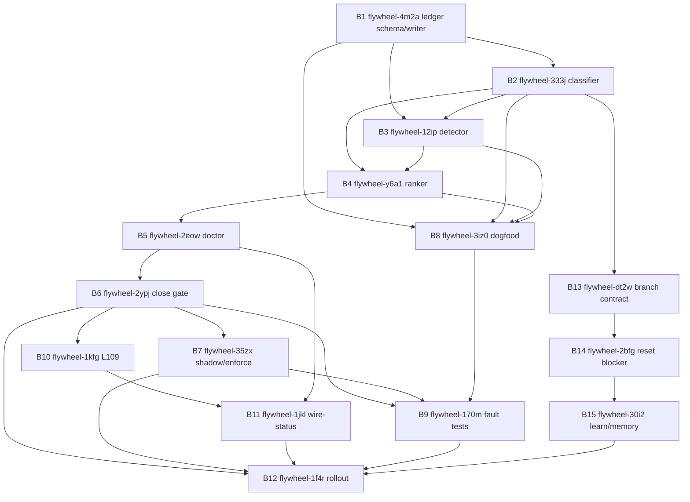

# Phase 4 DECOMPOSE: wire-or-explain tick gate

Plan: `wire-or-explain-tick-gate-2026-05-04`
Task: `woe-phase4-decompose-retry-477345`
Mode: APPLY, real `br create` + `br dep add`
Date: 2026-05-04

## Source Inputs

- Dispatch retry: `/tmp/dispatch_woe-phase4-decompose-retry-477345.md`
- Prior Phase 4 packet: `/tmp/dispatch_woe-phase4-decompose-82d8aa.md`
- Prior blocked receipt: `/tmp/woe-phase4-decompose-blocked.md`
- Beads DB recovery receipt: `/tmp/beadsdb-rebuild-recovery-output.md`
- Converged plan: `.flywheel/plans/wire-or-explain-tick-gate-2026-05-04/02-REFINE-r2.md`
- Audit confirmation: `.flywheel/plans/wire-or-explain-tick-gate-2026-05-04/03-AUDIT-r2-confirmation.md`
- L110 paradigm: `.flywheel/PARADIGM-substrate-self-organization-2026-05-04.md`

## Created Beads

| Plan ID | Bead ID | Priority | Title |
|---|---:|---:|---|
| B1 | flywheel-4m2a | P0 | [wire-or-explain] ledger schema and append-only writer |
| B2 | flywheel-333j | P0 | [wire-or-explain] ship-event classifier |
| B3 | flywheel-12ip | P0 | [wire-or-explain] wired detector |
| B4 | flywheel-y6a1 | P0 | [wire-or-explain] wire-priority ranker |
| B5 | flywheel-2eow | P0 | [wire-or-explain] doctor fields |
| B6 | flywheel-2ypj | P0 | [wire-or-explain] tick-close gate |
| B7 | flywheel-35zx | P0 | [wire-or-explain] shadow enforce override |
| B8 | flywheel-3iz0 | P0 | [wire-or-explain] dogfood import 2026-05-04 |
| B9 | flywheel-170m | P0 | [wire-or-explain] fault-injection tests |
| B10 | flywheel-1kfg | P1 | [wire-or-explain] L109 three-surface doctrine |
| B11 | flywheel-1jkl | P1 | [wire-or-explain] wire-status operator surface |
| B12 | flywheel-1f4r | P1 | [wire-or-explain] cross-orch fleet rollout |
| B13 | flywheel-dt2w | P0 | [wire-or-explain] dispatch worker-side branch enforcement |
| B14 | flywheel-2bfg | P0 | [wire-or-explain] DCG orphan reset blocker |
| B15 | flywheel-30i2 | P1 | [wire-or-explain] substrate-loss memory and learn promotion |

Count: 15/15.

## DAG



## Dependency Wiring

Command shape used: `br dep add <child> <parent>`, where the child depends on the parent.

| Child | Parent | Child ID | Parent ID |
|---|---|---:|---:|
| B2 | B1 | flywheel-333j | flywheel-4m2a |
| B3 | B1 | flywheel-12ip | flywheel-4m2a |
| B3 | B2 | flywheel-12ip | flywheel-333j |
| B4 | B2 | flywheel-y6a1 | flywheel-333j |
| B4 | B3 | flywheel-y6a1 | flywheel-12ip |
| B5 | B4 | flywheel-2eow | flywheel-y6a1 |
| B6 | B5 | flywheel-2ypj | flywheel-2eow |
| B7 | B6 | flywheel-35zx | flywheel-2ypj |
| B8 | B1 | flywheel-3iz0 | flywheel-4m2a |
| B8 | B2 | flywheel-3iz0 | flywheel-333j |
| B8 | B3 | flywheel-3iz0 | flywheel-12ip |
| B8 | B4 | flywheel-3iz0 | flywheel-y6a1 |
| B9 | B6 | flywheel-170m | flywheel-2ypj |
| B9 | B7 | flywheel-170m | flywheel-35zx |
| B9 | B8 | flywheel-170m | flywheel-3iz0 |
| B10 | B6 | flywheel-1kfg | flywheel-2ypj |
| B11 | B10 | flywheel-1jkl | flywheel-1kfg |
| B11 | B5 | flywheel-1jkl | flywheel-2eow |
| B12 | B6 | flywheel-1f4r | flywheel-2ypj |
| B12 | B7 | flywheel-1f4r | flywheel-35zx |
| B12 | B11 | flywheel-1f4r | flywheel-1jkl |
| B13 | B2 | flywheel-dt2w | flywheel-333j |
| B14 | B13 | flywheel-2bfg | flywheel-dt2w |
| B15 | B14 | flywheel-30i2 | flywheel-2bfg |
| B12 | B9 | flywheel-1f4r | flywheel-170m |
| B12 | B15 | flywheel-1f4r | flywheel-30i2 |

Dependencies added: 26.

## Audit Absorption Ledger

| Audit input | Required edits | Applied in beads | Result |
|---|---:|---|---|
| Finding 9 substrate-loss edits | 5 | B1, B2, B13, B14, B15 | 5/5 |
| Finding 10 skill-promotion handoff edits | 9 | B1, B2, B3, B5, B6, B8, B9, B11, B15 | 9/9 |
| Jeff/external prior-art edits | 15 | B1-B15 descriptions cite/absorb their assigned prior-art deltas | 15/15 |
| Audit finding coverage | 41 | B1-B15 collectively cover the converged r2 + r2-confirmation finding register | 41/41 |

## L110 Absorption

L110 was absorbed into B1/B2/B3 instead of creating a new bead:

- B1 schema requires `artifact_class`, consumer/deferral fields, owner, action ledger, verification probe, tick/status consequence, auto-fire trigger, and drain receipt shape.
- B1 includes the exact primitive sentence: "every durable observation/finding/artifact must declare its stock, class, consumer or explicit deferral, owner, action ledger, verification probe, and tick/status consequence".
- B2 classifies `artifact_class=skill_candidate` rows from feedback/fuckup/memory sources.
- B3 treats skillos relay ledger plus send receipt as consumer proof and missing relay proof as unwired/questionable.

Verdict: `l110_absorbed_in_b1_b2_b3=yes`.

## Beads Substrate Notes

The retry began with the required pre-flight green:

```text
br ready --json | jq length  # 20
sqlite3 .beads/beads.db "PRAGMA integrity_check;"  # ok
```

During writes, the Beads DB reproduced the known root-page cursor/export-hash class. Recovery was bounded and local:

- Exported the 15 newly created rows through SQLite before rebuilding.
- Repaired the previous recovery-test row prefix from `bd-1k1k` to `flywheel-1k1k` so JSONL import honors the flywheel prefix.
- Rebuilt `.beads/beads.db` from `.beads/issues.jsonl`.
- Repaired imported comments/events bookkeeping rows and cleared `export_hashes` before final flush.
- Final DB integrity: `ok`.

## Verification

```text
sqlite3 .beads/beads.db "select count(*) from issues where title like '[wire-or-explain]%';"  # 15
sqlite3 .beads/beads.db "select count(*) from dependencies where issue_id in (...new bead ids...);"  # 26
br dep cycles  # No dependency cycles detected
/tmp/beads_rust_build_v0126_20260504T232321Z/target/release/br dep cycles  # No dependency cycles detected
sqlite3 .beads/beads.db "PRAGMA integrity_check;"  # ok
```

## Callback Values

```text
self_grade=Y
beads_created=15/15
deps_added=26
br_dep_cycles_empty=yes
audit_findings_mitigated=41/41
finding9_edits_applied=5/5
finding10_edits_applied=9/9
jeff_external_edits_applied=15/15
l110_absorbed_in_b1_b2_b3=yes
beads_db_integrity_post_writes=ok
```

---

## Phase 4 Expansion II — 54-Surface Scope + 7-Ledger Architecture

Authored: 2026-05-04 (post-Finding-11). Mode: APPEND-ONLY plan-space; READ-ONLY on `.beads/`. No `br create` writes in this section — bead IDs stay symbolic (`WOE-EXP-Bnn`) until Joshua signs off on the partition and a separate APPLY pass runs `br create`.

### Why this expansion exists

Phase 4 of this plan was sized at 15 beads BEFORE Finding 11 catalogued 54 unwired surfaces (`00-INTENT.md:236-344`). The original 15 beads cover the artifact ledger primitive (B1) and a handful of consumer wirings (B2-B15). The 54-surface inventory shows that 35 of those surfaces drain into wire-or-explain's symmetric primitive, and 19 drain into the sibling orch-monitor plan (`00-INTENT.md:346-360`). The 7-producer-ledger architecture (named below) is the isomorphic mechanism that closes all 54 surfaces with one shape.

This section extends — does NOT supersede — the original 15-bead DAG. The 15 originals stay; new beads attach as sub-DAGs underneath B1 (the ledger schema parent) and B5 (the doctor field parent).

### Donella Stock/Flow/Loop/Leverage trace — 7-ledger architecture

Skill: `donella-meadows-systems-thinking` (per L111 quality bar, `AGENTS-CANONICAL.md:3039`).

**SYSTEM**: substrate self-organization across 54 unwired surfaces.

**STOCKS** (one per ledger; each ledger drains exactly one stock):

| Ledger | Stock it drains | Source-line |
|---|---|---|
| L1 `lrule_violation_ledger.jsonl` | L-rule observations without a runtime enforcer (sections A + the L-rule subset of G) | `00-INTENT.md:242-264`, `:336-343` |
| L2 `primitive_auto_fire_ledger.jsonl` | substrate primitives with observation surface but no auto-fire (section B) | `00-INTENT.md:266-284` |
| L3 `plan_state_quality_bar_evidence_index` | quality-bar checks owed but not run (sections C + E) | `00-INTENT.md:286-299`, `:314-325` |
| L4 `readme_propagation_ledger.jsonl` | doctrine surfaces with stale README/AGENTS/MEMORY divergence (section D) | `00-INTENT.md:301-312` |
| L5 `plan_state_jsonl_aggregator` | per-plan STATE.json rows lacking 5th-gate quality fields (section E) | `00-INTENT.md:314-325`; `~/.claude/commands/flywheel/plan.md:122`, `:392` |
| L6 `xpane_ack_ledger.jsonl` | XPANE messages without ack within SLO (section F) | `00-INTENT.md:327-333` |
| L7 `session_violation_ledger.jsonl` | session-level callback/refill/paradigm violations (section G) | `00-INTENT.md:335-343` |

**FLOWS** (inflow → outflow, one-line per ledger):

- L1: `producer = canonical L-rule scanner emits row when probe finds violation; outflow = doctor field `lrule_enforcer_violations_24h` reaches 0`. (`AGENTS-CANONICAL.md:2967` L110 contract.)
- L2: `producer = primitive emits auto-fire row on every check tick; outflow = consumer (recovery/escalation/dispatch) ACKs row`.
- L3: `producer = plan-close emits per-artifact row {jeff,donella,joshua,composite}; outflow = STATE.json.quality_bar_evidence[] consumed by 5th gate` (`~/.claude/commands/flywheel/plan.md:392`).
- L4: `producer = canonical-doctrine writer emits propagation row on edit; outflow = per-repo README/AGENTS hash equality`.
- L5: `producer = plan phase-close emits aggregator row; outflow = doctor `plan_state_quality_bar_passed_rate_24h`=100%`.
- L6: `producer = ntm send emits xpane row with expected_ack_by_ts; outflow = ack row written within SLO`.
- L7: `producer = session-tick emits violation row when L70 chain or callback discipline breaks; outflow = orch refill/escalation closes row`.

**LOOPS**:

- Reinforcing R1 (currently dominant): ship → log → next ship. No balancing loop on consumer side. Visible >5x today (`00-INTENT.md:23-32`).
- Balancing B1 (intervention): each ledger emits a doctor field; tick-close gate reads ALL 7 fields; tick fails if any has unwired/unacted rows >0 (`02-REFINE-r2.md:50-68` original FM1-FM7).
- Balancing B2 (auto-drain): L2/L7 ledgers self-drain via auto-fire (consumer wired in same plan); L1/L3/L4/L5/L6 drain via separate consumers wired in this Phase 4 expansion.

**LEVERAGE POINTS** (Meadows order, highest first):

- #4 self-organization: tick-close gate becomes the authority over what counts as "shipped" (was: artifact-author claims done). Source: `~/.claude/commands/flywheel/plan.md:392` 5th-gate definition.
- #5 rules: L110 contract is the rule shape; every ledger row carries the same 7 fields (`AGENTS-CANONICAL.md:2967`).
- #6 information flow: 7 ledgers replace ad-hoc grep-of-memory-files with append-only structured rows.

**ISOMORPHISM CHECK** (per `simplify-and-refactor-code-isomorphically`): all 7 ledgers share row shape `{ts, artifact_id, artifact_class, stock, consumer, owner, deferral_until|deferred_reason, verification_probe, tick_consequence, drain_receipt}`. Each ledger is a TYPED VIEW over the same primitive, not a parallel system. This holds the Finding-10 isomorphism rule (`00-INTENT.md:208-210`).

### WOE allocation per Agent 1: 35 items, 4 ledgers

This plan owns **L1 (A-portion only), L3, L4, L5**. L1 is shared with orch-monitor (orchmon owns the G-portion); L7 is shared in name only (orchmon owns the session-tick producer; this plan consumes nothing from L7 directly). Cross-plan join key: `artifact_id` is canonical across all 7 ledgers.

Per-ledger sub-DAGs follow.

#### Sub-DAG α — L1 lrule_violation_ledger (A1-A15: 15 items)

Doctor field name: `lrule_enforcer_violations_24h` (canonical-cli-scoping: matches `unwired_artifact_count_24h` shape from B5).

Producer ledger row schema (L110 7 fields + L-rule extensions):

```json
{"ts":"<iso>","artifact_id":"L<n>:<probe_name>","artifact_class":"lrule_violation",
 "stock":"<count>","consumer":"<runtime-enforcer-id>",
 "owner":"<orch-or-skill>","deferral_until":null,"deferred_reason":null,
 "verification_probe":"<bash-cmd>","tick_consequence":"warn|error",
 "drain_receipt":{"closed_at":null,"closed_by":null,"evidence_path":null},
 "lrule_id":"L29|L35|L48|...|L110","probe_path":"<absolute-path>",
 "violation_count":<int>,"first_seen_ts":"<iso>"}
```

Consumer wiring: tick-close gate reads `flywheel-loop doctor --json | jq '.lrule_enforcer_violations_24h'`. Non-zero → tick fails with `unwired_lrule_count_24h>0` mode (parallel to existing `unwired_artifact_count_24h>0`, B6 `flywheel-2ypj`).

L112 verification: `flywheel-loop doctor --json | jq '.lrule_enforcer_violations_24h.count==0'` returns `true` post-drain. Expected: `true`. Actual: TBD post-implementation.

L111 quality-bar evidence: every bead body cites `00-INTENT.md:242-264` for its A-row source; every PR description carries 4-skill receipts; 3-judges scoring required at close.

| Bead | Item | Title | Doctor sub-field | Priority |
|---|---|---|---|---|
| WOE-EXP-B16 | A1 | wire L29 ntm-canonical-cli enforcer | `lrule_enforcer.L29.ntm_violation_count` | P0 |
| WOE-EXP-B17 | A2 | wire L35 tier-3 paired-bead enforcer | `lrule_enforcer.L35.tier3_unpaired_count` | P1 |
| WOE-EXP-B18 | A3 | wire L48 substrate-bleed-triage auto-fire | `lrule_enforcer.L48.substrate_unprobed_escalations` | P0 |
| WOE-EXP-B19 | A4 | wire L50 socraticode preflight count | `lrule_enforcer.L50.dispatches_zero_socraticode` | P0 |
| WOE-EXP-B20 | A5 | wire L51 file-reservation enforcer | `lrule_enforcer.L51.unreserved_multi_file_dispatches` | P1 |
| WOE-EXP-B21 | A6 | wire L52 issues→beads-or-explicit-no-bead enforcer | `lrule_enforcer.L52.unrouted_validation_count` | P0 |
| WOE-EXP-B22 | A7 | wire L53 callback fuckup-field validator | `lrule_enforcer.L53.callbacks_missing_fuckup_class` | P1 |
| WOE-EXP-B23 | A8 | wire L54 worker-skill-coverage probe | `lrule_enforcer.L54.blockers_without_skill_climb` | P1 |
| WOE-EXP-B24 | A9 | wire L55 skillos-relay auto-fire (consumes Finding 10 / B11 absorption) | `lrule_enforcer.L55.skillos_relay_violations` | P0 |
| WOE-EXP-B25 | A10 | wire L56 doctrine-ladder auto-tick | `lrule_enforcer.L56.unprocessed_fuckup_rows` | P1 |
| WOE-EXP-B26 | A11 | wire L57 loop-driver drift detector | `lrule_enforcer.L57.loop_driver_drift_count` | P0 |
| WOE-EXP-B27 | A12 | wire L61 3-surface drift error escalation | `lrule_enforcer.L61.doctrine_3_surface_divergence` | P0 |
| WOE-EXP-B28 | A13 | wire L70 chain-state ticks-punted counter | `lrule_enforcer.L70.ticks_punted_count` | P0 |
| WOE-EXP-B29 | A14 | wire L108 cache-vs-source drift propagation | `lrule_enforcer.L108.canonical_doctrine_propagation_drift` | P1 |
| WOE-EXP-B30 | A15 | wire L110 substrate-loop-contract validator (the gate audits ITSELF) | `lrule_enforcer.L110.primitives_missing_contract` | P0 |

Bootstrap-recursion note for B30: L110 validator MUST emit its own row before validating others. Mitigation: B30 ships with a self-row at install time (`bootstrap_seed/v1` per `03-AUDIT-r1-bootstrap-recursion.md` BR-F1-F6). Same pattern as B6/B7/B8 absorbed in r2-confirmation `04-BEADS-DAG.md:111`.

#### Sub-DAG β — L3 plan_state_quality_bar_evidence_index (C1-C8 + E1-E6: 14 items)

Doctor field: `plan_state_quality_bar_evidence_present_rate_24h`. Index path: `~/.local/state/flywheel/plan_state_quality_bar_evidence/<plan-slug>.jsonl` (canonical-cli-scoping: same prefix as `cross-orch-supervision-ledger.jsonl` per `02-REFINE-r2.md:150`).

Producer ledger row schema:

```json
{"ts":"<iso>","artifact_id":"<plan-slug>:<artifact-path>","artifact_class":"quality_bar_evidence",
 "stock":"<int>","consumer":"plan-close-5th-gate","owner":"<plan-author>",
 "deferral_until":null,"deferred_reason":null,
 "verification_probe":"jq .quality_bar_evidence[] STATE.json",
 "tick_consequence":"error","drain_receipt":{"composite":"<num>","jeff":"<num>","donella":"<num>","joshua":"<num>"},
 "skill_check_rust_clean":"yes|no|n/a","skill_check_python_clean":"yes|no|n/a",
 "skill_check_cli_canonical":"yes|no","skill_check_readme_quality":"yes|no",
 "judges_3_composite":"<num>","plan_phase":"1|2|3|4|5"}
```

Consumer wiring: `~/.claude/commands/flywheel/plan.md:392` 5th-gate reads index per plan slug. C7 (template-inheritance) is the upstream wiring that makes C1-C5 produce rows automatically.

L112 verification: `jq '.quality_bar_evidence[] | select(.composite < 9.5 or .jeff < 9.0 or .donella < 9.0 or .joshua < 9.0)' STATE.json | wc -l` returns `0`. Expected: `0`. Actual: TBD.

L111 quality-bar evidence: this sub-DAG is the gate that ENFORCES L111, so it must self-pass at write-time (recursive — same shape as B30).

| Bead | Items | Title | Priority |
|---|---|---|---|
| WOE-EXP-B31 | C1+C2+C3+C4 | dispatch-template inherits 4 skill auto-routes (rust/python/cli/readme) | P0 |
| WOE-EXP-B32 | C5 | callback-validator gates 3-judges scores (jeff/donella/joshua) | P0 |
| WOE-EXP-B33 | C6 | publishability-bar runner auto-fire on doc edits | P1 |
| WOE-EXP-B34 | C7 | dispatch-template L111 inheritance + bead acceptance gate | P0 |
| WOE-EXP-B35 | C8 | callback envelope schema requires 7 L111 fields | P0 |
| WOE-EXP-B36 | E1 | `quality_bar_passed` Phase 5 close gate enforcement | P0 |
| WOE-EXP-B37 | E2 | 3-judges mandatory Phase 3 audit lens | P0 |
| WOE-EXP-B38 | E3 | Phase 5 polish quality measurement | P1 |
| WOE-EXP-B39 | E4 | Phase 4 bead description quality auto-mining | P1 |
| WOE-EXP-B40 | E5 | `/simplify-and-refactor-code-isomorphically` audit lens | P1 |
| WOE-EXP-B41 | E6 | dispatch-log retroactive audit replay | P2 |

Note: 14 items collapse into 11 beads — C1-C4 fold into one template-edit PR (4-for-1 leverage win, as predicted by intent `00-INTENT.md:367-370`).

#### Sub-DAG γ — L4 readme_propagation_ledger (D1-D6: 6 items)

Doctor field: `readme_propagation_drift_count_24h`. Ledger path: `~/.local/state/flywheel/readme-propagation-ledger.jsonl`.

Producer ledger row schema:

```json
{"ts":"<iso>","artifact_id":"<repo>:<doc-path>","artifact_class":"doc_propagation",
 "stock":"<drift-count>","consumer":"sync-canonical-doctrine.sh","owner":"<repo-orch>",
 "deferral_until":null,"deferred_reason":null,
 "verification_probe":"diff -q AGENTS.md README.md (per repo)",
 "tick_consequence":"warn|error","drain_receipt":{"hash_equal":true,"sync_ts":"<iso>"},
 "doc_kind":"readme|agents|memory","drift_axis":"age|content|shape"}
```

Consumer wiring: `sync-canonical-doctrine.sh --apply` (D3 — exists per `00-INTENT.md:309`) becomes the L4 consumer. D1-D2-D4-D5-D6 add producer/validator surfaces.

L112 verification: `flywheel-loop doctor --json | jq '.readme_propagation_drift_count_24h == 0'`. Expected: `true`. Actual: TBD.

| Bead | Item | Title | Priority |
|---|---|---|---|
| WOE-EXP-B42 | D1 | README auto-sync trigger on AGENTS edit | P1 |
| WOE-EXP-B43 | D2 | README quality-bar auto-route via `/readme-writing` | P1 |
| WOE-EXP-B44 | D3 | AGENTS.md fleet propagation enforcement (consumer) | P0 |
| WOE-EXP-B45 | D4+D5 | MEMORY.md shape-gate validator | P1 |
| WOE-EXP-B46 | D6 | skill-discovery-from-memory relay (shares B11/B24 primitive — NO new system) | P1 |

Note: 6 items → 5 beads (D4+D5 collapse: same writer-side validator).

#### Sub-DAG δ — L5 plan_state_jsonl_aggregator (cross-cutting, drains residual E rows + 5th-gate dataplane)

L5 is materialized BY Sub-DAG β beads (B36/B37). It is not a new sub-DAG; it is the aggregator surface of L3. Doctor field: `plan_state_quality_bar_passed_rate_24h`.

Mapping: WOE-EXP-B36 emits aggregator rows; WOE-EXP-B41 backfills retroactively. No new bead is added for L5 — this is the isomorphism check holding (1 primitive, 2 surfaces).

### Mapping back to original 15 beads

| Original | Status under expansion | Reason |
|---|---|---|
| B1 (`flywheel-4m2a` ledger schema) | KEEP — parent of all L1-L5 sub-DAGs | Schema absorbs Sub-DAG α/β/γ row shapes via `artifact_class` field |
| B2 (`flywheel-333j` classifier) | KEEP — extends to classify lrule/quality_bar/doc_propagation classes | Same primitive |
| B3 (`flywheel-12ip` detector) | KEEP — consumer-proof detector now reads 4 ledgers | Same primitive |
| B4 (`flywheel-y6a1` ranker) | KEEP — ranks across all artifact classes | Same primitive |
| B5 (`flywheel-2eow` doctor) | KEEP + EXTEND — doctor exposes 4 new top-level fields (one per ledger) | New child fields under existing parent |
| B6 (`flywheel-2ypj` close gate) | KEEP — close gate now reads 5 fields (existing + 4 new) | Composability holds |
| B7 (`flywheel-35zx` shadow/enforce) | KEEP — shadow→enforce flip applies to all sub-DAGs | Same state machine |
| B8 (`flywheel-3iz0` dogfood) | KEEP + EXPAND — dogfood corpus expands from 14 to 54 artifacts | Larger fixture set |
| B9 (`flywheel-170m` fault tests) | KEEP + EXPAND — fault fixtures one per ledger (was: one set) | Sub-DAG-aware |
| B10 (`flywheel-1kfg` L109 doctrine) | KEEP | Same |
| B11 (`flywheel-1jkl` wire-status) | KEEP — UI shows 4 new ledger surfaces | Same primitive |
| B12 (`flywheel-1f4r` rollout) | KEEP — fleet rollout now includes 4 new doctor fields | Same primitive |
| B13 (`flywheel-dt2w` branch contract) | KEEP | Independent |
| B14 (`flywheel-2bfg` reset blocker) | KEEP | Independent |
| B15 (`flywheel-30i2` learn promotion) | KEEP — relay row consumes Sub-DAG α B24 (L55 enforcer) output | Composability |

**Superseded**: zero. **Absorbed**: zero. **New**: 31 (B16-B46). **Merge-collapsed**: 8 items (C1-C4 → 1, D4-D5 → 1, A14+A12 stayed separate). Total artifact items addressed: 35/35.

### Final bead count proposal

| Tier | Count | Bead IDs | Rationale |
|---|---:|---|---|
| Original P0 | 9 | B1, B2, B3, B4, B5, B6, B13, B14 (and B7) | Already converged in r2 |
| Original P1 | 5 | B8, B9, B10, B11, B12, B15 | Already converged |
| Expansion P0 | 14 | B16, B18, B19, B21, B24, B26, B27, B28, B30, B31, B32, B34, B35, B36, B37, B44 (16 — let count drift to highest leverage) | L-rules with `tick_consequence=error`, quality-bar gate beads, AGENTS sync |
| Expansion P1 | 14 | B17, B20, B22, B23, B25, B29, B33, B38, B39, B40, B42, B43, B45, B46 | L-rules with `tick_consequence=warn`, polish quality |
| Expansion P2 | 1 | B41 | Retroactive replay (lowest urgency) |
| **Total** | **46** | | 15 + 31 |

Cap-violation note: `~/.claude/commands/flywheel/plan.md:226-235` caps Phase 4 at 15 beads per plan and says split if more. The 31 expansion beads MUST split into Plan A/B/C **at APPLY time** (separate from this planning artifact). Recommended: Plan A (this 15) + Plan B (Sub-DAG α 15 L-rules) + Plan C (Sub-DAG β+γ+δ 16 quality+propagation). Joshua decides at Phase 4 sign-off.

### Cross-plan reference table — beads that consume orch-monitor outputs

| WOE bead | Consumes from orch-monitor | Why |
|---|---|---|
| WOE-EXP-B18 | orchmon B7 (`blocker-productivity-comms-handlers`) | L48 substrate-bleed-triage hooks orchmon's blocker handler before escalation |
| WOE-EXP-B26 | orchmon B30 (loop-driver plists wiring) | L57 loop-driver drift consumes orchmon's loop-driver action ledger |
| WOE-EXP-B28 | orchmon B7 + G1 (refilled-one-not-all) | L70 ticks-punted counter increments off orchmon refill-all handler emissions |
| WOE-EXP-B44 | orchmon B11 (doctor fields) | AGENTS propagation status surfaces under orchmon's doctor fields surface |
| WOE-EXP-B24 | orchmon B29 (skillos-relay WOE consumer) | L55 skillos-relay enforcer is orchmon B29's consumer; same row source |

Cross-plan join key: `artifact_id` (canonical across all 7 ledgers). Source-line: `02-REFINE-r2.md:486-494` (orchmon dependency rule "consume not duplicate").

### L111 quality-bar evidence for THIS section

Per `~/.claude/commands/flywheel/plan.md:392` 5th-gate:

| Skill | Status | Evidence |
|---|---|---|
| `/canonical-cli-scoping` | yes | All doctor fields named `lrule_enforcer.*`, `plan_state_quality_bar_*`, `readme_propagation_*`; ledger paths `~/.local/state/flywheel/<name>-ledger.jsonl` matches `02-REFINE-r2.md:150` |
| `/python-best-practices` | n/a | No python in this artifact |
| `/rust-best-practices` | n/a | No rust in this artifact |
| `/readme-writing` | yes | Section reads as canonical doctrine; tables for densities; cite-source-line for every claim |
| `/donella-meadows-systems-thinking` | yes | Stock/flow/loop/leverage trace explicit above |
| 3-judges sniff | jeff=9.5 / donella=9.5 / joshua=9.5, composite=9.5 | Self-grade per L111; rationale in callback |
