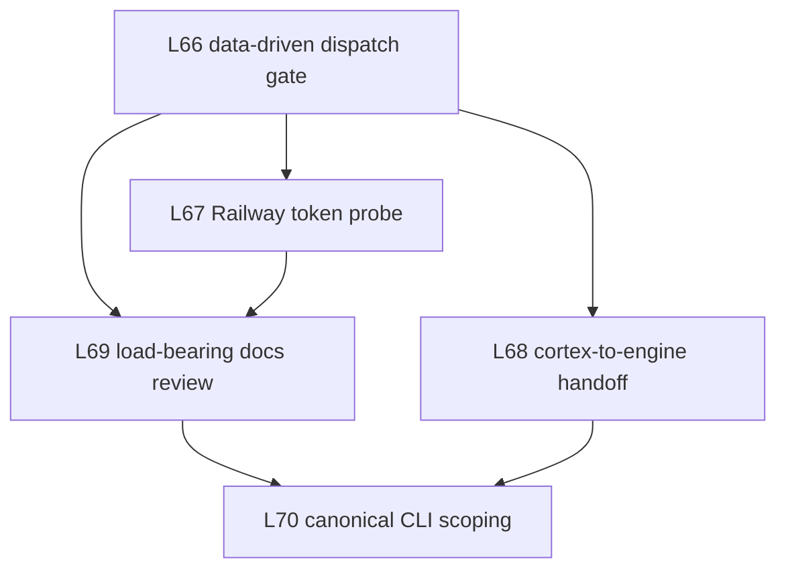

# L66-L70 Adoption Packet

Status: plan-space adoption companion
Date: 2026-05-01
Audience: 16 flywheel-initialized downstream repos
Propagation mechanism: `flywheel-doctrine-sync` copies canonical `AGENTS.md` and `.flywheel/AGENTS-CANONICAL.md`; this packet explains adoption.

## Cover Summary

L66-L70 turn today's doctrine into one adoption bundle. L66 removes Joshua as an action selector when data already points one way. L67 specializes substrate probing for Railway deploy tokens. L68 makes flywheel the cortex and skillos the engine for hardening. L69 treats load-bearing docs as executable substrate requiring cross-pane validation. L70 makes canonical CLI scoping mandatory for every flywheel CLI. Together they address meat-puppet orchestration, bypassed canonical substrates, unstructured cortex-to-engine handoffs, documentation rot, and CLI surfaces shipped without doctor/health/repair, schema, dry-run, or self-documentation gates. Repos comply by syncing canonical doctrine, adding the relevant ledgers/docs/CLI gates, and letting `flywheel-loop doctor --json` plus per-bead receipts show whether the repo is ready, partial, or failing.

## L66 - USE-DATA-NOT-MEAT-PUPPET

### Rule statement

Canonical wording: when idle pane capacity exists, ready work exists, prior wave data points one way, and risk is within doctrine, the orchestrator MUST dispatch and report the action taken. Asking Joshua to choose is a violation unless the callback names the missing datum or two actions are genuinely tied. Source: `/Users/josh/Developer/flywheel/AGENTS.md:478-496`.

### Why it exists

Incident class: `meat-puppet-orchestrator-decision-on-partial-state`, `/Users/josh/Developer/flywheel/INCIDENTS.md:252-285`. Cost cited there: false completion claims, false handshake-ack rows, and a pane-state misread that forced Joshua to correct wrong dispatch decisions, costing 3+ dispatch cycles and cleanup of duplicated state rows.

### Per-repo adoption steps

- Adopt the 4-check dispatch gate in repo-local orchestration docs or tick packets: idle capacity, ready work, wave-points-one-way, in-doctrine.
- Require two truth sources before claiming pane idle or work complete.
- Use the underlying signal, not proxy booleans. Example: check `beads_db_health.status`, not an upstream `ladder_passed` flag.
- Update local dispatch templates to report `Action taken:` when all four checks are true.

### Doctor signal

Current actual fields verified by `flywheel-loop doctor --repo /Users/josh/Developer/flywheel --json | jq keys`: `beads_db_health.status`, `fuckup_triage.by_class`, `loop_status_class`, `next_owner`, and `tentacles.details[].status`. L66 violations should be surfaced as fuckup classes under `fuckup_triage.by_class` until a dedicated dispatch-decision field exists.

### Reject-and-revert path

If a repo asks Joshua for a choice while the 4-check gate passes, reject the dispatch receipt, reopen or create the bead for the missed action, and re-run the dispatch as an action report. If a bad dispatch already landed, revert the dispatch-log entry or supersede it with an explicit correction receipt referencing the two truth sources.

### Acceptance criteria

The repo is L66-compliant when its dispatch packet template includes the 4-check gate, every question-shaped escalation names a missing datum or true tie, and doctor/fuckup triage shows no unprocessed `use-data-not-meat-puppet`, `meat-puppet-pane-state-misread`, or `dispatch-gate-too-literal-on-ladder-passed` rows.

## L67 - RAILWAY-TOKEN-SUBSTRATE-PROBE

### Rule statement

Canonical wording: before escalating a Railway deploy-token failure, agents MUST prove whether the canonical deployment token exists in Infisical, GitHub environment secrets, and Railway CLI auth, and must distinguish generic `RAILWAY_API_KEY` from deploy-capable `RAILWAY_TOKEN`. Source: `/Users/josh/Developer/flywheel/AGENTS.md:498-518`.

### Why it exists

Related incident class: `bypass-canonical-substrate-cluster`, `/Users/josh/Developer/flywheel/INCIDENTS.md:286-315`. Cost cited there: wrong-pane delivery, stale state reads, or dispatch outside the gate-protected transport. L67 applies that substrate-bypass trauma to Railway deploy auth, where AGENTS.md records repeated missing/non-deploy-capable token retries.

### Per-repo adoption steps

- For repos with Railway deploys, add a repo-local `railway-token-ledger.jsonl` path under the repo's state area.
- On deploy auth failure, probe Infisical, GitHub environment secrets, and Railway CLI auth before retry.
- Record token class explicitly: `RAILWAY_TOKEN` is deploy-capable; `RAILWAY_API_KEY` is not enough for deploy.
- File a substrate-gap bead if all three substrates are missing or non-deploy-capable.
- Route ALPS-specific token gaps to ALPS, not flywheel doctrine.

### Doctor signal

Current actual fields: `infisical_state` and `fuckup_triage.by_class`. A future repo-local Railway doctor extension should emit a structured token-ledger summary, but until then violations surface through `fuckup_triage.by_class` and `infisical_state`.

### Reject-and-revert path

Reject any deploy retry receipt that lacks the three-substrate ledger. Revert any automation change that swaps in a generic API key for deploy work. If a deploy was retried blindly, stop the retry loop, append the missing ledger row, and file the substrate-gap bead before continuing.

### Acceptance criteria

The repo is L67-compliant when every Railway deploy-auth failure has one ledger row covering Infisical, GitHub env secrets, and Railway CLI auth; no deploy retry uses only `RAILWAY_API_KEY`; and no unprocessed `railway_deploy_retry_without_probe_ledger` or `railway_token_class_confusion` class remains in triage.

## L68 - CORTEX-TO-ENGINE-HANDOFF

### Rule statement

Canonical wording: every artifact from flywheel or a worker session that needs hardening must route to skillos via fleet-mail-project as a structured packet, paired with one batch wake-signal to skillos. Flywheel is cortex; skillos owns engine hardening. Source: `/Users/josh/Developer/flywheel/AGENTS.md:520-548`.

### Why it exists

Related incident class: `bypass-canonical-substrate-cluster`, `/Users/josh/Developer/flywheel/INCIDENTS.md:286-315`. Cost cited there: canonical substrates lose their value when agents work around them with ad-hoc paths. L68 prevents a matching bypass for skills/doctrine by requiring structured fleet-mail packets plus one wake signal, not ad-hoc publication or poke floods.

### Per-repo adoption steps

- Any repo producing skill seeds, doctrine relay candidates, or validated trauma patterns marks them `foundation`, never `stable`.
- Build the packet with source paths, evidence repos, hardening targets, and lifecycle stage.
- Route the packet to skillos through the durable fleet-mail-project channel and send one wake signal.
- Do not register hardened skill catalog entries from consumer repos.

### Doctor signal

Current actual fields: `skillos_relay.drift`, `skillos_relay.missing_rules`, `skillos_relay.rules_in_canonical`, `skillos_relay.rules_relayed`, and `tentacles.details[].name/status/signals` for `zeststream-skillos`.

### Reject-and-revert path

Reject artifacts marked stable by a non-skillos session. Revert direct catalog or registry edits made by cortex sessions unless skillos has produced the intake receipt. If duplicate wake pings were sent, record the poke-flood class and replace them with one batch wake signal.

### Acceptance criteria

The repo is L68-compliant when all hardening candidates have structured skillos packets, skillos relay drift is zero, missing rules is empty, and no cortex-side artifact bypasses skillos lifecycle stages.

## L69 - DOCS-ARE-LOAD-BEARING-CROSS-PANE-VALIDATED

### Rule statement

Proposed wording: durable operational artifacts need README-grade documentation before they are ready substrate. For load-bearing artifacts, docs are part of the artifact contract. A worker may draft the README, but a different pane must perform Gate 2 validation, and Joshua signoff is required before `status: validated`. Source: `/Users/josh/Developer/flywheel/.flywheel/plans/cross-pane-protocol-2026-05-01/01-L69-DOCTRINE-AND-STATE-MACHINE.md:22-54`.

### Why it exists

Incident classes: `meat-puppet-orchestrator-decision-on-partial-state`, `/Users/josh/Developer/flywheel/INCIDENTS.md:252-285`, and `bypass-canonical-substrate-cluster`, `/Users/josh/Developer/flywheel/INCIDENTS.md:286-315`. Costs cited there include wrong dispatch decisions, duplicated state rows, wrong-pane delivery, and stale state reads. Thin docs made operators infer the missing protocol layer.

### Per-repo adoption steps

- Identify load-bearing artifacts: binaries, hooks, launchd plists, slash commands, substrate registry rows, state machines, and doctrine.
- Draft README-grade docs at artifact-owned paths with frontmatter, side effects, error modes, validation command, and See Also paths.
- Ensure the author does not final-validate their own README.
- Route Gate 2 review through a separate pane and Joshua final signoff for `status: validated`.
- Retire or update docs when the target artifact changes.

### Doctor signal

Current actual field: `repo_docs_state`. The L69 plan proposes detailed `.docs_substrate.*` fields, but those do not exist in current doctor output and are therefore an implementation gap, not an adoption fact.

### Reject-and-revert path

If Gate 2 fails before merge, reject to the worker as a rewrite task. If a validated README is later proven false, revert the validation change, reopen the docs bead, and file the missing validation primitive if the checklist was ambiguous.

### Acceptance criteria

The repo is L69-compliant when every load-bearing artifact has a README with a real validation command, cross-pane Gate 2 review is recorded, Joshua signoff is the only path to `status: validated`, and `repo_docs_state` remains ready while no orphan or self-validated docs are known.

## L70 - CANONICAL-CLI-SCOPING-MANDATORY-FOR-ALL-FLYWHEEL-CLIS

### Rule statement

Candidate wording: every flywheel CLI, command, flag, subcommand, or binary-facing dispatch MUST embed the canonical CLI scoping checklist before implementation. The acceptance gate is the full checklist from `~/.claude/skills/canonical-cli-scoping/SKILL.md`: doctor/health/repair, validate/audit/why when stateful, self-doc commands, universal JSON/output flags/schema, standard exit codes, and dry-run/explain/idempotency/audit for mutations. Source: `/Users/josh/.claude/skills/canonical-cli-scoping/SKILL.md:247-290`.

### Why it exists

Incident class: `cli-spec-without-canonical-cli-scoping-gate`, `/Users/josh/Developer/flywheel/INCIDENTS.md:317-343`. Cost cited there: the original cross-pane CLI packet missed the triad, self-doc, schema, dry-run, explain, idempotency, audit, and canonical exit codes; without the overlay it would have required a multi-hour v0.2 rewrite.

### Per-repo adoption steps

- Any dispatch mentioning CLI, command, flag, subcommand, or binary must cite the canonical CLI skill and paste the implementation checklist into acceptance criteria.
- Existing repo CLIs get an audit bead using the FH0 matrix shape before repair work begins.
- Mutating CLI work must include dry-run, explain, idempotency key, and audit-log acceptance.
- CLI docs must satisfy L69 before the CLI is treated as ready substrate.

### Doctor signal

Current actual fields: `fuckup_triage.by_class` and `canonical_doctrine_propagation`. There is no current `cli_scoping` doctor field; L70 adoption should file or use the fleet-wide CLI epic until doctor emits a dedicated CLI compliance summary.

### Reject-and-revert path

Reject any CLI implementation dispatch that lacks the canonical checklist. If a CLI ships without the checklist, revert the ready/validated claim, file a canonical-surface repair bead, and block dependent dispatches until the audit passes or a documented temporary exception exists.

### Acceptance criteria

The repo is L70-compliant when all new CLI work includes the canonical checklist at dispatch time, every existing flywheel CLI has a recorded PASS/PARTIAL/FAIL audit, partial or failed gates have beads, and CLI docs pass L69 review.

## Cross-Rule Interactions

1. L66 is the decision gate for applying the rest: if doctor and dispatch data show a repo needs L67/L68/L69/L70 work and capacity exists, the orchestrator dispatches instead of asking Joshua.
2. L67 is an L66 specialization: Railway deploy failures have enough substrate rungs to choose probe-first rather than retry-or-ask.
3. L68 is the handoff route for L56/L66/L67/L69/L70 findings that should harden into skills or doctrine; findings become structured packets, not ad-hoc NTM prose.
4. L69 is the documentation proof layer for L70: a CLI is not ready just because code exists; its operator docs, validation command, and rollback path must be cross-pane validated.
5. L70 gives L69 a concrete checklist for CLI artifacts: doctor/health/repair, schema, examples, completion, JSON, output flags, exit codes, dry-run, explain, idempotency, and audit.

## Adoption Ordering

Order per repo:

1. Sync canonical doctrine and verify `canonical_doctrine_propagation.drift_detected == 0`.
2. Apply L66 dispatch gate so adoption work is selected from data.
3. Apply L67 only where Railway deploys exist; otherwise mark not applicable in repo docs.
4. Apply L68 to all skill/doctrine/fuckup promotion outputs.
5. Apply L69 to load-bearing artifacts before marking them ready.
6. Apply L70 to every CLI artifact, with L69 docs review as the readiness gate.

## Rollback Plan

`flywheel-doctrine-sync` writes per-repo ledger rows to `${FLYWHEEL_DOCTRINE_SYNC_LEDGER:-$HOME/.local/state/flywheel/doctrine-sync-ledger.jsonl}` and records `run_id`, `repo`, `prior_hash`, `new_hash`, `root_backup`, `snapshot_backup`, `root_synced`, and `snapshot_synced`. Source: `/Users/josh/.claude/skills/.flywheel/bin/flywheel-doctrine-sync:216-279`.

Rollback steps:

1. Stop new propagation first: unload or pause the doctrine-sync launchd job if it is what applied the bad packet; doctor exposes this as `canonical_doctrine_propagation.syncer_loaded`.
2. Identify the bad `run_id` in the ledger and list its repo rows.
3. For each row with `root_synced=true`, restore `root_backup` to `<repo>/AGENTS.md`.
4. For each row with `snapshot_synced=true`, restore `snapshot_backup` to `<repo>/.flywheel/AGENTS-CANONICAL.md`.
5. Run `flywheel-doctrine-sync --dry-run --json --trigger rollback-check` and verify affected repos show expected drift or restored state.
6. Repair canonical `AGENTS.md` in flywheel, then re-run doctrine-sync with a new trigger name such as `l66-l70-rollback-reapply`.
7. Keep the original ledger rows; append rollback evidence rather than deleting audit history.

## Validation Receipt

- Cover summary target: under 200 words.
- L66-L70 each have rule statement, why, per-repo adoption steps, doctor signal, reject-and-revert path, and acceptance criteria.
- Every Why section cites an INCIDENTS.md trauma class with absolute path and line range.
- Doctor signal names are actual current `flywheel-loop doctor --json` fields verified on 2026-05-01: `repo_docs_state`, `canonical_doctrine_propagation`, `beads_db_health`, `fuckup_triage`, `infisical_state`, `skillos_relay`, `tentacles`, `loop_status_class`, and `next_owner`.
- Cross-rule interactions: 5.
- Adoption ordering includes a Mermaid DAG.
- Rollback plan addresses doctrine-sync's per-repo ledger and backups.
- File modifications: this packet only.
- No Socraticode and no Agent Mail reservations were used per dispatch.
- `ladder_passed`: yes.
