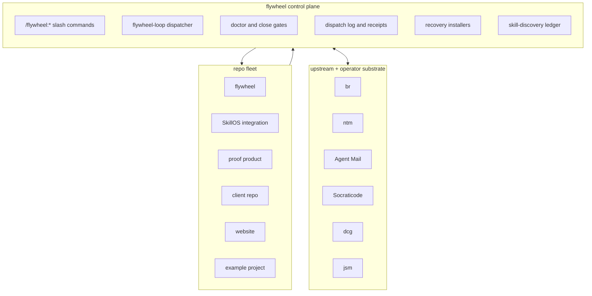

# Flywheel Architecture

> The control room for an agentic software workflow. README is the front door;
> this is how the room is wired.

Mission anchor:

> *continuous-orchestrator-uptime-self-sustaining-fleet*

Flywheel owns the orchestration substrate, not product code. It turns doctrine,
plans, beads, optional NTM sessions, Agent Mail, Socraticode, recovery scripts,
and skills into one operating loop: pick useful work, dispatch it, verify it,
close it, and keep the panes hot.

## Three Layers

Workers work. Flywheel keeps the work loop alive. That is the whole shape.

## Repo Substrate

| Surface | Role |
|---|---|
| `.flywheel/AGENTS-CANONICAL.md` | Canonical L-rule snapshot installed into flywheel-managed repos. |
| `.flywheel/PLANS/` | Plan-space truth: research, convergence, audits, synthesis, and phase receipts. |
| `.flywheel/scripts/` | Close gates, recovery probes, dispatch validators, quality bars, and migration helpers. |
| `.flywheel/receipts/` | Machine-readable receipts for audits, installs, tests, and three-judges checks. |
| `.flywheel/handoffs/` | Peer-orchestrator handoff path. |
| `.flywheel/dispatch-log.jsonl` | Dispatch ledger with callback state, mission fitness, topology, and pane-state source. |
| `.beads/` | Repo-local Beads database. Active content is mutated only through `br`. |
| `tests/` | Regression harness for doctrine gates, dispatch contracts, recovery, and portable install behavior. |

## Runtime Shape

The active runtime lives under `~/.claude/skills/.flywheel/`. After the
post-monolith split, `bin/flywheel-loop` is a thin dispatcher and the behavior
lives in `lib/*.sh` modules. The line-count invariant is intentional:
`monolith_size_regression` keeps the dispatcher from becoming the system again.

The dispatcher pattern is:

1. Parse the command.
2. Route to a focused `lib/<domain>.sh` module.
3. Emit JSON where callers need machine truth.
4. Let doctor expose health, drift, and recovery signals instead of burying
   them in shell control flow.

## Orchestrator Surfaces

| Surface | What it owns |
|---|---|
| `/flywheel:tick` | Tick phases, callback reap, hot-pane refill, plan/bead routing, and loop closeout. |
| `/flywheel:dispatch` | Worker dispatch packets, dispatch-log rows, wrapper proof, callback contract, and Socraticode mandate. |
| `/flywheel:status` | Fleet health, callback backlog, recovery state, and worker readiness. |
| `/flywheel:loop` | Repeated loop execution. Monitor mode wakes on work instead of burning idle minutes. |
| `/flywheel:respawn` | Pane recovery and manual respawn receipts. |
| `/flywheel:README` | Human-facing repo map and polish surface. |

## Dispatch-Trust Tripod

Dispatch trust now has three mechanical legs:

1. **Callback contract gate.** DONE callbacks must carry L120-L128 fields,
   including close evidence, Socraticode counts, DID/DIDNT/GAPS, and numeric
   indexed chunks.
2. **`dispatch_skill_required` gate.** Worker-dispatch-shaped sends must prove
   they came through `/flywheel:dispatch`, or carry an explicit override.
3. **NTM pane-state gate.** Dispatch context records `pane_state_source` and
   uses `ntm health`, `ntm copy`, `ntm grep`, and `ntm save` as the canonical
   pane-state verbs.

The point is boring: no dispatch row, no callback grammar, no pane-state proof,
no trust.

## Recovery System

The recovery-system arc turns reboot survivability into a measured substrate.
B01 defined the recovery skill contract. B02 shipped the preinstall audit. B04
through B14 install per-session launchd watchers, validate exactly-one-label
invariants, emit status rows under `.flywheel/receipts/`, and feed doctor
coverage. The status rows must say `reboot_recovery_claimed=false` until the
watcher is actually activated and survives a real reboot.

## Skill Discovery

`flywheel-loop skill-discovery` writes append-only rows to
`~/.local/state/flywheel/skill-discoveries.jsonl`. Workers record reusable
patterns with stable `sd-*` identifiers, discovery kind, evidence, promotion
signal, and whether the pattern should become a skill. This is the LEARN/REUSE
substrate: no more rediscovering the same fix in five repos.

## Close and Evidence Gates

Flywheel treats every plan as a hypothesis. The close doctrine wires six
mechanisms into close:

- hypothesis slate with kill conditions
- prediction-lock receipts
- ADD/EDIT/KILL idea-duel deltas
- convergence telemetry
- EV-anchored evidence with supports/refutes/informs relations
- `/brenner` research surfaces for queryable evidence

Close can refuse. That is the feature.

## Sediment Policy

Backups, failed Beads repairs, preview diffs, and cache files are not system
memory. Durable memory lives in Beads, receipts, handoffs, plans, INCIDENTS,
Agent Mail, and JSONL ledgers. Sediment gets archived under `.git-archive/` or
`/tmp`, then ignored.
